# Appearance

This section deals with the appearance of TreeViewAdv control and contains the following topics:

## Customizing the appearance of the TreeViewAdv

The TreeViewAdv appearance is customized by using the appearance properties available in the control. You can set the color for the Foreground, Background, Selected Item Foreground, Selected Item Background, MouseOver Foreground and MouseOver Background of TreeViewAdv control.

* **SelectedBackground:** Gets or sets the background color of the selected treeview item
* **SelectedForeground:** Gets or sets the foreground color of the selected treeview item
* **MouseOverForeground:** Gets or sets the foreground color of the treeview item over which the mouse pointer moves
* **MouseOverBackground:** Gets or sets the background color of the treeview item over which the mouse pointer moves
* **SelectionUnfocussedBackground:** Gets or sets the background color of the selected treeview item when the item loses focus

The following code example illustrates the above property settings.

 

<!-- Adding TreeViewAdv With Brushes -->
<syncfusion:TreeViewAdv MouseOverBackground="Aqua" MouseOverForeground="Magenta" Name="treeViewAdv" SelectedBackground="Orange" SelectedForeground="Red" SelectionUnfocussedBackcolor="Gold">
<!-- Adding TreeViewItemAdv -->
<syncfusion:TreeViewItemAdv Header="Marital Status">
<syncfusion:TreeViewItemAdv Header="Single"/>
<syncfusion:TreeViewItemAdv Header="Married"/>
<syncfusion:TreeViewItemAdv Header="Married with Children"/>
</syncfusion:TreeViewItemAdv>
<syncfusion:TreeViewItemAdv Header="Baby Vaccines">
<syncfusion:TreeViewItemAdv Header="Hepatitis B"/>
<syncfusion:TreeViewItemAdv Header="Tetanus"/>
<syncfusion:TreeViewItemAdv Header="Polio"/>
<syncfusion:TreeViewItemAdv Header="Measles"/>
</syncfusion:TreeViewItemAdv>
<syncfusion:TreeViewItemAdv Header="Country Information"/>
</syncfusion:TreeViewAdv>





// Set MouseOverBackground property
treeViewAdv.MouseOverBackground = Brushes.Aqua;

// Set MouseOverForeground property
treeViewAdv.MouseOverForeground = Brushes.Magenta;

// Set SelectedBackground property
treeViewAdv.SelectedBackground = Brushes.Orange;

// Set SelectedForeground property
treeViewAdv.SelectedForeground = Brushes.Red;

// Set SelectionUnfocussedBackcolor property
treeViewAdv.SelectionUnfocussedBackcolor = Brushes.Gold;





' Set MouseOverBackground property
treeViewAdv.MouseOverBackground = Brushes.Aqua

' Set MouseOverForeground property
treeViewAdv.MouseOverForeground = Brushes.Magenta

' Set SelectedBackground property
treeViewAdv.SelectedBackground = Brushes.Orange

' Set SelectedForeground property
treeViewAdv.SelectedForeground = Brushes.Red

' Set SelectionUnfocussedBackcolor property
treeViewAdv.SelectionUnfocussedBackcolor = Brushes.Gold



  

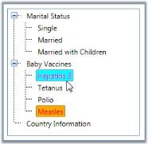

## Setting Visual Style

The appearance of the TreeViewAdv control is customized by using the VisualStyle property. It gets or sets the visual style for the TreeViewAdv control.

The various built-in visual styles are listed below.

* Blend
* Office2003
* Office2007Blue
* Office2007Black
* Office2007Silver
* Office2010Blue
* Office2010Black
* Office2010Silver
* ShinyBlue
* ShinyRed
* SyncOrange
* VS2010
* Metro
* Transparent





<!-- Adding TreeViewAdv with visual style -->
<syncfusion:TreeViewAdv Name="treeViewAdv" syncfusion:SkinStorage.VisualStyle="Transparent">
<!-- Adding TreeViewItemAdv -->
<syncfusion:TreeViewItemAdv Header="Marital Status">
<syncfusion:TreeViewItemAdv Header="Single"/>
<syncfusion:TreeViewItemAdv Header="Married"/>
<syncfusion:TreeViewItemAdv Header="Married with Children"/>
</syncfusion:TreeViewItemAdv>
<syncfusion:TreeViewItemAdv Header="Baby Vaccines">
<syncfusion:TreeViewItemAdv Header="Hepatitis B"/>
<syncfusion:TreeViewItemAdv Header="Tetanus"/>
<syncfusion:TreeViewItemAdv Header="Polio"/>
<syncfusion:TreeViewItemAdv Header="Measles"/>
</syncfusion:TreeViewItemAdv>
<syncfusion:TreeViewItemAdv Header="Country Information">
<syncfusion:TreeViewItemAdv Header="Canada"/>
<syncfusion:TreeViewItemAdv Header="France"/>
<syncfusion:TreeViewItemAdv Header="Germany"/>
<syncfusion:TreeViewItemAdv Header="UK"/>
<syncfusion:TreeViewItemAdv Header="USA"/>
</syncfusion:TreeViewItemAdv>
</syncfusion:TreeViewAdv>





//Setting the visual style as Blend
SkinStorage.SetVisualStyle(treeViewAdv, "Blend");





'Setting the visual style as Blend
SkinStorage.SetVisualStyle(treeViewAdv, "Blend")



  

**Blend theme**

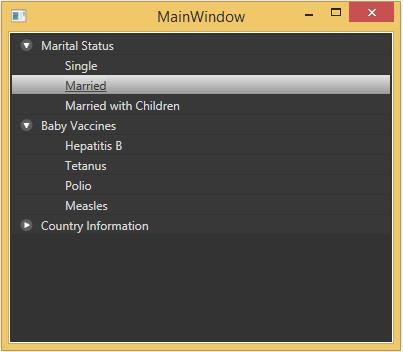

**Office2003 theme**

**Office2007Blue theme**

**Office2007Black theme**

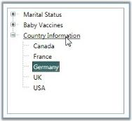

**Office2007Silver theme**

**Office2010Blue theme**

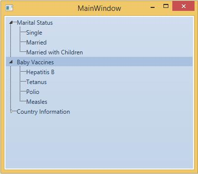

**Office2010Black theme**

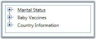

**Office2010Silver theme**

**ShinyBlue theme**

**ShinyRed theme**

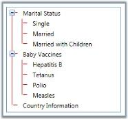

**ShinyOrange theme**

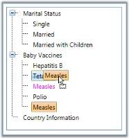

**VS2010 theme**

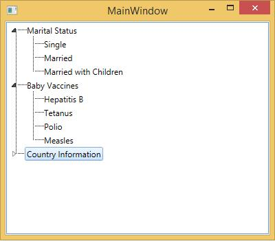

**Metro theme**

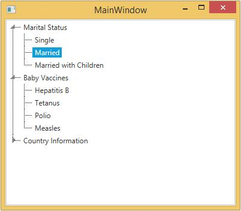

**Transparent theme**

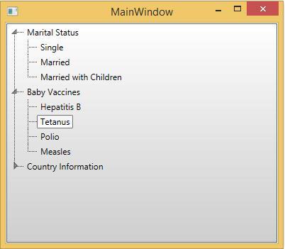

## Customizing root lines

You can customize the Root lines color and pen of the TreeViewAdv.

### Line color

The color of the root lines, which connect different nodes in a TreeViewAdv control is changed by using the LineBrush property. Use the following code example to set the color of the root lines.





<!-- Adding TreeViewAdv With show root lines and line brush -->
<syncfusion:TreeViewAdv Name="treeViewAdv" LineBrush="Red" ShowRootLines="True">
<!-- Adding TreeViewItemAdv -->
<syncfusion:TreeViewItemAdv Header="Marital Status">
<syncfusion:TreeViewItemAdv Header="Single"/>
<syncfusion:TreeViewItemAdv Header="Married"/>
<syncfusion:TreeViewItemAdv Header="Married with Children"/>
</syncfusion:TreeViewItemAdv>
<syncfusion:TreeViewItemAdv Header="Baby Vaccines">
<syncfusion:TreeViewItemAdv Header="Hepatitis B"/>
<syncfusion:TreeViewItemAdv Header="Tetanus"/>
<syncfusion:TreeViewItemAdv Header="Polio"/>
<syncfusion:TreeViewItemAdv Header="Measles"/>
</syncfusion:TreeViewItemAdv>
<syncfusion:TreeViewItemAdv Header="Country Information"/>
</syncfusion:TreeViewAdv>





// Show root lines
treeViewAdv.ShowRootLines = true;

// Set line brush
treeViewAdv.LineBrush = Brushes.Red;





' Show root lines
treeViewAdv.ShowRootLines = True

' Set line brush
treeViewAdv.LineBrush = Brushes.Red



  

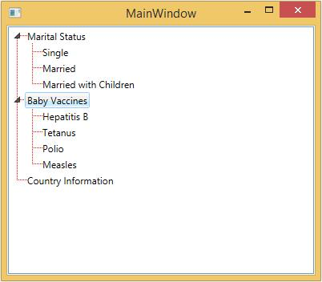

### Line pen

The root lines which connect different nodes in a TreeViewAdv control are customized by using the LinePen property. This property specifies the pen color for a node line. To set the LinePen property, refer the below code





<!-- Adding TreeViewAdv With show root lines and line pen -->
<syncfusion:TreeViewAdv Name="treeViewAdv" ShowRootLines="True">
<syncfusion:TreeViewAdv.LinePen>
<Pen Brush="Red" Thickness="1"/>
</syncfusion:TreeViewAdv.LinePen>
<!-- Adding TreeViewItemAdv -->
<syncfusion:TreeViewItemAdv Header="Marital Status">
<syncfusion:TreeViewItemAdv Header="Single"/>
<syncfusion:TreeViewItemAdv Header="Married"/>
<syncfusion:TreeViewItemAdv Header="Married with Children"/>
</syncfusion:TreeViewItemAdv>
<syncfusion:TreeViewItemAdv Header="Baby Vaccines">
<syncfusion:TreeViewItemAdv Header="Hepatitis B"/>
<syncfusion:TreeViewItemAdv Header="Tetanus"/>
<syncfusion:TreeViewItemAdv Header="Polio"/>
<syncfusion:TreeViewItemAdv Header="Measles"/>
</syncfusion:TreeViewItemAdv>
<syncfusion:TreeViewItemAdv Header="Country Information"/>
</syncfusion:TreeViewAdv>





// Show root lines
treeViewAdv.ShowRootLines = true;

// Set line Pen
treeViewAdv.LinePen = new Pen(Brushes.Red, 1);





' Show root lines
treeViewAdv.ShowRootLines = True

' Set line Pen
treeViewAdv.LinePen = New Pen(Brushes.Red, 1)



  

