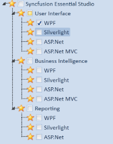
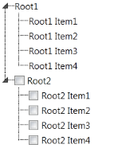

# Customizing Data Templates

This section explains about customizing the TreeViewItemAdv using DataTemplate.

## ItemTemplate 

The user can customize the business object that has to be displayed as TreeViewItemAdv using the ItemTemplate of TreeViewAdv. Since TreeViewAdv displays the hierarchical data, the HierarchicalDataTemplate is used to define the ItemTemplate. In the following example, business object is displayed as CheckBox:

[XAML]

&lt;HierarchicalDataTemplate ItemsSource="{Binding Models}"&gt;

    &lt;CheckBox Content="{Binding Caption}" IsChecked="{Binding 			Path=IsChecked,Mode=TwoWay}"/&gt;

&lt;/HierarchicalDataTemplate&gt;

{  | markdownify }
{:.image }

The icon in front of the checkbox is created using the LeftImageSource option available in the TreeViewItemADv.

## Item Template Selector

Different templates can be used for items based on specific constraints using the ItemTemplateSelector. 

The following example illustrates this:

1. Create the template selector as shown in the following code snippet:

[C#]

public class TreeViewAdvItemTemplateSelector : DataTemplateSelector

    {

 public override DataTemplate SelectTemplate(object item, 			DependencyObject container)

        {

            Window window = Application.Current.MainWindow;

            if (((Model)item).IsCheckable)

            {

                return ((DataTemplate)window.Resources["CheckableTemplate"]);

            }

            else 

            {

                return ((DataTemplate)window.Resources["NormalTemplate"]);

            }     

}

    }

2. Define the Data templates in the Window’s resources as follows:

[XAML]

&lt;HierarchicalDataTemplate ItemsSource="{Binding SubItems}" 		x:Key="CheckableTemplate"&gt;

     &lt;CheckBox Content="{Binding Header}" /&gt;

&lt;/HierarchicalDataTemplate&gt;

&lt;HierarchicalDataTemplate ItemsSource="{Binding SubItems}" 						x:Key="NormalTemplate"&gt;

    &lt;TextBlock Text="{Binding Header}" /&gt;

&lt;/HierarchicalDataTemplate&gt;

3.  Create the instance for the template selector in the Window’s resources as follows:

[XAML]

&lt;local:TreeViewAdvItemTemplateSelector x:Key="treeViewItemTemplateSelector"/&gt;

4. Use the template selector to choose the template for the TreeViewAdv as follows:

[XAML]

&lt;syncfusion:TreeViewAdv ItemsSource="{Binding TreeItems}" 		ItemTemplateSelector="{StaticResource treeViewItemTemplateSelector}"&gt;           

&lt;/syncfusion:TreeViewAdv&gt;

The TreeVewAdv generates as shown in the following screenshot:

{  | markdownify }
{:.image }

## Edit Template

The user can modify the template while editing the TreeViewItemAdv. The following example illustrates the process of changing the template:

1. Create the DataTemplate instance for the EditTemplate as follows: 

[XAML]

&lt;DataTemplate x:Key="EditTemplate"&gt;

      &lt;TextBox Text="{Binding Header}" FontStyle="Italic" 				FontWeight="Bold" /&gt;

&lt;/DataTemplate&gt;

2. Set the EditedItemTemplate for the TreeViewAdv to the above template as follows:

[XAML]

&lt;syncfusion:TreeViewAdv EditedItemTemplate="{StaticResource EditTemplate}" ItemsSource="{Binding TreeItems}" &gt;

&lt;/syncfusion:TreeViewAdv&gt;

While editing the TreeViewItemAdv appears as shown in the following screen shot:

{  | markdownify }
{:.image }

## Edit Template Selector

The user can choose the template at runtime for editing the TreeViewAdv. 

The following example explains how to choose the template at runtime:

1. Create the template selector as given in the following code snippet:

[C#]

public class TreeViewAdvEditTemplateSelector : DataTemplateSelector

  {

  public override DataTemplate SelectTemplate(object item, 					DependencyObject container)

    {

      Window window = Application.Current.MainWindow;

      if (((Model)item).IsCheckable)

            {

      	return ((DataTemplate)window.Resources["CheckableEditTemplate"]);

            }

            else

            {

             return ((DataTemplate)window.Resources["NormalEditTemplate"]);

            }

        }

    }

2. Define the Data templates in the Window’s resources as follows:

[XAML]

&lt;DataTemplate  x:Key="CheckableEditTemplate"&gt;

  &lt;TextBox Text="{Binding Header}" FontStyle="Italic" 		FontWeight="Bold" Foreground="Blue"/&gt;

&lt;/DataTemplate&gt;

&lt;DataTemplate  x:Key="NormalEditTemplate"&gt;

     &lt;TextBox Text="{Binding Header}" FontStyle="Italic" FontWeight="Bold" 	Foreground="Green"/&gt;

&lt;/DataTemplate&gt;

3.  Create the instance for the template selector in the Window’s resources as follows:

[XAML]

&lt;local:TreeViewAdvEditTemplateSelector x:Key="treeViewAdvEditTemplateSelector"/&gt;

4. Use the template selector to choose the template for the TreeViewAdv as follows:

[XAML]

<syncfusion:TreeViewAdv 

EditedItemTemplateSelector="{StaticResource treeViewAdvEditTemplateSelector}"

ItemsSource="{Binding TreeItems}" />           

The TreeViewAdv generates as shown in the following screenshot:

{  | markdownify }
{:.image }

