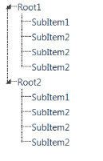
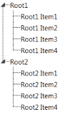
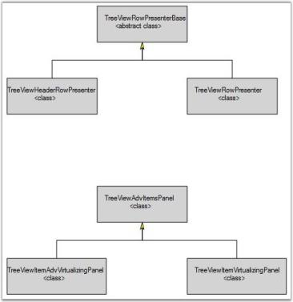
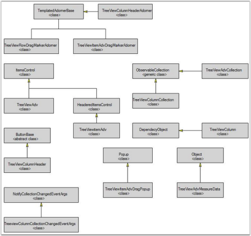

# Getting Started

## Structure of the Control

{{ '' | markdownify }}
{:.image }

The elements of the control are described below:

* TreeViewItemAdv Contents
* Expander – Used to Expand/Collapse the TreeViewItem
* Root Line - This line is used to enhance the visual of the connection between TreeViewItems and its parent. 
* LeftImage - Displays the image in front of the TreeViewItem.
* RightImage – Diaplays the image to the right of the TreeViewItemAdv 

## Creating the Control through Visual Studio

The TreeViewAdv control can be created in Visual Studio (VS). To create the control in VS:

1. Drag and Drop the TreeViewAdv available in the Visual Studio Toolbox as shown in the below screenshot: 

{{ '' | markdownify }}
{:.image }

2. Select the TreeViewAdv and go to properties.
3. Click Items property. The Collection Editor window opens as shown in the following screenshot:

{{ '' | markdownify }}
{:.image }

4. Using the Collection Editor, add more TreeViewItemAdvs to the TreeViewAdv. 
5. Configure the properties (like Header, ImageSource and etc.) of the TreeViewItemAdv using the Collection Editor window.
6. The TreeViewAdv is created as shown in the following screenshot:

{{ '' | markdownify }}
{:.image }

## Creating the Control through Expression Blend

TreeViewAdv can also be created and configured using the Expression Blend. To create TreeViewAdv control through Expression Blend:

1. Create a WPF project in the Expression Blend and add the reference to the following assemblies:
1. Syncfusoon.Tools.Wpf
2. Syncfusion.Shared.Wpf
3. Syncfusion.Core
2. Search for the TreeViewAdv in the toolbox

{{ '' | markdownify }}
{:.image }

3. Drag and drop the TreeViewAdv into the designer area. It generates an empty TreeViewAdv.
4. Add the nodes to the TreeViewAdv as follows:
5. Select the TreeViewAdv and go to Properties.
6. Click Items (Collection) under the Common Properties. 

{{ '' | markdownify }}
{:.image }

The Collection Editor window opens:

{{ '' | markdownify }}
{:.image }

7. Click Add Another Item. The Select Object window opens.
8. Select the TreeViewItemAdv (type TreeViewItemAdv in the search box) and click OK.
9. In the properties area of Collection Editor, change the properties (like Header, ImageSource and etc.) of TreeViewItemAdv that is currently added. 

This generates the TreeViewItemAdvs as follows:

{{ '' | markdownify }}
{:.image }

You can customize the look and feel of the TreeViewItemAdv using the template editing feature available in the Expression Blend.

## Populating the Data

This section explains about populating TreeViewItemAdv.

### Through XAML

TreeViewAdv can be created in XAML as follows:

[XAML]

<syncfusion:TreeViewAdv>

 <syncfusion:TreeViewItemAdv Header="Root1">

   <syncfusion:TreeViewItemAdv Header="SubItem1"/>

   <syncfusion:TreeViewItemAdv Header="SubItem2"/>

   <syncfusion:TreeViewItemAdv Header="SubItem2"/>

   <syncfusion:TreeViewItemAdv Header="SubItem2"/>

 </syncfusion:TreeViewItemAdv>

 <syncfusion:TreeViewItemAdv Header="Root2">

   <syncfusion:TreeViewItemAdv Header="SubItem1"/>

   <syncfusion:TreeViewItemAdv Header="SubItem2"/>

   <syncfusion:TreeViewItemAdv Header="SubItem2"/>

   <syncfusion:TreeViewItemAdv Header="SubItem2"/>

 </syncfusion:TreeViewItemAdv>

</syncfusion:TreeViewAdv>

### Through C#

Include the following namespace to the using directives list to create TreeViewAdv in C#:

[C#]

using Syncfusion.Windows.Tools.Controls;

You can create the TreeViewAdv as follows:

[C#]

TreeViewAdv treeviewAdv = new TreeViewAdv();

TreeViewItemAdv root1 = new TreeViewItemAdv() { Header = "Root1" };

TreeViewItemAdv subitem11 = new TreeViewItemAdv() { Header = "SubItem1" };

TreeViewItemAdv subitem12 = new TreeViewItemAdv() { Header = "SubItem2" };

TreeViewItemAdv subitem13 = new TreeViewItemAdv() { Header = "SubItem3" };

TreeViewItemAdv subitem14 = new TreeViewItemAdv() { Header = "SubItem4" };

root1.Items.Add(subitem11);

root1.Items.Add(subitem12);

root1.Items.Add(subitem13);

root1.Items.Add(subitem14);

TreeViewItemAdv root2 = new TreeViewItemAdv() { Header = "Root1" };

TreeViewItemAdv subitem21 = new TreeViewItemAdv() { Header = "SubItem1" };

TreeViewItemAdv subitem22 = new TreeViewItemAdv() { Header = "SubItem2" };

TreeViewItemAdv subitem23 = new TreeViewItemAdv() { Header = "SubItem3" };

TreeViewItemAdv subitem24 = new TreeViewItemAdv() { Header = "SubItem4" };

root2.Items.Add(subitem21);

root2.Items.Add(subitem22);

root2.Items.Add(subitem23);

root2.Items.Add(subitem24);

treeviewAdv.Items.Add(root1);

treeviewAdv.Items.Add(root2);

This generates the TreeViewAdv as follows:

{{ '' | markdownify }}
{:.image }

### Data Binding – Object

TreeViewAdv supports object binding. The following example illustrates data binding:

1. Create a class that acts as a model for TreeViewAdv as given in the following code snippet:

[C#]

public class Model

    {

        public Model()

        {

            SubItems = new ObservableCollection<Model>();

        }

        public string Header { get; set; }

public bool IsCheckable { get; set; }

        public ObservableCollection<Model> SubItems { get; set; }

    }

2. Create a ViewModel class and initialize the items as given in the following code snippet:

[C#]

public class ViewModel

    {

        public ViewModel()

        {

            TreeItems = new ObservableCollection<Model>();

            PopulateData();

        }

        public ObservableCollection<Model> TreeItems { get; set; }

        private void PopulateData()

        {

            Model Root1 = new Model() { Header = "Root1" };

            PopulateSubItems(Root1);

            TreeItems.Add(Root1);

            Model Root2 = new Model() { Header = "Root2" };

            PopulateSubItems(Root2);

            TreeItems.Add(Root2);

        }

        private void PopulateSubItems(Model Root)

        {

            Model SubItem1 = new Model() { Header = Root.Header + " Item1" };

            Model SubItem2 = new Model() { Header = Root.Header + " Item2" };

            Model SubItem3 = new Model() { Header = Root.Header + " Item3" };

            Model SubItem4 = new Model() { Header = Root.Header + " Item4" };

            Root.SubItems.Add(SubItem1);

            Root.SubItems.Add(SubItem2);

            Root.SubItems.Add(SubItem3);

            Root.SubItems.Add(SubItem4);

        }

    }

3. Create a ViewModel instance and use it as DataContext for the Root Window as given in the following code snippet:

[XAML]

<Window.DataContext>

   <local:ViewModel/>

</Window.DataContext>

4. Configure the ItemsSource and ItemTemplate of the TreeViewAdv as given below:

[XAML]

<syncfusion:TreeViewAdv ItemsSource="{Binding TreeItems}">

   <syncfusion:TreeViewAdv.ItemTemplate>

                <HierarchicalDataTemplate ItemsSource="{Binding SubItems}">

                    <TextBlock Text="{Binding Header}" />

                </HierarchicalDataTemplate>

    </syncfusion:TreeViewAdv.ItemTemplate>

 </syncfusion:TreeViewAdv>

The TreeViewAdv will be created as follows:

{{ '' | markdownify }}
{:.image }

### DataBiding – XML

XML file can also be used as ItemsSource for the TreeViewAdv. The following example illustrates this:

1. Create the xml file with the following details and name it as Data.xml:

[XAML]

<Products>

  <Product Name="Tools" >

    <Feature Name="Ribbon" >

      <Feature Name="Office2010UI"/>

      <Feature Name="Data Binding Support"/>

    </Feature>

    <Feature Name="Docking Manager">

      <Feature Name="Maximization"/>

      <Feature Name="State Persistence"/>

    </Feature>

    <Feature Name="TreeView">

      <Feature Name="Editing"/>

      <Feature Name="Sorting"/>

    </Feature>

    <Feature Name="Data Editors" >

      <Feature Name="Watermark Text" />

      <Feature Name="Extended Value Scrolling" />

    </Feature>

  </Product>

</Products>

2. Add the XmlDataProvider for the above XML document as follows:

[XAML]

<XmlDataProvider Source="Data.xml" x:Key="xmlSource" XPath="Products"/> 

3. Set the ItemsSource property for the TreeViewAdv as follows:

[XAML]

<syncfusion:TreeViewAdv	ItemsSource="{Binding Source={StaticResource 			xmlSource}, XPath=Product}" >

 <syncfusion:TreeViewAdv.ItemTemplate>

  <HierarchicalDataTemplate ItemsSource="{Binding XPath=Feature}">

   <TextBlock Text="{Binding XPath=@Name}" />

  </HierarchicalDataTemplate>

 </syncfusion:TreeViewAdv.ItemTemplate>

</syncfusion:TreeViewAdv>

TreeViewAdv will be created as follows:

{{ '' | markdownify }}
{:.image }

### DataBinding – WCF

TreeViewAdv also supports loading the data, retrieved from the WCF service.  LoadOnDemand feature available in the TreeViewAdv helps to load items dynamically by retrieving from the service when expanding the node. 

To bind data using WCF:

1. Add a Service Reference to a WCF service that returns the required data. 

For example, add the service reference to the following service:

[http://silverlight.syncfusion.com/samples/wpf/Services/Northwind/EmployeeService.svc](http://silverlight.syncfusion.com/samples/wpf/Services/Northwind/EmployeeService.svc)

The required interfaces (IEmployeeService) and classes (Employee ,Product, Supplier) related to the service is created automatically.

2. Create a Service Client object for that WCF service as given in the following code snippet:

[C#]

       private EmployeeServiceClient client; 

3. Initialize the created client object before you use it. 

[C#]

client = new EmployeeServiceClient();

4. Set the DataContext of the Window that holds the TreeViewAdv to the data retrieved from the service as follows:

[C#]

try

                {

                    DataContext = client.GetEmployees();

                }

                catch (Exception)

                {

                    MessageBox.Show("TreeViewAdv cannot connect to service. 					Please check your data connection.");

                }

The GetEmployees() method given in the above code snippet returns the list of Employee type objects available in the database.

5. Set the ItemContainerStyle for the TreeViewAdv as follows:

[XAML]

<syncfusion:TreeViewAdv

                x:Name="MyTreeView" 

                ItemsSource="{Binding }"

                LoadOnDemand="OnLoadOnDemand"                

                ShowRootLines="False"               

                IsScrollOnExpand="False">

              <syncfusion:TreeViewAdv.ItemContainerStyle>

                  

                             </Setter.Value>

                            </Setter>

                           </Style>

                        </Setter.Value>

                      </Setter>

                  </Style>

             </syncfusion:TreeViewAdv.ItemContainerStyle>

            <syncfusion:TreeViewAdv.ItemTemplate>

               <HierarchicalDataTemplate ItemsSource="{Binding Products}">

                  <TextBlock Text="{Binding Name}"/>

               </HierarchicalDataTemplate>

            </syncfusion:TreeViewAdv.ItemTemplate>

                </syncfusion:TreeViewAdv>

6. Get the TreeViewItemAdv which loads the data on demand (ie. On expand) using the LoadOnDemo event available in the TreeViewAdv.

[C#]

private TreeViewItemAdv loadingitem;

private void OnLoadOnDemand(object sender, 				Syncfusion.Windows.Tools.Controls.LoadonDemandEventArgs args)

 {      

  	loadingitem = args.TreeViewItem as TreeViewItemAdv;

if (loadingitem != null)

        {

         var model = loadingitem.DataContext as Employee;

         if (model != null)

          {

            try

            {

            model.Products = client.GetProducts(model);

            }

            catch (Exception)

            {

            MessageBox.Show("TreeView cannot connect to service. Please check 			your data connection.");

            }

           }

          else

           {

            var product = loadingitem.DataContext as Product;

            if (product != null)

             {

              try

               {

               product.Products = client.GetSuppliers(product);

               }

              catch (Exception)

               {

               MessageBox.Show("TreeView cannot connect to service. Please 						check your data connection.");

               }

             }

          }

        loadingitem.IsLoadOnDemand = false;

       }

Retrieve the data from WCF service and load the data to the corresponding TreeViewItemAdv as shown in the following screenshot:

{{ '' | markdownify }}
{:.image }

## Why to use our TreeView control

Here are some highlights of our TreeView control.

* Provides support to add any number of items to the control.
* Developed using UI Virtualization; enabling enhanced performance
* Data binding support
* Select multiple items using the CTRL+ SHIFT keys
* Multiple item drag-and-drops within the control and to other TreeViewAdv controls
* Built-in animations for Expand and Collapse operations with adjustable animation delay
* Fake Drag Indicator to simulate where items may be placed during drag-and-drop operations
* Show or Hide root lines and change the brush applied to the lines
* Edit items at runtime as a folder using the F2 key or mouse
* Customize the complete look and feel of the control
* Custom template support
* Sort TreeViewAdv items at run time
* Add images to TreeViewItemAdv to identify expanded or collapsed states
* Add images as left and right image sources to the TreeViewItemAdv

## Class Diagram

The class diagram for TreeView control is as follows.

{{ '' | markdownify }}
{:.image }

{{ '' | markdownify }}
{:.image }

## Creating TreeViewAdv control

There are two possible ways to create a simple TreeViewAdv control.

Through Designer

To create the TreeViewAdv control through designer, do the below steps

1. Drag the TreeViewAdv control from the toolbox onto your WPF application.

{{ '' | markdownify }}
{:.image }

2. Set the properties for the TreeViewAdv control by using the Smart Tag feature.

Programmatically

TreeViewAdv control is created by using either XAML or C# code. Use the below code to create a TreeViewAdv control.

[XAML]

<!-- Adding TreeViewAdv -->

<syncfusion:TreeViewAdv Name="treeViewAdv">

    <!-- Adding TreeViewItemAdv -->

    <syncfusion:TreeViewItemAdv Header="Marital Status">

        <syncfusion:TreeViewItemAdv Header="Single"/>

        <syncfusion:TreeViewItemAdv Header="Married"/>

        <syncfusion:TreeViewItemAdv Header="Married with Children"/>

    </syncfusion:TreeViewItemAdv>

    <syncfusion:TreeViewItemAdv Header="Baby Vaccines">

        <syncfusion:TreeViewItemAdv Header="Hepatitis B"/>

        <syncfusion:TreeViewItemAdv Header="Tetanus"/>

        <syncfusion:TreeViewItemAdv Header="Polio"/>

        <syncfusion:TreeViewItemAdv Header="Measles"/>

    </syncfusion:TreeViewItemAdv>

    <syncfusion:TreeViewItemAdv Header="Country Information"/>

</syncfusion:TreeViewAdv>

[C#]

// Creating an instance of TreeViewAdv

TreeViewAdv treeViewAdv = new TreeViewAdv();

// Creating an instance of TreeViewItem

TreeViewItemAdv treeViewItemAdv = new TreeViewItemAdv();

treeViewItemAdv.Header = "Marital Status";

......

......

......

// Adding treeview item to TreeView

treeViewAdv.Items.Add(treeViewItemAdv);

// Adding content to the window

this.Content = treeViewAdv;

> 

> _Note: To display the TreeViewAdv using C# code, you must already have a panel in which you are going to add the control. Otherwise, the control cannot be displayed._

The following screen shot shows the TreeViewAdv control.

{{ '' | markdownify }}
{:.image }

