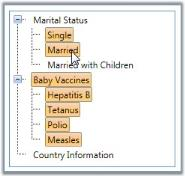
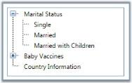
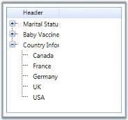

# Interactive Features

This section illustrates the following interactive features of TreeViewAdv control. 

## Adding TreeView Item to the TreeViewAdv Control

The TreeviewItem is added to a TreeViewAdv control either by using XAML or Procedural code. The following code example lets you to create and add treeview items to the TreeViewAdv.





<!-- Adding TreeViewAdv -->

<syncfusion:TreeViewAdv Name="treeView1">

    <!-- Adding TreeViewItemAdv -->

    <syncfusion:TreeViewItemAdv Header="Marital Status"/>

</syncfusion:TreeViewAdv>





// Creating an instance of TreeViewAdv

TreeViewAdv treeViewAdv = new TreeViewAdv();

// Creating an instance of TreeViewItem

TreeViewItemAdv treeViewItemAdv = new TreeViewItemAdv();

treeViewItemAdv.Header = "TreeViewItem";

// Adding treeviewitem to treeview

treeViewAdv.Items.Add(treeViewItemAdv);

// Adding content to the window

this.Content = treeViewAdv;




N> To display the TreeViewItem, you must already have a TreeViewAdv in which you are going to add the TreeViewItem.

## Allowing Multi Select in TreeViewAdv

The TreeViewAdv control supports selecting multiple items by using the CTRL or SHIFT keys. The selected items are dragged to any item or node within the same control or to another TreeViewAdv control. This is achieved by enabling the AllowMultiSelect property.

The following code example can be used to set this property.





<!-- Adding TreeViewAdv with multiselection of items  -->

<syncfusion:TreeViewAdv AllowMultiSelect="True" Name="treeViewAdv">

    <!-- Adding TreeViewItemAdv -->

    <syncfusion:TreeViewItemAdv Header="Marital Status">

        <syncfusion:TreeViewItemAdv Header="Single"/>

        <syncfusion:TreeViewItemAdv Header="Married"/>

        <syncfusion:TreeViewItemAdv Header="Married with Children"/>

    </syncfusion:TreeViewItemAdv>

    <syncfusion:TreeViewItemAdv Header="Baby Vaccines">

        <syncfusion:TreeViewItemAdv Header="Hepatitis B"/>

        <syncfusion:TreeViewItemAdv Header="Tetanus"/>

        <syncfusion:TreeViewItemAdv Header="Polio"/>

        <syncfusion:TreeViewItemAdv Header="Measles"/>

    </syncfusion:TreeViewItemAdv>

    <syncfusion:TreeViewItemAdv Header="Country Information"/>

</syncfusion:TreeViewAdv>





// Enable multi select of items

treeViewAdv.AllowMultiSelect = true;




## Multi Select TreeView Items Programmatically

TreeViewAdv control provides support to select multiple treeview items programmatically. This is achieved by using the AddNodeToSelectedItems method which is used to select multiple items by iterating through each and every item in the TreeViewAdv control.

Here are the code snippets to select multiple items in the TreeViewAdv control using both XAML and C# code.




<syncfusion:TreeViewAdv x:Name="treeView" AllowMultiSelect="True">          

    <syncfusion:TreeViewItemAdv Header="item1"/>      

    <syncfusion:TreeViewItemAdv Header="item2"/> 

    <syncfusion:TreeViewItemAdv Header="item3"/>    

    <syncfusion:TreeViewItemAdv Header="item4"/>

</syncfusion:TreeViewAdv>





foreach (TreeViewItemAdv items in this.treeView.Items)

{

treeView.AddNodeToSelectedItems(items);

}







Allowing Multi Select in TreeViewAdv



## Setting Itemsource for a TreeviewAdv

The following code snippet sets a collection used to generate the content of the items control.




<Window x:Class="WpfApplication2.Window1"

    xmlns="http://schemas.microsoft.com/winfx/2006/xaml/presentation"

    xmlns:x="http://schemas.microsoft.com/winfx/2006/xaml"

    xmlns:syncfusion="http://schemas.syncfusion.com/wpf"

    xmlns:local="clr-namespace:WpfApplication2"

    Title="Window1" Height="300" Width="300">

  <Window.Resources>

    <!--Custom object which is defined in the code behind can be accessed through the key logic in XAML-->

    <local:CountryStatistics x:Key="myHierSalesList"/>

    <HierarchicalDataTemplate ItemsSource="{Binding Path=RegionalStats}" DataType="{x:Type local:CountryList}">

      <StackPanel Orientation="Horizontal"   Width="404">

        <TextBlock VerticalAlignment="Center"  HorizontalAlignment="Center" TextWrapping="Wrap" Text="{Binding Path=Name}"/>

      </StackPanel>

    </HierarchicalDataTemplate>

  </Window.Resources>

  <Grid>

    <!-- Adding TreeViewAdv with CustomEditedItemTemplate -->

    <syncfusion:TreeViewAdv Name="treeViewAdv" DataContext="{Binding treeViewHeader}">

      <!-- Adding TreeViewItemAdv -->

      <syncfusion:TreeViewItemAdv Name="treeViewItemAdv1" Header="Country"  ItemsSource="{StaticResource myHierSalesList}"/>

    </syncfusion:TreeViewAdv>

  </Grid>

</Window>





public class CountryStatistics : ObservableCollection<CountryList>

{

    public CountryStatistics()

    {

        this.Add(new CountryList() { Name = "North America" });

        this.Add(new CountryList() { Name = "Central America" });

        this.Add(new CountryList() { Name = "South America" });

    }

}

public class CountryList : INotifyPropertyChanged

{

    public string Name { get; set; }

    #region INotifyPropertyChanged Members

    public event PropertyChangedEventHandler PropertyChanged;

    protected void OnPropertyChanged(PropertyChangedEventArgs e)

    {

        if (this.PropertyChanged != null)

            this.PropertyChanged.Invoke(this, e);

    }

}





## Setting Expand/Collapse Image source

The tree nodes in TreeViewAdv control can have subnodes or items. On clicking the parent node, it expands to show child nodes. Hence, the nodes switch between collapsed and expanded states, on mouse-click. TreeViewAdv control lets you specify separate images for the expanded and collapsed nodes. You can add images to the TreeViewItemAdv to indicate the state of an item by using the ExpandedImageSource and CollapsedImageSource properties. Images are displayed based on the state of the item. 

The following are the two possible states for any item:

* Expanded
* Collapsed

The Expanded state is identified by setting the ExpandedImageSource property and the Collapsed state is identified by setting the CollapsedImageSource property as follows.





<!-- Adding TreeViewAdv With collapse and expand image -->

<syncfusion:TreeViewAdv Name="treeViewAdv">

    <!-- Adding TreeViewItemAdv -->

    <syncfusion:TreeViewItemAdv Name="treeviewitem1" Header="Marital Status" CollapsedImageSource="star.png">

        <syncfusion:TreeViewItemAdv Header="Single"/>

        <syncfusion:TreeViewItemAdv Header="Married"/>

        <syncfusion:TreeViewItemAdv Header="Married with Children"/>

    </syncfusion:TreeViewItemAdv>

    <syncfusion:TreeViewItemAdv Name="treeviewitem2" Header="Baby Vaccines" ExpandedImageSource="happy.png">

        <syncfusion:TreeViewItemAdv Header="Hepatitis B"/>

        <syncfusion:TreeViewItemAdv Header="Tetanus"/>

        <syncfusion:TreeViewItemAdv Header="Polio"/>

        <syncfusion:TreeViewItemAdv Header="Measles"/>

    </syncfusion:TreeViewItemAdv>

    <syncfusion:TreeViewItemAdv Header="Country Information"/>

</syncfusion:TreeViewAdv>





// Set image for collapsed button

treeviewitem1.CollapsedImageSource = new BitmapImage(new Uri("star.png", UriKind.Relative));

// Set image for expand button

treeviewitem2.ExpandedImageSource = new BitmapImage(new Uri("happy.png", UriKind.Relative));





## Image Settings in TreeViewAdv

User can also set the height and width of the node images in a TreeViewAdv control. The ImageHeight property sets the height of the image and the ImageWidth property sets the width of the images. The default value of the properties is _NaN_. Here is the code for setting these properties.





<!-- Adding TreeViewAdv with image width and height -->

<syncfusion:TreeViewAdv Name="treeViewAdv">

  <!-- Adding TreeViewItemAdv -->

  <syncfusion:TreeViewItemAdv Name="treeViewItemAdv1" ImageHeight="25" ImageWidth="25" LeftImageSource="happy.png" Header="Marital Status">

    <syncfusion:TreeViewItemAdv Header="Single"/>

    <syncfusion:TreeViewItemAdv Header="Married"/>

    <syncfusion:TreeViewItemAdv Header="Married with Children"/>

  </syncfusion:TreeViewItemAdv>

  <syncfusion:TreeViewItemAdv Name="treeViewItemAdv2" RightImageSource="star.png" Header="Baby Vaccines">

    <syncfusion:TreeViewItemAdv Header="Hepatitis B"/>

    <syncfusion:TreeViewItemAdv Header="Tetanus"/>

    <syncfusion:TreeViewItemAdv Header="Polio"/>

    <syncfusion:TreeViewItemAdv Header="Measles"/>

  </syncfusion:TreeViewItemAdv>

  <syncfusion:TreeViewItemAdv Header="Country Information">

    <syncfusion:TreeViewItemAdv Header="Canada"/>

    <syncfusion:TreeViewItemAdv Header="France"/>

    <syncfusion:TreeViewItemAdv Header="Germany"/>

    <syncfusion:TreeViewItemAdv Header="UK"/>

    <syncfusion:TreeViewItemAdv Header="USA"/>

  </syncfusion:TreeViewItemAdv>

</syncfusion:TreeViewAdv>





//Set image height

treeViewItemAdv1.ImageHeight = 25;

//Set image width

treeViewItemAdv1.ImageWidth = 25; 





### Node Image

You can add images to the left and right corner of the header of the TreeViewItemAdv by using the LeftImageSource and RightImageSource properties of the TreeViewItemAdv class. 

* LeftImageSource—This is a dependency property, which gets or sets ImageSource to left image.
* RightImageSource—This is dependency property, which gets or sets RightSource to right image. 




<!-- Adding TreeViewAdv with left and right image -->

<syncfusion:TreeViewAdv Name="treeViewAdv">

  <!-- Adding TreeViewItemAdv -->

  <syncfusion:TreeViewItemAdv Name="treeViewItemAdv1" LeftImageSource="happy.png" Header="Marital Status">

    <syncfusion:TreeViewItemAdv Header="Single"/>

    <syncfusion:TreeViewItemAdv Header="Married"/>

    <syncfusion:TreeViewItemAdv Header="Married with Children"/>

  </syncfusion:TreeViewItemAdv>

  <syncfusion:TreeViewItemAdv Name="treeViewItemAdv2" RightImageSource="star.png" Header="Baby Vaccines">

    <syncfusion:TreeViewItemAdv Header="Hepatitis B"/>

    <syncfusion:TreeViewItemAdv Header="Tetanus"/>

    <syncfusion:TreeViewItemAdv Header="Polio"/>

    <syncfusion:TreeViewItemAdv Header="Measles"/>

  </syncfusion:TreeViewItemAdv>

  <syncfusion:TreeViewItemAdv Header="Country Information">

    <syncfusion:TreeViewItemAdv Header="Canada"/>

    <syncfusion:TreeViewItemAdv Header="France"/>

    <syncfusion:TreeViewItemAdv Header="Germany"/>

    <syncfusion:TreeViewItemAdv Header="UK"/>

    <syncfusion:TreeViewItemAdv Header="USA"/>

  </syncfusion:TreeViewItemAdv>

</syncfusion:TreeViewAdv>





//Set image for left

treeViewItemAdv1.LeftImageSource = new BitmapImage(new Uri("happy.png", UriKind.Relative));

//Set image for right

treeViewItemAdv2.RightImageSource = new BitmapImage(new Uri("star.png", UriKind.Relative));




## Sorting TreeviewItemAdv

TreeViewAdv has the advanced ability to sort the TreeViewItemAdv items at run time. The Sorting property of the control allows you to specify the direction of sorting. The sorting options are as follows.

* Ascending 
* Descending
* None (_default_)




<!-- Adding TreeViewAdv with sorting -->

<syncfusion:TreeViewAdv Name="treeViewAdv" Sorting="Ascending">

  <!-- Adding TreeViewItemAdv -->

  <syncfusion:TreeViewItemAdv Name="treeViewItemAdv" Header="Marital Status">

    <syncfusion:TreeViewItemAdv Header="Single"/>

    <syncfusion:TreeViewItemAdv Header="Married"/>

    <syncfusion:TreeViewItemAdv Header="Married with Children"/>

  </syncfusion:TreeViewItemAdv>

  <syncfusion:TreeViewItemAdv Header="Baby Vaccines">

    <syncfusion:TreeViewItemAdv Header="Hepatitis B"/>

    <syncfusion:TreeViewItemAdv Header="Tetanus"/>

    <syncfusion:TreeViewItemAdv Header="Polio"/>

    <syncfusion:TreeViewItemAdv Header="Measles"/>

  </syncfusion:TreeViewItemAdv>

  <syncfusion:TreeViewItemAdv Header="Country Information">

    <syncfusion:TreeViewItemAdv Header="Canada"/>

    <syncfusion:TreeViewItemAdv Header="France"/>

    <syncfusion:TreeViewItemAdv Header="Germany"/>

    <syncfusion:TreeViewItemAdv Header="UK"/>

    <syncfusion:TreeViewItemAdv Header="USA"/>

  </syncfusion:TreeViewItemAdv>

</syncfusion:TreeViewAdv>





//Sort the item

treeViewAdv.Sorting = SortDirection.Ascending; 





### Sorting Field

Using SortingField property, you can specify a sorting criteria. This is dependency property, which gets or sets the property name being used as the sorting criteria. The default value is _Header_. 




<!-- Adding TreeViewAdv with sorting -->

<syncfusion:TreeViewAdv Name="treeViewAdv" Sorting="Ascending" SortingField="Header">

  <!-- Adding TreeViewItemAdv -->

  <syncfusion:TreeViewItemAdv Name="treeViewItemAdv" Header="Marital Status">

    <syncfusion:TreeViewItemAdv Header="Single"/>

    <syncfusion:TreeViewItemAdv Header="Married"/>

    <syncfusion:TreeViewItemAdv Header="Married with Children"/>

  </syncfusion:TreeViewItemAdv>

  <syncfusion:TreeViewItemAdv Header="Baby Vaccines">

    <syncfusion:TreeViewItemAdv Header="Hepatitis B"/>

    <syncfusion:TreeViewItemAdv Header="Tetanus"/>

    <syncfusion:TreeViewItemAdv Header="Polio"/>

    <syncfusion:TreeViewItemAdv Header="Measles"/>

  </syncfusion:TreeViewItemAdv>

  <syncfusion:TreeViewItemAdv Header="Country Information">

    <syncfusion:TreeViewItemAdv Header="Canada"/>

    <syncfusion:TreeViewItemAdv Header="France"/>

    <syncfusion:TreeViewItemAdv Header="Germany"/>

    <syncfusion:TreeViewItemAdv Header="UK"/>

    <syncfusion:TreeViewItemAdv Header="USA"/>

  </syncfusion:TreeViewItemAdv>

</syncfusion:TreeViewAdv>

 



//Sort the item based on criteria

treeViewAdv.SortingField = "Header";  





## Setting a TreeViewItem Expanded

You can expand or collapse the TreeViewAdv by enabling or disabling the IsExpanded property. Use the following code to set this property.





<!-- Adding TreeViewAdv with expand the node -->

<syncfusion:TreeViewAdv Name="treeViewAdv">

    <!-- Adding TreeViewItemAdv -->

    <syncfusion:TreeViewItemAdv Name="treeViewItemAdv" IsExpanded="True" Header="Marital Status">

        <syncfusion:TreeViewItemAdv Header="Single"/>

        <syncfusion:TreeViewItemAdv Header="Married"/>

        <syncfusion:TreeViewItemAdv Header="Married with Children"/>

    </syncfusion:TreeViewItemAdv>

    <syncfusion:TreeViewItemAdv Header="Baby Vaccines">

        <syncfusion:TreeViewItemAdv Header="Hepatitis B"/>

        <syncfusion:TreeViewItemAdv Header="Tetanus"/>

        <syncfusion:TreeViewItemAdv Header="Polio"/>

        <syncfusion:TreeViewItemAdv Header="Measles"/>

    </syncfusion:TreeViewItemAdv>

    <syncfusion:TreeViewItemAdv Header="Country Information"/>

</syncfusion:TreeViewAdv>





// Enable IsExpanded

treeViewItemAdv.IsExpanded = true;





## Expand Animation

The Expand or Collapse operation in a TreeViewAdv leads to an animated action. This animation is controlled by using the ExpandAnimation property. The animation is also applied to the child items. The following code example illustrates how to set this property.



<Window x:Class="WpfApplication2.Window1"

    xmlns="http://schemas.microsoft.com/winfx/2006/xaml/presentation"

    xmlns:x="http://schemas.microsoft.com/winfx/2006/xaml"

    xmlns:syncfusion="http://schemas.syncfusion.com/wpf"

    Title="Window1" Height="300" Width="300">

    <Window.Resources>

        <!-- Define Expand Animation -->

        <DoubleAnimation x:Key="ExpandAnimation" Duration="0:0:1.5"/>

    </Window.Resources>

    <Grid>

        <!-- Adding TreeViewAdv with expand animation -->

        <syncfusion:TreeViewAdv Name="treeViewAdv">

            <!-- Adding TreeViewItemAdv -->

            <syncfusion:TreeViewItemAdv Name="treeViewItemAdv" ExpandAnimation="{StaticResource ExpandAnimation}"  Header="Marital Status">

                <syncfusion:TreeViewItemAdv Header="Single"/>

                <syncfusion:TreeViewItemAdv Header="Married"/>

                <syncfusion:TreeViewItemAdv Header="Married with Children"/>

            </syncfusion:TreeViewItemAdv>

            <syncfusion:TreeViewItemAdv Header="Baby Vaccines">

                <syncfusion:TreeViewItemAdv Header="Hepatitis B"/>

                <syncfusion:TreeViewItemAdv Header="Tetanus"/>

                <syncfusion:TreeViewItemAdv Header="Polio"/>

                <syncfusion:TreeViewItemAdv Header="Measles"/>

            </syncfusion:TreeViewItemAdv>

            <syncfusion:TreeViewItemAdv Header="Country Information"/>

        </syncfusion:TreeViewAdv>

    </Grid>

</Window>



### Animation Speed

The speed of animation that is generated while expanding or collapsing the TreeViewAdv is controlled by using the AnimationSpeed property. The default value of this property is set to _1_. To set this property, use the below code




<!-- Set animation speed -->

<syncfusion:TreeViewAdv AnimationSpeed="2"  Name="treeViewAdv">

    <!-- Adding TreeViewItemAdv -->

    <syncfusion:TreeViewItemAdv Header="Marital Status">

        <syncfusion:TreeViewItemAdv Header="Single"/>

        <syncfusion:TreeViewItemAdv Header="Married"/>

        <syncfusion:TreeViewItemAdv Header="Married with Children"/>

    </syncfusion:TreeViewItemAdv>

    <syncfusion:TreeViewItemAdv Header="Baby Vaccines">

        <syncfusion:TreeViewItemAdv Header="Hepatitis B"/>

        <syncfusion:TreeViewItemAdv Header="Tetanus"/>

        <syncfusion:TreeViewItemAdv Header="Polio"/>

        <syncfusion:TreeViewItemAdv Header="Measles"/>

    </syncfusion:TreeViewItemAdv>

    <syncfusion:TreeViewItemAdv Header="Country Information"/>

</syncfusion:TreeViewAdv>





// Set animation speed

treeViewAdv.AnimationSpeed = 2;





### Animation Type

The type of animation that is generated while expanding or collapsing the TreeViewAdv is controlled by using the AnimationType property. This property includes the following options.

* Fade—animation fades out when the TreeViewAdv is collapsed or expanded
* None—no animation is generated
* Slide—animation slides when the TreeViewAdv is collapsed or expanded

The default value of this property is set to Slide. 

Use the following code to set this property.




<!-- Set animation type as fade -->

<syncfusion:TreeViewAdv AnimationType="Fade" Name="treeViewAdv"> 

    <!-- Adding TreeViewItemAdv -->

    <syncfusion:TreeViewItemAdv Header="Marital Status">

        <syncfusion:TreeViewItemAdv Header="Single"/>

        <syncfusion:TreeViewItemAdv Header="Married"/>

        <syncfusion:TreeViewItemAdv Header="Married with Children"/>

    </syncfusion:TreeViewItemAdv>

    <syncfusion:TreeViewItemAdv Header="Baby Vaccines">

        <syncfusion:TreeViewItemAdv Header="Hepatitis B"/>

        <syncfusion:TreeViewItemAdv Header="Tetanus"/>

        <syncfusion:TreeViewItemAdv Header="Polio"/>

        <syncfusion:TreeViewItemAdv Header="Measles"/>

    </syncfusion:TreeViewItemAdv>

    <syncfusion:TreeViewItemAdv Header="Country Information"/>

</syncfusion:TreeViewAdv>





// Set animation type as Fade.

treeViewAdv.AnimationType = AnimationType.Fade;

// Set animation type as Slide.

treeViewAdv.AnimationType = AnimationType.Slide;

// Set animation type as None.

treeViewAdv.AnimationType = AnimationType.None;





### Animation Settings

You can enable animation, while the tree nodes are expanded and collapsed. This is done using the below code snippet.



<Window x:Class="WpfApplication2.Window1"

    xmlns="http://schemas.microsoft.com/winfx/2006/xaml/presentation"

    xmlns:x="http://schemas.microsoft.com/winfx/2006/xaml"

    xmlns:syncfusion="http://schemas.syncfusion.com/wpf"

    Title="Window1" Height="300" Width="300">

  <Window.Resources>

    <DoubleAnimation x:Key="FadeAnimation" Duration="0:0:1.5"/>

  </Window.Resources>

  <Grid>

    <!-- Adding TreeViewAdv with fade animation -->

    <syncfusion:TreeViewAdv Name="treeViewAdv">

      <!-- Adding TreeViewItemAdv -->

      <syncfusion:TreeViewItemAdv Name="treeViewItemAdv1" FadeAnimation="{StaticResource FadeAnimation}" Header="Marital Status">

        <syncfusion:TreeViewItemAdv Header="Single"/>

        <syncfusion:TreeViewItemAdv Header="Married"/>

        <syncfusion:TreeViewItemAdv Header="Married with Children"/>

      </syncfusion:TreeViewItemAdv>

      <syncfusion:TreeViewItemAdv Name="treeViewItemAdv2" Header="Baby Vaccines">

        <syncfusion:TreeViewItemAdv Header="Hepatitis B"/>

        <syncfusion:TreeViewItemAdv Header="Tetanus"/>

        <syncfusion:TreeViewItemAdv Header="Polio"/>

        <syncfusion:TreeViewItemAdv Header="Measles"/>

      </syncfusion:TreeViewItemAdv>

      <syncfusion:TreeViewItemAdv Header="Country Information">

        <syncfusion:TreeViewItemAdv Header="Canada"/>

        <syncfusion:TreeViewItemAdv Header="France"/>

        <syncfusion:TreeViewItemAdv Header="Germany"/>

        <syncfusion:TreeViewItemAdv Header="UK"/>

        <syncfusion:TreeViewItemAdv Header="USA"/>

      </syncfusion:TreeViewItemAdv>

    </syncfusion:TreeViewAdv>

  </Grid>

</Window>



## Setting flow directions 

The flow direction for the TreeViewAdv is set through the FlowDirection property. The options provided are as follows.

* Left-to-Right
* Right-to-Left



 

<!-- Adding TreeViewAdv with flow direction -->

<syncfusion:TreeViewAdv Name="treeViewAdv" FlowDirection="RightToLeft" >

  <!-- Adding TreeViewItemAdv -->

  <syncfusion:TreeViewItemAdv Header="Marital Status">

    <syncfusion:TreeViewItemAdv Header="Single"/>

    <syncfusion:TreeViewItemAdv Header="Married"/>

    <syncfusion:TreeViewItemAdv Header="Married with Children"/>

  </syncfusion:TreeViewItemAdv>

  <syncfusion:TreeViewItemAdv Header="Baby Vaccines">

    <syncfusion:TreeViewItemAdv Header="Hepatitis B"/>

    <syncfusion:TreeViewItemAdv Header="Tetanus"/>

    <syncfusion:TreeViewItemAdv Header="Polio"/>

    <syncfusion:TreeViewItemAdv Header="Measles"/>

  </syncfusion:TreeViewItemAdv>

  <syncfusion:TreeViewItemAdv Header="Country Information">

    <syncfusion:TreeViewItemAdv Header="Canada"/>

    <syncfusion:TreeViewItemAdv Header="France"/>

    <syncfusion:TreeViewItemAdv Header="Germany"/>

    <syncfusion:TreeViewItemAdv Header="UK"/>

    <syncfusion:TreeViewItemAdv Header="USA"/>

  </syncfusion:TreeViewItemAdv>

</syncfusion:TreeViewAdv>





//Set flow direction

treeViewAdv.FlowDirection = FlowDirection.LeftToRight;





## Allowing Reordering Columns

TreeViewAdv control now provides support to reorder the columns in the TreeViewAdv control by using the AllowsColumnReorder property. Enable this property using the below code.




<!-- Adding TreeViewAdv with column reorder -->

<syncfusion:TreeViewAdv  AllowsColumnReorder="True" Name="treeViewAdv">

    <!-- Adding TreeViewItemAdv -->

    <syncfusion:TreeViewItemAdv Header="Marital Status">

        <syncfusion:TreeViewItemAdv Header="Single"/>

        <syncfusion:TreeViewItemAdv Header="Married"/>

        <syncfusion:TreeViewItemAdv Header="Married with Children"/>

    </syncfusion:TreeViewItemAdv>

    <syncfusion:TreeViewItemAdv Header="Baby Vaccines">

        <syncfusion:TreeViewItemAdv Header="Hepatitis B"/>

        <syncfusion:TreeViewItemAdv Header="Tetanus"/>

        <syncfusion:TreeViewItemAdv Header="Polio"/>

        <syncfusion:TreeViewItemAdv Header="Measles"/>

    </syncfusion:TreeViewItemAdv>

    <syncfusion:TreeViewItemAdv Header="Country Information"/>

</syncfusion:TreeViewAdv>





// Allow column reordering

treeViewAdv.AllowsColumnReorder = true;





N> This property takes effect only when the MultiColumnEnable property is set to True.

### Selecting a Node

You can show a node to be selected, at runtime, when the TreeViewAdv control is loaded, by setting the IsSelected property of a particular node to _true._ Here is the code snippet to enable this property.





<!-- Adding TreeViewAdv with selected -->

<syncfusion:TreeViewAdv Name="treeViewAdv">

  <!-- Adding TreeViewItemAdv -->

  <syncfusion:TreeViewItemAdv Name="treeViewItemAdv1" IsSelected="True" Header="Marital Status">

    <syncfusion:TreeViewItemAdv Header="Single"/>

    <syncfusion:TreeViewItemAdv Header="Married"/>

    <syncfusion:TreeViewItemAdv Header="Married with Children"/>

  </syncfusion:TreeViewItemAdv>

  <syncfusion:TreeViewItemAdv Name="treeViewItemAdv2" Header="Baby Vaccines">

    <syncfusion:TreeViewItemAdv Header="Hepatitis B"/>

    <syncfusion:TreeViewItemAdv Header="Tetanus"/>

    <syncfusion:TreeViewItemAdv Header="Polio"/>

    <syncfusion:TreeViewItemAdv Header="Measles"/>

  </syncfusion:TreeViewItemAdv>

  <syncfusion:TreeViewItemAdv Header="Country Information">

    <syncfusion:TreeViewItemAdv Header="Canada"/>

    <syncfusion:TreeViewItemAdv Header="France"/>

    <syncfusion:TreeViewItemAdv Header="Germany"/>

    <syncfusion:TreeViewItemAdv Header="UK"/>

    <syncfusion:TreeViewItemAdv Header="USA"/>

  </syncfusion:TreeViewItemAdv>

</syncfusion:TreeViewAdv>





//Set selection

treeViewItemAdv1.IsSelected = true; 





## Creating a MultiColumnTreeView

TreeView control can be created with multiple columns by setting the MultiColumnEnable property to _true_. This is dependency property, which gets or sets the value defining whether items are in multicolumn mode. The default value is _false_.




<!-- Adding TreeViewAdv with Enabling multiple column -->

<syncfusion:TreeViewAdv  Name="treeViewAdv" MultiColumnEnable="True">

  <!-- Adding TreeViewItemAdv -->

  <syncfusion:TreeViewItemAdv Name="treeViewItemAdv" Header="Marital Status">

    <syncfusion:TreeViewItemAdv Header="Single"/>

    <syncfusion:TreeViewItemAdv Header="Married"/>

    <syncfusion:TreeViewItemAdv Header="Married with Children"/>

  </syncfusion:TreeViewItemAdv>

  <syncfusion:TreeViewItemAdv Header="Baby Vaccines">

    <syncfusion:TreeViewItemAdv Header="Hepatitis B"/>

    <syncfusion:TreeViewItemAdv Header="Tetanus"/>

    <syncfusion:TreeViewItemAdv Header="Polio"/>

    <syncfusion:TreeViewItemAdv Header="Measles"/>

  </syncfusion:TreeViewItemAdv>

  <syncfusion:TreeViewItemAdv Header="Country Information">

    <syncfusion:TreeViewItemAdv Header="Canada"/>

    <syncfusion:TreeViewItemAdv Header="France"/>

    <syncfusion:TreeViewItemAdv Header="Germany"/>

    <syncfusion:TreeViewItemAdv Header="UK"/>

    <syncfusion:TreeViewItemAdv Header="USA"/>

  </syncfusion:TreeViewItemAdv>

</syncfusion:TreeViewAdv>





//Enable multiple column enable

treeViewAdv.MultiColumnEnable = true;





### Header for MultiColumn

You can set headers for individual columns using the Columns property. All the columns are defined in TreeViewColumnCollections.



<!-- Adding TreeViewAdv with Enabling multiple column -->

<syncfusion:TreeViewAdv Name="treeViewAdv" MultiColumnEnable="True">

 <!-- Adding TreeViewItemAdv -->

  <syncfusion:TreeViewItemAdv Name="treeViewItemAdv" Header="Marital Status">

    <syncfusion:TreeViewItemAdv Header="Single"/>

    <syncfusion:TreeViewItemAdv Header="Married"/>

    <syncfusion:TreeViewItemAdv Header="Married with Children"/>

  </syncfusion:TreeViewItemAdv>

  <syncfusion:TreeViewItemAdv Header="Baby Vaccines">

    <syncfusion:TreeViewItemAdv Header="Hepatitis B"/>

    <syncfusion:TreeViewItemAdv Header="Tetanus"/>

    <syncfusion:TreeViewItemAdv Header="Polio"/>

    <syncfusion:TreeViewItemAdv Header="Measles"/>

  </syncfusion:TreeViewItemAdv>

  <syncfusion:TreeViewItemAdv Header="Country Information">

    <syncfusion:TreeViewItemAdv Header="Canada"/>

    <syncfusion:TreeViewItemAdv Header="France"/>

    <syncfusion:TreeViewItemAdv Header="Germany"/>

    <syncfusion:TreeViewItemAdv Header="UK"/>

    <syncfusion:TreeViewItemAdv Header="USA"/>

  </syncfusion:TreeViewItemAdv>

 <!-- Adding header -->

  <syncfusion:TreeViewAdv.Columns>

    <syncfusion:TreeViewColumnCollection>

      <syncfusion:TreeViewColumn Width="150" Header="Status"

       DisplayMemberBinding="{Binding Path=Header, RelativeSource={RelativeSource AncestorType={x:Type 			syncfusion:TreeViewItemAdv}}}"/>

      <syncfusion:TreeViewColumn Width="100" Header="Vaccines"

       DisplayMemberBinding="{Binding Path=Header, RelativeSource={RelativeSource AncestorType={x:Type 			syncfusion:TreeViewItemAdv}}}"/>

      <syncfusion:TreeViewColumn Width="50" Header="Country"

      DisplayMemberBinding="{Binding Path=Header, RelativeSource={RelativeSource AncestorType={x:Type 			syncfusion:TreeViewItemAdv}}}"/>

    </syncfusion:TreeViewColumnCollection>

  </syncfusion:TreeViewAdv.Columns>

</syncfusion:TreeViewAdv>



### Auto-Resize of Columns in Multicolumn TreeView

The width property of TreeViewColumn has changed from a double type to a GridLength type that can be set to the Auto or * values. When the column width is set as Auto, the desired size or minimum size will be set as the width of the column. When the width is set as *, the remaining space that is available in the window will be set as the width of the column. Similarly, the value can be set as 0.3*, 2*,128*, etc. 



  <!-- Adding TreeViewAdv with Enabling multiple column -->

<syncfusion:TreeViewAdvName="treeViewAdv"MultiColumnEnable="True">

<!-- Adding TreeViewItemAdv -->

<syncfusion:TreeViewItemAdvName="treeViewItemAdv" Header="111">

<syncfusion:TreeViewItemAdvHeader="211"/>

<syncfusion:TreeViewItemAdvHeader="212"/>

<syncfusion:TreeViewItemAdvHeader="213"/>

</syncfusion:TreeViewItemAdv>

<syncfusion:TreeViewItemAdvHeader="Steve">

<syncfusion:TreeViewItemAdvHeader="Charles"/>

<syncfusion:TreeViewItemAdvHeader="Greg"/>

<syncfusion:TreeViewItemAdvHeader="Danielle"/>

<syncfusion:TreeViewItemAdvHeader="Ethan"/>

</syncfusion:TreeViewItemAdv>

<syncfusion:TreeViewItemAdvHeader="President">

<syncfusion:TreeViewItemAdvHeader="TeamLead"/>

<syncfusion:TreeViewItemAdvHeader="TeamLead"/>

<syncfusion:TreeViewItemAdvHeader="ProductLead"/>

<syncfusion:TreeViewItemAdvHeader="ProductManager"/>

</syncfusion:TreeViewItemAdv>

<!-- Adding header -->

<syncfusion:TreeViewAdv.Columns>

<syncfusion:TreeViewColumnCollection>

<syncfusion:TreeViewColumn Width="0.3*" Header="ID"

DisplayMemberBinding="{Binding Path=Header, RelativeSource={RelativeSource AncestorType={x:Type syncfusion:TreeViewItemAdv}}}"/>

<syncfusion:TreeViewColumn Width="Auto" Header="FirstName"

DisplayMemberBinding="{Binding Path=Header, RelativeSource={RelativeSource AncestorType={x:Type syncfusion:TreeViewItemAdv}}}"/>

<syncfusion:TreeViewColumn Width="*" Header="Role"

DisplayMemberBinding="{Binding Path=Header, RelativeSource={RelativeSource AncestorType={x:Type syncfusion:TreeViewItemAdv}}}"/>

</syncfusion:TreeViewColumnCollection>

</syncfusion:TreeViewAdv.Columns>

</syncfusion:TreeViewAdv>



## Dragging TreeView Items

TreeViewAdv control enables to drag TreeView items from one location to another. This is done by enabling the AllowDragDrop property. 

Use the following code to enable this property.





<!-- Adding TreeViewAdv with drag and drop -->

<syncfusion:TreeViewAdv AllowDragDrop="True" Name="treeViewAdv">

    <!-- Adding TreeViewItemAdv -->

    <syncfusion:TreeViewItemAdv Header="Marital Status">

        <syncfusion:TreeViewItemAdv Header="Single"/>

        <syncfusion:TreeViewItemAdv Header="Married"/>

        <syncfusion:TreeViewItemAdv Header="Married with Children"/>

    </syncfusion:TreeViewItemAdv>

    <syncfusion:TreeViewItemAdv Header="Baby Vaccines">

        <syncfusion:TreeViewItemAdv Header="Hepatitis B"/>

        <syncfusion:TreeViewItemAdv Header="Tetanus"/>

        <syncfusion:TreeViewItemAdv Header="Polio"/>

        <syncfusion:TreeViewItemAdv Header="Measles"/>

    </syncfusion:TreeViewItemAdv>

    <syncfusion:TreeViewItemAdv Header="Country Information"/>

</syncfusion:TreeViewAdv>





// Enable drag-and-drop operation

treeViewAdv.AllowDragDrop = true;





## Node Editing

You can easily edit the tree node items at runtime, by enabling IsEditable property to _true_. At runtime, you can edit a node, by simply clicking the node text.





<!-- Adding TreeViewAdv with Editable -->

<syncfusion:TreeViewAdv Name="treeViewAdv">

  <!-- Adding TreeViewItemAdv -->

  <syncfusion:TreeViewItemAdv Name="treeViewItemAdv1" IsEditable="True" Header="Marital Status">

    <syncfusion:TreeViewItemAdv Header="Single"/>

    <syncfusion:TreeViewItemAdv Header="Married"/>

    <syncfusion:TreeViewItemAdv Header="Married with Children"/>

  </syncfusion:TreeViewItemAdv>

  <syncfusion:TreeViewItemAdv Name="treeViewItemAdv2" Header="Baby Vaccines">

    <syncfusion:TreeViewItemAdv Header="Hepatitis B"/>

    <syncfusion:TreeViewItemAdv Header="Tetanus"/>

    <syncfusion:TreeViewItemAdv Header="Polio"/>

    <syncfusion:TreeViewItemAdv Header="Measles"/>

  </syncfusion:TreeViewItemAdv>

  <syncfusion:TreeViewItemAdv Header="Country Information">

    <syncfusion:TreeViewItemAdv Header="Canada"/>

    <syncfusion:TreeViewItemAdv Header="France"/>

    <syncfusion:TreeViewItemAdv Header="Germany"/>

    <syncfusion:TreeViewItemAdv Header="UK"/>

    <syncfusion:TreeViewItemAdv Header="USA"/>

  </syncfusion:TreeViewItemAdv>

</syncfusion:TreeViewAdv>





//Set edit item

treeViewItemAdv1.IsEditable = true;




### Setting Node in EditMode

You can also set a node to be in edit mode when the tree view loads. This is done using the IsInEditMode property. When this property is set to _true_, the particular node will be in edit mode when it loads. 




<!-- Adding TreeViewAdv with Editable -->

<syncfusion:TreeViewAdv Name="treeViewAdv">

  <!-- Adding TreeViewItemAdv -->

  <syncfusion:TreeViewItemAdv Name="treeViewItemAdv1" IsInEditMode="True" Header="Marital Status">

    <syncfusion:TreeViewItemAdv Header="Single"/>

    <syncfusion:TreeViewItemAdv Header="Married"/>

    <syncfusion:TreeViewItemAdv Header="Married with Children"/>

  </syncfusion:TreeViewItemAdv>

  <syncfusion:TreeViewItemAdv Name="treeViewItemAdv2" Header="Baby Vaccines">

    <syncfusion:TreeViewItemAdv Header="Hepatitis B"/>

    <syncfusion:TreeViewItemAdv Header="Tetanus"/>

    <syncfusion:TreeViewItemAdv Header="Polio"/>

    <syncfusion:TreeViewItemAdv Header="Measles"/>

  </syncfusion:TreeViewItemAdv>

  <syncfusion:TreeViewItemAdv Header="Country Information">

    <syncfusion:TreeViewItemAdv Header="Canada"/>

    <syncfusion:TreeViewItemAdv Header="France"/>

    <syncfusion:TreeViewItemAdv Header="Germany"/>

    <syncfusion:TreeViewItemAdv Header="UK"/>

    <syncfusion:TreeViewItemAdv Header="USA"/>

  </syncfusion:TreeViewItemAdv>

</syncfusion:TreeViewAdv>





//Set edit mode

treeViewItemAdv1.IsInEditMode = true; 





### Node Editing Event

The following events are handled when the tree node is in Edit Mode.

* BeforeItemEdit–Occurs when the IsInEditMode property changes. This event is handled before the TreeViewItemAdv enters the edit mode.
* AfterItemEdit–Occurs when the IsInEditMode property changes. This event is handled after the edit operations are completed.
* EditKeyUp–Occurs when a key is raised, when the item in edit mode. This event is handled when the item is in edit mode.
* EditKeyDown–Occurs when a key is raised, when the item is in edit mode. This event is handled when the item is in edit mode.



private void TreeViewItemAdv_EditKeyDown(object sender, KeyEventArgs e)

{

    Debug.WriteLine("Down: " + e.Key);

}

private void TreeViewItemAdv_EditKeyUp(object sender, KeyEventArgs e)

{

    Debug.WriteLine("Up: " + e.Key);

}

private void TreeViewItemAdv_AfterItemEdit(object sender, EditModeChangeEventArgs e)

{

    Debug.WriteLine("AfterItemEdit: old( " + e.OldValue + "), new( " + e.NewValue + ")");

}

private void TreeViewItemAdv_BeforeItemEdit(object sender, EditModeChangeEventArgs e)

{

    Debug.WriteLine("BeforeItemEdit: old( " + e.OldValue + "), new( " + e.NewValue + ")");

}



## Support for Binding SelectedItem of TreeViewAdv in Model View ViewModel pattern

A new set of properties namely SelectedTreeItem and SelectedTreeItemObject have been defined to bind SelectedItem value for TreeViewAdv in MVVM pattern.

### Use Case Scenario

Users can get the SelectedItem using SelectedTreeItem property in order to enable two way binding between SelectedItem property in View and SelectedTreeItem property of TreeViewAdv, without modifying the actual SelectedItem property of TreeViewAdv.

<table>
<tr>
<th>
Property</th><th>
Description</th></tr>
<tr>
<td>
SelectedTreeItem</td><td>
This can be used to bind the Selected TreeView Item to a property of MVVM sample.</td></tr>
<tr>
<td>
SelectedTreeItemObject</td><td>
This can be used to bind the Selected TreeView Item object to a property of MVVM sample.</td></tr>
</table>

### Adding SelectedTreeItem Binding in TreeViewAdv Application

Use the following code snippet to define the SelectedTreeItem binding in TreeViewAdv.



                <sync:TreeViewAdv  ItemsSource="{Binding ItemsCollection}" SelectedTreeItem="{Binding Path=SelectedItem,Mode=TwoWay}" AllowMultiSelect="False" x:Name="tree" Margin="36,12,121,76" >

                <sync:TreeViewAdv.ItemTemplate>

                <HierarchicalDataTemplate ItemsSource="{Binding Children}">

                    <TextBlock Text="{Binding Name}"/>

                </HierarchicalDataTemplate>

            </sync:TreeViewAdv.ItemTemplate>

        </sync:TreeViewAdv>



Where, SelectedItem is a property in Views.

### Samples Location:

The samples are located in the following location:

[http://www.syncfusion.com/uploads/redirect.aspx?&team=support&file=TreeView_MVVM609985180.zip](http://www.syncfusion.com/uploads/redirect.aspx?&team=support&file=TreeView_MVVM609985180.zip)

## TreeViewVirtualization

The TreeViewVirtualization feature enables users to reduce the loading time of TreeViewItems regardless of the items count.

VirtualizationMode: Sets the virtualization mode for TreeViewItems. If VirtualizationMode is set to Normal, virtualization logic is handled internally. If VirtualizationMode is set to Extended, then the class used for creating the business object for the TreeViewItem has to implement the IVirtualTree interface.

1. VirtualizationMode is Normal: Virtualization is processed internally (without IVirtualTree).



<syncfusion:TreeViewAdv IsVirtualizing="True"  VirtualizationMode="Normal">

</syncfusion:TreeViewAdv>





TreeViewAdv items = new TreeViewAdv();

items.VirtualizationMode = Syncfusion.Windows.Tools.VirtualizationMode.Normal;



2. VirtualizationMode is extended:  IVirtualTree interface has to be implemented by the class creating the business object for TreeViewItem.



<syncfusion:TreeViewAdv IsVirtualizing="True" VirtualizationMode="Extended">

</syncfusion:TreeViewAdv>





TreeViewAdv items = new TreeViewAdv();

items.VirtualizationMode = Syncfusion.Windows.Tools.VirtualizationMode.Extended;



3. Implementing IVirtualTree Interface:



Loading Items"/>

  public class Model : INotifyPropertyChanged, IVirtualTree

    {

         public ObservableCollection<Model> Models

        {

            get

            {

                return models;

            }

            set

            {

                models = value;

            }

        }

        #region IVirtualTree Members

        // To get or set the items Count

        public int ItemsCount

        {

            get

            {

                return itemsCount;

            }

            set

            {

                itemsCount = value;

            }

        }

         //To get or set Parent

        public IVirtualTree Parent

        {

            get

            {

                return parent;

            }

            set

            {

                parent = value;

            }

        }

        //To get or set IsExpanded Value

        public bool IsExpanded

        {

            get

            {

                return isExpanded;

            }

            set

            {

                isExpanded = value;

            }

        }

       #endregion

    }



<table>
<tr>
<th>
Property </th><th>
Description </th><th>
Type </th><th>
Data Type </th></tr>
<tr>
<td>
VirtualizationMode </td><td>
Gets or sets the virtualization mode for TreeViewItems.Modes: Normal, Extended,Default Value is Normal.</td><td>
Dependency </td><td>
Enum </td></tr>
</table>

## LoadOnDemand

The LoadOnDemand feature enables users to load items dynamically when a particular TreeViewItem is expanded. Hence the items are loaded on demand and reduce the loading time.

1. To load items on demand:
* LoadOnDemand event is used to load the sub-items when a particular item is expanded.
* LoadingHeader is used to display the text while sub-items are being loaded.
* IsLoadOnDemand value has to be set to True if the item is to be loaded on demand.



        <syncfusion:TreeViewAdv LoadOnDemand="TreeViewAdv_LoadOnDemand">

            <syncfusion:TreeViewItemAdv IsLoadOnDemand="True"

 LoadingHeader="Loading Sub Items..."/>

        </syncfusion:TreeViewAdv>





       public MainWindow()

        {

           TreeViewItemAdv treeViewItem = new TreeViewItemAdv();

           treeViewItem.LoadingHeader = "Loading Sub Items...";

           treeViewItem.IsLoadOnDemand = true;

           treeViewAdv.LoadOnDemand+=new LoadOnDemandEventHandler(treeViewAdv_LoadOnDemand);

        }

Loading Items"/>

  private void TreeViewAdv_LoadOnDemand(object sender, Syncfusion.Windows.Tools.Controls.LoadonDemandEventArgs args)

        {

            this.treeItem = args.TreeViewItem as TreeViewItemAdv;

            Model model = treeItem.Header as Model;

            model.Items = new ObservableCollection<Model>();

            for (int i = 0; i <= 10; i++)

            {

                model.Items.Add(new Model() { Header = "Sub Item " + i.ToString() });

            }

            treeItem.IsLoadOnDemand = false;

        }



2. LoadingHeaderTemplate



        <syncfusion:TreeViewAdv LoadOnDemand="TreeViewAdv_LoadOnDemand">

            <syncfusion:TreeViewItemAdv IsLoadOnDemand="True"  >

                <syncfusion:TreeViewItemAdv.LoadingHeaderTemplate>

                    <DataTemplate>

                        <TextBlock Text="Loading Sub Items..."/>

                    </DataTemplate>

                </syncfusion:TreeViewItemAdv.LoadingHeaderTemplate>

            </syncfusion:TreeViewItemAdv>

        </syncfusion:TreeViewAdv>



###Properties

<table>
<tr>
<th>
Property </th><th>
Description </th><th>
Type </th><th>
Data Type </th></tr>
<tr>
<td>
LoadingHeaderTemplate</td><td>
Used to apply template for LoadingHeader object.</td><td>
Dependency</td><td>
DataTemplate</td></tr>
<tr>
<td>
LodingHeader </td><td>
Used to get or set the object that will be shown while the TreeViewAdvItem is being loaded.</td><td>
Dependency </td><td>
Object</td></tr>
<tr>
<td>
IsLoadOnDemand </td><td>
Used to get or set whether the TreeViewItem is LoadOnDemand.</td><td>
Dependency</td><td>
Bool</td></tr>
</table>

Events

<table>
<tr>
<th>
Event </th><th>
Description </th><th>
Arguments </th><th>
Type </th></tr>
<tr>
<td>
LoadOnDemand </td><td>
Fired when expanding TreeViewItem which loads item on demand. </td><td>
Object , EventArgs </td><td>
 Routed Event. </td></tr>
</table>

## Transparent Dragging Image

The TreeViewAdv control provides support to change the opacity of an element being dragged. By using the DraggingContainerOpacity property,we can change the opacity value of the dragged element. It is useful to be able to view the content behind the dragged element.

### Properties

<table>
<tr>
<th>
Property </th><th>
Description </th><th>
Data Type </th></tr>
<tr>
<td>
DraggingContainerOpacity</td><td>
Sets the opacity for the dragged TreeViewItemAdv.</td><td>
Double</td></tr>
</table>





      <syncfusion:TreeViewAdv x:Name="TreeView"

                               DraggingContainerOpacity="0.4"/>        





       TreeViewAdv TreeView = new TreeViewAdv();

        TreeView.DraggingContainerOpacity = 0.4;





