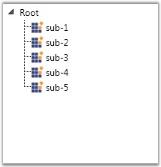
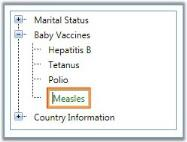

# Styles and Templates

This section deals with the following Styles and Templates supported by TreeViewAdv control. 

## Setting Drag Indicator Style

You can customize the style of the Drag Indicator which is used to indicate the drag-and-drop operation in progress by using the DragIndicatorStyle property. The following code example illustrates how to set this property.

[XAML]

<Window x:Class="WpfApplication2.Window1"

    xmlns="http://schemas.microsoft.com/winfx/2006/xaml/presentation"

    xmlns:x="http://schemas.microsoft.com/winfx/2006/xaml"

    xmlns:syncfusion="http://schemas.syncfusion.com/wpf"

    Title="Window1" Height="300" Width="300">

    <Window.Resources>

        <!-- Creating the style for DragIndicator -->

        

    </Window.Resources>

    <Grid>

        <!-- Adding TreeViewAdv with DragIndicatorStyle -->

        <syncfusion:TreeViewAdv DragIndicatorStyle="{StaticResource Drag_Marker}"  Name="treeViewAdv">

            <!-- Adding TreeViewItemAdv -->

            <syncfusion:TreeViewItemAdv Header="Marital Status">

                <syncfusion:TreeViewItemAdv Header="Single"/>

                <syncfusion:TreeViewItemAdv Header="Married"/>

                <syncfusion:TreeViewItemAdv Header="Married with Children"/>

            </syncfusion:TreeViewItemAdv>

            <syncfusion:TreeViewItemAdv Header="Baby Vaccines">

                <syncfusion:TreeViewItemAdv Header="Hepatitis B"/>

                <syncfusion:TreeViewItemAdv Header="Tetanus"/>

                <syncfusion:TreeViewItemAdv Header="Polio"/>

                <syncfusion:TreeViewItemAdv Header="Measles"/>

            </syncfusion:TreeViewItemAdv>

            <syncfusion:TreeViewItemAdv Header="Country Information"/>

        </syncfusion:TreeViewAdv>

    </Grid>

</Window>

{{ '' | markdownify }}
{:.image }

## Setting Header Template

User can customize the header of the treeview item by using HeaderTemplate using the below code snippet.

[XAML]

<Window x:Class="WpfApplication2.Window1"

    xmlns="http://schemas.microsoft.com/winfx/2006/xaml/presentation"

    xmlns:x="http://schemas.microsoft.com/winfx/2006/xaml"

    xmlns:syncfusion="http://schemas.syncfusion.com/wpf"

    Title="Window1" Height="300" Width="300">

  <Window.Resources>

    <DataTemplate x:Key="HD1">

      <StackPanel Orientation="Horizontal">

        <TextBlock FontWeight="Bold" Text="Marital Status" />

      </StackPanel>

    </DataTemplate>

  </Window.Resources>

  <Grid>

    <!-- Adding TreeViewAdv with HeaderTemplate -->

    <syncfusion:TreeViewAdv Name="treeViewAdv">

      <!-- Adding TreeViewItemAdv -->

      <syncfusion:TreeViewItemAdv Name="treeViewItemAdv1" HeaderTemplate="{StaticResource HD1}">

        <syncfusion:TreeViewItemAdv Header="Single"/>

        <syncfusion:TreeViewItemAdv Header="Married"/>

        <syncfusion:TreeViewItemAdv Header="Married with Children"/>

      </syncfusion:TreeViewItemAdv>

    </syncfusion:TreeViewAdv>

  </Grid>

</Window>

{{ '' | markdownify }}
{:.image }

## Setting Expand Style

The ExpanderStyle property enables to customize the appearance and style of expansion of the TreeViewAdv during the Expand or Collapse operation. The following code example illustrates how to set this property.

[XAML]

<Window.Resources>

    <!-- Template for TreeViewAdvExpander -->

    <ControlTemplate x:Key="MyFxExpanderTemplateKey" TargetType="{x:Type Expander}">

        <ToggleButton Name="Expander" ClickMode="Press" IsChecked="{Binding Path=IsExpanded, RelativeSource={RelativeSource TemplatedParent}}">

            <ToggleButton.Style>

                

            </ToggleButton.Style>

        </ToggleButton>

    </ControlTemplate>

    <!-- Style for TreeViewAdvExpander -->

    

</Window.Resources>

<Grid>

    <!-- Adding TreeViewAdv with expand animation -->

    <syncfusion:TreeViewAdv Name="treeViewAdv" ExpanderStyle="{DynamicResource MyEStyle}">

        <!-- Adding TreeViewItemAdv -->

        <syncfusion:TreeViewItemAdv Name="treeViewItemAdv" Header="Marital Status">

            <syncfusion:TreeViewItemAdv Header="Single"/>

            <syncfusion:TreeViewItemAdv Header="Married"/>

            <syncfusion:TreeViewItemAdv Header="Married with Children"/>

        </syncfusion:TreeViewItemAdv>

        <syncfusion:TreeViewItemAdv Header="Baby Vaccines">

            <syncfusion:TreeViewItemAdv Header="Hepatitis B"/>

            <syncfusion:TreeViewItemAdv Header="Tetanus"/>

            <syncfusion:TreeViewItemAdv Header="Polio"/>

            <syncfusion:TreeViewItemAdv Header="Measles"/>

        </syncfusion:TreeViewItemAdv>

        <syncfusion:TreeViewItemAdv Header="Country Information"/>

    </syncfusion:TreeViewAdv>

</Grid>

{{ '' | markdownify }}
{:.image }

## Setting Cell Template

You can customize the items under a column header by defining a cell template for the TreeViewColumns. To create a cell template use the below code

[XAML]

<!-- Adding TreeViewAdv with Enabling multiple column -->

<syncfusion:TreeViewAdv Name="treeViewAdv" MultiColumnEnable="True">

  <!-- Adding TreeViewItemAdv -->

  <syncfusion:TreeViewItemAdv Name="treeViewItemAdv" Header="Marital Status">

    <syncfusion:TreeViewItemAdv Header="Single"/>

    <syncfusion:TreeViewItemAdv Header="Married"/>

    <syncfusion:TreeViewItemAdv Header="Married with Children"/>

  </syncfusion:TreeViewItemAdv>

  <syncfusion:TreeViewItemAdv Header="Baby Vaccines">

    <syncfusion:TreeViewItemAdv Header="Hepatitis B"/>

    <syncfusion:TreeViewItemAdv Header="Tetanus"/>

    <syncfusion:TreeViewItemAdv Header="Polio"/>

    <syncfusion:TreeViewItemAdv Header="Measles"/>

  </syncfusion:TreeViewItemAdv>

  <syncfusion:TreeViewItemAdv Header="Country Information">

    <syncfusion:TreeViewItemAdv Header="Canada"/>

    <syncfusion:TreeViewItemAdv Header="France"/>

    <syncfusion:TreeViewItemAdv Header="Germany"/>

    <syncfusion:TreeViewItemAdv Header="UK"/>

    <syncfusion:TreeViewItemAdv Header="USA"/>

  </syncfusion:TreeViewItemAdv>

  <!-- Adding header -->

  <syncfusion:TreeViewAdv.Columns>

    <syncfusion:TreeViewColumnCollection>

      <syncfusion:TreeViewColumn Width="150" Header="Status"

       DisplayMemberBinding="{Binding Path=Header, RelativeSource={RelativeSource AncestorType={x:Type 			syncfusion:TreeViewItemAdv}}}"/>

      <syncfusion:TreeViewColumn Width="100" Header="Vaccines"

       DisplayMemberBinding="{Binding Path=Header, RelativeSource={RelativeSource AncestorType={x:Type 			syncfusion:TreeViewItemAdv}}}"/>

      <syncfusion:TreeViewColumn Width="50" Header="Country">

        <!-- Cell Template -->

        <syncfusion:TreeViewColumn.CellTemplate>

          <DataTemplate>

            <Border Margin="1" Width="150" BorderBrush="Red" BorderThickness="1">

              <TextBlock Margin="2" Text="{Binding Path=Header, RelativeSource={RelativeSource 					AncestorType={x:Type syncfusion:TreeViewItemAdv}}}"/>

            </Border>

          </DataTemplate>

        </syncfusion:TreeViewColumn.CellTemplate>

      </syncfusion:TreeViewColumn>

    </syncfusion:TreeViewColumnCollection>

  </syncfusion:TreeViewAdv.Columns>

</syncfusion:TreeViewAdv>

{{ '' | markdownify }}
{:.image }

## Setting Item Container Style

To set the style for the item container, use ItemContainerStyle property. This dependency property can be applied to TreeViewAdv, as well as TreeViewItemAdv. 

The following example can be used to set this property.

[XAML]

<Grid>

     <Grid.Resources>

           

            

     </Grid.Resources>

     <syncfusion:TreeViewAdv>

         <syncfusion:TreeViewItemAdv Header="Root" IsExpanded="True">

          <syncfusion:TreeViewItemAdv Header="sub-1"/>

          <syncfusion:TreeViewItemAdv Header="sub-2"/>

          <syncfusion:TreeViewItemAdv Header="sub-3"/>

          <syncfusion:TreeViewItemAdv Header="sub-4"/>

          <syncfusion:TreeViewItemAdv Header="sub-5"/>

          </syncfusion:TreeViewItemAdv>

     </syncfusion:TreeViewAdv>

</Grid>

The following screen shot shows how the TreeViewAdv looks after applying ItemContainerStyle property.

{{ '' | markdownify }}
{:.image }

## Using Edit Item Template in TreeViewAdv

User can customize the edited item by using the EditedItemTemplate property, which gets or sets the DataTemplate that is used to display each item in edit mode. 

[XAML]

<Window x:Class="WpfApplication2.Window1"

    xmlns="http://schemas.microsoft.com/winfx/2006/xaml/presentation"

    xmlns:x="http://schemas.microsoft.com/winfx/2006/xaml"

    xmlns:syncfusion="http://schemas.syncfusion.com/wpf"

    Title="Window1" Height="300" Width="300">

  <Window.Resources>

    <!-- CustomEditedItemTemplate -->

    <DataTemplate x:Key="CustomEditedItemTemplate" DataType="{x:Type syncfusion:TreeViewItemAdv}">

      <Border BorderBrush="Red" Background="Orange"  BorderThickness="1" Margin="1" Padding="2">

        <TextBox Foreground="Green" Text="{Binding Path=(syncfusion:TreeViewItemAdv.Header), Mode=TwoWay, RelativeSource={RelativeSource AncestorType={x:Type syncfusion:TreeViewItemAdv}}}"/>

      </Border>

    </DataTemplate>

  </Window.Resources>

  <Grid>

    <!-- Adding TreeViewAdv with CustomEditedItemTemplate -->

    <syncfusion:TreeViewAdv Name="treeViewAdv" EditedItemTemplate="{StaticResource CustomEditedItemTemplate}">

      <!-- Adding TreeViewItemAdv -->

      <syncfusion:TreeViewItemAdv Name="treeViewItemAdv1" Header="Marital Status">

        <syncfusion:TreeViewItemAdv Header="Single"/>

        <syncfusion:TreeViewItemAdv Header="Married"/>

        <syncfusion:TreeViewItemAdv Header="Married with Children"/>

      </syncfusion:TreeViewItemAdv>

      <syncfusion:TreeViewItemAdv Name="treeViewItemAdv2" Header="Baby Vaccines">

        <syncfusion:TreeViewItemAdv Header="Hepatitis B"/>

        <syncfusion:TreeViewItemAdv Header="Tetanus"/>

        <syncfusion:TreeViewItemAdv Header="Polio"/>

        <syncfusion:TreeViewItemAdv Header="Measles"/>

      </syncfusion:TreeViewItemAdv>

      <syncfusion:TreeViewItemAdv Header="Country Information">

        <syncfusion:TreeViewItemAdv Header="Canada"/>

        <syncfusion:TreeViewItemAdv Header="France"/>

        <syncfusion:TreeViewItemAdv Header="Germany"/>

        <syncfusion:TreeViewItemAdv Header="UK"/>

        <syncfusion:TreeViewItemAdv Header="USA"/>

      </syncfusion:TreeViewItemAdv>

    </syncfusion:TreeViewAdv>

  </Grid>

</Window>

{{ '' | markdownify }}
{:.image }

EditedItemTemplateSelector

Allows the application writer to provide custom logic for choosing a template that is used to display each item in edit mode. It is a custom DataTemplateSelector object that provides logic and returns a DataTemplate. The default value is null reference.

[C#]

/// <StackPanel Name="stackPanel">

/// <local:TreeViewAdv Name="myTreeview">

///     <local:TreeViewItemAdv Header="Employee1"

///      EditedItemTemplateSelector="{StaticResource auctionItemDataTemplateSelector}">

///         <local:TreeViewItemAdv Header="Jesper"/>

///         <local:TreeViewItemAdv Header="Aaberg"/>

///         <local:TreeViewItemAdv Header="12345"/>

///     </local:TreeViewItemAdv>

///     <local:TreeViewItemAdv Header="Employee2">

///         <local:TreeViewItemAdv Header="Dominik"/>

///         <local:TreeViewItemAdv Header="Paiha"/>

///         <local:TreeViewItemAdv Header="98765"/>

///     </local:TreeViewItemAdv>

/// </local:TreeViewAdv>

/// </StackPanel>

/// </Window>

/// ]]>

/// </code>

///

/// <para/>The following example shows the implementation 

/// of the <I>AuctionItemDataTemplateSelector</I> class with 

/// an override of the SelectTemplate method:

/// <code language="C#">

/// using System.Windows;

/// using System.Windows.Controls;

/// 

/// namespace SDKSample

/// {

///     public class AuctionItemDataTemplateSelector : DataTemplateSelector

///     {

///         public override DataTemplate 

///             SelectTemplate(object item, DependencyObject container)

///         {

///             if (item != null && item is AuctionItem)

///             {

///                 AuctionItem auctionItem = item as AuctionItem;

///                 Window window = Application.Current.MainWindow;

/// 

///                 switch (auctionItem.SpecialFeatures)

///                 {

///                     case SpecialFeatures.None:

///                     return window.FindResource("AuctionItem_None") as DataTemplate;

///                     case SpecialFeatures.Color:

///                     return window.FindResource("AuctionItem_Color") as DataTemplate;

///                 }

///             }

/// 

///             return null;

///         }

///     }

/// }

