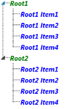

# Styling

The user can apply different styles to the TreeViewAdv. This section list outs the styles that are supported by TreeViewAdv.

## Visual Styles

TreeViewAdv supports the following built-in Visual Styles:

* Office2007Blue
* Office2007Black
* Office2007Silver
* Office2010Blue
* Office2010Black
* Office2010Silver
* Blend
* VS2010
* Metro
* Transparent

The visual style can be applied in XAML as follows:

[XAML]

<syncfusion:TreeViewAdv        syncfusion:SkinStorage.VisualStyle="Office2010Blue"/>    

The TreeViewAdv gets the Office2010Blue look after implementing the above snippet.

Visual styles can be applied in C# as follows:

[C#]

SkinStorage.SetVisualStyle(treeviewAdvinstance, "Office2010Blue");

## ItemContainerStyle

The ItemContainerStyle property of the TreeViewAdv is used to set the style of the TreeViewItemAdv. This style is applied to all the TreeViewItemAdv available in the TreeViewAdv. The following example illustrates how the style can be set using the ItemContainerStyle:

1. Create the Style for TreeViewItemAdv as follows :

[XAML]

   	

2. Set the ItemContainerStyle of the TreeViewAdv as follows:

[XAML]

<syncfusion:TreeViewAdv  ItemsSource="{Binding TreeItems}"            

         ItemTemplate="{StaticResource NormalTemplate}"

         ItemContainerStyle="{StaticResource treeViewAdvItemContainerStyle}"

            />

The TreeViewAdv will be generated as follows:

{{ '' | markdownify }}
{:.image }

##  ItemContainerStyleSelector

The ItemContainerStyleSelector property is used to choose the ItemContainerStyle at runtime base on certain conditions. The following example illustrates how to choose the ItemContainerStyle using the ItemContainerStyleSelector:

1. Create the StyleSelector as given in the following code snippet:

[C#]

public class TreeViewAdvItemContainerStyleSelector : StyleSelector

    {

        public override Style SelectStyle(object item, DependencyObject container)

        {

            Window window = Application.Current.MainWindow;

            if (((Model)item).Level == 0)

            {

                return ((Style)window.Resources["RootItemsStyle"]);

            }

            else

            {

                return ((Style)window.Resources["InnerItemsStyle"]);

            }           

        }

    }

2. Create the style in the Window’s resource as follows:

[XAML]

        

3. Define the style selector in the Window’s resource as follows:

[XAML]

<local:TreeViewAdvItemContainerStyleSelector x:Key="treeViewAdvItemContainerStyleSelector"/>

4. Set the ItemContainerStyle for the TreeViewAdv as follows:

[XAML]

<syncfusion:TreeViewAdv ItemsSource="{Binding TreeItems}"            

                        ItemTemplate="{StaticResource NormalTemplate}"

                        ItemContainerStyleSelector="{StaticResource treeViewAdvItemContainerStyleSelector}"  />

The TreeViewAdv generates as shown in the following screen shot:

{{ '' | markdownify }}
{:.image }

## Expander Style

The user can customize the style of the expander displayed in the TreeViewAdv using the ExpanderStyle property. The following example illustrates how to customize the style:

1. Create the style for the Expander as given in the following code snippet:

[XAML]

2. Set the style to the ExpanderStyle property of the TreeViewAdv.

[XAML]

<syncfusion:TreeViewAdv ItemsSource="{Binding TreeItems}"            

                        ItemTemplate="{StaticResource NormalTemplate}"

                        ExpanderStyle="{StaticResource expanderStyle}"

                                 />

The TreeViewAdv generates as shown in the following screenshot:

{{ '' | markdownify }}
{:.image }

