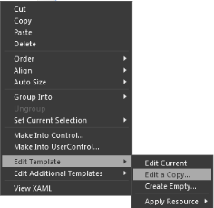
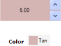
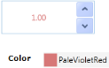
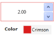
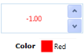
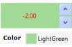
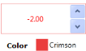

## Appearance

You can customize the appearance of the UpDown control by editing its style in the Expression Blend or by using the properties exposed by the UpDown control.

### Blendability 

To edit the style of the UpDown control in the Expression Blend:

1. Drag the UpDown control to the Design View. The UpDown control appears as shown in the following screenshot.

   

2. Right-click the UpDown control, select Edit Template, and then select Edit a Copy.

   

After the Edit a Copy option is selected, the style of the UpDown control is generated in the XAML file. You can change the Control Template or some of the brushes of the UpDown control by using the properties exposed by the UpDown control.

In the following code, the BorderBrush color is changed when the IsMouseOver value changes.



<Trigger Property="IsMouseOver" Value="True">

    <Setter Property="BorderBrush" TargetName="Border" Value="Red"/>

</Trigger>



### Customizing by Using Properties

You can customize the appearance of the UpDown control by using the properties exposed by the control. The appearance of the UpDown control can be changed when the following properties are used:

* FocusedBackground
* FocusedBorderBrush
* FocusedForeground

These properties are enabled only when the EnableFocusedColors property is set to true.

The appearance of the UpDown control can be changed when the value in the UpDown is negative by using the following properties:

* NegativeBackground
* NegativeBorderBrush
* NegativeForeground

These properties are enabled only when the EnableNegativeColors property is set to true.

The color of the zero value can be changed by using the ZeroColor property. The ZeroColor property can be enabled by setting the ApplyZeroColor property to true.

### Skins

The appearance of the UpDown control can be customized by using the VisualStyle property. The following are the built-in skins for the UpDown control:

* Blend
* Office2003
* Office2007Blue
* Office2007Black
* Office2007Silver
* ShinyBlue
* ShinyRed
* SyncOrange
* VS2010
* Metro
* Transparent

