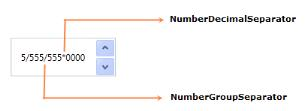

# Culture and Number Formatting

The `UpDown` control provides globalization support by enabling to change the culture of the control by using the `Culture` property.

The Number formatting controls how a number is displayed in the `UpDown` control by specifying the culture-specific group separator, decimal separator, and the number of decimal digits to be used. It can also format the value of the `UpDown` control by using the `NumberFormatInfo` property.

## Culture

`Culture` can be set to `en-US` for the `UpDown` control as shown in the following code example. The U.S. culture uses “.” as the `NumberDecimalSeparator`.





<syncfusion:UpDown Name="upDown" Culture="en-US" Width="100" Height="23" />





UpDown updown = new UpDown();
updown.Width = 100;
updown.Height = 23;
System.Globalization.CultureInfo cultureInfo = new System.Globalization.CultureInfo("en-US");
updown.Culture = cultureInfo;
Grid1.Children.Add(updown);



 

`Culture` can also be set to `bs-Latn` for the `UpDown` control as shown in the following code example. The Latin culture uses “,” as the `NumberDecimalSeparator`.





<syncfusion:UpDown Name="upDown" Culture="bs-Latn" Width="100" Height="23" />





UpDown updown = new UpDown();
updown.Width = 100;
updown.Height = 23;
System.Globalization.CultureInfo cultureInfo = new System.Globalization.CultureInfo("bs-Latn");
updown.Culture = cultureInfo;
Grid1.Children.Add(updown);



 

<table>
<tr>
<td>
Property</td><td>
Description</td><td>
Type</td><td>
DataType</td></tr>
<tr>
<td>
Culture</td><td>
Gets or sets the CultureInfo.</td><td>
DependencyProperty</td><td>
CultureInfo</td></tr>
</table>

## NumberFormatInfo

The `NumberFormatInfo` can be set for the `UpDown` control as shown in the following code example.




<syncfusion:UpDown Name="upDown" Value="5555555">
<syncfusion:UpDown.NumberFormatInfo>
<globalization:NumberFormatInfo NumberGroupSeparator="/" NumberDecimalDigits="4" NumberDecimalSeparator="*"/>
</ syncfusion:UpDown.NumberFormatInfo>  
</ syncfusion:UpDown>



 

## GroupSeparatorEnabled

`GroupSeparatorEnabled` feature helps to add the separator for the groups in the value of the `UpDown` control. By default its value is `false`.

The following code example explains to set the `GroupSeparatorEnabled` for the `UpDown` control:




<syncfusion:UpDown Name="upDown" Width="100" Height="23" Value="1000000" GroupSeperatorEnabled="True" />





UpDown updown = new UpDown();
updown.Width = 100;
updown.Height = 23;
updown.Value = 1000000;
updown.GroupSeperatorEnabled = true;
Grid1.Children.Add(updown);  



 
## Tables for NumberFormat properties and events of UpDown

<table>
<tr>
<td>
Property</td><td>
Description</td><td>
Type</td><td>
DataType</td></tr>
<tr>
<td>
NumberFormatInfo</td><td>
Gets or sets the format of the number.</td><td>
DependencyProperty</td><td>
NumberFormatInfo</td></tr>
</table>
<table>
<tr>
<td>
Events</td><td>
Description</td><td>
Arguments</td><td>
Type</td></tr>
<tr>
<td>
NumberFormatInfoChanged</td><td>
Occurs when the format of the number changes.</td><td>
DependencyObject and DependencyPropertyChangedEventArgs.</td><td>
PropertyChangedCallback</td></tr>
</table>
