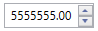
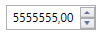

# Formatting

This section explains about the number formatting and culture of WPF UpDown control.

## Decimal digit

The [NumberDecimalDigits](https://help.syncfusion.com/cr/wpf/Syncfusion.Shared.Wpf~Syncfusion.Windows.Shared.UpDown~NumberDecimalDigits.html) property is used to specify the number of digits to be displayed after the decimal point in the WPF [UpDown](https://help.syncfusion.com/cr/wpf/Syncfusion.Shared.Wpf~Syncfusion.Windows.Shared.UpDown.html) control.





<syncfusion:UpDown Name="upDown" Height="23" Width="100" NumberDecimalDigits="4" />





UpDown updown = new UpDown();
updown.Height = 23;
updown.Width = 100;
updown.NumberDecimalDigits = 4;
grid.Children.Add(updown);





## Group separator

The [GroupSeparatorEnabled](https://help.syncfusion.com/cr/wpf/Syncfusion.Shared.Wpf~Syncfusion.Windows.Shared.UpDown~GroupSeperatorEnabled.html) property enables add the group separator to the WPF [UpDown](https://help.syncfusion.com/cr/wpf/Syncfusion.Shared.Wpf~Syncfusion.Windows.Shared.UpDown.html) control value. The default value is `false`.





<syncfusion:UpDown Name="upDown" Width="100" Height="23" Value="5555555" GroupSeperatorEnabled="True" />





updown.Value = 5555555;
updown.GroupSeperatorEnabled = true;





## NumberFormatInfo

The number formatting of WPF UpDown control can be customized by setting [UpDown.NumberFormatInfo](https://help.syncfusion.com/cr/wpf/Syncfusion.Shared.Wpf~Syncfusion.Windows.Shared.UpDown~NumberFormatInfo.html) property by specifying the culture-specific group separator, decimal separator, and the number of decimal digits. The [GroupSeperatorEnabled](https://help.syncfusion.com/cr/wpf/Syncfusion.Shared.Wpf~Syncfusion.Windows.Shared.UpDown~GroupSeperatorEnabled.html) property must be enabled to see the group separator between values.





<syncfusion:UpDown Name="upDown" Value="5555555" GroupSeperatorEnabled="True">
<syncfusion:UpDown.NumberFormatInfo>
<globalization:NumberFormatInfo NumberGroupSeparator="/" NumberDecimalDigits="4" NumberDecimalSeparator="*"/>
</ syncfusion:UpDown.NumberFormatInfo>  
</ syncfusion:UpDown>





//Assign a value
updown.Value = 5555555;

//Initialize numberformatinfo
NumberFormatInfo numberFormatInfo = new NumberFormatInfo();

// set the format of number and group
updown.GroupSeperatorEnabled = true;
updown.NumberFormatInfo = numberFormatInfo;
updown.NumberFormatInfo.NumberGroupSeparator = "/";
updown.NumberFormatInfo.NumberDecimalDigits = 4;
updown.NumberFormatInfo.NumberDecimalSeparator = "*";

 

## Culture

The WPF UpDown control provides globalization support by enabling to change the culture of the control by using the [Culture](https://help.syncfusion.com/cr/wpf/Syncfusion.Shared.Wpf~Syncfusion.Windows.Shared.UpDown~Culture.html) property.

The [Culture](https://help.syncfusion.com/cr/wpf/Syncfusion.Shared.Wpf~Syncfusion.Windows.Shared.UpDown~Culture.html) property can be set to `en-US` for UpDown control. The U.S. culture uses "." as the decimal seperator.





<syncfusion:UpDown Name="upDown" Culture="en-US" Value="5555555" Width="100" Height="23" />





System.Globalization.CultureInfo cultureInfo = new System.Globalization.CultureInfo("en-US");
updown.Culture = cultureInfo;
updown.Value = 5555555;



 

The [Culture](https://help.syncfusion.com/cr/wpf/Syncfusion.Shared.Wpf~Syncfusion.Windows.Shared.UpDown~Culture.html) property can also be set to `bs-Latn` for the UpDown control. The Latin culture uses ","as the decimal seperator.





<syncfusion:UpDown Name="upDown" Culture="bs-Latn" Width="100" Height="23" />





System.Globalization.CultureInfo cultureInfo = new System.Globalization.CultureInfo("bs-Latn");
updown.Culture = cultureInfo;



 

 
## Text alignment

You can align the text by using the [TextAlignment](https://help.syncfusion.com/cr/wpf/Syncfusion.Shared.Wpf~Syncfusion.Windows.Shared.UpDown~TextAlignment.html) property of UpDown control. You can align the text with the following options. The options are Left, Right, Center and Justify.





<syncfusion:UpDown Value="40" Height="23" TextAlignment="Left" Width="100" />





updown.TextAlignment = TextAlignment.Left;





