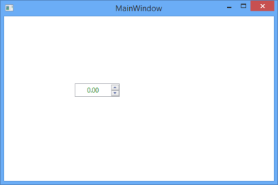
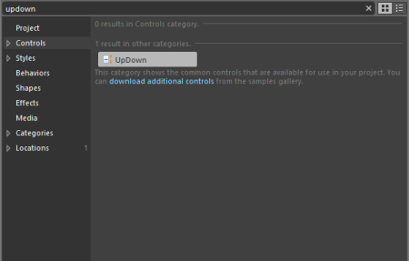

# Getting Started

## Add UpDown to an Application

The UpDown control can be added to an application by using the following applications.

### Create the UpDown Control by using XAML

To create an UpDown instance in the Visual Studio, drag the UpDown control from the Toolbox window to the Design View. An instance of the UpDown control is created in the Design View.

The following code example illustrates how to add the UpDown control to an application through XAML.

<syncfusion:UpDown HorizontalAlignment="Left" Height="25" Margin="133,127,0,0" VerticalAlignment="Top" Width="85"/>

### 1.2.1.2 Create the UpDown Control by using C#

The following code example illustrates how to add the UpDown control to an application through C#.



UpDown upDown = new UpDown() { Height = 25, Width = 85 };

grid.Children.Add(upDown);



### 1.2.1.3 Create the UpDown Control by using the Expression Blend

The step-by-step procedure to add the UpDown control to an application through the MicrosoftExpression Blend is as follows:

1. Create a new WPF application in the Microsoft Expression Blend.
2. Add the following reference to the sample application - Syncfusion.Shared.WPF.dll
3. On the Window menu, select Assets. This opens the Assets Library dialog box.
4. In the search box, type UpDown and the search results are displayed as shown.

   

5. Drag the UpDown control to the Design View. An instance of the UpDown control is created.

   

