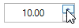
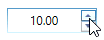

# Interaction

This section explains about how to change the value by using mouse and keyboard in WPF [UpDown](https://help.syncfusion.com/cr/wpf/Syncfusion.Shared.Wpf~Syncfusion.Windows.Shared.UpDown.html) control.

## Keyboard and Mouse support

The `UpDown` control provides to change the value by keyboard or mouse interaction, and increase or decrease the value through keyboard down and up operation. It also allows to change the value through mousewheel operations.

## Mouse scrolling

When the `IsScrollingOnCircle` property is enabled, the user can increase or decrease the current value of the text box by scrolling over UpDown control.





<syncfusion:UpDown Name="upDown" Width="100" Height="23" IsScrollingOnCircle="True" />





UpDown updown = new UpDown();
updown.Value = 10;
updown.IsScrollingOnCircle = true;
grid.Children.Add(updown);





## Step

The [Step](https://help.syncfusion.com/cr/wpf/Syncfusion.Shared.Wpf~Syncfusion.Windows.Shared.UpDown~Step.html) property is used to specify the interval to increase or decrease the value while pressing the spin buttons in the [UpDown](https://help.syncfusion.com/cr/wpf/Syncfusion.Shared.Wpf~Syncfusion.Windows.Shared.UpDown.html) control. For example, the `Step` value is set to 5 so that the `UpDown` control value increases or decreases by 5 while pressing the spin buttons.

Another way,

You can also increase or decrease the present value in the text box by using up or down arrow key in keyboard.





<syncfusion:UpDown Name="upDown" Value="10" Width="100" Height="23" Step="5"/>





updown.Value = 10;
updown.Width = 100;
updown.Height = 23;
updown.Step = 5;





## Animation speed

When the [UpDown](https://help.syncfusion.com/cr/wpf/Syncfusion.Shared.Wpf~Syncfusion.Windows.Shared.UpDown.html) value changes by using the up and down buttons, the textbox animates the transition from the current value to the new value. 

You can show the animation when the value is increase or decrease in UpDown control using [AnimationSpeed](https://help.syncfusion.com/cr/wpf/Syncfusion.Shared.Wpf~Syncfusion.Windows.Shared.UpDown~AnimationSpeed.html) property. 





<syncfusion:UpDown Name="upDown" Value="10" AnimationSpeed="0.5" Width="100" Height="23"/>





updown.Value = 10;
updown.Width = 100;
updown.Height = 23;
updown.AnimationSpeed = 0.5;





## Range Adorner

You can show the adorner range based on the minimum and maximum values, the [EnableRangeAdorner](https://help.syncfusion.com/cr/wpf/Syncfusion.Shared.Wpf~Syncfusion.Windows.Shared.UpDown~EnableRangeAdorner.html) property need to set to `True`. The default value is false. You can also change the background color of range adorner using [RangeAdornerBackground](https://help.syncfusion.com/cr/wpf/Syncfusion.Shared.Wpf~Syncfusion.Windows.Shared.UpDown~RangeAdornerBackground.html) property.





<syncfusion:UpDown Name="upDown" Height="25" Width="90" Value="40" RangeAdornerBackground="Gray" EnableRangeAdorner="True" MinValue="0" MaxValue="100" />





updown.MinValue = 0;
updown.MaxValue = 100;
updown.EnableRangeAdorner = true;
updown.RangeAdornerBackground = Brushes.Gray;





