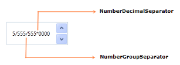

# Number Formatting

The Number formatting controls how a number is displayed in the UpDown control by specifying the culture-specific group separator, decimal separator, and the number of decimal digits to be used. You can format the value of the UpDown control by using the NumberFormatInfo property.

### Use of NumberFormatInfo

The NumberFormatInfo can be set for the UpDown control as shown in the following code example.


 [XAML]

<syncfusion:UpDown HorizontalAlignment="Center" VerticalAlignment="Center" Name="upDown" Height="51"Width="140" Value="5555555">

            < syncfusion:UpDown.NumberFormatInfo>

                <globalization:NumberFormatInfo NumberGroupSeparator="/" NumberDecimalDigits="4"

                                       NumberDecimalSeparator="*"/>

            </ syncfusion:UpDown.NumberFormatInfo>

        </ syncfusion:UpDown>





[C#]

UpDown upDown = new UpDown();

upDown.Value = 5555555;

upDown.NumberFormatInfo = new NumberFormatInfo()

{

NumberGroupSeparator = "/",

NumberDecimalDigits = 4,

NumberDecimalSeparator = "*"

};



Tables for Properties, and Events

_NumberFormatInfo Property_

<table>
<tr>
<td>
{{ '**Property**' | markdownify }}</td><td>
{{ '**Description**' | markdownify }}</td><td>
{{ '**Type**' | markdownify }}</td><td>
{{ '**Data Type**' | markdownify }}</td><td>
{{ '**Reference links**' | markdownify }}</td></tr>
<tr>
<td>
NumberFormatInfo</td><td>
Gets or sets the format of the number.</td><td>
DependencyProperty</td><td>
NumberFormatInfo</td><td>
Not applicable.</td></tr>
</table>

_NumberFormatInfo Event_

<table>
<tr>
<th>
{{ '**Events**' | markdownify }}</th><th>
{{ '**Description**' | markdownify }}</th><th>
{{ '**Arguments**' | markdownify }}</th><th>
{{ '**Type**' | markdownify }}</th><th>
{{ '**Reference links**' | markdownify }}</th></tr>
<tr>
<th>
NumberFormatInfoChanged</th><th>
Occurs when the format of the number changes.</th><th>
DependencyObject andDependencyPropertyChangedEventArgs.</th><th>
PropertyChangedCallback</th><th>
Not applicable.</th></tr>
</table>

