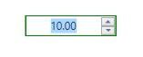
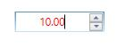
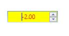
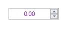
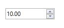
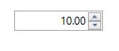
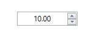

# Styles and Templates

The appearance of the `UpDown` control can be customized by editing its style or by using the properties exposed by the `UpDown` control.

## Customize using Properties

The appearance of the `UpDown` control can be customized using the properties exposed by the control. The appearance of the `UpDown` control can be changed when the following properties are used.

* FocusedBackground
* FocusedBorderBrush
* FocusedForeground

These properties are enabled only when the `EnableFocusedColors` property is set to `true`.

## FocusedBackground

The background color for the `UpDown` control can be customized using the `FocusedBackground` property when the control get focused. The same has been explained in the below code example:




<syncfusion:UpDown Name="upDown" Value="10" FocusedBackground="Pink" EnableFocusedColors="True" />





UpDown updown = new UpDown();

updown.Value = 10;

updown.EnableFocusedColors = true;

updown.FocusedBackground = Brushes.Pink;

Grid1.Children.Add(updown);





The following screenshot shows how the background for the `UpDown` control applied when it get focused.

## FocusedBorderBrush

The BorderBrush color for the `UpDown` control can be customized when it get focused using the `FocusedBorderBrush` property. The same has been explained in the below code example:





<syncfusion:UpDown Name="upDown" Value="10" FocusedBorderBrush="Green" EnableFocusedColors="True" />





UpDown updown = new UpDown();

updown.Value = 10;

updown.EnableFocusedColors = true;

updown.FocusedBorderBrush = Brushes.Green;

Grid1.Children.Add(updown);





The following screenshot shows how the BorderBrush for the `UpDown` control customized when it get focused.

## FocusedForeground

The foreground color for the `Updown` control can be customized using the `FocusedForeground` property when it got focused. The same has been explained in the below code example:





<syncfusion:UpDown Name="upDown" Value="10"  FocusedForeground="Red" EnableFocusedColors="True" />





UpDown updown = new UpDown();

updown.Value = 10;

updown.EnableFocusedColors = true;

updown.FocusedForeground = Brushes.Red;

Grid1.Children.Add(updown);          





The following screenshot shows how the foreground customized for the value of `UpDown` control when it get focused.

The appearance of the `UpDown` control can be changed when the value in the `UpDown` is negative by using the following properties:

* NegativeBackground
* NegativeForeground

These properties are enabled only when the `EnableNegativeColors` property is set to `true`.

## NegativeBackground

The background for the negative value can be customized using the `NegativeBackground` property of `UpDown` control. The same has been explained in the following code example:




<syncfusion:UpDown Name="upDown" Value="-2" EnableNegativeColors="True" NegativeBackground="Yellow"/>





UpDown updown = new UpDown();

updown.Value = -2;

updown.EnableNegativeColors = true;

updown.NegativeBackground = Brushes.Yellow;        

Grid1.Children.Add(updown);





## NegativeForeground

The foreground color for the Negative value in the `UpDown` control can be customized using the `NegativeForeground` property.




<syncfusion:UpDown Name="upDown" Value="-2" EnableNegativeColors="True" NegativeForeground="Blue" />





UpDown updown = new UpDown();

updown.Value = -2;

updown.EnableNegativeColors = true;

updown.NegativeForeground = Brushes.Blue;

Grid1.Children.Add(updown);





## ApplyZeroColor

The color of the zero value can be changed by using the `ZeroColor` property. The `ZeroColor` property can be enabled by setting the `ApplyZeroColor` property to `true`.




<syncfusion:UpDown Name="upDown" Value="0" ApplyZeroColor="True"  ZeroColor="DarkViolet" />




UpDown updown = new UpDown();

updown.Value = 0;

updown.ApplyZeroColor = true;

updown.ZeroColor = Brushes.DarkViolet;

Grid1.Children.Add(updown);





## Change the alignment of the text Part in UpDown

The alignment of the text in the `UpDown` control can change by using the `TextAlignment` property. The following code can be used to set the `TextAlignment` for the `UpDown` control.

The `UpDown` control provided following four `TextAlignment` modes as listed below:

* Left
* Right
* Center
* Justify

**TextAlignment - Left**

The `TextAlignment` can set to the `Left` in the `UpDown` control as shown in the following code example





<syncfusion:UpDown Name="upDown" TextAlignment="Left" Value="10" />





UpDown updown = new UpDown();

updown.Value = 10;

updown.TextAlignment = TextAlignment.Left;

Grid1.Children.Add(updown);





**TextAlignment - Right**

The `TextAlignment` can be set to the `Right` in the `UpDown` control as shown in the following code example.




<syncfusion:UpDown Name="upDown" TextAlignment="Right" Value="10" />





UpDown updown = new UpDown();

updown.Value = 10;

updown.TextAlignment = TextAlignment.Right;

Grid1.Children.Add(updown);





**TextAlignment - Center**

The `TextAlignment` can be set to the `Center` in the `UpDown` control as shown in the following code example.




<syncfusion:UpDown Name="upDown" TextAlignment="Center" Value="10"/>





UpDown updown = new UpDown();

updown.Value = 10;

updown.TextAlignment = TextAlignment.Center;

Grid1.Children.Add(updown);





**TextAlignment - Justify**

The `TextAlignment` can be set to `Justify` in the `UpDown` control as shown in the following code example.




<syncfusion:UpDown Name="upDown" TextAlignment="Justify" Value="10"/>





UpDown updown = new UpDown();

updown.Value = 10; 

updown.TextAlignment = TextAlignment.Justify;

Grid1.Children.Add(updown);





## Visual Styles

`SkinManager` provides rich and professional look and feel UI for the `UpDown` control. Some of the available visual style are as follows:

* Blend
* Office2003
* Office2007Blue
* Office2007Black
* Office2007Silver
* ShinyBlue
* ShinyRed
* SyncOrange
* VS2010
* Metro
* Transparent

For example, the `Blend` style applied for the `UpDown` control shows in the following code example:




<Window x:Class="Application_New.MainWindow"

xmlns="http://schemas.microsoft.com/winfx/2006/xaml/presentation"

xmlns:x="http://schemas.microsoft.com/winfx/2006/xaml"

xmlns:shared="clr-namespace:Syncfusion.Windows.Tools.Controls;assembly=Syncfusion.Shared.Wpf"

xmlns:syncfusion="http://schemas.syncfusion.com/wpf"

syncfusion:SkinStorage.VisualStyle="Blend"

Title="MainWindow" Height="350" Width="525">

<Grid x:Name="Grid1">

<syncfusion:UpDown x:Name="Updown1" Width="100" Height="23"/>

</Grid>

</Window>





SkinStorage.SetVisualStyle(updown, "Blend");





