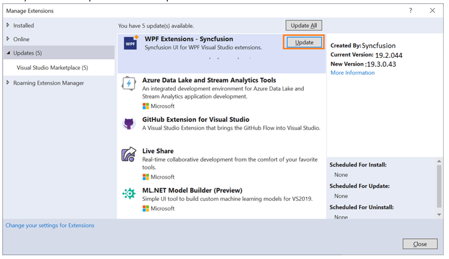
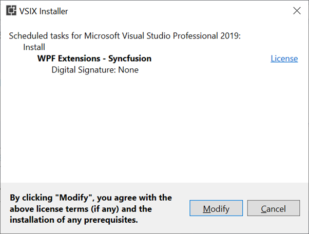

# Upgrading Syncfusion WPF Extensions

Syncfusion publishes the Visual Studio extension in the [Visual Studio marketplace](https://marketplace.visualstudio.com/items?itemName=SyncfusionInc.WPFExtension) for every Syncfusion Volume release, with exciting new features and Service Pack release with  major bug fixes in the volume releases. You can upgrade to our latest version from any installed Syncfusion version.

## Upgrading to the latest version

1. In Visual Studio go to **Extensions -> Manage Extensions -> Updates** and find the Syncfusion WPF extension.

2.  Then, click on the Update button to update the extension.

    

3.  Now close the Visual Studio and click on the Modify button in VSIX installer dialog.

    