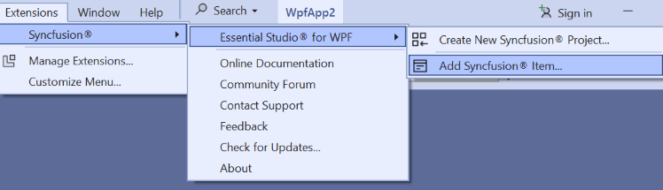
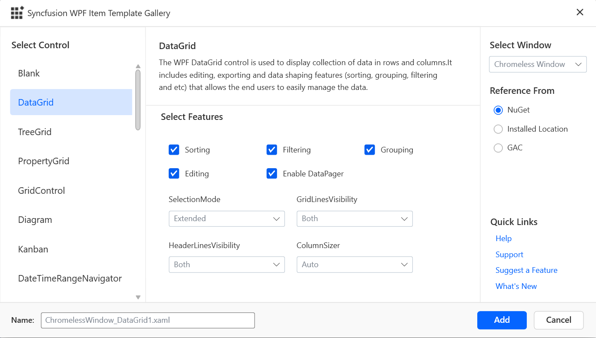

# Add Syncfusion components to the WPF Application

Syncfusion provides robust support for Visual Studio Item Templates, which facilitate the seamless integration of Syncfusion WPF components and preconfigured windows into your WPF application. These templates include all necessary Syncfusion WPF libraries, ensuring a smooth development experience.

I> The Syncfusion WPF item templates are available from v19.1.0.54. 

The following steps will guide you to add the Syncfusion WPF Components to your Visual Studio WPF application.

> Check whether the **WPF Extensions - Syncfusion** are installed or not in Visual Studio Extension Manager by going to **Extensions -> Manage Extensions -> Installed** for Visual Studio 2019 or later and Visual Studio 2017 or lower by going to **Tools -> Extensions and Updates -> Installed**. If this extension is not installed, please install the extension by following the steps from the [download and installation](https://help.syncfusion.com/wpf/visual-studio-integration/download-and-installation) help topic.

## Add components using Syncfusion Item Template

1.	Open a new or existing WPF application.

	**Option 1:**

2.	From the **Solution Explorer, right-click** on the WPF application. Choose **Add Syncfusion Item...**.

	

	**Option 2:**

3.	Click **Extensions > Essential Studio® for WPF > Add Syncfusion Item…** in Visual Studio.

	

4.	The Syncfusion WPF Item Template wizard will be launched as follows.

	

5.	Please choose one of the following scenarios to add Syncfusion Window in your application:

    **Default Window with Syncfusion Component:** If you select the **Default** window and then choose any Syncfusion component and the specific features that are essential for your project, the selected component will be added with the default Microsoft window layout.

	

    **Syncfusion Window with Syncfusion Component:** If you select a Syncfusion window and then choose any Syncfusion component and the specific features that are essential for your project, the selected component will be added with the layout of the selected Syncfusion window.

	

    **Syncfusion Window without Syncfusion Components:** If you select a Syncfusion window and then choose the **Blank** option from the Syncfusion component list, a blank Syncfusion window will be added without any Syncfusion components.

	 

6.	Choose an assembly reference option such as GAC location, Essential Studio® installed location, or NuGet packages to specify where the required Syncfusion assemblies 	are added to the project.

	N> If the Syncfusion Essential WPF build is installed, the Installed location and GAC options will be enabled. Without installing the Syncfusion Essential WPF setup, use the NuGet option. The GAC option will not be available when using the Syncfusion WPF components in a .NET Core application. The Version drop-down lists the installed WPF versions.

7.  Click **Add**, and a pop-up will appear providing information about adding component **files** and **NuGet/Assemblies** details.

		

8.	Click **OK** to incorporate the chosen components into the WPF application, along with the necessary Syncfusion assemblies.

	

9.	Then, Syncfusion licensing registration required message box will be shown if you installed the trial setup or NuGet packages since Syncfusion introduced the 			licensing system from 2018 Volume 2 (v16.2.0.41) Essential Studio® release. Navigate to the [help topic](https://help.syncfusion.com/common/essential-studio/			licensing/license-key#how-to-generate-syncfusion-license-key), which is shown in the licensing message box to generate and register the Syncfusion license key to 		your project. Refer to this [blog](https://blog.syncfusion.com/post/Whats-New-in-2018-Volume-2-Licensing-Changes-in-the-1620x-Version-of-Essential-Studio.aspx) post 	 for understanding the licensing changes introduced in Essential Studio®.

    

10. To run the application using the selected Syncfusion window, set the added Syncfusion Window as the startup window in your application. This ensures that when you launch the application, it opens with the selected Syncfusion Window.

	**For C#:** Open the **App.xaml** file in your project. Locate the line of code where the main window is being instantiated and set as the startup window.

	

	**For VB:**  Open the **Application.xaml** file in your project. Locate the line of code where the main window is being instantiated and set as the startup window.

		