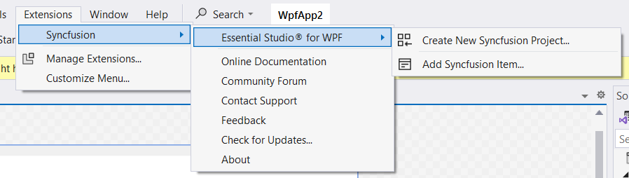

# Download and Installation

In the below Visual Studio Marketplace link, Syncfusion® is publishing the WPF Visual Studio extension. You can either use Visual Studio to install it or go to the Visual Studio Marketplace to download and install it.

[Visual Studio 2022](https://marketplace.visualstudio.com/items?itemName=SyncfusionInc.WPFVSExtension)

[Visual Studio 2019 or lower](https://marketplace.visualstudio.com/items?itemName=SyncfusionInc.WPFExtension)

## Install through the Visual Studio Manage Extensions

The steps below assist you to how to install the Syncfusion WPF extensions from Visual Studio **Manage Extensions**.

1.	Open the Visual Studio.
2.	Navigate to **Extension -> Manage Extensions** and open the Manage Extensions.
	> In Visual Studio 2017 or lower, go to Tools -> Extensions and Updates
3.	On the left, click the **Online** tab and type **"WPF Extensions"** in the search box.

	
4.	Click the Download button in the “**WPF Extensions - Syncfusion**”.
5.	Close all Visual Studio instances after downloading the extensions to begin the installation process. You can see the following VSIX installation prompt.
	
	
6.	Click the **Modify** button.
7.	When the installation is finished, launch the Visual Studio.
8.	Now, you can use the Syncfusion extensions from Visual Studio under the Extensions menu.
	
	

    > In Visual Studio 2017 or lower, you can see the Syncfusion menu directly in the Visual Studio menu. 

##	Install from the Visual Studio Marketplace

The steps below illustrate how to download and install the Syncfusion WPF extension from the Visual Studio Marketplace.

1.	Download the Syncfusion WPF Extensions from the below Visual Studio Marketplace link.

    [Visual Studio 2022](https://marketplace.visualstudio.com/items?itemName=SyncfusionInc.WPFVSExtension)

    [Visual Studio 2019 or lower](https://marketplace.visualstudio.com/items?itemName=SyncfusionInc.WPFExtension)
	
2.	If any Visual Studio instances are still open, close them.
3.	Double-click on the downloaded VSIX file to install. You will see the VSIX installation prompts with the corresponding installed Visual Studio version checkbox to select the Visual Studio to install the extension.
	
	
4.	Click the **Install** button.
5.	After the installation is complete, open Visual Studio 2019. You can now use Syncfusion extensions from the Visual Studio under the Extensions menu.
	
	

	> In Visual Studio 2017 or lower, you can see the Syncfusion menu directly in the Visual Studio menu. 