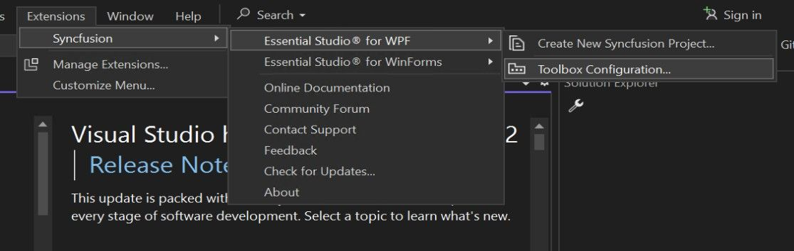

# Syncfusion WPF Extension

The Syncfusion WPF Studio Extensions can be accessed through the Syncfusion Menu to create and configure the project with Syncfusion references in Visual Studio.The Syncfusion WPF Extensions supports Microsoft Visual Studio 2013 or higher.

N> Syncfusion Extension is published in Visual Studio Marketplace. You can download WPF Extensions from [Visual Studio MarketPlace](https://marketplace.visualstudio.com/items?itemName=SyncfusionInc.WPFExtension).

I> The Syncfusion WPF menu option is available from `v17.1.0.32`.

The Syncfusion provides the following extension supports in Visual Studio:

1.	[Create Project](https://help.syncfusion.com/wpf/Visual-Studio-Integration/Visual-Studio-Extensions/Create-Project): Creates the Syncfusion WPF application by adding the required Syncfusion assemblies and XMAL.
2.	[Add Item](https://help.syncfusion.com/wpf/Visual-Studio-Integration/Visual-Studio-Extensions/Add-Item): Add Syncfusion WPF Window into the WPF application with add Syncfusion WPF assemblies/NuGet packages
3.	[Add References](https://help.syncfusion.com/wpf/Visual-Studio-Integration/Visual-Studio-Extensions/Add-References): Add the required Syncfusion assembly to WPF project reference based on the selected control(s).
4.	[Toolbox Configuration](https://help.syncfusion.com//wpf/Visual-Studio-Integration/Toolbox-Configuration): Configure the Syncfusion controls into the Visual Studio .NET toolbox.
5.	[Troubleshooter](https://help.syncfusion.com/wpf/Visual-Studio-Integration/Visual-Studio-Extensions/Troubleshooting): Troubleshoots the project with the Syncfusion configuration and apply the fix like, wrong Framework Syncfusion assembly added to the project or missing any Syncfusion dependent assembly of a referred assembly.

**No project selected in Visual Studio**

**Selected Microsoft WPF application in Visual Studio**

**Selected Syncfusion WPF application in Visual Studio**

N> In Visual Studio 2019, Syncfusion menu is available under Extensions in Visual Studio menu.
