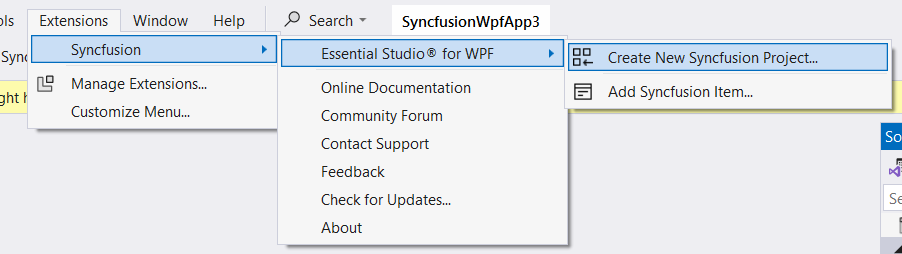
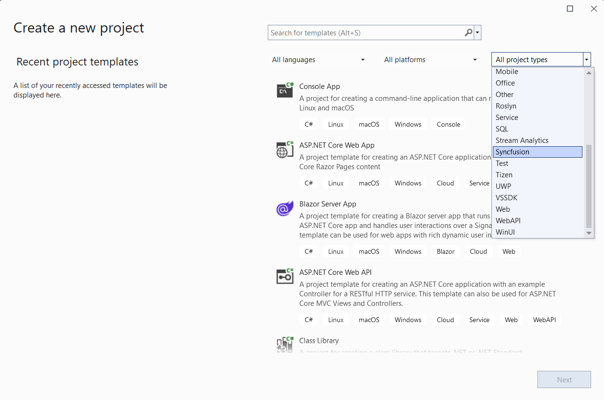
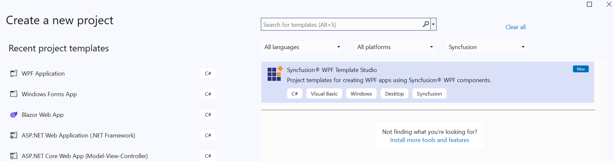
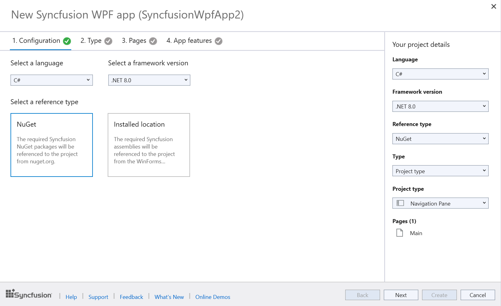
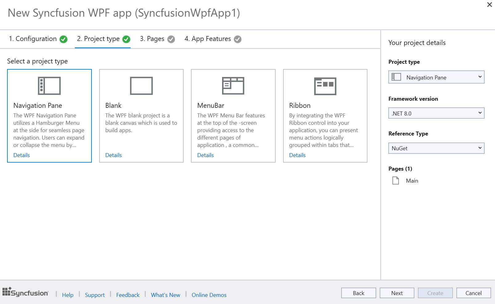
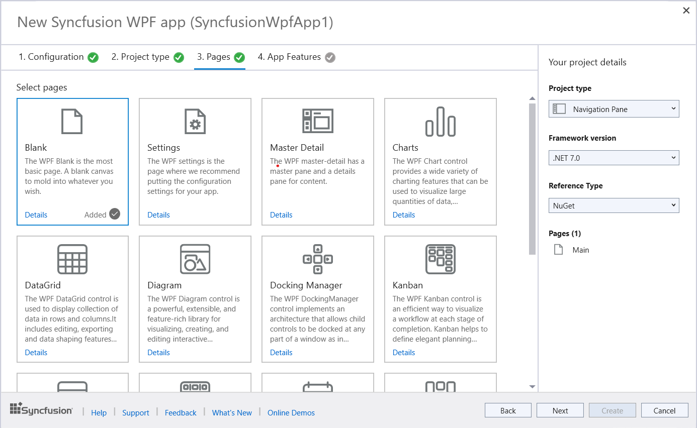
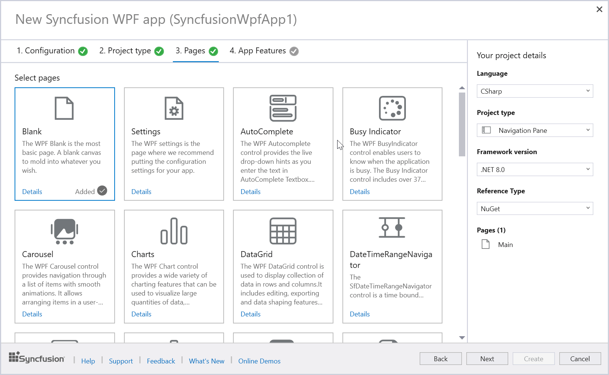
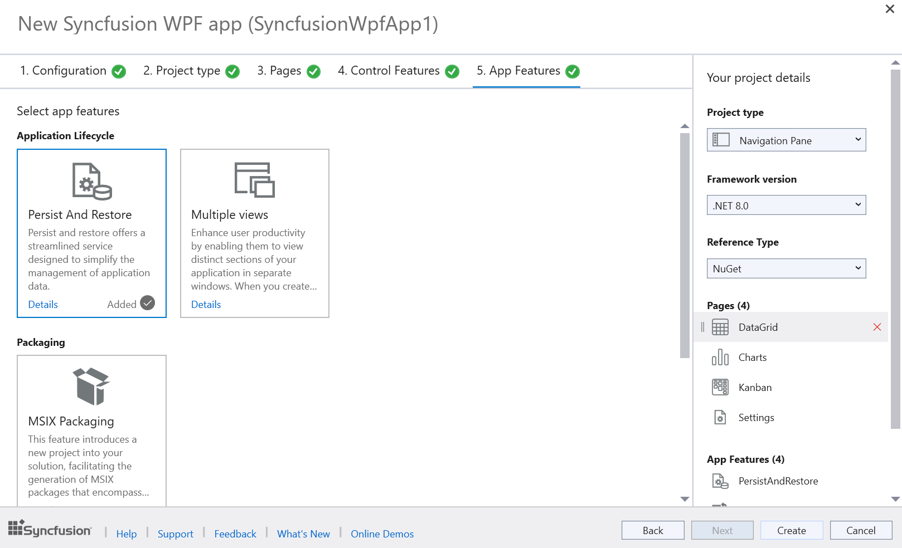
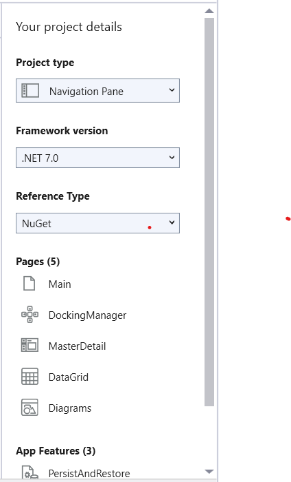
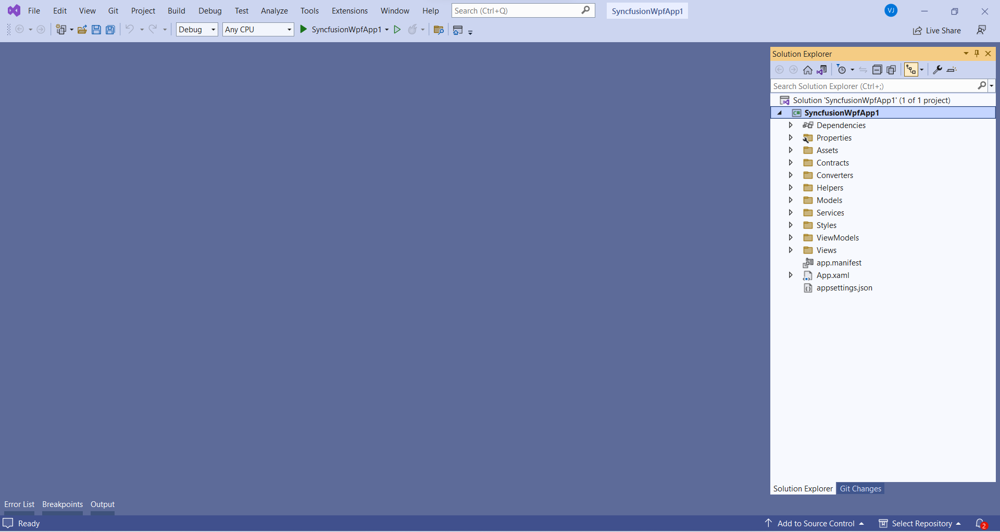

# Syncfusion WPF Template Studio

The WPF Template Studio is a tool Syncfusion provides specifically for building applications using their WPF components. This studio streamlines the development process by including essential Syncfusion components, managing necessary NuGet references, providing predefined namespaces, and generating component render code. It acts as a template studio wizard, making it easier for developers to create WPF applications using Syncfusion components.

I> The Syncfusion WPF Template Studio is available from v23.1.36.

N> WPF Template Studio works seamlessly with Visual Studio 2017 or later. For the Visual Studio 2015 or lower versions, it is recommended to use a [WPF project template](https://help.syncfusion.com/wpf/visual-studio-integration/create-project).

Create the Syncfusion WPF project using the Visual Studio Project Template by following the provided steps.

> Check whether the **WPF Extensions - Syncfusion** are installed or not in Visual Studio Extension Manager by going to **Extensions -> Manage Extensions -> Installed** for Visual Studio 2019 or later, and for Visual Studio 2017 by going to **Tools -> Extensions and Updates -> Installed**. If this extension is not installed, please install the extension by following the steps from the [download and installation](https://help.syncfusion.com/wpf/visual-studio-integration/download-and-installation) help topic.

1.	Open the Visual Studio 2022.

2.	Select one of the following options to create the Syncfusion WPF application

	**Option 1:**  
	Choose **Extension -> Syncfusion -> Essential Studio for WPF -> Create New Syncfusion Project…** from the Visual Studio menu.
    
	

	N> In Visual Studio 2017, you can see the Syncfusion menu directly in the Visual Studio menu.

	**Option 2:**   
	Choose **File -> New -> Project** from the menu. This launches a new dialogue for creating a new application. Filtering the application type by Syncfusion or typing Syncfusion as a keyword in the search option can help you find the Syncfusion templates for WPF.

	

3.	Select the Syncfusion WPF Template Studio and click Next.

	

4.	When you launch the **Syncfusion WPF Template Studio**, you will encounter a configuration wizard that allows you to set up your Syncfusion WPF application. In this 	wizard, you can choose your desired .NET Core Version or .NET Framework Version, as well as select the Reference type.

	

	N> The installed location and GAC options will be available only after the Syncfusion Essential WPF setup has been installed. Use the NuGet option instead of installing the Syncfusion Essential WPF setup. Also, the GAC option will not be available when you choose .NET 6.0 and .NET 7.0 from the project type option in Visual Studio.

5.	Click **Next** or navigate to the **Project type** tab, then select the desired Syncfusion WPF application type.

	

6.	Click **Next** or navigate to the **Pages** tab to access a list of available Syncfusion WPF components you can add to the application.

	

	To unselect the added control(s), Click ‘x’ for the corresponding control in the control list from the Project Details.

	N> The Control Features option is not accessible for Blank, Settings, and Master Detail Pages.

7.	Click **Next** or navigate to the **Control Features** tab to view the listed features for the selected controls. From here, choose the features needed.

	

8.	Click **Next** or navigate the **App Features** tab to select the desired application features.

	

**Project Details Section**

In the **Project Details** section, you can modify configurations and project types. Additionally, you can remove one or more controls from the selected list and remove the chosen application feature.

9.	Click **Create** to initiate the process. This action generates the Syncfusion WPF application. The resulting Syncfusion WPF app has the necessary Syncfusion NuGet 	packages, styles, and rendering code specific to the chosen Syncfusion component.

	

10.	The Syncfusion WPF application is configured with the latest versions of Syncfusion WPF NuGet packages, complete with the appropriate namespaces and component 			render code for seamless integration of Syncfusion components.

	N> The .Net 6.0 and .Net 7.0 option will be listed in  Select a framework version	 when only the .Net 6.0 and .Net 7.0 SDK setup has been installed.

	> .NET 6.0 version is available from v19.4.0.38 and it support from Visual Studio 2022.

	> .NET 7.0 version is available from v20.4.0.38 and it support from Visual Studio 2022.

11.	Then, Syncfusion licensing registration required message box will be shown if you installed the trial setup or NuGet packages since Syncfusion introduced the 			licensing system from 2018 Volume 2 (v16.2.0.41) Essential Studio release. Navigate to the [help topic](https://help.syncfusion.com/common/essential-studio/			licensing/overview#how-to-generate-syncfusion-license-key), which is shown in the licensing message box to generate and register the Syncfusion license key to your 	project. Refer to this [blog](https://www.syncfusion.com/blogs/post/whats-new-in-2018-volume-2.aspx) post for understanding the licensing changes introduced in 		Essential Studio.

	   