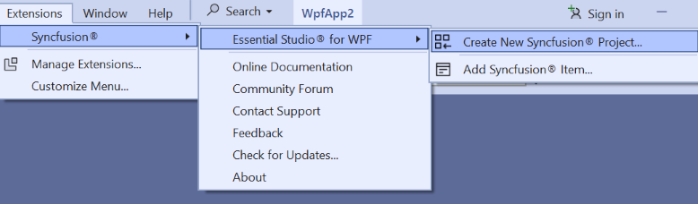
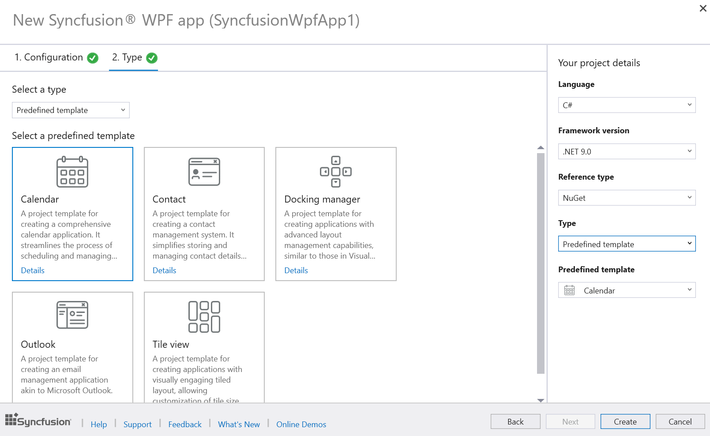
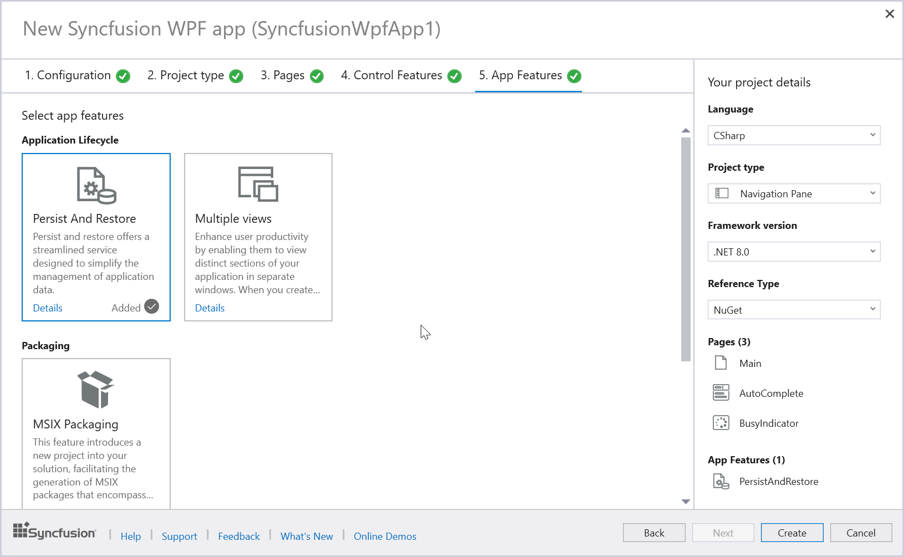
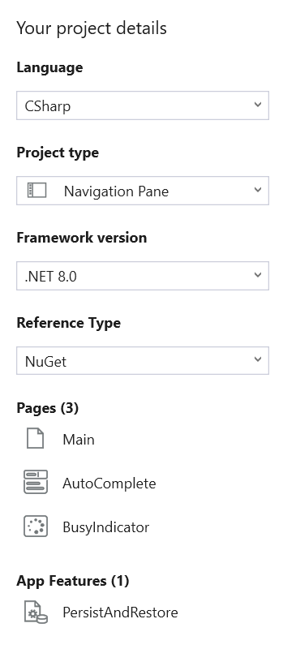

# Syncfusion WPF Template Studio

The WPF Template Studio is a tool Syncfusion® provides specifically for building applications using their WPF components. This studio streamlines the development process by including essential Syncfusion® components, managing necessary NuGet references, providing predefined namespaces, and generating component render code. It acts as a template studio wizard, making it easier for developers to create WPF applications using Syncfusion® components.

I> The Syncfusion WPF Template Studio is available from v23.1.36.

N> WPF Template Studio works seamlessly with Visual Studio 2017 or later. For the Visual Studio 2015 or lower versions, it is recommended to use a [WPF project template](https://help.syncfusion.com/wpf/visual-studio-integration/create-project).

Create the Syncfusion® WPF project using the Visual Studio Project Template by following the provided steps.

> Check whether the **WPF Extensions - Syncfusion** are installed or not in Visual Studio Extension Manager by going to **Extensions -> Manage Extensions -> Installed** for Visual Studio 2019 or later, and for Visual Studio 2017 by going to **Tools -> Extensions and Updates -> Installed**. If this extension is not installed, please install the extension by following the steps from the [download and installation](https://help.syncfusion.com/wpf/visual-studio-integration/download-and-installation) help topic.

1.	Open the Visual Studio 2022.

2.	Select one of the following options to create the Syncfusion® WPF application

	**Option 1:**  
	Choose **Extension -> Syncfusion -> Essential Studio® for WPF -> Create New Syncfusion Project…** from the Visual Studio menu.
    
	

	N> In Visual Studio 2017, you can see the Syncfusion menu directly in the Visual Studio menu.

	**Option 2:**   
	Choose **File -> New -> Project** from the menu. This launches a new dialogue for creating a new application. Filtering the application type by Syncfusion or typing Syncfusion as a keyword in the search option can help you find the Syncfusion templates for WPF.

	

3.	Select the Syncfusion WPF Template Studio and click Next.

	

4.	When you launch the **Syncfusion WPF Template Studio**, you will encounter a configuration wizard that allows you to set up your Syncfusion WPF application. Within this wizard, you will have the option to specify your preferred .NET Core Version or .NET Framework Version, select the desired language(CSharp or Visual Basic), and choose the reference type according to your requirements.

	

	N> The installed location and GAC options will be available only after the Syncfusion Essential WPF setup has been installed. Use the NuGet option instead of installing the Syncfusion Essential WPF setup. Also, the GAC option will not be available when you choose .NET 6.0, .NET 7.0, .NET 8.0 and .NET 9.0 from the project type option in Visual Studio.

	I> Visual Basic Language support is available in WPF Template Studio starting from version 25.1.35.

5.	Click **Next** or navigate to the **Type** tab, then select the desired Syncfusion WPF application type. When selecting the type of template for your application, you have two options:

	

	**Predefined template:** Choose this option to select from 5 predefined templates, including Calendar, Contact, Outlook, Docking Manager, Spreadsheet, Tile view, and Word. By choosing one of these templates, you can create your application without needing to follow any further steps.

	

	**Project type:** Choose this option to select from 4 project types, including Navigation Pane, Blank, Menu Bar, and Ribbon .

6. Click **Next** or navigate to the **Pages** tab to access a list of available Syncfusion® WPF components you can add to the application.

	

	To unselect the added control(s), Click ‘x’ for the corresponding control in the control list from the Project Details.

	N> The Control Features option is not accessible for Blank, Settings, and Master Detail Pages.

7.	Click **Next** or navigate to the **Control Features** tab to view the listed features for the selected controls. From here, choose the features needed.

	

8.	Click **Next** or navigate the **App Features** tab to select the desired application features.

    

**Project Details Section**

In the **Project Details** section, you can modify configurations and project types. Additionally, you can remove one or more controls from the selected list and remove the chosen application feature.

9. Click **Create** to generate the Syncfusion WPF application. Once you've created the project, the relevant Syncfusion® NuGet packages will be automatically added to your project for the chosen components. For example, if you add an **DataGrid** control, the corresponding Syncfusion® NuGet packages required for that control will be installed.

     

     

    To find out which NuGet packages are needed for other WPF controls, please refer to this [documentation link](https://help.syncfusion.com/wpf/control-dependencies) for detailed information on the required NuGet packages for each control.

10. When you create a WPF project, the following Dependency Injection (DI) setup is added to the **App.xaml.cs** file. This setup registers services, view models, and views with the DI container, ensuring proper functionality for the selected components and service management within your application. Below, the **ConfigureServices** method in **App.xaml.cs** sets up Dependency Injection (DI) in a WPF project to manage the application's services, view models, and views. Here's a simple breakdown:
      

     *I. Application Host:*
     - Registers **ApplicationHostService** to manage the app's lifecycle.      

     *II. Specific Services:*
     - Registers **PageService** and **NavigationService** for handling page navigation.

     *III. Views and ViewModels:*
     -  Registers ShellWindow and ShellViewModel for the main application window.
     - Registers **DataGridViewModel** and **DataGridPage** for the added component DataGrid UI.
     - Registers MainViewModel and MainPage for the main page of the app.

     *IV. Configuration:*
     - Binds the app's configuration settings to the **AppConfig** class using the settings from the configuration file.

      

11. In a WPF MVVM application, the **PageService.cs** class helps manage navigation and page creation. For instance, it facilitates registering and navigating to pages associated with specific view models. Here's a simple explanation:

       *I. Initialization:*
      - The constructor of PageService takes a serviceProvider to access registered services.

       *II. Registering Pages:*
    - **Configure `<DataGridPage>()`:** Registers DataGridPage with the service provider.
    - **Configure `<MainPage>()`:** Registers MainPage with the service provider.
    
	

12. Some components require additional resource files, such as images and other necessary files, to function correctly. For example, if you add the **PDFViewer** and **Carousel** component to your WPF project, the respective images and PDF files will be added to the Images and Assets folder in your project.

	 

	> The .NET 6.0, .NET 7.0, .NET 8.0 and .NET 9.0 options will be available in the Select a framework version dropdown only if the respective .NET SDKs are installed on your system. The table below outlines the .NET versions, the specific product versions from which they are available, and the Visual Studio versions that support them:
	> <table>
	>   <thead>
	>     <tr>
	>       <th>.NET Version</th>
	>       <th>Available From Version</th>
	>       <th>Supported from Visual Studio</th>
	>     </tr>
	>   </thead>
	>   <tbody>
	>     <tr>
	>       <td>.NET 6.0</td>
	>       <td>v19.4.0.38</td>
	>       <td>Visual Studio 2022</td>
	>     </tr>
	>     <tr>
	>       <td>.NET 7.0</td>
	>       <td>v20.4.0.38</td>
	>       <td>Visual Studio 2022</td>
	>     </tr>
	>     <tr>
	>       <td>.NET 8.0</td>
	>       <td>v23.2.4</td>
	>       <td>Visual Studio 2022</td>
	>     </tr>
	>     <tr>
	>       <td>.NET 9.0</td>
	>       <td>v27.2.2</td>
	>       <td>Visual Studio 2022</td>
	>     </tr>
	>   </tbody>
	> </table>       

13.   Then, Syncfusion® licensing registration required message box will be shown if you installed the trial setup or NuGet packages since Syncfusion® introduced the 			licensing system from 2018 Volume 2 (v16.2.0.41) Essential Studio® release. Navigate to the [help topic](https://help.syncfusion.com/common/essential-studio/licensing/overview#how-to-generate-syncfusion-license-key), which is shown in the licensing message box to generate and register the Syncfusion® license key to your 	project. Refer to this [blog](https://www.syncfusion.com/blogs/post/whats-new-in-2018-volume-2.aspx) post for understanding the licensing changes introduced in 		Essential Studio®.

          