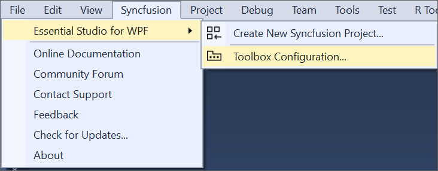
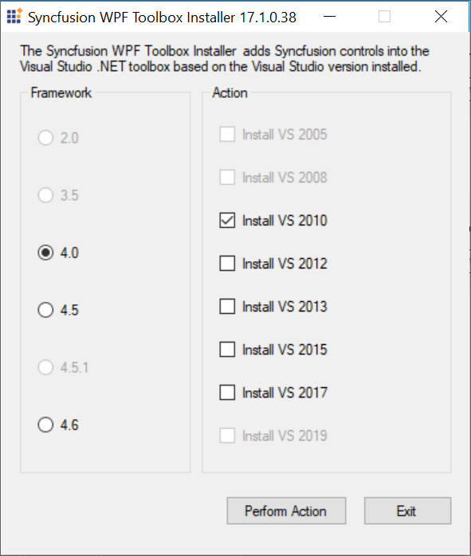
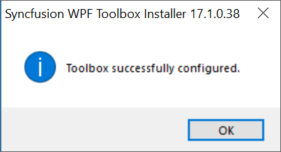

# Toolbox Configuration

The Syncfusion Toolbox Installer utility adds the Syncfusion WPF controls into the Visual Studio .NET toolbox.

N> Toolbox configuration support is not available for the Visual Studio Express Edition. However, you can manually configure the Syncfusion controls into the Visual Studio Express Toolbox. To do so, refer the [Manual Toolbox Configuration](https://help.syncfusion.com/common/faq/how-to-configure-the-toolbox-of-visual-studio-manually).

Syncfusion controls will be automatically configured in the Visual Studio toolbox, while installing the Syncfusion WPF installer, if the <b>“Configure Syncfusion Controls in Visual Studio”</b> checkbox is selected from installer UI.

Use the following steps to adds the Syncfusion WPF controls through the Syncfusion Toolbox Installer:

1. To launch Toolbox configuration utility, follow either one of the options below:

**Option 1:**   
To open the Syncfusion Control Panel, click **Add On and Utilities > Toolbox Installer**.
   

   
**Option 2:**  
Click **Syncfusion menu** and choose **Essential Studio for WPF > Toolbox Configuration...** in **Visual Studio**

N> In Visual Studio 2019, Syncfusion menu is available under Extensions in Visual Studio menu.

2. Toolbox Installer will be opened.

The following options are available in Toolbox Configuration:

* Install VS2005 – Configures Framework 2.0 Syncfusion controls in VS 2005 toolbox.
* Install VS2008 – Configures Framework 3.5 Syncfusion controls in VS 2008 toolbox.
* Install VS2010 – Configures Framework 4.0 Syncfusion controls in VS 2010 toolbox.
* Install VS2012 – Configures Framework 4.5 Syncfusion controls in VS 2012 toolbox.
* Install VS2013 – Configures Framework 4.5.1 Syncfusion controls in VS 2013 toolbox.
* Install VS2015 – Configures Framework 4.6 Syncfusion controls in VS 2015 toolbox.
* Install VS2017 – Configures Framework 4.6 Syncfusion controls in VS 2017 toolbox.
* Install VS2019 – Configures Framework 4.6 Syncfusion controls in VS 2019 toolbox
   
N> You can also configure Syncfusion controls from a lower version Framework assembly to higher version of Visual Studio.
   
3. An Information message is displayed indicating the successful configuration of Toolbox. Click OK.

   
   
N> * You must reset the toolbox, when the installed controls are not reflected properly in the Toolbox. * This tool configures only the controls that are located under {Installed Location}\Assemblies\{Framework version}.

   
## Configuring toolbox for WPF .NET 5.0 projects

From 2021 Volume 1, Syncfusion started providing toolbox support for WPF .NET 5.0 framework in Visual Studio 2019. Syncfusion controls will be automatically configured in the Visual Studio 2019 toolbox for WPF .NET 5.0 project, after installing the Syncfusion WPF installer.

N> * Syncfusion included this toolbox support for .NET 5.0 WPF platform from 2021 Volume 1 release version v19.1.0.54 only. * After installing the WPF setup, if the project created with TargetFramework .NET Core 3.1 and changed to .NET 5.0, you need to restart Visual Studio to get the Syncfusion controls in Visual Studio Toolbox.* Visual Studio 2019 16.7 Preview 2 and later is required

### Upgrading the Syncfusion WPF toolbox .NET 5.0 controls without installing the build

You can upgrade the Syncfusion WPF toolbox for .NET 5.O control with NuGet packages downloaded from [nuget.org](https://www.nuget.org/). Download ["Syncfusion.UI.WPF.NET"](https://www.nuget.org/packages/Syncfusion.UI.WPF.NET/) package from nuget.org in your machine.

Use the following steps to add the Syncfusion WPF controls through Syncfusion NuGet packages:

    
1. Extract **"Syncfusion.UI.WPF.NET"** package by using the below commands.
	
Open Command prompt from nuget.exe path and run the following commands
	
**Command:** {nuget.exe path} add "F:\Syncfusion\Syncfusion.UI.WPF.NET.{version}.nupkg" -Source "F:\Syncfusion\Expand" -expand
	
**Example:** F:\Syncfusion>nuget.exe add "F:\Syncfusion\Syncfusion.UI.WPF.NET.19.1.0.50.nupkg" -Source "F:\Syncfusion" -expand
	

	
    
2. Open **"Syncfusion Toolbox for WPF.config"** file from the following location.
	
**Location:** "C:\Program Files (x86)\NuGet\Config\Syncfusion Toolbox for WPF.config"
	

Or you can create this file in the same location by using the XML format given below
    


<?xml version="1.0" encoding="utf-8"?>
<configuration>
  <fallbackPackageFolders>
    <add key="Syncfusion Toolbox Local NuGet Packages {version}" value="F:\Syncfusion" />
  </fallbackPackageFolders>
</configuration>


	
3. Update extracted Syncfusion NuGet package path in **value** attribute.
	
**Example:**

	
4. Now restart the Visual Studio 2019 to get populate the latest Syncfusion controls in Toolbox.

## Configuring toolbox for .NET Core 3.1 projects

To configure the Syncfusion toolbox in the WPF .NET Core application, the Syncfusion NuGet packages should be installed in the .NET Core application. After installing the Syncfusion NuGet packages in .NET Core application, the corresponding NuGet packages Syncfusion components will be configured in Visual Studio toolbox. 

Please refer the documentation [link](https://help.syncfusion.com/wpf/visual-studio-integration/nuget-packages#using-components-from-nuget), to learn more about how to use the Syncfusion components using the Syncfusion NuGet packages in .NET Core application.
   
