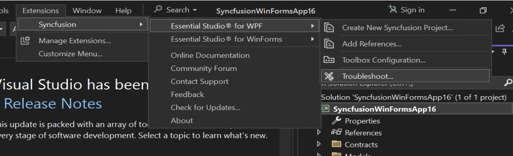
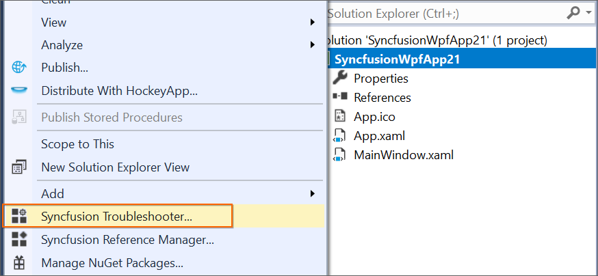
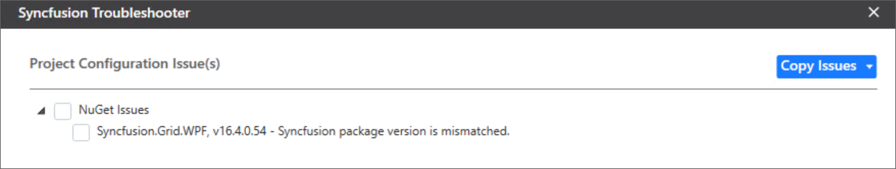
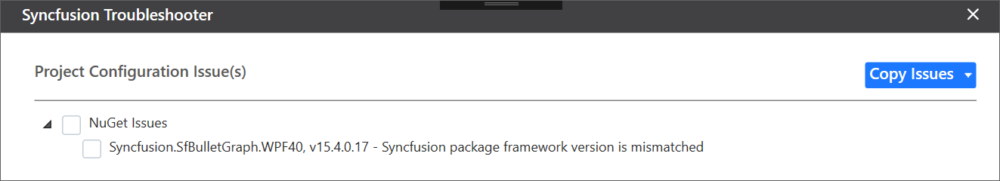
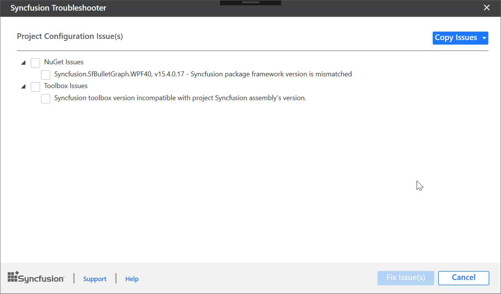
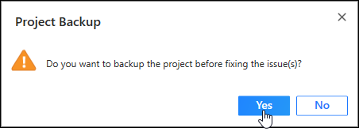

# Troubleshoot the project

Troubleshoot the project with the Syncfusion® configuration and apply the fix, such as the wrong .NET Framework version of a Syncfusion® assembly to the project or missing any Syncfusion® dependent assembly of a referred assembly. The Syncfusion Troubleshooter can perform the following tasks:

* Report the configuration issues.  
* Apply the solution.

## Report the configuration issues

The steps below will assist you in using the Syncfusion Troubleshooter in Visual Studio. 

> Check whether the **WPF Extensions - Syncfusion** are installed or not in Visual Studio Extension Manager by going to **Extensions -> Manage Extensions -> Installed** for Visual Studio 2019 or later and for Visual Studio 2017 or lower by going to **Tools -> Extensions and Updates -> Installed**. If this extension is not installed, please install it by following the steps in the [download and installation](download-and-installation) help topic.

1. To open the Syncfusion Troubleshooter Wizard, follow either one of the options below: 
   
   **Option 1**  
   Open an existing Syncfusion WPF application, then click **Extensions -> Syncfusion -> Essential Studio® for WPF -> Troubleshoot…** in Visual Studio.

   

   N> In Visual Studio 2017 or lower, click the Syncfusion menu and choose Essential Studio® for WPF -> Troubleshoot… in Visual Studio.

   

   **Option 2**  
   **Right-click the Project file in Solution Explorer**, then select the command **Syncfusion Troubleshooter…**.

   

2. Analyze the project now, and if any Syncfusion® controls project configuration errors are discovered, they will be reported in the Troubleshooter dialog. If there are no configuration issues with the project, the dialog box will indicate that no modifications are required in the following areas:

   * Syncfusion assembly references.
   * Syncfusion NuGet Packages. 
   * Syncfusion Toolbox Configuration.

   

N> The Syncfusion Troubleshooter options will be visible only for Syncfusion® projects, which means the project should contain Syncfusion® assemblies or Syncfusion® NuGet packages referred, and the project should be a .NET Framework project.

The Syncfusion Troubleshooter handles the following project configuration issues: 

1. Assembly Reference Issues.

2. NuGet related Issues.

3. Toolbox Configuration Issues.

### Assembly Reference Issues

The Syncfusion Troubleshooter handles the assembly reference issues listed below in Syncfusion® projects. 

1. Dependent assemblies for referred assemblies are missing in the project. 

   **For Instance:** If the "Syncfusion.Chart.WPF" assembly is referred in the project and "Syncfusion.Shared.WPF" (dependent of Syncfusion.Chart.Base) is not referred in the project, the Syncfusion Troubleshooter will show a dependent assembly missing.

   

2. The Syncfusion Troubleshooter compares all Syncfusion® assembly versions in the same project. If any Syncfusion assembly version inconsistency is found, the Syncfusion Troubleshooter will show a Syncfusion assembly version mismatch. 

   **For Instance:** If the "Syncfusion.Tools.WPF" assembly (v17.1450.0.32) is referred in the project, but other Syncfusion assemblies referred have assembly version v17.1450.0.38, the Syncfusion Troubleshooter will show a Syncfusion assembly version mismatch.

   

3. Framework version mismatching (Syncfusion Assemblies) with the project's .NET Framework version. Find the supported .NET Framework details for Syncfusion assemblies in the following link:

   <https://help.syncfusion.com/common/essential-studio/assembly-information#supported-framework-version-for-essential-studio-assemblies> 

   **For Instance:** The .NET Framework of the application is v4.5 and the "Syncfusion.Tools.WPF" assembly (v17.1460.0.38 & .NET Framework version 4.6) is referred in the same application. The Syncfusion Troubleshooter will show that the Syncfusion assembly .NET Framework version is incompatible with the project's .NET Framework version.

   

   

### NuGet Issues

The Syncfusion Troubleshooter addresses the following NuGet package-related issues in Syncfusion® projects. 

1. If the application has Syncfusion NuGet packages in multiple versions, the Syncfusion Troubleshooter will show a Syncfusion NuGet package version mismatch. 

   **For Instance:** If Syncfusion WPF platform packages in multiple versions (v16.4.0.54 & v17.1.0.38) are installed, the Syncfusion Troubleshooter will show a Syncfusion package version mismatch.
 
   

2. The Framework version of an installed Syncfusion NuGet package differs from the project's .NET Framework version.

   **For Instance:** If the "Syncfusion.SfBulletGraph.WPF40" NuGet package version (v15.4.0.17 with 4.0 Framework) is installed in the project, but the project's .NET Framework version is 4.5, the Syncfusion Troubleshooter will show that the Syncfusion package Framework version is mismatched.
  
   

3. Dependent NuGet package of the installed Syncfusion NuGet packages is missing.

   **For Instance:** If you install the Syncfusion.Chart.WPF NuGet package alone in a project, the Syncfusion Troubleshooter will show that the Syncfusion.Chart.Base and other dependent NuGet packages are missing.
 
   

N> Internet connection is required to restore the missing dependent packages. If the internet is not available, the dependent packages will not be restored.

### Toolbox Configuration Issues

In Syncfusion® projects, the Syncfusion Troubleshooter addresses the following Toolbox Configuration issues.

1. If the Syncfusion Toolbox for the project's .NET Framework version is not installed or configured, the Syncfusion Troubleshooter will show that the Syncfusion Toolbox .NET Framework version is mismatched. 

   **For Instance:** If the project targets .NET Framework 4.5 but the Syncfusion Toolbox assemblies for .NET Framework 4.5 are not configured, the Syncfusion Troubleshooter will show a Syncfusion Toolbox .NET Framework version mismatch.
 
   

2. If the configured version of the Syncfusion Toolbox differs from the latest Syncfusion assembly reference version or NuGet package version in the same project, the Syncfusion Troubleshooter will indicate that the Syncfusion Toolbox version is mismatched.

   **For Instance:** If the latest Syncfusion assembly reference version is v17.1.0.38 but Toolbox assemblies configured are v17.1.0.32, the Syncfusion Troubleshooter will show a Syncfusion Toolbox version mismatch.
  
   

## Apply the solution

1. After loading the Syncfusion Troubleshooter dialog, check the corresponding checkbox of the issue to be resolved. Then click the "Fix Issue(s)" button. 

   

2. A dialog appears, which will ask to take a backup of the project before performing the troubleshooting process. If you need to back up the project before troubleshooting, click the "Yes" button. 

   

3. Wait while the Syncfusion Troubleshooter resolves the selected issues. After the troubleshooting process has completed, there will be a status message in the Visual Studio status bar as "Troubleshooting process completed successfully".

   

4. Then, the Syncfusion® licensing registration required message box will be shown if you installed the trial setup or NuGet packages, since Syncfusion® introduced the licensing system from 2018 Volume 2 (v16.2.0.41) Essential Studio® release. Navigate to the [help topic](https://help.syncfusion.com/common/essential-studio/licensing/overview#how-to-generate-syncfusion-license-key), which is shown in the licensing message box, to generate and register the Syncfusion® license key to your project. Refer to this [blog](https://www.syncfusion.com/blogs/post/whats-new-in-2018-volume-2.aspx) post to understand the licensing changes introduced in Essential Studio®.   

   