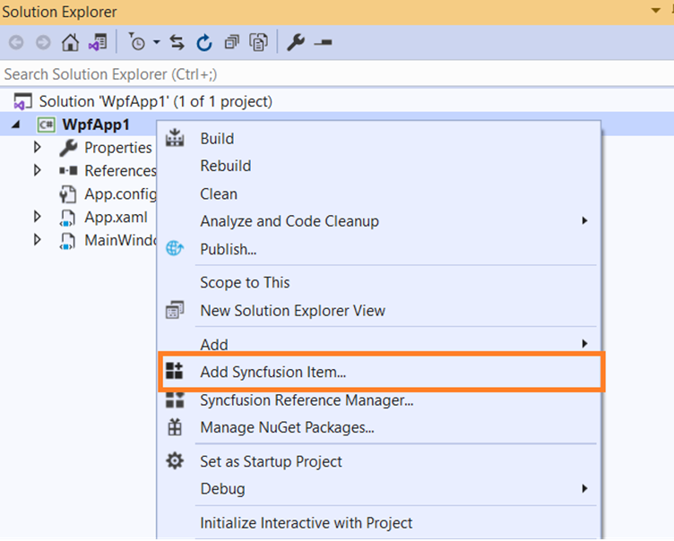

# Add Syncfusion window to WPF application

Visual Studio Item Templates are supported by Syncfusion to add a Syncfusion WPF Window to a WPF application with Syncfusion WPF references. The Syncfusion WPF window allows you to instantly customize the window title bar and includes various pre-installed themes for a more appealing user interface.

I> The Syncfusion WPF item templates are available from v19.1.0.54. 

The steps below will guide you to adding the Syncfusion WPF window to your Visual Studio WPF application. 

> Check whether the **WPF Extensions - Syncfusion** are installed or not in Visual Studio Extension Manager by going to **Tools -> Extensions and Updates -> Installed** for Visual Studio 2017 or lower, and **Extensions -> Manage Extensions -> Installed** for Visual Studio 2019 by going to Extensions -> Manage Extensions -> Installed. If this extension not installed, please install the extension by follow the steps from the [download and installation](download-and-installation) help topic.

## Add window using Syncfusion Item Template gallery

1.	Open a new or existing WPF application.
2.	From the Solution Explorer, right-click on the WPF application. Choose Add Syncfusion Item...

    

3.	The Syncfusion WPF Item Template Gallery wizard will be launched as like below.

    
4.	Select the required window either Chromeless Window or Ribbon Window in the **Select Window** section. 
5.	Choose an assembly reference option such as GAC location, Essential Studio installed location, or NuGet packages, to specify where from the required Syncfusion assemblies are added to the project

    > If the Syncfusion Essential WPF build is installed, the Installed location and GAC options will be enabled. Without installing the Syncfusion Essential WPF setup, you can use the NuGet option. When using the Syncfusion WPF window in a .NET Core application, the GAC option will not be available. The Version dropdown lists the installed WPF versions.
6.	Provide the name for the selected window.
7.	Click Add button to add the selected window into the WPF application along with required Syncfusion assemblies.

    
8.	Then, Syncfusion licensing registration required message box will be shown if you installed the trial setup or NuGet packages since Syncfusion introduced the licensing system from 2018 Volume 2 (v16.2.0.41) Essential Studio release. Navigate to the [help topic](https://help.syncfusion.com/common/essential-studio/licensing/license-key#how-to-generate-syncfusion-license-key), which is shown in the licensing message box to generate and register the Syncfusion license key to your project. Refer to this [blog](https://blog.syncfusion.com/post/Whats-New-in-2018-Volume-2-Licensing-Changes-in-the-1620x-Version-of-Essential-Studio.aspx) post for understanding the licensing changes introduced in Essential Studio.

    

## Add window using the Visual Studio Add New Item dialog

The Syncfusion Item Template can also be added from the Visual Studio Add New Item dialog.

1.	To add a Syncfusion WPF window, follow either one of the following options:

	**Option 1:**

	Click **Extensions >Syncfusion Menu** and choose **Essential Studio for WPF > Add Chromeless Window…** or any other window in Visual Studio.    

	

	> In Visual Studio 2017 or lower, you can see the  Syncfusion menu directly in the Visual Studio menu.

	**Option 2:**

	Right-click the WPF application in Solution Explorer, select **Add > New Item**, and then navigate to Visual C# Items or VB Items. Refer to the following screenshot for more information.

	

	> The Syncfusion WPF Item Templates are available under the Syncfusion > WPF tab. It is available for both C# Items and VB Items.

	

2.	Click **Add** button and the selected window will be added to the project along with the Syncfusion NuGet references.
    
	

3.	Then, Syncfusion licensing registration required message box will be shown if you installed the trial setup or NuGet packages since Syncfusion introduced the licensing system from 2018 Volume 2 (v16.2.0.41) Essential Studio release. Navigate to the [help topic](https://help.syncfusion.com/common/essential-studio/licensing/license-key#how-to-generate-syncfusion-license-key), which is shown in the licensing message box to generate and register the Syncfusion license key to your project. Refer to this [blog](https://blog.syncfusion.com/post/Whats-New-in-2018-Volume-2-Licensing-Changes-in-the-1620x-Version-of-Essential-Studio.aspx) post for understanding the licensing changes introduced in Essential Studio.

      