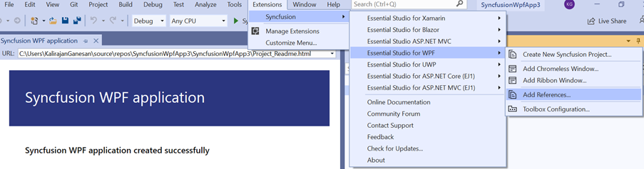
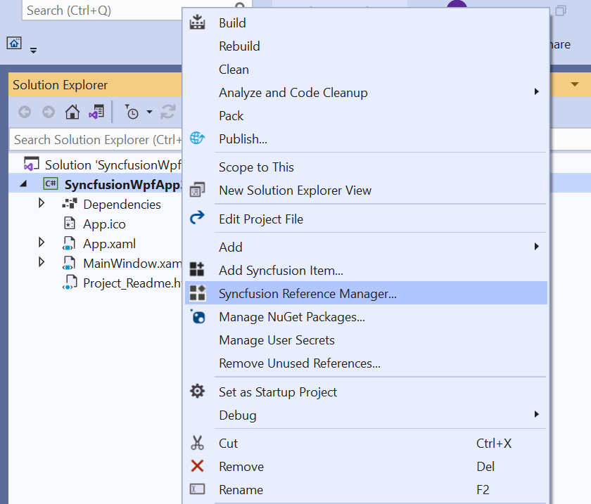
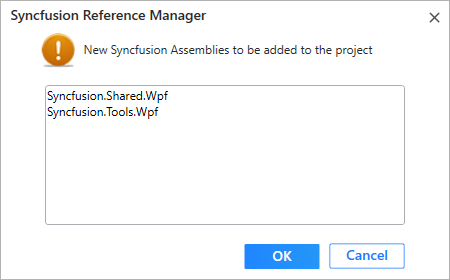

# Add Reference for WPF

Syncfusion Reference Manager is the Visual Studio Add-In for WPF platform. It adds the Syncfusion assembly reference to the project, either from the GAC location or from Essential Studio installed location or from NuGet packages. It can also migrate the projects that contain the old versions of the Syncfusion assembly reference to newer or specific versions of the Syncfusion assembly reference. It supports Microsoft Visual Studio 2013 or higher. This Visual Studio extension is included from Essential Studio 2013 Volume 3 release.

N> This Reference Manager can be applied to a project for Syncfusion assembly versions 10.4.0.71 and later.

To add the Syncfusion assembly references in Visual Studio, follow the steps below:

> Check whether the **WPF Extensions - Syncfusion** are installed or not in Visual Studio Extension Manager by going to **Tools -> Extensions and Updates -> Installed** for Visual Studio 2017 or lower, and **Extensions -> Manage Extensions -> Installed** for Visual Studio 2019 by going to Extensions -> Manage Extensions -> Installed. If this extension not installed, please install the extension by follow the steps from the [download and installation](download-and-installation) help topic.

1. Open a new or existing **WPF** application.

2. To open Syncfusion Reference Manager Wizard, follow either one of the options below:

   **Option 1:**  
   Click **Syncfusion Menu** and choose **Essential Studio for WPF > Add References…** in **Visual Studio**.

   

   N> From Visual Studio 2019, Syncfusion menu is available under Extensions in Visual Studio menu.

   

   **Option 2:**  

   Right-click the selected project file from Solution Explorer, then select **Syncfusion Reference Manager…** from **Context Menu**. The following screenshot shows this option in Visual Studio.   

   

3. The Syncfusion Reference Manager Wizard displays a list of loaded Syncfusion WPF controls.

   

   **Platform Selection:** Platform selection option will appear as an option in Syncfusion Reference Manager if opened from a Console/Class Library project. Select the appropriate platform. 

   

   N> The platform selection option will appear only if Essential Studio for Enterprise Edition with the platforms WPF and Windows Forms has been installed, or if both Essential Studio for WPF and WinForms has been installed.

   **Assembly From:** Choose the assembly location, from where the assembly is added to the project.

   

   N> The GAC option will not be available when you selected WPF (.NET Core 3.1 and .Net 5.0) application in Visual Studio 2019. 

   **Version:** To add the corresponding version assemblies to the project, select the build version.

   

   N> WPF (.NET Core 3.1 and .Net 5.0) application in Visual Studio 2019 is supported from 18.2.0.44 version and Version combo box is not visible for NuGet option. 

   **Themes Option:** Choose the necessary themes based on your requirements. To learn more about built-in themes and their available assembly, click the link below.
   [https://help.syncfusion.com/wpf/themes/](https://help.syncfusion.com/wpf/themes/)

   

   N> Themes option will be enabled only if we selected theme supported controls.

   

4. Select the required controls you want to add in your project. Then click Done to add the project's required assemblies for the specified controls. The list of required assemblies for the selected controls to be added is shown in the screenshot below.

   

5. Click **OK**. The listed Syncfusion assemblies are added to project. Then it notifies “Syncfusion assemblies have been added successfully” in Visual Studio status bar.

   

6. Then, Syncfusion licensing registration required message box will be shown if you installed the trial setup or NuGet packages since Syncfusion introduced the licensing system from 2018 Volume 2 (v16.2.0.41) Essential Studio release. Navigate to the [help topic](https://help.syncfusion.com/common/essential-studio/licensing/license-key#how-to-generate-syncfusion-license-key), which is shown in the licensing message box to generate and register the Syncfusion license key to your project. Refer to this [blog](https://blog.syncfusion.com/post/Whats-New-in-2018-Volume-2-Licensing-Changes-in-the-1620x-Version-of-Essential-Studio.aspx) post for understanding the licensing changes introduced in Essential Studio.

   

N>  Reference Manager support is provided by Syncfusion for select versions of the.NET Framework that are included (as assemblies) in the Syncfusion Essential Studio installation. If you try to add Syncfusion assemblies to a project and the project framework isn't compatible with the specified Syncfusion version assemblies, a dialogue box shows with the message "Current build v{version} isn't compatible with this framework v{Framework} Version".

