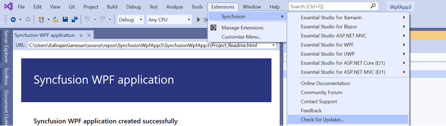
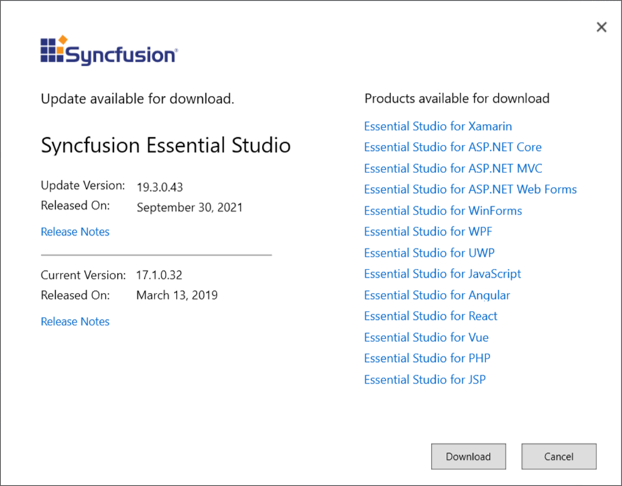

# Check for Updates in Syncfusion Essential WPF

Syncfusion provides Extensions to update the most recent version of the Essential Studio release. Installing the most recent version ensures that you always have the most up-to-date features, fixes, and improvements.

I> The Syncfusion Check for updates is available from v17.1.0.32.

You can check the availability of updates in Visual Studio and then install the update version if required.

1.	Choose **Syncfusion -> Check for Updates…** in the Visual Studio menu.

	

	N> From Visual Studio 2019, Syncfusion menu is available under Extensions in Visual Studio menu.

	
   
2.	When an update is available, the Update dialog box appears.

	

3.	Syncfusion Essential Studio can be downloaded from the Syncfusion website by clicking the **Download** button.
