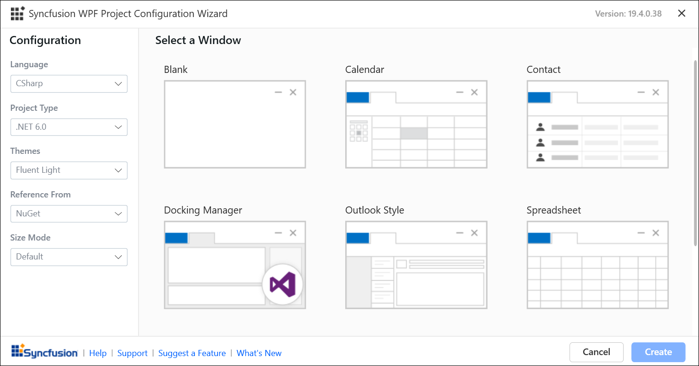

# Create WPF application

The Visual Studio Project Templates for the Syncfusion WPF platform allow you to quickly develop a Syncfusion WPF application by just adding the appropriate Syncfusion assemblies and XAML. 

I> The Syncfusion WPF templates are available from v16.1.0.24. 

Create the Syncfusion WPF project using the Visual Studio Project Template by following the steps below: 

> Check whether the **WPF Extensions - Syncfusion** are installed or not in Visual Studio Extension Manager by going to **Tools -> Extensions and Updates -> Installed** for Visual Studio 2017 or lower, and **Extensions -> Manage Extensions -> Installed** for Visual Studio 2019 by going to Extensions -> Manage Extensions -> Installed. If this extension not installed, please install the extension by follow the steps from the [download and installation](wpf/visual-studio-integration/vs2019-extensions/download-and-installation) help topic.

1.	To create a Syncfusion WPF project, follow either one of the options below:

	**Option 1:**  
	Click **Extensions >Syncfusion** Menu and choose **Essential Studio for WPF > Create New Syncfusion Project…**  in **Visual Studio**.
    
	

	N> In Visual Studio 2017 or lower, you can see the  Syncfusion menu directly in the Visual Studio menu.

	**Option 2:**   
	Choose **File -> New -> Project**. Opens a new dialog to create a new project. By filtering the project type with Syncfusion or using the Syncfusion keyword in the search option, you can get the templates offered by Syncfusion for WPF.

	

	In Visual Studio 2017 or lower, Select **File > New > Project** and navigate to **Syncfusion > Windows > Syncfusion WPF Application** in Visual Studio. 

	

2.	Name the **Project**, select the destination location when required, and specify the Framework of the project, then click **OK**.  

	N> For Syncfusion WPF project templates, the minimum target Framework is 4.0. 

3.	Using the following Project Configuration Wizard, choose the options to configure the Syncfusion WPF Application.  
  
	
                                                 
	In Visual Studio 2017 or lower, Syncfusion WPF Application project configuration wizard. 

	

	**Project Configurations**

	**Project Type:** Choose .Net 5.0, .Net Core 3.1 or .Net Framework as the project type.

	N> From Visual Studio 2019, Project type selection option will be available in Syncfusion WPF Project template configuration. The .Net Core 3.1 and .Net 5.0 option will be listed in project type only when the .Net Core 3.0 and .Net 5.0 setup has been installed.  

	**Language:** Select the language, either CSharp or VB.

	N> VB language is available only when you choose .NET Framework from option in Visual Studio.

	**Choose Theme:** Select the required theme.

	**Reference From:** Choose the assembly location such as NuGet, GAC Location, or Essential Studio installed location, from where the assembly is added to the project.

	N> The installed location and GAC options will be available only after the Syncfusion Essential WPF setup has been installed. You can use the NuGet option instead of installing the Syncfusion Essential WPF setup. Also, the GAC option will not be available when you choose . Net Core 3.1 and . Net 5.0 from project type option in Visual Studio.

	**Installed ES Build Version:** To add the appropriate version assemblies to the project, choose the build version.

	N> Installed ES build version option will be available only if you install the Syncfusion Essential WPF setup and select Installed Location or GAC as the assembly location.

	**Size Mode:** Select the Size Mode either Default or Touch.

	**Select Window:** Choose the window as required for application.

	N> Project create option will be enabled only if you have selected the window
      
4.	After choosing above project configuration options in the Project Configuration Wizard, click the create button then Syncfusion WPF project is created with the necessary assembly references and XAML. 

	

	

	

5.	Then, Syncfusion licensing registration required message box will be shown if you installed the trial setup or NuGet packages since Syncfusion introduced the licensing system from 2018 Volume 2 (v16.2.0.41) Essential Studio release. Navigate to the [help topic](https://help.syncfusion.com/common/essential-studio/licensing/license-key#how-to-generate-syncfusion-license-key), which is shown in the licensing message box to generate and register the Syncfusion license key to your project. Refer to this [blog](https://blog.syncfusion.com/post/Whats-New-in-2018-Volume-2-Licensing-Changes-in-the-1620x-Version-of-Essential-Studio.aspx) post for understanding the licensing changes introduced in Essential Studio.

	   