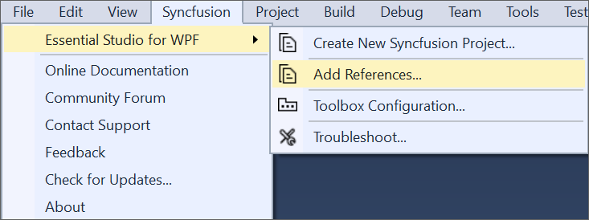
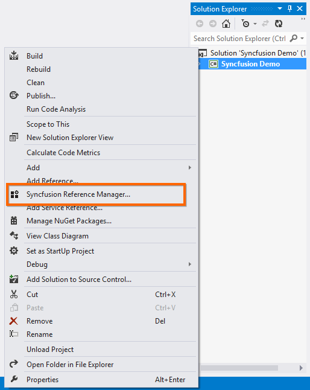
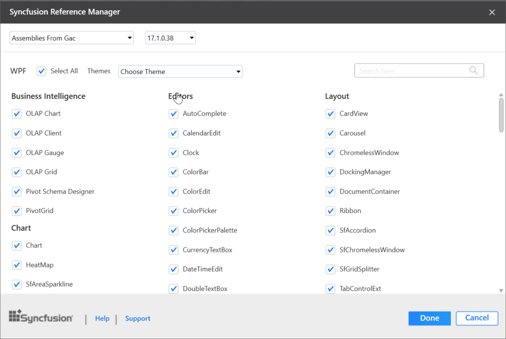
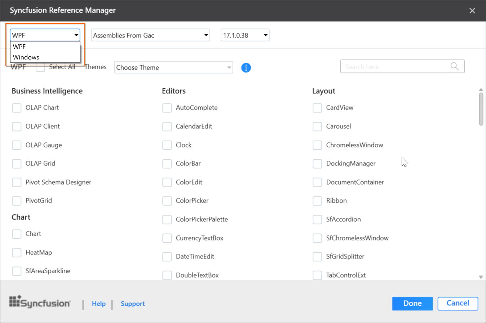
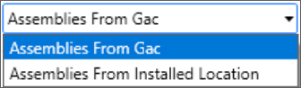
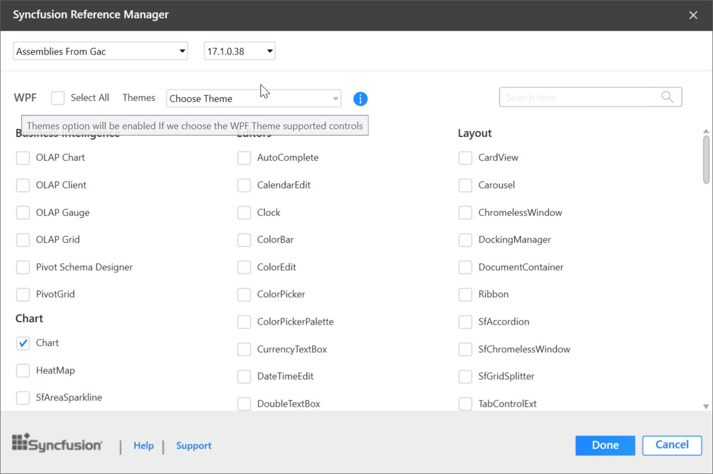

# Add Reference for WPF

Syncfusion Reference Manager is the Visual Studio Add-In for WPF platform. It adds the Syncfusion assembly reference to the project, either from the GAC location or from where Essential Studio is installed. It can also migrate the projects that contain the old versions of the Syncfusion assembly reference to newer or specific versions of the Syncfusion assembly reference. It supports Microsoft Visual Studio 2013 or higher. This Visual Studio extension is included from Essential Studio 2013 Volume 3 release.

N> This Reference Manager can be applied to a project for Syncfusion assembly versions 10.4.0.71 and later.

Follow the given steps to add the Syncfusion references in Visual Studio:

> Before use the Syncfusion WPF Reference Manager, check whether the **WPF Extensions - Syncfusion** installed or not in Visual Studio Extension Manager by clicking on the Tools -> Extensions and Updates -> Installed for Visual Studio 2017 or lower and for Visual Studio 2019 by clicking on the Extensions -> Manage Extensions -> Installed.

1. Open a new or existing **WPF** application.

2. To open Syncfusion Reference Manager Wizard, follow either one of the options below:

   **Option 1:**  
   Click **Syncfusion Menu** and choose **Essential Studio for WPF > Add References…** or any other Form in **Visual Studio**.

   

   N> In Visual Studio 2019, Syncfusion menu is available under Extensions in Visual Studio menu.

   **Option 2:**  
   Right-click the selected project file from Solution Explorer, then select **Syncfusion Reference Manager…** from **Context Menu**. The following screenshot shows this option in Visual Studio.   

   

3. The Syncfusion Reference Manager Wizard that contains the list of Syncfusion WPF controls that are loaded.

   

   **Platform Selection:** If launched the Syncfusion Reference Manager from Console/Class Library project, Platform selection option will be appeared as option in Syncfusion Reference Manager. Choose the required platform. 

   

   N> Platform selection option will be appeared only if Essential Studio for Enterprise Edition with the platforms WPF and Windows Forms has been installed or both Essential Studio for WPF and WinForms has been installed.

   **Assembly From:** Choose the assembly location from, where the assembly is added to the project.

   

   N> The GAC option will not be available when you selected WPF (.NET Core 3.1 and .Net 5.0) application in Visual Studio 2019. 

   **Version:** Choose the build version to add the corresponding version assemblies to the project.

   

   N> WPF (.NET Core 3.1 and .Net 5.0) application in Visual Studio 2019 is supported from 18.2.0.44   version and Version combobox is not visible for NuGet option. 

   **Themes Option:** Choose the required themes based on your need. Refer the below link to know more about built in themes and its available assemblies.
   [https://help.syncfusion.com/wpf/themes/](https://help.syncfusion.com/wpf/themes/)

   

   N> Themes option will be enabled only if selected SfSkinManager supported controls.

   

4. Choose the required controls that you want to include in the project. Then, click **Done** to add the required assemblies for the selected controls into the project. The following screenshot shows the list of required assemblies for the selected controls to be added.

   

5. Click **OK**. The listed Syncfusion assemblies are added to project. Then it notifies “Syncfusion assemblies have been added successfully” in Visual Studio status bar.

   

6. Then, Syncfusion licensing registration required message box will be shown, if you installed the trial setup or NuGet packages since Syncfusion introduced the licensing system from 2018 Volume 2 (v16.2.0.41) Essential Studio release. Navigate to the  [help topic](https://help.syncfusion.com/common/essential-studio/licensing/license-key#how-to-generate-syncfusion-license-key), which is shown in the licensing message box to generate and register the Syncfusion license key to your project. Refer to this [blog](https://blog.syncfusion.com/post/Whats-New-in-2018-Volume-2-Licensing-Changes-in-the-1620x-Version-of-Essential-Studio.aspx) post for understanding the licensing changes introduced in Essential Studio.

   

N>  Syncfusion provides Reference Manager support for specific .NET Framework, which is shipped (assemblies) in Syncfusion Essential Studio setup. So, if you try to add Syncfusion assemblies in the project and project framework is not supported with selected Syncfusion version assemblies, the dialog appears along with **“Current build v{version} is not supported this framework v{Framework Version}”** message.

