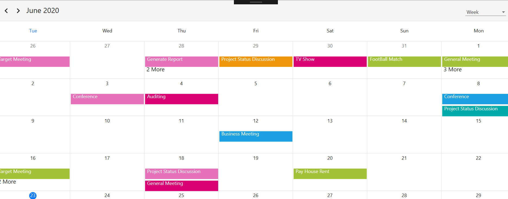
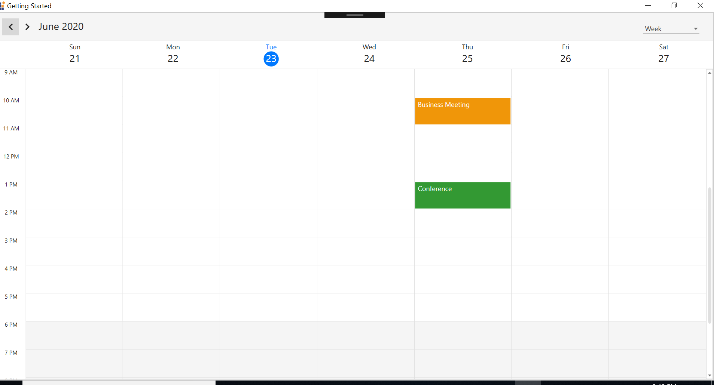
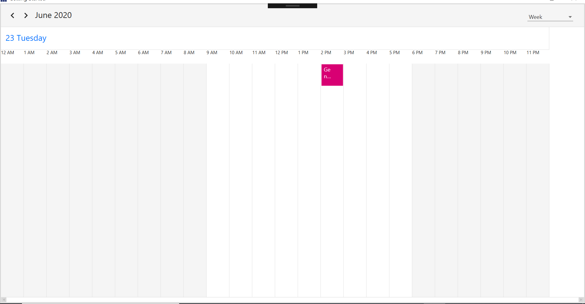

---   
layout: post   
title: Getting Started | SfScheduler | WPF | Syncfusion   
description: Learn here about getting started with Syncfusion Xamarin Schedule (SfScheduler) control and more details. 
platform: WPF   
control: SfScheduler   
documentation: ug   
---   
    
# Getting Started with WPF Scheduler (SfScheduler)   
    
This section provides you an overview for working with SfScheduler for WPF and also provides a walk through to configure SfScheduler control in real time scenario.   

## Assembly deployment
Refer to the section on [control dependencies](https://help.syncfusion.com/wpf/control-dependencies#SfScheduler) for a list of assemblies or NuGet Packages to be used as a guide for using control in any application. Further information on installing the NuGet package can be found in the following link in a WPF application: [How to install nuget packages](https://help.syncfusion.com/wpf/nuget-packages). You can also use [Syncfusion Reference Manager](https://help.syncfusion.com/wpf/visual-studio-integration/visual-studio-extensions/add-references) to refer the scheduler's dependent assemblies.

## Create a project
In Visual Studio, create a new WPF project to show the features of the scheduler control and add the following namespace to the added assemblies.

Assembly: `Syncfusion.SfScheduler.WPF`

Namespace: `Syncfusion.UI.Xaml.Scheduler`

## Adding SfSchedule to the project

To add the control manually in XAML page, follow the given steps:

1. Add the `Syncfusion.SfScheduler.WPF` assembly reference to the project.
2. Import WPF schema `http://schemas.syncfusion.com/wpf` in the XAML page.
3. Declare the `SfScheduler` control in XAML page.



<Window
    x:Class="GettingStarted.MainWindow"
    xmlns="http://schemas.microsoft.com/winfx/2006/xaml/presentation"
    xmlns:x="http://schemas.microsoft.com/winfx/2006/xaml"
    xmlns:local="clr-namespace:GettingStarted"
    xmlns:syncfusion="http://schemas.syncfusion.com/wpf"
    xmlns:system="clr-namespace:System;assembly=mscorlib"   
    xmlns:skinmanager ="clr-namespace:Syncfusion.SfSkinManager;assembly=Syncfusion.SfSkinManager.WPF"
    skinmanager:SfSkinManager.VisualStyle="MaterialLight"
    Title="Getting Started"
    Icon="App.ico"
    WindowStartupLocation="CenterScreen">

    <Window.Resources>
        <ObjectDataProvider x:Key="schedulerviewtypes" MethodName="GetValues"
                            ObjectType="{x:Type system:Enum}">
            <ObjectDataProvider.MethodParameters>
                <x:Type  Type="{x:Type syncfusion:SchedulerViewType}"/>
            </ObjectDataProvider.MethodParameters>
        </ObjectDataProvider>
    </Window.Resources>
    
    <Window.DataContext>
        <local:MeetingDetails/>
    </Window.DataContext>

    <Grid>
        <syncfusion:SfScheduler x:Name="Schedule"
                ItemsSource="{Binding Events}"
                ViewType="{Binding ElementName=viewtypecombobox, Path=SelectedValue}">
            <syncfusion:SfScheduler.MonthViewSettings>
                <syncfusion:MonthViewSettings AppointmentDisplayMode="Appointment"
                                        AppointmentDisplayCount="2"/>
            </syncfusion:SfScheduler.MonthViewSettings>
        </syncfusion:SfScheduler>

        <StackPanel
            HorizontalAlignment="Right"
            VerticalAlignment="Top"
            Margin="0,20,25,0">
            <ComboBox x:Name="viewtypecombobox" ItemsSource="{Binding Source={StaticResource schedulerviewtypes}}"
                                    SelectedIndex="2"  Width="100"/>
        </StackPanel>
    </Grid>
</Window>


using Syncfusion.UI.Xaml.Scheduler;
namespace GettingStarted
{
    public partial class MainWindow : Window
    {
       SfScheduler schedule = new SfScheduler();
       this.Content = schedule;
    }
}


   

## Changing Schedule Views   
    
SfSchedule control provides five different types of views to display dates and it can be assigned to the control by using [ScheduleView](https://help.syncfusion.com/cr/cref_files/xamarin/Syncfusion.SfSchedule.XForms~Syncfusion.SfSchedule.XForms.SfSchedule~ScheduleView.html) property. By default the control is assigned with `DayView`. Current date will be displayed initially for all the Schedule views.  

Schedule control will be rendered with `Sunday` as the first day of the week, but you can customize to any day by using [FirstDayOfWeek](http://help.syncfusion.com/cr/cref_files/xamarin/Syncfusion.SfSchedule.XForms~Syncfusion.SfSchedule.XForms.SfSchedule~FirstDayOfWeek.html) property of `SfSchedule`.
    
  

<syncfusion:SfScheduler x:Name="Schedule" FirstDayOfWeek="Tuesday"/> 
   

//setting first day of the week    
Schedule.FirstDayOfWeek = DayOfWeek.Thursday;   
  
   
    
   

### Day View   
    
`Day` is used to display a single day, current day will be visible by default. Appointments on a specific day will be arranged in respective timeslots based on its duration.   
    
   

<syncfusion:SfScheduler x:Name="Schedule" ViewType="Day"/>  
   

Schedule.ViewType =SchedulerViewType.Day; 
   
   
    
   

### Week View   
 
`Week` is to view all days of a particular week. Appointments will be arranged based on the dates on the week in respective timeslots.  
    
   

<syncfusion:SfScheduler x:Name="Schedule" ViewType="Week"/>
   

Schedule.ViewType =SchedulerViewType.Week;;   
   
   
    
  

### Work Week View   
 
`WorkWeekView` is to view only working days of a particular week. By default, Saturday and Sunday are the non-working days. You can be customize it with any days of a Week. Appointments arranged in timeslots based on its duration with respective day of the week.  
    
   

<syncfusion:SfScheduler x:Name="Schedule" ViewType="WorkWeek"> 
   

Schedule.ViewType =SchedulerViewType.WorkWeek;
   
   
    
   

>**NOTE**
Appointments in non-working days will not be displayed.

### Timeline view   
 
`Timeline` displays the dates in horizontal time axis with the desired day's count. You can see the past or future dates by scrolling to the right or left. Each view displays events accurately across the time slots with an intuitive drag-and-drop feature.  
    
   

<syncfusion:SfScheduler x:Name="Schedule" ViewType="Timeline"/>  
   

Schedule.ViewType =SchedulerViewType.Timeline;  
   
   
    
	

### Month View   
    
`Month` in Schedule control is to view entire dates of a particular month.
    
   

<syncfusion:SfScheduler x:Name="Schedule" ViewType="Month">
  

Schedule.ViewType =SchedulerViewType.Month;
//view appointments in inline  
schedule.ShowAppointmentsInline = true;  
   
   
    

## Binding data to SfSchedule control   
  
Schedule control has a built-in capability to handle the appointment arrangement internally based on the ScheduleAppointment collections. You need to assign the created collection to the [DataSource] property of `SfSchedule`.  
  
### Adding Appointments   
  
`ScheduleAppointment` is a class, which holds the details about the appointment to be rendered in schedule. It has some basic properties such as `StartTime`, `EndTime`, `Subject` and some additional information about the appointment can be added using `Color`, `Notes`, `Location`, `IsAllDay`, `IsRecursive` properties.    
  
     

ScheduleAppointmentCollection appointmentCollection = new ScheduleAppointmentCollection();   
//Creating new event   
ScheduleAppointmentCollection appointmentCollection = new ScheduleAppointmentCollection();

//Creating new event   
ScheduleAppointment clientMeeting = new ScheduleAppointment();
DateTime currentDate = DateTime.Now;
DateTime startTime = new DateTime(currentDate.Year, currentDate.Month, currentDate.Day, 10, 0, 0);
DateTime endTime = new DateTime(currentDate.Year, currentDate.Month, currentDate.Day, 12, 0, 0);
clientMeeting.StartTime = startTime;
clientMeeting.EndTime = endTime;
clientMeeting.Subject = "ClientMeeting";
appointmentCollection.Add(clientMeeting);
            Schedule.ItemsSource = appointmentCollection;
   
   

### Adding Custom Appointments   
  
You can also map custom appointments data to our scheduler.   
  
>**NOTE**
CustomAppointment class should contain two DateTime fields and a string field as mandatory.
 
Here steps to render `MeetingRoomScheduler` using SfScheduler control with respective custom data properties created in a class Meeting.  
  
* [Creating custom class for appointments](#creating-custom-class-for-appointments) 
* [Creating view model](#creating-view-model)
* [Mapping custom class](#mapping-custom-class)  
* [Setting data source for SfSchedule](#setting-data-source-for-sfschedule)  

#### Creating custom class for appointments
 
You can create a custom class `Meeting` with mandatory fields "From", "To" and "EventName". 
 
   

/// 
   
/// Represents custom data properties.   
/// 
   
    public class Meeting : NotificationObject
    {
        DateTime from, to;
        string eventName;
        bool isAllDay;
        string startTimeZone, endTimeZone;
        Brush color;
        public Meeting()
        {
        }

        public DateTime From
        {
            get { return from; }
            set
            {
                from = value;
                RaisePropertyChanged("From");
            }
        }

        public DateTime To
        {
            get { return to; }
            set
            {
                to = value;
                RaisePropertyChanged("To");
            }
        }

        public bool IsAllDay
        {
            get { return isAllDay; }
            set
            {
                isAllDay = value;
                RaisePropertyChanged("IsAllDay");
            }
        }
        public string EventName
        {
            get { return eventName; }
            set
            {
                eventName = value;
                RaisePropertyChanged("EventName");
            }
        }
        public string StartTimeZone
        {
            get { return startTimeZone; }
            set
            {
                startTimeZone = value;
                RaisePropertyChanged("StartTimeZone");
            }
        }
        public string EndTimeZone
        {
            get { return endTimeZone; }
            set
            {
                endTimeZone = value;
                RaisePropertyChanged("EndTimeZone");
            }
        }

        public Brush Color
        {
            get { return color; }
            set
            {
                color = value;
                RaisePropertyChanged("Color");
            }
        }
    }
   
   
    
>**NOTE**
You can inherit this class from `INotifyPropertyChanged` for dynamic changes in custom data.

#### Creating view model 

You can schedule meetings for a particular day by setting `From` and `To` of `Meeting` class.Also you can change subject and color of appointment using `EventName` and `color` of Meeting class. In a separate ViewModel class you can describe the collection of custom appointments.  

   

/// 
   
/// Represents collection of appointments.   
/// 
 
public class ScheduleViewModel : NotificationObject
    {
        #region Properties

        /// 

        /// color collection
        /// 

        private List<Brush> colorCollection;

        /// 

        /// start time collection
        /// 

        private List<DateTime> startTimeCollection;

        /// 

        /// end time collection
        /// 

        private List<DateTime> endTimeCollection;

        #endregion Properties

        #region Constructor

        /// 

        /// Initializes a new instance of the <see cref="ScheduleViewModel" /> class.
        /// 

        public ScheduleViewModel()
        {
            this.Appointments = new ObservableCollection<Meeting>();
            this.CreateStartTimeCollection();
            this.CreateEndTimeCollection();
            this.CreateSubjectCollection();
            this.CreateColorCollection();
            this.IntializeAppoitments();
        }

        #endregion Constructor

        /// 

        /// Gets or sets appointments
        /// 

        public ObservableCollection<Meeting> Appointments
        {
            get;
            set;
        }

        #region Methods

        #region GettingTimeRanges

        /// 

        /// Method for get timing range.
        /// 

        /// <returns>return time collection</returns>
        private List<Point> GettingTimeRanges()
        {
            List<Point> randomTimeCollection = new List<Point>();
            randomTimeCollection.Add(new Point(9, 11));
            randomTimeCollection.Add(new Point(12, 14));
            randomTimeCollection.Add(new Point(15, 17));

            return randomTimeCollection;
        }

        #endregion GettingTimeRanges

        #region InitializeAppointments
        /// 

        /// Initialize appointments
        /// 

        /// <param name="count">count value</param>
        private void IntializeAppoitments()
        {
            Random randomTime = new Random();
            List<Point> randomTimeCollection = this.GettingTimeRanges();

            DateTime date;
            DateTime dateFrom = DateTime.Now.AddDays(-100);
            DateTime dateTo = DateTime.Now.AddDays(100);
            var random = new Random();
            var dateCount = random.Next(4);
            DateTime dateRangeStart = DateTime.Now.AddDays(0);
            DateTime dateRangeEnd = DateTime.Now.AddDays(1);

            for (date = dateFrom; date < dateTo; date = date.AddDays(1))
            {
                if (date.Day % 7 != 0)
                {
                    for (int additionalAppointmentIndex = 0; additionalAppointmentIndex < 1; additionalAppointmentIndex++)
                    {
                        Meeting meeting = new Meeting();
                        int hour = randomTime.Next((int)randomTimeCollection[additionalAppointmentIndex].X, (int)randomTimeCollection[additionalAppointmentIndex].Y);
                        meeting.From = new DateTime(date.Year, date.Month, date.Day, hour, 0, 0);
                        meeting.To = meeting.From.AddHours(1);
                        meeting.EventName = this.currentDayMeetings[randomTime.Next(9)];
                        meeting.Color = this.colorCollection[randomTime.Next(9)];
                        meeting.IsAllDay = false;
                        meeting.StartTimeZone = string.Empty;
                        meeting.EndTimeZone = string.Empty;
                        this.Appointments.Add(meeting);
                    }
                }
                else
                {
                    Meeting meeting = new Meeting();
                    meeting.From = new DateTime(date.Year, date.Month, date.Day, randomTime.Next(9, 11), 0, 0);
                    meeting.To = meeting.From.AddDays(2).AddHours(1);
                    meeting.EventName = this.currentDayMeetings[randomTime.Next(9)];
                    meeting.Color = this.colorCollection[randomTime.Next(9)];
                    meeting.IsAllDay = true;
                    meeting.StartTimeZone = string.Empty;
                    meeting.EndTimeZone = string.Empty;
                    this.Appointments.Add(meeting);
                }
            }

            // Minimum Height Meetings
            DateTime minDate;
            DateTime minDateFrom = DateTime.Now.AddDays(-2);
            DateTime minDateTo = DateTime.Now.AddDays(2);

            for (minDate = minDateFrom; minDate < minDateTo; minDate = minDate.AddDays(1))
            {
                Meeting meeting = new Meeting();
                meeting.From = new DateTime(minDate.Year, minDate.Month, minDate.Day, randomTime.Next(9, 18), 30, 0);
                meeting.To = meeting.From;
                meeting.EventName = this.minTimeMeetings[randomTime.Next(0, 4)];
                meeting.Color = this.colorCollection[randomTime.Next(0, 10)];
                meeting.StartTimeZone = string.Empty;
                meeting.EndTimeZone = string.Empty;
                
                this.Appointments.Add(meeting);
            }
        }

        #endregion InitializeAppointments

        #region SubjectCollection

        /// 

        /// Subject collection
        /// 

        ////creating subject collection
        private void CreateSubjectCollection()
        {
            this.teamManagement = new List<string>();
            this.teamManagement.Add("General Meeting");
            this.teamManagement.Add("Plan Execution");
            this.teamManagement.Add("Project Plan");
            this.teamManagement.Add("Consulting");
            this.teamManagement.Add("Performance Check");
            this.teamManagement.Add("General Meeting");
            this.teamManagement.Add("Plan Execution");
            this.teamManagement.Add("Project Plan");
            this.teamManagement.Add("Consulting");
            this.teamManagement.Add("Performance Check");
        }

        #endregion SubjectCollection

        #region creating color collection

        /// 

        /// color collection
        /// 

        ////creating color collection
        private void CreateColorCollection()
        {
            this.colorCollection = new List<Brush>();
            this.colorCollection.Add(new SolidColorBrush((Color)ColorConverter.ConvertFromString("#FFA2C139")));
            this.colorCollection.Add(new SolidColorBrush((Color)ColorConverter.ConvertFromString("#FFD80073")));
            this.colorCollection.Add(new SolidColorBrush((Color)ColorConverter.ConvertFromString("#FF1BA1E2")));
            this.colorCollection.Add(new SolidColorBrush((Color)ColorConverter.ConvertFromString("#FFE671B8")));
            this.colorCollection.Add(new SolidColorBrush((Color)ColorConverter.ConvertFromString("#FFF09609")));
            this.colorCollection.Add(new SolidColorBrush((Color)ColorConverter.ConvertFromString("#FF339933")));
            this.colorCollection.Add(new SolidColorBrush((Color)ColorConverter.ConvertFromString("#FF00ABA9")));
            this.colorCollection.Add(new SolidColorBrush((Color)ColorConverter.ConvertFromString("#FFE671B8")));
            this.colorCollection.Add(new SolidColorBrush((Color)ColorConverter.ConvertFromString("#FF1BA1E2")));
            this.colorCollection.Add(new SolidColorBrush((Color)ColorConverter.ConvertFromString("#FFD80073")));
            this.colorCollection.Add(new SolidColorBrush((Color)ColorConverter.ConvertFromString("#FFA2C139")));
            this.colorCollection.Add(new SolidColorBrush((Color)ColorConverter.ConvertFromString("#FFA2C139")));
            this.colorCollection.Add(new SolidColorBrush((Color)ColorConverter.ConvertFromString("#FFD80073")));
            this.colorCollection.Add(new SolidColorBrush((Color)ColorConverter.ConvertFromString("#FF339933")));
            this.colorCollection.Add(new SolidColorBrush((Color)ColorConverter.ConvertFromString("#FFE671B8")));
            this.colorCollection.Add(new SolidColorBrush((Color)ColorConverter.ConvertFromString("#FF00ABA9")));
        }

        #endregion creating color collection

        #region CreateStartTimeCollection

        /// 

        /// start time collection
        /// 

        //// creating StartTime collection
        private void CreateStartTimeCollection()
        {
            this.startTimeCollection = new List<DateTime>();
            DateTime currentDate = DateTime.Now;

            int count = 0;
            for (int i = -5; i < 5; i++)
            {
                DateTime startTime = new DateTime(currentDate.Year, currentDate.Month, currentDate.Day, this.randomNums[count], 0, 0);
                DateTime startDateTime = startTime.AddDays(i);
                this.startTimeCollection.Add(startDateTime);
                count++;
            }
        }

        #endregion CreateStartTimeCollection

        #region CreateEndTimeCollection

        /// 

        /// end time collection
        /// 

        ////  creating EndTime collection
        private void CreateEndTimeCollection()
        {
            this.endTimeCollection = new List<DateTime>();
            DateTime currentDate = DateTime.Now;
            int count = 0;
            for (int i = -5; i < 5; i++)
            {
                DateTime endTime = new DateTime(currentDate.Year, currentDate.Month, currentDate.Day, this.randomNums[count] + 1, 0, 0);
                DateTime endDateTime = endTime.AddDays(i);
                if (i == -3 || i == 3)
                {
                    endDateTime = endTime.AddDays(i).AddHours(22);
                }

                this.endTimeCollection.Add(endDateTime);
                count++;
            }
        }

        #endregion CreateEndTimeCollection

        #endregion Methods
    }

   

#### Mapping custom class  

You can map those properties of `Meeting` class with our schedule control by using `SfScheduler.AppointmentMapping`.   



<syncfusion:SfScheduler x:Name="Schedule"
    ItemsSource="{Binding Appointments}"
    ViewType="{Binding ElementName=viewtypecombobox, Path=SelectedValue}">
<syncfusion:SfScheduler.AppointmentMapping>
<syncfusion:AppointmentMapping
    Subject="EventName"
    StartTime="From"
    EndTime="To"
    AppointmentBackground="Color"
    IsAllDay="IsAllDay"
    StartTimeZone="StartTimeZone"
    EndTimeZone="EndTimeZone"/>
</syncfusion:SfScheduler.AppointmentMapping>
<syncfusion:SfScheduler.MonthViewSettings>
<syncfusion:MonthViewSettings AppointmentDisplayMode="Appointment"
    AppointmentDisplayCount="2"/>
</syncfusion:SfScheduler.MonthViewSettings>
</syncfusion:SfScheduler>

  
Schedule.AppointmentMapping.IsAllDay = "AllDay";
Schedule.AppointmentMapping.StartTime = "From";
Schedule.AppointmentMapping.EndTime = "To";
Schedule.AppointmentMapping.Subject = "Event name";
Schedule.AppointmentMapping.AppointmentBackground = "color";
Schedule.AppointmentMapping.StartTimeZone = "StartTimeZone";
Schedule.AppointmentMapping.EndTimeZone = "EndTimeZone";  



#### Setting data source for SfSchedule  

Create meetings of type `ObservableCollection <Meeting>`  and assign those appointments collection `Meetings` to the `ItemsSource` property of `SfScheduler`.



<syncfusion:SfScheduler x:Name="Schedule"    ItemsSource="{Binding Events}"
              ViewType="Month">
<syncfusion:SfScheduler.MonthViewSettings>
<syncfusion:MonthViewSettings AppointmentDisplayMode="Appointment"
                                        AppointmentDisplayCount="2"/>
</syncfusion:SfScheduler.MonthViewSettings>
</syncfusion:SfScheduler>


MeetingDetails meetingDetails = new MeetingDetails();
Schedule.ItemsSource = meetingDetails.Events;



You can download the entire source code of this demo for WPF from
here [SchedulerGettingStarted](https://github.com/SyncfusionExamples/xamarin-schedule-getting-started)

