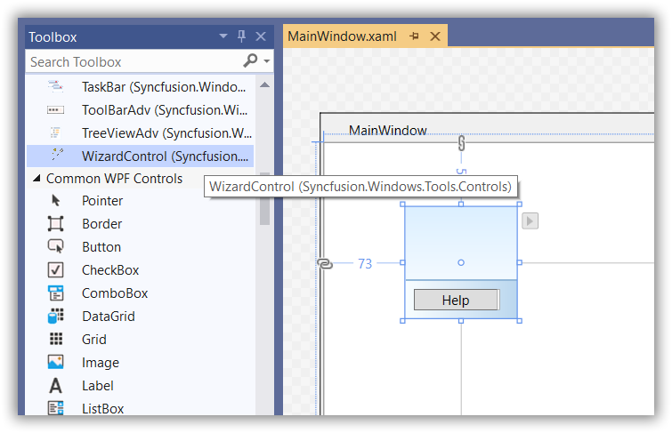
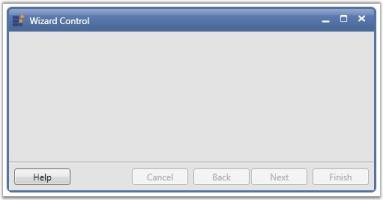
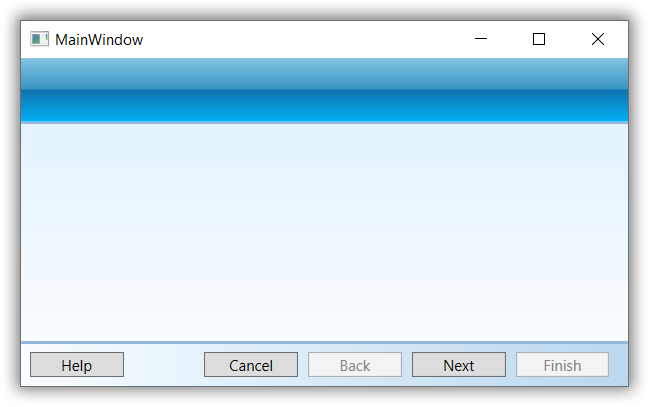

# Getting Started with WPF Wizard Control

This section gives a quick overview for working with the [WizardControl](https://help.syncfusion.com/cr/wpf/Syncfusion.Windows.Tools.Controls.WizardControl.html).

## Highlighting features

You can find some important features of [WizardControl](https://help.syncfusion.com/cr/wpf/Syncfusion.Windows.Tools.Controls.WizardControl.html) below.

* WizardControl contains the [WizardPage](https://help.syncfusion.com/cr/wpf/Syncfusion.Windows.Tools.Controls.WizardPage.html), which is used to add multiple pages.
* Each wizard page has the Next, Close, Back, Help and Finish buttons for navigating between the wizard pages.
* Allows you to customize the appearance of WizardControl and WizardPage.

## Assembly deployment
Refer to the [control dependencies](https://help.syncfusion.com/wpf/control-dependencies#wizard) section to get the list of assemblies or NuGet package that needs to be added as a reference to use the [WizardControl](https://help.syncfusion.com/cr/wpf/Syncfusion.Windows.Tools.Controls.WizardControl.html) control in any application.

You can find more details about installing the NuGet package in a WPF application in the following link:
[How to install nuget packages](https://help.syncfusion.com/wpf/visual-studio-integration/nuget-packages#installing-nuget-packages)

## Creating Application with WizardControl
In this walk through, user will create a WPF application that contains [WizardControl](https://help.syncfusion.com/cr/wpf/Syncfusion.Windows.Tools.Controls.WizardControl.html) control.
1. [Creating project](#Creating-the-project)
2. [Adding control via designer](#Adding-control-via-designer)
3. [Adding control manually in XAML](#Adding-control-manually-in-XAML)
4. [Adding control manually in C#](#Adding-control-manually-in-C#)
5. [Creating Data Model for sample application](#Creating-Data-Model-for-sample-application)
6. [Binding to Data ](#Creating-Data-Model-for-sample-application)

## Creating project 
Below section provides detailed information to create new project in Visual Studio to display [WizardControl](https://help.syncfusion.com/cr/wpf/Syncfusion.Windows.Tools.Controls.WizardControl.html).

## Adding control via designer
The [WizardControl](https://help.syncfusion.com/cr/wpf/Syncfusion.Windows.Tools.Controls.WizardControl.html) control can be added to the application by dragging it from Toolbox and dropping it in designer. The required [assemblies](https://help.syncfusion.com/wpf/control-dependencies#wizard) will be added automatically.

## Adding control manually in XAML
In order to add [WizardControl](https://help.syncfusion.com/cr/wpf/Syncfusion.Windows.Tools.Controls.WizardControl.html) control manually in XAML, do the below steps,

1. Add the below required assembly references to the project,

   * Syncfusion.Shared.Wpf
   * Syncfusion.Tools.WPf

2. Import Syncfusion WPF schema **http://schemas.syncfusion.com/wpf** in XAML page.

3. Declare [WizardControl](https://help.syncfusion.com/cr/wpf/Syncfusion.Windows.Tools.Controls.WizardControl.html) in XAML page.





<Window
        xmlns="http://schemas.microsoft.com/winfx/2006/xaml/presentation"
        xmlns:x="http://schemas.microsoft.com/winfx/2006/xaml"
        xmlns:d="http://schemas.microsoft.com/expression/blend/2008"
        xmlns:mc="http://schemas.openxmlformats.org/markup-compatibility/2006"
        xmlns:local="clr-namespace:GettingStartedComboBox"
        xmlns:syncfusion="http://schemas.syncfusion.com/wpf" x:Class="GettingStartedComboBox.MainWindow"
        mc:Ignorable="d"
        Title="MainWindow" Height="450" Width="800">
    <Grid>
        <syncfusion:WizardControl Name="wizardControl"/>
    </Grid>
</Window>





## Adding control manually in C#
In order to add [WizardControl](https://help.syncfusion.com/cr/wpf/Syncfusion.Windows.Tools.Controls.WizardControl.html) control manually in C#, do the below steps,

1. Add the below required assembly references to the project,

   * Syncfusion.Shared.Wpf
   * Syncfusion.Tools.WPf

2. Import WizardControl namespace **Syncfusion.Windows.Tools.Controls**.

3. Create WizardControl instance and add it to the page.





using System.Windows;
using Syncfusion.Windows.Tools.Controls;
namespace WizardControl
{
    /// 

    /// Interaction logic for MainWindow.xaml
    /// 

    public partial class MainWindow : Window
    {
        public MainWindow()
        {
            InitializeComponent();
            WizardControl wizardControl = new WizardControl();
            this.Content = wizardControl;
        }
    }
}




## Adding multiple pages

You can add multiple pages in [WizardControl](https://help.syncfusion.com/cr/wpf/Syncfusion.Windows.Tools.Controls.WizardControl.html) using the [WizardPage](https://help.syncfusion.com/cr/wpf/Syncfusion.Windows.Tools.Controls.WizardPage.html) control. The Cancel, Back, Next and Finish buttons enables and disables automatically based on the current visible wizard page.





<syncfusion:WizardControl Name="wizardControl">
    <syncfusion:WizardPage Name="wizardPage1"/>
    <syncfusion:WizardPage Name="wizardPage2"/>
    <syncfusion:WizardPage Name="wizardPage3"/>
</syncfusion:WizardControl>





WizardControl wizardControl = new WizardControl();
WizardPage wizardPage1 = new WizardPage();
WizardPage wizardPage2 = new WizardPage();
WizardPage wizardPage2 = new WizardPage();

wizardControl.Items.Add(wizardPage1);     
wizardControl.Items.Add(wizardPage2);
wizardControl.Items.Add(wizardPage3);





## Theme

WizardControl supports various built-in themes. Refer to the below links to apply themes for the WizardControl,

  * [Apply theme using SfSkinManager](https://help.syncfusion.com/wpf/themes/skin-manager)
	
  * [Create a custom theme using ThemeStudio](https://help.syncfusion.com/wpf/themes/theme-studio#creating-custom-theme)

   