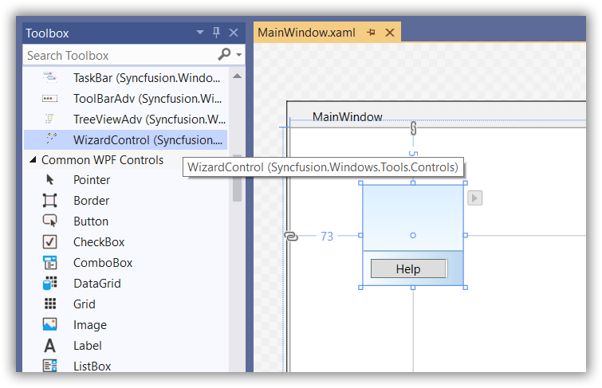
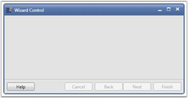
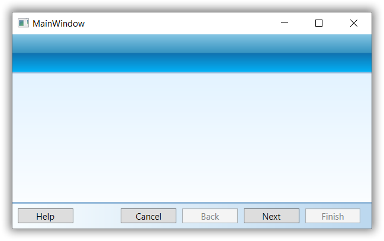

# Getting Started with WPF Wizard Control

This section explains how to get started with the [Wizard Control](https://help.syncfusion.com/cr/wpf/Syncfusion.Windows.Tools.Controls.WizardControl.html).

## Highlighting features

The following are some of the key features of [Wizard Control](https://help.syncfusion.com/cr/wpf/Syncfusion.Windows.Tools.Controls.WizardControl.html):

* Wizard Control uses [WizardPage](https://help.syncfusion.com/cr/wpf/Syncfusion.Windows.Tools.Controls.WizardPage.html) objects to organize content into multiple pages.
* Built-in navigation buttons such as **Back**, **Next**, **Finish**, **Cancel**, and **Help** enable navigation between wizard pages.
* Supports customization of the appearance of both Wizard Control and WizardPage.

## Assembly deployment

Refer to the [Control Dependencies](https://help.syncfusion.com/wpf/control-dependencies#wizard) section for the list of assemblies and NuGet packages required to use the [Wizard Control](https://help.syncfusion.com/cr/wpf/Syncfusion.Windows.Tools.Controls.WizardControl.html) in a WPF application.

**NuGet package:** `Syncfusion.Tools.Wpf`

For more information about installing NuGet packages in a WPF application, refer to the following article:
[How to install nuget packages](https://help.syncfusion.com/wpf/installation/install-nuget-packages)

## Creating Application with Wizard Control

In this walkthrough, you will create a WPF application that uses the [Wizard Control](https://help.syncfusion.com/cr/wpf/Syncfusion.Windows.Tools.Controls.WizardControl.html).

1. [Creating project](https://help.syncfusion.com/wpf/wizard-control/getting-started#creating-project)
2. [Adding control via designer](https://help.syncfusion.com/wpf/wizard-control/getting-started#adding-control-via-designer)
3. [Adding control manually in XAML](https://help.syncfusion.com/wpf/wizard-control/getting-started#adding-control-manually-in-xaml)
4. [Adding control manually in C#](https://help.syncfusion.com/wpf/wizard-control/getting-started#adding-control-manually-in-c)
5. [Adding multiple pages](https://help.syncfusion.com/wpf/wizard-control/getting-started#adding-multiple-pages)

## Creating project

Follow these steps to create a WPF project in Visual Studio and add the [Wizard Control](https://help.syncfusion.com/cr/wpf/Syncfusion.Windows.Tools.Controls.WizardControl.html) to it.

## Adding control via designer
The [Wizard Control](https://help.syncfusion.com/cr/wpf/Syncfusion.Windows.Tools.Controls.WizardControl.html) control can be added to the application by dragging it from the **Toolbox** and dropping it onto the designer surface. The required assembly references are added automatically.

## Adding control manually in XAML
To add the [Wizard Control](https://help.syncfusion.com/cr/wpf/Syncfusion.Windows.Tools.Controls.WizardControl.html) control manually in XAML, follow these steps:

1. Add the required assembly references to the project:

   * Syncfusion.Shared.WPF
   * Syncfusion.Tools.WPF

2. Import the Syncfusion WPF schema **http://schemas.syncfusion.com/wpf** in the XAML page.

3. Add the [Wizard Control](https://help.syncfusion.com/cr/wpf/Syncfusion.Windows.Tools.Controls.WizardControl.html) to the XAML page.






<Window
        xmlns="http://schemas.microsoft.com/winfx/2006/xaml/presentation"
        xmlns:x="http://schemas.microsoft.com/winfx/2006/xaml"
        xmlns:d="http://schemas.microsoft.com/expression/blend/2008"
        xmlns:mc="http://schemas.openxmlformats.org/markup-compatibility/2006"
        xmlns:local="clr-namespace:WizardControl"
        xmlns:syncfusion="http://schemas.syncfusion.com/wpf" x:Class="WizardControl.MainWindow"
        mc:Ignorable="d"
        Title="MainWindow" Height="450" Width="800">
    <Grid>
        <syncfusion:WizardControl Name="wizardControl"/>
    </Grid>
</Window>





{{ codesnippet1 | OrderList_Indent_Level_1 }}

## Adding control manually in C#
To add the [Wizard Control](https://help.syncfusion.com/cr/wpf/Syncfusion.Windows.Tools.Controls.WizardControl.html) control manually in C#, follow these steps:

1. Add the required assembly references to the project:

   * Syncfusion.Shared.WPF
   * Syncfusion.Tools.WPF

2. Import the **Syncfusion.Windows.Tools.Controls** namespace.

3. Create an instance of Wizard Control and add it to the window.






using System.Windows;
using System.Windows.Controls;
using Syncfusion.Windows.Tools.Controls;
namespace WizardControl
{
    /// 

    /// Interaction logic for MainWindow.xaml
    /// 

    public partial class MainWindow : Window
    {
        public MainWindow()
        {
            InitializeComponent();
            WizardControl wizardControl = new WizardControl();
            this.Content = wizardControl;
        }
    }
}




{{ codesnippet2 | OrderList_Indent_Level_1 }}

## Adding multiple pages

You can add multiple pages to the [Wizard Control](https://help.syncfusion.com/cr/wpf/Syncfusion.Windows.Tools.Controls.WizardControl.html) by using [WizardPage](https://help.syncfusion.com/cr/wpf/Syncfusion.Windows.Tools.Controls.WizardPage.html) objects. The **Back**, **Next**, **Finish**, and **Cancel** buttons are enabled or disabled automatically based on the currently displayed page.





<syncfusion:WizardControl Name="wizardControl">
    <syncfusion:WizardPage Name="wizardPage1"/>
    <syncfusion:WizardPage Name="wizardPage2"/>
    <syncfusion:WizardPage Name="wizardPage3"/>
</syncfusion:WizardControl>





WizardControl wizardControl = new WizardControl();
WizardPage wizardPage1 = new WizardPage();
WizardPage wizardPage2 = new WizardPage();
WizardPage wizardPage3 = new WizardPage();

wizardControl.Items.Add(wizardPage1);
wizardControl.Items.Add(wizardPage2);
wizardControl.Items.Add(wizardPage3);





## Theme

Wizard Control supports a variety of built-in themes. Refer to the following articles to learn how to apply themes to the Wizard Control:

  * [Apply theme using SfSkinManager](https://help.syncfusion.com/wpf/themes/skin-manager)
  * [Create a custom theme using ThemeStudio](https://help.syncfusion.com/wpf/themes/theme-studio#creating-custom-theme)

