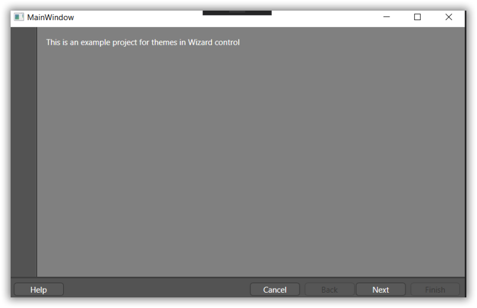

# Layout Related Features

This section illustrates the following Layout-related features of [Wizard Control](https://help.syncfusion.com/cr/cref_files/wpf/Syncfusion.Tools.Wpf~Syncfusion.Windows.Tools.Controls.WizardControl.html).

## Setting the Minimum Height for the Interior Wizard Page Header

You can set the minimum height for the header of the Interior wizard page by using the [InteriorPageHeaderMinHeight](https://help.syncfusion.com/cr/cref_files/wpf/Syncfusion.Tools.Wpf~Syncfusion.Windows.Tools.Controls.WizardControl~InteriorPageHeaderMinHeight.html) property in [Wizard Control](https://help.syncfusion.com/cr/cref_files/wpf/Syncfusion.Tools.Wpf~Syncfusion.Windows.Tools.Controls.WizardControl.html).





<syncfusion:WizardControl Name="wizardControl" InteriorPageHeaderMinHeight="150">
    <syncfusion:WizardPage Name="wizardPage" />
</syncfusion:WizardControl>





WizardControl wizardControl = new WizardControl();

WizardPage wizardPage = new WizardPage();

wizardControl.Items.Add(wizardPage);

wizardControl.InteriorPageHeaderMinHeight = 150; 





## Setting the Banner Background Color

You can set the background color of the banner for the [Wizard Control](https://help.syncfusion.com/cr/cref_files/wpf/Syncfusion.Tools.Wpf~Syncfusion.Windows.Tools.Controls.WizardControl.html) by using the [BannerBackground](https://help.syncfusion.com/cr/cref_files/wpf/Syncfusion.Tools.Wpf~Syncfusion.Windows.Tools.Controls.WizardPage~BannerBackground.html) property. 





<syncfusion:WizardControl Name="wizardControl">
    <syncfusion:WizardPage Name="wizardPage" BannerBackground="Navy"/>
</syncfusion:WizardControl>





WizardControl wizardControl = new WizardControl();

WizardPage wizardPage = new WizardPage();

wizardControl.Items.Add(wizardPage);

wizardPage.BannerBackground = Brushes.Navy;





## Setting the Banner Image

You can set an image for the banner of the [Wizard Page](https://help.syncfusion.com/cr/cref_files/wpf/Syncfusion.Tools.Wpf~Syncfusion.Windows.Tools.Controls.WizardPage.html) in  [Wizard Control](https://help.syncfusion.com/cr/cref_files/wpf/Syncfusion.Tools.Wpf~Syncfusion.Windows.Tools.Controls.WizardControl.html)
 using the [BannerImage](https://help.syncfusion.com/cr/cref_files/wpf/Syncfusion.Tools.Wpf~Syncfusion.Windows.Tools.Controls.WizardPage~BannerImage.html) property.

N> You can set the banner image either on the interior or exterior wizard page based on the wizard page type.





<syncfusion:WizardControl Name="wizardControl">
    <syncfusion:WizardPage Name="wizardPage" BannerImage="/Image/sync.bmp"/>
</syncfusion:WizardControl>





WizardControl wizardControl = new WizardControl();

WizardPage wizardPage = new WizardPage();

wizardControl.Items.Add(wizardPage);

wizardPage.BannerImage = new BitmapImage(new Uri("/Image/sync.bmp", UriKind.RelativeOrAbsolute));  





## Setting Minimum Width for the Banner Image on the Exterior Wizard Page

You can set the minimum width of the banner image on the 'Exterior' wizard page by using the [ExteriorPageBannerImageMinWidth](https://help.syncfusion.com/cr/cref_files/wpf/Syncfusion.Tools.Wpf~Syncfusion.Windows.Tools.Controls.WizardControl~ExteriorPageBannerImageMinWidth.html) property in [Wizard Control](https://help.syncfusion.com/cr/cref_files/wpf/Syncfusion.Tools.Wpf~Syncfusion.Windows.Tools.Controls.WizardControl.html).





<syncfusion:WizardControl Name="wizardControl" ExteriorPageBannerImageMinWidth="10">
    <syncfusion:WizardPage Name="wizardPage" PageType="Exterior" BannerImage="/Image/sync.bmp"/>
</syncfusion:WizardControl>





WizardControl wizardControl = new WizardControl();

grid.Children.Add(wizardControl);

WizardPage wizardPage = new WizardPage();

wizardControl.Items.Add(wizardPage);

wizardPage.BannerImage = new BitmapImage(new Uri("/Image/sync.bmp", UriKind.RelativeOrAbsolute));

wizardPage.PageType = WizardPageType.Exterior;

wizardControl.ExteriorPageBannerImageMinWidth = 10;





## Setting Visual Styles for Wizard Control

The appearance of [Wizard Control](https://help.syncfusion.com/cr/cref_files/wpf/Syncfusion.Tools.Wpf~Syncfusion.Windows.Tools.Controls.WizardControl.html) can be customized by [VisualStyle](https://help.syncfusion.com/cr/cref_files/wpf/Syncfusion.SfSkinManager.WPF~Syncfusion.SfSkinManager.VisualStyles.html) attached property of the [SfSkinManager](https://help.syncfusion.com/cr/cref_files/wpf/Syncfusion.SfSkinManager.WPF~Syncfusion.SfSkinManager.VisualStyles.html). You can find the list of available built-in themes and the assemblies needs to be referred in the below documentation [link](https://help.syncfusion.com/wpf/themes/getting-started).

Below example explains how to apply blend theme for [Wizard Control](https://help.syncfusion.com/cr/cref_files/wpf/Syncfusion.Tools.Wpf~Syncfusion.Windows.Tools.Controls.WizardControl.html) using SfSkinManager in an existing application.

1. Add reference to **Syncfusion.SfSkinManager.Wpf.dll** and **Syncfusion.Themes.Blend.Wpf.dll** assembly.
2. Now add reference to SfSkinManager namespace and set SfSkinManager.VisualStyle attached property to window or [Wizard Control](https://help.syncfusion.com/cr/cref_files/wpf/Syncfusion.Tools.Wpf~Syncfusion.Windows.Tools.Controls.WizardControl.html). Setting VisualStyle property to window will apply blend theme for all controls in Windows.





<Window
    xmlns="http://schemas.microsoft.com/winfx/2006/xaml/presentation"
    xmlns:x="http://schemas.microsoft.com/winfx/2006/xaml"
    xmlns:d="http://schemas.microsoft.com/expression/blend/2008"
    xmlns:mc="http://schemas.openxmlformats.org/markup-compatibility/2006"
    xmlns:local="clr-namespace:WPF_ForDocumentation"
    xmlns:syncfusion="http://schemas.syncfusion.com/wpf" 
    x:Class="WPF_ForDocumentation.MainWindow"
    xmlns:skinManager="clr-namespace:Syncfusion.SfSkinManager;assembly=Syncfusion.SfSkinManager.WPF" 
    mc:Ignorable="d"
    Name="mainWindow"
    Title="MainWindow" Height="350" Width="500" >
    <syncfusion:WizardControl Name="wizard" skinManager:SfSkinManager.VisualStyle="Blend">
        <syncfusion:WizardPage>
           <TextBlock Text="This is an example project for themes in Wizard control" />
        </syncfusion:WizardPage>
        <syncfusion:WizardPage />
    </syncfusion:WizardControl>
</Window>





