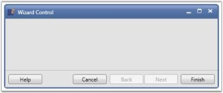

# Interactive Features

This section illustrates the following interactive feature of Wizard control. 

## Adding Wizard Page to the Wizard Control

You can add any number of wizard pages to the Wizard control. They are plenty of properties in the Wizard control that are used to customize the look and feel of the wizard page.

To add a wizard page to the Wizard control, use the below code




<syncfusion:WizardControl Name="wizardControl">

    <syncfusion:WizardPage Name="wizardPage"/>

</syncfusion:WizardControl>




WizardControl wizardControl = new WizardControl();

grid.Children.Add(wizardControl);

WizardPage wizardPage = new WizardPage();

wizardControl.Items.Add(wizardPage);  



To add two wizard pages to the Wizard control, refer the below code




<syncfusion:WizardControl Name="wizardControl">

    <syncfusion:WizardPage Name="wizardPage1"/>

    <syncfusion:WizardPage Name="wizardPage2"/>

</syncfusion:WizardControl>




WizardControl wizardControl = new WizardControl();

grid.Children.Add(wizardControl);

WizardPage wizardPage1 = new WizardPage();

WizardPage wizardPage2 = new WizardPage();

wizardControl.Items.Add(wizardPage1);     

wizardControl.Items.Add(wizardPage2);




## Wizard Page

`SelectedWizardPage` property is used to select the wizard page from the WizardControl. Since the type of SelectedWizardPage is WizardPage, binding is needed to set selected wizard page through XAML. The following code explains how to select the wizard page in XAML,





<syncfusion:WizardControl Name="WizardControl" SelectedWizardPage="{Binding ElementName=wizard2}" Foreground="SlateBlue">

<syncfusion:WizardPage Title="Wizard Page1" x:Name="wizard1"/>

<syncfusion:WizardPage Title="Wizard Page2" x:Name="wizard2"/>

<syncfusion:WizardPage Title="Wizard Page3" x:Name="wizard3"/>

</syncfusion:WizardControl>









// "grid" is the name of grid control

WizardControl wizardControl = new WizardControl();

grid.Children.Add(wizardControl);

WizardPage wizardPage1 = new WizardPage();

WizardPage wizardPage2 = new WizardPage();

WizardPage wizardPage3 = new WizardPage();

wizardControl.Foreground = Brushes.SlateBlue;    

wizardPage1.Title = "Wizard Page1";

wizardPage2.Title = "Wizard Page2";

wizardPage3.Title = "Wizard Page3";

wizardControl.Items.Add(wizardPage1);

wizardControl.Items.Add(wizardPage2);

wizardControl.Items.Add(wizardPage3);

wizardControl.SelectedWizardPage = wizardPage2; 





### Title and Description

You can set the title and description for the wizard page by using the Title and Description properties respectively.

Use the following code snippet to set these properties.




<syncfusion:WizardControl Name="wizardControl">

    <syncfusion:WizardPage Name="wizardPage" Foreground="Navy" Title="WizardPage1"

Description="This is the first page of wizard" />

</syncfusion:WizardControl>




WizardControl wizardControl = new WizardControl();

grid.Children.Add(wizardControl);

WizardPage wizardPage = new WizardPage();

wizardControl.Items.Add(wizardPage);

wizardPage.Foreground = Brushes.Navy;

wizardPage.Title = "WizardPage1";

wizardPage.Description = "This is the first page of wizard"



### Wizard Page Type

You can set the type of the wizard page by using the PageType property. There are three types of wizard pages.

* Blank
* Interior
* Exterior

Use the below code snippet to set the PageType as Blank.




<syncfusion:WizardControl Name="wizardControl">

    <syncfusion:WizardPage Name="wizardPage" PageType="Blank"/>

</syncfusion:WizardControl>




WizardControl wizardControl = new WizardControl();

grid.Children.Add(wizardControl);

WizardPage wizardPage = new WizardPage();

wizardControl.Items.Add(wizardPage);

wizardPage.PageType = WizardPageType.Blank;    





Use the following code snippet to set the PageType as Interior.




<syncfusion:WizardControl Name="wizardControl">

    <syncfusion:WizardPage Name="wizardPage" PageType="Interior"/>

</syncfusion:WizardControl>





WizardControl wizardControl = new WizardControl();

grid.Children.Add(wizardControl);

WizardPage wizardPage = new WizardPage();

wizardControl.Items.Add(wizardPage);

wizardPage.PageType = WizardPageType.Interior;  



Use the following code snippet to set the PageType as Exterior.




<syncfusion:WizardControl Name="wizardControl">

    <syncfusion:WizardPage Name="wizardPage" PageType="Exterior"/>

</syncfusion:WizardControl>




WizardControl wizardControl = new WizardControl();

grid.Children.Add(wizardControl);

WizardPage wizardPage = new WizardPage();

wizardControl.Items.Add(wizardPage);

wizardPage.PageType = WizardPageType.Exterior;    






Minimum Width for the Banner Image on the Exterior Wizard Page, Minimum Height for the Interior Wizard Page Header



### Navigation Buttons of Wizard Page

This topic illustrates the following about Navigation buttons:

* Enabling or Disabling the Navigation Buttons
* Showing or Hiding the Navigation Buttons
* Text for the Navigation Buttons

#### Enabling or Disabling the Navigation Buttons

You can enable or disable the Back, Cancel, Next and Finish navigation buttons in the wizard control and wizard page. This is done by using the BackEnabled, CancelEnabled, NextEnabled and FinishEnabled properties respectively.

Here is the code snippet.




<syncfusion:WizardControl Name="wizardControl" BackEnabled="True" FinishEnabled="True"

NextEnabled="True" CancelEnabled="True">

    <syncfusion:WizardPage Name="wizardPage"/>

</syncfusion:WizardControl>




WizardControl wizardControl = new WizardControl();

grid.Children.Add(wizardControl);

WizardPage wizardPage = new WizardPage();           

wizardControl.Items.Add(wizardPage);

wizardControl.NextEnabled = true;

wizardControl.BackEnabled = true;

wizardControl.FinishEnabled = true;

wizardControl.CancelEnabled = true;  




#### Showing or Hiding the Navigation Buttons

You can show or hide the Back, Cancel, Next, Help and Finish navigation buttons in the wizard control and wizard page. This is done by using the BackVisible, CancelVisible, NextVisible, HelpVisible and FinishVisible properties respectively. 

To set these properties, refer the below code.





<syncfusion:WizardControl Name="wizardControl" BackVisible="False" NextVisible="True" 

CancelVisible="True" HelpVisible="True" FinishVisible="False">

    <syncfusion:WizardPage Name="wizardPage"/>

</syncfusion:WizardControl>




WizardControl wizardControl = new WizardControl();

grid.Children.Add(wizardControl);

WizardPage wizardPage = new WizardPage();

wizardControl.Items.Add(wizardPage);

wizardControl.CancelVisible = true;

wizardControl.BackVisible = false;

wizardControl.FinishVisible = true;

wizardControl.NextVisible = true;

wizardControl.HelpVisible = true; 





#### Text for the Navigation Buttons

You can set custom text for the Back, Next, Finish, Help and Cancel navigation buttons in the Wizard control. This is done by using the BackText, NextText, FinishText, HelpText and CancelText properties as follows. 




<syncfusion:WizardControl Name="wizardControl" BackText="Previous" 

HelpText="Help" CancelText="Exit" FinishText="Finish" NextText="Next">

    <syncfusion:WizardPage Name="wizardPage"/>

</syncfusion:WizardControl>





WizardControl wizardControl = new WizardControl();

grid.Children.Add(wizardControl);

WizardPage wizardPage = new WizardPage();           

wizardControl.Items.Add(wizardPage);

wizardControl.NextText = "Next";

wizardControl.BackText = "Previous";

wizardControl.CancelText = "Exit";

wizardControl.HelpText = "Help";

wizardControl.FinishText = "Finish";





N> You can set custom text for the navigation buttons in the wizard control only. You cannot set custom text for the navigation buttons in the wizard page.



Next Page and Previous Page Navigation



### Working with Wizard Control

This section contains the following topics:

#### Next Page and Previous Page Navigation

You can set the navigation to the Next and Previous pages by using the NextPage and PreviousPage properties respectively. To set these properties, use the below code.



WizardControl wizardControl = new WizardControl();

grid.Children.Add(wizardControl);

WizardPage wizardPage1 = new WizardPage();

WizardPage wizardPage2 = new WizardPage();

WizardPage wizardPage3 = new WizardPage();

wizardControl.Foreground = Brushes.SlateBlue;

wizardPage1.Title = "Wizard Page1";

wizardPage2.Title = "Wizard Page2";

wizardPage3.Title = "Wizard Page3";

wizardControl.Items.Add(wizardPage1);

wizardControl.Items.Add(wizardPage2);

wizardControl.Items.Add(wizardPage3);

wizardPage1.NextPage = wizardPage3;

wizardPage3.PreviousPage = wizardPage1;  





Navigation Buttons



#### Closing the Wizard Window

You can close the Wizard control window by clicking the Cancel or Finish button by enabling the CloseWindowOnCancel or CloseWindowOnFinish properties respectively.

To enable these properties, refer the below code




<syncfusion:WizardControl Name="wizardControl" CloseWindowOnCancel="True" CloseWindowOnFinish="True">

    <syncfusion:WizardPage Name="wizardPage"/>

</syncfusion:WizardControl>





WizardControl wizardControl = new WizardControl();

grid.Children.Add(wizardControl);

WizardPage wizardPage = new WizardPage();

wizardControl.Items.Add(wizardPage);

wizardControl.CloseWindowOnCancel = true;

wizardControl.CloseWindowOnFinish = true; 



## Event for Next Button in Wizard Control  

The Next Button event has been implemented in Wizard Control in order to do operations such as displaying a message box and making the thread to sleep before navigating to the next page.

### Use Case Scenario

Users can use this event to do valid code of operations such as displaying a message box and making the thread to sleep before navigating to the next page in Wizard Control.

### Events

<table>
<tr>
<th>
Event </th><th>
Description </th><th>
Arguments </th><th>
Type </th><th>
Reference links </th></tr>
<tr>
<td>
Next</td><td>
The Next button is clicked in Wizard Control</td><td>
-</td><td>
Routed Event</td><td>
-</td></tr>
</table>

### Adding Next Button Event to an Application 

#### Use the following code snippet to define the Next Button Event for Wizard control:



		<syncfusion:WizardControl Name="wizardControl" 

                                        Next="wizardControl_Next">

<!-- Welcome page -->

			<syncfusion:WizardPage Name="wizPage1"                           Title="Welcome to the Installation Setup Wizard" PageType="Exterior"                                     

Description="This will install Software on your computer." BackVisible="False"

CancelVisible="True" FinishVisible="False" HelpVisible="True">

<StackPanel Orientation="Vertical">

<TextBlock TextWrapping="Wrap" Margin="0,10,10,10" Text="It is recommended that you close all other applications before continuing."/>

<TextBlock Margin="0,10,10,10" Text="Click Next to continue, or Cancel to exit Setup."/>

<TextBlock Margin="0,10,10,10" Text="For more information, click Help."/>

</StackPanel>

</syncfusion:WizardPage>

                          </syncfusion:WizardControl>



#### Samples Location

The samples are located in the following location:

[http://www.syncfusion.com/uploads/redirect.aspx?&team=support&file=WizardSample607850358.zip](http://www.syncfusion.com/uploads/redirect.aspx?&team=support&file=WizardSample607850358.zip)

