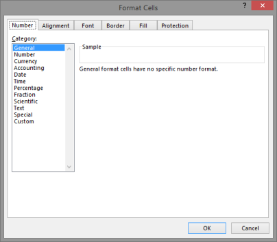
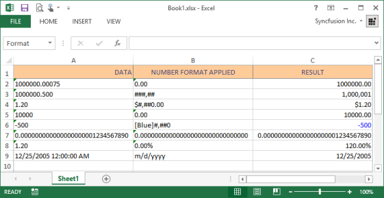
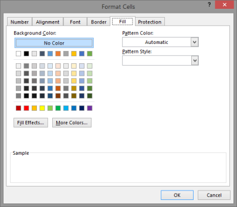
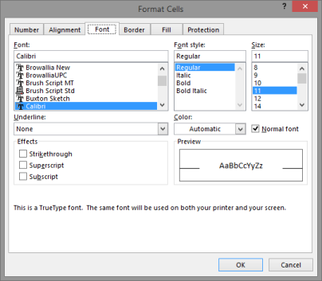
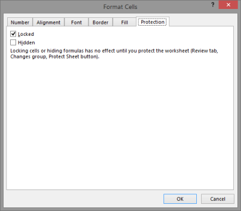
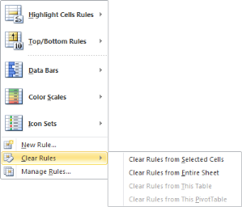
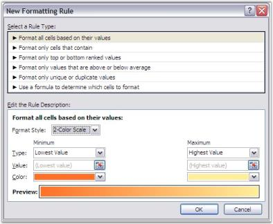
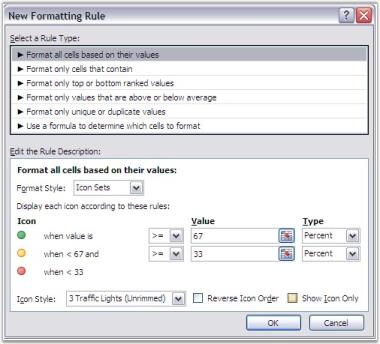

# Cell or Range Formatting

Data formatting gives a better readability and clear understanding of the data in the worksheet. Numerous formatting options are available like underlining, coloring, and so on, that organizes and clearly identifies the data within a worksheet. Minute refining options such as aligning the titles to center across the columns gives a professional appearance to the worksheet. 

Microsoft Excel provides various options to format these worksheets. XlsIO is also enriched with formatting options similar to MS Excel. The formatting capabilities of XlsIO are explained in the following sub-sections.

## Apply Default Style

Microsoft Excel provides support to create styles by using the Style dialog box (Go to the Format menu and click Styles command). It also permits to modify and add new styles that can be applied to a range of cells.

{{ '' | markdownify }}
{:.image }

Applying Default style in XlsIO

XlsIO provides various ways to apply styles. IStyle interface is used for creating styles. You can set the default styles created with groups of styles to a range of rows and columns. This is the most optimized approach to format rows and columns with large number of cells with same styles.

The following code example illustrates how to create and apply default styles for a range of rows and columns.

[C#]

// Step 1: Instantiates the spreadsheet creation engine.

ExcelEngine excelEngine = new ExcelEngine();

// Step 2: Instantiates the excel application object.

IApplication application = excelEngine.Excel;

// A new workbook is created. [Equivalent to creating a new workbook in MS Excel).

// The new workbook will have 2 worksheets.

IWorkbook workbook = application.Workbooks.Create(2);

IWorksheet sheet = workbook.Worksheets[0];

// Defines the default styles that is to be applied to the rows and columns.

IStyle rowStyle = workbook.Styles.Add("RowStyle");

rowStyle.Color = Color.LightCoral;

IStyle columnStyle = workbook.Styles.Add("ColumnStyle");

columnStyle.Color = Color.Orange;

// Sets Column Default Style.

sheet.SetDefaultRowStyle(1, 2, rowStyle);

// Sets Column Default Style.

sheet.SetDefaultColumnStyle(1, 2, columnStyle); 

string fileName = "Output.xlsx";

workbook.Version = ExcelVersion.Excel2010;

workbook.SaveAs(fileName);

// Closes the workbook.

workbook.Close();

excelEngine.Dispose();         

[VB.NET]

' Step 1: Instantiates the spreadsheet creation engine.

Dim excelEngine As ExcelEngine = New ExcelEngine

' Step 2: Instantiates the excel application object.

Dim application As IApplication = excelEngine.Excel

' A new workbook is created. [Equivalent to creating a new workbook in MS Excel].

'The new workbook will have 2 worksheets.

Dim workbook As IWorkbook = application.Workbooks.Create(2)

' Accesses via index.

Dim sheet As IWorkbook = workbook.Worksheets(0)

' Defines the default styles that is to be applied to the rows and columns.

Dim rowStyle As IStyle = workbook.Styles.Add("RowStyle")

rowStyle.Color = Color.LightCoral

Dim columnStyle As IStyle = workbook.Styles.Add("ColumnStyle")

columnStyle.Color = Color.Orange

' Sets Column Default Style.

sheet.SetDefaultRowStyle(1, 2, rowStyle)

' Sets Column Default Style.

sheet.SetDefaultColumnStyle(1, 2, columnStyle)

Dim fileName As String = "Output.xlsx"

workbook.Version = ExcelVersion.Excel2010

workbook.SaveAs(fileName)

' Closes the workbook.

workbook.Close()

excelEngine.Dispose()

> _Note: Applying custom styles will override the original styles. See Also_ Global Styles.

## Apply Global Style

XlsIO provides support for adding and modifying common (or global) styles that can be applied to one or more cells in a workbook. These styles can be created and applied to several ranges of cells in the workbook. Note that the usage of common styles to format spreadsheets is the recommended approach since setting a separate style for each cell can reduce the performance considerably.

> _Note: when you want to apply more than one style for cells, enclose the style within the Begin and End calls. This improves the performance._

[C#]

// Step 1: Instantiates the spreadsheet creation engine.

ExcelEngine excelEngine = new ExcelEngine();

// Step 2: Instantiates the excel application object.

IApplication application = excelEngine.Excel;

// A new workbook is created. [Equivalent to creating a new workbook in MS Excel).

// The new workbook will have 2 worksheets.

IWorkbook workbook = application.Workbooks.Create(2);

IWorksheet sheet = workbook.Worksheets[0];

// Formatting.

// Global styles should be used when the same style needs to be applied to more than 

// one cell. This usage of a global style reduces memory usage.

// Header Style.

IStyle headerStyle = workbook.Styles.Add("HeaderStyle");

// Adds custom colors to the palette.

headerStyle.BeginUpdate();

workbook.SetPaletteColor(8, Color.FromArgb(255, 174, 33));

headerStyle.Color = Color.FromArgb(255, 174, 33);

headerStyle.Font.Bold = true;

headerStyle.Borders[ExcelBordersIndex.EdgeLeft].LineStyle = ExcelLineStyle.Thin;

headerStyle.Borders[ExcelBordersIndex.EdgeRight].LineStyle = ExcelLineStyle.Thin;

headerStyle.Borders[ExcelBordersIndex.EdgeTop].LineStyle = ExcelLineStyle.Thin;

headerStyle.Borders[ExcelBordersIndex.EdgeBottom].LineStyle = ExcelLineStyle.Thin;

headerStyle.EndUpdate();

// Body Style.

IStyle bodyStyle = workbook.Styles.Add("BodyStyle");

// Adds custom colors to the palette.

bodyStyle.BeginUpdate();

workbook.SetPaletteColor(9, Color.FromArgb(239, 243, 247));

bodyStyle.Color = Color.FromArgb(239, 243, 247);

bodyStyle.Borders[ExcelBordersIndex.EdgeLeft].LineStyle = ExcelLineStyle.Thin;

bodyStyle.Borders[ExcelBordersIndex.EdgeRight].LineStyle = ExcelLineStyle.Thin;

bodyStyle.EndUpdate();

// Applies the defined styles.

// Applies Body Style.

sheet.UsedRange.CellStyle = bodyStyle;

// Applies Header style.

sheet.Rows[0].CellStyle = headerStyle;  

string fileName = "Output.xlsx";

workbook.Version = ExcelVersion.Excel2010;

workbook.SaveAs(fileName);

// Closes the workbook.

workbook.Close();

excelEngine.Dispose();

[VB.NET]

' Step 1: Instantiates the spreadsheet creation engine.

Dim excelEngine As ExcelEngine = New ExcelEngine

' Step 2: Instantiates the excel application object.

Dim application As IApplication = excelEngine.Excel

' A new workbook is created. [Equivalent to creating a new workbook in MS Excel].

'The new workbook will have 2 worksheets.

Dim workbook As IWorkbook = application.Workbooks.Create(2)

' Accesses via index.

Dim sheet As IWorkbook = workbook.Worksheets(0)

' Formatting.

' Global styles should be used when the same style needs to be applied to more than One cell. This usage of a global style reduces memory usage.

' Header Style.

Dim headerStyle As IStyle = workbook.Styles.Add("Header Style")

' Adds custom colors to the palette.

headerStyle.BeginUpdate()

workbook.SetPaletteColor(8, Color.FromArgb(255,174,33))

headerStyle.Color = Color.FromArgb(255,174,33)

headerStyle.Font.Bold = True

headerStyle.Borders(ExcelBordersIndex.EdgeLeft).LineStyle = ExcelLineStyle.Thin

headerStyle.Borders(ExcelBordersIndex.EdgeRight).LineStyle = ExcelLineStyle.Thin

headerStyle.Borders(ExcelBordersIndex.EdgeTop).LineStyle = ExcelLineStyle.Thin

headerStyle.Borders(ExcelBordersIndex.EdgeBottom).LineStyle = ExcelLineStyle.Thin

headerStyle.EndUpdate()

' Body Style.

Dim bodyStyle As IStyle = workbook.Styles.Add("BodyStyle")

' Adds custom colors to the palette.

bodyStyle.BeginUpdate()

workbook.SetPaletteColor(9,Color.FromArgb(239,243,247))

bodyStyle.Color = Color.FromArgb(239,243,247)

bodyStyle.Borders(ExcelBordersIndex.EdgeLeft).LineStyle = ExcelLineStyle.Thin

bodyStyle.Borders(ExcelBordersIndex.EdgeRight).LineStyle = ExcelLineStyle.Thin

bodyStyle.EndUpdate()

' Applies the defined styles.

' Applies Body Style.

sheet.UsedRange.CellStyle = bodyStyle

' Applies Header style.

sheet.Rows[0].CellStyle = headerStyle

Dim fileName As String = "Output.xlsx"

workbook.Version = ExcelVersion.Excel2010

workbook.SaveAs(fileName)

' Closes the workbook.

workbook.Close()

excelEngine.Dispose()

{{ '' | markdownify }}
{:.image }

For more information refer to: Default Styles

## Apply Number Formats 

Number Formats are little code that help you control the appearance of numbers in the Excel. A number in a cell is displayed depending on the number format applied to it. The same number can be displayed in different formats also. For example, 1.5 may represent a half teaspoon in one spreadsheet, while the same 1.5 would represent somebody's age, another spreadsheet's percentage, or so on.

Microsoft Excel recognizes the numbers in various formats: Accounting, Scientific, Fractions, and Currency. MS Excel allows to set these number formats by using the Number tab in the Format Cells dialog box.

{{ '' | markdownify }}
{:.image }

A number format consists of up to 4 items separated by semicolons. Each of the item is an individual number format. The first, by default, applies to positive numbers, the second to negative numbers, the third to zeros, and the forth to text. When you do not apply any special formatting to text, Excel uses the General number format that basically means anything that will fit. 

1. Long Numbers

You can make long numbers easier to read by inserting a thousands separator (a comma for US regional settings). The #, ##0 number format is used. This format does not allow Excel to use the shorter scientific format, so the longest numbers merely show #######, signifying that they do not fit in their cells. You can either AutoFit the column or specify the column width in order to avoid showing #######.

2. Hide Zeros

Excel allows hiding zero values from displaying when you are not interested in showing the values if it is 0. This can be done by setting custom format as General or 0.00.

3. Leading Zeros

Excel removes the zero (0) in the zip code. The reason is that zero is not required to display the value of the number. However, since number formats are not about the value, but are about the appearance, you can use a special format to retain the leading zeros, 00000. 

4. Special Number Formats

In addition to the 00000 Zip Code number format, Excel also has 00000-0000 for Zip-Plus-Four, 000-00-0000 for Social Security numbers, and (000)000-0000 for telephone numbers. When you live in a location that needs different zip codes, you can design your own custom number formats. The following table shows various custom formatting codes.

_Custom formatting codes_

<table>
<tr>
<td>
Number Codes</td><td>
Description</td></tr>
<tr>
<td>
General</td><td>
General number format.</td></tr>
<tr>
<td>
0 (zero)</td><td>
Digit placeholder. This code pads the value with zeros to fill the format.</td></tr>
<tr>
<td>
#</td><td>
Digit placeholder. This code does not display extra zeros.</td></tr>
<tr>
<td>
?</td><td>
Digit placeholder. This code leaves a space for insignificant zeros, but does not display them.</td></tr>
<tr>
<td>
. (period)</td><td>
Decimal placeholder. The decimal placeholder determines how many digits are displayed to the left and right of the decimal separator.</td></tr>
<tr>
<td>
%</td><td>
Percentage placeholder. Multiplies by 100 and adds the % character.</td></tr>
<tr>
<td>
, (comma)</td><td>
Thousands separator. A comma followed by a placeholder (0 or #) scales the number by a thousand.</td></tr>
<tr>
<td>
E+ E- e+ e-</td><td>
Scientific notation.</td></tr>
</table>

_Custom formatting codes_

<table>
<tr>
<td>
Text Code</td><td>
Description</td></tr>
<tr>
<td>
$ - + / ( ) : space</td><td>
These characters are displayed in the number. To display any other character, enclose the character in quotation marks or precede it with a backslash.</td></tr>
<tr>
<td>
\character</td><td>
This code displays the succeeding character you specify.  Note Typing !, ^, &, ', ~, {, }, =, <, or > automatically places a backslash in front of the character.</td></tr>
<tr>
<td>
"text"</td><td>
This code displays the text.</td></tr>
<tr>
<td>
*</td><td>
This code repeats the next character in the format to fill the column width. </td></tr>
<tr>
<td>
_ (underscore)</td><td>
This code skips the width of the next character. This code is commonly used as "_)" (without the quotation marks) to leave space for a closing parenthesis in a positive number format when the negative number format includes parentheses. This allows the values to line up at the decimal point.</td></tr>
<tr>
<td>
@</td><td>
Text placeholder.</td></tr>
</table>

> _Note: Only one asterisk per section of a format is allowed._

_Custom formatting codes_

<table>
<tr>
<td>
Date Code</td><td>
Description</td></tr>
<tr>
<td>
m</td><td>
Month as a number without leading zeros (1-12).</td></tr>
<tr>
<td>
mm</td><td>
Month as a number with leading zeros (01-12).</td></tr>
<tr>
<td>
mmm</td><td>
Month as an abbreviation (Jan - Dec).</td></tr>
<tr>
<td>
mmmm</td><td>
Unabbreviated Month (January - December).</td></tr>
<tr>
<td>
d</td><td>
Day without leading zeros (1-31).</td></tr>
<tr>
<td>
dd</td><td>
Day with leading zeros (01-31).</td></tr>
<tr>
<td>
ddd</td><td>
Week day as an abbreviation (Sun - Sat).</td></tr>
<tr>
<td>
dddd</td><td>
Unabbreviated week day (Sunday - Saturday).</td></tr>
<tr>
<td>
yy</td><td>
Year as a two-digit number (for example, 96).</td></tr>
<tr>
<td>
yyyy</td><td>
Year as a four-digit number (for example, 1996).</td></tr>
</table>

_Custom formatting codes_

<table>
<tr>
<td>
Time Code</td><td>
Description</td></tr>
<tr>
<td>
h</td><td>
Hours as a number without leading zeros (0-23).</td></tr>
<tr>
<td>
hh</td><td>
Hours as a number with leading zeros (00-23).</td></tr>
<tr>
<td>
m</td><td>
Minutes as a number without leading zeros (0-59).</td></tr>
<tr>
<td>
mm</td><td>
Minutes as a number with leading zeros (00-59).</td></tr>
<tr>
<td>
s</td><td>
Seconds as a number without leading zeros (0-59).</td></tr>
<tr>
<td>
ss</td><td>
Seconds as a number with leading zeros (00-59).</td></tr>
<tr>
<td>
AM/PM am/pm</td><td>
Time based on the twelve-hour clock.</td></tr>
<tr>
<td>
Miscellaneous Code</td><td>
Description</td></tr>
<tr>
<td>
[BLACK], [BLUE], [CYAN], [GREEN], [MAGENTA], [RED], [WHITE], [YELLOW], [COLOR n]</td><td>
These codes display the characters in the specified colors.   Note: n is a value from 1 to 56 and refers to the nth color in the color palette.</td></tr>
<tr>
<td>
[Condition value]</td><td>
Condition may be <, >, =, >=, <=, <> and value may be any number.  Note: A number format may contain up to two conditions.</td></tr>
</table>

Number Formatting in XlsIO

XlsIO provides API support for reading and writing the various built-in and custom number formats in a cell by using the NumberFormat property of IRange. To set the various number formats, use the appropriate typed properties [Number, DateTime, TimeSpan]. The following code example illustrates how to set the format for Number.

[C#]

// Step 1: Instantiates the spreadsheet creation engine.

ExcelEngine excelEngine = new ExcelEngine();

// Step 2: Instantiates the excel application object.

IApplication application = excelEngine.Excel;

// A new workbook is created. [Equivalent to creating a new workbook in MS Excel).

// The new workbook will have 2 worksheets.

IWorkbook workbook = application.Workbooks.Create(2);

IWorksheet sheet = workbook.Worksheets[0];

// Applies Number Formats.

sheet.Range["A2"].Text = "1000000.00075";

sheet.Range["B2"].Text = "0.00";

sheet.Range["C2"].NumberFormat = "0.00";

sheet.Range["C2"].Number = 1000000.00075;

sheet.Range["A3"].Text = "1000000.500";

sheet.Range["B3"].Text = "###,##";

sheet.Range["C3"].NumberFormat = "###,##";

sheet.Range["C3"].Number = 1000000.500;

sheet.Range["A5"].Text = "10000";

sheet.Range["B5"].Text = "0.00";

sheet.Range["C5"].NumberFormat = "0.00";

sheet.Range["C5"].Number = 10000;

sheet.Range["A6"].Text = "-500";

sheet.Range["B6"].Text = "[Blue]#,##0";

sheet.Range["C6"].NumberFormat = "[Blue]#,##0";

sheet.Range["C6"].Number = -500;

sheet.Range["A7"].Text = "0.000000000000000000001234567890";

sheet.Range["B7"].Text = "0.000000000000000000000000000000";

sheet.Range["C7"].NumberFormat = "0.000000000000000000000000000000";

sheet.Range["C7"].Number = 0.000000000000000000001234567890;

sheet.Range["A9"].Text = "1.20";

sheet.Range["B9"].Text = "0.00E+00";

sheet.Range["C9"].NumberFormat = "0.00E+00";

sheet.Range["C9"].Number = 1.20;

string fileName = "Output.xlsx";

workbook.Version = ExcelVersion.Excel2010;

workbook.SaveAs(fileName);

// Closes the workbook.

workbook.Close();

excelEngine.Dispose()

[VB.NET]

' Step 1: Instantiates the spreadsheet creation engine.

Dim excelEngine As ExcelEngine = New ExcelEngine

' Step 2: Instantiates the excel application object.

Dim application As IApplication = excelEngine.Excel

' A new workbook is created. [Equivalent to creating a new workbook in MS Excel].

'The new workbook will have 2 worksheets.

Dim workbook As IWorkbook = application.Workbooks.Create(2)

' Accesses via index.

Dim sheet As IWorkbook = workbook.Worksheets(0)

' Applies Number Formats.

sheet.Range("A2").Text = "1000000.00075"

sheet.Range("B2").Text = "0.00"

sheet.Range("C2").NumberFormat = "0.00"

sheet.Range("C2").Number = 1000000.00075

sheet.Range("A3").Text = "1000000.500"

sheet.Range("B3").Text = "###,##"

sheet.Range("C3").NumberFormat = "###,##"

sheet.Range("C3").Number = 1000000.500

sheet.Range("A5").Text = "10000"

sheet.Range("B5").Text = "0.00"

sheet.Range("C5").NumberFormat = "0.00"

sheet.Range("C5").Number = 10000

sheet.Range("A6").Text = "-500"

sheet.Range("B6").Text = "[Blue]#,##0"

sheet.Range("C6").NumberFormat = "[Blue]#,##0"

sheet.Range("C6").Number = -500

sheet.Range("A7").Text = "0.000000000000000000001234567890"

sheet.Range("B7").Text = "0.000000000000000000000000000000"

sheet.Range("C7").NumberFormat = "0.000000000000000000000000000000"

sheet.Range("C7").Number = 0.000000000000000000001234567890

sheet.Range("A9").Text = "1.20"

sheet.Range("B9").Text = "0.00E+00"

sheet.Range("C9").NumberFormat = "0.00E+00"

sheet.Range("C9").Number = 1.20

Dim fileName As String = "Output.xlsx"

workbook.Version = ExcelVersion.Excel2010

workbook.SaveAs(fileName)

' Closes the workbook.

workbook.Close()

excelEngine.Dispose()

The following code example illustrates how to set the format for Percentage.

[C#]

// Step 1: Instantiates the spreadsheet creation engine.

ExcelEngine excelEngine = new ExcelEngine();

// Step 2: Instantiates the excel application object.

IApplication application = excelEngine.Excel;

// A new workbook is created. [Equivalent to creating a new workbook in MS Excel).

// The new workbook will have 2 worksheets.

IWorkbook workbook = application.Workbooks.Create(2);

IWorksheet sheet = workbook.Worksheets[0];

// Applies Percentage Format.

sheet.Range["A8"].Text = "1.20";

sheet.Range["B8"].Text = "0.00%";

sheet.Range["C8"].NumberFormat = "0.00%";

sheet.Range["C8"].Number = 1.20;

string fileName = "Output.xlsx";

workbook.Version = ExcelVersion.Excel2010;

workbook.SaveAs(fileName);

// Closes the workbook.

workbook.Close();

excelEngine.Dispose();

[VB.NET]

' Step 1: Instantiates the spreadsheet creation engine.

Dim excelEngine As ExcelEngine = New ExcelEngine

' Step 2: Instantiates the excel application object.

Dim application As IApplication = excelEngine.Excel

' A new workbook is created. [Equivalent to creating a new workbook in MS Excel].

'The new workbook will have 2 worksheets.

Dim workbook As IWorkbook = application.Workbooks.Create(2)

' Accesses via index.

Dim sheet As IWorkbook = workbook.Worksheets(0)

'Applies Percentage Format.

sheet.Range("A8").Text = "1.20"

sheet.Range("B8").Text = "0.00%"

sheet.Range("C8").NumberFormat = "0.00%"

sheet.Range("C8").Number = 1.20

Dim fileName As String = "Output.xlsx"

workbook.Version = ExcelVersion.Excel2010

workbook.SaveAs(fileName)

' Closes the workbook.

workbook.Close()

excelEngine.Dispose()

The following code example illustrates how to set the format for DateTime.

[C#]

// Step 1: Instantiates the spreadsheet creation engine.

ExcelEngine excelEngine = new ExcelEngine();

// Step 2: Instantiates the excel application object.

IApplication application = excelEngine.Excel;

// A new workbook is created. [Equivalent to creating a new workbook in MS Excel).

// The new workbook will have 2 worksheets.

IWorkbook workbook = application.Workbooks.Create(2);

IWorksheet sheet = workbook.Worksheets[0];

// Applies Date Format.

sheet.Range["A9"].Text = new DateTime(2005, 12, 25).ToString();

sheet.Range["B9"].Text = "m/d/yyyy";

sheet.Range["C9"].NumberFormat = "m/d/yyyy";

sheet.Range["C9"].DateTime = new DateTime(2005, 12, 25);

string fileName = "Output.xlsx";

workbook.Version = ExcelVersion.Excel2010;

workbook.SaveAs(fileName);

// Closes the workbook.

workbook.Close();

excelEngine.Dispose();

[VB.NET]

' Step 1: Instantiates the spreadsheet creation engine.

Dim excelEngine As ExcelEngine = New ExcelEngine

' Step 2: Instantiates the excel application object.

Dim application As IApplication = excelEngine.Excel

' A new workbook is created. [Equivalent to creating a new workbook in MS Excel].

'The new workbook will have 2 worksheets.

Dim workbook As IWorkbook = application.Workbooks.Create(2)

' Accesses via index.

Dim sheet As IWorkbook = workbook.Worksheets(0)

' Applies Date Format.

sheet.Range("A9").Text = new DateTime(2005, 12, 25).ToString()

sheet.Range("B9").Text = "m/d/yyyy"

sheet.Range("C9").NumberFormat = "m/d/yyyy"

sheet.Range("C9").DateTime = new DateTime(2005, 12, 25)

Dim fileName As String = "Output.xlsx"

workbook.Version = ExcelVersion.Excel2010

workbook.SaveAs(fileName)

' Closes the workbook.

workbook.Close()

excelEngine.Dispose()

The following code example illustrates how to set the format for Currency.

[C#]

// Step 1: Instantiates the spreadsheet creation engine.

ExcelEngine excelEngine = new ExcelEngine();

// Step 2: Instantiates the excel application object.

IApplication application = excelEngine.Excel;

// A new workbook is created. [Equivalent to creating a new workbook in MS Excel).

// The new workbook will have 2 worksheets.

IWorkbook workbook = application.Workbooks.Create(2);

IWorksheet sheet = workbook.Worksheets[0];

// Applies Currency Format.

sheet.Range["A4"].Text = "1.20";

sheet.Range["B4"].Text = "$#,##0.00";

sheet.Range["C4"].NumberFormat = "$#,##0.00";

sheet.Range["C4"].Number = 1.20;

string fileName = "Output.xlsx";

workbook.Version = ExcelVersion.Excel2010;

workbook.SaveAs(fileName);

// Closes the workbook.

workbook.Close();

excelEngine.Dispose();

[VB.NET]

' Step 1: Instantiates the spreadsheet creation engine.

Dim excelEngine As ExcelEngine = New ExcelEngine

' Step 2: Instantiates the excel application object.

Dim application As IApplication = excelEngine.Excel

' A new workbook is created. [Equivalent to creating a new workbook in MS Excel].

'The new workbook will have 2 worksheets.

Dim workbook As IWorkbook = application.Workbooks.Create(2)

' Accessses via index.

Dim sheet As IWorkbook = workbook.Worksheets(0)

'Applies Currency Format.

sheet.Range("A4").Text = "1.20"

sheet.Range("B4").Text = "$#,##0.00"

sheet.Range("C4").NumberFormat = "$#,##0.00"

sheet.Range("C4").Number = 1.20

Dim fileName As String = "Output.xlsx"

workbook.Version = ExcelVersion.Excel2010

workbook.SaveAs(fileName)

' Closes the workbook.

workbook.Close()

excelEngine.Dispose()

Note that you can also set the custom format and other formats such as Accounting by using the NumberFormat property as illustrated in the preceding code example. The following code example illustrates entering data in the Text format.

[C#]

// Step 1: Instantiates the spreadsheet creation engine.

ExcelEngine excelEngine = new ExcelEngine();

// Step 2: Instantiates the excel application object.

IApplication application = excelEngine.Excel;

// A new workbook is created. [Equivalent to creating a new workbook in MS Excel).

// The new workbook will have 2 worksheets.

IWorkbook workbook = application.Workbooks.Create(2);

IWorksheet sheet = workbook.Worksheets[0];

// Formats text. 

sheet.Range["C4"].Text = "1.20";

string fileName = "Output.xlsx";

workbook.Version = ExcelVersion.Excel2010;

workbook.SaveAs(fileName);

// Closes the workbook.

workbook.Close();

excelEngine.Dispose();

[VB.NET]

' Step 1: Instantiates the spreadsheet creation engine.

Dim excelEngine As ExcelEngine = New ExcelEngine

' Step 2: Instantiates the excel application object.

Dim application As IApplication = excelEngine.Excel

' A new workbook is created. [Equivalent to creating a new workbook in MS Excel].

'The new workbook will have 2 worksheets.

Dim workbook As IWorkbook = application.Workbooks.Create(2)

' Accesses via index.

Dim sheet As IWorkbook = workbook.Worksheets(0)

'Formats text.

sheet.Range("C4").Text = "1.20"

Dim fileName As String = "Output.xlsx"

workbook.Version = ExcelVersion.Excel2010

workbook.SaveAs(fileName)

'Closes the workbook.

workbook.Close()

excelEngine.Dispose()

XlsIO provides the following properties to get/set the data in the cells.

1. DisplayText-Gets the text that is displayed in the cell. This is read-only property that returns a cell value that is displayed after the number format application.
2. Value-Gets/sets the string from it. Since you can assign different data types, Value property parses that input string to determine the type used, that is, it sequentially checks whether it is an empty cell, formula, boolean, error, number, or date time.
3. Value2-This object returns/sets the cell value. This property works in the following way. It first checks whether the specified object has the type known for it (DateTime, TimeSpan, Double, Int). If yes, then it uses the corresponding typed properties (DateTime, TimeSpan, and Number). Otherwise, it calls Value property with String data type.
1. The only difference between the Value2 property and the Value property is that the Value2 property does not use the Currency and Date data types and it does not support FormulaArray value.
2. IsStringsPreserved property of IWorksheet is used to modify its behavior and return boolean, double, or datetime. Otherwise, it returns Value property.

[C#]

// Step 1: Instantiates the spreadsheet creation engine.

ExcelEngine excelEngine = new ExcelEngine();

// Step 2: Instantiates the excel application object.

IApplication application = excelEngine.Excel;

// A new workbook is created. [Equivalent to creating a new workbook in MS Excel).

// The new workbook will have 2 worksheets.

IWorkbook workbook = application.Workbooks.Create(2);

IWorksheet sheet = workbook.Worksheets[0];

sheet.IsStringsPreserved = true;

sheet.Range[1, 1].Value = "1";

sheet.Range[1, 2].Value = "Test";

sheet.Range[1, 3].Value = "=SUM(F1:F10)";

string fileName = "Output.xlsx";

workbook.Version = ExcelVersion.Excel2010;

workbook.SaveAs(fileName);

// Closes the workbook.

workbook.Close();

excelEngine.Dispose();

[VB.NET]

' Step 1: Instantiates the spreadsheet creation engine.

Dim excelEngine As ExcelEngine = New ExcelEngine

' Step 2: Instantiates the excel application object.

Dim application As IApplication = excelEngine.Excel

' A new workbook is created. [Equivalent to creating a new workbook in MS Excel].

'The new workbook will have 2 worksheets.

Dim workbook As IWorkbook = application.Workbooks.Create(2)

'Accesses via index.

Dim sheet As IWorkbook = workbook.Worksheets(0)

sheet.IsStringsPreserved = True

sheet.Range(1, 1).Value = "1"

sheet.Range(1, 2).Value = "Test"

sheet.Range(1, 3).Value = "=SUM(F1:F10)"

Dim fileName As String = "Output.xlsx"

workbook.Version = ExcelVersion.Excel2010

workbook.SaveAs(fileName)

'Closes the workbook.

workbook.Close()

excelEngine.Dispose()

You can use these properties in the following ways.

* When you have an object and independent of its type, use Value2.
* When you have a string that can have different data types and do not want to parse it, use Value property.
* When you know the exact data (value of cell) type, use typed properties.

The following code example illustrates how to get the display text and value in the cell.

[C#]

// Step 1: Instantiates the spreadsheet creation engine.

ExcelEngine excelEngine = new ExcelEngine();

// Step 2: Instantiates the excel application object.

IApplication application = excelEngine.Excel;

// A new workbook is created. [Equivalent to creating a new workbook in MS Excel).

// The new workbook will have 2 worksheets.

IWorkbook workbook = application.Workbooks.Create(2);

IWorksheet sheet = workbook.Worksheets[0];

// Gets the display text.

sheet.Range["C4"].Number = 1.20;

sheet.Range["B4"].Text = "$#,##0.00";

Console.Writeline(sheet.Range["B4"].DisplayText);

Console.Writeline(sheet.Range["C4"].Value2.ToString());

string fileName = "Output.xlsx";

workbook.Version = ExcelVersion.Excel2010;

workbook.SaveAs(fileName);

// Closes the workbook.

workbook.Close();

excelEngine.Dispose();

[VB.NET]

' Step 1: Instantiates the spreadsheet creation engine.

Dim excelEngine As ExcelEngine = New ExcelEngine

' Step 2: Instantiates the excel application object.

Dim application As IApplication = excelEngine.Excel

' A new workbook is created. [Equivalent to creating a new workbook in MS Excel].

'The new workbook will have 2 worksheets.

Dim workbook As IWorkbook = application.Workbooks.Create(2)

' Accesses via index.

Dim sheet As IWorkbook = workbook.Worksheets(0)

' Gets the display text.

sheet.Range("C4").Number = 1.20

sheet.Range("B4").Text = "$#,##0.00"

Console.Writeline(sheet.Range("B4").DisplayText)

Console.Writeline(sheet.Range("C4").Value2.ToString())

Dim fileName As String = "Output.xlsx"

workbook.Version = ExcelVersion.Excel2010

workbook.SaveAs(fileName)

' Closes the workbook.

workbook.Close()

excelEngine.Dispose()

{{ '' | markdownify }}
{:.image }

## Apply Cell Text Alignment

Text has to be aligned inside the cells to properly fit in any data. This is done in Excel by using the Horizontal and Vertical alignment settings either through the Formatting toolbar or through the options provided by the Alignment tab in the Format Cells dialog box. In addition to the Left, Center, and Right alignments, Horizontal alignment option goes further and allows text to be justified. This can be especially useful when the text is significantly long. Vertical alignment option allows you to align the contents of a cell towards the Top, Middle, or Bottom area of a cell.

{{ '' | markdownify }}
{:.image }

Indentation

In some circumstances, you may neither want to center the text nor keep it left or right aligned. In such cases, indentation can be done. Indentation consists of pushing the text to the left or right without aligning it to the center. To indent a text, you need to specify the number of units in the Indent box.

Alignment Settings in XlsIO

XlsIO supports alignment properties similar to Excel. The following code example illustrates the alignment settings that can be applied to the cells by using XlsIO.

[C#]

// Step 1: Instantiates the spreadsheet creation engine.

ExcelEngine excelEngine = new ExcelEngine();

// Step 2: Instantiates the excel application object.

IApplication application = excelEngine.Excel;

// A new workbook is created. [Equivalent to creating a new workbook in MS Excel).

// The new workbook will have 2 worksheets.

IWorkbook workbook = application.Workbooks.Open("Sample.xlsx", ExcelOpenType.Automatic);

IWorksheet sheet = workbook.Worksheets[0];

// Text Alignment Setting (Horizontal Alignment).

sheet.Range["A2"].CellStyle.HorizontalAlignment = ExcelHAlign.HAlignCenter;

sheet.Range["A4"].CellStyle.HorizontalAlignment = ExcelHAlign.HAlignFill;

sheet.Range["A6"].CellStyle.HorizontalAlignment = ExcelHAlign.HAlignRight;

sheet.Range["A8"].CellStyle.HorizontalAlignment = ExcelHAlign.HAlignCenterAcrossSelection;

// Text Alignment Setting (Vertical Alignment).

sheet.Range["A2"].CellStyle.VerticalAlignment = ExcelVAlign.VAlignBottom;

sheet.Range["A4"].CellStyle.VerticalAlignment = ExcelVAlign.VAlignCenter;

sheet.Range["A6"].CellStyle.VerticalAlignment = ExcelVAlign.VAlignTop;

sheet.Range["A8"].CellStyle.VerticalAlignment = ExcelVAlign.VAlignDistributed;

// Text Indent Setting.

sheet.Range["B6"].CellStyle.IndentLevel = 6;

string fileName = "Output.xlsx";

workbook.Version = ExcelVersion.Excel2010;

workbook.SaveAs(fileName);

// Closes the workbook.

workbook.Close();

excelEngine.Dispose();

[VB.NET]

' Step 1: Instantiates the spreadsheet creation engine.

Dim excelEngine As ExcelEngine = New ExcelEngine

' Step 2: Instantiates the excel application object.

Dim application As IApplication = excelEngine.Excel

' A new workbook is created. [Equivalent to creating a new workbook in MS Excel].

'The new workbook will have 2 worksheets.

Dim workbook As IWorkbook = application.Workbooks.Open("Sample.xlsx", ExcelOpenType.Automatic)

' Accesses via index.

Dim sheet As IWorkbook = workbook.Worksheets(0)

'Text Alignment Setting (Horizontal Alignment).

sheet.Range("A2").CellStyle.HorizontalAlignment = ExcelHAlign.HAlignCenter

sheet.Range("A4").CellStyle.HorizontalAlignment = ExcelHAlign.HAlignFill

sheet.Range("A6").CellStyle.HorizontalAlignment = ExcelHAlign.HAlignRight

sheet.Range("A8").CellStyle.HorizontalAlignment = ExcelHAlign.HAlignCenterAcrossSelection

' Text Alignment Setting (Vertical Alignment.

sheet.Range("A2").CellStyle.VerticalAlignment = ExcelVAlign.VAlignBottom

sheet.Range("A4").CellStyle.VerticalAlignment = ExcelVAlign.VAlignCenter

sheet.Range("A6").CellStyle.VerticalAlignment = ExcelVAlign.VAlignTop

sheet.Range("A8").CellStyle.VerticalAlignment = ExcelVAlign.VAlignDistributed

' Text Indent Setting.

sheet.Range("B6").CellStyle.IndentLevel = 6

Dim fileName As String = "Output.xlsx"

workbook.Version = ExcelVersion.Excel2010

workbook.SaveAs(fileName)

' Closes the workbook.

workbook.Close()

excelEngine.Dispose()

Orientation

The Orientation section enables you to bend the text to a fixed angle. There are two ways to set an angle. By dragging the small red diamond, one can specify the desired angle. You can also click one of the arrows of the Degrees spin button.

[C#]

// Step 1: Instantiates the spreadsheet creation engine.

ExcelEngine excelEngine = new ExcelEngine();

// Step 2: Instantiates the excel application object.

IApplication application = excelEngine.Excel;

// A new workbook is created. [Equivalent to creating a new workbook in MS Excel).

// The new workbook will have 2 worksheets.

IWorkbook workbook = application.Workbooks.Open("Sample.xlsx", ExcelOpenType.Automatic)

;

IWorksheet sheet = workbook.Worksheets[0];

//Text Orientation Settings.

sheet.Range["B2"].CellStyle.Rotation = 60;

sheet.Range["B4"].CellStyle.Rotation = 90;

string fileName = "Output.xlsx";

workbook.Version = ExcelVersion.Excel2010;

workbook.SaveAs(fileName);

// Closes the workbook.

workbook.Close();

excelEngine.Dispose();

[VB.NET]

' Step 1: Instantiates the spreadsheet creation engine.

Dim excelEngine As ExcelEngine = New ExcelEngine

' Step 2: Instantiates the excel application object.

Dim application As IApplication = excelEngine.Excel

' A new workbook is created. [Equivalent to creating a new workbook in MS Excel].

'The new workbook will have 2 worksheets.

Dim workbook As IWorkbook = application.Workbooks.Open("Sample.xlsx", ExcelOpenType.Automatic)

' Accesses via index.

Dim sheet As IWorkbook = workbook.Worksheets(0)

' Text Orientation Settings.

sheet.Range("B2").CellStyle.Rotation = 60

sheet.Range("B4").CellStyle.Rotation = 90

Dim fileName As String = "Output.xlsx"

workbook.Version = ExcelVersion.Excel2010

workbook.SaveAs(fileName)

' Closes the workbook.

workbook.Close()

excelEngine.Dispose()

Text Direction

You can specify the text orientation by using the ReadingOrder property. The following code example illustrates this.

[C#]

// Step 1: Instantiates the spreadsheet creation engine.

ExcelEngine excelEngine = new ExcelEngine();

// Step 2: Instantiates the excel application object.

IApplication application = excelEngine.Excel;

// A new workbook is created. [Equivalent to creating a new workbook in MS Excel).

// The new workbook will have 2 worksheets.

IWorkbook workbook = application.Workbooks.Open("Sample.xlsx", ExcelOpenType.Automatic)

;

IWorksheet sheet = workbook.Worksheets[0];

// Sets Text Direction.

sheet.Range["B8"].CellStyle.ReadingOrder = ExcelReadingOrderType.LeftToRight;

sheet.Range["B10"].CellStyle.ReadingOrder = ExcelReadingOrderType.RightToLeft;

sheet.Range["B12"].CellStyle.ReadingOrder = ExcelReadingOrderType.Context;

string fileName = "Output.xlsx";

workbook.Version = ExcelVersion.Excel2010;

workbook.SaveAs(fileName);

// Closes the workbook.

workbook.Close();

excelEngine.Dispose();

[VB.NET]

' Step 1: Instantiates the spreadsheet creation engine.

Dim excelEngine As ExcelEngine = New ExcelEngine

' Step 2: Instantiates the excel application object.

Dim application As IApplication = excelEngine.Excel

' A new workbook is created. [Equivalent to creating a new workbook in MS Excel].

'The new workbook will have 2 worksheets.

Dim workbook As IWorkbook = application.Workbooks.Open("Sample.xlsx", ExcelOpenType.Automatic)

' Accesses via index.

Dim sheet As IWorkbook = workbook.Worksheets(0)

'Sets Text Direction.

sheet.Range("B8").CellStyle.ReadingOrder = ExcelReadingOrderType.LeftToRight

sheet.Range("B10").CellStyle.ReadingOrder = ExcelReadingOrderType.RightToLeft

sheet.Range("B12").CellStyle.ReadingOrder = ExcelReadingOrderType.Context

Dim fileName As String = "Output.xlsx"

workbook.Version = ExcelVersion.Excel2010

workbook.SaveAs(fileName)

' Closes the workbook.

workbook.Close()

excelEngine.Dispose()

{{ '' | markdownify }}
{:.image }

## Merging or Un-Merging Cells

Merging Cells

[C#]

// Step 1: Instantiates the spreadsheet creation engine.

ExcelEngine excelEngine = new ExcelEngine();

// Step 2: Instantiates the excel application object.

IApplication application = excelEngine.Excel;

// A new workbook is created. [Equivalent to creating a new workbook in MS Excel).

// The new workbook will have 2 worksheets.

IWorkbook workbook = application.Workbooks.Open("Sample.xlsx", ExcelOpenType.Automatic);

IWorksheet sheet = workbook.Worksheets[0];

// Merges Cells.

sheet.Range["A16:C16"].Merge();

string fileName = "Output.xlsx";

workbook.Version = ExcelVersion.Excel2010;

workbook.SaveAs(fileName);

// Closes the workbook.

workbook.Close();

excelEngine.Dispose();

[VB.NET]

' Step 1: Instantiates the spreadsheet creation engine.

Dim excelEngine As ExcelEngine = New ExcelEngine

' Step 2: Instantiates the excel application object.

Dim application As IApplication = excelEngine.Excel

' A new workbook is created. [Equivalent to creating a new workbook in MS Excel].

'The new workbook will have 2 worksheets.

Dim workbook As IWorkbook = application.Workbooks.Open("Sample.xlsx", ExcelOpenType.Automatic)

' Accesses via index.

Dim sheet As IWorkbook = workbook.Worksheets(0)

' Merges Cells.

sheet.Range("A16:C16").Merge()

Dim fileName As String = "Output.xlsx"

workbook.Version = ExcelVersion.Excel2010

workbook.SaveAs(fileName)

' Closes the workbook.

workbook.Close()

excelEngine.Dispose()

Un-Merging Cells

[C#]

// Step 1: Instantiates the spreadsheet creation engine.

ExcelEngine excelEngine = new ExcelEngine();

// Step 2: Instantiates the excel application object.

IApplication application = excelEngine.Excel;

// A new workbook is created. [Equivalent to creating a new workbook in MS Excel).

// The new workbook will have 2 worksheets.

IWorkbook workbook = application.Workbooks.Open("Sample.xlsx", ExcelOpenType.Automatic);

IWorksheet sheet = workbook.Worksheets[0];

// Un-Merges Cells.

sheet.Range["A16:C16"].UnMerge();

string fileName = "Output.xlsx";

workbook.Version = ExcelVersion.Excel2010;

workbook.SaveAs(fileName);

// Closes the workbook.

workbook.Close();

excelEngine.Dispose();

[VB.NET]

' Step 1: Instantiates the spreadsheet creation engine.

Dim excelEngine As ExcelEngine = New ExcelEngine

' Step 2: Instantiates the excel application object.

Dim application As IApplication = excelEngine.Excel

' A new workbook is created. [Equivalent to creating a new workbook in MS Excel].

' The new workbook will have 2 worksheets.

Dim workbook As IWorkbook = application.Workbooks.Open("Sample.xlsx", ExcelOpenType.Automatic)

' Accesses via index.

Dim sheet As IWorkbook = workbook.Worksheets(0)

' Un-Merges Cells.

sheet.Range("A16:C16").UnMerge()

Dim fileName As String = "Output.xlsx"

workbook.Version = ExcelVersion.Excel2010

workbook.SaveAs(fileName)

' Closes the workbook.

workbook.Close()

excelEngine.Dispose()

## Apply Wrap Text

[C#]

// Step 1: Instantiates the spreadsheet creation engine.

ExcelEngine excelEngine = new ExcelEngine();

// Step 2: Instantiates the excel application object.

IApplication application = excelEngine.Excel;

// A new workbook is created. [Equivalent to creating a new workbook in MS Excel).

// The new workbook will have 2 worksheets.

IWorkbook workbook = application.Workbooks.Open("Sample.xlsx", ExcelOpenType.Automatic);

IWorksheet sheet = workbook.Worksheets[0];

//Wraps Text.

sheet.Range["A16:C16"].WrapText = true;

string fileName = "Output.xlsx";

workbook.Version = ExcelVersion.Excel2010;

workbook.SaveAs(fileName);

// Closes the workbook.

workbook.Close();

excelEngine.Dispose();

[VB.NET]

' Step 1: Instantiates the spreadsheet creation engine.

Dim excelEngine As ExcelEngine = New ExcelEngine

' Step 2: Instantiates the excel application object.

Dim application As IApplication = excelEngine.Excel

' A new workbook is created. [Equivalent to creating a new workbook in MS Excel].

'The new workbook will have 2 worksheets.

Dim workbook As IWorkbook = application.Workbooks.Open("Sample.xlsx", ExcelOpenType.Automatic)

' Accesses via index.

Dim sheet As IWorkbook = workbook.Worksheets(0)

' Wraps Text.

sheet.Range("A16:C16").WrapText = True

Dim fileName As String = "Output.xlsx"

workbook.Version = ExcelVersion.Excel2010

workbook.SaveAs(fileName)

' Closes the workbook.

workbook.Close()

excelEngine.Dispose()

## Apply AutoFit Rows/AutoFit Columns

AutoFit Rows

 [C#]

// Step 1: Instantiates the spreadsheet creation engine.

ExcelEngine excelEngine = new ExcelEngine();

// Step 2: Instantiates the excel application object.

IApplication application = excelEngine.Excel;

// A new workbook is created. [Equivalent to creating a new workbook in MS Excel).

// The new workbook will have 2 worksheets.

IWorkbook workbook = application.Workbooks.Open("Sample.xlsx", ExcelOpenType.Automatic);

IWorksheet sheet = workbook.Worksheets[0];

// AutoFits Rows.

sheet.Range["A16:C16"].AutofitRows();

string fileName = "Output.xlsx";

workbook.Version = ExcelVersion.Excel2010;

workbook.SaveAs(fileName);

// Closes the workbook.

workbook.Close();

excelEngine.Dispose();

[VB.NET]

' Step 1: Instantiates the spreadsheet creation engine.

Dim excelEngine As ExcelEngine = New ExcelEngine

' Step 2: Instantiates the excel application object.

Dim application As IApplication = excelEngine.Excel

' A new workbook is created. [Equivalent to creating a new workbook in MS Excel].

'The new workbook will have 2 worksheets.

Dim workbook As IWorkbook = application.Workbooks.Open("Sample.xlsx", ExcelOpenType.Automatic)

' Accesses via index.

Dim sheet As IWorkbook = workbook.Worksheets(0)

' AutoFits Rows.

 sheet.Range("A16:C16").AutofitRows()

Dim fileName As String = "Output.xlsx"

workbook.Version = ExcelVersion.Excel2010

workbook.SaveAs(fileName)

' Closes the workbook.

workbook.Close()

excelEngine.Dispose()

AutoFit Columns

[C#]

// Step 1: Instantiates the spreadsheet creation engine.

ExcelEngine excelEngine = new ExcelEngine();

// Step 2: Instantiates the excel application object.

IApplication application = excelEngine.Excel;

// A new workbook is created. [Equivalent to creating a new workbook in MS Excel).

// The new workbook will have 2 worksheets.

IWorkbook workbook = application.Workbooks.Open("Sample.xlsx", ExcelOpenType.Automatic);

IWorksheet sheet = workbook.Worksheets[0];

//AutoFits Columns.

sheet.Range["A16:c16"].AutofitColumns();

string fileName = "Output.xlsx";

workbook.Version = ExcelVersion.Excel2010;

workbook.SaveAs(fileName);

// Closes the workbook.

workbook.Close();

excelEngine.Dispose();

[VB.NET]

' Step 1: Instantiates the spreadsheet creation engine.

Dim excelEngine As ExcelEngine = New ExcelEngine

' Step 2: Instantiates the excel application object.

Dim application As IApplication = excelEngine.Excel

' A new workbook is created. [Equivalent to creating a new workbook in MS Excel].

'The new workbook will have 2 worksheets.

Dim workbook As IWorkbook = application.Workbooks.Open("Sample.xlsx", ExcelOpenType.Automatic)

' Accesses via index.

Dim sheet As IWorkbook = workbook.Worksheets(0)

' AutoFits Columns.

sheet.Range("A16:C16").AutofitColumns()

Dim fileName As String = "Output.xlsx"

workbook.Version = ExcelVersion.Excel2010

workbook.SaveAs(fileName)

' Closes the workbook.

workbook.Close()

excelEngine.Dispose()

## Apply Font Settings 

MS Excel provides support to customize the font settings through the Format Cells dialog box. Font tab in the format dialog box provides options to set the font name, size, color, and so on.

{{ '' | markdownify }}
{:.image }

Font Settings in XlsIO

XlsIO also has API support for specifying the font style for the text in the cells. CellStyle property exposes various font settings that are illustrated in the following code example.

[C#]

// Step 1: Instantiates the spreadsheet creation engine.

ExcelEngine excelEngine = new ExcelEngine();

// Step 2: Instantiates the excel application object.

IApplication application = excelEngine.Excel;

// A new workbook is created. [Equivalent to creating a new workbook in MS Excel).

// The new workbook will have 2 worksheets.

IWorkbook workbook = application.Workbooks.Open("Sample.xlsx", ExcelOpenType.Automatic);

IWorksheet sheet = workbook.Worksheets[0];

// Sets Font Type.

sheet.Range["A2"].CellStyle.Font.FontName = "Arial Black";

sheet.Range["A4"].CellStyle.Font.FontName = "Castellar";

// Sets Font Styles.

sheet.Range["A6"].CellStyle.Font.Bold = true;

sheet.Range["A8"].CellStyle.Font.Italic = true;

// Sets Font Size.

sheet.Range["A10"].CellStyle.Font.Size = 18;

// Sets Font Effects.

sheet.Range["A12"].CellStyle.Font.Strikethrough = true;

sheet.Range["B10"].CellStyle.Font.Subscript = true;

sheet.Range["B12"].CellStyle.Font.Superscript = true;

// Sets UnderLine Types.

sheet.Range["B2"].CellStyle.Font.Underline = ExcelUnderline.Double;

sheet.Range["B4"].CellStyle.Font.Underline = ExcelUnderline.DoubleAccounting;

sheet.Range["B6"].CellStyle.Font.Underline = ExcelUnderline.Single;

sheet.Range["B8"].CellStyle.Font.Underline = ExcelUnderline.SingleAccounting;

// Sets Font Color.

sheet.Range["C2"].CellStyle.Font.Color = ExcelKnownColors.Lavender;

sheet.Range["C4"].CellStyle.Font.Color = ExcelKnownColors.Light_blue;

sheet.Range["C6"].CellStyle.Font.Color = ExcelKnownColors.Indigo;

string fileName = "Output.xlsx";

workbook.Version = ExcelVersion.Excel2010;

workbook.SaveAs(fileName);

// Closes the workbook.

workbook.Close();

excelEngine.Dispose();

[VB.NET]

' Step 1: Instantiates the spreadsheet creation engine.

Dim excelEngine As ExcelEngine = New ExcelEngine

' Step 2: Instantiates the excel application object.

Dim application As IApplication = excelEngine.Excel

' A new workbook is created. [Equivalent to creating a new workbook in MS Excel].

'The new workbook will have 2 worksheets.

Dim workbook As IWorkbook = application.Workbooks.Open("Sample.xlsx", ExcelOpenType.Automatic)

' Accesses via index.

Dim sheet As IWorkbook = workbook.Worksheets(0)

' Sets Font Type.

sheet.Range("A2").CellStyle.Font.FontName = "Arial Black"

sheet.Range("A4").CellStyle.Font.FontName = "Castellar"

' Sets Font Styles.

sheet.Range("A6").CellStyle.Font.Bold = True

sheet.Range("A8").CellStyle.Font.Italic = True

' Sets Font Size.

sheet.Range("A10").CellStyle.Font.Size = 18

' Sets Font Effects.

sheet.Range("A12").CellStyle.Font.Strikethrough = True

sheet.Range("B10").CellStyle.Font.Subscript = True

sheet.Range("B12").CellStyle.Font.Superscript = True

' Sets UnderLine Types.

sheet.Range("B2").CellStyle.Font.Underline = ExcelUnderline.Double

sheet.Range("B4").CellStyle.Font.Underline = ExcelUnderline.DoubleAccounting

sheet.Range("B6").CellStyle.Font.Underline = ExcelUnderline.Single

sheet.Range("B8").CellStyle.Font.Underline = ExcelUnderline.SingleAccounting

' Sets Font Color.

sheet.Range("C2").CellStyle.Font.Color = ExcelKnownColors.Lavender

sheet.Range("C4").CellStyle.Font.Color = ExcelKnownColors.Light_blue

sheet.Range("C6").CellStyle.Font.Color = ExcelKnownColors.Indigo

Dim fileName As String = "Output.xlsx"

workbook.Version = ExcelVersion.Excel2010

workbook.SaveAs(fileName)

' Closes the workbook.

workbook.Close()

excelEngine.Dispose()

## Apply Colors

Color

MS Excel provides support to format its cells, rows, and columns with various colors and patterns. This can be done by using the Fill Color button and the associated palette.

{{ '' | markdownify }}
{:.image }

A color is a 4-byte number of the format 00BBGGRR, where RR, GG, and BB values are the Red, Green, and Blue values, each of them between 0 and 255 (&HFF). When all component values are 0, the RGB color is 0 that is black. When all component values are 255 (&HFF), the RGB color is 16,777, 215 (&H00FFFFF), or white. All other color combinations of values for the red, green, and blue components.

Pattern

Excel provides various pattern styles for highlighting cells. These can be applied through the Pattern tab in the Format Cells dialog box. XlsIO includes APIs to specify the above background pattern for a cell. The following code example illustrates this.

[C#]

// Step 1: Instantiates the spreadsheet creation engine.

ExcelEngine excelEngine = new ExcelEngine();

// Step 2: Instantiates the excel application object.

IApplication application = excelEngine.Excel;

// A new workbook is created. [Equivalent to creating a new workbook in MS Excel).

// The new workbook will have 2 worksheets.

IWorkbook workbook = application.Workbooks.Create(2);

IWorksheet sheet = workbook.Worksheets[0];

// Sets the Pattern Types.

sheet.Range["A2"].CellStyle.FillPattern = ExcelPattern.Angle;

sheet.Range["A4"].CellStyle.FillPattern = ExcelPattern.DarkDownwardDiagonal;

string fileName = "Output.xlsx";

workbook.Version = ExcelVersion.Excel2010;

workbook.SaveAs(fileName);

// Closes the workbook.

workbook.Close();

excelEngine.Dispose();

[VB.NET]

' Step 1: Instantiates the spreadsheet creation engine.

Dim excelEngine As ExcelEngine = New ExcelEngine

' Step 2: Instantiates the excel application object.

Dim application As IApplication = excelEngine.Excel

' A new workbook is created. [Equivalent to creating a new workbook in MS Excel].

'The new workbook will have 2 worksheets.

Dim workbook As IWorkbook = application.Workbooks.Create(2)

' Accesses via index.

Dim sheet As IWorkbook = workbook.Worksheets(0)

' Sets the Pattern Types.

sheet.Range("A2").CellStyle.FillPattern = ExcelPattern.Angle

sheet.Range("A4").CellStyle.FillPattern = ExcelPattern.DarkDownwardDiagonal

Dim fileName As String = "Output.xlsx"

workbook.Version = ExcelVersion.Excel2010

workbook.SaveAs(fileName)

' Closes the workbook.

workbook.Close()

excelEngine.Dispose()

Background

[C#]

// Step 1: Instantiates the spreadsheet creation engine.

ExcelEngine excelEngine = new ExcelEngine();

// Step 2: Instantiates the excel application object.

IApplication application = excelEngine.Excel;

// A new workbook is created. [Equivalent to creating a new workbook in MS Excel).

// The new workbook will have 2 worksheets.

IWorkbook workbook = application.Workbooks.Create(2);

IWorksheet sheet = workbook.Worksheets[0];

// Sets the Background Color.

sheet.Range["A2"].CellStyle.ColorIndex = ExcelKnownColors.Aqua;

sheet.Range["A4"].CellStyle.ColorIndex = ExcelKnownColors.Pale_blue;

string fileName = "Output.xlsx";

workbook.Version = ExcelVersion.Excel2010;

workbook.SaveAs(fileName);

// Closes the workbook.

workbook.Close();

excelEngine.Dispose();

[VB.NET]

' Step 1: Instantiates the spreadsheet creation engine.

Dim excelEngine As ExcelEngine = New ExcelEngine

' Step 2: Instantiates the excel application object.

Dim application As IApplication = excelEngine.Excel

' A new workbook is created. [Equivalent to creating a new workbook in MS Excel].

'The new workbook will have 2 worksheets.

Dim workbook As IWorkbook = application.Workbooks.Create(2)

' Accesses via index.

Dim sheet As IWorkbook = workbook.Worksheets(0)

' Sets the Background Color.

sheet.Range("A2").CellStyle.ColorIndex = ExcelKnownColors.Aqua

sheet.Range["A4"].CellStyle.ColorIndex = ExcelKnownColors.Pale_blue 

Dim fileName As String = "Output.xlsx"

workbook.Version = ExcelVersion.Excel2010

workbook.SaveAs(fileName)

' Closes the workbook.

workbook.Close()

excelEngine.Dispose()

Foreground

[C#]

// Step 1: Instantiates the spreadsheet creation engine.

ExcelEngine excelEngine = new ExcelEngine();

// Step 2: Instantiates the excel application object.

IApplication application = excelEngine.Excel;

// A new workbook is created. [Equivalent to creating a new workbook in MS Excel).

// The new workbook will have 2 worksheets.

IWorkbook workbook = application.Workbooks.Create(2);

IWorksheet sheet = workbook.Worksheets[0];

//Sets the Foreground Color.

sheet.Range["A2"].CellStyle.PatternColorIndex = ExcelKnownColors.Aqua;

sheet.Range["A4"].CellStyle. PatternColorIndex = ExcelKnownColors.Pale_blue;

string fileName = "Output.xlsx";

workbook.Version = ExcelVersion.Excel2010;

workbook.SaveAs(fileName);

// Closes the workbook.

workbook.Close();

[VB.NET]

' Step 1: Instantiates the spreadsheet creation engine.

Dim excelEngine As ExcelEngine = New ExcelEngine

' Step 2: Instantiates the excel application object.

Dim application As IApplication = excelEngine.Excel

' A new workbook is created. [Equivalent to creating a new workbook in MS Excel].

' The new workbook will have 2 worksheets.

Dim workbook As IWorkbook = application.Workbooks.Create(2)

' Accesses via index.

Dim sheet As IWorkbook = workbook.Worksheets(0)

'Sets the Background Color.

sheet.Range("A2").CellStyle.PatternColorIndex = ExcelKnownColors.Aqua

sheet.Range("A4").CellStyle.PatternColorIndex = ExcelKnownColors.Pale_blue

Dim fileName As String = "Output.xlsx"

workbook.SaveAs(fileName)

'Closes the workbook.

workbook.Close()

excelEngine.Dispose()

{{ '' | markdownify }}
{:.image }

## Apply Workbook Palette Colors

1. Color Palette

Excel supports colors for fonts and background fills through what is called the Color Palette. The Pallet is an array or series of 56 RGB colors. The value of each of those 56 colors may be any of the 16 million available colors. Thus the number of distinct colors in a workbook is limited to 56 colors. The RGB values in the Pallet are accessed by the ColorIndex property. The ColorIndex is an offset or index in the Pallet, and thus has a value between 1 and 56. In the default, unmodified Pallet, the 3rd element in the Palette is the RGB value 255 (&HFF) that is red.

When you format a cell's background to red, for example, you are actually assigning to the ColorIndex property of the Interior a value of 3. Excel reads the 3 in the ColorIndex property, and goes to the 3rd element of the Palette to get the actual RGB color. If you modify the Palette, say by changing the 3rd element from red (255 = &HFF) to blue (16,711,680 = &HFF0000), all items that were once red are changed to blue. This is because the value of the 3rd element in the Pallet has been changed from red to blue, while the ColorIndex property remains equal to 3.

You can change the values in the default palette by modifying the Colors in the array of the workbook. You can also get the colors in the palette by using the Palette property.

2. Colors in XlsIO

XlsIO provides support for adding new colors to the color palette that are not available in the standard MS Excel color palette by using the SetPaletteColor method. When you have modified a workbook's Palette, you can reset the palette back to the default values by using the ResetPalette method. The following code example illustrates how to set the color palette.

[C#]

// Step 1: Instantiates the spreadsheet creation engine.

ExcelEngine excelEngine = new ExcelEngine();

// Step 2: Instantiates the excel application object.

IApplication application = excelEngine.Excel;

// A new workbook is created. [Equivalent to creating a new workbook in MS Excel).

// The new workbook will have 2 worksheets.

IWorkbook workbook = application.Workbooks.Create(2);

IWorksheet sheet = workbook.Worksheets[0];

// Creates color palette.

string[] known = Enum.GetNames( typeof( KnownColor ) );

Color[] palette = workbook.Palette;

for( int i = ( int )ExcelKnownColors.Custom0; i < palette.Length; i++ )

{

        KnownColor value = ( KnownColor )Enum.Parse( typeof( KnownColor ), known[i] );

        workbook.SetPaletteColor( i, Color.FromKnownColor( value ) );

}

palette = workbook.Palette;

int pos = 0;

for( int j=1; j<100; j++ )

{

        for( int i=1; i<=3; i++ )

        {

                ExcelKnownColors knownEnm = (ExcelKnownColors)pos;

                sheet.Range[ j, i ].CellStyle.ColorIndex = knownEnm;

                sheet.Range[ j, i ].Text = palette[ pos ].Name + ", " +

                        string.Format( "R{0}:G{1}:B{2}:A{3}", palette[ pos ].R, 

                        palette[ pos ].G, palette[ pos ].B, palette[ pos ].A );

                pos++;

                if( pos >= palette.Length ) break;

        }

        if( pos >= palette.Length ) break;

} 

string fileName = "Output.xlsx";

workbook.Version = ExcelVersion.Excel2010;

workbook.SaveAs(fileName);

// Closes the workbook.

workbook.Close();

excelEngine.Dispose();

[VB.NET]

' Step 1: Instantiates the spreadsheet creation engine.

Dim excelEngine As ExcelEngine = New ExcelEngine

' Step 2: Instantiates the excel application object.

Dim application As IApplication = excelEngine.Excel

' A new workbook is created. [Equivalent to creating a new workbook in MS Excel].

' The new workbook will have 2 worksheets.

Dim workbook As IWorkbook = application.Workbooks.Create(2)

' Accesses via index.

Dim sheet As IWorkbook = workbook.Worksheets(0)

'Creates color palette.

Dim known As String() = System.Enum.GetNames(GetType(KnownColor))

Dim palette As Color() = workbook.Palette

Dim i As Integer = CInt(ExcelKnownColors.Custom0)

Do While i < palette.Length

        Dim value As KnownColor = CType(System.Enum.Parse(GetType(KnownColor), known(i)), KnownColor)

        workbook.SetPaletteColor(i, Color.FromKnownColor(value))

        i += 1

Loop

palette = workbook.Palette

Dim pos As Integer = 0

For j As Integer = 1 To 99

    For i = 1 To 3

        Dim knownEnm As ExcelKnownColors = CType(pos, ExcelKnownColors)

        sheet.Range(j, i).CellStyle.ColorIndex = knownEnm

        sheet.Range(j, i).Text = palette(pos).Name & ", " & String.Format("R{0}:G{1}:B{2}:A{3}", palette(pos).R, palette(pos).G, palette(pos).B, palette(pos).A)

        pos += 1

        If pos >= palette.Length Then

            Exit For

        End If

    Next i

    If pos >= palette.Length Then

        Exit For

    End If

Next j

Dim fileName As String = "Output.xlsx"

workbook.Version = ExcelVersion.Excel2010

workbook.SaveAs(fileName)

' Closes the workbook.

workbook.Close()

excelEngine.Dispose()

XlsIO also enables you to get or set the closest RGB color in the palette by using the SetColorOrGetNearest method. It returns the ColorIndex value of the color in the Palette that is closest to a given RGBLong color value. The method used here considers every RGB color to be a spatial location in a 3-dimensional space where the axes are Red, Green, and Blue components of an RGB Long value. Closest is taken in the geometrical sense, the distance between two colors in a 3-dimensional space with axes of Red, Green, and Blue values, that is, a color is identified spatially by the values of the Red, Green, and Blue components. The distances between the spatial location of RGBLong and each Color of the pallet is computed and the ColorIndex that minimizes this distance is returned. The distance between RGBLong and each Color (ColorIndex) value is computed by simple Pythagorean distance (without Square root):

Dist = ((R1-R2) ^2 + (G1-G2) ^2 + (B1-B2) ^2)

Where R1, G1, and B1 are the components of RGBLong and R2, G2, and B2 are the components of each Color (ColorIndex) value.

## Apply Borders

Microsoft Excel provides a default appearance for a cell background. For example, it surrounds the cell with a gray border and a white background. You can control this default appearance through the Formatting toolbar or the Border tab in the Format Cells dialog box.

{{ '' | markdownify }}
{:.image }

Border Settings in XlsIO

XlsIO provides support to insert and format borders through the IBorder interface. The following code example illustrates how this can be done.

[C#]

// Step 1: Instantiates the spreadsheet creation engine.

ExcelEngine excelEngine = new ExcelEngine();

// Step 2: Instantiates the excel application object.

IApplication application = excelEngine.Excel;

// A new workbook is created. [Equivalent to creating a new workbook in MS Excel).

// The new workbook will have 2 worksheets.

IWorkbook workbook = application.Workbooks.Create(2);

// The first worksheet object in the Worksheets collection is accessed.

IWorksheet sheet = workbook.Worksheets[0];

// Sets Border Line Styles.

sheet.Range["A2"].CellStyle.Borders.LineStyle = ExcelLineStyle.Medium;

sheet.Range["A4"].CellStyle.Borders.LineStyle = ExcelLineStyle.Double;

sheet.Range["A6"].CellStyle.Borders.LineStyle = ExcelLineStyle.Dash_dot;

sheet.Range["A8"].CellStyle.Borders.LineStyle = ExcelLineStyle.Thick;

sheet.Range["A10"].CellStyle.Borders.LineStyle = ExcelLineStyle.Thin;

sheet.Range["A12"].CellStyle.Borders.LineStyle = ExcelLineStyle.Medium_dashed;

sheet.Range["B2"].CellStyle.Borders.LineStyle = ExcelLineStyle.Slanted_dash_dot;

sheet.Range["B4"].CellStyle.Borders.LineStyle = ExcelLineStyle.Hair;

sheet.Range["B6"].CellStyle.Borders.LineStyle = ExcelLineStyle.Medium_dash_dot_dot;

// Sets the Border Color for Cell "A2".

sheet.Range["A2"].CellStyle.Borders[ExcelBordersIndex.DiagonalDown].Color = ExcelKnownColors.Blue;

sheet.Range["A2"].CellStyle.Borders[ExcelBordersIndex.DiagonalUp].Color = ExcelKnownColors.Blue;

sheet.Range["A2"].CellStyle.Borders[ExcelBordersIndex.EdgeBottom].Color = ExcelKnownColors.Blue;

sheet.Range["A2"].CellStyle.Borders[ExcelBordersIndex.EdgeLeft].Color = ExcelKnownColors.Blue;

sheet.Range["A2"].CellStyle.Borders[ExcelBordersIndex.EdgeRight].Color = ExcelKnownColors.Blue;

sheet.Range["A2"].CellStyle.Borders[ExcelBordersIndex.EdgeTop].Color = ExcelKnownColors.Blue;

string fileName = "Output.xlsx";

workbook.Version = ExcelVersion.Excel2010;

workbook.SaveAs(fileName);

// Closes the workbook.

workbook.Close();

excelEngine.Dispose();

[VB.NET]

' Step 1: Instantiates the spreadsheet creation engine.

Dim excelEngine As ExcelEngine = New ExcelEngine

' Step 2: Instantiates the excel application object.

Dim application As IApplication = excelEngine.Excel

' A new workbook is created. [Equivalent to creating a new workbook in MS Excel].

'The new workbook will have 2 worksheets.

Dim workbook As IWorkbook = application.Workbooks.Create(2)

' Accesses via index.

' The first worksheet object in the worksheets collection is accessed.

Dim sheet As IWorksheet = workbook.Worksheets(0)

' Sets Border Line Styles.

sheet.Range("A2").CellStyle.Borders.LineStyle = ExcelLineStyle.Medium

sheet.Range("A4").CellStyle.Borders.LineStyle = ExcelLineStyle.Double

sheet.Range("A6").CellStyle.Borders.LineStyle = ExcelLineStyle.Dash_dot

sheet.Range("A8").CellStyle.Borders.LineStyle = ExcelLineStyle.Thick

sheet.Range("A10").CellStyle.Borders.LineStyle = ExcelLineStyle.Thin

sheet.Range("A12").CellStyle.Borders.LineStyle = ExcelLineStyle.Medium_dashed

sheet.Range("B2").CellStyle.Borders.LineStyle = ExcelLineStyle.Slanted_dash_dot

sheet.Range("B4").CellStyle.Borders.LineStyle = ExcelLineStyle.Hair

sheet.Range("B6").CellStyle.Borders.LineStyle = ExcelLineStyle.Medium_dash_dot_dot

' Sets the Border Color for Cell "A2".

sheet.Range("A2").CellStyle.Borders(ExcelBordersIndex.DiagonalDown).Color = ExcelKnownColors.Blue

sheet.Range("A2").CellStyle.Borders(ExcelBordersIndex.DiagonalUp).Color = ExcelKnownColors.Blue

sheet.Range("A2").CellStyle.Borders(ExcelBordersIndex.EdgeBottom).Color = ExcelKnownColors.Blue

sheet.Range("A2").CellStyle.Borders(ExcelBordersIndex.EdgeLeft).Color = ExcelKnownColors.Blue

sheet.Range("A2").CellStyle.Borders(ExcelBordersIndex.EdgeRight).Color = ExcelKnownColors.Blue

sheet.Range("A2").CellStyle.Borders(ExcelBordersIndex.EdgeTop).Color = ExcelKnownColors.Blue

Dim fileName As String = "Output.xlsx"

workbook.Version = ExcelVersion.Excel2010

workbook.SaveAs(fileName)

' Closes the workbook.

workbook.Close()

excelEngine.Dispose()

{{ '' | markdownify }}
{:.image }

You can also set the borders for a range as follows.

[C#]

// Step 1: Instantiates the spreadsheet creation engine.

ExcelEngine excelEngine = new ExcelEngine();

// Step 2: Instantiates the excel application object.

IApplication application = excelEngine.Excel;

// A new workbook is created. [Equivalent to creating a new workbook in MS Excel).

// The new workbook will have 2 worksheets.

IWorkbook workbook = application.Workbooks.Create(2);

// The first worksheet object in the Worksheets collection is accessed.

IWorksheet sheet = workbook.Worksheets[0];

// Sets the Border as Range.

sheet.Range["C2"].BorderAround();

sheet.Range["C4"].BorderInside(ExcelLineStyle.Dash_dot,Color.Red);

string fileName = "Output.xlsx";

workbook.Version = ExcelVersion.Excel2010;

workbook.SaveAs(fileName);

// Closes the workbook.

workbook.Close();

excelEngine.Dispose();

[VB.NET]

' Step 1: Instantiates the spreadsheet creation engine.

Dim excelEngine As ExcelEngine = New ExcelEngine

' Step 2: Instantiates the excel application object.

Dim application As IApplication = excelEngine.Excel

' A new workbook is created. [Equivalent to creating a new workbook in MS Excel].

'The new workbook will have 2 worksheets.

Dim workbook As IWorkbook = application.Workbooks.Create(2)

' Accesses via index.

Dim sheet As IWorkbook = workbook.Worksheets(0)

'Setsthe Border as Range.

sheet.Range("C2").BorderAround()

sheet.Range("C4").BorderInside(ExcelLineStyle.Dash_dot, Color.Red)

Dim fileName As String = "Output.xlsx"

workbook.Version = ExcelVersion.Excel2010

workbook.SaveAs(fileName)

' Closes the workbook.

workbook.Close()

excelEngine.Dispose()

## Rich-Text Formatting 

Editing Rich Text

XlsIO provides support for reading and writing rich text by using the IRichTextString interface. It enables formatting each character in the cell with different font styles.

> _Note: Currently XlsIO cannot write formatted rich text._

[C#]

// Step 1: Instantiates the spreadsheet creation engine.

ExcelEngine excelEngine = new ExcelEngine();

// Step 2: Instantiates the excel application object.

IApplication application = excelEngine.Excel;

// A new workbook is created. [Equivalent to creating a new workbook in MS Excel).

// The new workbook will have 2 worksheets.

IWorkbook workbook = application.Workbooks.Create(2);

IWorksheet sheet = workbook.Worksheets[0];

// Inserts Rich Text.

IRange range = sheet.Range["A1"];

range.Text = "RichText";

IRichTextString rtf = range.RichText;

// Formats first 4 characters.

IFont redFont = workbook.CreateFont();

redFont.Bold = true;

redFont.Italic = true;

redFont.RGBColor = Color.Red;

rtf.SetFont(0, 3, redFont);

// Formats last 4 characters.

IFont blueFont = workbook.CreateFont();

blueFont.Bold = true;

blueFont.Italic = true;

blueFont.RGBColor = Color.Blue;

rtf.SetFont(4, 7, blueFont);

workbook.Version = ExcelVersion.Excel2010;

string fileName = "Output.xlsx";

workbook.SaveAs(fileName);

// Closes the workbook.

workbook.Close();

[VB.NET]

' Step 1: Instantiates the spreadsheet creation engine.

Dim excelEngine As ExcelEngine = New ExcelEngine

' Step 2: Instantiates the excel application object.

Dim application As IApplication = excelEngine.Excel

' A new workbook is created. [Equivalent to creating a new workbook in MS Excel].

'The new workbook will have 2 worksheets.

Dim workbook As IWorkbook = application.Workbooks.Create(2)

' Accesses via index.

Dim sheet As IWorkbook = workbook.Worksheets(0)

' Inserts Rich Text.

Dim range As IRange = sheet.Range("A1")

range.Text = "RichText"

Dim rtf As IRichTextString = range.RichText

' Formats first 4 characters.

Dim redFont As IFont = workbook.CreateFont()

redFont.Bold = True

redFont.Italic = True

redFont.RGBColor = Color.Red

rtf.SetFont(0, 3, redFont)

' Formats last 4 characters.

Dim blueFont As IFont = workbook.CreateFont()

blueFont.Bold = True

blueFont.Italic = True

blueFont.RGBColor = Color.Blue

rtf.SetFont(4, 7, blueFont)

workbook.Version = ExcelVersion.Excel2010

Dim fileName As String = "Output.xlsx"

workbook.SaveAs(fileName)

' Closes the workbook.

workbook.Close()

excelEngine.Dispose()

{{ '' | markdownify }}
{:.image }

## Lock Cells

Cell modification can be prevented on locking the cell by using the Protection tab in the FormatCells dialog box.

{{ '' | markdownify }}
{:.image }

This prompts the following error message at runtime when you try to modify the cell.

{{ '' | markdownify }}
{:.image }

Locking and Unlocking in XlsIO

XlsIO supports locking and unlocking cells by using the cell's Locked property that can be manipulated to make certain cells editable in a protected worksheet. Note that locking/unlocking a cell in an unprotected worksheet has no effect. For protecting the worksheet, see Worksheet Protection.

[C#]

// Step 1: Instantiates the spreadsheet creation engine.

ExcelEngine excelEngine = new ExcelEngine();

// Step 2: Instantiates the excel application object.

IApplication application = excelEngine.Excel;

// Opens the Existing (Protected) Worksheet from a Workbook.

IWorkbook workbook = application.Workbooks.Open("CellProtectionTemplate.xls");

IWorksheet sheet = workbook.Worksheets[0];

// Unlocks the cell that needs to be edited.

sheet.Range["A1"].CellStyle.Locked = false;

string fileName = "Output.xlsx";

workbook.Version = ExcelVersion.Excel2010;

workbook.SaveAs(fileName);

// Closes the workbook.

workbook.Close();

excelEngine.Dispose();

[VB.NET]

' Step 1: Instantiates the spreadsheet creation engine.

Dim excelEngine As ExcelEngine = New ExcelEngine

' Step 2: Instantiates the excel application object.

Dim application As IApplication = excelEngine.Excel

' Opens the Existing (Protected) Worksheet from a Workbook

Dim workbook As IWorkbook = application.Workbooks.Open("CellProtectionTemplate.xls")

' Accesses via index.

Dim sheet As IWorkbook = workbook.Worksheets(0)

' Unlocks the cells that need to be edited.

sheet.Range("A1").CellStyle.Locked = False

Dim fileName As String = "Output.xlsx"

workbook.SaveAs(fileName)

' Closes the workbook.

workbook.Close()

excelEngine.Dispose()

## Conditional Formatting 

Conditional Formatting is a feature where the contents of a cell are dynamically formatted. It allows you to define and apply formatting to some cells, text, and numbers, based on the criteria that is set. For example, you can format a time sheet to point out the overtime obtained by the employee. You can also use it to track the best sales employees in a company by setting a quota that makes a cell range particular.

In MS Excel, click the Format menu and then click Conditional Formatting. You can use any criteria of your choice. The formatting can be applied to cells' values or a particular formula.

{{ '' | markdownify }}
{:.image }

{{ '' | markdownify }}
{:.image }

> _Note: Excel allows the addition of a maximum of three conditions for the same cell in the Biff8 format. However, this restriction is removed in Excel 2007 formats._

> 

### Create a Conditional Format 

Conditional Formatting in XlsIO

XlsIO allows you to create conditional formats by using IConditionFormats; and various conditions can be set by using its properties. XlsIO also provides support for applying more than three conditional formats in the same cell in the .xlsx format. The following code example creates and applies various conditional formats in XlsIO.

[C#]

// Step 1: Instantiates the spreadsheet creation engine.

ExcelEngine excelEngine = new ExcelEngine();

// Step 2: Instantiates the excel application object.

IApplication application = excelEngine.Excel;

// A new workbook is created. [Equivalent to creating a new workbook in MS Excel).

// The new workbook will have 2 worksheets.

IWorkbook workbook = application.Workbooks.Create(2);

IWorksheet sheet = workbook.Worksheets[0];

// Applies conditional formatting to "A1" for format type as CellValue (Between).

IConditionalFormats condition = sheet.Range["A1"].ConditionalFormats;

// Adds formats to IConditionalFormats collection.

IConditionalFormat condition1 = condition.AddCondition();

sheet.Range["A1"].Text = "Enter a Number between 10 to 20";

condition1.FirstFormula = "10";

condition1.SecondFormula = "20";

// Sets format properties.

condition1.Operator = ExcelComparisonOperator.Between;

condition1.FormatType = ExcelCFType.CellValue;

condition1.BackColor = ExcelKnownColors.Light_orange;

condition1.IsBold = true;

condition1.IsItalic = true;

// Applies conditional formatting to "A3" for format type as CellValue (Equal).

IConditionalFormats condition2 = sheet.Range["A3"].ConditionalFormats;

// Adds formats to the IConditionalFormats collection.

IConditionalFormat condition3 = condition2.AddCondition();

sheet.Range["A3"].Text = "Enter the Number as 1000";

// Sets format properties.

condition3.FormatType = ExcelCFType.CellValue;

condition3.Operator = ExcelComparisonOperator.Equal;

condition3.FirstFormula = "1000";

condition3.FontColor = ExcelKnownColors.Magenta;

// Applies conditional formatting to "A5" for format type as CellValue (Not between).

IConditionalFormats condition4 = sheet.Range["A5"].ConditionalFormats;

// Adds formats to the IConditionalFormats collection.

IConditionalFormat condition5 = condition4.AddCondition();

sheet.Range["A5"].Text = "Enter a Number not between 100 to 200";

// Sets format properties.

condition5.FormatType = ExcelCFType.CellValue;

condition5.Operator = ExcelComparisonOperator.NotBetween;

condition5.FirstFormula = "100";

condition5.SecondFormula = "200";

condition5.FillPattern = ExcelPattern.DarkVertical;

// Applies conditional formatting to "A7" for format type as CellValue (LessOrEqual).

IConditionalFormats condition6 = sheet.Range["A7"].ConditionalFormats;

//Adds formats to IConditionalFormats collection

IConditionalFormat condition7 = condition6.AddCondition();

sheet.Range["A7"].Text = "Enter a Number that is less than or equal to 1000";

// Sets format properties.

condition7.FormatType = ExcelCFType.CellValue;

condition7.Operator = ExcelComparisonOperator.LessOrEqual;

condition7.FirstFormula = "1000";

condition7.BackColor = ExcelKnownColors.Light_green;

// Applies conditional formatting to "A9" for format type as CellValue (NotEqual).

IConditionalFormats condition8 = sheet.Range["A9"].ConditionalFormats;

// Adds formats to the IConditionalFormats collection.

IConditionalFormat condition9 = condition8.AddCondition();

sheet.Range["A9"].Text = "Enter a Number that is not equal to 1000";

// Sets format properties.

condition9.FormatType = ExcelCFType.CellValue;

condition9.Operator = ExcelComparisonOperator.NotEqual;

condition9.FirstFormula = "1000";

condition9.BackColor = ExcelKnownColors.Lime;  

string fileName = "Output.xlsx";

workbook.Version = ExcelVersion.Excel2010;

workbook.SaveAs(fileName);

// Closes the workbook.

workbook.Close();

excelEngine.Dispoe();

[VB.NET]

' Step 1: Instantiates the spreadsheet creation engine.

Dim excelEngine As ExcelEngine = New ExcelEngine

' Step 2: Instantiates the excel application object.

Dim application As IApplication = excelEngine.Excel

' A new workbook is created. [Equivalent to creating a new workbook in MS Excel].

'The new workbook will have 2 worksheets.

Dim workbook As IWorkbook = application.Workbooks.Create(2)

' Accesses via index.

Dim sheet As IWorkbook = workbook.Worksheets(0)

'Applies conditional formatting to "A1" for format type as CellValue (Between).

Dim condition As IConditionalFormats = sheet.Range("A1").ConditionalFormats

'Adds formats to the IConditionalFormats collection.

Dim condition1 As IConditionalFormat = condition.AddCondition()

sheet.Range("A1").Text = "Enter a Number between 10 to 20"

condition1.FirstFormula = "10"

condition1.SecondFormula = "20"

'Sets format properties.

condition1.Operator = ExcelComparisonOperator.Between

condition1.FormatType = ExcelCFType.CellValue

condition1.BackColor = ExcelKnownColors.Light_orange

condition1.IsBold = True

condition1.IsItalic = True

' Applies conditional formatting to "A3" for format type as CellValue (Equal).

Dim condition2 As IConditionalFormats = sheet.Range("A3").ConditionalFormats

' Adds formats to the IConditionalFormats collection.

Dim condition3 As IConditionalFormat = condition2.AddCondition()

sheet.Range("A3").Text = "Enter the Number as 1000"

' Sets format properties.

condition3.FormatType = ExcelCFType.CellValue

condition3.Operator = ExcelComparisonOperator.Equal

condition3.FirstFormula = "1000"

condition3.FontColor = ExcelKnownColors.Magenta

' Applies conditional formatting to "A5" for format type as CellValue (Not between).

Dim condition4 As IConditionalFormats = sheet.Range("A5").ConditionalFormats

' Adds formats to the IConditionalFormats collection.

Dim condition5 As IConditionalFormat = condition4.AddCondition()

sheet.Range("A5").Text = "Enter a Number not between 100 to 200"

' Sets format properties.

condition5.FormatType = ExcelCFType.CellValue

condition5.Operator = ExcelComparisonOperator.NotBetween

condition5.FirstFormula = "100"

condition5.SecondFormula = "200"

condition5.FillPattern = ExcelPattern.DarkVertical

' Applies conditional formatting to "A7" for format type as CellValue (LessOrEqual).

Dim condition6 As IConditionalFormats = sheet.Range("A7").ConditionalFormats

' Adds formats to the IConditionalFormats collection.

Dim condition7 As IConditionalFormat = condition6.AddCondition()

sheet.Range("A7").Text = "Enter a Number that is less than or equal to 1000"

'Sets format properties.

condition7.FormatType = ExcelCFType.CellValue

condition7.Operator = ExcelComparisonOperator.LessOrEqual

condition7.FirstFormula = "1000"

condition7.BackColor = ExcelKnownColors.Light_green

' Applies conditional formatting to "A9" for format type as CellValue (NotEqual).

Dim condition8 As IConditionalFormats = sheet.Range("A9").ConditionalFormats

' Adds formats to the IConditionalFormats collection.

Dim condition9 As IConditionalFormat = condition8.AddCondition()

sheet.Range("A9").Text = "Enter a Number that is not equal to 1000"

' Sets format properties.

condition9.FormatType = ExcelCFType.CellValue

condition9.Operator = ExcelComparisonOperator.NotEqual

condition9.FirstFormula = "1000"

condition9.BackColor = ExcelKnownColors.Lime 

Dim fileName As String = "Output.xlsx"

workbook.Version = ExcelVersion.Excel2010

workbook.SaveAs(fileName)

' Closes the workbook.

workbook.Close()

excelEngine.Dispose()

{{ '' | markdownify }}
{:.image }

Reading Conditional Formats in XlsIO

XlsIO also provides support for reading conditional formats. The following code example illustrates this.

[C#]

// Step 1: Instantiates the spreadsheet creation engine.

ExcelEngine excelEngine = new ExcelEngine();

// Step 2: Instantiates the excel application object.

IApplication application = excelEngine.Excel;

// A new workbook is created. [Equivalent to creating a new workbook in MS Excel).

// The new workbook will have 2 worksheets.

IWorkbook workbook = application.Workbooks.Open("Sample.xlsx", ExcelOpenType.Automatic);

IWorksheet sheet = workbook.Worksheets[0];

// Reads conditional formatting settings. 

this.textBox1.Text = sheet.Range["A1"].ConditionalFormats[0].FormatType.ToString();

this.textBox2.Text = sheet.Range["A1"].ConditionalFormats[0].Operator.ToString();

this.textBox3.Text = sheet.Range["A1"].ConditionalFormats[0].BackColor.ToString(); 

string fileName = "Output.xlsx";

workbook.Version = ExcelVersion.Excel2010;

workbook.SaveAs(fileName);

// Closes the workbook.

workbook.Close();

excelEngine.Dispose();

[VB.NET]

' Step 1: Instantiates the spreadsheet creation engine.

Dim excelEngine As ExcelEngine = New ExcelEngine

' Step 2: Instantiates the excel application object.

Dim application As IApplication = excelEngine.Excel

' A new workbook is created. [Equivalent to creating a new workbook in MS Excel].

'The new workbook will have 2 worksheets.

Dim workbook As IWorkbook = application.Workbooks. Open("Sample.xlsx", ExcelOpenType.Automatic)

' Accesses via index.

Dim sheet As IWorkbook = workbook.Worksheets(0)

' Reads conditional formatting settings.

Me.textBox1.Text = sheet.Range("A1").ConditionalFormats(0).FormatType.ToString()

Me.textBox2.Text = sheet.Range("A1").ConditionalFormats(0).Operator.ToString()

Me.textBox3.Text = sheet.Range("A1").ConditionalFormats(0).BackColor.ToString()

Dim fileName As String = "Output.xlsx"

workbook.Version = ExcelVersion.Excel2010

workbook.SaveAs(fileName)

' Closes the workbook.

workbook.Close()

excelEngine.Dispose()

Removing Conditional Formats in MS-Excel

With Microsoft Excel, you can delete conditional formats from the selected cells or from the entire sheet.

To remove the conditional formats in MS-Excel:

1. Select the cell that has the conditional format that you want to delete.
2. Click Conditional Formatting on Home tab, and then select Clear Rules. The ClearRules property can be applied to the selected cells or to the entire sheet.

{{ '' | markdownify }}
{:.image }

Removing Conditional Formats in XlsIO

XlsIO also provides support for removing conditional formats. Following are the methods to remove conditional formats associated with the IConditionalFormat interface. 

* Remove
* RemoveAt

1. Removing Conditional Formats at specified range

XlsIO removes the conditional formats at specified range by using Remove Method. The following code example illustrates this.

[C#]

// Step 1: Instantiates the spreadsheet creation engine.

ExcelEngine excelEngine = new ExcelEngine();

// Step 2: Instantiates the excel application object.

IApplication application = excelEngine.Excel;

// A new workbook is created. [Equivalent to creating a new workbook in MS Excel).

// The new workbook will have 2 worksheets.

IWorkbook workbook = application.Workbooks.Open("Sample.xlsx", ExcelOpenType.Automatic);

IWorksheet sheet = workbook.Worksheets[0];

//Removes conditional format at the specified range. sheet.Range["E5"].ConditionalFormats.Remove();

string fileName = "Output.xlsx";

workbook.Version = ExcelVersion.Excel2010;

workbook.SaveAs(fileName);

// Closes the workbook.

workbook.Close();

excelEngine.Dispose();

[VB.NET]

' Step 1: Instantiates the spreadsheet creation engine.

Dim excelEngine As ExcelEngine = New ExcelEngine

' Step 2: Instantiates the excel application object.

Dim application As IApplication = excelEngine.Excel

' A new workbook is created. [Equivalent to creating a new workbook in MS Excel].

'The new workbook will have 2 worksheets.

Dim workbook As IWorkbook = application.Workbooks.Open("Sample.xlsx", ExcelOpenType.Automatic)

' Accesses via index.

Dim sheet As IWorkbook = workbook.Worksheets(0)

' Removes conditional format at the specified range. sheet.Range["E5"].ConditionalFormats.Remove()

Dim fileName As String = "Output.xlsx"

workbook.Version = ExcelVersion.Excel2010

workbook.SaveAs(fileName)

' Closes the workbook.

workbook.Close()

excelEngine.Dispose()

2. Removing Conditional Formats at specified index value

XlsIO removes the conditional formats at specified index value by using RemoveAt Method.  The following code example illustrates this.

[C#]

// Step 1: Instantiatex the spreadsheet creation engine.

ExcelEngine excelEngine = new ExcelEngine();

// Step 2: Instantiatex the excel application object.

IApplication application = excelEngine.Excel;

// A new workbook is created. [Equivalent to creating a new workbook in MS Excel).

// The new workbook will have 2 worksheets.

IWorkbook workbook = application.Workbooks.Open("Sample.xlsx", ExcelOpenType.Automatic);

IWorksheet sheet = workbook.Worksheets[0];

// Removes Conditional Format at the specified Range. sheet.Range["E5"].ConditionalFormats.RemoveAt(0);

string fileName = "Output.xlsx";

workbook.Version = ExcelVersion.Excel2010;

workbook.SaveAs(fileName);

// Closes the workbook.

workbook.Close();

excelEngine.Dispose();

[VB.NET]

' Step 1: Instantiates the spreadsheet creation engine.

Dim excelEngine As ExcelEngine = New ExcelEngine

' Step 2: Instantiates the excel application object.

Dim application As IApplication = excelEngine.Excel

' A new workbook is created. [Equivalent to creating a new workbook in MS Excel].

'The new workbook will have 2 worksheets.

Dim workbook As IWorkbook = application.Workbooks.Open("Sample.xlsx", ExcelOpenType.Automatic)

' Accesses via index.

Dim sheet As IWorkbook = workbook.Worksheets(0)

' Removes Conditional Format at the specified Range. sheet.Range["E5"].ConditionalFormats.RemoveAt(0)

Dim fileName As String = "Output.xlsx"

workbook.Version = ExcelVersion.Excel2010

workbook.SaveAs(fileName)

' Closes the workbook.

workbook.Close()

excelEngine.Dispose()

3. Removing Conditional Formats from entire sheet

XlsIO also provides support for removing conditional formats from the entire sheet. The following code example illustrates this.

[C#] 

// Step 1: Instantiates the spreadsheet creation engine.

ExcelEngine excelEngine = new ExcelEngine();

// Step 2: Instantiates the excel application object.

IApplication application = excelEngine.Excel;

// A new workbook is created. [Equivalent to creating a new workbook in MS Excel).

// The new workbook will have 2 worksheets.

IWorkbook workbook = application.Workbooks.Open("Sample.xlsx", ExcelOpenType.Automatic);

IWorksheet sheet = workbook.Worksheets[0];

//Removes Conditional Formatting Settings From Entire Sheet. sheet.UsedRange.Clear(ExcelClearOptions.ClearConditionalFormats);

string fileName = "Output.xlsx";

workbook.Version = ExcelVersion.Excel2010;

workbook.SaveAs(fileName);

// Closes the workbook.
workbook.Close();

excelEngine.Dispose();

[VB.NET] 

' Step 1: Instantiates the spreadsheet creation engine.

Dim excelEngine As ExcelEngine = New ExcelEngine

' Step 2: Instantiates the excel application object.

Dim application As IApplication = excelEngine.Excel

' A new workbook is created. [Equivalent to creating a new workbook in MS Excel].

' The new workbook will have 2 worksheets.

Dim workbook As IWorkbook = application.Workbooks.Open("Sample.xlsx", ExcelOpenType.Automatic)

' Accesses via index.

Dim sheet As IWorkbook = workbook.Worksheets(0)

' Removes Conditional Formatting Settings From Entire Sheet. sheet.UsedRange.Clear(ExcelClearOptions.ClearConditionalFormats)

Dim fileName As String = "Output.xlsx"

workbook.Version = ExcelVersion.Excel2010

workbook.SaveAs(fileName)

' Closes the workbook.

workbook.Close()

excelEngine.Dispose()

4. Using FormulaR1C1 property in Conditional Formats

XlsIO returns or sets the formula for the conditional format by using R1C1-style notation. The following code example illustrates this.

[C#] 

// Step 1: Instantiates the spreadsheet creation engine.

ExcelEngine excelEngine = new ExcelEngine();

// Step 2: Instantiates the excel application object.

IApplication application = excelEngine.Excel;

// A new workbook is created. [Equivalent to creating a new workbook in MS Excel).

// The new workbook will have 2 worksheets.

IWorkbook workbook = application.Workbooks.Create(2);

IWorksheet sheet = workbook.Worksheets[0];

// Using FormulaR1C1 property in Conditional Formatting. 

IConditionalFormats condition = sheet.Range["E5:E18"].ConditionalFormats;

IConditionalFormat condition1 = condition.AddCondition();

condition1.FirstFormulaR1C1 = "=R[1]C[0]" ;

condition1.SecondFormulaR1C1 = "=R[1]C[1]" ;

string fileName = "Output.xlsx";

workbook.Version = ExcelVersion.Excel2010;

workbook.SaveAs(fileName);

// Closes the workbook.
workbook.Close();

excelEngine.Dispose();

[VB.NET]

' Step 1: Instantiates the spreadsheet creation engine.

Dim excelEngine As ExcelEngine = New ExcelEngine

' Step 2: Instantiates the excel application object.

Dim application As IApplication = excelEngine.Excel

' A new workbook is created. [Equivalent to creating a new workbook in MS Excel].

'The new workbook will have 2 worksheets.

Dim workbook As IWorkbook = application.Workbooks.Create(2)

' Accesses via index.

Dim sheet As IWorkbook = workbook.Worksheets(0)

'Uses FormulaR1C1 property in Conditional Formatting.

Dim condition As IConditionalFormats = sheet.Range("E5:E18").ConditionalFormats

Dim condition1 As IConditionalFormat = condition.AddCondition()           

condition1.FirstFormulaR1C1 = "=R[1]C[0]" 

condition1.SecondFormulaR1C1 = "=R[1]C[1]" 

Dim fileName As String = "Output.xlsx"

workbook.Version = ExcelVersion.Excel2010

workbook.SaveAs(fileName)

' Closes the workbook.

workbook.Close()

excelEngine.Dispose()

### Conditional Format Types 

Excel 2007 introduces a new formatting that highlights cells once they meet their respective constraints. Three new visualizations such as DataBars, Color Scales, and Icon Sets help you explore large datasets, identify trends and exceptions, and quickly compare data.

Data Bars

Data Bars give you an opportunity to create visual effects in your data that help you see how the value of a cell is compared with other cells. Excel compares the values in each of the selected cells and draws a data bar in each cell representing the value of that cell relative to the other cells in the selected range. This bar provides a clear visual cue, making it easier to pick out larger and smaller values in a range.

{{ '' | markdownify }}
{:.image }

MS Excel enables setting these formats through the Conditional Formatting menu. It also allows you to set the criteria through the New Formatting Rule dialog box as follows.

{{ '' | markdownify }}
{:.image }

Color Scales

Color Scales let you create visual effects in your data to compare the value of a cell with the values in a range of cells. A color scale uses cell shading as opposed to bars to communicate relative values. This is especially useful when you want to communicate more about your data beyond the relative size of the value of a cell.

{{ '' | markdownify }}
{:.image }

You can customize the criteria through the New Formatting Rule dialog box in MS Excel.

{{ '' | markdownify }}
{:.image }

Icon Sets

Icon Sets give you an opportunity to create visual effects in your data to see how the value of a cell is compared with other cells. Excel 2007 offers several choices of icon sets. You can choose the icons that are most appropriate for the data you are using. Icon Sets come in three sizes that enables increase or decrease of the font size of the icon and it becomes larger or smaller appropriately.

{{ '' | markdownify }}
{:.image }

It is possible to hide the value of the cell and just draw the icon while applying a conditional formatting rule for icon sets by using the New Formatting Rule dialog box.

{{ '' | markdownify }}
{:.image }

Visualization in XlsIO

XlsIO also provides support for visualizations through IDataBar, IconSet, and IColorScale interfaces. You can also customize these visualizations by specifying the criteria using XlsIO. The following code example illustrates how to apply and customize various visualizations.

[C#]

// Step 1: Instantiates the spreadsheet creation engine.

ExcelEngine excelEngine = new ExcelEngine();

// Step 2: Instantiates the excel application object.

IApplication application = excelEngine.Excel;

// A new workbook is created. [Equivalent to creating a new workbook in MS Excel).

// The new workbook will have 2 worksheets.

IWorkbook workbook = application.Workbooks.Create(2);

IWorksheet sheet = workbook.Worksheets[0];

// Adds condition for the range.
IConditionalFormats conditionalFormats = sheet.Range["C7:C46"].ConditionalFormats;
IConditionalFormat conditionalFormat = conditionalFormats.AddCondition();

// Sets Data bar and icon set for the same cell.
// Sets the conditionalFormat type.
conditionalFormat.FormatType = ExcelCFType.DataBar;
IDataBar dataBar = conditionalFormat.DataBar;

// Sets the constraint.
dataBar.MinPoint.Type = ConditionValueType.LowestValue;
dataBar.MinPoint.Value = "0";
dataBar.MaxPoint.Type = ConditionValueType.HighestValue;
dataBar.MaxPoint.Value = "0";

// Sets color for Bar.
dataBar.BarColor = Color.FromArgb(156, 208, 243);

//Hides the value in data bar.
dataBar.ShowValue = false;
dataBar.BarColor = Color.Red;
dataBar.ShowValue = false;

//Adds another condition in the same range.
conditionalFormat = conditionalFormats.AddCondition();

//Sets Icon conditionalFormat type.
conditionalFormat.FormatType = ExcelCFType.IconSet;
IIconSet iconSet = conditionalFormat.IconSet;
iconSet.IconSet = ExcelIconSetType.FourRating;
iconSet.IconCriteria[0].Type = ConditionValueType.LowestValue;
iconSet.IconCriteria[0].Value = "0";
iconSet.IconCriteria[1].Type = ConditionValueType.HighestValue;
iconSet.IconCriteria[1].Value = "0";
iconSet.ShowIconOnly = true;

// Sets Icon sets for another range.
conditionalFormats = sheet.Range["E7:E46"].ConditionalFormats;
conditionalFormat = conditionalFormats.AddCondition();
conditionalFormat.FormatType = ExcelCFType.IconSet;
iconSet = conditionalFormat.IconSet;
iconSet.IconSet = ExcelIconSetType.ThreeSymbols;
iconSet.IconCriteria[0].Type = ConditionValueType.LowestValue;
iconSet.IconCriteria[0].Value = "0";
iconSet.IconCriteria[1].Type = ConditionValueType.HighestValue;
iconSet.IconCriteria[1].Value = "0";
iconSet.ShowIconOnly = true;

// Sets Color scale conditional format type.
conditionalFormats = sheet.Range["D7:D46"].ConditionalFormats;
conditionalFormat = conditionalFormats.AddCondition();
conditionalFormat.FormatType = ExcelCFType.ColorScale;
IColorScale colorScale = conditionalFormat.ColorScale;

// Sets 3 - color scale.
colorScale.SetConditionCount(3);
colorScale.Criteria[0].FormatColorRGB = Color.FromArgb(230, 197, 218);
colorScale.Criteria[0].Type = ConditionValueType.LowestValue;
colorScale.Criteria[0].Value = "0";
colorScale.Criteria[1].FormatColorRGB = Color.FromArgb(244, 210, 178);
colorScale.Criteria[1].Type = ConditionValueType.Percentile;
colorScale.Criteria[1].Value = "50";

colorScale.Criteria[2].FormatColorRGB = Color.FromArgb(245, 247, 171);
colorScale.Criteria[2].Type = ConditionValueType.HighestValue;
colorScale.Criteria[2].Value = "0";           

conditionalFormat.FirstFormulaR1C1 = "=R[1]C[0]" ;

conditionalFormat.SecondFormulaR1C1 = "=R[1]C[1]" ;

string fileName = "Output.xlsx";

workbook.Version = ExcelVersion.Excel2010;

workbook.SaveAs(fileName);

// Closes the workbook.
workbook.Close();

excelEngine.Dispose();

[VB.NET]

' Step 1: Instantiates the spreadsheet creation engine.

Dim excelEngine As ExcelEngine = New ExcelEngine

' Step 2: Instantiates the excel application object.

Dim application As IApplication = excelEngine.Excel

' A new workbook is created. [Equivalent to creating a new workbook in MS Excel].

'The new workbook will have 2 worksheets.

Dim workbook As IWorkbook = application.Workbooks.Create(2)

' Accesses via index.

Dim sheet As IWorkbook = workbook.Worksheets(0)

 ' Adds condition for the range.
Dim formats As IConditionalFormats = sheet.Range("C7:C46").ConditionalFormats
Dim format As IConditionalFormat = formats.AddCondition()

' Sets Data bar and icon set for the same cell.
' Sets the format type.
format.FormatType = ExcelCFType.DataBar
Dim dataBar As IDataBar = format.DataBar

' Sets the constraint.
dataBar.MinPoint.Type = ConditionValueType.LowestValue
dataBar.MinPoint.Value = "0"
dataBar.MaxPoint.Type = ConditionValueType.HighestValue
dataBar.MaxPoint.Value = "0"

' Sets color for the Bar.
dataBar.BarColor = System.Drawing.Color.FromArgb(156, 208, 243)

' Hides the value in data bar.
dataBar.ShowValue = False

' Adds another condition in the same range.
format = formats.AddCondition()

' Sets Icon format type.
format.FormatType = ExcelCFType.IconSet
Dim iconSet As IIconSet = format.IconSet
iconSet.IconSet = ExcelIconSetType.FourRating
iconSet.IconCriteria(0).Type = ConditionValueType.LowestValue
iconSet.IconCriteria(0).Value = "0"
iconSet.IconCriteria(1).Type = ConditionValueType.HighestValue
iconSet.IconCriteria(1).Value = "0"
iconSet.ShowIconOnly = True

'Sets Icon sets for another range.
formats = sheet.Range("E7:E46").ConditionalFormats
format = formats.AddCondition()
format.FormatType = ExcelCFType.IconSet
iconSet = format.IconSet
iconSet.IconSet = ExcelIconSetType.ThreeSymbols
iconSet.IconCriteria(0).Type = ConditionValueType.LowestValue
iconSet.IconCriteria(0).Value = "0"
iconSet.IconCriteria(1).Type = ConditionValueType.HighestValue
iconSet.IconCriteria(1).Value = "0"
iconSet.ShowIconOnly = True

' Sets Color Scale conditional format type.
formats = sheet.Range("D7:D46").ConditionalFormats
format = formats.AddCondition()
format.FormatType = ExcelCFType.ColorScale
Dim colorScale As IColorScale = format.ColorScale

' Sets 3 - color scale.
colorScale.SetConditionCount(3)
colorScale.Criteria(0).FormatColorRGB = System.Drawing.Color.FromArgb(230, 197, 218)
colorScale.Criteria(0).Type = ConditionValueType.LowestValue
colorScale.Criteria(0).Value = "0"
colorScale.Criteria(1).FormatColorRGB = System.Drawing.Color.FromArgb(244, 210, 178)
colorScale.Criteria(1).Type = ConditionValueType.Percentile
colorScale.Criteria(1).Value = "50"
colorScale.Criteria(2).FormatColorRGB = System.Drawing.Color.FromArgb(245, 247, 171)
colorScale.Criteria(2).Type = ConditionValueType.HighestValue
colorScale.Criteria(2).Value = "0"

Dim fileName As String = "Output.xlsx"

workbook.Version = ExcelVersion.Excel2010

workbook.SaveAs(fileName)

' Closes the workbook.

workbook.Close()

excelEngine.Dispose()

{{ '' | markdownify }}
{:.image }

>  _Note: XlsIO visualization has been enhanced with backward compatibility for Advanced Conditional Formatting._

