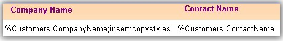
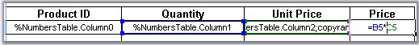
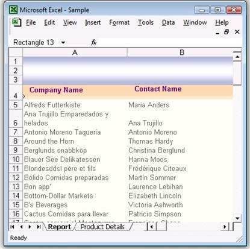
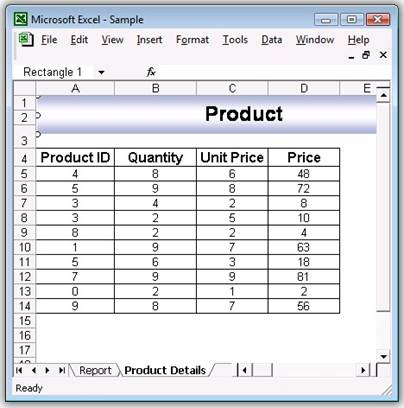

# How to Create Template Markers by using XlsIO

Report created in Excel provides ordered and rich look for large datasets. This article focuses on creating an Excel report by using template markers. A template marker is a special marker symbol created in an Excel template that binds the required user data. Essential XlsIO allows you to create and bind the template markers to data from various sources such as data table, variables, and arrays. This allows control of the data formats for the data bound to the template document.

## How does it Work?

Markers are applied in the template to the required cells. This includes the data source name and field name of interest. During data binding, a search is conducted for the data source name and the field name in the Excel workbook and the corresponding data from the data source is bound to the marker. Cells in the worksheet can be filled with a single data source or with multiple records. Format of these data can be changed by using the arguments of the markers.

## What is the Syntax of the Markers in Template?

Each marker starts with some prefix (by default, it is “%” character) and followed by the variable name and properties. There could be several arguments after a variable that are delimited by some character (by default, it is semicolon “;”.)

## What are the Various Sources of Binding Data to Markers?

Essential XlsIO allows data binding from following data sources.

1. DataSource

   This includes data tables, datasets, data readers, and data views. A data source can be used to bind large number records to the template document. This will add the rows for each record and fields to be bound are identified through the field name in the template.

   Syntax: %DataSource.FieldName

2. Variable Name

   This option allows you to bind a single data stored in a variable to the marker in the template.

   Syntax: %VariableName

3. Variable Array

   This option allows you to bind array of data stored in an array to the marker in the template.

   Syntax: %VariableArray

4. Formulas

This option allows you to create formulas for each row when multiple records comprising formula in the cells are bound to the marker. When a cell contains formula, by default, it is stretched to the rows/columns for any of the above sources of data binding.

 

## Various Arguments for the Marker:

The following arguments can be used with the marker to control the formatting while binding the data:

* Horizontal-This argument specifies the horizontal direction of the data import for complex variables.

* Vertical-This argument specifies the vertical direction of the data import for complex variables.

* Insert-This argument inserts new row or column depending on the direction argument for each new cell. By default, the rows cannot be added.

* Insert: copystyles-This argument copies style from the row above or left column.

* Jump: [cell reference in R1C1 notation]-This argument binds the data to the cell at the specified reference. Cell reference address can be relative or absolute.

* Copyrange: [top-left cell reference in R1C1]: [bottom-right cell reference in R1C1]-Copies the specified cells after each cell import.

The following code sample illustrates processing and binding the marker with data.




//Step 1: Instantiates the spreadsheet creation engine.
ExcelEngine excelEngine = new ExcelEngine();

//Step 2: Instantiates the excel application object.
IApplication application = excelEngine.Excel;
application.DefaultVersion = ExcelVersion.Excel2010;
 
IWorkbook workbook = application.Workbooks.Open("Sample.xlsx", ExcelOpenType.Automatic);
 
IWorksheet sheet = workbook.Worksheets[0];
 
//Creates marker processor.
ITemplateMarkersProcessor marker = workbook.CreateTemplateMarkersProcessor();
 
//Binds the data from the data table.
marker.AddVariable("Customers", northwindDt);
 
//Processes the markers in the template.
marker.ApplyMarkers();
 
string fileName = "Output.xlsx";
workbook.Version = ExcelVersion.Excel2010;
 
workbook.SaveAs(fileName);
 
// Closes the workbook.
workbook.Close();
excelEngine.Dispose();        





'Step 1: Instantiates the spreadsheet creation engine.
Dim excelEngine As ExcelEngine = New ExcelEngine
 
'Step 2: Instantiates the excel application object.
Dim application As IApplication = excelEngine.Excel
 
Dim workbook As IWorkbook = application.Workbooks.Open("sample.xlsx", ExcelOpenType.Automatic)
 
' Accesses via index.
Dim sheet As IWorkbook = workbook.Worksheets(0)
 
'Creates marker processor.
Dim marker As ITemplateMarkersProcessor = workbook.CreateTemplateMarkersProcessor()
 
'Binds the data from the data table.
marker.AddVariable("Customers", northwindDt)
 
'Processes the markers in the template.
marker.ApplyMarkers()
 
Dim fileName As String = "Output.xlsx"
workbook.SaveAs(fileName)
 
' Closes the workbook.
workbook.Close()
excelEngine.Dispose()



Here, CreateTemplateMarkerProcessor returns ITemplateMarkersProcessor interface that creates and manipulates the marker data. ApplyMarkers method of ITemplateMarkersProcessor is the special method that processes the markers in the template.

This screenshot illustrates binding data with marker variable.

The following screenshot is displayed after binding the data with the marker that retains the formula.

 

## Summary

This article demonstrates how Essential XlsIO can be used to generate rich reports in Excel format by using template markers. You can create and format user-specific information in a large report with few lines of coding and great performance.