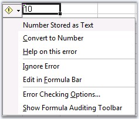

# How to ignore the green error marker in worksheets

You can ignore the error marker that appears in cells when there exists data that are of different formats. This can be done by using the ExcelIgnoreError enumerator that provides various options to ignore the error marker.


 


 //Step 1: Instantiates the spreadsheet creation engine.
ExcelEngine excelEngine = new ExcelEngine();

//Step 2: Instantiates the excel application object.
IApplication application = excelEngine.Excel;
application.DefaultVersion = ExcelVersion.Excel2010;
 
IWorkbook workbook = application.Workbooks.Open("Sample.xlsx", ExcelOpenType.Automatic);
 
IWorksheet sheet = workbook.Worksheets[0];
 
// Ignores Error Options.
sheet.Range["B3"].IgnoreErrorOptions = ExcelIgnoreError.All;
 
string fileName = "Output.xlsx";
workbook.Version = ExcelVersion.Excel2010;
 
workbook.SaveAs(fileName);
 
// Closes the workbook.
workbook.Close();
excelEngine.Dispose();            
    


 
 
'Step 1: Instantiates the spreadsheet creation engine.
Dim excelEngine As ExcelEngine = New ExcelEngine
 
'Step 2: Instantiates the excel application object.
Dim application As IApplication = excelEngine.Excel
 
Dim workbook As IWorkbook = application.Workbooks.Open("sample.xlsx", ExcelOpenType.Automatic)
 
'Accesses via index.
Dim sheet As IWorkbook = workbook.Worksheets(0)
 
'Ignores Error Options.
sheet.Range("B3").IgnoreErrorOptions = ExcelIgnoreError.All
 
Dim fileName As String = "Output.xlsx"
workbook.SaveAs(fileName)
 
' Closes the workbook.
workbook.Close()
excelEngine.Dispose()
 



