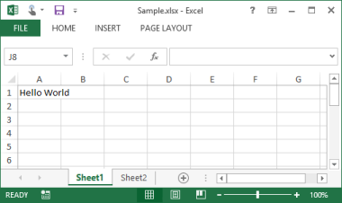
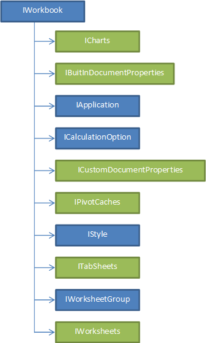
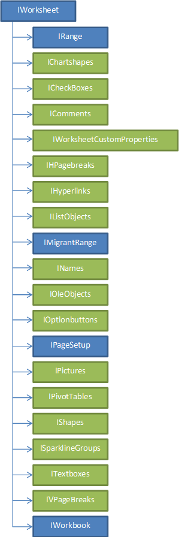
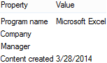

# Getting Started

Excel documents are called workbooks. Each workbook has one or more worksheets. This section helps you to create a new workbook with a text “HelloWorld” in different platforms.

For every platform, you must deploy the necessary dlls of Essential XlsIO to create a simple Excel document.

## Create a simple Excel document 

Creating a Console Application 

1. Open Microsoft Visual Studio. Go to File menu and click New Project. In the New Project dialog, select Console Application template, name the project and click OK.

2. Now you need to deploy Essential XlsIO into this Console application. 
3. Go to the Solution Explorer of the application you have created. Right-click the Reference folder and then click Add References to Essential XlsIO assemblies.
4. Add the following assemblies as references in the application.
1. Syncfusion.Core.dll
2. Syncfusion.Compression.Base.dll
3. Syncfusion.XlsIO.Base.dll

##Creating an Excel document

The following steps guide you to create a simple Excel document in Windows/WPF application.

1. Add the following C# code to import the Syncfusion.XlsIO namespace.



using Syncfusion.XlsIO;





Imports Syncfusion.XlsIO



2. Create an instance of XlsIO by using the following code.



// New instance of XlsIO is created [Equivalent to launching MS Excel with no workbooks open].

// Instantiates the spreadsheet creation engine.

ExcelEngine excelEngine = new ExcelEngine();





'New instance of XlsIO is created. [Equivalent to launching MS Excel with no workbooks open].

'Instantiates the spreadsheet creation engine.

Dim excelEngine As ExcelEngine = New ExcelEngine()


3. Create an instance of the Excel application through the IApplication interface.


// Instantiates the Excel application object.

IApplication application = excelEngine.Excel;

// Assigns default application version

application.DefaultVersion = ExcelVersion.Excel2013;





'Instantiates the Excel application object.

Dim application As IApplication = excelEngine.Excel

'Assigns default application version

application.DefaultVersion = ExcelVersion.Excel2013


4. Create a workbook. A newly created workbook has three worksheets by default. You can change the number of worksheets by using the Create method of IWorkBook as shown in the following code.


// A new workbook is created. [Equivalent to creating a new workbook in MS Excel).

// The new workbook will have 2 worksheets.

IWorkbook workbook = application.Workbooks.Create(2);




'A new workbook is created. [Equivalent to creating a new workbook in MS Excel].

'The new workbook will have 2 worksheets.

Dim workbook As IWorkbook = application.Workbooks.Create(2)



N> See Workbook and Worksheet for more details.

5. Access a worksheet in the workbook and set data for the given range, say "A1".



// The first worksheet object in the worksheets collection is accessed.

IWorksheet sheet = workbook.Worksheets[0];                        

// Inserts sample text into the first cell of the first worksheet.

sheet.Range["A1"].Text = "Hello World";




'The first worksheet object in the worksheets collection is accessed.

Dim sheet As IWorksheet = workbook.Worksheets(0)

'Inserts sample text into the first cell of the first worksheet.

sheet.Range("A1").Text = "Hello World"


6. Save and close the workbook.



// Assigns the workbook version.

workBook.Version = ExcelVersion.Excel2013;

// Saves the workbook to disk.

workbook.SaveAs("Sample.xlsx");

// Closes the workbook.

workbook.Close();




'Assigns the workbook version.

workBook.Version = ExcelVersion.Excel2013

'Saves the workbook to disk.

workbook.SaveAs("Sample.xlsx")

'Closes the workbook.

workbook.Close()


N> To know more about saving the workbook, see Save.

7. Dispose the Excel engine. Note that the engine should be disposed after completing workbook operations.



// Disposes the Excel engine.

excelEngine.Dispose();





'Disposes the Excel engine.

excelEngine.Dispose()



The following code example illustrates how to create a hello world document.


ExcelEngine excelEngine = new ExcelEngine();

IApplication application = excelEngine.Excel;

application.DefaultVersion = ExcelVersion.Excel2013;

IWorkbook workbook = application.Workbooks.Create(2);

IWorksheet sheet = workbook.Worksheets[0];                        

sheet.Range["A1"].Text = "Hello World";

workBook.Version = ExcelVersion.Excel2013;

workbook.SaveAs("Sample.xlsx");

workbook.Close();

excelEngine.Dispose();




Dim excelEngine As ExcelEngine = New ExcelEngine()

Dim application As IApplication = excelEngine.Excel

application.DefaultVersion = ExcelVersion.Excel2013

Dim workbook As IWorkbook = application.Workbooks.Create(2)

Dim sheet As IWorksheet = workbook.Worksheets(0)

sheet.Range("A1").Text = "Hello World"

workBook.Version = ExcelVersion.Excel2013

workbook.SaveAs("Sample.xlsx")

workbook.Close()

excelEngine.Dispose()



The following screenshot shows the Excel document generated by the above procedure.

## Object Model

The following screenshot illustrates the Object Model of Essential XlsIO.

_Object Model_

<table>
<tr>
<th>
Properties</th><th>
Description</th></tr>
<tr>
<td>
ExcelEngine</td><td>
This class gives access to the XlsIO IApplication interface.</td></tr>
<tr>
<td>
IApplication</td><td>
Represents the Excel application.</td></tr>
<tr>
<td>
IWorkbooks</td><td>
A collection of all the Workbook objects that are currently open in the Excel application.</td></tr>
<tr>
<td>
IWorkbook</td><td>
Represents an MS Excel Workbook.</td></tr>
<tr>
<td>
IWorksheets</td><td>
A collection of all the Worksheet objects in the specified or active workbook. Each Worksheet object represents a worksheet.</td></tr>
<tr>
<td>
IWorksheet</td><td>
RepresentsMS Exel worksheet.</td></tr>
</table>

The following screenshot illustrates the Object Model of XlsIO Workbook.

_Properties of XlsIO Workbook_

<table>
<tr>
<th>
Properties</th><th>
Description </th></tr>
<tr>
<td>
IWorkbook</td><td>
Represents an MS Excel Workbook.</td></tr>
<tr>
<td>
ICharts</td><td>
Represents a collection of charts.</td></tr>
<tr>
<td>
IBuiltInDocumentProperties</td><td>
Represents user interface for built-in document properties.</td></tr>
<tr>
<td>
IApplication</td><td>
Represents the Excel application.</td></tr>
<tr>
<td>
ICalculationOption</td><td>
Represents the MS Excel calculation options.</td></tr>
<tr>
<td>
ICustomDocumentProperties</td><td>
Represents collection of user defineded custom properties.</td></tr>
<tr>
<td>
IPivotCaches</td><td>
Represents collection of workbook pivot caches.</td></tr>
<tr>
<td>
IStyle</td><td>
Returns a Style object that represents the style of the specified range.</td></tr>
<tr>
<td>
ITabSheets</td><td>
A collection of all the Worksheet objects in the specified or active workbook. Each object represents a Tabsheet (Worksheet, ChartSheet or MacroSheet).</td></tr>
<tr>
<td>
IWorksheetGroup</td><td>
Represents a worksheet group.</td></tr>
<tr>
<td>
IWorksheets</td><td>
A collection of all the Worksheet objects in the specified or active workbook. Each Worksheet object represents a worksheet.</td></tr>
</table>

The following screenshot illustrates the Object Model of XlsIO Worksheet.

_Properties_

<table>
<tr>
<th>
Properties</th><th>
Description</th></tr>
<tr>
<td>
IWorksheet</td><td>
Represents an Excel Worksheet.</td></tr>
<tr>
<td>
IRange</td><td>
Represents a range of cells</td></tr>
<tr>
<td>
IChartShapes</td><td>
Represents a collection of embedded charts.</td></tr>
<tr>
<td>
ICheckBoxes</td><td>
This interface represents CheckBoxes collection inside single worksheet.</td></tr>
<tr>
<td>
IComments</td><td>
A collection of cell comments. Each comment is represented by a Comment object.</td></tr>
<tr>
<td>
IWorksheetCustomProperties</td><td>
Summary description for IWorksheetCustomProperties.</td></tr>
<tr>
<td>
IHPageBreaks</td><td>
The collection of horizontal page breaks within the print area. Each horizontal page break is represented by an HPageBreak object.</td></tr>
<tr>
<td>
IHyperlinks</td><td>
Represents collection of hyperlinks.</td></tr>
<tr>
<td>
IListObjects</td><td>
This interface represents collection of ListObjects in a worksheet.</td></tr>
<tr>
<td>
IMigrantRange</td><td>
Represents range object for a single cell. Coordinates of such object can be changed. There should be only one such object for single worksheet.</td></tr>
<tr>
<td>
INames</td><td>
A collection of all the Name objects in the application or workbook. Each Name object represents a defined name for a range of cells.</td></tr>
<tr>
<td>
IOleObjects</td><td>
Represents collection of Ole objects</td></tr>
<tr>
<td>
IOptionButtons</td><td>
This interface represents OptionButton collection inside single worksheet.</td></tr>
<tr>
<td>
IPageSetup</td><td>
Represents the page setup description. The PageSetup object contains all page setup attributes (left margin, bottom margin, paper size, and so on) as properties.</td></tr>
<tr>
<td>
IPictures</td><td>
Represents a collection of pictures in a worksheet.. </td></tr>
<tr>
<td>
IPivotTables</td><td>
Represents collection of all pivot tables inside worksheet.</td></tr>
<tr>
<td>
IShapes</td><td>
Represents shapes collection in the workbook.</td></tr>
<tr>
<td>
ISparklineGroups</td><td>
Represents collection of Sparkline group</td></tr>
<tr>
<td>
ITextboxes</td><td>
This interface represents TextBoxes collection inside single worksheet.</td></tr>
<tr>
<td>
IVPageBreaks</td><td>
A collection of vertical page breaks within the print area. Each vertical page break is represented by a VPageBreak object.</td></tr>
<tr>
<td>
IWorkbook</td><td>
Represents an MS Excel Workbook.</td></tr>
</table>

## Supported Features and File Formats

This section covers various features of Essential XlsIO, list of various supported and non-supported Excel elements of Essential XlsIO in various platforms and supported file formats of Essential XlsIO.

###Key Features

<table>
<tr>
<td>
{{ '' | markdownify}}

</td><td>
Formatting Essential XlsIO provides various formatting options like setting fonts, alignment of content, number formatting, border settings, and color-fill settings. It also supports various styles for cells and conditional formatting options.</td></tr>
<tr>
<td>
{{ '' | markdownify}}

</td><td>
Editing It supports range manipulations like copying a range, moving a range, and so on, and Find and Replace option as part of editing the document.</td></tr>
<tr>
<td>
{{ '' | markdownify}}

</td><td>
Insert Various components like chart, pictures, tables, pivot tables, pivot charts, and auto shapes can be inserted into the document. It also provides support for insertion of controls like text boxes, check boxes, combo boxes, and links.</td></tr>
<tr>
<td>
{{ '' | markdownify}}

</td><td>
Page Setup It provides support for page setup options like margin setup, orientation, paper size, page breaks, header and footer options. It also supports several print settings.</td></tr>
<tr>
<td>
{{ '' | markdownify}}

</td><td>
Formula It provides extensive support for using formulae in cells and calculations are done based on formula function library with outstanding calculation engine.</td></tr>
<tr>
<td>
{{ '' | markdownify}}

</td><td>
Data It provides support for data validation, import/export of data, data filter, template markers for efficient data-handling, and external connection. </td></tr>
<tr>
<td>
{{ '' | markdownify}}

</td><td>
Comments Comments can be inserted to any cell in Excel document by using Essential XlsIO review support.</td></tr>
<tr>
<td>
{{ '' | markdownify}}

</td><td>
Protection Three levels of protections are provided by Essential XlsIO.1. Workbook-level protection, 2. Worksheet-level protection and 3. Cell-level protection.  It also provides encryption and decryption methodology to ensure security of a document.</td></tr>
<tr>
<td>
{{ '' | markdownify}}

</td><td>
View Several customizing options like freezing pane, split pane, zooming, and macros are supported.</td></tr>
<tr>
<td>
{{ '' | markdownify}}

</td><td>
Document Properties It provides support for viewing and modifying properties of a document like Title, Company, Author, Manager, Keywords, and so on.</td></tr>
<tr>
<td>
{{ '' | markdownify}}

</td><td>
Add-Ins Several add-ins for Microsoft Excel are provided.</td></tr>
</table>

###File Formats

Essential XlsIO supports the following file formats.

* *.xls
* *.xlt
* *.xlsx
* *.xltx
* *.xltm
* *.xlsm
* *.csv
* *.txt
* *.html
* *.xml (SpreadsheetML)

### Supported and Non-Supported Elements

The list of various supported and non-supported Excel elements of Essential XlsIO for different platforms is given in the following table. XLS represents Excel 97 to 2003 format and XLSX represents Excel 2007 and above formats.

_Supported and non-supported elements_

<table>
<tr>
<th rowspan = "2">
Elements</th><th colspan = "3">
xls</th><th colspan = "3">
xlsx</th><th rowspan = "2">
xls to xlsx</th></tr>
<tr>
<th>
Read</th><th>
Write</th><th>
Preserve</th><th>
Read</th><th>
Write</th><th>
Preserve</th></tr>
<tr>
<td>
Document Properties</td><td>
Yes </td><td>
Yes</td><td>
-</td><td>
Yes</td><td>
Yes</td><td>
-</td><td>
Yes</td></tr>
<tr>
<td>
Font settings</td><td>
Yes</td><td>
Yes</td><td>
-</td><td>
Yes</td><td>
Yes</td><td>
-</td><td>
Yes</td></tr>
<tr>
<td>
Alignments</td><td>
Yes</td><td>
Yes</td><td>
-</td><td>
Yes</td><td>
Yes</td><td>
-</td><td>
Yes</td></tr>
<tr>
<td>
Number formatting</td><td>
Yes</td><td>
Yes</td><td>
-</td><td>
Yes</td><td>
Yes</td><td>
-</td><td>
Yes</td></tr>
<tr>
<td>
Border settings</td><td>
Yes</td><td>
Yes</td><td>
-</td><td>
Yes</td><td>
Yes</td><td>
-</td><td>
Yes</td></tr>
<tr>
<td>
Fill settings</td><td>
Yes</td><td>
Yes</td><td>
-</td><td>
Yes</td><td>
Yes</td><td>
-</td><td>
Yes</td></tr>
<tr>
<td>
Cell styles</td><td>
Yes</td><td>
Yes</td><td>
-</td><td>
Yes</td><td>
Yes</td><td>
-</td><td>
Yes</td></tr>
<tr>
<td>
Conditional formatting</td><td>
Yes</td><td>
Yes</td><td>
-</td><td>
Yes</td><td>
Yes</td><td>
-</td><td>
Yes</td></tr>
<tr>
<td>
Cell size[Row/column height/width, autofit]</td><td>
Yes</td><td>
Yes</td><td>
-</td><td>
Yes</td><td>
Yes</td><td>
-</td><td>
Yes</td></tr>
<tr>
<td>
Hide/unhide rows/cols</td><td>
Yes</td><td>
Yes</td><td>
-</td><td>
Yes</td><td>
Yes</td><td>
-</td><td>
Yes</td></tr>
<tr>
<td>
Hide/Unhide worksheet</td><td>
Yes</td><td>
Yes</td><td>
-</td><td>
Yes</td><td>
Yes</td><td>
-</td><td>
Yes</td></tr>
<tr>
<td>
Copy/Move worksheet</td><td>
Yes</td><td>
Yes</td><td>
-</td><td>
Yes</td><td>
Yes</td><td>
-</td><td>
-</td></tr>
<tr>
<td>
Sheet protection</td><td>
Yes</td><td>
Yes</td><td>
-</td><td>
Yes</td><td>
Yes</td><td>
-</td><td>
Yes</td></tr>
<tr>
<td>
Workbook protection</td><td>
Yes</td><td>
Yes</td><td>
-</td><td>
Yes</td><td>
Yes</td><td>
-</td><td>
Yes</td></tr>
<tr>
<td>
Sheet format[sheet name, tab color]</td><td>
Yes</td><td>
Yes</td><td>
-</td><td>
Yes</td><td>
Yes</td><td>
-</td><td>
Yes</td></tr>
<tr>
<td>
Image</td><td>
Yes</td><td>
Yes</td><td>
-</td><td>
Yes</td><td>
Yes</td><td>
-</td><td>
Yes</td></tr>
<tr>
<td>
Charts</td><td>
Yes</td><td>
Yes</td><td>
-</td><td>
Yes</td><td>
Yes</td><td>
-</td><td>
Yes</td></tr>
<tr>
<td>
Hyperlinks</td><td>
Yes</td><td>
Yes</td><td>
-</td><td>
Yes</td><td>
Yes</td><td>
-</td><td>
Yes</td></tr>
<tr>
<td>
Header/Footer</td><td>
Yes</td><td>
Yes</td><td>
-</td><td>
Yes</td><td>
Yes</td><td>
-</td><td>
Yes</td></tr>
<tr>
<td>
Pivot tables</td><td>
No</td><td>
No</td><td>
Yes</td><td>
Yes</td><td>
Yes</td><td>
-</td><td>
No</td></tr>
<tr>
<td>
Pivot Chart</td><td>
No</td><td>
No</td><td>
Yes</td><td>
Yes</td><td>
Yes</td><td>
-</td><td>
No</td></tr>
<tr>
<td>
Auto Shapes</td><td>
No</td><td>
No</td><td>
Yes</td><td>
Yes</td><td>
Yes</td><td>
-</td><td>
No</td></tr>
<tr>
<td>
Text Box</td><td>
Yes</td><td>
Yes</td><td>
-</td><td>
Yes</td><td>
Yes</td><td>
-</td><td>
Yes</td></tr>
<tr>
<td>
Check Box</td><td>
Yes</td><td>
Yes</td><td>
-</td><td>
Yes</td><td>
Yes</td><td>
-</td><td>
Yes</td></tr>
<tr>
<td>
Combo Box</td><td>
Yes</td><td>
Yes</td><td>
-</td><td>
Yes</td><td>
Yes</td><td>
-</td><td>
Yes</td></tr>
<tr>
<td>
Page setup[Margin,origin,page size]</td><td>
Yes</td><td>
Yes</td><td>
-</td><td>
Yes</td><td>
Yes</td><td>
-</td><td>
Yes</td></tr>
<tr>
<td>
Page breaks</td><td>
Yes</td><td>
Yes</td><td>
-</td><td>
Yes</td><td>
Yes</td><td>
-</td><td>
Yes</td></tr>
<tr>
<td>
Background image</td><td>
Yes</td><td>
Yes</td><td>
-</td><td>
Yes</td><td>
Yes</td><td>
-</td><td>
Yes</td></tr>
<tr>
<td>
Print settings[Print area,Print titles,page order]</td><td>
Yes</td><td>
Yes</td><td>
-</td><td>
Yes</td><td>
Yes</td><td>
-</td><td>
Yes</td></tr>
<tr>
<td>
Formulas</td><td>
Yes</td><td>
Yes</td><td>
-</td><td>
Yes</td><td>
Yes</td><td>
-</td><td>
Yes</td></tr>
<tr>
<td>
Calculation options</td><td>
Yes</td><td>
Yes</td><td>
-</td><td>
Yes</td><td>
Yes</td><td>
-</td><td>
Yes</td></tr>
<tr>
<td>
Names</td><td>
Yes</td><td>
Yes</td><td>
-</td><td>
Yes</td><td>
Yes</td><td>
-</td><td>
Yes</td></tr>
<tr>
<td>
Formula auditing [ Ignore error ]</td><td>
Yes</td><td>
Yes</td><td>
-</td><td>
Yes</td><td>
Yes</td><td>
-</td><td>
Yes</td></tr>
<tr>
<td>
Autofilter</td><td>
Yes</td><td>
Yes</td><td>
-</td><td>
Yes</td><td>
Yes</td><td>
-</td><td>
Yes</td></tr>
<tr>
<td>
Data validation</td><td>
Yes</td><td>
Yes</td><td>
-</td><td>
Yes</td><td>
Yes</td><td>
-</td><td>
Yes</td></tr>
<tr>
<td>
Custom XML</td><td>
Yes</td><td>
Yes</td><td>
-</td><td>
Yes</td><td>
Yes</td><td>
-</td><td>
Yes</td></tr>
<tr>
<td>
Business Objects</td><td>
Yes</td><td>
Yes</td><td>
-</td><td>
Yes</td><td>
Yes</td><td>
-</td><td>
Yes</td></tr>
<tr>
<td>
Template marker</td><td>
Yes</td><td>
Yes</td><td>
-</td><td>
Yes</td><td>
Yes</td><td>
-</td><td>
Yes</td></tr>
<tr>
<td>
Outlines[group/ungroup, summary settings]</td><td>
Yes</td><td>
Yes</td><td>
-</td><td>
Yes</td><td>
Yes</td><td>
-</td><td>
Yes</td></tr>
<tr>
<td>
Comments</td><td>
Yes</td><td>
Yes</td><td>
-</td><td>
Yespartial</td><td>
Yespartial</td><td>
-</td><td>
Yes</td></tr>
<tr>
<td>
Freeze pane, split pane</td><td>
Yes</td><td>
Yes</td><td>
-</td><td>
Yes</td><td>
Yes</td><td>
-</td><td>
Yes</td></tr>
<tr>
<td>
View[Zoom,show/hide gridline,show/hide headings], horizontal/vertical scroll bars</td><td>
Yes</td><td>
Yes</td><td>
-</td><td>
Yes</td><td>
Yes</td><td>
-</td><td>
Yes</td></tr>
<tr>
<td>
Macros</td><td>
No</td><td>
No</td><td>
Yes</td><td>
No</td><td>
No</td><td>
Yes</td><td>
No</td></tr>
<tr>
<td>
Encryption and Decryption(partial – just default algorithm)</td><td>
Yes</td><td>
Yes</td><td>
-</td><td>
Yes</td><td>
Yes</td><td>
-</td><td>
Yes </td></tr>
<tr>
<td>
Track changes</td><td>
No</td><td>
No</td><td>
No</td><td>
No</td><td>
No</td><td>
No</td><td>
No</td></tr>
<tr>
<td>
Themes</td><td>
-</td><td>
-</td><td>
-</td><td>
Yespartial</td><td>
No</td><td>
-</td><td>
-</td></tr>
<tr>
<td>
Cell gradient</td><td>
-</td><td>
-</td><td>
-</td><td>
Yes</td><td>
Yes</td><td>
-</td><td>
-</td></tr>
<tr>
<td>
Conditional Formatting</td><td>
Yes</td><td>
Yes</td><td>
-</td><td>
Yes</td><td>
Yes</td><td>
-</td><td>
Yes</td></tr>
<tr>
<td>
Advanced CF [Icon Set,Databars,Color scales,Specific Date]</td><td>
-</td><td>
-</td><td>
-</td><td>
Yes</td><td>
Yes</td><td>
-</td><td>
-</td></tr>
<tr>
<td>
Tables</td><td>
No</td><td>
No</td><td>
No</td><td>
Yes</td><td>
Yes</td><td>
-</td><td>
No</td></tr>
<tr>
<td>
RGB colors </td><td>
Yes</td><td>
Yes</td><td>
Indexed color</td><td>
Yes</td><td>
Yes</td><td>
-</td><td>
Yes</td></tr>
<tr>
<td>
OLE Objects</td><td>
No</td><td>
No</td><td>
Yes (Full Trust Only)</td><td>
Yes (Full Trust Only)</td><td>
Yes (Full Trust Only)</td><td>
-</td><td>
No</td></tr>
</table>

