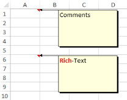

# Insert Comments 

Microsoft Excel has the ability to insert comments in cells. Comments give additional information about a cell, such as, what the value represents. You can insert and format comments through the Insert menu in Excel. You can also format the comments inserted through the Format Comment dialog box.

{{ '' | markdownify }}
{:.image }

XlsIO has APIs for inserting both Regular and Rich Text comments by using the ICommentShape interface. It has various properties to format the comments. The following code example illustrates how to insert comments.

[C#]

// Step 1: Instantiates the spreadsheet creation engine.

ExcelEngine excelEngine = new ExcelEngine();

// Step 2: Instantiates the excel application object.

IApplication application = excelEngine.Excel;

// A new workbook is created. [Equivalent to creating a new workbook in MS Excel).

// The new workbook will have 2 worksheets.

IWorkbook workbook = application.Workbooks.Create(2);

IWorksheet sheet = workbook.Worksheets[0];

// Inserts Comments.

// Adds comments to a cell.

sheet.Range["A1"].AddComment().Text = "Comments";

// Adds Rich Text Comments.

IRange range = sheet.Range["A2"];

range.AddComment().RichText.Text = "RichText";

IRichTextString rtf = range.Comment.RichText;

// Formats first 4 characters.

IFont redFont = workbook.CreateFont();

redFont.Bold = true;

redFont.Color = ExcelKnownColors.Red;

rtf.SetFont(0, 3, redFont);

string fileName = "Output.xlsx";

workbook.Version = ExcelVersion.Excel2010;

workbook.SaveAs(fileName);

//Closes the workbook.

workbook.Close();

excelEngine.Dispose();         

[VB.NET]

' Step 1: Instantiates the spreadsheet creation engine.

Dim excelEngine As ExcelEngine = New ExcelEngine

' Step 2: Instantiates the excel application object.

Dim application As IApplication = excelEngine.Excel

' A new workbook is created. [Equivalent to creating a new workbook in MS Excel].

'The new workbook will have 2 worksheets.

Dim workbook As IWorkbook = application.Workbooks.Create(2)

' Accesses via index.

Dim sheet As IWorkbook = workbook.Worksheets(0)

' Inserts Comments.

' Adds comments to a cell.

sheet.Range("A1").AddComment().Text= "Comments"

' Adds Rich Text Comments.

Dim range As IRange = sheet.Range("A6")

range.AddComment().RichText.Text = "Rich-Text"

Dim rtf As IRichTextString = range.Comment.RichText

'Formats first 4 characters.

Dim redFont As IFont = workbook.CreateFont()

redFont.Bold = True

redFont.Color = ExcelKnownColors.Red

rtf.SetFont(0, 3, redFont)

Dim fileName As String = "Output.xlsx"

workbook.Version = ExcelVersion.Excel2010

workbook.SaveAs(fileName)

'Closes the workbook.

workbook.Close()

excelEngine.Dispose()

{{ '' | markdownify }}
{:.image }

It is also possible to read theRich Text string formatting. The following code example illustrates how rich text comments from a cell are read by using XlsIO and then displayed in a RichTextBox.

[C#]

// Step 1: Instantiates the spreadsheet creation engine.

ExcelEngine excelEngine = new ExcelEngine();

// Step 2: Instantiates the excel application object.

IApplication application = excelEngine.Excel;

// A new workbook is created. [Equivalent to creating a new workbook in MS Excel).

// The new workbook will have 2 worksheets.

IWorkbook workbook = application.Workbooks.Open("Sample.xlsx", ExcelOpenType.Automatic);

IWorksheet sheet = workbook.Worksheets[0];

//Reads plain text comment. 

this.txtPlainText.Text = sheet.Range["A1"].Comment.Text;

//Reads rich text comment.

this.richTextBox1.Rtf = sheet.Range["A6"].Comment.RichText.RtfText; 

string fileName = "Output.xlsx";

workbook.Version = ExcelVersion.Excel2010;

workbook.SaveAs(fileName);

//Closes the workbook.

workbook.Close();

excelEngine.Dispose();         

[VB.NET]

' Step 1: Instantiates the spreadsheet creation engine.

Dim excelEngine As ExcelEngine = New ExcelEngine

' Step 2: Instantiates the excel application object.

Dim application As IApplication = excelEngine.Excel

' A new workbook is created. [Equivalent to creating a new workbook in MS Excel].

'The new workbook will have 2 worksheets.

Dim workbook As IWorkbook = application.Workbooks.Open("Sample.xlsx", ExcelOpenType.Automatic)

'Accesses via index.

Dim sheet As IWorkbook = workbook.Worksheets(0)

'Reads plain text comment. 

Me.txtPlainText.Text = sheet.Range("A1").Comment.Text

'Reads rich text comment.

Me.richTextBox1.Rtf =sheet.Range("A6").Comment.RichText.RtfText 

Dim fileName As String = "Output.xlsx"

workbook.SaveAs(fileName)

'Closes the workbook.

workbook.Close()

excelEngine.Dispose()

You can also fill the comments with various types of fills by using the IFill interface. The following code example illustrates how to fill the comment shape with a TwoColor gradient.

[C#]

// Step 1: Instantiates the spreadsheet creation engine.

ExcelEngine excelEngine = new ExcelEngine();

// Step 2: Instantiates the excel application object.

IApplication application = excelEngine.Excel;

// A new workbook is created. [Equivalent to creating a new workbook in MS Excel).

// The new workbook will have 2 worksheets.

IWorkbook workbook = application.Workbooks.Open("Sample.xlsx", ExcelOpenType.Automatic);

IWorksheet sheet = workbook.Worksheets[0];

ICommentShape shape = sheet.Range["A1"].Comment;

shape.Fill.TwoColorGradient();

shape.Fill.GradientStyle = ExcelGradientStyle.Horizontal;

shape.Fill.GradientColorType = ExcelGradientColor.TwoColor;

shape.Fill.ForeColorIndex = ExcelKnownColors.Red;

shape.Fill.BackColorIndex = ExcelKnownColors.White;  

string fileName = "Output.xlsx";

workbook.Version = ExcelVersion.Excel2010;

workbook.SaveAs(fileName);

// Closes the workbook.

workbook.Close();

excelEngine.Dispose();                  

[VB.NET]

' Step 1: Instantiates the spreadsheet creation engine.

Dim excelEngine As ExcelEngine = New ExcelEngine

' Step 2: Instantiates the excel application object.

Dim application As IApplication = excelEngine.Excel

' A new workbook is created. [Equivalent to creating a new workbook in MS Excel].

'The new workbook will have 2 worksheets.

Dim workbook As IWorkbook = application.Workbooks.Open("Sample.xlsx", ExcelOpenType.Automatic)

' Accesses via index.

Dim sheet As IWorkbook = workbook.Worksheets(0)

Dim shape As ICommentShape = sheet.Range["A1"].Comment

shape.Fill.TwoColorGradient()

shape.Fill.GradientStyle = ExcelGradientStyle.Horizontal

shape.Fill.GradientColorType = ExcelGradientColor.TwoColor

shape.Fill.ForeColorIndex = ExcelKnownColors.Red

shape.Fill.BackColorIndex = ExcelKnownColors.White

Dim fileName As String = "Output.xlsx"

workbook.Version = ExcelVersion.Excel2010

workbook.SaveAs(fileName)

' Closes the workbook.

workbook.Close()

excelEngine.Dispose()

XlsIO also provides options to resize the comment size and move/size with cell by using the IsMoveWithCell and IsSizeWithCell properties. You can also autofit the size of the comment by using the AutoFit property.

> _Note: Currently it is not possible to insert preformatted RTF tags in Excel by using XlsIO._

