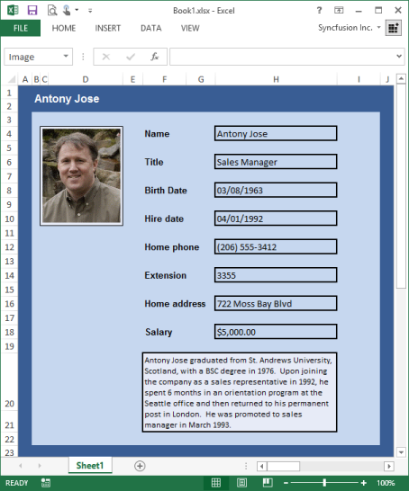

# Insert Pictures 

Excel allows you to insert a picture through the Insert tab -> Illustrations section,and then clicking Pictures button. It allows you to customize the image by sizing, formatting, and positioning the image.

{{ '' | markdownify }}
{:.image }

Essential XlsIO has advanced API support for working with images. It supports the insertion of Scalar and Vector images in a worksheet. It is also possible to position and set the properties for the image at the desired location. IPictureShape is used for inserting and formatting pictures.

[C#]

// Step 1: Instantiates the spreadsheet creation engine.

ExcelEngine excelEngine = new ExcelEngine();

// Step 2: Instantiates the excel application object.

IApplication application = excelEngine.Excel;

// A new workbook is created. [Equivalent to creating a new workbook in MS Excel).

// The new workbook will have 2 worksheets.

IWorkbook workbook = application.Workbooks.Create(2);

IWorksheet sheet = workbook.Worksheets[0];

//Inserts image.

IPictureShape shape = sheet.Pictures.AddPicture(1, 1, "Sample.jpg");

shape.Top = 1157;

shape.Height = 808;

shape.Left = 1417;

shape.Width = 1121;

string fileName = "Output.xlsx";

workbook.Version = ExcelVersion.Excel2010;

workbook.SaveAs(fileName);

//Closes the workbook.

workbook.Close();

excelEngine.Dispose();         

[VB.NET]

' Step 1: Instantiates the spreadsheet creation engine.

Dim excelEngine As ExcelEngine = New ExcelEngine

' Step 2: Instantiates the excel application object.

Dim application As IApplication = excelEngine.Excel

' A new workbook is created. [Equivalent to creating a new workbook in MS Excel].

'The new workbook will have 2 worksheets.

Dim workbook As IWorkbook = application.Workbooks.Create(2)

' Accesses via index.

Dim sheet As IWorkbook = workbook.Worksheets(0)

'Inserts image.

Dim shape As IPictureShape = sheet.Pictures.AddPicture(1, 1, "Sample.jpg")

shape.Top = 1157

shape.Height = 808

shape.Left = 1417

shape.Width = 1121

Dim fileName As String = "Output.xlsx"

workbook.Version = ExcelVersion.Excel2010

workbook.SaveAs(fileName)

'Closes the workbook.

workbook.Close()

excelEngine.Dispose()

{{ '' | markdownify }}
{:.image }

Barcodes and Charts can also be inserted in a spreadsheet by using XlsIO's Image Insertion API's. The barcode/chart is rendered to an image by using the Essential Barcode/ Essential Chart and then inserted into the spreadsheet as an image. XlsIO can also extract images from an existing spreadsheet.

[C#]

// Step 1: Instantiates the spreadsheet creation engine.

ExcelEngine excelEngine = new ExcelEngine();

// Step 2: Instantiates the excel application object.

IApplication application = excelEngine.Excel;

// A new workbook is created. [Equivalent to creating a new workbook in MS Excel).

// The new workbook will have 2 worksheets.

IWorkbook workbook = application.Workbooks.Open("Sample.xlsx", ExcelOpenType.Automatic);

IWorksheet sheet = workbook.Worksheets[0];

// Reads Image.

this.pictureBox1.Image = sheet.Pictures[0].Picture;

string fileName = "Output.xlsx";

workbook.Version = ExcelVersion.Excel2010;

workbook.SaveAs(fileName);

//Closes the workbook.

workbook.Close();

excelEngine.Dispose();         

[VB.NET]

' Step 1: Instantiates the spreadsheet creation engine.

Dim excelEngine As ExcelEngine = New ExcelEngine

' Step 2: Instantiates the excel application object.

Dim application As IApplication = excelEngine.Excel

' A new workbook is created. [Equivalent to creating a new workbook in MS Excel].

'The new workbook will have 2 worksheets.

Dim workbook As IWorkbook = application.Workbooks.Open("Sample.xlsx", ExcelOpenType.Automatic)

' Accesses via index.

Dim sheet As IWorkbook = workbook.Worksheets(0)

' Reads Image.

Me.pictureBox1.Image = sheet.Pictures(0).Picture 

Dim fileName As String = "Output.xlsx"

workbook.Version = ExcelVersion.Excel2010

workbook.SaveAs(fileName)

' Closes the workbook.

workbook.Close()

excelEngine.Dispose()

