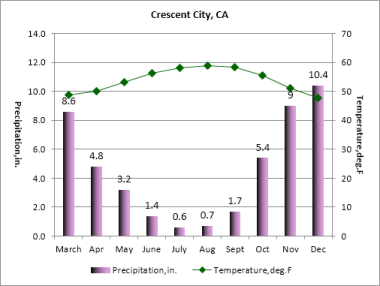
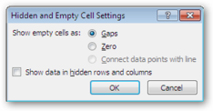

# Working with Charts 

This section explains the usage of the Essential XlsIO's Chart APIs.

Charts can convey much more than numbers and makes it easier to see the meaning behind the numbers. Essential XlsIO has advanced support for creating and modifying Excel charts inside a workbook. There is an option to choose between creating an Embedded Chart (chart is embedded inside a worksheet) or a Chart Worksheet (chart is a separate worksheet).

## Create a Chart 

Essential XlsIO has APIs for creating an embedded chart. The IChartShape interface represents the embedded chart's in-memory, and this object can be used to format and modify the chart settings for chart area, plot area, and chart title area, with gradient, texture, patterns and pictures. A chart in XlsIO can be created either through the Data Range of the chart or by adding series one by one. The following code example illustrates how to create a chart through the Data Range.



// Step 1: Instantiates the spreadsheet creation engine.

ExcelEngine excelEngine = new ExcelEngine();

// Step 2: Instantiates the excel application object.

IApplication application = excelEngine.Excel;

// A new workbook is created. [Equivalent to creating a new workbook in MS Excel).

// The new workbook will have 2 worksheets.

IWorkbook workbook = application.Workbooks.Open("Sample.xlsx", ExcelOpenType.Automatic)

;

IWorksheet sheet = workbook.Worksheets[0];

//Creates a Chart.

IChartShape chart = sheet.Charts.Add();

//Sets Chart Type.

chart.ChartType = ExcelChartType.Column_Clustered;

//Sets Data Range.

chart.DataRange = sheet.Range["A1:E5"];

string fileName = "Output.xlsx";

workbook.Version = ExcelVersion.Excel2010;

workbook.SaveAs(fileName);

// Closes the workbook.

workbook.Close();

excelEngine.Dispose();         




' Step 1: Instantiates the spreadsheet creation engine.

Dim excelEngine As ExcelEngine = New ExcelEngine

' Step 2: Instantiates the excel application object.

Dim application As IApplication = excelEngine.Excel

' A new workbook is created. [Equivalent to creating a new workbook in MS Excel].

'The new workbook will have 2 worksheets.

Dim workbook As IWorkbook = application.Workbooks.Open("Sample.xlsx", ExcelOpenType.Automatic)

'Accesses via index.

Dim sheet As IWorkbook = workbook.Worksheets(0)

'Creates a Chart.

Dim chart As IChartShape = sheet.Charts.Add()

'Sets Chart Type.

chart.ChartType = ExcelChartType.Column_Clustered

'Sets Data Range.

chart.DataRange = sheet.Range("A1:E5")

Dim fileName As String = "Output.xlsx"

workbook.Version = ExcelVersion.Excel2010

workbook.SaveAs(fileName)

'Closes the workbook.

workbook.Close()

excelEngine.Dispose()


## Supported Chart Types 

The following Chart types are supported in XlsIO.

* Area
* Area_3D
* Area_Stacked
* Area_Stacked_100
* Area_Stacked_100_3D
* Area_Stacked_3D
* Bar_Clustered
* Bar_Clustered_3D
* Bar_Stacked
* Bar_Stacked_100
* Bar_Stacked_100_3D
* Bar_Stacked_3D
* Bubble
* Bubble_3D
* Column_3D
* Column_Clustered
* Column_Clustered_3D
* Column_Stacked
* Column_Stacked_100
* Column_Stacked_100_3D
* Column_Stacked_3D
* Combination_Chart
* Cone_Bar_Clustered
* Cone_Bar_Stacked
* Cone_Bar_Stacked_100
* Cone_Clustered
* Cone_Clustered_3D
* Cone_Stacked
* Cone_Stacked_100
* Cylinder_Bar_Clustered
* Cylinder_Bar_Stacked
* Cylinder_Bar_Stacked_100
* Cylinder_Clustered
* Cylinder_Clustered_3D
* Cylinder_Stacked
* Cylinder_Stacked_100
* Doughnut
* Doughnut_Exploded
* Line
* Line_3D
* Line_Markers
* Line_Markers_Stacked
* Line_Markers_Stacked_100
* Line_Stacked
* Line_Stacked_100
* Pie
* Pie_3D
* Pie_Bar
* Pie_Exploded
* Pie_Exploded_3D
* PieOfPie
* Pyramid_Bar_Clustered
* Pyramid_Bar_Stacked
* Pyramid_Bar_Stacked_100
* Pyramid_Clustered
* Pyramid_Clustered_3D
* Pyramid_Stacked
* Pyramid_Stacked_100
* Radar
* Radar_Filled
* Radar_Markers
* Scatter_Line
* Scatter_Line_Markers
* Scatter_Markers
* Scatter_SmoothedLine
* Scatter_SmoothedLine_Markers
* Stock_HighLowClose
* Stock_OpenHighLowClose
* Stock_VolumeHighLowClose
* Stock_VolumeOpenHighLowClose
* Surface_3D
* Surface_Contour
* Surface_NoColor_3D
* Surface_NoColor_Contour

## Chart Appearance Settings 

The appearance of a chart can be modified according to the convenience and usage. These appearance includes, Chart Area, Chart Title, Plot Area, Borders, Axis Settings, DataLabel settings, etc.



// Step 1: Instantiates the spreadsheet creation engine.

ExcelEngine excelEngine = new ExcelEngine();

// Step 2: Instantiates the excel application object.

IApplication application = excelEngine.Excel;

// A new workbook is created. [Equivalent to creating a new workbook in MS Excel).

// The new workbook will have 2 worksheets.

IWorkbook workbook = application.Workbooks.Open("Sample.xlsx", ExcelOpenType.Automatic);

IWorksheet sheet = workbook.Worksheets[0];

//Creates a Chart.

IChartShape chart = sheet.Charts.Add();

chart.DataRange = sheet.UsedRange;

//Chart Title.

chart.ChartTitle = "Sales Comparison";

//X-axis title.

chart.PrimaryCategoryAxis.Title = "Fruit Types";

//Y-axis title.

chart.PrimaryValueAxis.Title = "Months";

//Shows Data Table.

chart.HasDataTable = true;

//Formats Chart Area.

IChartFrameFormat chartArea = chart.ChartArea;

//Chart Area Border Settings.

//Style.

chartArea.Border.LinePattern = ExcelChartLinePattern.Solid;

//Color.

chartArea.Border.LineColor = Color.Blue;                        

//Weight.

chartArea.Border.LineWeight  = ExcelChartLineWeight.Hairline;

//Chart Area Settings.

//Fill Effects

chartArea.Fill.FillType = ExcelFillType.Gradient;

//Two Color.

chartArea.Fill.GradientColorType = ExcelGradientColor.TwoColor;

//Sets two colors.

chartArea.Fill.BackColor = Color.FromArgb(205,217,234);

chartArea.Fill.ForeColor = Color.White;

//Plot Area.

IChartFrameFormat  chartPlotArea = chart.PlotArea;

//Plot Area Border Settings.

//Style.

chartPlotArea.Border.LinePattern = ExcelChartLinePattern.Solid;

//Color.

chartPlotArea.Border.LineColor = Color.Blue;                                        

//Weight.

chartPlotArea.Border.LineWeight  = ExcelChartLineWeight.Hairline;

//Fill Effects.

chartPlotArea.Fill.FillType = ExcelFillType.Gradient;

//Two Color.

chartPlotArea.Fill.GradientColorType = ExcelGradientColor.TwoColor;

//Set two colors.

chartPlotArea.Fill.BackColor = Color.FromArgb(205,217,234);

chartPlotArea.Fill.ForeColor = Color.White;

string fileName = "Output.xlsx";

workbook.Version = ExcelVersion.Excel2010;

workbook.SaveAs(fileName);

// Closes the workbook.

workbook.Close();

excelEngine.Dispose();         




' Step 1: Instantiates the spreadsheet creation engine.

Dim excelEngine As ExcelEngine = New ExcelEngine

' Step 2: Instantiates the excel application object.

Dim application As IApplication = excelEngine.Excel

' A new workbook is created. [Equivalent to creating a new workbook in MS Excel].

'The new workbook will have 2 worksheets.

Dim workbook As IWorkbook = application.Workbooks.Open("Sample.xlsx", ExcelOpenType.Automatic)

'Accesses via index.

Dim sheet As IWorkbook = workbook.Worksheets(0)

'Creates a Chart.

Dim chart As IChartShape = sheet.Charts.Add()

chart.DataRange = sheet.UsedRange

'Chart Title.

chart.ChartTitle = "Sales comparison"

'X-axis title.

chart.PrimaryCategoryAxis.Title = "Fruit Types"

'Y-axis title.

chart.PrimaryValueAxis.Title = "Months"

'Shows Data Table.

chart.HasDataTable = True

'Formats Chart Area.

Dim chartArea As IChartFrameFormat = chart.ChartArea

'Chart Area Border Settings.

'Style.

chartArea.Border.LinePattern = ExcelChartLinePattern.Solid

'Color.

chartArea.Border.LineColor = Color.Blue

'Weight.

chartArea.Border.LineWeight = ExcelChartLineWeight.Hairline

'Chart Area Settings.

'Fill Effects.

chartArea.Fill.FillType = ExcelFillType.Gradient

'Two Color.

chartArea.Fill.GradientColorType = ExcelGradientColor.TwoColor

'Sets two colors.

chartArea.Fill.BackColor = Color.FromArgb(205, 217, 234)

chartArea.Fill.ForeColor = Color.White

'Plot Area.

Dim chartPlotArea As IChartFrameFormat = chart.PlotArea

'Plot Area Border Settings.

'Style.

chartPlotArea.Border.LinePattern = ExcelChartLinePattern.Solid

'Color.

chartPlotArea.Border.LineColor = Color.Blue

'Weight.

chartPlotArea.Border.LineWeight = ExcelChartLineWeight.Hairline

'Fill Effects.

chartPlotArea.Fill.FillType = ExcelFillType.Gradient

'Two Colors.

chartPlotArea.Fill.GradientColorType = ExcelGradientColor.TwoColor

'Sets two colors.

chartPlotArea.Fill.BackColor = Color.FromArgb(205, 217, 234)

chartPlotArea.Fill.ForeColor = Color.White

Dim fileName As String = "Output.xlsx"

workbook.Version = ExcelVersion.Excel2010

workbook.SaveAs(fileName)

'Closes the workbook.

workbook.Close()

excelEngine.Dispose()


## Chart Data Settings 

IChartFrameFormat can be used to change the format of the chart. IChartSeries is used to format the series. XlsIO provides options to enable/disable Legends and Data Tables by using the HasLegend and HasDataTable properties. You can also resize and position the embedded chart in a worksheet.



// Step 1: Instantiates the spreadsheet creation engine.

ExcelEngine excelEngine = new ExcelEngine();

// Step 2: Instantiates the excel application object.

IApplication application = excelEngine.Excel;

// A new workbook is created. [Equivalent to creating a new workbook in MS Excel).

// The new workbook will have 2 worksheets.

IWorkbook workbook = application.Workbooks.Create(2);

IWorksheet sheet = workbook.Worksheets[0];

//Inserts sample data for the chart.

sheet.Range["A1"].Text = "Month";

sheet.Range["B1"].Text = "Product A";

sheet.Range["C1"].Text = "Product B";

//Months.

sheet.Range["A2"].Text = "Jan";

sheet.Range["A3"].Text = "Feb";

sheet.Range["A4"].Text = "Mar";

sheet.Range["A5"].Text = "Apr";

sheet.Range["A6"].Text = "May";

//Random Data.

Random r = new Random();

for (int i = 2; i <= 6; i++)

{

for (int j = 2; j <= 3; j++)

{

sheet.Range[i, j].Number = r.Next(0, 500);

}

}

//Embedded Chart.

IChartShape chart = sheet.Charts.Add();

//Sets chart type.

chart.ChartType = ExcelChartType.Line;

//Sets the Chart Title.

chart.ChartTitle = "Product Sales comparison";

//Product A.

IChartSerie productA = chart.Series.Add("ProductA");

productA.Values = sheet.Range["B2:B6"];

productA.CategoryLabels = sheet.Range["A2:A6"];

//Product B.

IChartSerie productB = chart.Series.Add("ProductB");

productB.Values = sheet.Range["C2:C6"];

productB.CategoryLabels = sheet.Range["A2:A6"];

string fileName = "Output.xlsx";

workbook.Version = ExcelVersion.Excel2010;

workbook.SaveAs(fileName);

// Closes the workbook.

workbook.Close();

excelEngine.Dispose();         




' Step 1: Instantiates the spreadsheet creation engine.

Dim excelEngine As ExcelEngine = New ExcelEngine

' Step 2: Instantiates the excel application object.

Dim application As IApplication = excelEngine.Excel

' A new workbook is created. [Equivalent to creating a new workbook in MS Excel].

'The new workbook will have 2 worksheets.

Dim workbook As IWorkbook = application.Workbooks.Create(2)

' Accesses via index.

Dim sheet As IWorkbook = workbook.Worksheets(0)

'Inserts sample data for the chart.

sheet.Range("A1").Text = "Month"

sheet.Range("B1").Text = "Product A"

sheet.Range("C1").Text = "Product B"

'Months.

sheet.Range("A2").Text = "Jan"

sheet.Range("A3").Text = "Feb"

sheet.Range("A4").Text = "Mar"

sheet.Range("A5").Text = "Apr"

sheet.Range("A6").Text = "May"

'Random Data.

Dim r As Random = New Random

For i As Integer = 2 To 6

For j As Integer = 2 To 3

sheet.Range(i, j).Number = r.Next(0, 500)

Next j

Next i

'Embedded Chart.

Dim chart As IChartShape = sheet.Charts.Add()

'Sets chart type.

chart.ChartType = ExcelChartType.Line

'Sets Chart Title.

chart.ChartTitle = "Product Sales comparison"

'Product A.

Dim productA As IChartSerie = chart.Series.Add("ProductA")

productA.Values = sheet.Range("B2:B6")

productA.CategoryLabels = sheet.Range("A2:A6")

'Product B.

Dim productB As IChartSerie = chart.Series.Add("ProductB")

productB.Values = sheet.Range("C2:C6")

productB.CategoryLabels = sheet.Range("A2:A6")

Dim fileName As String = "Output.xlsx"

workbook.Version = ExcelVersion.Excel2010

workbook.SaveAs(fileName)

'Closes the workbook.

workbook.Close()

excelEngine.Dispose()


## Applying 3D Formats

Essential XlsIO allows you to modify side wall, back wall, and floor settings of a 3-D chart. The following code example explains how to apply these settings to a 3-D chart.



// Step 1: Instantiates the spreadsheet creation engine.

ExcelEngine excelEngine = new ExcelEngine();

// Step 2: Instantiates the excel application object.

IApplication application = excelEngine.Excel;

// A new workbook is created. [Equivalent to creating a new workbook in MS Excel).

// The new workbook will have 2 worksheets.

IWorkbook workbook = application.Workbooks.Create(2);

IWorksheet sheet = workbook.Worksheets[0];

//Inserts sample data for the chart.

//Inserts the data in sheet-1. 

 sheet.Range["B1"].Text = "Product-A"; 

 sheet.Range["C1"].Text = "Product-B"; 

 sheet.Range["D1"].Text = "Product-C"; 

 sheet.Range["E1"].Text = "Product-D"; 

 sheet.Range["A2"].Text = "Jan"; 

 sheet.Range["A3"].Text = "Feb"; 

 sheet.Range["A4"].Text = "Mar"; 

 sheet.Range["A5"].Text = "Apr"; 

 sheet.Range["A6"].Text = "May"; 

 sheet.Range["B2"].Number = 25; 

 sheet.Range["B3"].Number = 20; 

 sheet.Range["B4"].Number = 35; 

 sheet.Range["B5"].Number = 67; 

 sheet.Range["B6"].Number = 23; 

 sheet.Range["C2"].Number = 35; 

 sheet.Range["C3"].Number = 25; 

 sheet.Range["C4"].Number = 14; 

 sheet.Range["C5"].Number = 78;

 sheet.Range["C6"].Number = 45; 

 sheet.Range["D2"].Number = 40; 

 sheet.Range["D3"].Number = 55; 

 sheet.Range["D4"].Number = 51; 

 sheet.Range["D5"].Number = 89; 

 sheet.Range["D6"].Number = 64; 

 sheet.Range["E2"].Number = 67; 

 sheet.Range["E3"].Number = 44; 

 sheet.Range["E4"].Number = 23; 

 sheet.Range["E5"].Number = 53; 

 sheet.Range["E6"].Number = 55;

//Creates a Chart.

IChartShape chart = sheet.Charts.Add();

//Sets the chart DataRange. 

chart.DataRange = sheet.Range["A1:E6"]; 

chart.ChartType = ExcelChartType.Column_Clustered_3D;

//Sets the Rotation of the 3D chart view.

chart.Rotation = 90;

//Sets the Backwall fill option.

chart.BackWall.Fill.FillType = ExcelFillType.Gradient;

//Sets the Texture Type.

chart.BackWall.Fill.GradientColorType = ExcelGradientColor.TwoColor;

chart.BackWall.Fill.GradientStyle = ExcelGradientStyle.Diagonl_Down;

chart.BackWall.Fill.ForeColor = System.Drawing.Color.WhiteSmoke;

chart.BackWall.Fill.BackColor = System.Drawing.Color.LightBlue;

//Sets the Border Linecolor.

chart.BackWall.Border.LineColor = System.Drawing.Color.Wheat;

//Sets the Picture Type.

chart.BackWall.PictureUnit = ExcelChartPictureType.stretch;

//Sets the Backwall thickness.

chart.BackWall.Thickness = 10;

//Sets the sidewall fill option.

chart.SideWall.Fill.FillType = ExcelFillType.SolidColor;

//Sets the sidewall foreground and backcolor.

chart.SideWall.Fill.BackColor = System.Drawing.Color.White;

chart.SideWall.Fill.ForeColor = System.Drawing.Color.White;

//Sets the side wall Border color.

chart.SideWall.Border.LineColor = System.Drawing.Color.Beige;

//Sets floor fill option.

chart.Floor.Fill.FillType = ExcelFillType.Pattern;

//Sets the floor pattern Type.

chart.Floor.Fill.Pattern = ExcelGradientPattern.Pat_Divot;

//Sets the floor fore and Back ground color.

chart.Floor.Fill.ForeColor = System.Drawing.Color.Blue;

chart.Floor.Fill.BackColor = System.Drawing.Color.White;

//Sets the floor thickness.

chart.Floor.Thickness = 3;

string fileName = "Output.xlsx";

workbook.Version = ExcelVersion.Excel2010;

workbook.SaveAs(fileName);

//Closes the workbook.

workbook.Close();

excelEngine.Dispose();         




' Step 1: Instantiates the spreadsheet creation engine.

Dim excelEngine As ExcelEngine = New ExcelEngine

' Step 2: Instantiates the excel application object.

Dim application As IApplication = excelEngine.Excel

' A new workbook is created. [Equivalent to creating a new workbook in MS Excel].

'The new workbook will have 2 worksheets.

Dim workbook As IWorkbook = application.Workbooks.Create(2)

'Accesses via index.

Dim sheet As IWorkbook = workbook.Worksheets(0)

'Inserts the data in sheet-1. 

 sheet.Range("B1").Text = "Product-A"

 sheet.Range("C1").Text = "Product-B"

 sheet.Range("D1").Text = "Product-C"

 sheet.Range("E1").Text = "Product-D"

 sheet.Range("A2").Text = "Jan"

 sheet.Range("A3").Text = "Feb"

 sheet.Range("A4").Text = "Mar"

 sheet.Range("A5").Text = "Apr"

 sheet.Range("A6").Text = "May"

 sheet.Range("B2").Number = 25

 sheet.Range("B3").Number = 20

 sheet.Range("B4").Number = 35

 sheet.Range("B5").Number = 67

 sheet.Range("B6").Number = 23

 sheet.Range("C2").Number = 35

 sheet.Range("C3").Number = 25

 sheet.Range("C4").Number = 14

 sheet.Range("C5").Number = 78

 sheet.Range("C6").Number = 45

 sheet.Range("D2").Number = 40

 sheet.Range("D3").Number = 55

 sheet.Range("D4").Number = 51

 sheet.Range("D5").Number = 89

 sheet.Range("D6").Number = 64

 sheet.Range("E2").Number = 67

 sheet.Range("E3").Number = 44

 sheet.Range("E4").Number = 23

 sheet.Range("E5").Number = 53

 sheet.Range("E6").Number = 55

'Creates a Chart.

Dim chart As IChartShape = sheet.Charts.Add()

'Sets the chart DataRange. 

chart.DataRange = sheet.Range("A1:E6")

chart.ChartType = ExcelChartType.Column_Clustered_3D

'Sets the Rotation of the 3D chart view.

chart.Rotation = 90

'Sets the Backwall fill option.

chart.BackWall.Fill.FillType = ExcelFillType.Gradient

'Sets the Texture Type.

chart.BackWall.Fill.GradientColorType = ExcelGradientColor.TwoColor

chart.BackWall.Fill.GradientStyle = ExcelGradientStyle.Diagonl_Down

chart.BackWall.Fill.ForeColor = System.Drawing.Color.WhiteSmoke

chart.BackWall.Fill.BackColor = System.Drawing.Color.LightBlue

'Sets the Border Linecolor.

chart.BackWall.Border.LineColor = System.Drawing.Color.Wheat

'Sets the Picture Type.

chart.BackWall.PictureUnit = ExcelChartPictureType.stretch

'Sets the Backwall thickness.

chart.BackWall.Thickness = 10

'Sets the sidewall fill option.

chart.SideWall.Fill.FillType = ExcelFillType.SolidColor

'Sets the sidewall foreground and backcolor.

chart.SideWall.Fill.BackColor = System.Drawing.Color.White

chart.SideWall.Fill.ForeColor = System.Drawing.Color.White

'Sets the side wall Border color.

chart.SideWall.Border.LineColor = System.Drawing.Color.Beige

'Sets floor fill option.

chart.Floor.Fill.FillType = ExcelFillType.Pattern

'Sets the floor pattern Type.

chart.Floor.Fill.Pattern = ExcelGradientPattern.Pat_Divot

'Sets the floor fore and Back ground color.

chart.Floor.Fill.ForeColor = System.Drawing.Color.Blue

chart.Floor.Fill.BackColor = System.Drawing.Color.White

'Sets the floor thickness.

chart.Floor.Thickness = 3

Dim fileName As String = "Output.xlsx"

workbook.Version = ExcelVersion.Excel2010

workbook.SaveAs(fileName)

'Closes the workbook.

workbook.Close()

excelEngine.Dispose()


## Creating Custom Charts 

Custom charts can be created at runtime by using XlsIO. A chart is composed of data series. Each data series in XlsIO is represented by a series object, whereas series collection object serves as a collection of Series objects.When creating a custom chart, there is freedom to use different types of charts for different data series. The following code example demonstrates how to create custom charts. In this example, use a column chart for the first data series and a line chart for the second series. The result is to add a column chart combined with a line chart to the worksheet.



// Step 1: Instantiates the spreadsheet creation engine.

ExcelEngine excelEngine = new ExcelEngine();

// Step 2: Instantiates the excel application object.

IApplication application = excelEngine.Excel;

// A new workbook is created. [Equivalent to creating a new workbook in MS Excel).

// The new workbook will have 2 worksheets.

IWorkbook workbook = application.Workbooks.Create(2);

IWorksheet sheet = workbook.Worksheets[0];

//Inserts sample data for the chart.

//Adds the chart.

IChart chart = sheet.Charts.Add();

//Inserts the data in sheet-1. 

 sheet.Range["B1"].Text = "Product-A"; 

 sheet.Range["C1"].Text = "Product-B"; 

 sheet.Range["D1"].Text = "Product-C"; 

 sheet.Range["E1"].Text = "Product-D"; 

 sheet.Range["A2"].Text = "Jan"; 

 sheet.Range["A3"].Text = "Feb"; 

 sheet.Range["A4"].Text = "Mar"; 

 sheet.Range["A5"].Text = "Apr"; 

 sheet.Range["A6"].Text = "May"; 

 sheet.Range["B2"].Number = 25; 

 sheet.Range["B3"].Number = 20; 

 sheet.Range["B4"].Number = 35; 

 sheet.Range["B5"].Number = 67; 

 sheet.Range["B6"].Number = 23; 

 sheet.Range["C2"].Number = 35; 

 sheet.Range["C3"].Number = 25; 

 sheet.Range["C4"].Number = 14; 

 sheet.Range["C5"].Number = 78;

 sheet.Range["C6"].Number = 45;

chart.DataRange = sheet.UsedRange;

IChartSerie seriOne = chart.Series[0];

//Applies the seritype for serieOne.

seriOne.SerieType = ExcelChartType.Column_Clustered;

IChartSerie serieTwo = chart.Series[1];

//Applies the seritype for serieTwo.

serieTwo.SerieType = ExcelChartType.Line_Markers;

string fileName = "Output.xlsx";

workbook.Version = ExcelVersion.Excel2010;

workbook.SaveAs(fileName);

//Closes the workbook.

workbook.Close();

excelEngine.Dispose();         




' Step 1: Instantiates the spreadsheet creation engine.

Dim excelEngine As ExcelEngine = New ExcelEngine

' Step 2: Instantiates the excel application object.

Dim application As IApplication = excelEngine.Excel

' A new workbook is created. [Equivalent to creating a new workbook in MS Excel].

'The new workbook will have 2 worksheets.

Dim workbook As IWorkbook = application.Workbooks.Create(2)

'Accesses via index.

Dim sheet As IWorkbook = workbook.Worksheets(0)

'Inserts the data in sheet-1. 

 sheet.Range("B1").Text = "Product-A"

 sheet.Range("C1").Text = "Product-B"

 sheet.Range("D1").Text = "Product-C"

 sheet.Range("E1").Text = "Product-D"

 sheet.Range("A2").Text = "Jan"

 sheet.Range("A3").Text = "Feb"

 sheet.Range("A4").Text = "Mar"

 sheet.Range("A5").Text = "Apr"

 sheet.Range("A6").Text = "May"

 sheet.Range("B2").Number = 25

 sheet.Range("B3").Number = 20

 sheet.Range("B4").Number = 35

 sheet.Range("B5").Number = 67

 sheet.Range("B6").Number = 23

 sheet.Range("C2").Number = 35

 sheet.Range("C3").Number = 25

 sheet.Range("C4").Number = 14

 sheet.Range("C5").Number = 78

 sheet.Range("C6").Number = 45

 sheet.Range("D2").Number = 40

 sheet.Range("D3").Number = 55

 sheet.Range("D4").Number = 51

 sheet.Range("D5").Number = 89

 sheet.Range("D6").Number = 64

'Adds the chart.

Dim chart As IChart = sheet.Charts.Add()

chart.DataRange = sheet.UsedRange

Dim seriOne As IChartSerie = chart.Series(0)

'Applies the seritype for serieOne.

seriOne.SerieType = ExcelChartType.Column_Clustered

Dim serieTwo As IChartSerie = chart.Series(1)

'Applies the seritype for serieTwo.

serieTwo.SerieType = ExcelChartType.Line_Markers

Dim fileName As String = "Output.xlsx"

workbook.Version = ExcelVersion.Excel2010

workbook.SaveAs(fileName)

'Closes the workbook.

workbook.Close()

excelEngine.Dispose()



## Positioning Charts and Chart Elements

Charts and Chart elements such as chart title, legend, and plot area can be positioned easily as needed. To avoid spacing problems caused by the large charts, lengthy chart titles, plot area, or legends, you can change the position of these elements. 

##Positioning Chart

Chart created in a worksheet by using IChartShape interface can be positioned by row and column based. The following code example illustrates how to position a chart in a worksheet.



// Step 1: Instantiates the spreadsheet creation engine.

ExcelEngine excelEngine = new ExcelEngine();

// Step 2: Instantiates the excel application object.

IApplication application = excelEngine.Excel;

// A new workbook is created. [Equivalent to creating a new workbook in MS Excel).

// The new workbook will have 2 worksheets.

IWorkbook workbook = application.Workbooks.Open("Sample.xlsx", ExcelOpenType.Automatic);

IWorksheet sheet = workbook.Worksheets[0];

//Inserts the data in sheet-1. 

 //Adds a chart shape.

IChartShape chart = worksheet.Charts[0];

chart.DataRange = sheet.UsedRange;

//Positions chart in a worksheet.

chart.TopRow = 5;

chart.LeftColumn = 5;

chart.RightColumn = 10;

chart.BottomRow = 10;

string fileName = "Output.xlsx";

workbook.Version = ExcelVersion.Excel2010;

workbook.SaveAs(fileName);

//Closes the workbook.

workbook.Close();

excelEngine.Dispose();         





' Step 1: Instantiates the spreadsheet creation engine.

Dim excelEngine As ExcelEngine = New ExcelEngine

' Step 2: Instantiates the excel application object.

Dim application As IApplication = excelEngine.Excel

' A new workbook is created. [Equivalent to creating a new workbook in MS Excel].

'The new workbook will have 2 worksheets.

Dim workbook As IWorkbook = application.Workbooks.Open("Sample.xlsx", ExcelOpenType.Automatic) 

'Accesses via index.

Dim sheet As IWorkbook = workbook.Worksheets(0)

'Adds a chart shape.

Dim chart As IChartShape = worksheet.Charts[0]

chart.DataRange = sheet.UsedRange

'Positions chart in a worksheet.

chart.TopRow = 5

chart.LeftColumn = 5

chart.RightColumn = 10

chart.BottomRow = 10

Dim fileName As String = "Output.xlsx"

workbook.Version = ExcelVersion.Excel2010

workbook.SaveAs(fileName)

' Closes the workbook.

workbook.Close()

excelEngine.Dispose()



###Positioning Chart Elements

The following code example illustrates how to position the chart elements.



// Step 1: Instantiates the spreadsheet creation engine.

ExcelEngine excelEngine = new ExcelEngine();

// Step 2: Instantiates the excel application object.

IApplication application = excelEngine.Excel;

// A new workbook is created. [Equivalent to creating a new workbook in MS Excel).

// The new workbook will have 2 worksheets.

IWorkbook workbook = application.Workbooks.Create(2);

IWorksheet sheet = workbook.Worksheets[0];

//Inserts the data in sheet-1. 

 sheet.Range["B1"].Text = "Product-A"; 

 sheet.Range["C1"].Text = "Product-B"; 

 sheet.Range["D1"].Text = "Product-C"; 

 sheet.Range["E1"].Text = "Product-D"; 

 sheet.Range["A2"].Text = "Jan"; 

 sheet.Range["A3"].Text = "Feb"; 

 sheet.Range["A4"].Text = "Mar"; 

 sheet.Range["A5"].Text = "Apr"; 

 sheet.Range["A6"].Text = "May"; 

 sheet.Range["B2"].Number = 25; 

 sheet.Range["B3"].Number = 20; 

 sheet.Range["B4"].Number = 35; 

 sheet.Range["B5"].Number = 67; 

 sheet.Range["B6"].Number = 23; 

 sheet.Range["C2"].Number = 35; 

 sheet.Range["C3"].Number = 25; 

 sheet.Range["C4"].Number = 14; 

 sheet.Range["C5"].Number = 78;

 sheet.Range["C6"].Number = 45;

//Creates a Chart.

IChartShape chart = sheet.Charts.Add();

chart.DataRange = sheet.UsedRange;

//Inserts sample data for the chart.

//Manually positioning chart title.

//Edge: Specifies that the width or Height will be interpreted as right or bottom of the chart element

//Factor: Specifies that the width or Height will be interpreted as the width or height of the chart element
chart.PlotArea.Layout.LeftMode = LayoutModes.edge;

chart.PlotArea.Layout.TopMode = LayoutModes.edge;

//Value in points should not be a negative value if LayoutMode is Edge

//It can be a negative value if the LayoutMode is Factor.

chart.ChartTitleArea.Layout.Left = 1;

chart.ChartTitleArea.Layout.Top = 20;

//Manually positioning chart plot area.

chart.PlotArea.Layout.LayoutTarget = LayoutTargets.inner;

chart.PlotArea.Layout.LeftMode = LayoutModes.edge;

chart.PlotArea.Layout.TopMode = LayoutModes.edge;

//Manually positioning chart legend.

chart.Legend.Layout.LeftMode = LayoutModes.edge;

chart.Legend.Layout.TopMode = LayoutModes.edge;

string fileName = "Output.xlsx";

workbook.Version = ExcelVersion.Excel2010;

workbook.SaveAs(fileName);

// Closes the workbook.

workbook.Close();

excelEngine.Dispose();         




' Step 1: Instantiates the spreadsheet creation engine.

Dim excelEngine As ExcelEngine = New ExcelEngine

' Step 2: Instantiates the excel application object.

Dim application As IApplication = excelEngine.Excel

' A new workbook is created. [Equivalent to creating a new workbook in MS Excel].

'The new workbook will have 2 worksheets.

Dim workbook As IWorkbook = application.Workbooks.Create(2)

' Accesses via index.

Dim sheet As IWorkbook = workbook.Worksheets(0)

'Inserts the data in sheet-1. 

 sheet.Range("B1").Text = "Product-A"

 sheet.Range("C1").Text = "Product-B"

 sheet.Range("D1").Text = "Product-C"

 sheet.Range("E1").Text = "Product-D"

 sheet.Range("A2").Text = "Jan"

 sheet.Range("A3").Text = "Feb"

 sheet.Range("A4").Text = "Mar"

 sheet.Range("A5").Text = "Apr"

 sheet.Range("A6").Text = "May"

 sheet.Range("B2").Number = 25

 sheet.Range("B3").Number = 20

 sheet.Range("B4").Number = 35

 sheet.Range("B5").Number = 67

 sheet.Range("B6").Number = 23

 sheet.Range("C2").Number = 35

 sheet.Range("C3").Number = 25

 sheet.Range("C4").Number = 14

 sheet.Range("C5").Number = 78

 sheet.Range("C6").Number = 45

 sheet.Range("D2").Number = 40

 sheet.Range("D3").Number = 55

 sheet.Range("D4").Number = 51

 sheet.Range("D5").Number = 89

 sheet.Range("D6").Number = 64

'Creates a Chart.

Dim chart As IChartShape = sheet.Charts.Add()

chart.DataRange = sheet.UsedRange

'Manually positioning chart title.

'Edge: Specifies that the Width or Height will be interpreted as the right or bottom of the chart element.

'Factor: Specifies that the Width or Height will be interpreted as the width or height of the chart element.

chart.PlotArea.Layout.LeftMode = LayoutModes.edge

chart.PlotArea.Layout.TopMode = LayoutModes.edge

'Value in points should not be negative value if LayoutMode is Edge.

'It can be a negative value if LayoutMode is Factor.|

chart.ChartTitleArea.Layout.Left = 1

chart.ChartTitleArea.Layout.Top = 20

'Manually positioning and resizing chart plot area.

chart.PlotArea.Layout.LayoutTarget = LayoutTargets.inner

chart.PlotArea.Layout.LeftMode = LayoutModes.edge

chart.PlotArea.Layout.TopMode = LayoutModes.edge

'Manually positioning chart legend.

chart.Legend.Layout.LeftMode = LayoutModes.edge

chart.Legend.Layout.TopMode = LayoutModes.edge

Dim fileName As String = "Output.xlsx"

workbook.Version = ExcelVersion.Excel2010

workbook.SaveAs(fileName)

' Closes the workbook.

workbook.Close()

excelEngine.Dispose()


## Resizing Charts and Chart Elements

Charts and Chart elements such as chart title, legend, and plot area can be resized easily as needed. You can specify the exact position of the chart and chart elements as required.

###Resizing Chart

Chart created in a worksheet by using IChart interface can be resized by height and width. The following code example illustrates how to resize a chart in a worksheet.



// Step 1: Instantiates the spreadsheet creation engine.

ExcelEngine excelEngine = new ExcelEngine();

// Step 2: Instantiates the excel application object.

IApplication application = excelEngine.Excel;

// A new workbook is created. [Equivalent to creating a new workbook in MS Excel).

// The new workbook will have 2 worksheets.

IWorkbook workbook = application.Workbooks.Create(2);

IWorksheet sheet = workbook.Worksheets[0];

//Inserts sample data for the chart.

//Inserts the data in sheet-1. 

 sheet.Range["B1"].Text = "Product-A"; 

 sheet.Range["C1"].Text = "Product-B"; 

 sheet.Range["D1"].Text = "Product-C"; 

 sheet.Range["E1"].Text = "Product-D"; 

 sheet.Range["A2"].Text = "Jan"; 

 sheet.Range["A3"].Text = "Feb"; 

 sheet.Range["A4"].Text = "Mar"; 

 sheet.Range["A5"].Text = "Apr"; 

 sheet.Range["A6"].Text = "May"; 

 sheet.Range["B2"].Number = 25; 

 sheet.Range["B3"].Number = 20; 

 sheet.Range["B4"].Number = 35; 

 sheet.Range["B5"].Number = 67; 

 sheet.Range["B6"].Number = 23; 

 sheet.Range["C2"].Number = 35; 

 sheet.Range["C3"].Number = 25; 

 sheet.Range["C4"].Number = 14; 

 sheet.Range["C5"].Number = 78;

 sheet.Range["C6"].Number = 45;

//Adds a chart shape.

IChart chart = worksheet.Charts.Add();

chart.DataRange = sheet.UsedRange;

// Sets the Height of the chart.
chart.Height = 1/10;

// Sets the Width of the chart.
chart.Width = 1/72;

string fileName = "Output.xlsx";

workbook.Version = ExcelVersion.Excel2010;

workbook.SaveAs(fileName);

// Closes the workbook.

workbook.Close();

excelEngine.Dispose();         




' Step 1: Instantiates the spreadsheet creation engine.

Dim excelEngine As ExcelEngine = New ExcelEngine

' Step 2: Instantiates the excel application object.

Dim application As IApplication = excelEngine.Excel

' A new workbook is created. [Equivalent to creating a new workbook in MS Excel].

'The new workbook will have 2 worksheets.

Dim workbook As IWorkbook = application.Workbooks.Create(2)

' Accesses via index.

Dim sheet As IWorkbook = workbook.Worksheets(0)

'Inserts the data in sheet-1. 

 sheet.Range("B1").Text = "Product-A"

 sheet.Range("C1").Text = "Product-B"

 sheet.Range("D1").Text = "Product-C"

 sheet.Range("E1").Text = "Product-D"

 sheet.Range("A2").Text = "Jan"

 sheet.Range("A3").Text = "Feb"

 sheet.Range("A4").Text = "Mar"

 sheet.Range("A5").Text = "Apr"

 sheet.Range("A6").Text = "May"

 sheet.Range("B2").Number = 25

 sheet.Range("B3").Number = 20

 sheet.Range("B4").Number = 35

 sheet.Range("B5").Number = 67

 sheet.Range("B6").Number = 23

 sheet.Range("C2").Number = 35

 sheet.Range("C3").Number = 25

 sheet.Range("C4").Number = 14

 sheet.Range("C5").Number = 78

 sheet.Range("C6").Number = 45

 sheet.Range("D2").Number = 40

 sheet.Range("D3").Number = 55

 sheet.Range("D4").Number = 51

 sheet.Range("D5").Number = 89

 sheet.Range("D6").Number = 64

'Adds a chart shape.

Dim chart As IChartShape = worksheet.Charts.Add()

chart.DataRange = sheet.UsedRange

'Sets the Height of the chart.
chart.Height = 1/10

'Sets the Width of the chart.
chart.Width = 1/72

Dim fileName As String = "Output.xlsx"

workbook.Version = ExcelVersion.Excel2010

workbook.SaveAs(fileName)

' Closes the workbook.

workbook.Close()

excelEngine.Dispose()



##Resizing Chart Elements

The following code example illustrate how to resize the chart elements.



// Step 1: Instantiates the spreadsheet creation engine.

ExcelEngine excelEngine = new ExcelEngine();

// Step 2: Instantiates the excel application object.

IApplication application = excelEngine.Excel;

// A new workbook is created. [Equivalent to creating a new workbook in MS Excel).

// The new workbook will have 2 worksheets.

IWorkbook workbook = application.Workbooks.Create(2);

IWorksheet sheet = workbook.Worksheets[0];

//Inserting sample data for the chart.

//Inserts the data in sheet-1. 

 sheet.Range["B1"].Text = "Product-A"; 

 sheet.Range["C1"].Text = "Product-B"; 

 sheet.Range["D1"].Text = "Product-C"; 

 sheet.Range["E1"].Text = "Product-D"; 

 sheet.Range["A2"].Text = "Jan"; 

 sheet.Range["A3"].Text = "Feb"; 

 sheet.Range["A4"].Text = "Mar"; 

 sheet.Range["A5"].Text = "Apr"; 

 sheet.Range["A6"].Text = "May"; 

 sheet.Range["B2"].Number = 25; 

 sheet.Range["B3"].Number = 20; 

 sheet.Range["B4"].Number = 35; 

 sheet.Range["B5"].Number = 67; 

 sheet.Range["B6"].Number = 23; 

 sheet.Range["C2"].Number = 35; 

 sheet.Range["C3"].Number = 25; 

 sheet.Range["C4"].Number = 14; 

 sheet.Range["C5"].Number = 78;

 sheet.Range["C6"].Number = 45;

//Adds a chart shape.

IChart chart = worksheet.Charts.Add();

chart.DataRange = sheet.UsedRange;

//Manually resizing chart plot area.

//Inner: Specifies that the plot area size will determine the size of the plot area, without including the tick marks and axis labels.
chart.PlotArea.Layout.Left = 50;
chart.PlotArea.Layout.Top = 75;
chart.PlotArea.Layout.Width = 300;
chart.PlotArea.Layout.Height = 200;

//Manually resizing chart legend.
chart.Legend.Layout.Left = 400;
chart.Legend.Layout.Top = 150;
chart.Legend.Layout.Width = 50;
chart.Legend.Layout.Height = 100;

string fileName = "Output.xlsx";

workbook.Version = ExcelVersion.Excel2010;

workbook.SaveAs(fileName);

//Closes the workbook.

workbook.Close();

excelEngine.Dispose();         





' Step 1: Instantiates the spreadsheet creation engine.

Dim excelEngine As ExcelEngine = New ExcelEngine

' Step 2: Instantiates the excel application object.

Dim application As IApplication = excelEngine.Excel

' A new workbook is created. [Equivalent to creating a new workbook in MS Excel].

'The new workbook will have 2 worksheets.

Dim workbook As IWorkbook = application.Workbooks.Create(2)

' Accesses via index.

Dim sheet As IWorkbook = workbook.Worksheets(0)

'Inserts the data in sheet-1. 

 sheet.Range("B1").Text = "Product-A"

 sheet.Range("C1").Text = "Product-B"

 sheet.Range("D1").Text = "Product-C"

 sheet.Range("E1").Text = "Product-D"

 sheet.Range("A2").Text = "Jan"

 sheet.Range("A3").Text = "Feb"

 sheet.Range("A4").Text = "Mar"

 sheet.Range("A5").Text = "Apr"

 sheet.Range("A6").Text = "May"

 sheet.Range("B2").Number = 25

 sheet.Range("B3").Number = 20

 sheet.Range("B4").Number = 35

 sheet.Range("B5").Number = 67

 sheet.Range("B6").Number = 23

 sheet.Range("C2").Number = 35

 sheet.Range("C3").Number = 25

 sheet.Range("C4").Number = 14

 sheet.Range("C5").Number = 78

 sheet.Range("C6").Number = 45

 sheet.Range("D2").Number = 40

 sheet.Range("D3").Number = 55

 sheet.Range("D4").Number = 51

 sheet.Range("D5").Number = 89

 sheet.Range("D6").Number = 64

'Creates a Chart.

Dim chart As IChartShape = sheet.Charts.Add()

chart.DataRange = sheet.UsedRange

'Manually resizing chart plot area.

'Inner: Specifies that the plot area size shall determine the size of the plot area without including the tick marks and axis labels.
chart.PlotArea.Layout.Left = 50
chart.PlotArea.Layout.Top = 75
chart.PlotArea.Layout.Width = 300            
chart.PlotArea.Layout.Height = 200

'Manually resizing chart legend. 
chart.Legend.Layout.Left = 400          
chart.Legend.Layout.Top = 150           
chart.Legend.Layout.Width = 50           
chart.Legend.Layout.Height = 100

Dim fileName As String = "Output.xlsx"

workbook.Version = ExcelVersion.Excel2010

workbook.SaveAs(fileName)

' Closes the workbook.

workbook.Close()

excelEngine.Dispose()


## Using Sparklines 

In MS Excel, the Sparklines can be inserted by selecting any of the sparklines type from the Insert tab. 

MS Excel allows you to select the range of data for the Sparklines creation. It also allows you to choose where the sparklines can be placed. The Sparklines appear once you select the data range and the location range. Now, you can customize the apperance of Sparklines in terms of color, style, etc. A group of Sparkline tools are available on the ribbon to change the high point, low point, color, edit the sparkline data, etc.

###Sparkline Creation by Using XlsIO

XlsIO provides support for creation of Sparklines by using simple APIs. 

* ISparklineGroups interface caches the SparklineGroup that needs to be added to the Spreadsheet. 
* ISparklineGroup represents Sparklines in object, and has properties that allows  to customize it. 
* ISparklines interface returns the collection of Sparkline present in a Worksheet. 
* ISparkline represents a sparkline in the Sparklines. Currently, XlsIO supports all the three types of sparklines--Line, Column, Win/Loss that are supported in Excel 2010.

The following code example illustrates how to create Sparklines by using XlsIO.



// Step 1: Instantiates the spreadsheet creation engine.

ExcelEngine excelEngine = new ExcelEngine();

// Step 2: Instantiates the excel application object.

IApplication application = excelEngine.Excel;

// A new workbook is created. [Equivalent to creating a new workbook in MS Excel).

// The new workbook will have 2 worksheets.

IWorkbook workbook = application.Workbooks.Open("Sample.xlsx", ExcelOpenType.Automatic);

IWorksheet sheet = workbook.Worksheets[0];

//Inserts sample data for the chart.

//Adds the SparklineGroups.

ISparklineGroup sparklineGroup = sheet.SparklineGroups.Add();

//Adds the SparkLineType.

sparklineGroup.SparklineType = SparklineType.Line;

//Adds the sparklines.

ISparklines sparklines = sparklineGroup.Add();

IRange dataRange = sheet.Range["D6:G17"];

IRange referenceRange = sheet.Range["H6:H17"];

sparklines.Add(dataRange, referenceRange); 

string fileName = "Output.xlsx";

workbook.Version = ExcelVersion.Excel2010;

workbook.SaveAs(fileName);

// Closes the workbook.

workbook.Close();

excelEngine.Dispose();         




' Step 1: Instantiates the spreadsheet creation engine.

Dim excelEngine As ExcelEngine = New ExcelEngine

' Step 2: Instantiates the excel application object.

Dim application As IApplication = excelEngine.Excel

' A new workbook is created. [Equivalent to creating a new workbook in MS Excel].

'The new workbook will have 2 worksheets.

Dim workbook As IWorkbook = application.Workbooks.Open("Sample.xlsx", ExcelOpenType.Automatic)

' Accesses via index.

Dim sheet As IWorkbook = workbook.Worksheets(0)

'Adds the SparklineGroups.

Dim sparklineGroup As ISparklineGroup = sheet.SparklineGroups.Add()

'Adds the SparklineType.

sparklineGroup.SparklineType = SparklineType.Line

'Adds the Sparklines.

Dim sparklines As ISparklines = sparklineGroup.Add()

Dim dataRange As IRange = sheet.Range("D6:G17")

Dim referenceRange As IRange = sheet.Range("H6:H17")

sparklines.Add(dataRange, referenceRange)

Dim fileName As String = "Output.xlsx"

workbook.Version = ExcelVersion.Excel2010

workbook.SaveAs(fileName)

'Closes the workbook.

workbook.Close()

excelEngine.Dispose()


##Sparklines Options by XlsIO

MS Excel provides various options through Sparklines tool ribbon in order to customize the appearance of the Sparklines.

###Type

In MS Excel, click Design and then Type in order to customize the Sparkline type for the current Sparklines. XlsIO provides an equivalent API to perform this with simple properties as follows.



// Step 1: Instantiates the spreadsheet creation engine.

ExcelEngine excelEngine = new ExcelEngine();

// Step 2: Instantiates the excel application object.

IApplication application = excelEngine.Excel;

// A new workbook is created. [Equivalent to creating a new workbook in MS Excel).

// The new workbook will have 2 worksheets.

IWorkbook workbook = application.Workbooks.Open("Sample.xlsx", ExcelOpenType.Automatic);

IWorksheet sheet = workbook.Worksheets[0];

//Adds the SparklineGroups.

ISparklineGroup sparklineGroup = sheet.SparklineGroups.Add();

//Adds the sparklines.

ISparklines sparklines = sparklineGroup.Add();

IRange dataRange = sheet.Range["D6:G17"];

IRange referenceRange = sheet.Range["H6:H17"];

sparklines.Add(dataRange, referenceRange); 

//Adds the sparklines.
sparklineGroup.SparklineType = SparklineType.ColumnStacked100;

string fileName = "Output.xlsx";

workbook.Version = ExcelVersion.Excel2010;

workbook.SaveAs(fileName);

//Closes the workbook.

workbook.Close();

excelEngine.Dispose();         





' Step 1: Instantiates the spreadsheet creation engine.

Dim excelEngine As ExcelEngine = New ExcelEngine

' Step 2: Instantiates the excel application object.

Dim application As IApplication = excelEngine.Excel

' A new workbook is created. [Equivalent to creating a new workbook in MS Excel].

'The new workbook will have 2 worksheets.

Dim workbook As IWorkbook = application.Workbooks.Create(2)

'Accesses via index.

Dim sheet As IWorkbook = workbook.Worksheets(0)

'Adds the SparklineGroups.

Dim sparklineGroup As ISparklineGroup = sheet.SparklineGroups.Add()

'Adds the Sparklines

Dim sparklines As ISparklines = sparklineGroup.Add()

Dim dataRange As IRange = sheet.Range("D6:G17")

Dim referenceRange As IRange = sheet.Range("H6:H17")

sparklines.Add(dataRange, referenceRange)

'Adds the sparklines.
sparklineGroup.SparklineType = SparklineType.ColumnStacked100

Dim fileName As String = "Output.xlsx"

workbook.Version = ExcelVersion.Excel2010

workbook.SaveAs(fileName)

' Closes the workbook.

workbook.Close()

excelEngine.Dispose()



###Show

In MS Excel, click Design and then Show in order to customize the view of the Sparklines with high point, low point, first point, last point, negative point, markers. XlsIO provides an equivalent API to perform this with simple properties as follows.

Known Limitation: The Markers can be applied only for the line sparkline type_._



// Step 1: Instantiates the spreadsheet creation engine.

ExcelEngine excelEngine = new ExcelEngine();

// Step 2: Instantiates the excel application object.

IApplication application = excelEngine.Excel;

// A new workbook is created. [Equivalent to creating a new workbook in MS Excel).

// The new workbook will have 2 worksheets.

IWorkbook workbook = application.Workbooks.Open("Sample.xlsx", ExcelOpenType.Automatic);

IWorksheet sheet = workbook.Worksheets[0];

//Inserts sample data for the chart.

//Adds the SparklineGroups.

ISparklineGroup sparklineGroup = sheet.SparklineGroups.Add();

//Adds the SparklineType.

sparklineGroup.SparklineType = SparklineType.Line;

//Adds the sparklines.

ISparklines sparklines = sparklineGroup.Add();

IRange dataRange = sheet.Range["D6:G17"];

IRange referenceRange = sheet.Range["H6:H17"];

sparklines.Add(dataRange, referenceRange);

sparklineGroup.ShowFirstPoint = true;

sparklineGroup.ShowLastPoint = true;

sparklineGroup.ShowHighPoint = true;

sparklineGroup.ShowLowPoint = true;

sparklineGroup.ShowMarkers = true;

sparklineGroup.ShowNegativePoint = true;

string fileName = "Output.xlsx";

workbook.Version = ExcelVersion.Excel2010;

workbook.SaveAs(fileName);

// Closes the workbook.

workbook.Close();

excelEngine.Dispose();         





' Step 1: Instantiates the spreadsheet creation engine.

Dim excelEngine As ExcelEngine = New ExcelEngine

' Step 2: Instantiates the excel application object.

Dim application As IApplication = excelEngine.Excel

' A new workbook is created. [Equivalent to creating a new workbook in MS Excel].

'The new workbook will have 2 worksheets.

Dim workbook As IWorkbook = application.Workbooks.Open("Sample.xlsx", ExcelOpenType.Automatic)

' Accesses via index.

Dim sheet As IWorkbook = workbook.Worksheets(0)

'Adds the SparklineGroups.

Dim sparklineGroup As ISparklineGroup = sheet.SparklineGroups.Add()

'Adds the SparklineType.

sparklineGroup.SparklineType = SparklineType.Line

'Adds the Sparklines

Dim sparklines As ISparklines = sparklineGroup.Add()

Dim dataRange As IRange = sheet.Range("D6:G17")

Dim referenceRange As IRange = sheet.Range("H6:H17")

sparklines.Add(dataRange, referenceRange)

sparklineGroup.ShowFirstPoint = True

sparklineGroup.ShowLastPoint = True

sparklineGroup.ShowHighPoint = True

sparklineGroup.ShowLowPoint = True

sparklineGroup.ShowMarkers = True

sparklineGroup.ShowNegativePoint = True

Dim fileName As String = "Output.xlsx"

workbook.Version = ExcelVersion.Excel2010

workbook.SaveAs(fileName)

'Closes the workbook.

workbook.Close()

excelEngine.Dispose()



###Sparkline Color

The appearance of the Sparklines can be customized by applying colors.  Click Design and then select Style. Choose the Sparkline color option in order to customize the Sparklines. XlsIO provides an equivalent API to perform this with simple property as follows.



// Step 1: Instantiates the spreadsheet creation engine.

ExcelEngine excelEngine = new ExcelEngine();

// Step 2: Instantiates the excel application object.

IApplication application = excelEngine.Excel;

// A new workbook is created. [Equivalent to creating a new workbook in MS Excel).

// The new workbook will have 2 worksheets.

IWorkbook workbook = application.Workbooks.Open("Sample.xlsx", ExcelOpenType.Automatic);

IWorksheet sheet = workbook.Worksheets[0];

//Inserts sample data for the chart.

//Add the SparklineGroups.

ISparklineGroup sparklineGroup = sheet.SparklineGroups.Add();

//Adds the SparklineType.

sparklineGroup.SparklineType = SparklineType.Line;

//Adds the sparklines.

ISparklines sparklines = sparklineGroup.Add();

IRange dataRange = sheet.Range["D6:G17"];

IRange referenceRange = sheet.Range["H6:H17"];

sparklines.Add(dataRange, referenceRange);

//Applies Sparkline Color.

sparklineGroup.SparklineColor = Color.Blue;

string fileName = "Output.xlsx";

workbook.Version = ExcelVersion.Excel2010;

workbook.SaveAs(fileName);

// Closes the workbook.

workbook.Close();

excelEngine.Dispose();         




' Step 1: Instantiates the spreadsheet creation engine.

Dim excelEngine As ExcelEngine = New ExcelEngine

' Step 2: Instantiates the excel application object.

Dim application As IApplication = excelEngine.Excel

'A new workbook is created. [Equivalent to creating a new workbook in MS Excel].

'The new workbook will have 2 worksheets.

Dim workbook As IWorkbook = application.Workbooks.Open("Sample.xlsx", ExcelOpenType.Automatic)

'Accesses via index.

Dim sheet As IWorkbook = workbook.Worksheets(0)

'Adds the SparklineGroups.

Dim sparklineGroup As ISparklineGroup = sheet.SparklineGroups.Add()

'Adds the SparklineType.

sparklineGroup.SparklineType = SparklineType.Line

'Adds the Sparklines

Dim sparklines As ISparklines = sparklineGroup.Add()

Dim dataRange As IRange = sheet.Range("D6:G17")

Dim referenceRange As IRange = sheet.Range("H6:H17")

sparklines.Add(dataRange, referenceRange)

'Applies Sparkline Color.

sparklineGroup.SparklineColor = Color.Blue

Dim fileName As String = "Output.xlsx"

workbook.Version = ExcelVersion.Excel2010

workbook.SaveAs(fileName)

'Closes the workbook.

workbook.Close()

excelEngine.Dispose()



###Marker Color

The apperance of points in the sparklines can be customized by applying colors to it. Click Design and then select Style. Choose the Marker Color option to customize the appearance of points in the Sparklines. XlsIO provides an equivalent API to perform this with simple properties as follows.



// Step 1: Instantiates the spreadsheet creation engine.

ExcelEngine excelEngine = new ExcelEngine();

// Step 2: Instantiates the excel application object.

IApplication application = excelEngine.Excel;

// A new workbook is created. [Equivalent to creating a new workbook in MS Excel).

// The new workbook will have 2 worksheets.

IWorkbook workbook = application.Workbooks.Open("Sample.xlsx", ExcelOpenType.Automatic);

IWorksheet sheet = workbook.Worksheets[0];

//Inserts sample data for the chart.

//Adds the SparklineGroups.

ISparklineGroup sparklineGroup = sheet.SparklineGroups.Add();

//Adds the SparklineType.

sparklineGroup.SparklineType = SparklineType.Line;

//Adds the sparklines.

ISparklines sparklines = sparklineGroup.Add();

IRange dataRange = sheet.Range["D6:G17"];

IRange referenceRange = sheet.Range["H6:H17"];

sparklines.Add(dataRange, referenceRange);

//Makes Color for Sparklines.
sparklineGroup.FirstPointColor = Color.Green;            sparklineGroup.LastPointColor = Color.DarkOrange;            sparklineGroup.HighPointColor = Color.DarkBlue;            sparklineGroup.LowPointColor = Color.DarkViolet;            sparklineGroup.MarkersColor = Color.Black;

string fileName = "Output.xlsx";

workbook.Version = ExcelVersion.Excel2010;

workbook.SaveAs(fileName);

//Closes the workbook.

workbook.Close();

excelEngine.Dispose();         





' Step 1: Instantiates the spreadsheet creation engine.

Dim excelEngine As ExcelEngine = New ExcelEngine

' Step 2: Instantiates the excel application object.

Dim application As IApplication = excelEngine.Excel

' A new workbook is created. [Equivalent to creating a new workbook in MS Excel].

'The new workbook will have 2 worksheets.

Dim workbook As IWorkbook = application.Workbooks.Open("Sample.xlsx", ExcelOpenType.Automatic)

'Accesses via index.

Dim sheet As IWorkbook = workbook.Worksheets(0)

'Adds the SparklineGroups.

Dim sparklineGroup As ISparklineGroup = sheet.SparklineGroups.Add()

'Adds the SparklineType.

sparklineGroup.SparklineType = SparklineType.Line

'Adds the Sparklines.

Dim sparklines As ISparklines = sparklineGroup.Add()

Dim dataRange As IRange = sheet.Range("D6:G17")

Dim referenceRange As IRange = sheet.Range("H6:H17")

sparklines.Add(dataRange, referenceRange)

'Makes Color for SparklineType.

sparklineGroup.FirstPointColor = Color.Green

sparklineGroup.LastPointColor = Color.DarkOrange

sparklineGroup.HighPointColor = Color.DarkBlue

sparklineGroup.LowPointColor = Color.DarkViolet

sparklineGroup.MarkersColor = Color.Black

Dim fileName As String = "Output.xlsx"

workbook.Version = ExcelVersion.Excel2010

workbook.SaveAs(fileName)

'Closes the workbook.

workbook.Close()

excelEngine.Dispose()


##Edit Group Data and Location

MS Excel provides an option to edit the location and group data of exsisting Sparklines where you can assign a new location or group data for an exsisting sparklines. XlsIO provides an equivalent API to perform this funtionality.



// Step 1: Instantiates the spreadsheet creation engine.

ExcelEngine excelEngine = new ExcelEngine();

// Step 2: Instantiates the excel application object.

IApplication application = excelEngine.Excel;

// A new workbook is created. [Equivalent to creating a new workbook in MS Excel).

// The new workbook will have 2 worksheets.

IWorkbook workbook = application.Workbooks.Open("Sample.xlsx", ExcelOpenType.Automatic);

IWorksheet sheet = workbook.Worksheets[0];

//Inserts sample data for the chart.

//Adds the SparklineGroups.

ISparklineGroup sparklineGroup = sheet.SparklineGroups.Add();

//Adds the SparklineType.

sparklineGroup.SparklineType = SparklineType.Line;

sparklines.RefreshRanges(dataRange, referenceRange);

string fileName = "Output.xlsx";

workbook.Version = ExcelVersion.Excel2010;

workbook.SaveAs(fileName);

//Closes the workbook.

workbook.Close();

excelEngine.Dipose();         




' Step 1: Instantiates the spreadsheet creation engine.

Dim excelEngine As ExcelEngine = New ExcelEngine

' Step 2: Instantiates the excel application object.

Dim application As IApplication = excelEngine.Excel

' A new workbook is created. [Equivalent to creating a new workbook in MS Excel].

'The new workbook will have 2 worksheets.

Dim workbook As IWorkbook = application.Workbooks.Open("Sample.xlsx", ExcelOpenType.Automatic)

' Accesses via index.

Dim sheet As IWorkbook = workbook.Worksheets(0)

'Adds the SparklineGroups.

Dim sparklineGroup As ISparklineGroup = sheet.SparklineGroups.Add()

'Adds the SparklineType.

sparklineGroup.SparklineType = SparklineType.Line

sparklines.RefreshRanges (dataRange, referenceRange)

Dim fileName As String = "Output.xlsx"

workbook.Version = ExcelVersion.Excel2010

workbook.SaveAs(fileName)

'Closes the workbook.

workbook.Close()

excelEngine.Dispose()


##Line Weight

MS Excel provides an exclusive option to customize the Line Weight of the Line Sparkline type. XlsIO provides an API to perform this functionality.



// Step 1: Instantiates the spreadsheet creation engine.

ExcelEngine excelEngine = new ExcelEngine();

// Step 2: Instantiates the excel application object.

IApplication application = excelEngine.Excel;

// A new workbook is created. [Equivalent to creating a new workbook in MS Excel).

// The new workbook will have 2 worksheets.

IWorkbook workbook = application.Workbooks.Open("Sample.xlsx", ExcelOpenType.Automatic);

IWorksheet sheet = worbook.Worksheets[0];

//Inserts sample data for the chart.

//Adds the SparklineGroups.

ISparklineGroup sparklineGroup = sheet.SparklineGroups.Add();

//Adds the SparklineType.

sparklineGroup.SparklineType = SparklineType.Line;

//Adds the sparklines.

ISparklines sparklines = sparklineGroup.Add();

IRange dataRange = sheet.Range["D6:G17"];

IRange referenceRange = sheet.Range["H6:H17"];

sparklines.Add(dataRange, referenceRange);

//Sets the Line Weight for Sparkline.
sparklineGroup.LineWeight = 1.0;

string fileName = "Output.xlsx";

workbook.Version = ExcelVersion.Excel2010;

workbook.SaveAs(fileName);

//Closes the workbook.

workbook.Close();

this.Close();         





' Step 1: Instantiates the spreadsheet creation engine.

Dim excelEngine As ExcelEngine = New ExcelEngine

' Step 2: Instantiates the excel application object.

Dim application As IApplication = excelEngine.Excel

' A new workbook is created. [Equivalent to creating a new workbook in MS Excel].

'The new workbook will have 2 worksheets.

Dim workbook As IWorkbook = application.Workbooks.Open("Sample.xlsx", ExcelOpenType.Automatic)

'Accesses via index.

Dim sheet As IWorkbook = workbook.Worksheets(0)

'Adds the SparklineGroups.

Dim sparklineGroup As ISparklineGroup = sheet.SparklineGroups.Add()

'Adds the SparklineType.

sparklineGroup.SparklineType = SparklineType.Line

'Adds the Sparklines.

Dim sparklines As ISparklines = sparklineGroup.Add()

Dim dataRange As IRange = sheet.Range("D6:G17")

Dim referenceRange As IRange = sheet.Range("H6:H17")

sparklines.Add(dataRange, referenceRange)

'Sets the Line Weight for Sparkline.

sparklineGroup.LineWeight = 1.0

Dim fileName As String = "Output.xlsx"

workbook.SaveAs(fileName)

'Closes the workbook.

workbook.Close()

excelEngine.Dispose()



Known Limitation: The Line weight can be applied only for the line sparkline type_._

###Hidden and Empty Cell Settings

Normally,  in a sparkline group data there is a possibility of an empty cell or a hidden cell. MS Excel 2010 provides a dialog box to apply settings on hidden and empty cells.

XlsIO provides a simple API to implement the above functionality.This is illustrated in the following code example.



// Step 1: Instantiates the spreadsheet creation engine.

ExcelEngine excelEngine = new ExcelEngine();

// Step 2: Instantiates the excel application object.

IApplication application = excelEngine.Excel;

// A new workbook is created. [Equivalent to creating a new workbook in MS Excel).

// The new workbook will have 2 worksheets.

IWorkbook workbook = application.Workbooks.Open("Sample.xlsx", ExcelOpenType.Automatic);

IWorksheet sheet = workbook.Worksheets[0];

//Inserts sample data for the chart.

//Adds the SparklineGroups.

ISparklineGroup sparklineGroup = sheet.SparklineGroups.Add();

//Adds the SparklineType.

sparklineGroup.SparklineType = SparklineType.Line;

sparklineGroup.DisplayEmptyCellsAs = SparklineEmptyCells.Gaps;
sparklineGroup.DisplayHiddenRC = true;

//Adds the sparklines.

ISparklines sparklines = sparklineGroup.Add();

IRange dataRange = sheet.Range["D6:G17"];

IRange referenceRange = sheet.Range["H6:H17"];

sparklines.Add(dataRange, referenceRange);

string fileName = "Output.xlsx";

workbook.Version = ExcelVersion.Excel2010;

workbook.SaveAs(fileName);

// Closes the workbook.

workbook.Close();

excelEngine.Dispose();         





' Step 1: Instantiates the spreadsheet creation engine.

Dim excelEngine As ExcelEngine = New ExcelEngine

' Step 2: Instantiates the excel application object.

Dim application As IApplication = excelEngine.Excel

' A new workbook is created. [Equivalent to creating a new workbook in MS Excel].

'The new workbook will have 2 worksheets.

Dim workbook As IWorkbook = application.Workbooks.Open("Sample.xlsx", ExcelOpenType.Automatic)

'Accesses via index.

Dim sheet As IWorkbook = workbook.Worksheets(0)

'Adds the SparklineGroups.

Dim sparklineGroup As ISparklineGroup = sheet.SparklineGroups.Add()

'Adds the SparklineType.

sparklineGroup.SparklineType = SparklineType.Line

sparklineGroup.DisplayEmptyCellsAs = SparklineEmptyCells.Gaps

sparklineGroup.DisplayHiddenRC = True

'Adds the Sparklines.

Dim sparklines As ISparklines = sparklineGroup.Add()

Dim dataRange As IRange = sheet.Range("D6:G17")

Dim referenceRange As IRange = sheet.Range("H6:H17")

sparklines.Add(dataRange, referenceRange)

Dim fileName As String = "Output.xlsx"

workbook.Version = ExcelVersion.Excel2010

workbook.SaveAs(fileName)

'Closes the workbook.

workbook.Close()

excelEngine.Dispose()



###Display Axis

MS Excel provides an option to display the axis for the sparklines types.This is illustrated in the following code example.



// Step 1: Instantiates the spreadsheet creation engine.

ExcelEngine excelEngine = new ExcelEngine();

// Step 2: Instantiates the excel application object.

IApplication application = excelEngine.Excel;

// A new workbook is created. [Equivalent to creating a new workbook in MS Excel).

// The new workbook will have 2 worksheets.

IWorkbook workbook = application.Workbooks.Open("Sample.xlsx", ExcelOpenType.Automatic);

IWorksheet sheet = workbook.Worksheets[0];

//Inserts sample data for the chart.

//Adds the SparklineGroups.

ISparklineGroup sparklineGroup = sheet.SparklineGroups.Add();

//Adds the SparklineType.

sparklineGroup.SparklineType = SparklineType.Line;

//Sets the Display Axis for Sparkline
sparklineGroup.DisplayAxis = true;

//Adds the sparklines.

ISparklines sparklines = sparklineGroup.Add();

IRange dataRange = sheet.Range["D6:G17"];

IRange referenceRange = sheet.Range["H6:H17"];

sparklines.Add(dataRange, referenceRange);

string fileName = "Output.xlsx";

workbook.Version = ExcelVersion.Excel2010;

workbook.SaveAs(fileName);

//Closes the workbook.

workbook.Close();

excelEngine.Dispose();         




' Step 1: Instantiates the spreadsheet creation engine.

Dim excelEngine As ExcelEngine = New ExcelEngine

' Step 2: Instantiates the excel application object.

Dim application As IApplication = excelEngine.Excel

' A new workbook is created. [Equivalent to creating a new workbook in MS Excel].

'The new workbook will have 2 worksheets.

Dim workbook As IWorkbook = application.Workbooks.Open("Sample.xlsx", ExcelOpenType.Automatic)

'Accesses via index.

Dim sheet As IWorkbook = workbook.Worksheets(0)

'Adds the SparklineGroups.

Dim sparklineGroup As ISparklineGroup = sheet.SparklineGroups.Add()

'Adds the SparklineType.

sparklineGroup.SparklineType = SparklineType.Line

'Sets the Display Axis for Sparkline.

sparklineGroup.DisplayAxis = True

'Adds the Sparklines.

Dim sparklines As ISparklines = sparklineGroup.Add()

Dim dataRange As IRange = sheet.Range("D6:G17")

Dim referenceRange As IRange = sheet.Range("H6:H17")

sparklines.Add(dataRange, referenceRange)

Dim fileName As String = "Output.xlsx"

workbook.Version = ExcelVersion.Excel2010

workbook.SaveAs(fileName)

'Closes the workbook.

workbook.Close()

excelEngine.Dispose()



###Plot Right to Left

The plotting of Sparklines is done from left to right, by default. There is an option available in the Sparkline tools to customize the plotting nature from right to left. XlsIO provides a simple API to perform this functionality.



// Step 1: Instantiates the spreadsheet creation engine.

ExcelEngine excelEngine = new ExcelEngine();

// Step 2: Instantiates the excel application object.

IApplication application = excelEngine.Excel;

// A new workbook is created. [Equivalent to creating a new workbook in MS Excel).

// The new workbook will have 2 worksheets.

IWorkbook workbook = application.Workbooks.Open("Sample.xlsx", ExcelOpenType.Automatic);

IWorksheet sheet = workbook.Worksheets[0];

//Adds the SparklineGroups.

ISparklineGroup sparklineGroup = sheet.SparklineGroups.Add();

//Adds the SparklineType.

sparklineGroup.SparklineType = SparklineType.Line;

//Inserts sample data for the chart.

//Plot from Right to Left.
sparklineGroup.PlotRightToLeft = true;

//Adds the sparklines.

ISparklines sparklines = sparklineGroup.Add();

IRange dataRange = sheet.Range["D6:G17"];

IRange referenceRange = sheet.Range["H6:H17"];

sparklines.Add(dataRange, referenceRange);

string fileName = "Output.xlsx";

workbook.Version = ExcelVersion.Excel2010;

workbook.SaveAs(fileName);

//Closes the workbook.

workbook.Close();

excelEngine.Dispose();         





' Step 1: Instantiates the spreadsheet creation engine.

Dim excelEngine As ExcelEngine = New ExcelEngine

' Step 2: Instantiates the excel application object.

Dim application As IApplication = excelEngine.Excel

' A new workbook is created. [Equivalent to creating a new workbook in MS Excel].

'The new workbook will have 2 worksheets.

Dim workbook As IWorkbook = application.Workbooks.Open("Sample.xlsx", ExcelOpenType.Automatic)

' Accesses via index.

Dim sheet As IWorkbook = workbook.Worksheets(0)

'Adds the SparklineGroups.

Dim sparklineGroup As ISparklineGroup = sheet.SparklineGroups.Add()

'Adds the SparklineType.

sparklineGroup.SparklineType = SparklineType.Line

'Plot from Right to Left.

sparklineGroup.PlotRightToLeft = True

'Adds the Sparklines.

Dim sparklines As ISparklines = sparklineGroup.Add()

Dim dataRange As IRange = sheet.Range("D6:G17")

Dim referenceRange As IRange = sheet.Range("H6:H17")

sparklines.Add(dataRange, referenceRange)

Dim fileName As String = "Output.xlsx"

workbook.Version = ExcelVersion.Excel2010

workbook.SaveAs(fileName)

'Closes the workbook.

workbook.Close()

excelEngine.Dispose()


###Clear

XlsIO provides an API to clear the selected Sparklines within the sparkline groups and also the selected sparklinegroup within the excel spreadsheet.This is illustrated in the following code example.



// Step 1: Instantiates the spreadsheet creation engine.

ExcelEngine excelEngine = new ExcelEngine();

// Step 2: Instantiates the excel application object.

IApplication application = excelEngine.Excel;

// A new workbook is created. [Equivalent to creating a new workbook in MS Excel).

// The new workbook will have 2 worksheets.

IWorkbook workbook = application.Workbooks.Open("Sample.xlsx", ExcelOpenType.Automatic);

IWorksheet sheet = workbook.Worksheets[0];

//Inserts sample data for the chart.

//Adds the SparklineGroups.

ISparklineGroup sparklineGroup = sheet.SparklineGroups.Add()

//Adds the sparklines.

ISparklines sparklines = sparklineGroup.Add();

IRange dataRange = sheet.Range["D6:G17"];

IRange referenceRange = sheet.Range["H6:H17"];

sparklines.Add(dataRange, referenceRange);

//Clears sparkline specified by index from the sparklines.

sparklines.Remove(sparklines[1]);

//Clears the sparkline group from the sheet.

sheet.SparklineGroups.Remove(sparklineGroup);

//Clears the sparklines from the sparkline group.

sparklineGroup.Remove(sparklines);

string fileName = "Output.xlsx";

workbook.Version = ExcelVersion.Excel2010;

workbook.SaveAs(fileName);

//Closes the workbook.

workbook.Close();

excelEngine.Dispose();         




' Step 1: Instantiates the spreadsheet creation engine.

Dim excelEngine As ExcelEngine = New ExcelEngine

' Step 2: Instantiates the excel application object.

Dim application As IApplication = excelEngine.Excel

' A new workbook is created. [Equivalent to creating a new workbook in MS Excel].

'The new workbook will have 2 worksheets.

Dim workbook As IWorkbook = application.Workbooks.Open("Sample.xlsx", ExcelOpenType.Automatic)

'Accesses via index.

Dim sheet As IWorkbook = workbook.Worksheets(0)

'Adds the SparklineGroups.

Dim sparklineGroup As ISparklineGroup = sheet.SparklineGroups.Add()

'Adds the Sparklines.

Dim sparklines As ISparklines = sparklineGroup.Add()

Dim dataRange As IRange = sheet.Range("D6:G17")

Dim referenceRange As IRange = sheet.Range("H6:H17")

sparklines.Add(dataRange, referenceRange)

'Clears sparkline specified by index from the sparklines.

sparklines.Remove(sparklines[1])

'Clears the sparkline group from the sheet.

sheet.SparklineGroups.Remove(sparklineGroup)

'Clears the sparklines from the sparkline group.

sparklines.Remove(Sparkline)

Dim fileName As String = "Output.xlsx"

workbook.Version = ExcelVersion.Excel2010

workbook.SaveAs(fileName)

'Closes the workbook.

workbook.Close()

excelEngine.Dispose()



