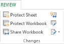
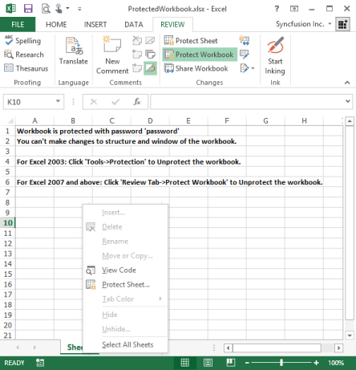

# Working with Excel Workbook 

Essential XlsIO supports working with workbook similar to MS Excel. The following sections were explained in detail on processing a workbook.

## Create a new Workbook

To create a new workbook, use the Create method in workbooks collection. The following procedure creates a new workbook. A better way to create a workbook is to assign it to an object variable. In the following code example, the Workbook object returned by the create method is assigned to an object variable, workbook. 


// Step 1: Instantiates the spreadsheet creation engine.

ExcelEngine excelEngine = new ExcelEngine();

// Step 2: Instantiates the excel application object.

IApplication application = excelEngine.Excel;

// A new workbook is created. [Equivalent to creating a new workbook in MS Excel).

// The new workbook has 2 worksheets.

IWorkbook workbook = application.Workbooks.Create(2);

// Another method of creating a workbook with sheet names.

IWorkbook workbook = application.Workbooks.Create(new string[]{"Sheet1","Sheet2"});

// Accesses the first worksheet object in the worksheets collection.

IWorksheet worksheet = workbook.Worksheets[0];

string fileName = "Output.xlsx";

workbook.Version = ExcelVersion.Excel2010;

workbook.SaveAs(fileName);

// Closes the workbook.

workbook.Close();

excelEngine.Dispose();




' Step 1: Instantiates the spreadsheet creation engine.

Dim excelEngine As ExcelEngine = New ExcelEngine

' Step 2: Instantiates the excel application object.

Dim application As IApplication = excelEngine.Excel

' A new workbook is created. [Equivalent to creating a new workbook in MS Excel].

'The new workbook will have 2 worksheets.

Dim workbook As IWorkbook = application.Workbooks.Create(2)

' Another method of creating a workbook with sheet names.

Dim workbook as IWorkbook = application.Workbooks.Create(new string[]{"Sheet1","Sheet2"})

Dim sheet As IWorksheet = workbook.Worksheets(0)

workbook.Version = ExcelVersion.Excel2010

Dim fileName As String = "Output.xlsx"

workbook.SaveAs(fileName)

'Closes the workbook.

workbook.Close()

excelEngine.Dispose()


## Clone a Workbook

The following procedure is used to clone a workbook. The Clone method returns a workbook that can be used for other processes without affecting the existing workbook.


// Step 1: Instantiates the spreadsheet creation engine.

ExcelEngine excelEngine = new ExcelEngine();

// Step 2: Instantiates the excel application object.

IApplication application = excelEngine.Excel;

// A new workbook is created.
IWorkbook sourceWorkbook = application.Workbooks.Create(2);

// A new workbook is cloned.

IWorkbook clonedWorkbook = sourceWorkbook.Clone();

string fileName = "Output.xlsx";

clonedWorkbook.Version = ExcelVersion.Excel2010;

clonedWorkbook.SaveAs(fileName);

//Closes the workbook.

clonedWorkbook.Close();

excelEngine.Dispose();





' Step 1: Instantiates the spreadsheet creation engine.

Dim excelEngine As ExcelEngine = New ExcelEngine

' Step 2: Instantiates the excel application object.

Dim application As IApplication = excelEngine.Excel

' A new workbook is created.

Dim sourceWorkbook As IWorkbook = application.Workbooks.Create(2)

' A new workbook is cloned.

Dim clonedWorkbook As IWorkbook = sourceWorkbook.Clone()

clonedWorkbook.Version = ExcelVersion.Excel2010

Dim fileName As String = "Output.xlsx"

clonedWorkbook.SaveAs(fileName)

'Closes the workbook.

clonedWorkbook.Close()

excelEngine.Dispose()


## Protect Workbook

MS Excel provides the creator of a workbook the ability to protect the Structure and Windows of a workbook with a password. It includes the following options.

* Protecting Structure: Worksheets and chart sheets in a workbook with protection cannot be moved, deleted, hidden, unhidden, or renamed, and new sheets cannot be inserted.
* Protecting Windows: Windows in a workbook with protection cannot be moved, resized, hidden, unhidden, or closed. Windows in a workbook with protection are sized and positioned the same way each time the workbook is opened. This can be done by selecting Protection option from the Tools menu in Excel.

Protect method of IWorkbook interface provides options to protect and unprotect documents with password in XlsIO. You can also set/reset the Window and Structure option in this method. The following code example illustrates how to protect a workbook with a password.


// Step 1: Instantiates the spreadsheet creation engine.

ExcelEngine excelEngine = new ExcelEngine();

// Step 2: Instantiates the excel application object.

IApplication application = excelEngine.Excel;

// Protects Workbook.

workbook.Protect(isProtectWindow, isProtectContent, "password");

// Unprotects workbook.

// Opens an existing (Protected) Workbook.

IWorkbook workbook = application.Workbooks.Open(@"ProtectedWorkbook.xlsx");

// Un-protects (unlocks) Workbook by using the Password.

workbook.Unprotect("password");

// Accesses the first worksheet object in the worksheets collection.

IWorksheet worksheet = workbook.Worksheets[0];

string fileName = "Output.xlsx";

workbook.Version = ExcelVersion.Excel2010;

workbook.SaveAs(fileName);

// Closes the workbook.

workbook.Close();

excelEngine.Dispose();





' Step 1: Instantiates the spreadsheet creation engine.

Dim excelEngine As ExcelEngine = New ExcelEngine

' Step 2: Instantiates the excel application object.

Dim application As IApplication = excelEngine.Excel

'Protects Workbook.

workbook.Protect(isProtectWindow, isProtectContent, "password")

'Unprotects workbook.

'Opens an existing (Protected) Workbook.

Dim workbook As IWorkbook = application.Workbooks.Open("ProtectedWorkbook.xlsx")

'Unprotects (unlocks) Workbook by using the Password.

workbook.Unprotect("password");

Dim fileName As String = "Output.xlsx"

workbook.Version = ExcelVersion.Excel2010

workbook.SaveAs(fileName)

'Closes the workbook.

workbook.Close()

excelEngine.Dispose()



The following illustration shows a protected document where no sheets can be added/removed to or from the document.

## Unprotect Workbook

You can unprotect or remove protection for a document by entering the password in the Unprotect Workbook dialog box in MS Excel as shown in the following screenshot.

XlsIO also provides support to unprotect a workbook with password by using the UnProtect method.


// Step 1: Instantiates the spreadsheet creation engine.

ExcelEngine excelEngine = new ExcelEngine();

// Step 2: Instantiates the excel application object.

IApplication application = excelEngine.Excel;

// Unprotects workbook.

// Opens an Existing (Protected) Workbook.

IWorkbook workbook = application.Workbooks.Open(@"ProtectedWorkbook.xlsx");

// Unprotects (unlocks) Workbook by using the Password.

workbook.Unprotect("password");

// Accesses the first worksheet object in the worksheets collection.

IWorksheet worksheet = workbook.Worksheets[0];

string fileName = "Output.xlsx";

workbook.Version = ExcelVersion.Excel2010;

workbook.SaveAs(fileName);

//Closes the workbook.

workbook.Close();

excelEngine.Dispose();





' Step 1: Instantiates the spreadsheet creation engine.

Dim excelEngine As ExcelEngine = New ExcelEngine

' Step 2: Instantiates the excel application object.

Dim application As IApplication = excelEngine.Excel

' Unprotects workbook.

' Opens an Existing (Protected) Workbook.

Dim workbook As IWorkbook = application.Workbooks.Open("ProtectedWorkbook.xlsx")

' Unprotects (unlocks) Workbook by using the Password.

workbook.Unprotect("password");

workbook.Version = ExcelVersion.Excel2010

Dim fileName As String = "Output.xlsx"

workbook.SaveAs(fileName)

'Closes the workbook.

workbook.Close()

excelEngine.Dispose()



