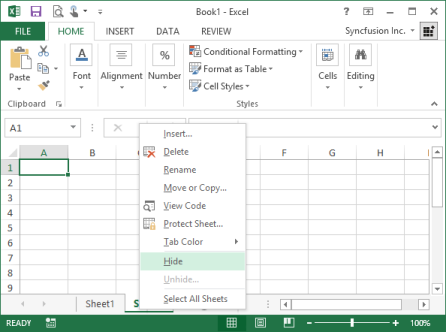
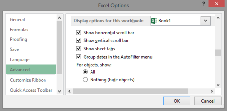
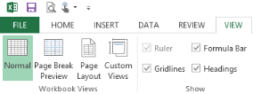
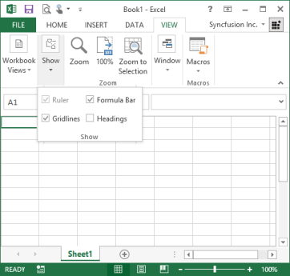
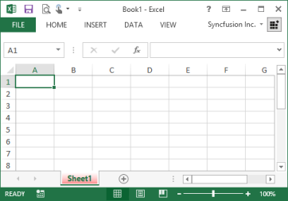
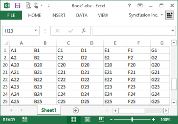
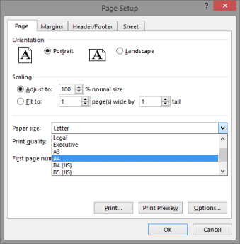
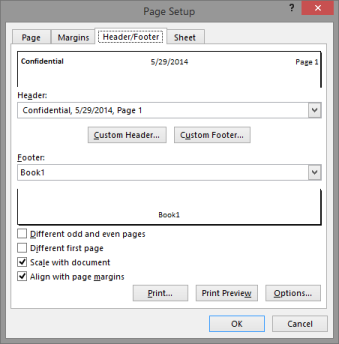

# Working with Excel Worksheet 

The Workbook and Worksheet classes contain the methods and properties to perform various tasks with worksheets.

## Create a Worksheet 

Essential XlsIO helps to programmatically create a worksheet and then add the worksheet to the collection of worksheets in the workbook. The Create method in worksheets collection does this and returns a worksheet object.

[C#]

// Step 1: Instantiates the spreadsheet creation engine.

ExcelEngine excelEngine = new ExcelEngine();

// Step 2: Instantiates the excel application object.

IApplication application = excelEngine.Excel;

// A new workbook is created. [Equivalent to creating a new workbook in MS Excel).

// The new workbook will have 2 worksheets.

IWorkbook workbook = application.Workbooks.Create(2);

// Creates a Sheet.

IWorksheet sheet = workbook.Worksheets.Create();

// Creates a Sheet named Sample.

IWorksheet sheet = workbook.Worksheets.Create("Sample");

string fileName = "Output.xlsx";

workbook.Version = ExcelVersion.Excel2010;

workbook.SaveAs(fileName);

// Closes the workbook.

workbook.Close();

excelEngine.Dispose();




[VB.NET]

' Step 1: Instantiates the spreadsheet creation engine.

Dim excelEngine As ExcelEngine = New ExcelEngine

' Step 2: Instantiates the excel application object.

Dim application As IApplication = excelEngine.Excel

' A new workbook is created. [Equivalent to creating a new workbook in MS Excel].

'The new workbook will have 2 worksheets.

Dim workbook As IWorkbook = application.Workbooks.Create(2)

' Creates a sheet.

Dim sheet As IWorkbook = workbook.Worksheets.Create()

' Creates a Sheet named Sample.

Dim sheet As IWorksheet = workbook.Worksheets.Create("Sample")

Dim fileName As String = "Output.xlsx"

workbook.Version = ExcelVersion.Excel2010

workbook.SaveAs(fileName)

'Closes the workbook.

workbook.Close()

excelEngine.Dispose()


## Access a Worksheet 

Worksheets collection can have more than one worksheet in a workbook. Accessing a particular worksheet can be done in two ways. One is by specifying the index and the other one is by specifying the sheet name. The following code example illustrates how to access a worksheet from its worksheets collection.

[C#]

// Step 1: Instantiates the spreadsheet creation engine.

ExcelEngine excelEngine = new ExcelEngine();

// Step 2: Instantiates the excel application object.

IApplication application = excelEngine.Excel;

// A new workbook is created. [Equivalent to creating a new workbook in MS Excel).

// The new workbook will have 2 worksheets.

IWorkbook workbook = application.Workbooks.Create(2);

// Creates a Sheet.

IWorksheet sheet = workbook.Worksheets.Create("Sample");

//Acceses via index.

IWorksheet sheet = workbook.Worksheets[0];

//Acceses via sheet Name.

IWorksheet sheet = workbook.Worksheets["Sample"];

string fileName = "Output.xlsx";

workbook.Version = ExcelVersion.Excel2010;

workbook.SaveAs(fileName);

// Closes the workbook.

workbook.Close();

excelEngine.Dispose();



[VB.NET]

' Step 1: Instantiates the spreadsheet creation engine.

Dim excelEngine As ExcelEngine = New ExcelEngine

' Step 2: Instantiates the excel application object.

Dim application As IApplication = excelEngine.Excel

' A new workbook is created. [Equivalent to creating a new workbook in MS Excel].

'The new workbook will have 2 worksheets.

Dim workbook As IWorkbook = application.Workbooks.Create(2)

' Accesses via index.

Dim sheet As IWorkbook = workbook.Worksheets(0)

' Accesses via Sheet Name.

Dim sheet As IWorkbook = workbook.Worksheets("Sample")

workbook.Version = ExcelVersion.Excel2010

Dim fileName As String = "Output.xlsx"

workbook.SaveAs(fileName)

'Closes the workbook.

workbook.Close()

excelEngine.Dispose()


## Remove a Worksheet

Worksheets can be deleted from a workbook either by a worksheet host item or on accessing worksheet by using worksheets collection as illustrated.

[C#]

// Step 1: Instantiates the spreadsheet creation engine.

ExcelEngine excelEngine = new ExcelEngine();

// Step 2: Instantiates the excel application object.

IApplication application = excelEngine.Excel;

// A new workbook is created. [Equivalent to creating a new workbook in MS Excel).

// The new workbook will have 2 worksheets.

IWorkbook workbook = application.Workbooks.Create(2);

//Creates a Sheet.

IWorksheet sheet = workbook.Worksheets.Create();

//Removes the sheet.

sheet.Remove();

//Removes the sheet

Workbook.Worksheets[0].Remove();

string fileName = "Output.xlsx";

workbook.Version = ExcelVersion.Excel2010;

workbook.SaveAs(fileName);

//Closes the workbook.

workbook.Close();

excelEngine.Dispose();




[VB.NET]

' Step 1: Instantiates the spreadsheet creation engine.

Dim excelEngine As ExcelEngine = New ExcelEngine

' Step 2: Instantiates the excel application object.

Dim application As IApplication = excelEngine.Excel

' A new workbook is created. [Equivalent to creating a new workbook in MS Excel].

'The new workbook will have 2 worksheets.

Dim workbook As IWorkbook = application.Workbooks.Create(2)

'Removes the sheet.

sheet.Remove()

'Removes the sheet.

Workbook.Worksheets[0].Remove()

Dim fileName As String = "Output.xlsx"

workbook.Version = ExcelVersion.Excel2010

workbook.SaveAs(fileName)

'Closes the workbook.

workbook.Close()

excelEngine.Dispose()


## Move or Copy a Worksheet

Essential XlsIO allows you to create a copy of a worksheet and insert that worksheet before or after an existing worksheet in the workbook. When the place of insertion is not specified, XlsIO creates a new workbook for the new worksheet. When you copy/move rows and columns, Microsoft Excel copies or moves all the data that it contains including formulas and their resulting values, comments, cell formats, and hidden cells.

###Copying Worksheets

Copying worksheets can be internal or external. XlsIO provides support for copying a worksheet within a workbook and also from one workbook to another. This feature can be used to merge together several workbooks. The following code example illustrates how to copy a sheet with its entire contents to another sheet.


[C#]

// Step 1: Instantiates the spreadsheet creation engine.

ExcelEngine excelEngine = new ExcelEngine();

// Step 2: Instantiates the excel application object.

IApplication application = excelEngine.Excel;

// Opens the Source WorkBook.        

IWorkbook sourceWorkbook = application.Workbooks.Open("SourceWorkbookTemplate.xlsx");

// Opens the Destination WorkBook.        

IWorkbook destinationWorkbook = application.Workbooks.Open("DestinationWorkbookTemplate.xlsx");

// Copies the first worksheet from the Source workbook to the destination workbook.

destinationWorkbook.Worksheets.AddCopy(sourceWorkbook.Worksheets[0]);

// Activates the newly added worksheet in the destination workbook.

destinationWorkbook.ActiveSheetIndex = 1;

// Saves the workbook to disk.

destinationWorkbook.SaveAs("CopiedWorkbook.xlsx");

// Closes the workbook.

sourceWorkbook.Close();

destinationWorkbook.Close();   




[VB.NET]

' Step 1: Instantiates the spreadsheet creation engine.

Dim excelEngine As ExcelEngine = New ExcelEngine

' Step 2: Instantiates the excel application object.

Dim application As IApplication = excelEngine.Excel

'Opens the Source WorkBook.

Dim sourceWorkbook As IWorkbook = application.Workbooks.Open("SourceWorkbookTemplate.xlsx")

'Opens the Destination WorkBook.        

Dim destinationWorkbook As IWorkbook = application.Workbooks.Open("DestinationWorkbookTemplate.xlsx")

'Copies the first worksheet from the Source workbook to the destination workbook.

destinationWorkbook.Worksheets.AddCopy(sourceWorkbook.Worksheets(0))

'Activates the newly added worksheet in the destination workbook.

destinationWorkbook.ActiveSheetIndex = 1

'Saves the workbook to disk.

destinationWorkbook.SaveAs("CopiedWorkbook.xlsx")

'Closes the workbook.

sourceWorkbook.Close()

destinationWorkbook.Close()


You can also specify copy options while copying a worksheet if you are interested in improving the performance and if you are interested in ignoring certain formatting while copying through the ExcelWorksheetCopyFlags enumerator. The values of this enumerator are as follows.

_Values of ExcelWorksheetCopyFlags enumerator_

<table>
<tr>
<th>
Members </th><th>
Description</th></tr>
<tr>
<td>
None</td><td>
No flags. </td></tr>
<tr>
<td>
ClearBefore</td><td>
Represents the ClearBefore copy flags. </td></tr>
<tr>
<td>
CopyNames</td><td>
Copies Names.</td></tr>
<tr>
<td>
CopyCells</td><td>
Copies whole Cells.</td></tr>
<tr>
<td>
CopyRowHeight</td><td>
Copies Row Height.</td></tr>
<tr>
<td>
CopyColumnHeight</td><td>
Copies Column Height.</td></tr>
<tr>
<td>
CopyOptions</td><td>
CopyOptions copy flags. </td></tr>
<tr>
<td>
CopyMerges</td><td>
Copies Merges.  </td></tr>
<tr>
<td>
CopyShapes</td><td>
Copies Shapes.</td></tr>
<tr>
<td>
CopyConditionlFormats</td><td>
Represents the CopyConditionlFormats copy flags. </td></tr>
<tr>
<td>
CopyAutoFilters</td><td>
Copies AutoFilters.</td></tr>
<tr>
<td>
CopyDataValidations</td><td>
Copies Data Validations. </td></tr>
<tr>
<td>
CopyPageSetup</td><td>
Copies page setup (page breaks, paper orientation, header, footer and other properties). </td></tr>
<tr>
<td>
CopyAll</td><td>
Represents the CopyAll copy flags. </td></tr>
<tr>
<td>
CopyWithoutNames</td><td>
Represents the CopyWithoutNames copy flags.</td></tr>
</table>

The following code example illustrates copying worksheets.

[C#]

// Opens the Source WorkBook.        

IWorkbook sourceWorkbook = application.Workbooks.Open("SourceWorkbookTemplate.xlsx");

// Opens the Destination WorkBook.        

IWorkbook destinationWorkbook = application.Workbooks.Open("DestinationWorkbookTemplate.xlsx");

// Copies the first worksheet from the Source workbook to the destination workbook with data validations.

destinationWorkbook.Worksheets.AddCopy(sourceWorkbook.Worksheets[0], ExcelWorksheetCopyFlags.CopyDataValidations);

// Activates the newly added worksheet in the destination workbook.

destinationWorkbook.ActiveSheetIndex = 1;

// Saves the workbook to disk.

destinationWorkbook.SaveAs("CopiedWorkbook.xlsx");

// Closes the workbook.

sourceWorkbook.Close();

destinationWorkbook.Close();  




[VB.NET]

' Step 1: Instantiates the spreadsheet creation engine.

Dim excelEngine As ExcelEngine = New ExcelEngine

' Step 2: Instantiates the excel application object.

Dim application As IApplication = excelEngine.Excel

'Opens the Source WorkBook.

Dim sourceWorkbook As IWorkbook = application.Workbooks.Open("SourceWorkbookTemplate.xlsx")

'Opens the Destination WorkBook.        

Dim destinationWorkbook As IWorkbook = application.Workbooks.Open("DestinationWorkbookTemplate.xlsx")

' Copies the first worksheet from the Source workbook to the destination workbook with data validations.

destinationWorkbook.Worksheets.AddCopy(sourceWorkbook.Worksheets(0), ExcelWorksheetCopyFlags.CopyDataValidations)

' Activates the newly added worksheet in the destination workbook.

destinationWorkbook.ActiveSheetIndex = 1

' Saves the workbook to disk.

destinationWorkbook.SaveAs("CopiedWorksheet.xlsx")

' Closes the workbook.

sourceWorkbook.Close()

destinationWorkbook.Close()



You can also copy a worksheet before or after a particular worksheet by using the AddCopyBefore and AddCopyAfter methods respectively.

###Moving a Worksheet

XlsIO also allows moving worksheets from one position to another. This is similar to dragging a worksheet in MS Excel. This can be performed by using the Move method. The following code example illustrates how a worksheet is moved to the second position.

[C#]

' Step 1: Instantiates the spreadsheet creation engine.

Dim excelEngine As ExcelEngine = New ExcelEngine

' Step 2: Instantiates the excel application object.

Dim application As IApplication = excelEngine.Excel

// Step 1: Instantiates the spreadsheet creation engine.

ExcelEngine excelEngine = new ExcelEngine();

// Step 2: Instantiates the excel application object.

IApplication application = excelEngine.Excel;

// A new workbook is created. [Equivalent to creating a new workbook in MS Excel).

// The new workbook will have 2 worksheets.

IWorkbook workbook = application.Workbooks.Create(3);

// The first worksheet object in the worksheets collection is accessed.

IWorksheet sheet = workbook.Worksheets[0];

//Moves the Sheet

sheet.Move(2);

string fileName = "Output.xlsx";

workbook.Version = ExcelVersion.Excel2010;

workbook.SaveAs(fileName);

// Closes the workbook.

workbook.Close();

excelEngine.Dispose();




[VB.NET]

' Step 1: Instantiates the spreadsheet creation engine.

Dim excelEngine As ExcelEngine = New ExcelEngine

' Step 2: Instantiates the excel application object.

Dim application As IApplication = excelEngine.Excel

' A new workbook is created. [Equivalent to creating a new workbook in MS Excel].

'The new workbook will have 2 worksheets.

Dim workbook As IWorkbook = application.Workbooks.Create(3)

'Accesses via index.

Dim sheet As IWorkbook = workbook.Worksheets(0)

'Moves the sheet.

sheet.Move(2)

Dim fileName As String = "Output.xlsx"

workbook.Version = ExcelVersion.Excel2010

workbook.SaveAs(fileName)

'Closes the workbook.

workbook.Close()

excelEngine.Dispose()


## Save Worksheet as CSV

While saving files, you have options to save as Unicode, ASCII, and other Non-Unicode encoding. The following code example illustrates how to save a file to the CSV format. To know more about opening/saving a CSV file, refer to the Open a CSV File and Save a CSV File sections.

[C#]

// Step 1: Instantiates the spreadsheet creation engine.

ExcelEngine excelEngine = new ExcelEngine();

// Step 2: Instantiates the excel application object.

IApplication application = excelEngine.Excel;

// A new workbook is created. [Equivalent to creating a new workbook in MS Excel).

// The new workbook will have 2 worksheets.

IWorkbook workbook = application.Workbooks.Create(2);

// Accesses the first worksheet object in the worksheets collection.

IWorksheet sheet = workbook.Worksheets[0];

//Saves the sheet as CSV.

sheet.SaveAs("Sample.csv", ",");

string fileName = "Output.xlsx";

workbook.Version = ExcelVersion.Excel2010;

workbook.SaveAs(fileName);

// Closes the workbook.

workbook.Close();

excelEngine.Dispose();




[VB.NET]

' Step 1: Instantiates the spreadsheet creation engine.

Dim excelEngine As ExcelEngine = New ExcelEngine

' Step 2: Instantiates the excel application object.

Dim application As IApplication = excelEngine.Excel

' A new workbook is created. [Equivalent to creating a new workbook in MS Excel].

'The new workbook will have 2 worksheets.

Dim workbook As IWorkbook = application.Workbooks.Create(2)

' Accesses via index.

Dim sheet As IWorkbook = workbook.Worksheets(0)

'Saves the sheet as CSV. 
sheet.SaveAs("Sample.csv", ",")

Dim fileName As String = "Output.xlsx"

workbook.Version = ExcelVersion.Excel2010

workbook.SaveAs(fileName)

'Closes the workbook.

workbook.Close()

excelEngine.Dispose()

Save worksheet as text (*.txt)


Essential XlsIO allows you to save worksheet as a text file. This can be done by leaving the delimiter with a space as shown in the following code.

[C#]

// Step 1: Instantiates the spreadsheet creation engine.

ExcelEngine excelEngine = new ExcelEngine();

// Step 2: Instantiates the excel application object.

IApplication application = excelEngine.Excel;

// A new workbook is created. [Equivalent to creating a new workbook in MS Excel).

// The new workbook will have 2 worksheets.

IWorkbook workbook = application.Workbooks.Create(2);

// Accesses the first worksheet object in the worksheets collection.

IWorksheet sheet = workbook.Worksheets[0];

// Saves the sheet as text.

sheet.SaveAs("Sample.txt", " ");

string fileName = "Output.xlsx";

workbook.Version = ExcelVersion.Excel2010;

workbook.SaveAs(fileName);

// Closes the workbook.

workbook.Close();

excelEngine.Dispose();




[VB.NET]

' Step 1: Instantiates the spreadsheet creation engine.

Dim excelEngine As ExcelEngine = New ExcelEngine

' Step 2: Instantiates the excel application object.

Dim application As IApplication = excelEngine.Excel

' A new workbook is created. [Equivalent to creating a new workbook in MS Excel].

'The new workbook will have 2 worksheets.

Dim workbook As IWorkbook = application.Workbooks.Create(2)

'Accesses via index.

Dim sheet As IWorkbook = workbook.Worksheets(0)

'Saves the sheet as text.
sheet.SaveAs("Sample.txt", " ")

Dim fileName As String = "Output.xlsx"

workbook.Version = ExcelVersion.Excel2010

workbook.SaveAs(fileName)

'Closes the workbook.

workbook.Close()

excelEngine.Dispose()



## Save Worksheet as HTML

XlsIO provides support to convert a worksheet or workbook to HTML with the basic formatting preserved. The following code example illustrates on how to do this.


[C#]

// Step 1: Instantiates the spreadsheet creation engine.

ExcelEngine excelEngine = new ExcelEngine();

// Step 2: Instantiates the excel application object.

IApplication application = excelEngine.Excel;

// A new workbook is created. [Equivalent to creating a new workbook in MS Excel).

// The new workbook will have 2 worksheets.

IWorkbook workbook = application.Workbooks.Create(2);

//Accesses the first worksheet object in the worksheets collection.

IWorksheet sheet = workbook.Worksheets[0];

//Saves an Excel sheet as HTML file.

sheet.SaveAsHtml("Sample.html");

//Saves the workbook as HTML file.

workbook.SaveAsHtml("Sample.html", HtmlSaveOptions.Default);

string fileName = "Output.xlsx";

workbook.Version = ExcelVersion.Excel2010;

workbook.SaveAs(fileName);

//Closes the workbook.

workbook.Close();

excelEngine.Dispose() ;




[VB.NET]

' Step 1: Instantiates the spreadsheet creation engine.

Dim excelEngine As ExcelEngine = New ExcelEngine

' Step 2: Instantiates the excel application object.

Dim application As IApplication = excelEngine.Excel

' A new workbook is created. [Equivalent to creating a new workbook in MS Excel].

' The new workbook will have 2 worksheets.

Dim workbook As IWorkbook = application.Workbooks.Create(2)

'Accesses via index.

Dim sheet As IWorkbook = workbook.Worksheets(0)

'Saves an Excel sheet as HTML file.

sheet.SaveAsHtml("Sample.html")

'Saves a workbook as HTML file.

workbook.SaveAsHtml("Sample.html", HtmlSaveOptions.Default)

Dim fileName As String = "Output.xlsx"

workbook.Version = ExcelVersion.Excel2010

workbook.SaveAs(fileName)

'Closes the workbook.

workbook.Close()

excelEngine.Dispose()



##Save Options

XlsIO also provides various save options to control images and texts in an Excel file. It enables you to save a worksheet with the displayed text or value in the cell to HTML file. The following code example illustrates this.


[C#]

// Step 1: Instantiates the spreadsheet creation engine.

ExcelEngine excelEngine = new ExcelEngine();

// Step 2: Instantiates the excel application object.

IApplication application = excelEngine.Excel;

// A new workbook is created. [Equivalent to creating a new workbook in MS Excel).

// The new workbook will have 2 worksheets.

IWorkbook workbook = application.Workbooks.Create(2);

//Accesses The first worksheet object in the worksheets collection.

IWorksheet sheet = workbook.Worksheets[0];

//Creates the instant for SaveOptions.

HtmlSaveOptions options = new HtmlSaveOptions();

options.TextMode = HtmlSaveOptions.GetText.DisplayText;

options.ImagePath = @"..\..\Images\";

//Saves the sheet as HTML.
sheet.SaveAsHtml("Sample.html", options);

string fileName = "Output.xlsx";

workbook.Version = ExcelVersion.Excel2010;

workbook.SaveAs(fileName);

//Closes the workbook.

workbook.Close();

excelEngine.Dispose();




[VB.NET]

' Step 1: Instantiates the spreadsheet creation engine.

Dim excelEngine As ExcelEngine = New ExcelEngine

' Step 2: Instantiates the excel application object.

Dim application As IApplication = excelEngine.Excel

' A new workbook is created. [Equivalent to creating a new workbook in MS Excel].

'The new workbook will have 2 worksheets.

Dim workbook As IWorkbook = application.Workbooks.Create(2)

'Accesses via index.

Dim sheet As IWorkbook = workbook.Worksheets(0)

'Creates the instant for SaveOptions.

Dim options As New HtmlSaveOptions()

options.TextMode = HtmlSaveOptions.GetText.DisplayText

options.ImagePath = "..\..\Images\"

'Saves the sheet as HTML.

sheet.SaveAsHtml("Sample.html", options)

Dim fileName As String = "Output.xlsx"

workbook.Version = ExcelVersion.Excel2010

workbook.SaveAs(fileName)

'Closes the workbook.

workbook.Close()

excelEngine.Dispose()


## Show or Hide Worksheet 

Excel has the sheet tab bar that appears at the bottom of the screen with tab scrolling buttons displayed on the left side. Excel provides an option to show/hide a sheet from your view. This is done by selecting the Hide item in the context menu of the sheet.

_Hiding a Worksheet_

Hiding and Unhiding a Worksheet in XlsIO

XlsIO also allows you to hide/unhide worksheets by using the Visibility property. The following APIs are used to hide/unhide worksheets.

[C#]

// Step 1: Instantiates the spreadsheet creation engine.

ExcelEngine excelEngine = new ExcelEngine();

// Step 2: Instantiates the excel application object.

IApplication application = excelEngine.Excel;

// A new workbook is created. [Equivalent to creating a new workbook in MS Excel).

// The new workbook will have 2 worksheets.

IWorkbook workbook = application.Workbooks.Create(2);

//Accesses The first worksheet object in the worksheets collection.

IWorksheet sheet = workbook.Worksheets[0];

sheet.Visibility = WorksheetVisibility.Hidden;

string fileName = "Output.xlsx";

workbook.Version = ExcelVersion.Excel2010;

workbook.SaveAs(fileName);

//Closes the workbook.

workbook.Close();

excelEngine.Dispose();




[VB.NET]

' Step 1: Instantiates the spreadsheet creation engine.

Dim excelEngine As ExcelEngine = New ExcelEngine

' Step 2: Instantiates the excel application object.

Dim application As IApplication = excelEngine.Excel

' A new workbook is created. [Equivalent to creating a new workbook in MS Excel].

'The new workbook will have 2 worksheets.

Dim workbook As IWorkbook = application.Workbooks.Create(2)

'Accesses via index.

Dim sheet As IWorkbook = workbook.Worksheets(0)

sheet.Visibility = WorksheetVisibility.Hidden

Dim fileName As String = "Output.xlsx"

workbook.Version = ExcelVersion.Excel2010

workbook.SaveAs(fileName)

'Closes the workbook.

workbook.Close()

excelEngine.Dispose()


XlsIO also provides an option to activate a worksheet while opening it in the workbook that is equivalent to clicking a worksheet in MS Excel. This is done by using the Activate method.



[C#]

// Step 1: Instantiates the spreadsheet creation engine.

ExcelEngine excelEngine = new ExcelEngine();

// Step 2: Instantiates the excel application object.

IApplication application = excelEngine.Excel;

// A new workbook is created. [Equivalent to creating a new workbook in MS Excel).

// The new workbook will have 2 worksheets.

IWorkbook workbook = application.Workbooks.Create(2);

//The second sheet is accessed.

IWorksheet sheet = workbook.Worksheets[1];

sheet.Activate();

string fileName = "Output.xlsx";

workbook.Version = ExcelVersion.Excel2010;

workbook.SaveAs(fileName);

// Closes the workbook.

workbook.Close();

excelEngine.Dispose();




[VB.NET]

' Step 1: Instantiates the spreadsheet creation engine.

Dim excelEngine As ExcelEngine = New ExcelEngine

' Step 2: Instantiates the excel application object.

Dim application As IApplication = excelEngine.Excel

' A new workbook is created. [Equivalent to creating a new workbook in MS Excel].

'The new workbook will have 2 worksheets.

Dim workbook As IWorkbook = application.Workbooks.Create(2)

' Accesses via index.

Dim sheet As IWorkbook = workbook.Worksheets(1)

sheet.Activate()

Dim fileName As String = "Output.xlsx"

workbook.Version = ExcelVersion.Excel2010

workbook.SaveAs(fileName)

'Closes the workbook.

workbook.Close()

excelEngine.Dispose()


## Show or Hide Worksheet Tabs 

Excel allows you to show/hide the workbook tabs to prevent you from switching between sheets through sheet tabs and to focus your attention on a particular sheet.

XlsIO provides an option to hide the workbook tabs by using the IWorkbook.DisplayWorkbookTabs property. XlsIO also provides an option to get the current tab that is displayed by using the DisplayedTab property of IWorkbook. This functionality is supported only in the Excel97to2003 format.

[C#]

// Step 1: Instantiates the spreadsheet creation engine.

ExcelEngine excelEngine = new ExcelEngine();

// Step 2: Instantiates the excel application object.

IApplication application = excelEngine.Excel;

// A new workbook is created. [Equivalent to creating a new workbook in MS Excel).

// The new workbook will have 2 worksheets.

IWorkbook workbook = application.Workbooks.Create(2);

workbook.DisplayWorkbookTabs = false;

string fileName = "Output.xls";

workbook.Version = ExcelVersion.Excel97to2003;

workbook.SaveAs(fileName);

// Closes the workbook.

workbook.Close();

excelEngine.Dispose();




[VB]

' Step 1: Instantiates the spreadsheet creation engine.

Dim excelEngine As ExcelEngine = New ExcelEngine

' Step 2: Instantiates the excel application object.

Dim application As IApplication = excelEngine.Excel

' A new workbook is created. [Equivalent to creating a new workbook in MS Excel].

'The new workbook will have 2 worksheets.

Dim workbook As IWorkbook = application.Workbooks.Create(2)

'Accesses via index.

Dim sheet As IWorkbook = workbook.Worksheets(0)

workbook.DisplayWorkbookTabs = False

Dim fileName As String = "Output.xls"

workbook.Version = ExcelVersion.Excel97to2003

workbook.SaveAs(fileName)

'Closes the workbook.

workbook.Close()

excelEngine.Dispose()



## Show or Hide Scroll Bars

To allow viewing of a particular worksheet, hide the content in the last part of the worksheet, hide the scrollbars by turning off either scrollbar checkbox in the View tab of the Options dialog box.

_Show or Hide scroll Bars_

XlsIO allows control of the visibility of these horizontal and vertical scrollbars in a workbook by using the IsHScrollBarVisible and IsVScrollBarVisible properties of IWorkbook as follows.

[C#]

// Step 1: Instantiates the spreadsheet creation engine.

ExcelEngine excelEngine = new ExcelEngine();

// Step 2: Instantiates the excel application object.

IApplication application = excelEngine.Excel;

// A new workbook is created. [Equivalent to creating a new workbook in MS Excel).

// The new workbook will have 2 worksheets.

IWorkbook workbook = application.Workbooks.Create(2);

// Hides horizontal scroll bar and shows the vertical scroll bar.

workbook.IsHScrollBarVisible = false;

workbook.IsVScrollBarVisible = true;

string fileName = "Output.xlsx";

workbook.Version = ExcelVersion.Excel2010;

workbook.SaveAs(fileName);

//Closes the workbook.

workbook.Close();

excelEngine.Dispose ();




[VB]

' Step 1: Instantiates the spreadsheet creation engine.

Dim excelEngine As ExcelEngine = New ExcelEngine

' Step 2: Instantiates the excel application object.

Dim application As IApplication = excelEngine.Excel

' A new workbook is created. [Equivalent to creating a new workbook in MS Excel].

'The new workbook will have 2 worksheets.

Dim workbook As IWorkbook = application.Workbooks.Create(2)

'Accesses via index.

Dim sheet As IWorkbook = workbook.Worksheets(0)

'Hides horizontal scroll bar and shows the vertical scroll bar.

workbook.IsHScrollBarVisible = False

workbook.IsVScrollBarVisible = True

Dim fileName As String = "Output.xlsx"

workbook.SaveAs(fileName)

string fileName = "Output.xlsx";

workbook.Version = ExcelVersion.Excel2010

workbook.SaveAs(fileName);

'Closes the workbook.

workbook.Close()

excelEngine.Dispose()


## Show or Hide Grid Lines 

Some may find it easier to work with the worksheet applications withoutgrid lines. Excel provides options to show/hide grid lines in the worksheet. This is done by accessing the GridLines option in View tab of the ribbon.

_Show or Hide Grid Lines_

XlsIO provides support for this feature through the IsGridLine property of IWorksheet. Color for the grid line can also be set through the GridLineColor property of IWorksheet.

[C#]

// Step 1: Instantiates the spreadsheet creation engine.

ExcelEngine excelEngine = new ExcelEngine();

// Step 2: Instantiates the excel application object.

IApplication application = excelEngine.Excel;

// A new workbook is created. [Equivalent to creating a new workbook in MS Excel).

// The new workbook will have 2 worksheets.

IWorkbook workbook = application.Workbooks.Create(2);

// Creates a Sheet.

IWorksheet sheet = workbook.Worksheets[0];

// Hides grid line.

sheet.IsGridLinesVisible = false;

string fileName = "Output.xlsx";

workbook.Version = ExcelVersion.Excel2010;

workbook.SaveAs(fileName);

// Closes the workbook.

workbook.Close();

excelEngine.Dispose ();



[VB]

' Step 1: Instantiates the spreadsheet creation engine.

Dim excelEngine As ExcelEngine = New ExcelEngine

' Step 2: Instantiates the excel application object.

Dim application As IApplication = excelEngine.Excel

' A new workbook is created. [Equivalent to creating a new workbook in MS Excel].

' The new workbook will have 2 worksheets.

Dim workbook As IWorkbook = application.Workbooks.Create(2)

' Accesses via index.

Dim sheet As IWorkbook = workbook.Worksheets(0)

' Hides grid line.

sheet.IsGridLinesVisible = False

Dim fileName As String = "Output.xlsx"

workbook.Version = ExcelVersion.Excel2010

workbook.SaveAs(fileName)

'Closes the workbook.

workbook.Close()

excelEngine.Dispose()


## Show or Hide Row and Column Headers 

Headings are the display labels in worksheets that enable you to find out the cell number with ease. You can show/hide these headings by using the IsRowColumnHeadersVisible property of IWorksheet.

[C#]

// Step 1: Instantiates the spreadsheet creation engine.

ExcelEngine excelEngine = new ExcelEngine();

// Step 2: Instantiates the excel application object.

IApplication application = excelEngine.Excel;

// A new workbook is created. [Equivalent to creating a new workbook in MS Excel).

// The new workbook will have 2 worksheets.

IWorkbook workbook = application.Workbooks.Create(2);

// Creates a Sheet.

IWorksheet sheet = workbook.Worksheets[0];

sheet.IsRowColumnHeadersVisible = false;

string fileName = "Output.xlsx";

workbook.Version = ExcelVersion.Excel2010;

workbook.SaveAs(fileName);

// Closes the workbook.

workbook.Close();

excelEngine.Dispose ();



[VB]

' Step 1: Instantiates the spreadsheet creation engine.

Dim excelEngine As ExcelEngine = New ExcelEngine

' Step 2: Instantiates the excel application object.

Dim application As IApplication = excelEngine.Excel

' A new workbook is created. [Equivalent to creating a new workbook in MS Excel].

' The new workbook will have 2 worksheets.

Dim workbook As IWorkbook = application.Workbooks.Create(2)

'Accesses via index.

Dim sheet As IWorkbook = workbook.Worksheets(0)

sheet.IsRowColumnHeadersVisible = False

Dim fileName As String = "Output.xlsx"

workbook.Version = ExcelVersion.Excel2010

workbook.SaveAs(fileName)

'Closes the workbook.

workbook.Close()

excelEngine.Dispose()



_Show or Hide Headings_

## Highlight Worksheet Tabs 

Tab Colors are set to highlight a particular sheet that has some important data. You can set the tab color through the TabColor property as follows.



[C#]

// Step 1: Instantiates the spreadsheet creation engine.

ExcelEngine excelEngine = new ExcelEngine();

// Step 2: Instantiates the excel application object.

IApplication application = excelEngine.Excel;

// A new workbook is created. [Equivalent to creating a new workbook in MS Excel).

// The new workbook will have 2 worksheets.

IWorkbook workbook = application.Workbooks.Create(2);

//Creates a Sheet.

IWorksheet sheet = workbook.Worksheets[0];

sheet.TabColor = ExcelKnownColors.Red;

string fileName = "Output.xlsx";

workbook.Version = ExcelVersion.Excel2010;

workbook.SaveAs(fileName);

//Closes the workbook.

workbook.Close();

excelEngine.Dispose();



[VB.NET]

' Step 1: Instantiates the spreadsheet creation engine.

Dim excelEngine As ExcelEngine = New ExcelEngine

' Step 2: Instantiates the excel application object.

Dim application As IApplication = excelEngine.Excel

' A new workbook is created. [Equivalent to creating a new workbook in MS Excel].

'The new workbook will have 2 worksheets.

Dim workbook As IWorkbook = application.Workbooks.Create(2)

'Accesses via index.

Dim sheet As IWorkbook = workbook.Worksheets(0)

sheet.TabColor = ExcelKnownColors.Red

Dim fileName As String = "Output.xlsx"

workbook.Version = ExcelVersion.Excel2010

workbook.SaveAs(fileName)

'Closes the workbook.

workbook.Close()

excelEngine.Dispose()



_Tab Color_

## Freeze Panes 

It is difficult to read and understand very large spreadsheets. When you scroll too far to the right or down, you cannot be able to view the headings that are located at the top and at the left side of the worksheet. Without the headings, it is hard to keep track of the columns or rows of data viewed. Excel features Freeze Panes to avoid this problem. This feature can be enabled by selecting Freeze option from the View tab. It allows you to freeze certain areas or panes of the spreadsheet, so that they remain visible at all times while scrolling to the right or bottom. Headings make it easier to read the data in the spreadsheet.

_Freeze Panes_

XlsIO provides support for the freeze panes functionality through the FreezePanes method of IRange.


[C#]

// Step 1: Instantiates the spreadsheet creation engine.

ExcelEngine excelEngine = new ExcelEngine();

// Step 2: Instantiates the excel application object.

IApplication application = excelEngine.Excel;

// A new workbook is created. [Equivalent to creating a new workbook in MS Excel).

// The new workbook will have 2 worksheets.

IWorkbook workbook = application.Workbooks.Create(2);

//Creates a Sheet.

IWorksheet sheet = workbook.Worksheets[0];

// Applies Freeze Pane to the sheet by specifying a cell.

sheet.Range["B2"].FreezePanes();

string fileName = "Output.xlsx";

workbook.Version = ExcelVersion.Excel2010;

workbook.SaveAs(fileName);

// Closes the workbook.

workbook.Close();

excelEngine.Dispose();



[VB.NET]

' Step 1: Instantiates the spreadsheet creation engine.

Dim excelEngine As ExcelEngine = New ExcelEngine

' Step 2: Instantiates the excel application object.

Dim application As IApplication = excelEngine.Excel

' A new workbook is created. [Equivalent to creating a new workbook in MS Excel].

'The new workbook will have 2 worksheets.

Dim workbook As IWorkbook = application.Workbooks.Create(2)

'Accesses via index.

Dim sheet As IWorkbook = workbook.Worksheets(0)

'Applies Freeze Pane to the sheet by specifying a cell.

sheet.Range("B2").FreezePanes()

Dim fileName As String = "Output.xlsx"

workbook.Version = ExcelVersion.Excel2010

workbook.SaveAs(fileName)

'Closes the workbook.

workbook.Close()

excelEngine.Dispose()



_XlsIO with Freeze Pane_

XlsIO also allows you to scroll to the first row in the bottom pane and first column in the right pane. It helps you to navigate to the top row while opening a spreadsheet with large number of rows/columns. Note that this works only with the sheet that has the freeze panes.

[C#]

// Step 1: Instantiates the spreadsheet creation engine.

ExcelEngine excelEngine = new ExcelEngine();

// Step 2: Instantiates the excel application object.

IApplication application = excelEngine.Excel;

// A new workbook is created. [Equivalent to creating a new workbook in MS Excel).

// The new workbook will have 2 worksheets.

IWorkbook workbook = application.Workbooks.Create(2);

//Creates a Sheet.

IWorksheet sheet = workbook.Worksheets[0];

// Sets first visible row in the bottom pane.

sheet.FirstVisibleRow = 2;

// Sets first visible column in the right pane.

sheet.FirstVisibleColumn = 2;

string fileName = "Output.xlsx";

workbook.Version = ExcelVersion.Excel2010;

workbook.SaveAs(fileName);

//Closes the workbook.

workbook.Close();

excelEngine.Dispose();



[VB.NET]

' Step 1: Instantiates the spreadsheet creation engine.

Dim excelEngine As ExcelEngine = New ExcelEngine

' Step 2: Instantiates the excel application object.

Dim application As IApplication = excelEngine.Excel

' A new workbook is created. [Equivalent to creating a new workbook in MS Excel].

'The new workbook will have 2 worksheets.

Dim workbook As IWorkbook = application.Workbooks.Create(2)

'Accesses via index.

Dim sheet As IWorkbook = workbook.Worksheets(0)

'Sets first visible row in the bottom pane.

sheet.FirstVisibleRow = 2

'Sets first visible column in the right pane.

sheet.FirstVisibleColumn = 2

Dim fileName As String = "Output.xlsx"

workbook.Version = ExcelVersion.Excel2010

workbook.SaveAs(fileName)

'Closes the workbook.

workbook.Close()

excelEngine.Dispose()



> Note: FirstVisibleColumn and FirstVisibleRow indexes are "zero-based".

## Split Panes 

A very handy feature of Excel is its ability to view more than one copy of your worksheet and scroll through each pane of your worksheet independently. You can do this by using a feature called Split Panes that can be used to split your worksheet both horizontally and vertically. While using Split Panes, the panes of your worksheet work simultaneously. When you make a change in one pane, it simultaneously appears in the other.

XlsIO provides support for splitting the window through the HorizontalSplit and VerticalSplit properties.

[C#]

// Step 1: Instantiates the spreadsheet creation engine.

ExcelEngine excelEngine = new ExcelEngine();

// Step 2: Instantiates the excel application object.

IApplication application = excelEngine.Excel;

// A new workbook is created. [Equivalent to creating a new workbook in MS Excel).

// The new workbook will have 2 worksheets.

IWorkbook workbook = application.Workbooks.Create(2);

IWorksheet sheet = workbook.Worksheets[0];

sheet.FirstVisibleColumn = 5;

sheet.FirstVisibleRow = 11;

sheet.VerticalSplit = 110;

sheet.HorizontalSplit = 100;

sheet.ActivePane = 1;

string fileName = "Output.xlsx";

workbook.Version = ExcelVersion.Excel2010;

workbook.SaveAs(fileName);

//Closes the workbook.

workbook.Close();

excelEngine.Dispose();




[VB.NET]

' Step 1: Instantiates the spreadsheet creation engine.

Dim excelEngine As ExcelEngine = New ExcelEngine

' Step 2: Instantiates the excel application object.

Dim application As IApplication = excelEngine.Excel

' A new workbook is created. [Equivalent to creating a new workbook in MS Excel].

'The new workbook will have 2 worksheets.

Dim workbook As IWorkbook = application.Workbooks.Create(2)

'Accesses via index.

Dim sheet As IWorkbook = workbook.Worksheets(0)

sheet.FirstVisibleColumn = 5

sheet.FirstVisibleRow = 11

sheet.VerticalSplit = 110

sheet.HorizontalSplit = 100

sheet.ActivePane = 1

Dim fileName As String = "Output.xlsx"

workbook.Version = ExcelVersion.Excel2010

workbook.SaveAs(fileName)

'Closes the workbook.

workbook.Close()

excelEngine.Dispose()



_Split Pane_

## Protecting a Worksheet

You can share an Excel file so that others can collaborate on the data, but you can prevent anyone from making changes to specific worksheet or workbook elements by protecting certain parts of the file. 
Excel allows you to protect a worksheet and provides an option to specify the elements that can be changed, when you protect a worksheet. This is done by opening the Tools menu and clicking Protection option.

### Protect Worksheet 

WorkSheet Protection in XlsIO

XlsIO provides support for protecting and unprotecting elements in worksheets by using the Protect method of IWorksheet. Byusing the ExcelSheetProtection enumerator, you can set the elements that need protection. The following code example illustrates how to protect a worksheet with a password. It also restricts formatting columns in the worksheet.

[C#]

// Step 1: Instantiates the spreadsheet creation engine.

ExcelEngine excelEngine = new ExcelEngine();

// Step 2: Instantiates the excel application object.

IApplication application = excelEngine.Excel;

// A new workbook is created. [Equivalent to creating a new workbook in MS Excel).

// The new workbook will have 2 worksheets.

IWorkbook workbook = application.Workbooks.Create(2);

IWorksheet sheet = workbook.Worksheets[0];

// Protects the Worksheet by using a Password.

sheet.Protect("syncfusion", ExcelSheetProtection.FormattingColumns);

string fileName = "Output.xlsx";

workbook.Version = ExcelVersion.Excel2010;

workbook.SaveAs(fileName);

// Closes the workbook.

workbook.Close();

excelEngine.Dispose();



[VB.NET]

' Step 1: Instantiates the spreadsheet creation engine.

Dim excelEngine As ExcelEngine = New ExcelEngine

' Step 2: Instantiates the excel application object.

Dim application As IApplication = excelEngine.Excel

' A new workbook is created. [Equivalent to creating a new workbook in MS Excel].

'The new workbook will have 2 worksheets.

Dim workbook As IWorkbook = application.Workbooks.Create(2)

' Accesses via index.

Dim sheet As IWorkbook = workbook.Worksheets(0)

'Protects the Worksheet by using a Password.

sheet.Protect("syncfusion",ExcelSheetProtection.FormattingColumns)

Dim fileName As String = "Output.xlsx"

workbook.Version = ExcelVersion.Excel2010

workbook.SaveAs(fileName)

'Closes the workbook.

workbook.Close()

excelEngine.Dispose()


##Chart Sheet Protection

Essential XlsIO now provides support to protect or unprotect a chart sheet. XlsIO provides options to protect chart sheets by using the Protect method. This method allows you to protect selected elements in a worksheet so that they cannot be modified. By using the ExcelSheetProtection enumeration, you can set the elements that need protection.

The following sample code illustrates protection of chart sheet (with password).

* This default call protects the chart for Contents and Objects. 
* You can also choose protection by using the overload.

The following code example chooses default enumerations Contents and Objects. The password chosen in the code example is syncfusion.

[C#]

// Step 1: Instantiates the spreadsheet creation engine.

ExcelEngine excelEngine = new ExcelEngine();

// Step 2: Instantiates the excel application object.

IApplication application = excelEngine.Excel;

// A new workbook is created. [Equivalent to creating a new workbook in MS Excel).

// The new workbook will have 2 worksheets.

IWorkbook workbook = application.Workbooks.Create(2);

// Accesses the first chart sheet of the workbook.

IChart chart = sheet.Charts[0];

//Protects chart sheet.

chart.Protect("syncfusion");

string fileName = "Output.xlsx";

workbook.Version = ExcelVersion.Excel2010;

workbook.SaveAs(fileName);

//Closes the workbook.

workbook.Close();

excelEngine.Dispose();




[VB.NET]

' Step 1: Instantiates the spreadsheet creation engine.

Dim excelEngine As ExcelEngine = New ExcelEngine

' Step 2: Instantiates the excel application object.

Dim application As IApplication = excelEngine.Excel

' A new workbook is created. [Equivalent to creating a new workbook in MS Excel].

' The new workbook will have 2 worksheets.

Dim workbook As IWorkbook = application.Workbooks.Create(2)

'Accesses the first chart sheet of the workbook.

Dim chart As IChart = workbook.Charts(0)

'Protects chart sheet.

chart.Protect("syncfusion")

Dim fileName As String = "Output.xlsx"

workbook.Version = ExcelVersion.Excel2010

workbook.SaveAs(fileName)

'Closes the workbook.

workbook.Close()

excelEngine.Dispose()


The protection can also be performed by using the enumerations in the code example as shown.

[C#]

// Step 1: Instantiates the spreadsheet creation engine.

ExcelEngine excelEngine = new ExcelEngine();

// Step 2: Instantiates the excel application object.

IApplication application = excelEngine.Excel;

// A new workbook is created. [Equivalent to creating a new workbook in MS Excel).

// The new workbook will have 2 worksheets.

IWorkbook workbook = application.Workbooks.Create(2);

// Accesses the first chart sheet of the workbook.

IChart chart = workbook.Charts[0];

//Protects chart sheet.

chart.Protect("syncfusion", ExcelSheetProtection.Content);

string fileName = "Output.xlsx";

workbook.Version = ExcelVersion.Excel2010;

workbook.SaveAs(fileName);

//Closes the workbook.

workbook.Close();

excelEngine.Dispose();




[VB.NET]

' Step 1: Instantiates the spreadsheet creation engine.

Dim excelEngine As ExcelEngine = New ExcelEngine

' Step 2: Instantiates the excel application object.

Dim application As IApplication = excelEngine.Excel

' A new workbook is created. [Equivalent to creating a new workbook in MS Excel].

'The new workbook will have 2 worksheets.

Dim workbook As IWorkbook = application.Workbooks.Create(2)

'Accesses the first chart sheet of the workbook.

Dim chart As IChart = workbook.Charts(0)

'Protects chart sheet.

chart.Protect("syncfusion", ExcelSheetProtection.Content)

Dim fileName As String = "Output.xlsx"

workbook.Version = ExcelVersion.Excel2010

workbook.SaveAs(fileName)

'Closes the workbook.

workbook.Close()

excelEngine.Dispose()


The chart sheet is protected. The content in the sheet cannot be edited.

### Un-Protect Worksheet 

You can also unprotect the worksheet by using the Unprotect method of XlsIO. It allows you to remove the restriction added ton the worksheet elements. The following code example illustrates how to remove worksheet protection.


[C#]

// Step 1: Instantiates the spreadsheet creation engine.

ExcelEngine excelEngine = new ExcelEngine();

// Step 2: Instantiates the excel application object.

IApplication application = excelEngine.Excel;

// A new workbook is created. [Equivalent to creating a new workbook in MS Excel).

// The new workbook will have 2 worksheets.

IWorkbook workbook = application.Workbooks.Create(2);

// Accesses the first worksheet.

IWorksheet sheet = workbook.Worksheets[0];

// Unprotects (unlocks) the Worksheet by using the Password.

sheet.Unprotect("syncfusion");

string fileName = "Output.xlsx";

workbook.Version = ExcelVersion.Excel2010;

workbook.SaveAs(fileName);

// Closes the workbook.

workbook.Close();

excelEngine.Dispose();



[VB.NET]

' Step 1: Instantiates the spreadsheet creation engine.

Dim excelEngine As ExcelEngine = New ExcelEngine

' Step 2: Instantiates the excel application object.

Dim application As IApplication = excelEngine.Excel

' A new workbook is created. [Equivalent to creating a new workbook in MS Excel].

'The new workbook will have 2 worksheets.

Dim workbook As IWorkbook = application.Workbooks.Create(2)

'Accesses via index.

Dim sheet As IWorkbook = workbook.Worksheets(0)

'Unprotects (unlocks) the Worksheet by using the Password.

sheet.Unprotect("syncfusion")

Dim fileName As String = "Output.xlsx"

workbook.Version = ExcelVersion.Excel2010

workbook.SaveAs(fileName)

'Closes the workbook.

workbook.Close()

excelEngine.Dispose()


##Removing protection of a Chart Sheet

You can remove the protection of a protected chart sheet by using the Unprotect method. The following code example illustrates this.

[C#]

// Step 1: Instantiates the spreadsheet creation engine.

ExcelEngine excelEngine = new ExcelEngine();

// Step 2: Instantiates the excel application object.

IApplication application = excelEngine.Excel;

// A new workbook is created. [Equivalent to creating a new workbook in MS Excel).

// The new workbook will have 2 worksheets.

IWorkbook workbook = application.Workbooks.Create(2);

//Accesses the first chart sheet of the workbook.

IChart chart = workbook.Charts[0];

//Unprotects chart sheet.

chart.Unprotect("syncfusion");

string fileName = "Output.xlsx";

workbook.Version = ExcelVersion.Excel2010;

workbook.SaveAs(fileName);

// Closes the workbook.

workbook.Close();

excelEngine.Dispose();



[VB.NET]

' Step 1: Instantiates the spreadsheet creation engine.

Dim excelEngine As ExcelEngine = New ExcelEngine

' Step 2: Instantiates the excel application object.

Dim application As IApplication = excelEngine.Excel

' A new workbook is created. [Equivalent to creating a new workbook in MS Excel].

'The new workbook will have 2 worksheets.

Dim workbook As IWorkbook = application.Workbooks.Create(2)

'Accesses the first chart sheet of the workbook.

Dim chart As IChart = workbook.Charts(0)

'Unprotects chart sheet.

chart.Unprotect("syncfusion")

Dim fileName As String = "Output.xlsx"

workbook.Version = ExcelVersion.Excel2010

workbook.SaveAs(fileName)

'Closes the workbook.

workbook.Close()

excelEngine.Dispose()


The protection of the chart sheet is removed.

## Page Setup Settings

In MS Excel, the way the spreadsheet fits into paper can be controlled through the Page Setup dialog box. You can select the size and orientation of the paper, the width of the margins, what goes into the header and footer of each page, and the order of printing cells for sheets that will take several pieces of paper.

> Note: Though the code example uses sheet object, it is possible to read/write page setup options for chart worksheet and embedded chart by using IChartPageSetup interface.

There may also be a need to change the first page number that starts with '1', by default. This can be done through the page number customization options provided by the Page Setup dialog box.


[C#]

// Step 1: Instantiates the spreadsheet creation engine.

ExcelEngine excelEngine = new ExcelEngine();

// Step 2: Instantiates the excel application object.

IApplication application = excelEngine.Excel;

// A new workbook is created. [Equivalent to creating a new workbook in MS Excel).

// The new workbook will have 2 worksheets.

IWorkbook workbook = application.Workbooks.Create(2);

IWorksheet sheet = workbook.Worksheets[0];

sheet.PageSetup.AutoFirstPageNumber = false;

sheet.PageSetup.FirstPageNumber = 2;

string fileName = "Output.xlsx";

workbook.Version = ExcelVersion.Excel2010;

workbook.SaveAs(fileName);

// Closes the workbook.

workbook.Close();

excelEngine.Dispose();



[VB.NET]

' Step 1: Instantiates the spreadsheet creation engine.

Dim excelEngine As ExcelEngine = New ExcelEngine

' Step 2: Instantiates the excel application object.

Dim application As IApplication = excelEngine.Excel

sheet.PageSetup.AutoFirstPageNumber = false;

sheet.PageSetup.FirstPageNumber = 2;

Dim fileName As String = "Output.xlsx"

workbook.Version = ExcelVersion.Excel2010

workbook.SaveAs(fileName)

// Closes the workbook.

workbook.Close();

excelEngine.Dispose();



The following topics explain how various other page setup options can be set by using XlsIO.

### Page Break Settings

Page Breaks are dividers that break a worksheet into separate pages for printing. To print a worksheet with the exact number of pages that you want, you can adjust the page breaks in the worksheet before you print it. Excel inserts automatic page breaks based on the paper size, margin settings, scaling options, and the positions of any manual page break that you insert, and it also allows you to insert/remove breaks at preferred locations.

XlsIO provides support for inserting/removing horizontal and vertical page breaks in a worksheet by using the IHPagebreak and IVPagebreak interfaces respectively. 

> Note: By default, page breaks are not shown in the Normal view. However, you can view them by inserting new page breaks.


[C#]

// Step 1: Instantiates the spreadsheet creation engine.

ExcelEngine excelEngine = new ExcelEngine();

// Step 2: Instantiates the excel application object.

IApplication application = excelEngine.Excel;

// A new workbook is created. [Equivalent to creating a new workbook in MS Excel).

// The new workbook will have 2 worksheets.

IWorkbook workbook = application.Workbooks.Create(2);

IWorksheet sheet = workbook.Worksheets[0];

// Enters text into the cells.

sheet.Range["A1:M20"].Text = "PageBreak";

// Gives Horizontal Page Breaks.

sheet.HPageBreaks.Add(sheet.Range["A5"]);

sheet.HPageBreaks.Add(sheet.Range["A10"]);

sheet.HPageBreaks.Add(sheet.Range["A15"]);

// Gives Vertical Page Breaks.

sheet.VPageBreaks.Add(sheet.Range["B5"]);

sheet.VPageBreaks.Add(sheet.Range["E10"]);

sheet.VPageBreaks.Add(sheet.Range["K15"]);

string fileName = "Output.xlsx";

workbook.Version = ExcelVersion.Excel2010;

workbook.SaveAs(fileName);

// Closes the workbook.

workbook.Close();

excelEngine.Dispose();




[VB.NET]

' Step 1: Instantiates the spreadsheet creation engine.

Dim excelEngine As ExcelEngine = New ExcelEngine

' Step 2: Instantiates the excel application object.

Dim application As IApplication = excelEngine.Excel

' A new workbook is created. [Equivalent to creating a new workbook in MS Excel].

' The new workbook will have 2 worksheets.

Dim workbook As IWorkbook = application.Workbooks.Create(2)

'Accesses via index.

Dim sheet As IWorkbook = workbook.Worksheets(0)

'Enters text into the cells.

sheet.Range("A1:M20").Text = "PageBreak"

'Gives Horizontal Page Breaks.

sheet.HPageBreaks.Add(sheet.Range("A5"))

sheet.HPageBreaks.Add(sheet.Range("A10"))

sheet.HPageBreaks.Add(sheet.Range("A15"))

'Gives Vertical Page Breaks.

sheet.VPageBreaks.Add(sheet.Range("B5"))

sheet.VPageBreaks.Add(sheet.Range("E10"))

sheet.VPageBreaks.Add(sheet.Range("K15")) 

Dim fileName As String = "Output.xlsx"

workbook.Version = ExcelVersion.Excel2010

workbook.SaveAs(fileName)

'Closes the workbook.

workbook.Close()

excelEngine.Dispose()



_Page Breaks_

You can also display or hide page breaks in the normal view by using the DisplayPageBreaks property of IWorksheet.

### Page Orientation

While creating small worksheets, it is not necessary to change the direction/orientation of the pages, but some worksheets and charts require the width of the pages to be greater than its length. Similar to a landscape painting whose width is greater than the length, Landscape page orientation enables you to fit wider items on a page. A page, whose width is greater than the length is called a Portrait orientation like portraits of people.

Excel allows you to change the orientation of the page from the Page Setup tab. It allows you to change the orientation to Landscape or Portrait.

_Page Setup-Page Orientation_

XlsIO defines the orientation through the Orientation property of IPageSetup. The following code example illustrates how to set the page orientation.

[C#]

// Step 1: Instantiates the spreadsheet creation engine.

ExcelEngine excelEngine = new ExcelEngine();

// Step 2: Instantiates the excel application object.

IApplication application = excelEngine.Excel;

// A new workbook is created. [Equivalent to creating a new workbook in MS Excel).

// The new workbook will have 2 worksheets.

IWorkbook workbook = application.Workbooks.Create(2);

IWorksheet sheet = workbook.Worksheets[0];

// Sets the Page Orientation as Portrait or Landscape.        

sheet.PageSetup.Orientation = ExcelPageOrientation.Landscape;

string fileName = "Output.xlsx";

workbook.Version = ExcelVersion.Excel2010;

workbook.SaveAs(fileName);

// Closes the workbook.

workbook.Close();

excelEngine.Dispose();



[VB.NET]

' Step 1: Instantiates the spreadsheet creation engine.

Dim excelEngine As ExcelEngine = New ExcelEngine

' Step 2: Instantiates the excel application object.

Dim application As IApplication = excelEngine.Excel

' A new workbook is created. [Equivalent to creating a new workbook in MS Excel].

'The new workbook will have 2 worksheets.

Dim workbook As IWorkbook = application.Workbooks.Create(2)

' Accesses via index.

Dim sheet As IWorkbook = workbook.Worksheets(0)

' Sets the Page Orientation as Portrait or Landscape.        

sheet.PageSetup.Orientation = ExcelPageOrientation.Landscape

Dim fileName As String = "Output.xlsx"

workbook.Version = ExcelVersion.Excel2010

workbook.SaveAs(fileName)

' Closes the workbook.

workbook.Close()

excelEngine.Dispose()


### Page Scaling

Scaling lets you specify a certain percentage to reduce or enlarge your worksheet. The Fit to Page feature allows you to force the worksheet to print on a specific number of pages without you having to calculate the percentage. When you need to print a worksheet that is too large to fit a page without making the font very small, you can use the Orientation and Scaling features.  Excel enables this feature through the Page Setup dialog box.

_Page Setup-Page Scaling_

XlsIO allows scaling the page lengthwise and widthwise while printing. The following code example illustrates this.


[C#]

// Step 1: Instantiates the spreadsheet creation engine.

ExcelEngine excelEngine = new ExcelEngine();

// Step 2: Instantiates the excel application object.

IApplication application = excelEngine.Excel;

// A new workbook is created. [Equivalent to creating a new workbook in MS Excel).

// The new workbook will have 2 worksheets.

IWorkbook workbook = application.Workbooks.Create(2);

IWorksheet sheet = workbook.Worksheets[0];

sheet.PageSetup.FitToPagesTall = 2;

sheet.PageSetup.FitToPagesWide = 3;

string fileName = "Output.xlsx";

workbook.Version = ExcelVersion.Excel2010;

workbook.SaveAs(fileName);

// Closes the workbook.

workbook.Close();

excelEngine.Dispose();



[VB.NET]

' Step 1: Instantiates the spreadsheet creation engine.

Dim excelEngine As ExcelEngine = New ExcelEngine

' Step 2: Instantiates the excel application object.

Dim application As IApplication = excelEngine.Excel

' A new workbook is created. [Equivalent to creating a new workbook in MS Excel].

'The new workbook will have 2 worksheets.

Dim workbook As IWorkbook = application.Workbooks.Create(2)

' Accesses via index.

Dim sheet As IWorkbook = workbook.Worksheets(0)

sheet.PageSetup.FitToPagesTall = 2;

sheet.PageSetup.FitToPagesWide = 3;

Dim fileName As String = "Output.xlsx"

workbook.Version = ExcelVersion.Excel2010

workbook.SaveAs(fileName)

' Closes the workbook.

workbook.Close()

excelEngine.Dispose()


### Margin Settings  

Page margins are the blank spaces between the worksheet data and the edges of the printed page and provides better readability. Page margins can be used for items such as headers, footers, and page numbers. Excel allows to set the page margin through the Page Setup dialog box. Note that the page margins that you define in a given worksheet, are stored with that particular worksheet when you save the workbook. You cannot change the default page margins for new workbooks.

_Page Setup-Margins_

XlsIO has APIs to define the margins in a sheet through the properties of IPageSetup. It sets the value in terms of inches. The following code example illustrates how to set the margin.


[C#]

// Step 1: Instantiates the spreadsheet creation engine.

ExcelEngine excelEngine = new ExcelEngine();

// Step 2: Instantiates the excel application object.

IApplication application = excelEngine.Excel;

// A new workbook is created. [Equivalent to creating a new workbook in MS Excel).

// The new workbook will have 2 worksheets.

IWorkbook workbook = application.Workbooks.Create(2);

IWorksheet sheet = workbook.Worksheets[0];

// Page Setup by Using Margins.

sheet.PageSetup.LeftMargin = 2;

sheet.PageSetup.RightMargin = 2;

sheet.PageSetup.TopMargin = 2;

sheet.PageSetup.BottomMargin = 2;

string fileName = "Output.xlsx";

workbook.Version = ExcelVersion.Excel2010;

workbook.SaveAs(fileName);

// Closes the workbook.

workbook.Close();

excelEngine.Dispose();




[VB.NET]

' Step 1: Instantiates the spreadsheet creation engine.

Dim excelEngine As ExcelEngine = New ExcelEngine

'Step 2: Instantiates the excel application object.

Dim application As IApplication = excelEngine.Excel

'A new workbook is created. [Equivalent to creating a new workbook in MS Excel].

'The new workbook will have 2 worksheets.

Dim workbook As IWorkbook = application.Workbooks.Create(2)

'Accesses via index.

Dim sheet As IWorkbook = workbook.Worksheets(0)

'Page Setup by Using Margins.

sheet.PageSetup.LeftMargin = 2

sheet.PageSetup.RightMargin = 2

sheet.PageSetup.TopMargin = 2

sheet.PageSetup.BottomMargin = 2

Dim fileName As String = "Output.xlsx"

workbook.Version = ExcelVersion.Excel2010

workbook.SaveAs(fileName)

'Closes the workbook.

workbook.Close()

excelEngine.Dispose()



### Background Settings

MS Excel enables setting the background for the worksheet with an image that covers the entire worksheet. Depending upon the image size and type, the background graphic may either be stretched across your worksheet or tiled. 

> Note: The sheet backgrounds may tremendously increase the file size of the workbooks.

Background images that are set this way cannot be printed. To set a Watermark that can be printed, you can make use of Headers and Footers. This can be viewed only through the Print Preview option and it is not visible in the Normal view. XlsIO provides support for inserting background images through the BackgroundImage property of IPageSetup.

The following code example illustrates how to insert a background image.

[C#]

// Step 1: Instantiates the spreadsheet creation engine.

ExcelEngine excelEngine = new ExcelEngine();

// Step 2: Instantiates the excel application object.

IApplication application = excelEngine.Excel;

// A new workbook is created. [Equivalent to creating a new workbook in MS Excel).

// The new workbook will have 2 worksheets.

IWorkbook workbook = application.Workbooks.Create(2);

IWorksheet sheet = workbook.Worksheets[0];

Image image=Image.FromFile("download.png");

// Sets background image.

sheet.PageSetup.BackgroundImage = image;

string fileName = "Output.xlsx";

workbook.Version = ExcelVersion.Excel2010;

workbook.SaveAs(fileName);

// Closes the workbook.

workbook.Close();

excelEngine.Dispose();




[VB.NET]

' Step 1: Instantiates the spreadsheet creation engine.

Dim excelEngine As ExcelEngine = New ExcelEngine

' Step 2: Instantiates the excel application object.

Dim application As IApplication = excelEngine.Excel

' A new workbook is created. [Equivalent to creating a new workbook in MS Excel].

'The new workbook will have 2 worksheets.

Dim workbook As IWorkbook = application.Workbooks.Create(2)

' Accesses via index.

Dim sheet As IWorkbook = workbook.Worksheets(0)

Dim image As Image = Image.FromFile("download.png")

'Sets background image.

sheet.PageSetup.BackgroundImage = image

Dim fileName As String = "Output.xlsx"

workbook.Version = ExcelVersion.Excel2010

workbook.SaveAs(fileName)

'Closes the workbook.

workbook.Close()

excelEngine.Dispose()


_Setting Background Image by Using XlsIO_

### Paper Size

In order to fit information on a page or change the appearance of the page, you may want to customize your page layout. One better option is to change the paper size of the worksheet as per the need. The default paper size in Excel is 8 1/2" x 11" sheets, but it can be changed through the Page Setup dialog box. XlsIO allows you to change the paper size through the PaperSize property.

_Page Setup-Paper Size_

The following code example illustrates how to set the paper size in XlsIO.

[C#]

// Step 1: Instantiates the spreadsheet creation engine.

ExcelEngine excelEngine = new ExcelEngine();

// Step 2: Instantiates the excel application object.

IApplication application = excelEngine.Excel;

// A new workbook is created. [Equivalent to creating a new workbook in MS Excel).

// The new workbook will have 2 worksheets.

IWorkbook workbook = application.Workbooks.Create(2);

sheet.PageSetup.PaperSize = ExcelPaperSize.PaperA4;

string fileName = "Output.xlsx";

workbook.Version = ExcelVersion.Excel2010;

workbook.SaveAs(fileName);

// Closes the workbook.

workbook.Close();

excelEngine.Dispose();




[VB.NET]

'Step 1: Instantiates the spreadsheet creation engine.

Dim excelEngine As ExcelEngine = New ExcelEngine

'Step 2: Instantiates the excel application object.

Dim application As IApplication = excelEngine.Excel

'A new workbook is created. [Equivalent to creating a new workbook in MS Excel].

'The new workbook will have 2 worksheets.

Dim workbook As IWorkbook = application.Workbooks.Create(2)

'Accesses via index.

Dim sheet As IWorkbook = workbook.Worksheets(0)

'Sets the Paper Type.

sheet.PageSetup.PaperSize = ExcelPaperSize.PaperA4

Dim fileName As String = "Output.xlsx"

workbook.Version = ExcelVersion.Excel2010

workbook.SaveAs(fileName)

'Closes the workbook.

workbook.Close()

excelEngine.Dispose()



### Header and Footer Settings 

Often, there is a need to include some information about your document at the top (the header) or at the bottom (the footer) of each printed sheet. Spreadsheets often need several pages to print. It is important to put the right information on the header or footer so that you can tell the pages that go together. MS Excel provides an option to insert headers and footers through the following handy dialog box from the Page setup dialog box to make this process as easy as possible.

_Page Setup-Headers and Footers_

_Custom Header Dialog Box_

Inserting Headers and Footers in XlsIO

You can insert headers and footers through XlsIO with the properties in the IPageSetup. Headers and footers can also be inserted to a Chart Worksheet. The string that the header/footer takes is a script that you can use to format the header. 

_Codes to Format Text_

<table>
<tr>
<th>
Codes to Format Text</th><th>
Description</th></tr>
<tr>
<td>
&L</td><td>
Left-aligns the characters that follow.</td></tr>
<tr>
<td>
&C</td><td>
Centers the characters that follow.</td></tr>
<tr>
<td>
&R</td><td>
Right-aligns the characters that follow.</td></tr>
<tr>
<td>
&E</td><td>
Turns double-underline printing on or off.</td></tr>
<tr>
<td>
&X</td><td>
Turns superscript printing on or off.</td></tr>
<tr>
<td>
&Y</td><td>
Turns subscript printing on or off.</td></tr>
<tr>
<td>
&B</td><td>
Turns bold printing on or off.</td></tr>
<tr>
<td>
&I</td><td>
Turns italic printing on or off.</td></tr>
<tr>
<td>
&U</td><td>
Turns underline printing on or off.</td></tr>
<tr>
<td>
&S</td><td>
Turns strikethrough printing on or off.</td></tr>
<tr>
<td>
&"fontname"</td><td>
Prints the characters that follow in the specifiedfont. Be sure to include the quotation marks around the font name.</td></tr>
<tr>
<td>
&nn</td><td>
Prints the characters that follow in the specifiedfont size. Use a two-digit number to specify a sizein points.</td></tr>
</table>

_Codes to Insert Specific Data_

<table>
<tr>
<th>
Codes to Insert Specific Data</th><th>
Description</th></tr>
<tr>
<td>
&D</td><td>
Prints the current date.</td></tr>
<tr>
<td>
&T</td><td>
Prints the current time.</td></tr>
<tr>
<td>
&F</td><td>
Prints the name of the document.</td></tr>
<tr>
<td>
&A</td><td>
Prints the name of the workbook tab (the "sheet name").</td></tr>
<tr>
<td>
&P</td><td>
Prints the page number.</td></tr>
<tr>
<td>
&P+number</td><td>
Prints the page number plus number.</td></tr>
<tr>
<td>
&P-number</td><td>
Prints the page number minus number.</td></tr>
<tr>
<td>
&&</td><td>
Prints a single ampersand.</td></tr>
<tr>
<td>
&N</td><td>
Prints the total number of pages in the document.</td></tr>
</table>

The following code example illustrates how to insert images in the header.

[C#]

// Step 1: Instantiates the spreadsheet creation engine.

ExcelEngine excelEngine = new ExcelEngine();

// Step 2: Instantiates the excel application object.

IApplication application = excelEngine.Excel;

// A new workbook is created. [Equivalent to creating a new workbook in MS Excel).

// The new workbook will have 2 worksheets.

IWorkbook workbook = application.Workbooks.Create(2);

IWorksheet sheet = workbook.Worksheets[0];

Image img=Image.FromFile("download.png");

// Right Header Image.

sheet.PageSetup.RightHeaderImage = img;

sheet.PageSetup.RightHeader = "&G";

string fileName = "Output.xlsx";

workbook.Version = ExcelVersion.Excel2010;

workbook.SaveAs(fileName);

// Closes the workbook.

workbook.Close();

excelEngine.Dispose();



[VB.NET]

' Step 1: Instantiates the spreadsheet creation engine.

Dim excelEngine As ExcelEngine = New ExcelEngine

' Step 2: Instantiates the excel application object.

Dim application As IApplication = excelEngine.Excel

' A new workbook is created. [Equivalent to creating a new workbook in MS Excel].

'The new workbook will have 2 worksheets.

Dim workbook As IWorkbook = application.Workbooks.Create(2)

' Accesing via index.

Dim sheet As IWorkbook = workbook.Worksheets(0)

Dim img As Image = Image.FromFile("download.png")

'Right Header Image.

sheet.PageSetup.RightHeaderImage = img

sheet.PageSetup.RightHeader = "&G"

Dim fileName As String = "Output.xlsx"

workbook.Version = ExcelVersion.Excel2010

workbook.SaveAs(fileName)

'Closes the workbook.

workbook.Close()

excelEngine.Dispose()



> Note: XlsIO does not provide any option to get the page count. You can only insert the page count by using the format string as illustrated in the following code example.


[C#]

// Step 1: Instantiates the spreadsheet creation engine.

ExcelEngine excelEngine = new ExcelEngine();

// Step 2: Instantiates the excel application object.

IApplication application = excelEngine.Excel;

// A new workbook is created. [Equivalent to creating a new workbook in MS Excel).

// The new workbook will have 2 worksheets.

IWorkbook workbook = application.Workbooks.Create(2);

IWorksheet sheet = workbook.Worksheets[0];

// Sets the page number in the Center Header.

sheet.PageSetup.CenterHeader = "&P";

string fileName = "Output.xlsx";

workbook.Version = ExcelVersion.Excel2010;

workbook.SaveAs(fileName);

// Closes the workbook.

workbook.Close();

excelEngine.Dispose();




[VB.NET]

' Step 1: Instantiates the spreadsheet creation engine.

Dim excelEngine As ExcelEngine = New ExcelEngine

' Step 2: Instantiates the excel application object.

Dim application As IApplication = excelEngine.Excel

' A new workbook is created. [Equivalent to creating a new workbook in MS Excel].

'The new workbook will have 2 worksheets.

Dim workbook As IWorkbook = application.Workbooks.Create(2)

'Accesses via index.

Dim sheet As IWorkbook = workbook.Worksheets(0)

'Sets the page number in the Center Header.

sheet.PageSetup.CenterHeader = "&P"

Dim fileName As String = "Output.xlsx"

workbook.Version = ExcelVersion.Excel2010

workbook.SaveAs(fileName)

'Closes the workbook.

workbook.Close()

excelEngine.Dispose()



_Header Footer options_

<table>
<tr>
<th>
Properties</th><th>
Description</th></tr>
<tr>
<td>
DifferentOddAndEvenPagesHF</td><td>
If true, the headers and footers on odd-numbered pages are different from those on even-numbered pages.</td></tr>
<tr>
<td>
DifferentFirstPageHF</td><td>
When set to true, this property specifies a separate header and footer for the first page.</td></tr>
<tr>
<td>
HFScaleWithDoc</td><td>
If true, the headers and footers use the same font size and scaling as in the worksheet. If false, the headers and footers do not shrink or expand with document scaling.</td></tr>
<tr>
<td>
AlignHFWithPageMargins</td><td>
If true, the header and footer margin is aligned with the left and right margins of the worksheet. If false, the header and footer margin is aligned with paper edges.</td></tr>
</table>

The following code example illustrates the usage of properties meant for header and footer options.

[C#]

// Step 1: Instantiates the spreadsheet creation engine.

ExcelEngine excelEngine = new ExcelEngine();

// Step 2: Instantiates the excel application object.

IApplication application = excelEngine.Excel;

//A new workbook is created. [Equivalent to creating a new workbook in MS Excel).

// The new workbook will have 2 worksheets.

IWorkbook workbook = application.Workbooks.Create(2);

IWorksheet sheet = workbook.Worksheets[0];

//Sets the header footer page setup options.
sheet.PageSetup.DifferentOddAndEvenPagesHF = false;
sheet.PageSetup.DifferentFirstPageHF = false;
sheet.PageSetup.HFScaleWithDoc = true;            sheet.PageSetup.AlignHFWithPageMargins = true;

string fileName = "Output.xlsx";

workbook.Version = ExcelVersion.Excel2010;

workbook.SaveAs(fileName);

//Closes the workbook.

workbook.Close();

excelEngine.Dispose();



[VB]

'Step 1: Instantiates the spreadsheet creation engine.

Dim excelEngine As ExcelEngine = New ExcelEngine

'Step 2: Instantiates the excel application object.

Dim application As IApplication = excelEngine.Excel

' A new workbook is created. [Equivalent to creating a new workbook in MS Excel].

'The new workbook will have 2 worksheets.

Dim workbook As IWorkbook = application.Workbooks.Create(2)

'Accesses via index.

Dim sheet As IWorkbook = workbook.Worksheets(0)

'Sets the header footer page setup options.
sheet.PageSetup.DifferentOddAndEvenPagesHF = False
sheet.PageSetup.DifferentFirstPageHF = False
sheet.PageSetup.HFScaleWithDoc = True
sheet.PageSetup.AlignHFWithPageMargins = True

Dim fileName As String = "Output.xlsx"

workbook.Version = ExcelVersion.Excel2010

workbook.SaveAs(fileName)

'Closes the workbook.

workbook.Close()

excelEngine.Dispose()


### Print Settings

MS Excel enables customization of print settings through the following options.

* Print Area
* Print Titles
* Printing Options
* Page Order

_Page Setup-Sheet_

This section explains the XlsIO's support for setting these options through simple APIs.

###Print Area

The Print Area specifies the range of cells to be printed. You can set the printing range through the PrintArea property.


[C#]

// Step 1: Instantiates the spreadsheet creation engine.

ExcelEngine excelEngine = new ExcelEngine();

// Step 2: Instantiates the excel application object.

IApplication application = excelEngine.Excel;

// A new workbook is created. [Equivalent to creating a new workbook in MS Excel).

// The new workbook will have 2 worksheets.

IWorkbook workbook = application.Workbooks.Create(2);

IWorksheet sheet = workbook.Worksheets[0];

// Sets printing range.

sheet.PageSetup.PrintArea = "$G$7:$K$9,$G$11,$H$12,$I$13,$J$14";

string fileName = "Output.xlsx";

workbook.Version = ExcelVersion.Excel2010;

workbook.SaveAs(fileName);

// Closes the workbook.

workbook.Close();

excelEngine.Dispose();




[VB.NET]

' Step 1: Instantiates the spreadsheet creation engine.

Dim excelEngine As ExcelEngine = New ExcelEngine

' Step 2: Instantiates the excel application object.

Dim application As IApplication = excelEngine.Excel

' A new workbook is created. [Equivalent to creating a new workbook in MS Excel].

' The new workbook will have 2 worksheets.

Dim workbook As IWorkbook = application.Workbooks.Create(2)

'Accesses via index.

Dim sheet As IWorkbook = workbook.Worksheets(0)

'Sets printing range.

sheet.PageSetup.PrintArea = "$G$7:$K$9,$G$11,$H$12,$I$13,$J$14";

Dim fileName As String = "Output.xlsx"

workbook.Version = ExcelVersion.Excel2010

workbook.SaveAs(fileName)

'Closes the workbook.

workbook.Close()

excelEngine.Dispose()



###Print Titles

MS Excel provides an option to repeat rows and columns so that the labels are displayed on every page that it takes to print the sheet. This can be selected through the Sheet tab of the Page Setup dialog box. XlsIO allows setting these titles through the APIs discussed in the following code example.

[C#]

// Step 1: Instantiates the spreadsheet creation engine.

ExcelEngine excelEngine = new ExcelEngine();

// Step 2: Instantiates the excel application object.

IApplication application = excelEngine.Excel;

// A new workbook is created. [Equivalent to creating a new workbook in MS Excel).

// The new workbook will have 2 worksheets.

IWorkbook workbook = application.Workbooks.Create(2);

IWorksheet sheet = workbook.Worksheets[0];

sheet.PageSetup.PrintTitleColumns = "$B$1:$C$65536";

sheet.PageSetup.PrintTitleRows = "";

string fileName = "Output.xlsx";

workbook.Version = ExcelVersion.Excel2010;

workbook.SaveAs(fileName);

// Closes the workbook.

workbook.Close();

excelEngine.Dispose();




[VB.NET]

' Step 1: Instantiates the spreadsheet creation engine.

Dim excelEngine As ExcelEngine = New ExcelEngine

' Step 2: Instantiates the excel application object.

Dim application As IApplication = excelEngine.Excel

' A new workbook is created. [Equivalent to creating a new workbook in MS Excel].

'The new workbook will have 2 worksheets.

Dim workbook As IWorkbook = application.Workbooks.Create(2)

' Accesses via index.

Dim sheet As IWorkbook = workbook.Worksheets(0)

sheet.PageSetup.PrintTitleColumns = "$B$1:$C$65536"

sheet.PageSetup.PrintTitleRows = ""

Dim fileName As String = "Output.xlsx"

workbook.Version = ExcelVersion.Excel2010

workbook.SaveAs(fileName)

'Closes the workbook.

workbook.Close()

excelEngine.Dispose()



##Print Options

There are other settings that can be used to customize the Print options. They are as follows:

Grid Lines

These are the gray lines that separate the cells. Checking the box enables them to print. These can be enabled/disabled through XlsIO by using the PrintGridlines property of IPageSetup interface.

Headings

Row and column headings are the row numbers and the column letters. Checking the box enables them to print in MS Excel. XlsIO has the option to enable/disable headings through the PrintHeadings property of IPageSetup. Headings are not the same as the labels created.

Color

Excel allows setting the colors for printing. You can print a sheet without colors by using the BlackAndWhite propertyof the IPageSetup interfacein XlsIO.

Quality

Excel provides options to toggle the quality by using the DraftQuality option. DraftQuality is a fast, but not a crisp print quality. XlsIO allows you to enable this option through the Draft property of the IPageSetup interface. You can also set the print quality that controls the dpi by using the PrintQuality property.

Comments

Comments are little notes that you can attach to cells. They can be printed all together at the end of the sheet, within the sheet, or not at all. This can be set through XlsIO by using the PrintNotes property.

Page Order

Excel allows setting the page order where the sections of a worksheet should be printed when it does not fit on one paper page. The default option is DownThenOver. The other option, OverThenDown, prints the cells across the top of the sheet, first, and then moves down to print the next set of rows.

XlsIO allows you to set the print direction as illustrated in the following code example.


[C#]

// Step 1: Instantiates the spreadsheet creation engine.

ExcelEngine excelEngine = new ExcelEngine();

// Step 2: Instantiates the excel application object.

IApplication application = excelEngine.Excel;

// A new workbook is created. [Equivalent to creating a new workbook in MS Excel).

// The new workbook will have 2 worksheets.

IWorkbook workbook = application.Workbooks.Create(2);

// Sets direction of printing.

workbook.Worksheets[0].PageSetup.Order = ExcelOrder.DownThenOver;

string fileName = "Output.xlsx";

workbook.Version = ExcelVersion.Excel2010;

workbook.SaveAs(fileName);

// Closes the workbook.

workbook.Close();

excelEngine.Dispose();



[VB.NET]

' Step 1: Instantiates the spreadsheet creation engine.

Dim excelEngine As ExcelEngine = New ExcelEngine

' Step 2: Instantiates the excel application object.

Dim application As IApplication = excelEngine.Excel

' A new workbook is created. [Equivalent to creating a new workbook in MS Excel].

'The new workbook will have 2 worksheets.

Dim workbook As IWorkbook = application.Workbooks.Create(2)

' Sets direction of printing.   

workbook.Worksheets[0].PageSetup.Order = ExcelOrder.DownThenOver

Dim fileName As String = "Output.xlsx"

workbook.Version = ExcelVersion.Excel2010

workbook.SaveAs(fileName)

' Closes the workbook.

workbook.Close()

excelEngine.Dispose()


