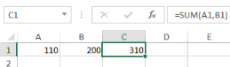
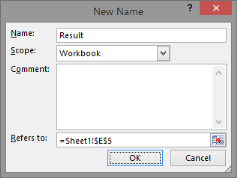
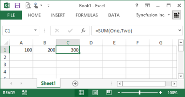
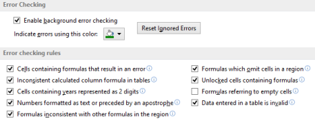

# Working with Formulas 

Formulas are entries in Excel that have equations where values are calculated for display. A typical formula might contain cells, constants, and even functions. Essential XlsIO has advanced support for working with Formulas. The following topics elaborate on the various types of formulas and their support by XlsIO.

## Using Formulas or Functions 

Excel supports various built-in functions that make large calculations in large sheets easier. The following sections illustrate the usage in XlsIO.

### Writing a Formula

In a spreadsheet, formulas can be entered by using the Formula property. The following code example illustrates the built-in function of Excel by using XlsIOAPIs.

 

// Step 1: Instantiates the spreadsheet creation engine.

ExcelEngine excelEngine = new ExcelEngine();

// Step 2: Instantiates the excel application object.

IApplication application = excelEngine.Excel;

// A new workbook is created. [Equivalent to creating a new workbook in MS Excel).

// The new workbook will have 2 worksheets.

IWorkbook workbook = application.Workbooks.Create(2);

IWorksheet sheet = workbook.Worksheets[0];

sheet.Range["C1"].Formula = "SUM(A1,B1)";

string fileName = "Output.xlsx";

workbook.Version = ExcelVersion.Excel2010;

workbook.SaveAs(fileName);

// Closes the workbook.

workbook.Close();

excelEngine.Dispose();         



 

' Step 1: Instantiates the spreadsheet creation engine.

Dim excelEngine As ExcelEngine = New ExcelEngine

' Step 2: Instantiates the excel application object.

Dim application As IApplication = excelEngine.Excel

' A new workbook is created. [Equivalent to creating a new workbook in MS Excel].

'The new workbook will have 2 worksheets.

Dim workbook As IWorkbook = application.Workbooks.Create(2)

' Accesses via index.

Dim sheet As IWorkbook = workbook.Worksheets(0)

sheet.Range("C1").Formula = "SUM(A1,B1)"

Dim fileName As String = "Output.xlsx"

workbook.Version = ExcelVersion.Excel2010

workbook.SaveAs(fileName)

' Closes the workbook.

workbook.Close()

excelEngine.Dispose()



##Writing a Formula across Worksheets

* Sheet1 and Sheet2 are the default names of the worksheets.
* In addition to being able to access values in the same worksheet, you can also access values across worksheets. Assume that B is present on the second worksheet, then use the following code for calculation. 

 

// Step 1: Instantiates the spreadsheet creation engine.

ExcelEngine excelEngine = new ExcelEngine();

// Step 2: Instantiates the excel application object.

IApplication application = excelEngine.Excel;

// A new workbook is created. [Equivalent to creating a new workbook in MS Excel).

// The new workbook will have 2 worksheets.

IWorkbook workbook = application.Workbooks.Create(2);

IWorksheet sheet = workbook.Worksheets[0];

sheet.Range["C2"].Formula = "=SUM(Sheet2!B2,Sheet1!A2)";

string fileName = "Output.xlsx";

workbook.Version = ExcelVersion.Excel2010;

workbook.SaveAs(fileName);

// Closes the workbook.

workbook.Close();

excelEngine.Dispose();         




' Step 1: Instantiates the spreadsheet creation engine.

Dim excelEngine As ExcelEngine = New ExcelEngine

' Step 2: Instantiates the excel application object.

Dim application As IApplication = excelEngine.Excel

' A new workbook is created. [Equivalent to creating a new workbook in MS Excel].

'The new workbook will have 2 worksheets.

Dim workbook As IWorkbook = application.Workbooks.Create(2)

' Accesses via index.

Dim sheet As IWorkbook = workbook.Worksheets(0)

sheet.Range("C2").Formula = "=SUM(Sheet2!B2,Sheet1!A2)"

Dim fileName As String = "Output.xlsx"

workbook.Version = ExcelVersion.Excel2010

workbook.SaveAs(fileName)

' Closes the workbook.

workbook.Close()

excelEngine.Dispose()


### Reading a Formula

XlsIO allows you to read formulas from a cell. The following code example illustrates how to read the formula from a cell.



// Step 1: Instantiates the spreadsheet creation engine.

ExcelEngine excelEngine = new ExcelEngine();

// Step 2: Instantiates the excel application object.

IApplication application = excelEngine.Excel;

// A new workbook is created. [Equivalent to creating a new workbook in MS Excel).

// The new workbook will have 2 worksheets.

IWorkbook workbook = application.Workbooks.Open("Sample.xlsx", ExcelOpenType.Automatic);

IWorksheet sheet = workbook.Worksheets[0];

//Returns the formula in A1 style notation.

string formula = sheet["C1"].Formula;

string fileName = "Output.xlsx";

workbook.Version = ExcelVersion.Excel2010;

workbook.SaveAs(fileName);

// Closes the workbook.

workbook.Close();

excelEngine.Dispose();         




' Step 1: Instantiates the spreadsheet creation engine.

Dim excelEngine As ExcelEngine = New ExcelEngine

' Step 2: Instantiates the excel application object.

Dim application As IApplication = excelEngine.Excel

' A new workbook is created. [Equivalent to creating a new workbook in MS Excel].

'The new workbook will have 2 worksheets.

Dim workbook As IWorkbook = application.Workbooks.Open("Sample.xlsx", ExcelOpenType.Automatic)

' Accesses via index.

Dim sheet As IWorkbook = workbook.Worksheets(0)

'Returns the formula in A1 style notation.

Dim formula as String = sheet("C1").Formula

Dim fileName As String = "Output.xlsx"

workbook.Version = ExcelVersion.Excel2010

workbook.SaveAs(fileName)

' Closes the workbook.

workbook.Close()

excelEngine.Dispose()


### Applying Augment Separators Based on Cultures

Formula separators vary for each culture/regional settings and throws exception if valid separators are not used for specific culture. This can be overcome by setting the separators by using the SetSeparators method of IWorkbook. The following code example illustrates how to change the formula separators through XlsIO.

 

// Step 1: Instantiates the spreadsheet creation engine.

ExcelEngine excelEngine = new ExcelEngine();

// Step 2: Instantiates the excel application object.

IApplication application = excelEngine.Excel;

// A new workbook is created. [Equivalent to creating a new workbook in MS Excel).

// The new workbook will have 2 worksheets.

IWorkbook workbook = application.Workbooks.Create(2);

IWorksheet sheet = workbook.Worksheets[0];

workbook.SetSeparators(";", ",");

string fileName = "Output.xlsx";

workbook.Version = ExcelVersion.Excel2010;

workbook.SaveAs(fileName);

// Closes the workbook.

workbook.Close();

excelEngine.Dispose();         




' Step 1: Instantiates the spreadsheet creation engine.

Dim excelEngine As ExcelEngine = New ExcelEngine

' Step 2: Instantiates the excel application object.

Dim application As IApplication = excelEngine.Excel

' A new workbook is created. [Equivalent to creating a new workbook in MS Excel].

'The new workbook will have 2 worksheets.

Dim workbook As IWorkbook = application.Workbooks.Create(2)

' Accesses via index.

Dim sheet As IWorkbook = workbook.Worksheets(0)

workbook.SetSeparators(";", ",")

Dim fileName As String = "Output.xlsx"

workbook.Version = ExcelVersion.Excel2010

workbook.SaveAs(fileName)

' Closes the workbook.

workbook.Close()

excelEngine.Dispose()


### Accessing Calculated value

XlsIO allows you to read formula from a cell and its calculated value. To perfom a calculation, the method EnableSheetCalculations in the worksheet object must be invoked. The following code example illustrates how a formula can be accessed and a calculated value accessed.



// Step 1: Instantiates the spreadsheet creation engine.

ExcelEngine excelEngine = new ExcelEngine();

// Step 2: Instantiates the excel application object.

IApplication application = excelEngine.Excel;

// A new workbook is created. [Equivalent to creating a new workbook in MS Excel).

// The new workbook will have 2 worksheets.

IWorkbook workbook = application.Workbooks.Open("Sample.xlsx", ExcelOpenType.Automatic);

IWorksheet sheet = workbook.Worksheets[0];

//Initializes Calculate Engine to perform the calculation.

sheet.EnableSheetCalculations();

//Returns the calculated value of a formula by using the current inputs.

string calculatedValue = sheet["C1"].CalculatedValue;

string fileName = "Output.xlsx";

workbook.Version = ExcelVersion.Excel2010;

workbook.SaveAs(fileName);

// Closes the workbook.

workbook.Close();

excelEngine.Dispose();         





' Step 1: Instantiates the spreadsheet creation engine.

Dim excelEngine As ExcelEngine = New ExcelEngine

' Step 2: Instantiates the excel application object.

Dim application As IApplication = excelEngine.Excel

' A new workbook is created. [Equivalent to creating a new workbook in MS Excel].

'The new workbook will have 2 worksheets.

Dim workbook As IWorkbook = application.Workbooks.Open("Sample.xlsx", ExcelOpenType.Automatic)

' Accesses via index.

Dim sheet As IWorkbook = workbook.Worksheets(0)

'Initializes Calculate Engine to perform calculation.

sheet.EnableSheetCalculations()

'Returns the calculated value of a formula by using the current inputs.

Dim calculatedValue As String = sheet("C1").CalculatedValue

Dim fileName As String = "Output.xlsx"

workbook.Version = ExcelVersion.Excel2010

workbook.SaveAs(fileName)

'Closes the workbook.

workbook.Close()

excelEngine.Dispose()



You can also get the Formula values as bool, date, and number type. Note that XlsIO can only read already computed formulas and cannot compute. CalculatedValue property must be called in prior to use these properties.



// Step 1: Instantiates the spreadsheet creation engine.

ExcelEngine excelEngine = new ExcelEngine();

// Step 2: Instantiates the excel application object.

IApplication application = excelEngine.Excel;

// A new workbook is created. [Equivalent to creating a new workbook in MS Excel).

// The new workbook will have 2 worksheets.

IWorkbook workbook = application.Workbooks.Open("Sample.xlsx", ExcelOpenType.Automatic);

IWorksheet sheet = workbook.Worksheets[0];

//Initializes Calculate Engine to perform calculation.

sheet.EnableSheetCalculations();

//Returns the calculated value of a formula by using the current inputs.

string calculatedValue = sheet["C1"].CalculatedValue;

//Returns Boolean value evaluated by the formula.

bool boolValue = sheet["C1"].FormulaBoolValue;

//Returns dateTime value evaluated by the formula.

DateTime dateTimeValue = sheet["C1"].FormulaDateTime;

//Returns number value evaluated by the formula.

double doubleValue = sheet["C1"].FormulaNumberValue;

string fileName = "Output.xlsx";

workbook.Version = ExcelVersion.Excel2010;

workbook.SaveAs(fileName);

// Closes the workbook.

workbook.Close();

excelEngine.Dispose();         




' Step 1: Instantiates the spreadsheet creation engine.

Dim excelEngine As ExcelEngine = New ExcelEngine

' Step 2: Instantiates the excel application object.

Dim application As IApplication = excelEngine.Excel

' A new workbook is created. [Equivalent to creating a new workbook in MS Excel].

'The new workbook will have 2 worksheets.

Dim workbook As IWorkbook = application.Workbooks.Open("Sample.xlsx", ExcelOpenType.Automatic)

'Accesses via index.

Dim sheet As IWorkbook = workbook.Worksheets(0)

'Initializes Calculate Engine to perform the calculation.

sheet.EnableSheetCalculations()

'Returns the calculated value of a formula by using the current inputs.

Dim calculatedValue As String = sheet("C1").CalculatedValue

'Returns boolean value evaluated by the formula.

Dim boolValue As Boolean = sheet("C1").FormulaBoolValue

'Returns dateTime value evaluated by the formula.

Dim dateTimeValue As DateTime = sheet("C1").FormulaDateTime

'Returns number value evaluated by the formula.

Dim doubleValue As Double = sheet("C1").FormulaNumberValue

Dim fileName As String = "Output.xlsx"

workbook.Version = ExcelVersion.Excel2010

workbook.SaveAs(fileName)

'Closes the workbook.

workbook.Close()

excelEngine.Dispose()



Following properties of the IRange interface are used to fetch formulas, computed values, and to check if there exists a formula in the cell.

_Properties of the IRange interface_

<table>
<tr>
<th>
Properties</th><th>
Description</th></tr>
<tr>
<td>
Formula</td><td>
Returns or sets the object's formula in A1-style notation and in the language of the macro. Read/write Variant.</td></tr>
<tr>
<td>
FormulaArray</td><td>
Represents array-entered formula. Visit {{ '[http://www.cpearson.com/excel/array.htm](http://www.cpearson.com/excel/ArrayFormulas.aspx)' | markdownify }} for more information. </td></tr>
<tr>
<td>
FormulaArrayR1C1</td><td>
Returns or sets the formula array for the range by using R1C1-style notation. </td></tr>
<tr>
<td>
FormulaBoolValue</td><td>
Returns the calculated value of the formula as a Boolean.</td></tr>
<tr>
<td>
FormulaDateTime</td><td>
Gets/sets formula DateTime value contained by this cell. DateTime.MinValue if not all cells of the range have same DateTime value. </td></tr>
<tr>
<td>
FormulaErrorValue</td><td>
Returns the calculated value of the formula as a string.</td></tr>
<tr>
<td>
FormulaHidden</td><td>
True if the formula is hidden when the worksheet is protected; False if at least part of formula in the range is not hidden.</td></tr>
<tr>
<td>
FormulaNumberValue</td><td>
Gets/sets number value evaluated by formula.</td></tr>
<tr>
<td>
FormulaR1C1</td><td>
Returns or sets the formula for the range by using R1C1-style notation. </td></tr>
<tr>
<td>
FormulaStringValue</td><td>
Gets/sets string value evaluated by formula. </td></tr>
<tr>
<td>
HasDataValidation</td><td>
Indicates whether specified range object has data validation. If Range is not single cell, then returns True only if all cells have data validation. This is Read-Only property.</td></tr>
<tr>
<td>
HasDateTime</td><td>
Indicates whether the range contains DateTime value. This is Read-Only property. </td></tr>
<tr>
<td>
HasExternalFormula</td><td>
Indicates if current range has external formula. This is a Read-Only property.</td></tr>
<tr>
<td>
HasFormula</td><td>
True if all cells in the range contain formulas; False if at least one of the cells in the range does not contain a formula. This is Read-Only property. </td></tr>
<tr>
<td>
HasFormulaArray</td><td>
Indicates whether range contains array-entered formula. This is Read-Only property.</td></tr>
<tr>
<td>
HasFormulaBoolValue</td><td>
Indicates if current range has formula boolean value. This is Read-Only property.</td></tr>
<tr>
<td>
HasFormulaDateTime</td><td>
Indicates if current range has formula value formatted as DateTime. This is Read-Only property.</td></tr>
<tr>
<td>
HasFormulaErrorValue</td><td>
Indicates if current range has formula error value. This is Read-Only property.</td></tr>
<tr>
<td>
HasNumber</td><td>
Indicates whether the range contains number. This is Read-Only property.</td></tr>
<tr>
<td>
HasRichText</td><td>
Indicates whether cell contains formatted rich text string. </td></tr>
<tr>
<td>
HasString</td><td>
Indicates whether the range contains String. This is Read-Only property.</td></tr>
<tr>
<td>
HasStyle</td><td>
Indicates whether range has default style. False means default style. This is Read-Only property.</td></tr>
<tr>
<td>
IgnoreErrorOptions</td><td>
Represents various ignore error options in Excel.</td></tr>
</table>

Refer to the Calculate Options for more information on dynamic formula computation.

### Array of Formula

Array Formula is a special type of formula in Excel. It works with an array or series of data values rather than a single data value. XlsIO supports the usage of Array formula through the FormulaArray property. The following code example explains how an array of values from Named Range is used for computation. For more details on Named Ranges, refer to the Defined Names.



// Step 1: Instantiates the spreadsheet creation engine.

ExcelEngine excelEngine = new ExcelEngine();

// Step 2: Instantiates the excel application object.

IApplication application = excelEngine.Excel;

// A new workbook is created. [Equivalent to creating a new workbook in MS Excel).

// The new workbook will have 2 worksheets.

IWorkbook workbook = application.Workbooks.Create(2);

IWorksheet sheet = workbook.Worksheets[0];

//Inserts Array Formula.

sheet.Range["A1:D1"].FormulaArray = "{1,2,3,4}";

sheet.Names.Add("ArrayRange", sheet.Range["A1:D1"]);

sheet.Range["A2:D2"].FormulaArray = "ArrayRange+100"; 

string fileName = "Output.xlsx";

workbook.Version = ExcelVersion.Excel2010;

workbook.SaveAs(fileName);

// Closes the workbook.

workbook.Close();

excelEngine.Dispose();         





' Step 1: Instantiates the spreadsheet creation engine.

Dim excelEngine As ExcelEngine = New ExcelEngine

' Step 2: Instantiates the excel application object.

Dim application As IApplication = excelEngine.Excel

' A new workbook is created. [Equivalent to creating a new workbook in MS Excel].

'The new workbook will have 2 worksheets.

Dim workbook As IWorkbook = application.Workbooks.Create(2)

'Accesses via index.

Dim sheet As IWorkbook = workbook.Worksheets(0)

'Inserts Array Formula.

sheet.Range("A1:D1").FormulaArray = "{1,2,3,4}"

sheet.Names.Add("ArrayRange",sheet.Range("A1:D1"))

sheet.Range("A2:D2").FormulaArray = "ArrayRange+100"

Dim fileName As String = "Output.xlsx"

workbook.Version = ExcelVersion.Excel2010

workbook.SaveAs(fileName)

'Closes the workbook.

workbook.Close()

excelEngine.Dispose()


### External Formula

Essential XlsIO allows you to insert/preserve formulas that refer to values in other worksheets/workbooks. Note that XlsIO can only write/preserve formulas. You cannot update/refresh the calculated values in Excel that should be refreshed by MS Excel. The following code example illustrates the insertion of a formula that refers to a value in another workbook.



// Step 1: Instantiates the spreadsheet creation engine.

ExcelEngine excelEngine = new ExcelEngine();

// Step 2: Instantiates the excel application object.

IApplication application = excelEngine.Excel;

// A new workbook is created. [Equivalent to creating a new workbook in MS Excel).

// The new workbook will have 2 worksheets.

IWorkbook workbook = application.Workbooks.Create(2);

IWorksheet sheet = workbook.Worksheets[0];

//Writes external Formula Value. 

sheet.Range["C1"].Formula = "[One.xls]Sheet1!$A$1*5";

string fileName = "Output.xlsx";

workbook.Version = ExcelVersion.Excel2010;

workbook.SaveAs(fileName);

// Closes the workbook.

workbook.Close();

excelEngine.Dispose();         




' Step 1: Instantiates the spreadsheet creation engine.

Dim excelEngine As ExcelEngine = New ExcelEngine

' Step 2: Instantiates the excel application object.

Dim application As IApplication = excelEngine.Excel

' A new workbook is created. [Equivalent to creating a new workbook in MS Excel].

'The new workbook will have 2 worksheets.

Dim workbook As IWorkbook = application.Workbooks.Create(2)

'Accesses via index.

Dim sheet As IWorkbook = workbook.Worksheets(0)

'Writes external Formula Value. 

sheet.Range["C1"].Formula = "[One.xls]Sheet1!$A$1*5"; 

Dim fileName As String = "Output.xlsx"

workbook.Version = ExcelVersion.Excel2010

workbook.SaveAs(fileName)

'Closes the workbook.

workbook.Close()

excelEngine.Dispose()



N> Enable automatic updation of links in Excel to view the result for the preceding code.

## Supported Functions

XlsIO supports all the formulas supported by MS Excel. Whereas, following is the list of functions that XlsIO performs calculation on and returns a calculated value.

_Functions that XlsIO performs calculations with_

<table>
<tr>
<th>
Functions</th><th>
Description</th></tr>
<tr>
<td>
ABS</td><td>
Returns the absolute value of a number.</td></tr>
<tr>
<td>
ACOS</td><td>
Returns the arccosine of a number.</td></tr>
<tr>
<td>
ACOSH</td><td>
Returns the inverse hyperbolic cosine of a number.</td></tr>
<tr>
<td>
ADDRESS</td><td>
Returns a reference as text to a single cell in a worksheet.</td></tr>
<tr>
<td>
AND</td><td>
Returns TRUE if all of its arguments are TRUE.</td></tr>
<tr>
<td>
AREAS</td><td>
Returns the number of areas in a reference.</td></tr>
<tr>
<td>
ASC</td><td>
Changes full-width (double-byte) English letters or katakana within a character string to half-width (single-byte) characters.</td></tr>
<tr>
<td>
ASIN</td><td>
Returns the arcsine of a number.</td></tr>
<tr>
<td>
ASINH</td><td>
Returns the inverse hyperbolic sine of a number.</td></tr>
<tr>
<td>
ATAN</td><td>
Returns the arctangent of a number.</td></tr>
<tr>
<td>
ATAN2</td><td>
Returns the arctangent from x- and y-coordinates.</td></tr>
<tr>
<td>
ATANH</td><td>
Returns the inverse hyperbolic tangent of a number.</td></tr>
<tr>
<td>
AVEDEV</td><td>
Returns the average of the absolute deviations of data points from their mean.</td></tr>
<tr>
<td>
AVERAGE</td><td>
Returns the average of its arguments.</td></tr>
<tr>
<td>
AVERAGEA</td><td>
Returns the average of its arguments, including numbers, text, and logical values.</td></tr>
<tr>
<td>
AVERAGEIF</td><td>
Returns the average (arithmetic mean) of all the cells in a range that meet a given criterion.</td></tr>
<tr>
<td>
AVERAGEIFS</td><td>
Returns the average (arithmetic mean) of all cells that meet multiple criteria.</td></tr>
<tr>
<td>
BESSELI</td><td>
Returns the modified Bessel function In(x).</td></tr>
<tr>
<td>
BESSELJ</td><td>
Returns the Bessel function Jn(x).</td></tr>
<tr>
<td>
BESSELK</td><td>
Returns the modified Bessel function Kn(x).</td></tr>
<tr>
<td>
BESSELY</td><td>
Returns the Bessel function Yn(x).</td></tr>
<tr>
<td>
BIN2DEC</td><td>
Converts a binary number to decimal.</td></tr>
<tr>
<td>
BIN2HEX</td><td>
Converts a binary number to hexadecimal.</td></tr>
<tr>
<td>
BIN2OCT</td><td>
Converts a binary number to octal.</td></tr>
<tr>
<td>
BINOMDIST</td><td>
Returns the individual term binomial distribution probability.</td></tr>
<tr>
<td>
CEILING</td><td>
Rounds a number to the nearest integer or to the nearest multiple of significance.</td></tr>
<tr>
<td>
CELL</td><td>
Returns information about the formatting, location, or contents of a cell.</td></tr>
<tr>
<td>
CHAR</td><td>
Returns the character specified by the code number.</td></tr>
<tr>
<td>
CHIDIST</td><td>
Returns the one-tailed probability of the chi-squared distribution.</td></tr>
<tr>
<td>
CHIINV</td><td>
Returns the inverse of the one-tailed probability of the chi-squared distribution.</td></tr>
<tr>
<td>
CHITEST</td><td>
Returns the test for independence.</td></tr>
<tr>
<td>
CHOOSE</td><td>
Chooses a value from a list of values.</td></tr>
<tr>
<td>
CLEAN</td><td>
Removes all nonprintable characters from text.</td></tr>
<tr>
<td>
CODE</td><td>
Returns a numeric code for the first character in a text string.</td></tr>
<tr>
<td>
COLUMN</td><td>
Returns the column number of a reference.</td></tr>
<tr>
<td>
COLUMNS</td><td>
Returns the number of columns in a reference.</td></tr>
<tr>
<td>
COMBIN</td><td>
Returns the number of combinations for a given number of objects.</td></tr>
<tr>
<td>
COMPLEX</td><td>
Converts real and imaginary coefficients into a complex number.</td></tr>
<tr>
<td>
CONCATENATE</td><td>
Joins several text items into one text item.</td></tr>
<tr>
<td>
CONFIDENCE</td><td>
Returns the confidence interval for a population mean.</td></tr>
<tr>
<td>
CONVERT</td><td>
Converts a number from one measurement system to another.</td></tr>
<tr>
<td>
CORREL</td><td>
Returns the correlation coefficient between two data sets.</td></tr>
<tr>
<td>
COS</td><td>
Returns the cosine of a number.</td></tr>
<tr>
<td>
COSH</td><td>
Returns the hyperbolic cosine of a number.</td></tr>
<tr>
<td>
COUNT</td><td>
Counts how many numbers are in the list of arguments.</td></tr>
<tr>
<td>
COUNTA</td><td>
Counts how many values are in the list of arguments.</td></tr>
<tr>
<td>
COUNTBLANK</td><td>
Counts the number of blank cells within a range.</td></tr>
<tr>
<td>
COUNTIF</td><td>
Counts the number of nonblank cells within a range that meet the given criteria.</td></tr>
<tr>
<td>
COVAR</td><td>
Returns covariance, the average of the products of paired deviations.</td></tr>
<tr>
<td>
CRITBINOM</td><td>
Returns the smallest value where the cumulative binomial distribution is less than or equal to a criterion value.</td></tr>
<tr>
<td>
CUMIPMT</td><td>
Returns the cumulative interest paid between two periods.</td></tr>
<tr>
<td>
CUMPRINC</td><td>
Returns the cumulative principal paid on a loan between two periods.</td></tr>
<tr>
<td>
DATE</td><td>
Returns the serial number of a particular date.</td></tr>
<tr>
<td>
DATEVALUE</td><td>
Converts a date in the form of text to a serial number.</td></tr>
<tr>
<td>
DAY</td><td>
Converts a serial number to a day of the month.</td></tr>
<tr>
<td>
DAYS360</td><td>
Calculates the number of days between two dates based on a 360-day year.</td></tr>
<tr>
<td>
DB</td><td>
Returns the depreciation of an asset for a specified period by using the fixed-declining balance method.</td></tr>
<tr>
<td>
DDB</td><td>
Returns the depreciation of an asset for a specified period by using the double-declining balance method or some other method that you specify.</td></tr>
<tr>
<td>
DEC2BIN</td><td>
Converts a decimal number to binary.</td></tr>
<tr>
<td>
DECHEX</td><td>
Converts a decimal number to hexadecimal.</td></tr>
<tr>
<td>
DEC2OCT</td><td>
Converts a decimal number to octal.</td></tr>
<tr>
<td>
DEGREES</td><td>
Converts radians to degrees.</td></tr>
<tr>
<td>
DELTA</td><td>
Tests whether two values are equal.</td></tr>
<tr>
<td>
DEVSQ</td><td>
Returns the sum of squares of deviations.</td></tr>
<tr>
<td>
DISC</td><td>
Returns the discount rate for a security.</td></tr>
<tr>
<td>
DOLLAR</td><td>
Converts a number to text by using the $ (dollar) currency format.</td></tr>
<tr>
<td>
DOLLARDE</td><td>
Converts a dollar price expressed as a fraction into a dollar price expressed as a decimal number.</td></tr>
<tr>
<td>
DOLLARFR</td><td>
Converts a dollar price expressed as a decimal number into a dollar price expressed as a fraction.</td></tr>
<tr>
<td>
DURATION</td><td>
Returns the annual duration of a security with periodic interest payments.</td></tr>
<tr>
<td>
EDATE</td><td>
Returns the serial number of the date that is the indicated number of months before or after the start date.</td></tr>
<tr>
<td>
EFFECT</td><td>
Returns the effective annual interest rate.</td></tr>
<tr>
<td>
EOMONTH</td><td>
Returns the serial number of the last day of the month before or after a specified number of months.</td></tr>
<tr>
<td>
ERF</td><td>
Returns the error function.</td></tr>
<tr>
<td>
ERFC</td><td>
Returns the complementary error function.</td></tr>
<tr>
<td>
ERROR.TYPE</td><td>
Returns a number corresponding to an error type.</td></tr>
<tr>
<td>
EVEN</td><td>
Rounds a number up to the nearest even integer.</td></tr>
<tr>
<td>
EXACT</td><td>
Checks to see if two text values are identical.</td></tr>
<tr>
<td>
EXP</td><td>
Returns {{ '_e_' | markdownify }} raised to the power of a given number.</td></tr>
<tr>
<td>
EXPONDIST</td><td>
Returns the exponential distribution.</td></tr>
<tr>
<td>
FACT</td><td>
Returns the factorial of a number.</td></tr>
<tr>
<td>
FACTDOUBLE</td><td>
Returns the double factorial of a number.</td></tr>
<tr>
<td>
FDIST</td><td>
Returns the F probability distribution.</td></tr>
<tr>
<td>
FIND, FINDB</td><td>
Finds one text value within another (case-sensitive).</td></tr>
<tr>
<td>
FINV</td><td>
Returns the inverse of the F probability distribution.</td></tr>
<tr>
<td>
FISHER</td><td>
Returns the Fisher transformation.</td></tr>
<tr>
<td>
FISHER</td><td>
Returns the inverse of the Fisher transformation.</td></tr>
<tr>
<td>
FIXED</td><td>
Formats a number as text with a fixed number of decimals.</td></tr>
<tr>
<td>
FLOOR</td><td>
Rounds a number down toward zero.</td></tr>
<tr>
<td>
FORECAST</td><td>
Returns a value along a linear trend.</td></tr>
<tr>
<td>
FV</td><td>
Returns the future value of an investment.</td></tr>
<tr>
<td>
FVSCHEDULE</td><td>
Returns the future value of an initial principal after applying a series of compound interest rates.</td></tr>
<tr>
<td>
GAMMADIST</td><td>
Returns the gamma distribution.</td></tr>
<tr>
<td>
GAMMAINV</td><td>
Returns the inverse of the gamma cumulative distribution.</td></tr>
<tr>
<td>
GAMMALIN</td><td>
Returns the natural logarithm of the gamma function, Γ(x).</td></tr>
<tr>
<td>
GCD</td><td>
Returns the greatest common divisor.</td></tr>
<tr>
<td>
GEOMEAN</td><td>
Returns the geometric mean.</td></tr>
<tr>
<td>
GESTEP</td><td>
Tests whether a number is greater than a threshold value.</td></tr>
<tr>
<td>
GROWTH</td><td>
Returns values along an exponential trend.</td></tr>
<tr>
<td>
HARMEAN</td><td>
Returns the harmonic mean.</td></tr>
<tr>
<td>
HEX2BIN</td><td>
Converts a hexadecimal number to binary.</td></tr>
<tr>
<td>
HEX2DEC</td><td>
Converts a hexadecimal number to decimal.</td></tr>
<tr>
<td>
HEX2OCT</td><td>
Converts a hexadecimal number to octal.</td></tr>
<tr>
<td>
HLOOKUP</td><td>
Looks in the top row of an array and returns the value of the indicated cell.</td></tr>
<tr>
<td>
HOUR</td><td>
Converts a serial number to an hour.</td></tr>
<tr>
<td>
HYPERLINK</td><td>
Creates a shortcut or jump that opens a document stored on a network server, an intranet, or the Internet.</td></tr>
<tr>
<td>
HYPGEOMDIST</td><td>
Returns the hypergeometric distribution.</td></tr>
<tr>
<td>
IF</td><td>
Specifies a logical test to perform.</td></tr>
<tr>
<td>
IFERROR</td><td>
Returns a specified value if a formula evaluates to an error.</td></tr>
<tr>
<td>
IMABS</td><td>
Returns the absolute value (modulus) of a complex number.</td></tr>
<tr>
<td>
IMAGINARY</td><td>
Returns the imaginary coefficient of a complex number.</td></tr>
<tr>
<td>
IMARGUMENT</td><td>
Returns the argument theta, an angle expressed in radians.</td></tr>
<tr>
<td>
IMCONJUGATE</td><td>
Returns the complex conjugate of a complex number.</td></tr>
<tr>
<td>
IMCOS</td><td>
Returns the cosine of a complex number.</td></tr>
<tr>
<td>
IMDIV</td><td>
Returns the quotient of two complex numbers.</td></tr>
<tr>
<td>
IMEXP</td><td>
Returns the exponential of a complex number.</td></tr>
<tr>
<td>
IMLN</td><td>
Returns the natural logarithm of a complex number.</td></tr>
<tr>
<td>
IMLOG10</td><td>
Returns the base-10 logarithm of a complex number.</td></tr>
<tr>
<td>
IMLOG2</td><td>
Returns the base-2 logarithm of a complex number.</td></tr>
<tr>
<td>
IMPOWER</td><td>
Returns a complex number raised to an integer power.</td></tr>
<tr>
<td>
IMPRODUCT</td><td>
Returns the product of complex numbers from 2 to 29.</td></tr>
<tr>
<td>
IMREAL</td><td>
Returns the real coefficient of a complex number.</td></tr>
<tr>
<td>
IMSIN</td><td>
Returns the sine of a complex number.</td></tr>
<tr>
<td>
IMSQRT</td><td>
Returns the square root of a complex number.</td></tr>
<tr>
<td>
IMSUB</td><td>
Returns the difference between two complex numbers.</td></tr>
<tr>
<td>
IMSUM</td><td>
Returns the sum of complex numbers.</td></tr>
<tr>
<td>
INDEX</td><td>
Uses an index to choose a value from a reference or array.</td></tr>
<tr>
<td>
INDIRECT</td><td>
Returns a reference indicated by a text value.</td></tr>
<tr>
<td>
INFO</td><td>
Returns information about the current operating environment.</td></tr>
<tr>
<td>
INT</td><td>
Rounds a number down to the nearest integer.</td></tr>
<tr>
<td>
INTERCEPT</td><td>
Returns the intercept of the linear regression line.</td></tr>
<tr>
<td>
INTRATE</td><td>
Returns the interest rate for a fully invested security.</td></tr>
<tr>
<td>
IPMT</td><td>
Returns the interest payment for an investment for a given period.</td></tr>
<tr>
<td>
IRR</td><td>
Returns the internal rate of return for a series of cash flows.</td></tr>
<tr>
<td>
ISBLANK</td><td>
Returns TRUE if the value is blank.</td></tr>
<tr>
<td>
ISERR</td><td>
Returns TRUE if the value is any error value except #N/A.</td></tr>
<tr>
<td>
ISERROR</td><td>
Returns TRUE if the value is any error value.</td></tr>
<tr>
<td>
ISEVEN</td><td>
Returns TRUE if the number is even.</td></tr>
<tr>
<td>
ISLOGICAL</td><td>
Returns TRUE if the value is a logical value.</td></tr>
<tr>
<td>
ISAN</td><td>
Returns TRUE if the value is the #N/A error value.</td></tr>
<tr>
<td>
ISNONTEXT</td><td>
Returns TRUE if the value is not text.</td></tr>
<tr>
<td>
ISNUMBER</td><td>
Returns TRUE if the value is a number.</td></tr>
<tr>
<td>
ISODD</td><td>
Returns TRUE if the number is odd.</td></tr>
<tr>
<td>
ISMPT</td><td>
Calculates the interest paid during a specific period of an investment.</td></tr>
<tr>
<td>
ISREF</td><td>
Returns TRUE if the value is a reference.</td></tr>
<tr>
<td>
ISTEXT</td><td>
Returns TRUE if the value is text.</td></tr>
<tr>
<td>
KURT</td><td>
Returns the kurtosis of a data set.</td></tr>
<tr>
<td>
LARGE</td><td>
Returns the k-th largest value in a data set.</td></tr>
<tr>
<td>
LCM</td><td>
Returns the least common multiple.</td></tr>
<tr>
<td>
LEFT, LEFTB</td><td>
Returns the leftmost characters from a text value.</td></tr>
<tr>
<td>
LEN, LENB</td><td>
Returns the number of characters in a text string.</td></tr>
<tr>
<td>
LN</td><td>
Returns the natural logarithm of a number.</td></tr>
<tr>
<td>
LOG</td><td>
Returns the logarithm of a number to a specified base.</td></tr>
<tr>
<td>
LOG10</td><td>
Returns the base-10 logarithm of a number.</td></tr>
<tr>
<td>
LOGEST</td><td>
Returns the parameters of an exponential trend.</td></tr>
<tr>
<td>
LOGINV</td><td>
Returns the inverse of the lognormal distribution.</td></tr>
<tr>
<td>
LOGNORMDIST</td><td>
Returns the cumulative lognormal distribution.</td></tr>
<tr>
<td>
LOOKUP</td><td>
Looks up values in a vector or array.</td></tr>
<tr>
<td>
LOWER</td><td>
Converts text to lowercase.</td></tr>
<tr>
<td>
MATCH</td><td>
Looks up values in a reference or array.</td></tr>
<tr>
<td>
MAX</td><td>
Returns the maximum value in a list of arguments.</td></tr>
<tr>
<td>
MAXA</td><td>
Returns the maximum value in a list of arguments, including numbers, text, and logical values.</td></tr>
<tr>
<td>
MDETERM</td><td>
Returns the matrix determinant of an array.</td></tr>
<tr>
<td>
MEDIAN</td><td>
Returns the median of the given numbers.</td></tr>
<tr>
<td>
MID, MIDB</td><td>
Returns a specific number of characters from a text string starting at the position you specify.</td></tr>
<tr>
<td>
MIN</td><td>
Returns the minimum value in a list of arguments</td></tr>
<tr>
<td>
MINA</td><td>
Returns the smallest value in a list of arguments, including numbers, text, and logical values.</td></tr>
<tr>
<td>
MINUTE</td><td>
Converts a serial number to a minute.</td></tr>
<tr>
<td>
MINVERSE</td><td>
Returns the matrix inverse of an array.</td></tr>
<tr>
<td>
MIRR</td><td>
Returns the internal rate of return where positive and negative cash flows are financed at different rates.</td></tr>
<tr>
<td>
MMULT</td><td>
Returns the matrix product of two arrays.</td></tr>
<tr>
<td>
MOD</td><td>
Returns the remainder from division.</td></tr>
<tr>
<td>
MODE</td><td>
Returns the most common value in a data set.</td></tr>
<tr>
<td>
MMONTH</td><td>
Converts a serial number to a month.</td></tr>
<tr>
<td>
MROUND</td><td>
Returns a number rounded to the desired multiple.</td></tr>
<tr>
<td>
MULTINOMINAL</td><td>
Returns the multinomial of a set of numbers.</td></tr>
<tr>
<td>
N</td><td>
Returns a value converted to a number.</td></tr>
<tr>
<td>
NA</td><td>
Returns the error value #N/A.</td></tr>
<tr>
<td>
NEGBINOMDIST</td><td>
Returns the negative binomial distribution.</td></tr>
<tr>
<td>
NETWORKDAYS</td><td>
Returns the number of whole workdays between two dates.</td></tr>
<tr>
<td>
NORMDIST</td><td>
Returns the normal cumulative distribution.</td></tr>
<tr>
<td>
NORMINV</td><td>
Returns the inverse of the normal cumulative distribution.</td></tr>
<tr>
<td>
NORMSDIST</td><td>
Returns the standard normal cumulative distribution.</td></tr>
<tr>
<td>
NORMSINV</td><td>
Returns the inverse of the standard normal cumulative distribution.</td></tr>
<tr>
<td>
NOT</td><td>
Reverses the logic of its argument.</td></tr>
<tr>
<td>
NOW</td><td>
Returns the serial number of the current date and time.</td></tr>
<tr>
<td>
NPER</td><td>
Returns the number of periods for an investment.</td></tr>
<tr>
<td>
NPV</td><td>
Returns the net present value of an investment based on a series of periodic cash flows and a discount rate.</td></tr>
<tr>
<td>
OCT2BIN</td><td>
Converts an octal number to binary.</td></tr>
<tr>
<td>
OCT2DEC</td><td>
Converts an octal number to decimal.</td></tr>
<tr>
<td>
OCT2HEX</td><td>
Converts an octal number to hexadecimal.</td></tr>
<tr>
<td>
ODD</td><td>
Rounds a number up to the nearest odd integer.</td></tr>
<tr>
<td>
OFFSET</td><td>
Returns a reference offset from a given reference.</td></tr>
<tr>
<td>
OR</td><td>
Returns TRUE if any argument is TRUE.</td></tr>
<tr>
<td>
PEARSON</td><td>
Returns the Pearson product moment correlation coefficient.</td></tr>
<tr>
<td>
PERCENTILE</td><td>
Returns the k-th percentile of values in a range.</td></tr>
<tr>
<td>
PERCENTRANK</td><td>
Returns the percentage rank of a value in a data set.</td></tr>
<tr>
<td>
PERMUT</td><td>
Returns the number of permutations for a given number of objects.</td></tr>
<tr>
<td>
PI</td><td>
Returns the value of pi.</td></tr>
<tr>
<td>
PMT</td><td>
Returns the periodic payment for an annuity.</td></tr>
<tr>
<td>
POISSON</td><td>
Returns the Poisson distribution.</td></tr>
<tr>
<td>
POWER</td><td>
Returns the result of a number raised to a power.</td></tr>
<tr>
<td>
PPMT</td><td>
Returns the payment on the principal for an investment for a given period.</td></tr>
<tr>
<td>
PROB</td><td>
Returns the probability that values in a range are between two limits.</td></tr>
<tr>
<td>
PRODUCT</td><td>
Multiplies its arguments.</td></tr>
<tr>
<td>
PROPER</td><td>
Capitalizes the first letter in each word of a text value.</td></tr>
<tr>
<td>
PV</td><td>
Returns the present value of an investment.</td></tr>
<tr>
<td>
QUARTILE</td><td>
Returns the quartile of a data set.</td></tr>
<tr>
<td>
QUOTIENT</td><td>
Returns the integer portion of a division.</td></tr>
<tr>
<td>
RADIANS</td><td>
Converts degrees to radians.</td></tr>
<tr>
<td>
RAND</td><td>
Returns a random number between 0 and 1.</td></tr>
<tr>
<td>
RANDBETWEEN</td><td>
Returns a random number between the numbers you specify.</td></tr>
<tr>
<td>
RANK</td><td>
Returns the rank of a number in a list of numbers.</td></tr>
<tr>
<td>
RATE</td><td>
Returns the interest rate per period of an annuity.</td></tr>
<tr>
<td>
RECEIVED</td><td>
Returns the amount received at maturity for a fully invested security.</td></tr>
<tr>
<td>
REPLACE, REPLACEB</td><td>
Replaces characters within text.</td></tr>
<tr>
<td>
REPT</td><td>
Repeats text a given number of times.</td></tr>
<tr>
<td>
RIGHT, RIGHTB</td><td>
Returns the rightmost characters from a text value.</td></tr>
<tr>
<td>
ROMAN</td><td>
Converts an arabic numeral to roman, as text.</td></tr>
<tr>
<td>
ROUND</td><td>
Rounds a number to a specified number of digits.</td></tr>
<tr>
<td>
ROUNDDOWN</td><td>
Rounds a number down, toward zero</td></tr>
<tr>
<td>
ROUNDUP</td><td>
Rounds a number up, away from zero</td></tr>
<tr>
<td>
ROW</td><td>
Returns the row number of a reference</td></tr>
<tr>
<td>
ROWS</td><td>
Returns the number of rows in a reference</td></tr>
<tr>
<td>
RSQ</td><td>
Returns the square of the Pearson product moment correlation coefficient</td></tr>
<tr>
<td>
SEARCH, SEARCHB</td><td>
Finds one text value within another (not case-sensitive)</td></tr>
<tr>
<td>
SECOND</td><td>
Converts a serial number to a second</td></tr>
<tr>
<td>
SERIESSUM</td><td>
Returns the sum of a power series based on the formula</td></tr>
<tr>
<td>
SIGN</td><td>
Returns the sign of a number</td></tr>
<tr>
<td>
SIN</td><td>
Returns the sine of the given angle</td></tr>
<tr>
<td>
SINH</td><td>
Returns the hyperbolic sine of a number</td></tr>
<tr>
<td>
SKEW</td><td>
Returns the skewness of a distribution</td></tr>
<tr>
<td>
SLN</td><td>
Returns the straight-line depreciation of an asset for one period</td></tr>
<tr>
<td>
SLOPE</td><td>
Returns the slope of the linear regression line</td></tr>
<tr>
<td>
SMALL</td><td>
Returns the k-th smallest value in a data set</td></tr>
<tr>
<td>
SQRT</td><td>
Returns a positive square root</td></tr>
<tr>
<td>
SQRTPI</td><td>
Returns the square root of (number * pi)</td></tr>
<tr>
<td>
STANDARDIZE</td><td>
Returns a normalized value</td></tr>
<tr>
<td>
STDEV</td><td>
Estimates standard deviation based on a sample</td></tr>
<tr>
<td>
STDEVA</td><td>
Estimates standard deviation based on a sample, including numbers, text, and logical values</td></tr>
<tr>
<td>
STDEVP</td><td>
Calculates standard deviation based on the entire population</td></tr>
<tr>
<td>
STDEVPA</td><td>
Calculates standard deviation based on the entire population, including numbers, text, and logical values</td></tr>
<tr>
<td>
STEYX</td><td>
Returns the standard error of the predicted y-value for each x in the regression</td></tr>
<tr>
<td>
SUBSTITUTE</td><td>
Substitutes new text for old text in a text string</td></tr>
<tr>
<td>
SUBTOTAL</td><td>
Returns a subtotal in a list or database</td></tr>
<tr>
<td>
SUM</td><td>
Adds its arguments</td></tr>
<tr>
<td>
SUMIF</td><td>
Adds the cells specified by a given criteria</td></tr>
<tr>
<td>
SUMPRODUCT</td><td>
Returns the sum of the products of corresponding array components</td></tr>
<tr>
<td>
SUMSQ</td><td>
Returns the sum of the squares of the arguments</td></tr>
<tr>
<td>
SUMX2MY2</td><td>
Returns the sum of the difference of squares of corresponding values in two arrays</td></tr>
<tr>
<td>
SUMX2PY2</td><td>
Returns the sum of the sum of squares of corresponding values in two arrays</td></tr>
<tr>
<td>
SUMXMY2</td><td>
Returns the sum of squares of differences of corresponding values in two arrays</td></tr>
<tr>
<td>
SYD</td><td>
Returns the sum-of-years' digits depreciation of an asset for a specified period</td></tr>
<tr>
<td>
T</td><td>
Converts its arguments to text</td></tr>
<tr>
<td>
TAN</td><td>
Returns the tangent of a number</td></tr>
<tr>
<td>
TANH</td><td>
Returns the hyperbolic tangent of a number</td></tr>
<tr>
<td>
TEXT</td><td>
Formats a number and converts it to text</td></tr>
<tr>
<td>
TIME</td><td>
Returns the serial number of a particular time</td></tr>
<tr>
<td>
TIMEVALUE</td><td>
Converts a time in the form of text to a serial number</td></tr>
<tr>
<td>
TODAY</td><td>
Returns the serial number of today's date</td></tr>
<tr>
<td>
TRANSPORSE</td><td>
Returns the transpose of an array</td></tr>
<tr>
<td>
TRIM</td><td>
Removes spaces from text</td></tr>
<tr>
<td>
TRIMMEAN</td><td>
Returns the mean of the interior of a data set</td></tr>
<tr>
<td>
TRUNC</td><td>
Truncates a number to an integer</td></tr>
<tr>
<td>
TYPE</td><td>
Returns a number indicating the data type of a value</td></tr>
<tr>
<td>
UPPER</td><td>
Converts text to uppercase</td></tr>
<tr>
<td>
VALUE</td><td>
Converts a text argument to a number</td></tr>
<tr>
<td>
VAR</td><td>
Estimates variance based on a sample</td></tr>
<tr>
<td>
VARA</td><td>
Estimates variance based on a sample, including numbers, text, and logical values</td></tr>
<tr>
<td>
VARP</td><td>
Calculates variance based on the entire population</td></tr>
<tr>
<td>
VARPA</td><td>
Calculates variance based on the entire population, including numbers, text, and logical values</td></tr>
<tr>
<td>
VDB</td><td>
Returns the depreciation of an asset for a specified or partial period by using a declining balance method</td></tr>
<tr>
<td>
VLOOKUP</td><td>
Looks in the first column of an array and moves across the row to return the value of a cell</td></tr>
<tr>
<td>
WEEKDAY</td><td>
Converts a serial number to a day of the week</td></tr>
<tr>
<td>
WEEKNUM</td><td>
Converts a serial number to a number representing where the week falls numerically with a year</td></tr>
<tr>
<td>
WEIBULL</td><td>
Returns the Weibull distribution</td></tr>
<tr>
<td>
WORKDAY</td><td>
Returns the serial number of the date before or after a specified number of workdays</td></tr>
<tr>
<td>
XIRR</td><td>
Returns the internal rate of return for a schedule of cash flows that is not necessarily periodic</td></tr>
<tr>
<td>
YEAR</td><td>
Converts a serial number to a year</td></tr>
<tr>
<td>
YEARFRAC</td><td>
Returns the year fraction representing the number of whole days between start_date and end_date</td></tr>
<tr>
<td>
ZTEST</td><td>
Returns the one-tailed probability-value of a z-test</td></tr>
<tr>
<td>
FLASE</td><td>
Returns the logical value FALSE</td></tr>
<tr>
<td>
TRUE</td><td>
Returns the logical value TRUE</td></tr>
</table>
## Defined Names 

Named Ranges is a powerful feature in Excel that makes it possible to assign a name to a group of cells. XlsIO has APIs for inserting new named ranges into workbooks and also to read existing named ranges. Named Ranges are mainly used in formulas. It enables better readability, predict at a glance what it is and what is added up with the meaningful range names. 

To create Named Ranges in MS Excel, open Formulas tab and click Define Name button under Defined Names section. Names are created at workbook-level, by default, but you can create a sheet-level name, by entering the sheet name followed by an exclamation mark (!), followed by the name of the range. For instance, to create a named range TEST on Sheet1, enter the name as 'Sheet1!TEST'.

You can create named ranges in spreadsheets through XlsIO with the IName interface. Range for the name is specified through RefersToRange property from where you can access the Range text and other information. This can be specified for workbooks and worksheets. 

###Accessing a Named Range

The following code example illustrates how to create workbook-level named ranges and use it in formulas.



// Step 1: Instantiates the spreadsheet creation engine.

ExcelEngine excelEngine = new ExcelEngine();

// Step 2: Instantiates the excel application object.

IApplication application = excelEngine.Excel;

// A new workbook is created. [Equivalent to creating a new workbook in MS Excel).

// The new workbook will have 2 worksheets.

IWorkbook workbook = application.Workbooks.Create(2);

// The first worksheet object in the worksheets collection is accessed.

IWorksheet sheet = workbook.Worksheets[0];

// Defines the Range and uses it in the Formula.

IName name1 = workbook.Names.Add("One");

name1.RefersToRange = sheet.Range["A1"];

IName name2 = workbook.Names.Add("Two");

name2.RefersToRange = sheet.Range["B1"];

//Formula by using Defined Names.

sheet.Range["C1"].Formula = "=SUM(One,Two)";

string fileName = "Output.xlsx";

workbook.Version = ExcelVersion.Excel2010;

workbook.SaveAs(fileName);

// Closes the workbook.

workbook.Close();

excelEngine.Dispose();         





' Step 1: Instantiates the spreadsheet creation engine.

Dim excelEngine As ExcelEngine = New ExcelEngine

' Step 2: Instantiates the excel application object.

Dim application As IApplication = excelEngine.Excel

' A new workbook is created. [Equivalent to creating a new workbook in MS Excel].

'The new workbook will have 2 worksheets.

Dim workbook As IWorkbook = application.Workbooks.Create(2)

'Accesses via index.

Dim sheet As IWorkbook = workbook.Worksheets(0)

'Defines the Range and by using it in the Formula.

Dim name1 As IName = workbook.Names.Add("One")

name1.RefersToRange = sheet.Range("A1")

Dim name2 As IName = workbook.Names.Add("Two")

name2.RefersToRange = sheet.Range("B1")

'Formula by using Defined Names.

sheet.Range("C1").Formula = "=SUM(One,Two)"

Dim fileName As String = "Output.xlsx"

workbook.Version = ExcelVersion.Excel2010

workbook.SaveAs(fileName)

'Closes the workbook.

workbook.Close()

excelEngine.Dispose()


###Accessing Sheet-Level Named Ranges

The following code example illustrates how to get/set sheet-level named ranges.



// Step 1: Instantiates the spreadsheet creation engine.

ExcelEngine excelEngine = new ExcelEngine();

// Step 2: Instantiates the excel application object.

IApplication application = excelEngine.Excel;

// A new workbook is created. [Equivalent to creating a new workbook in MS Excel).

// The new workbook will have 2 worksheets.

IWorkbook workbook = application.Workbooks.Create(2);

IWorksheet sheet = workbook.Worksheets[0];

//Adds a name.

IName name1 = sheet.Names.Add("CellName");

name1.RefersToRange = sheet.Range["A1"];

// Gets a name.

Console.Writeline(sheet.Names["CellName"].Value);

string fileName = "Output.xlsx";

workbook.Version = ExcelVersion.Excel2010;

workbook.SaveAs(fileName);

//Closes the workbook.

workbook.Close();

excelEngine.Dispose();         





' Step 1: Instantiates the spreadsheet creation engine.

Dim excelEngine As ExcelEngine = New ExcelEngine

' Step 2: Instantiates the excel application object.

Dim application As IApplication = excelEngine.Excel

' A new workbook is created. [Equivalent to creating a new workbook in MS Excel].

'The new workbook will have 2 worksheets.

Dim workbook As IWorkbook = application.Workbooks.Create(2)

' Accesses via index.

Dim sheet As IWorkbook = workbook.Worksheets(0)

Dim sheet As IWorksheet =  workbook.Worksheets(0) 

'Adds a name.

Dim name1 As IName = sheet.Names.Add("CellName")

name1.RefersToRange = sheet.Range("A1")

'Gets a name.

Console.Writeline(sheet.Names("CellName").Value)

Dim fileName As String = "Output.xlsx"

workbook.Version = ExcelVersion.Excel2010

workbook.SaveAs(fileName)

'Closes the workbook.

workbook.Close()

excelEngine.Dispose();



You can get/read all the names from a worksheet or workbook just by enumerating the INames collection as follows.



// Step 1: Instantiates the spreadsheet creation engine.

ExcelEngine excelEngine = new ExcelEngine();

// Step 2: Instantiates the excel application object.

IApplication application = excelEngine.Excel;

// A new workbook is created. [Equivalent to creating a new workbook in MS Excel).

// The new workbook will have 2 worksheets.

IWorkbook workbook = application.Workbooks.Create(2);

IWorksheet sheet = workbook.Worksheets[0];

//Reads workbook-level named ranges.

for (int i = 0; i <= workbook.Names.Count; i++)

{

    Console.WriteLine(workbook.Names[i].Name.ToString());

    Console.WriteLine(workbook.Names[i].RefersToRange.Address.ToString());

    Console.WriteLine(workbook.Names[i].Value.ToString());

}

//Reads worksheet-level named ranges.

for (int i = 0; i <= worksheet.Names.Count; i++)

{

    Console.WriteLine(worksheet.Names[i].Name.ToString());

    Console.WriteLine(worksheet.Names[i].RefersToRange.Address.ToString());

    Console.WriteLine(worksheet.Names[i].Value.ToString());

}

string fileName = "Output.xlsx";

workbook.Version = ExcelVersion.Excel2010;

workbook.SaveAs(fileName);

//Closes the workbook.

workbook.Close();

excelEngine.Dispose();         





' Step 1: Instantiates the spreadsheet creation engine.

Dim excelEngine As ExcelEngine = New ExcelEngine

' Step 2: Instantiates the excel application object.

Dim application As IApplication = excelEngine.Excel

' A new workbook is created. [Equivalent to creating a new workbook in MS Excel].

'The new workbook will have 2 worksheets.

Dim workbook As IWorkbook = application.Workbooks.Create(2)

' Accesses via index.

Dim sheet As IWorkbook = workbook.Worksheets(0)

Dim i As Integer

'Reads workbook-level named ranges.

For  i = 0 To workbook.Names.Count Step  i + 1

     Console.WriteLine(workbook.Names(i).Name.ToString())

     Console.WriteLine(workbook.Names(i).RefersToRange.Address.ToString())

     Console.WriteLine(workbook.Names(i).Value.ToString())

Next

'Reads worksheet-level named ranges.

For  i = 0 To worksheet.Names.Count Step  i + 1

     Console.WriteLine(worksheet.Names(i).Name.ToString())

     Console.WriteLine(worksheet.Names(i).RefersToRange.Address.ToString())

     Console.WriteLine(worksheet.Names(i).Value.ToString())

Next

Dim fileName As String = "Output.xlsx"

workbook.Version = ExcelVersion.Excel2010

workbook.SaveAs(fileName)

' Closes the workbook.

workbook.Close()

excelEngine.Dispose()



You can also delete a name in the workbook/worksheet by using the Delete method of IName. Note that deleting the cell does not delete the name from the Name collection.

_Properties of IName_

<table>
<tr>
<th>
Properties</th><th>
Description</th></tr>
<tr>
<td>
Index</td><td>
Returns the index number of the Name object within the collection. This is Read-Only property.</td></tr>
<tr>
<td>
IsLocal</td><td>
Indicates whether name is local. </td></tr>
<tr>
<td>
Name</td><td>
Returns or sets the name of the object. Read/Write String. </td></tr>
<tr>
<td>
NameLocal</td><td>
Returns or sets the name of the object in the language of the user. Read/Write String for Name. </td></tr>
<tr>
<td>
RefersToRange</td><td>
Gets/sets the Range associated with the Name object.</td></tr>
<tr>
<td>
Value</td><td>
Returns a string containing the formula that the name is defined to is referred. The string is in A1-style notation in the language of the macro, without an equal sign.</td></tr>
<tr>
<td>
ValueR1C1</td><td>
Gets named range Value in R1C1 style. This is Read-Only property.</td></tr>
<tr>
<td>
Visible</td><td>
Determines whether the object is visible. Read/Write Boolean.</td></tr>
<tr>
<td>
Scope</td><td>
Returns the scope of the name range.</td></tr>
</table>

##Scope of Named Range

The scope of the named range can be accessed as follows. 



// Step 1: Instantiates the spreadsheet creation engine.

ExcelEngine excelEngine = new ExcelEngine();

// Step 2: Instantiates the excel application object.

IApplication application = excelEngine.Excel;

// A new workbook is created. [Equivalent to creating a new workbook in MS Excel).

// The new workbook will have 2 worksheets.

IWorkbook workbook = application.Workbooks.Create(2);

IWorksheet sheet = workbook.Worksheets[0];

IName name = workbook.Names.Add("Name1");

name.RefersToRange = sheet.Range["A1"];

Console.WriteLine(name.Scope);

string fileName = "Output.xlsx";

workbook.Version = ExcelVersion.Excel2010;

workbook.SaveAs(fileName);

// Closes the workbook.

workbook.Close();

excelEngine.Dispose();         





' Step 1: Instantiates the spreadsheet creation engine.

Dim excelEngine As ExcelEngine = New ExcelEngine

' Step 2: Instantiates the excel application object.

Dim application As IApplication = excelEngine.Excel

' A new workbook is created. [Equivalent to creating a new workbook in MS Excel].

'The new workbook will have 2 worksheets.

Dim workbook As IWorkbook = application.Workbooks.Create(2)

' Accesses via index.

Dim sheet As IWorkbook = workbook.Worksheets(0)

Dim name As IN IName ame  = workbook.Names.Add("Name1")

name.RefersToRange = sheet.Range("A1")

Console.WriteLine(name.Scope)

Dim fileName As String = "Output.xlsx"

workbook.Version = ExcelVersion.Excel2010

workbook.SaveAs(fileName)

' Closes the workbook.

workbook.Close()

excelEngine.Dispose()


## Formula Auditing

Excel has an option to find the quickest way to identify any cell that contains an error on the active worksheet and ignore the error that shows with green indicator through the Error Checking dialog box. This dialog box provides various options to get information on the error, how a formula is evaluated, its trace, and an option to ignore the error by changing its data type.

Excel has the following set of rules that can be enabled or disabled to show/hide warnings with green indicators.

* Evaluates to Error Value-This rule treats cells containing formulas that result in an error and displays a warning.
* Text Date-This rule treats formulas that contain text formatted cells with years represented in 2-digits as an error and displays a warning while checking for errors.
* Number stored as Text-This rule treats numbers formatted as text or preceded by an apostrophe as an error, and displays a warning.
* Inconsistent Formula in Region-This rule treats a formula in a region worksheet that differs from the other formulas in the same region as an error and displays a warning.
* Formula omits Cells in Region-This rule treats formulas that omit certain cells in a region as an error and displays a warning.
* Unlocked Cells containing Formulas-This rule treats an unlocked cell containing a formula as an error and displays a warning when checking for errors.
* Formulas referring to Empty Cells-This rule treats formulas that refer to empty cells as an error and displays a warning.

XlsIO provides all the above options to ignore errors and remove the green indicators. This can be done through the IgnoreErrorOptions property of the IRange interface.

Following are the values that can be set for the IgnoreError option, through the ExcelIgnoreError enumerator.

_Values that can be set for the IgnoreError option_

<table>
<tr>
<th>
Members</th><th>
Description</th></tr>
<tr>
<td>
None</td><td>
Disaplays all the erros. </td></tr>
<tr>
<td>
EvaluateToError</td><td>
Ignores error due to EvaluateToError flag of excel ignore error indicator. </td></tr>
<tr>
<td>
EmptyCellReferences</td><td>
Ignores error due to EmptyCellReferences flag of excel ignore error indicator. </td></tr>
<tr>
<td>
NumberAsText</td><td>
Ignores error due to NumberAsText flag of excel ignore error indicator. </td></tr>
<tr>
<td>
OmittedCells</td><td>
Ignores error due to OmittedCells flag of excel ignore error indicator. </td></tr>
<tr>
<td>
InconsistentFormula</td><td>
Ignores error due to InconsistentFormula flag of excel ignore error indicator. </td></tr>
<tr>
<td>
TextDate</td><td>
Ignores error due to TextDate flag of excel ignore error indicator. </td></tr>
<tr>
<td>
UnlockedFormulaCells</td><td>
Ignores error due to UnlockedFormulaCells flag of excel ignore error indicator. </td></tr>
<tr>
<td>
All</td><td>
Ignores all the errors due to above flags. </td></tr>
</table>

The following code example illustrates how to ignore or set an error indicator.



// Step 1: Instantiates the spreadsheet creation engine.

ExcelEngine excelEngine = new ExcelEngine();

// Step 2: Instantiates the excel application object.

IApplication application = excelEngine.Excel;

// A new workbook is created. [Equivalent to creating a new workbook in MS Excel).

// The new workbook will have 2 worksheets.

IWorkbook workbook = application.Workbooks.Create(2);

IWorksheet sheet = workbook.Worksheets[0];

// Sets warning if number is entered as text.

sheet.Range["A2:D2"].IgnoreErrorOptions = ExcelIgnoreError.NumberAsText;

// Ignores all the error warnings.

sheet.Range["A3"].IgnoreErrorOptions = ExcelIgnoreError.None;

string fileName = "Output.xlsx";

workbook.Version = ExcelVersion.Excel2010;

workbook.SaveAs(fileName);

// Closes the workbook.

workbook.Close();

excelEngine.Dispose();         





' Step 1: Instantiates the spreadsheet creation engine.

Dim excelEngine As ExcelEngine = New ExcelEngine

' Step 2: Instantiates the excel application object.

Dim application As IApplication = excelEngine.Excel

' A new workbook is created. [Equivalent to creating a new workbook in MS Excel].

'The new workbook will have 2 worksheets.

Dim workbook As IWorkbook = application.Workbooks.Create(2)

' Accesses via index.

Dim sheet As IWorkbook = workbook.Worksheets(0)

' Sets warning if number is entered as text.

sheet.Range["A2:D2"].IgnoreErrorOptions = ExcelIgnoreError.NumberAsText

' Ignores all the error warnings.

sheet.Range["A3"].IgnoreErrorOptions = ExcelIgnoreError.None

Dim fileName As String = "Output.xlsx"

workbook.Version = ExcelVersion.Excel2010

workbook.SaveAs(fileName)

' Closes the workbook.

workbook.Close()

excelEngine.Dispose()


## Calculate Options 

This section explains various options that enables customizations of the formula calculations according to the need. It also demonstrates how XlsIO can be linked with Essential Calculate that acts as an Excel engine to calculate Formula values.

Excel has a range of options that allows you to control the way it calculates. To do this, open Tools menu, select Options, and click Calculation tab in the Options dialog box. By default, when one value is changed, the other cell that depends on this immediately changes. This behavior can be changed by using the following Modes of Calculations.

* Automatic
* Automatic except for Data Tables
* Manual

##Automatic Calculation

In the Automatic Calculation mode, Excel automatically recalculates all open workbooks at each and every change and also whenever you open a workbook. Usually when you open a workbook in Automatic mode and recalculate, you cannot be able to see the recalculation because the changes are not reflected until the workbook is saved. An exception is raised when you open a workbook in Excel 2000 that is saved by using Excel 97 or open a workbook by using Excel 2002/2003 saved by using Excel 2000. This is because Excel's calculation engines are different and also because a Full calculation is done.

###Automatic Except Tables

Excel's Data Tables feature is designed to perform multiple calculations of the workbook, each driven by different values in the table. So using Automatic except Tables stop Excel from automatically triggering multiple calculations at each calculation, but still calculates all dependent formulae except tables.

###Manual Calculation

In the Manual Calculation mode, Excel only recalculates all open workbooks when you request it by pressing F9 or CTRL-ALT-F9, or when you Save a workbook. For workbooks taking more than a fraction of a second to recalculate, it is usually better to set the Calculation to Manual. Excel tells you when the workbook needs recalculation by showing Calculate in the status bar.   

XlsIO provides support for all the above modes of calculation. The following code example illustrates how to set the calculation mode.



// Step 1: Instantiates the spreadsheet creation engine.

ExcelEngine excelEngine = new ExcelEngine();

// Step 2: Instantiates the excel application object.

IApplication application = excelEngine.Excel;

// A new workbook is created. [Equivalent to creating a new workbook in MS Excel).

// The new workbook will have 2 worksheets.

IWorkbook workbook = application.Workbooks.Create(2);

IWorksheet sheet = workbook.Worksheets[0];

workbook.CalculationOptions.CalculationMode = ExcelCalculationMode.Manual;

string fileName = "Output.xlsx";

workbook.Version = ExcelVersion.Excel2010;

workbook.SaveAs(fileName);

// Closes the workbook.

workbook.Close();

excelEngine.Dispose();         





' Step 1: Instantiates the spreadsheet creation engine.

Dim excelEngine As ExcelEngine = New ExcelEngine

' Step 2: Instantiates the excel application object.

Dim application As IApplication = excelEngine.Excel

' A new workbook is created. [Equivalent to creating a new workbook in MS Excel].

'The new workbook will have 2 worksheets.

Dim workbook As IWorkbook = application.Workbooks.Create(2)

'Accesses via index.

Dim sheet As IWorkbook = workbook.Worksheets(0)

workbook.CalculationOptions.CalculationMode = ExcelCalculationMode.Manual

Dim fileName As String = "Output.xlsx"

workbook.Version = ExcelVersion.Excel2010

workbook.SaveAs(fileName)

'Closes the workbook.

workbook.Close()

excelEngine.Dispose()



There are other options that Excel provides to customize the calculation further.

###Recalculate Before Save

In Manual mode, this option controls whether Excel recalculates the workbook as part of the Save process. The default value is set to True. You can control this through XlsIO by using the RecalcOnSave property of ICalculationOptions interface.

###Iteration

When you have intentional circular references in your workbook, these settings allow you to control the maximum number of times the workbook is recalculated (iterations), and the convergence criteria (maximum change: when to stop). The default value should be set to False so that Excel does not try to solve accidental circular references. XlsIO allows control of these iterations as follows.



// Step 1: Instantiates the spreadsheet creation engine.

ExcelEngine excelEngine = new ExcelEngine();

// Step 2: Instantiates the excel application object.

IApplication application = excelEngine.Excel;

// A new workbook is created. [Equivalent to creating a new workbook in MS Excel).

// The new workbook will have 2 worksheets.

IWorkbook workbook = application.Workbooks.Create(2);

IWorksheet sheet = workbook.Worksheets[0];

workbook.CalculationOptions.IsIterationEnabled = true;

workbook.CalculationOptions.MaximumIteration = 99;

workbook.CalculationOptions.MaximumChange = 40;

string fileName = "Output.xlsx";

workbook.Version = ExcelVersion.Excel2010;

workbook.SaveAs(fileName);

// Closes the workbook.

workbook.Close();

excelEngine.Dispose();         




'Step 1: Instantiates the spreadsheet creation engine.

Dim excelEngine As ExcelEngine = New ExcelEngine

'Step 2: Instantiates the excel application object.

Dim application As IApplication = excelEngine.Excel

'A new workbook is created. [Equivalent to creating a new workbook in MS Excel].

'The new workbook will have 2 worksheets.

Dim workbook As IWorkbook = application.Workbooks.Create(2)

'Accesses via index.

Dim sheet As IWorkbook = workbook.Worksheets(0)

workbook.CalculationOptions.IsIterationEnabled = True

workbook.CalculationOptions.MaximumIteration = 99

workbook.CalculationOptions.MaximumChange = 40

Dim fileName As String = "Output.xlsx"

workbook.Version = ExcelVersion.Excel2010

workbook.SaveAs(fileName)

'Closes the workbook.

workbook.Close()

excelEngine.Dispose()


#### Calculation Engine

Essential XlsIO has a calculation engine of its own and can compute the values of the formula entered during runtime. Essential Calculate is now [from v9.1.x.x] integrated with Essential XlsIO, and thus makes it possible to get the values of the formula entered by using XlsIO during runtime without any additional references or packages. Currently, there are over 180+ functions that are supported by this Calculate engine covering all common usage scenarios.

Sample Link

To understand this process, consider the sample project: 

{Drive:}\Program Files\EssentialStudio\*.*.*.* \Windows\XlsIO.Windows\Samples\2.0\Data Management\Compute All Formulas. 

#### Adding Calculation Engine to an Application 

Enable Formula Calculations

Essential XlsIO includes support for enabling the calculations of Essential Calculate supported formulas that are added at runtime to the worksheet and the computed value is set to the CalculatedValue property associated to the IRange object. The following code example illustrates how to enable the sheet formula calculations.



// Step 1: Instantiates the spreadsheet creation engine.

ExcelEngine excelEngine = new ExcelEngine();

// Step 2: Instantiates the excel application object.

IApplication application = excelEngine.Excel;

// A new workbook is created. [Equivalent to creating a new workbook in MS Excel).

// The new workbook will have 2 worksheets.

IWorkbook workbook = application.Workbooks.Create(2);

IWorksheet sheet = workbook.Worksheets[0];

// Formula calculation is enabled for the sheet.
sheet.EnableSheetCalculations();

string computedValue = sheet.Range["C1"].CalculatedValue;

string fileName = "Output.xlsx";

workbook.Version = ExcelVersion.Excel2010;

workbook.SaveAs(fileName);

// Closes the workbook.

workbook.Close();

excelEngine.Dispose();         





'Step 1: Instantiates the spreadsheet creation engine.

Dim excelEngine As ExcelEngine = New ExcelEngine

'Step 2: Instantiates the excel application object.

Dim application As IApplication = excelEngine.Excel

'A new workbook is created. [Equivalent to creating a new workbook in MS Excel].

'The new workbook will have 2 worksheets.

Dim workbook As IWorkbook = application.Workbooks.Create(2)

'Accesses via index.

Dim sheet As IWorkbook = workbook.Worksheets(0)

'Formula calculation is enabled for the sheet.
sheet.EnableSheetCalculations()

Dim computedValue As String = sheet.Range("C1").CalculatedValue

Dim fileName As String = "Output.xlsx"

workbook.Version = ExcelVersion.Excel2010

workbook.SaveAs(fileName)

'Closes the workbook.

workbook.Close()

excelEngine.Dispose()



##Disable Formula Calculations

Essential XlsIO is able to disable the calculations of Essential Calculate supported formulae that are added at runtime to the worksheet. The following code example illustrates how to disable the sheet formula calculations.



// Step 1: Instantiates the spreadsheet creation engine.

ExcelEngine excelEngine = new ExcelEngine();

// Step 2: Instantiates the excel application object.

IApplication application = excelEngine.Excel;

// A new workbook is created. [Equivalent to creating a new workbook in MS Excel).

// The new workbook will have 2 worksheets.

IWorkbook workbook = application.Workbooks.Create(2);

IWorksheet sheet = workbook.Worksheets[0];

// Formula calculation is enabled for the sheet.
sheet.DisableSheetCalculations();

string fileName = "Output.xlsx";

workbook.Version = ExcelVersion.Excel2010;

workbook.SaveAs(fileName);

//Closes the workbook.

workbook.Close();

excelEngine.Dispose();         





' Step 1: Instantiates the spreadsheet creation engine.

Dim excelEngine As ExcelEngine = New ExcelEngine

' Step 2: Instantiates the excel application object.

Dim application As IApplication = excelEngine.Excel

' A new workbook is created. [Equivalent to creating a new workbook in MS Excel].

'The new workbook will have 2 worksheets.

Dim workbook As IWorkbook = application.Workbooks.Create(2)

' Accesses via index.

Dim sheet As IWorkbook = workbook.Worksheets(0)

' Formula calculation is enabled for the sheet.
sheet.DisableSheetCalculations()

Dim fileName As String = "Output.xlsx"

workbook.Version = ExcelVersion.Excel2010

workbook.SaveAs(fileName)

'Closes the workbook.

workbook.Close()

excelEngine.Dispose()



Here are some code examples to evaluate some formulas entered by using Essential XlsIO during runtime. The XlsIO computed value is identical to the values computed by using MS Excel.



// Step 1: Instantiates the spreadsheet creation engine.

ExcelEngine excelEngine = new ExcelEngine();

// Step 2: Instantiates the excel application object.

IApplication application = excelEngine.Excel;

// A new workbook is created. [Equivalent to creating a new workbook in MS Excel).

// The new workbook will have 2 worksheets.

IWorkbook workbook = application.Workbooks.Create(2);

IWorksheet sheet = workbook.Worksheets[0];

//Inserts sample text into the first cell of the first worksheet.
sheet.Range["A1"].Number = 10.99;
sheet.Range["B1"].Number = 10;
sheet.Range["C1"].Formula = "A1+B1";
sheet.Range["D1"].Formula = "AVERAGE(A1:B1)";

//Formula calculation is enabled for the sheet.
sheet.EnableSheetCalculations();

Console.WriteLine(sheet.Range["C1"].CalculatedValue.ToString(),               sheet.Range["C1"].Formula);

Console.WriteLine(sheet.Range["D1"].CalculatedValue.ToString(),sheet.Range["D1"].Formula);

//Adds more data.
sheet.Range["A2"].Number = 11.99;
sheet.Range["B2"].Number = 11;
sheet.Range["C2"].Formula = "A2+B2";
sheet.Range["D2"].Formula = "AVERAGE(A2:B2)";

Console.WriteLine(sheet.Range["C2"].CalculatedValue.ToString(),sheet.Range["C2"].Formula);

Console.WriteLine(sheet.Range["D2"].CalculatedValue.ToString(),sheet.Range["D2"].Formula);

string fileName = "Output.xlsx";

workbook.Version = ExcelVersion.Excel2010;

workbook.SaveAs(fileName);

// Closes the workbook.

workbook.Close();

excelEngine.Dispose();         




' Step 1: Instantiates the spreadsheet creation engine.

Dim excelEngine As ExcelEngine = New ExcelEngine

' Step 2: Instantiates the excel application object.

Dim application As IApplication = excelEngine.Excel

' A new workbook is created. [Equivalent to creating a new workbook in MS Excel].

'The new workbook will have 2 worksheets.

Dim workbook As IWorkbook = application.Workbooks.Create(2)

' Accesses via index.

Dim sheet As IWorkbook = workbook.Worksheets(0)

' Inserts sample text into the first cell of the first worksheet.
sheet.Range("A1").Number = 10.99
sheet.Range("B1").Number = 10
sheet.Range("C1").Formula = "A1+B1"
sheet.Range("D1").Formula = "AVERAGE(A1:B1)"

' Formula calculation is enabled for the sheet.
sheet.EnableSheetCalculations() 

Console.WriteLine(sheet.Range("C1").FormulaNumberValue.ToString(),sheet.Range("C1").Formula)

Console.WriteLine(sheet.Range("D1").FormulaNumberValue.ToString(),sheet.Range("D1").Formula)

' Adds more data.
sheet.Range("A2").Number = 11.99
sheet.Range("B2").Number = 11
sheet.Range("C2").Formula = "A2+B2"
sheet.Range("D2").Formula = "AVERAGE(A2:B2)"

Console.WriteLine(sheet.Range("C2").FormulaNumberValue.ToString(),sheet.Range("C2").Formula)

Console.WriteLine(sheet.Range("D2").FormulaNumberValue.ToString(),sheet.Range("D2").Formula)

Dim fileName As String = "Output.xlsx"

workbook.Version = ExcelVersion.Excel2010

workbook.SaveAs(fileName)

' Closes the workbook.

workbook.Close()

excelEngine.Dispose()


N>

1. In order to use the Essential XlsIO's Calculate engine, you have to add the following namespace: using Syncfusion.Calculate
2. Do not add reference to Syncfusion.Calculate.Base. It throws conflict errors as these are already integrated with XlsIO from Version 7.2.X.X.
3. Only the formulae that are supported by Calculate engine can be calculated at runtime by using Essential XlsIO

