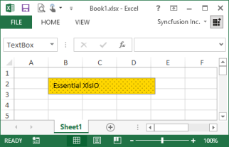
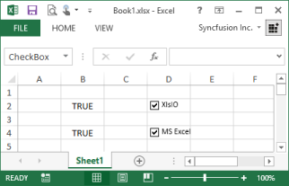
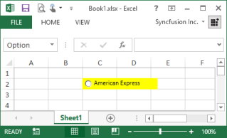

# Working with Other Drawing Objects 

Essential XlsIO supports working with form controls, OLE objects, and auto-shapes. The following sections explain those in detail.

## Insert Form Controls 

Essential XlsIO provides support to read and write the Text Box, Check Box, and Combo Box controls. It enables creation of forms that are user-friendly and also enhances the appearance of the forms.

N> Essential XlsIO provides support to read and write Form controls. Support for Active X Form controls is not yet available.

This section explains the usage of the following Form controls.

* Text Box
* Check Box
* Combo Box
* Option Button

### Text Box

Essential XlsIO can read and write text boxes. The ITextBoxShape interface lets you add a new text box inside a worksheet. The IFill interface is used to customize the inner appearance of the textbox. IShapeLineFormat interface is used to modify the border. Various other properties like Horizontal and Vertical Alignment, Alternative Text, Text Rotation, and so on, are also supported.



// Step 1: Instantiates the spreadsheet creation engine.

ExcelEngine excelEngine = new ExcelEngine();

// Step 2: Instantiates the excel application object.

IApplication application = excelEngine.Excel;

// A new workbook is created. [Equivalent to creating a new workbook in MS Excel).

// The new workbook will have 2 worksheets.

IWorkbook workbook = application.Workbooks.Create(2);

IWorksheet sheet = workbook.Worksheets[0];

// Creates a new Text Box.

ITextBoxShape textbox = sheet.TextBoxes.AddTextBox(2, 2, 30, 200);

textbox.Text = "Essential XlsIO";

// Reads a Text Box.

ITextBoxShape shape1 = sheet.TextBoxes[0];

shape1.Name = "First TextBox";

shape1.Fill.ForeColor = Color.Gold;

shape1.Fill.BackColor = Color.Black;

shape1.Fill.Pattern = ExcelGradientPattern.Pat_90_Percent;

string fileName = "Output.xlsx";

workbook.Version = ExcelVersion.Excel2010;

workbook.SaveAs(fileName);

// Closes the workbook.

workbook.Close();

excelEngine.Dispose();         




' Step 1: Instantiates the spreadsheet creation engine.

Dim excelEngine As ExcelEngine = New ExcelEngine

' Step 2: Instantiates the excel application object.

Dim application As IApplication = excelEngine.Excel

' A new workbook is created. [Equivalent to creating a new workbook in MS Excel].

'The new workbook will have 2 worksheets.

Dim workbook As IWorkbook = application.Workbooks.Create(2)

' Accesses via index.

Dim sheet As IWorkbook = workbook.Worksheets(0)

' Creates a new Text Box.

Dim textbox As ITextBoxShape = sheet.TextBoxes.AddTextBox(2, 2, 30, 200)

textbox.Text = "Essential XlsIO"

' Reads a Text Box.

ITextBoxShape shape1 = sheet.TextBoxes(0)

shape1.Name = "First TextBox"

shape1.Fill.ForeColor = Color.Gold

shape1.Fill.BackColor = Color.Black

shape1.Fill.Pattern = ExcelGradientPattern.Pat_90_Percent

Dim fileName As String = "Output.xlsx"

workbook.Version = ExcelVersion.Excel2010

workbook.SaveAs(fileName)

' Closes the workbook.

workbook.Close()

excelEngine.Dispose()



### Check Box

Essential XlsIO supports reading and writing check boxes. This can be done by using the ICheckBoxShape interface that is used to add a check box inside a worksheet.



// Step 1: Instantiates the spreadsheet creation engine.

ExcelEngine excelEngine = new ExcelEngine();

// Step 2: Instantiates the excel application object.

IApplication application = excelEngine.Excel;

// A new workbook is created. [Equivalent to creating a new workbook in MS Excel).

// The new workbook will have 2 worksheets.

IWorkbook workbook = application.Workbooks.Create(2);

IWorksheet sheet = workbook.Worksheets[0];

//Creates a check box with cell link.

ICheckBoxShape chkBoxXlsIO = sheet.CheckBoxes.AddCheckBox(2, 4, 20, 75);

chkBoxXlsIO.Text = "XlsIO";

chkBoxXlsIO.CheckState = ExcelCheckState.Checked;

chkBoxXlsIO.LinkedCell = sheet["B2"];

ICheckBoxShape chkBoxExcel = sheet.CheckBoxes.AddCheckBox(4, 4, 20, 75);

chkBoxExcel.Text = "MS Excel";

chkBoxExcel.CheckState = ExcelCheckState.Checked;

chkBoxExcel.LinkedCell = sheet["B4"];

//Reads a check box.

ICheckBoxShape chkBoxXlsIO = sheet.CheckBoxes[0];

chkBoxXlsIO.Name = "chkBoxXlsIO";

string fileName = "Output.xlsx";

workbook.Version = ExcelVersion.Excel2010;

workbook.SaveAs(fileName);

// Closes the workbook.

workbook.Close();

excelEngine.Dispose();         





' Step 1: Instantiates the spreadsheet creation engine.

Dim excelEngine As ExcelEngine = New ExcelEngine

' Step 2: Instantiates the excel application object.

Dim application As IApplication = excelEngine.Excel

' A new workbook is created. [Equivalent to creating a new workbook in MS Excel].

'The new workbook will have 2 worksheets.

Dim workbook As IWorkbook = application.Workbooks.Create(2)

' Accesses via index.

Dim sheet As IWorkbook = workbook.Worksheets(0)

'Creates a check box with cell link.

Dim chkBoxXlsIO As ICheckBoxShape = sheet.CheckBoxes.AddCheckBox(2, 4, 20, 75)

chkBoxXlsIO.Text = "XlsIO"

chkBoxXlsIO.CheckState = ExcelCheckState.Checked

chkBoxXlsIO.LinkedCell = sheet("B2")

Dim chkBoxExcel As ICheckBoxShape = sheet.CheckBoxes.AddCheckBox(4, 4, 20, 75)

chkBoxExcel.Text = "MS Excel"

chkBoxExcel.CheckState = ExcelCheckState.Checked

chkBoxExcel.LinkedCell = sheet("B4")

'Reads a check box.

Dim chkBoxXlsIO As ICheckBoxShape = sheet.CheckBoxes(0)

chkBoxXlsIO.Name = "chkBoxXlsIO"

Dim fileName As String = "Output.xlsx"

workbook.Version = ExcelVersion.Excel2010

workbook.SaveAs(fileName)

' Closes the workbook.

workbook.Close()

excelEngine.Dispose()



### Combo Box

Essential XlsIO provides support to read/write a Combo Box control. This is achieved by using the IComboBoxShape interface that is used to add a combo box inside a worksheet. The following code example illustrates how to read/write a Combo Box control.



// Step 1: Instantiates the spreadsheet creation engine.

ExcelEngine excelEngine = new ExcelEngine();

// Step 2: Instantiates the excel application object.

IApplication application = excelEngine.Excel;

// A new workbook is created. [Equivalent to creating a new workbook in MS Excel).

// The new workbook will have 2 worksheets.

IWorkbook workbook = application.Workbooks.Create(2);

IWorksheet sheet = workbook.Worksheets[0];

//Filling Values.

sheet["A2"].Text = "Syncfusion Reporting Products";

sheet["A3"].Text = "Essential XlsIO";

sheet["A4"].Text = "Essential DocIO";

sheet["A5"].Text = "Essential Pdf";

sheet["B5"].Text = "Selected Index";

// Creates a Combo Box.

IComboBoxShape comboBox1 = sheet.ComboBoxes.AddComboBox(2, 3, 20, 100);

// Assigns a value to the Combo Box.

comboBox1.ListFillRange = sheet["A3:A5"];

comboBox1.LinkedCell = sheet["C5"];

string fileName = "Output.xlsx";

workbook.Version = ExcelVersion.Excel2010;

workbook.SaveAs(fileName);

// Closes the workbook.

workbook.Close();

excelEngine.Dispose();         




' Step 1: Instantiates the spreadsheet creation engine.

Dim excelEngine As ExcelEngine = New ExcelEngine

' Step 2: Instantiates the excel application object.

Dim application As IApplication = excelEngine.Excel

' A new workbook is created. [Equivalent to creating a new workbook in MS Excel].

'The new workbook will have 2 worksheets.

Dim workbook As IWorkbook = application.Workbooks.Create(2)

' Accesses via index.

Dim sheet As IWorkbook = workbook.Worksheets(0)

'Filling Values

sheet("A2").Text = "Syncfusion Reporting Products"

sheet("A3").Text = "Essential XlsIO"

sheet("A4").Text = "Essential DocIO"

sheet("A5").Text = "Essential Pdf"

sheet("B5").Text = "Selected Index"

' Creates a Combo Box.

Dim comboBox1 As IComboBoxShape = sheet.ComboBoxes.AddComboBox(2, 3, 20, 100)

'Assigns a value to the Combo Box.

comboBox1.ListFillRange = sheet("A3:A5")

comboBox1.LinkedCell = sheet("C5")

Dim fileName As String = "Output.xlsx"

workbook.Version = ExcelVersion.Excel2010

workbook.SaveAs(fileName)

' Closes the workbook.

workbook.Close()

excelEngine.Dispose()


### Option Button

Essential XlsIO now provides support to read/write an Option Button control for XLSX format. This can be achieved by using the IOptionButtonShape interface that is used to add an Option button inside a worksheet. The IFill interface is used to customize its appearance. IShapeLineFormat interface is used to modify the border. Various other text alignment properties are also supported. The following code example illustrates how to read/write an Option button control.



// Step 1: Instantiates the spreadsheet creation engine.

ExcelEngine excelEngine = new ExcelEngine();

// Step 2: Instantiates the excel application object.

IApplication application = excelEngine.Excel;

// A new workbook is created. [Equivalent to creating a new workbook in MS Excel).

// The new workbook will have 2 worksheets.

IWorkbook workbook = application.Workbooks.Create(2);

IWorksheet sheet = workbook.Worksheets[0];

// Creates an Option Button.

IOptionButtonShape optionButton1 = sheet.OptionButtons.AddOptionButton(2, 3);

// Assigns a value to the Option Button.

optionButton1.Text = "American Express";

// Formats the control.

optionButton1.Fill.FillType = ExcelFillType.SolidColor;

optionButton1.Fill.ForeColor = Color.Yellow;

// Changes the check state.

optionButton1.CheckState = ExcelCheckState.Checked;

// Reads an Option Button.

IOptionButtonShape optionButton2 = sheet.OptionButtons[0];

optionButton2.CheckState = ExcelCheckState.Unchecked;

string fileName = "Output.xlsx";

workbook.Version = ExcelVersion.Excel2010;

workbook.SaveAs(fileName);

// Closes the workbook.

workbook.Close();

excelEngine.Dispose();         





' Step 1: Instantiates the spreadsheet creation engine.

Dim excelEngine As ExcelEngine = New ExcelEngine

' Step 2: Instantiates the excel application object.

Dim application As IApplication = excelEngine.Excel

' A new workbook is created. [Equivalent to creating a new workbook in MS Excel].

'The new workbook will have 2 worksheets.

Dim workbook As IWorkbook = application.Workbooks.Create(2)

' Accesses via index.

Dim sheet As IWorkbook = workbook.Worksheets(0)

' Creates an Option Button.

Dim optionButton1 As IOptionButtonShape = sheet.OptionButtons.AddOptionButton(2, 3)

' Assigns a value to the Option Button.

optionButton1.Text = "American Express"

' Formats the control.

optionButton1.Fill.FillType = ExcelFillType.SolidColor

optionButton1.Fill.ForeColor = Color.Yellow

' Changes the check state.

optionButton1.CheckState = ExcelCheckState.Checked

' Reads an Option Button.

Dim optionButton2 As IOptionButtonShape = sheet.OptionButtons(0)

optionButton2.CheckState = ExcelCheckState.Unchecked

Dim fileName As String = "Output.xlsx"

workbook.Version = ExcelVersion.Excel2010

workbook.SaveAs(fileName)

' Closes the workbook.

workbook.Close()

excelEngine.Dispose()


## Insert OLE Objects 

Object Linking and Embedding (OLE) is one of the best known ways to insert data into Microsoft Office documents. Though embedding or linking objects increases the size of the original document, it helps improve the document readability by providing offline reading of documents (where the existing online links can be replaced). In order to read the content of the object, associated software needs to be installed in the machine. For example, a PDF file linked or embedded to an Excel file needs Adobe Reader in order to launch and read the PDF file. Essential XlsIO supports read and write of OLE Objects in XLSX file format. Objects can either be linked or embedded in the Excel documents by using IOleObject interface. 

N> Currently read and write functions for OLE Objects are supported in Windows, ASP.NET, and WPF platforms only.

List of Properties 

_Properties available_

<table>
<tr>
<th>
Properties</th><th>
Type</th><th>
Value Accepted</th><th>
Description</th></tr>
<tr>
<td>
DisplayAsIcon</td><td>
Normal</td><td>
Boolean</td><td>
Gets or sets value indicating whether to display the OLE object as an icon.</td></tr>
<tr>
<td>
Location</td><td>
Normal</td><td>
IRange</td><td>
Gets or sets the location of the OLE object in the sheet.</td></tr>
<tr>
<td>
Picture</td><td>
Normal</td><td>
-</td><td>
Gets the picture to display to represent the OLE object.</td></tr>
<tr>
<td>
Shape</td><td>
Normal</td><td>
-</td><td>
Gets  the picture shape object that defines look and position of the OLE Object inside the parent worksheet.</td></tr>
<tr>
<td>
Size</td><td>
Normal</td><td>
System.Drawing.Size</td><td>
Gets of sets the size of the OLE object.</td></tr>
</table>

##Displaying an OleObject as Icon

The following code example illustrates the condition when the property is set to True.



// Step 1: Instantiates the spreadsheet creation engine.

ExcelEngine excelEngine = new ExcelEngine();

// Step 2: Instantiates the excel application object.

IApplication application = excelEngine.Excel;

// A new workbook is created. [Equivalent to creating a new workbook in MS Excel).

// The new workbook will have 2 worksheets.

IWorkbook workbook = application.Workbooks.Create(2);

IWorksheet sheet = workbook.Worksheets[0];

Image image= Image.FromFile("image.png");

// Selects the object, the image for the display icon, and the type of the OLEObject to insert.

IOleObject oleObject1= sheet.OleObjects.Add("Document.docx", image, OleLinkType.Embed);

oleObject1.DisplayAsIcon = true;

string fileName = "Output.xlsx";

workbook.Version = ExcelVersion.Excel2010;

workbook.SaveAs(fileName);

// Closes the workbook.

workbook.Close();

excelEngine.Dispose();         





' Step 1: Instantiates the spreadsheet creation engine.

Dim excelEngine As ExcelEngine = New ExcelEngine

' Step 2: Instantiates the excel application object.

Dim application As IApplication = excelEngine.Excel

' A new workbook is created. [Equivalent to creating a new workbook in MS Excel].

'The new workbook will have 2 worksheets.

Dim workbook As IWorkbook = application.Workbooks.Create(2)

' Accesses via index.

Dim sheet As IWorkbook = workbook.Worksheets(0)

Dim image As Image = Image.FromFile("image.png")

' Selects the object, the image for the display icon, and the type of the OLEObject to insert.

Dim oleObject1 As IOleObject = sheet.OleObjects.Add("Test.pptx", image, OleLinkType.Embed)

oleObject1.DisplayAsIcon = True

Dim fileName As String = "Output.xlsx"

workbook.Version = ExcelVersion.Excel2010

workbook.SaveAs(fileName)

' Closes the workbook.

workbook.Close()

excelEngine.Dispose()



##Setting the Location of an OleObject

The following code example illustrates the condition when the location is set to K column, 8th cell.



// Step 1: Instantiates the spreadsheet creation engine.

ExcelEngine excelEngine = new ExcelEngine();

// Step 2: Instantiates the excel application object.

IApplication application = excelEngine.Excel;

// A new workbook is created. [Equivalent to creating a new workbook in MS Excel).

// The new workbook will have 2 worksheets.

IWorkbook workbook = application.Workbooks.Create(2);

IWorksheet sheet = workbook.Worksheets[0];

Image image= Image.FromFile("image.png");

// Selects the object, the image for the display icon, and the type of the OLEObject to insert.

IOleObject oleObject1= sheet.OleObjects.Add("Document.docx", image, OleLinkType.Embed);

oleObject1.Location = sheet["K8"];

string fileName = "Output.xlsx";

workbook.Version = ExcelVersion.Excel2010;

workbook.SaveAs(fileName);

// Closes the workbook.

workbook.Close();

excelEngine.Dispose();         





' Step 1: Instantiates the spreadsheet creation engine.

Dim excelEngine As ExcelEngine = New ExcelEngine

' Step 2: Instantiates the excel application object.

Dim application As IApplication = excelEngine.Excel

' A new workbook is created. [Equivalent to creating a new workbook in MS Excel].

'The new workbook will have 2 worksheets.

Dim workbook As IWorkbook = application.Workbooks.Create(2)

' Accesses via index.

Dim sheet As IWorkbook = workbook.Worksheets(0)

Dim image As Image = Image.FromFile("image.png")

' Selects the object, the image for the display icon, and the type of the OLEObject to insert.

Dim oleObject1 As IOleObject = sheet.OleObjects.Add("Document.docx", image, OleLinkType.Embed)

oleObject1.Location = sheet("K8")

Dim fileName As String = "Output.xlsx"

workbook.Version = ExcelVersion.Excel2010

workbook.SaveAs(fileName)

' Closes the workbook.

workbook.Close()

excelEngine.Dispose()



##Getting Image of an OleObject

The following code example illustrates the condition where image of the oleObject is accessed.



// Step 1: Instantiates the spreadsheet creation engine.

ExcelEngine excelEngine = new ExcelEngine();

// Step 2: Instantiates the excel application object.

IApplication application = excelEngine.Excel;

// A new workbook is created. [Equivalent to creating a new workbook in MS Excel).

// The new workbook will have 2 worksheets.

IWorkbook workbook = application.Workbooks.Create(2);

IWorksheet sheet = workbook.Worksheets[0];

Image image= Image.FromFile("image.png");

// Selects the object, the image for the display icon, and the type of the OLEObject to insert.

IOleObject oleObject1= sheet.OleObjects.Add("Document.docx", image, OleLinkType.Embed);

Image image1= oleObject1.Picture;

string fileName = "Output.xlsx";

workbook.Version = ExcelVersion.Excel2010;

workbook.SaveAs(fileName);

// Closes the workbook.

workbook.Close();

excelEngine.Dispose();         





' Step 1: Instantiates the spreadsheet creation engine.

Dim excelEngine As ExcelEngine = New ExcelEngine

' Step 2: Instantiates the excel application object.

Dim application As IApplication = excelEngine.Excel

' A new workbook is created. [Equivalent to creating a new workbook in MS Excel].

'The new workbook will have 2 worksheets.

Dim workbook As IWorkbook = application.Workbooks.Create(2)

' Accesses via index.

Dim sheet As IWorkbook = workbook.Worksheets(0)

Dim image As Image = Image.FromFile("image.png")

' Selects the object, the image for the display icon, and the type of the OLEObject to insert.

Dim oleObject1 As IOleObject = sheet.OleObjects.Add("Document.docx", image, OleLinkType.Embed)

Dim image1 As Image = oleObject1.Picture 

Dim fileName As String = "Output.xlsx"

workbook.Version = ExcelVersion.Excel2010

workbook.SaveAs(fileName)

' Closes the workbook.

workbook.Close()

excelEngine.Dispose()



##Getting Shape from an OleObject

The following code example illustrates the condition when the property is set to any .png file image.



// Step 1: Instantiates the spreadsheet creation engine.

ExcelEngine excelEngine = new ExcelEngine();

// Step 2: Instantiates the excel application object.

IApplication application = excelEngine.Excel;

// A new workbook is created. [Equivalent to creating a new workbook in MS Excel).

// The new workbook will have 2 worksheets.

IWorkbook workbook = application.Workbooks.Create(2);

IWorksheet sheet = workbook.Worksheets[0];

Image image= Image.FromFile("image.png");

// Selects the object, the image for the display icon, and the type of the OLEObject to insert.

IOleObject oleObject1 = sheet.OleObjects.Add("Document.docx", image, OleLinkType.Embed);

sheet.Pictures[0]= oleObject1.Shape;

string fileName = "Output.xlsx";

workbook.Version = ExcelVersion.Excel2010;

workbook.SaveAs(fileName);

// Closes the workbook.

workbook.Close();

excelEngine.Dispose();         





' Step 1: Instantiates the spreadsheet creation engine.

Dim excelEngine As ExcelEngine = New ExcelEngine

' Step 2: Instantiates the excel application object.

Dim application As IApplication = excelEngine.Excel

' A new workbook is created. [Equivalent to creating a new workbook in MS Excel].

'The new workbook will have 2 worksheets.

Dim workbook As IWorkbook = application.Workbooks.Create(2)

' Accesing via index.

Dim sheet As IWorkbook = workbook.Worksheets(0)

Dim image As Image = Image.FromFile("image.png")

' Selects the object, the image for the display icon, and the type of the OLEObject to insert.

Dim oleObject1 As IOleObject = sheet.OleObjects.Add("Document.docx", image, OleLinkType.Embed)

sheet.Pictures(0)= oleObject1.Shape

Dim fileName As String = "Output.xlsx"

workbook.Version = ExcelVersion.Excel2010

workbook.SaveAs(fileName)

' Closes the workbook.

workbook.Close()

excelEngine.Dispose()



##Setting the Size of the Object

The following code example illustrates the condition when the property is set to (30,30).



// Step 1: Instantiates the spreadsheet creation engine.

ExcelEngine excelEngine = new ExcelEngine();

// Step 2: Instantiates the excel application object.

IApplication application = excelEngine.Excel;

// A new workbook is created. [Equivalent to creating a new workbook in MS Excel).

// The new workbook will have 2 worksheets.

IWorkbook workbook = application.Workbooks.Create(2);

IWorksheet sheet = workbook.Worksheets[0];

Image image= Image.FromFile("image.png");

// Selects the object, the image for the display icon, and the type of the OLEObject to insert.

IOleObject oleObject1= sheet.OleObjects.Add("Document.docx", image, OleLinkType.Embed);

oleObject1.Size = new Size(30, 30);

string fileName = "Output.xlsx";

workbook.Version = ExcelVersion.Excel2010;

workbook.SaveAs(fileName);

// Closes the workbook.

workbook.Close();

excelEngine.Dispose();         




' Step 1: Instantiates the spreadsheet creation engine.

Dim excelEngine As ExcelEngine = New ExcelEngine

' Step 2: Instantiates the excel application object.

Dim application As IApplication = excelEngine.Excel

' A new workbook is created. [Equivalent to creating a new workbook in MS Excel].

'The new workbook will have 2 worksheets.

Dim workbook As IWorkbook = application.Workbooks.Create(2)

' Accesses via index.

Dim sheet As IWorkbook = workbook.Worksheets(0)

Dim image As Image = Image.FromFile("image.png")

' Selects the object, the image for the display icon, and the type of the OLEObject to insert.

Dim oleObject1 As IOleObject = sheet.OleObjects.Add("Document.docx", image, OleLinkType.Embed)

oleObject1.Size = New Size(30, 30)

Dim fileName As String = "Output.xlsx"

workbook.Version = ExcelVersion.Excel2010

workbook.SaveAs(fileName)

' Closes the workbook.

workbook.Close()

excelEngine.Dispose()


##OLE Objects and Linking Types

XlsIO supports two types of association of objects:

* Objects can be linked to the program 
* Objects can be embedded in the program

1. Linked Objects 

Linked objects remain as separate files. The linked object would expect the object to be in the same location as created when the file is opened in another machine.

Linking an OLE Object to an Excel document

The following code example illustrates how to link an OLE Object to an Excel document.



// Step 1: Instantiates the spreadsheet creation engine.

ExcelEngine excelEngine = new ExcelEngine();

// Step 2: Instantiates the excel application object.

IApplication application = excelEngine.Excel;

// A new workbook is created. [Equivalent to creating a new workbook in MS Excel).

// The new workbook will have 2 worksheets.

IWorkbook workbook = application.Workbooks.Create(2);

IWorksheet sheet = workbook.Worksheets[0];

Image image = Image.FromFile("image.png");

// Selects the object, the image for the display icon, and the type of the OLEObject to insert.

IOleObject ole2 = sheet.OleObjects.Add("Document.docx", image, OleLinkType.Link);

// Sets the location.

ole2.Location = sheet[5, 12];

// Sets the size

ole2.Size = new Size(30, 30);

string fileName = "Output.xlsx";

workbook.Version = ExcelVersion.Excel2010;

workbook.SaveAs(fileName);

// Closes the workbook.

workbook.Close();

excelEngine.Dispose();         




' Step 1: Instantiates the spreadsheet creation engine.

Dim excelEngine As ExcelEngine = New ExcelEngine

' Step 2: Instantiates the excel application object.

Dim application As IApplication = excelEngine.Excel

' A new workbook is created. [Equivalent to creating a new workbook in MS Excel].

'The new workbook will have 2 worksheets.

Dim workbook As IWorkbook = application.Workbooks.Create(2)

' Accesing via index.

Dim sheet As IWorkbook = workbook.Worksheets(0)

Dim image As Image = Image.FromFile("image.png")

' Selects the object, the image for the display icon, and the type of the OLEObject to insert.

Dim ole2 As IOleObject = sheet.OleObjects.Add("Document.docx", image, OleLinkType.Link)

' Sets the location.

ole2.Location = sheet(5, 12)

' Sets the size.

ole2.Size = New Size(30, 30)

Dim fileName As String = "Output.xlsx"

workbook.Version = ExcelVersion.Excel2010

workbook.SaveAs(fileName)

' Closes the workbook.

workbook.Close()

excelEngine.Dispose()



2. Embedded Objects  

Embedded objects are stored in the document. When a file is opened in another machine, the embedded object can be viewed without having access to the original data.

Embedding an OLE Object in an Excel document

The following code example illustrates how to embed an OLE Object to an Excel document.



// Step 1: Instantiates the spreadsheet creation engine.

ExcelEngine excelEngine = new ExcelEngine();

// Step 2: Instantiates the excel application object.

IApplication application = excelEngine.Excel;

// A new workbook is created. [Equivalent to creating a new workbook in MS Excel).

// The new workbook will have 2 worksheets.

IWorkbook workbook = application.Workbooks.Create(2);

IWorksheet sheet = workbook.Worksheets[0];

Image image = Image.FromFile("image.png");

// Selects the object, the image for the display icon, and the type of the OLEObject to insert.

IOleObject ole1 = sheet.OleObjects.Add("Test.pptx", image, OleLinkType.Embed);

// Sets the location.

ole1.Location = sheet[5, 2];

// Sets the size.

ole1.Size = new Size(30, 30);

string fileName = "Output.xlsx";

workbook.Version = ExcelVersion.Excel2010;

workbook.SaveAs(fileName);

// Closes the workbook.

workbook.Close();

excelEngine.Dispose();         




' Step 1: Instantiates the spreadsheet creation engine.

Dim excelEngine As ExcelEngine = New ExcelEngine

' Step 2: Instantiates the excel application object.

Dim application As IApplication = excelEngine.Excel

' A new workbook is created. [Equivalent to creating a new workbook in MS Excel].

'The new workbook will have 2 worksheets.

Dim workbook As IWorkbook = application.Workbooks.Create(2)

' Accesses via index.

Dim sheet As IWorkbook = workbook.Worksheets(0)

Dim image As Image = Image.FromFile("image.png")

' Selects the object, the image for the display icon, and the type of the OLEObject to insert.

Dim ole1 As IOleObject = sheet.OleObjects.Add("Test.pptx", image, OleLinkType.Embed)

' Sets the location.

ole1.Location = sheet(5, 2)

' Sets the size.

ole1.Size = New Size(30, 30)

Dim fileName As String = "Output.xlsx"

workbook.Version = ExcelVersion.Excel2010

workbook.SaveAs(fileName)

' Closes the workbook.

workbook.Close()

excelEngine.Dispose()



## Insert AutoShapes 

AutoShapes help you draw objects on your document. You can create various shapes by using AutoShapeType enumeration. Once you insert an AutoShape, you can also put a text inside it and you can move or resize them as you wish

The IShape interface is the in-memory representation of the AutoShapes in an Excel workbook. These are used to create Autoshapes and to set properties for those shapes The ITextFrame interface can be used to set various shape text formats.

###Features

Essential XlsIO supports all major AutoShape features.

* Shape 
* Text
* AlignmentSolidFill

###Interactive Features

* Choose one from the options Excel 2003, Excel 2007, Excel 2010 to generate a document in Excel 2003, Excel 2007, and Excel 2010 respectively.
* Click Create to generate and view the document generated using XlsIO.
* All features in the preceding list are illustrated in this file.

The following code example is an illustration of the output.



//New instance of XlsIO is created. [Equivalent to launching MS Excel with no workbooks open].

//The instantiation process consists of two steps.

//Step 1: Instantiates the spreadsheet creation engine.

ExcelEngine excelEngine = new ExcelEngine();

//Step 2: Instantiates the excel application object.

//Set the default version as Excel97to2003

IApplication application = excelEngine.Excel;

//A new workbook is created.[Equivalent to creating a new workbook in MS Excel]

//The new workbook will have 1 worksheet.

IWorkbook workbook = application.Workbooks.Create(1);

//The first worksheet object in the worksheets collection is accessed.

IWorksheet worksheet = workbook.Worksheets[0];

IShape shape;

string text;

IFont font = workbook.CreateFont();

font.Color = ExcelKnownColors.White;

font.Italic = true;

font.Size = 12;

IFont font2 = workbook.CreateFont();

font2.Color = ExcelKnownColors.Black;

font2.Size = 15;

font2.Italic = true;

font2.Bold = true;

text = "Requirement";

shape = worksheet.Shapes.AddAutoShapes(AutoShapeType.RoundedRectangle, 2, 7, 60, 192);

shape.TextFrame.TextRange.Text = text;

shape.TextFrame.TextRange.RichText.SetFont(0, text.Length - 1, font);

shape.TextFrame.TextRange.RichText.SetFont(0, 0, font2);

shape.Fill.ForeColorIndex = ExcelKnownColors.Light_blue;

shape.Line.Visible = false;

shape.TextFrame.VerticalAlignment = ExcelVerticalAlignment.MiddleCentered;

shape = worksheet.Shapes.AddAutoShapes(AutoShapeType.DownArrow, 5, 8, 40, 64);

shape.Fill.ForeColorIndex = ExcelKnownColors.White;

shape.Line.ForeColorIndex = ExcelKnownColors.Blue;

shape.Line.Weight = 1;

text = "Design";

shape = worksheet.Shapes.AddAutoShapes(AutoShapeType.RoundedRectangle, 7, 7, 60, 192);

shape.TextFrame.TextRange.Text = text;

shape.TextFrame.TextRange.RichText.SetFont(0, text.Length - 1, font);

shape.TextFrame.TextRange.RichText.SetFont(0, 0, font2);

shape.Line.Visible = false;

shape.Fill.ForeColorIndex = ExcelKnownColors.Light_orange;

shape.TextFrame.VerticalAlignment = ExcelVerticalAlignment.MiddleCentered;

shape = worksheet.Shapes.AddAutoShapes(AutoShapeType.DownArrow, 10, 8, 40, 64);

shape.Fill.ForeColorIndex = ExcelKnownColors.White;

shape.Line.ForeColorIndex = ExcelKnownColors.Blue;

shape.Line.Weight = 1;

text = "Execution";

shape = worksheet.Shapes.AddAutoShapes(AutoShapeType.RoundedRectangle, 12, 7, 60, 192);

shape.TextFrame.TextRange.Text = text;

shape.TextFrame.TextRange.RichText.SetFont(0, text.Length - 1, font);

shape.TextFrame.TextRange.RichText.SetFont(0, 0, font2);

shape.Line.Visible = false;

shape.Fill.ForeColorIndex = ExcelKnownColors.Blue;

shape.TextFrame.VerticalAlignment = ExcelVerticalAlignment.MiddleCentered;

shape = worksheet.Shapes.AddAutoShapes(AutoShapeType.DownArrow, 15, 8, 40, 64);

shape.Fill.ForeColorIndex = ExcelKnownColors.White;

shape.Line.ForeColorIndex = ExcelKnownColors.Blue;

shape.Line.Weight = 1;

text = "Testing";

shape = worksheet.Shapes.AddAutoShapes(AutoShapeType.RoundedRectangle, 17, 7, 60, 192);

shape.TextFrame.TextRange.Text = text;

shape.TextFrame.TextRange.RichText.SetFont(0, text.Length - 1, font);

shape.TextFrame.TextRange.RichText.SetFont(0, 0, font2);

shape.Line.Visible = false;

shape.Fill.ForeColorIndex = ExcelKnownColors.Green;

shape.TextFrame.VerticalAlignment = ExcelVerticalAlignment.MiddleCentered;

shape = worksheet.Shapes.AddAutoShapes(AutoShapeType.DownArrow, 20, 8, 40, 64);

shape.Fill.ForeColorIndex = ExcelKnownColors.White;

shape.Line.ForeColorIndex = ExcelKnownColors.Blue;

shape.Line.Weight = 1;

text = "Release";

shape = worksheet.Shapes.AddAutoShapes(AutoShapeType.RoundedRectangle, 22, 7, 60, 192);

shape.TextFrame.TextRange.Text = text;

shape.TextFrame.TextRange.RichText.SetFont(0, text.Length - 1, font);

shape.TextFrame.TextRange.RichText.SetFont(0, 0, font2);

shape.Line.Visible = false;

shape.Fill.ForeColorIndex = ExcelKnownColors.Lavender;

shape.TextFrame.VerticalAlignment = ExcelVerticalAlignment.MiddleCentered;

string fileName = "Austoshapes.xlsx";

//Saves the workbook to disk.

workbook.SaveAs(fileName);

//Closes the workbook.

workbook.Close();

//No exception will be thrown if there are unsaved workbooks.

excelEngine.ThrowNotSavedOnDestroy = false;

excelEngine.Dispose();





'New instance of XlsIO is created. [Equivalent to launching MS Excel with no workbooks open].

'The instantiation process consists of two steps.

'Step 1: Instantiates the spreadsheet creation engine.

Dim excelEngine As ExcelEngine = New ExcelEngine()

'Step 2: Instantiates the excel application object.

'Set the default version as Excel97to2003

Dim application As IApplication = excelEngine.Excel

'A new workbook is created.[Equivalent to creating a new workbook in MS Excel]

'The new workbook will have 1 worksheet.

Dim workbook As IWorkbook = application.Workbooks.Create(1)

'The first worksheet object in the worksheets collection is accessed.

Dim worksheet As IWorksheet = workbook.Worksheets(0)

Dim shape As IShape

Dim text As String

Dim font As IFont = workbook.CreateFont()

font.Color = ExcelKnownColors.White

font.Italic = True

font.Size = 12

Dim font2 As IFont = workbook.CreateFont()

font2.Color = ExcelKnownColors.Black

font2.Size = 15

font2.Italic = True

font2.Bold = True

text = "Requirement"

shape = worksheet.Shapes.AddAutoShapes(AutoShapeType.RoundedRectangle, 2, 7, 60, 192)

shape.TextFrame.TextRange.Text = text

shape.TextFrame.TextRange.RichText.SetFont(0, text.Length - 1, font)

shape.TextFrame.TextRange.RichText.SetFont(0, 0, font2)

shape.Fill.ForeColorIndex = ExcelKnownColors.Light_blue

shape.Line.Visible = False

shape.TextFrame.VerticalAlignment = ExcelVerticalAlignment.MiddleCentered

shape = worksheet.Shapes.AddAutoShapes(AutoShapeType.DownArrow, 5, 8, 40, 64)

shape.Fill.ForeColorIndex = ExcelKnownColors.White

shape.Line.ForeColorIndex = ExcelKnownColors.Blue

shape.Line.Weight = 1

text = "Design"

shape = worksheet.Shapes.AddAutoShapes(AutoShapeType.RoundedRectangle, 7, 7, 60, 192)

shape.TextFrame.TextRange.Text = text

shape.TextFrame.TextRange.RichText.SetFont(0, text.Length - 1, font)

shape.TextFrame.TextRange.RichText.SetFont(0, 0, font2)

shape.Line.Visible = False

shape.Fill.ForeColorIndex = ExcelKnownColors.Light_orange

shape.TextFrame.VerticalAlignment = ExcelVerticalAlignment.MiddleCentered

shape = worksheet.Shapes.AddAutoShapes(AutoShapeType.DownArrow, 10, 8, 40, 64)

shape.Fill.ForeColorIndex = ExcelKnownColors.White

shape.Line.ForeColorIndex = ExcelKnownColors.Blue

shape.Line.Weight = 1

text = "Execution"

shape = worksheet.Shapes.AddAutoShapes(AutoShapeType.RoundedRectangle, 12, 7, 60, 192)

shape.TextFrame.TextRange.Text = text

shape.TextFrame.TextRange.RichText.SetFont(0, text.Length - 1, font)

shape.TextFrame.TextRange.RichText.SetFont(0, 0, font2)

shape.Line.Visible = False

shape.Fill.ForeColorIndex = ExcelKnownColors.Blue

shape.TextFrame.VerticalAlignment = ExcelVerticalAlignment.MiddleCentered

shape = worksheet.Shapes.AddAutoShapes(AutoShapeType.DownArrow, 15, 8, 40, 64)

shape.Fill.ForeColorIndex = ExcelKnownColors.White

shape.Line.ForeColorIndex = ExcelKnownColors.Blue

shape.Line.Weight = 1

text = "Testing"

shape = worksheet.Shapes.AddAutoShapes(AutoShapeType.RoundedRectangle, 17, 7, 60, 192)

shape.TextFrame.TextRange.Text = text

shape.TextFrame.TextRange.RichText.SetFont(0, text.Length - 1, font)

shape.TextFrame.TextRange.RichText.SetFont(0, 0, font2)

shape.Line.Visible = False

shape.Fill.ForeColorIndex = ExcelKnownColors.Green

shape.TextFrame.VerticalAlignment = ExcelVerticalAlignment.MiddleCentered

shape = worksheet.Shapes.AddAutoShapes(AutoShapeType.DownArrow, 20, 8, 40, 64)

shape.Fill.ForeColorIndex = ExcelKnownColors.White

shape.Line.ForeColorIndex = ExcelKnownColors.Blue

shape.Line.Weight = 1

text = "Release"

shape = worksheet.Shapes.AddAutoShapes(AutoShapeType.RoundedRectangle, 22, 7, 60, 192)

shape.TextFrame.TextRange.Text = text

shape.TextFrame.TextRange.RichText.SetFont(0, text.Length - 1, font)

shape.TextFrame.TextRange.RichText.SetFont(0, 0, font2)

shape.Line.Visible = False

shape.Fill.ForeColorIndex = ExcelKnownColors.Lavender

shape.TextFrame.VerticalAlignment = ExcelVerticalAlignment.MiddleCentered

Dim fileName As String = "Austoshapes.xlsx"

'Saves the workbook to disk.

workbook.SaveAs(fileName)

'Closes the workbook.

workbook.Close()

'No exception will be thrown if there are unsaved workbooks.

excelEngine.ThrowNotSavedOnDestroy = False

excelEngine.Dispose()


