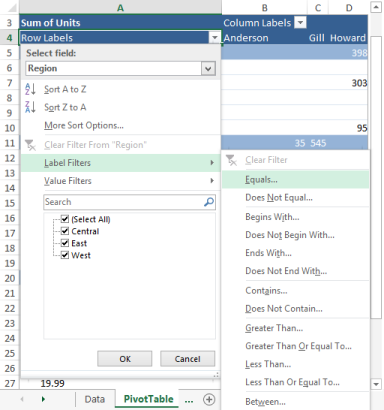
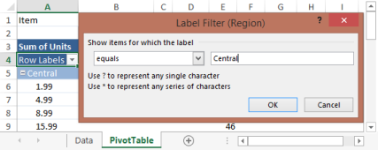
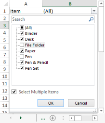
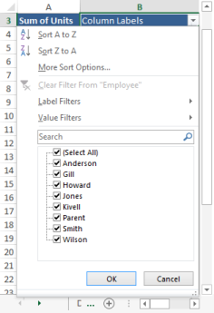
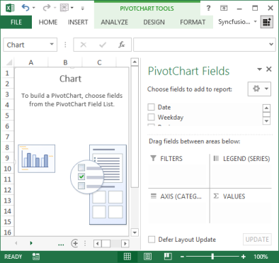

# Working with Pivot Tables 

Pivot Table is an Excel feature that helps in summarizing large data. Instead of analyzing rows upon rows of records, a Pivot Table aggregates your data and shows a new perspective with few clicks. You can also move columns to rows or vice versa. You can create the table by defining the fields to view and how the data should be displayed. Based on the field selections, Excel aggregates and organizes the data so that you can see a different view of your data.

Essential XlsIO supports the usage of Pivot Table. Creation and Manipulation of pivot table is supported in Excel 2013 format, and the pivot table in existing document can be preserved for Excel 2013 format. The following topics illustrate this.

## Create a Pivot Table 

In Excel, Pivot Table can be inserted by selecting the PivotTable option from the Insert menu.

{{ '' | markdownify }}
{:.image }

Excel automatically selects the entire range. However, it is possible to modify it if necessary. It also allows choosing where to place the PivotTable. New Worksheet is most commonly used to place the pivot table.

{{ '' | markdownify }}
{:.image }

Once you select a field, the Pivot Table appears. Now you need to populate it with data fields that appear in the field list on the right. Fields can be dragged to one of the defined areas of the Pivot Table grid.

{{ '' | markdownify }}
{:.image }

To filter by a field, open its drop-down list and select the value to filter. The table now displays data only for the filtered criterion (in this case, the Central region). You can also sort by a field by opening its drop-down list and selecting one of the sort orders.

PivotTable Creation Manipulation by Using XlsIO

XlsIO provides support for creation and manipulation of Pivot Table by using simple APIs. IPivotCache interface caches the data that needs to be summarized. IPivotTable represents a pivot table in object, and has properties that allow customizing it. IPivotTable interface returns the collection of Pivot Tables present in a worksheet. IPivotField represents the field in the pivot table. This includes row, column, and data field axis. IPivotDataFields gets collection of data field.

> _Note: Pivot Table is currently not supported for .xls format._

The following code example illustrates how to create a pivot table by using XlsIO.

[C#]

//Step 1: Instantiates the spreadsheet creation engine.

ExcelEngine excelEngine = new ExcelEngine();

//Step 2: Instantiates the excel application object.

IApplication application = excelEngine.Excel;

IWorkbook workbook = application.Workbooks.Open("PivotSample.xlsx");

//The first worksheet object in the worksheets collection is accessed.

IWorksheet sheet = workbook.Worksheets[0];

IPivotCache cache = workbook.PivotCaches.Add(sheet["A1:D136"]);

IPivotTable pivotTable = sheet.PivotTables.Add("PivotTable1", sheet["A1"], cache);

pivotTable.Fields[0].Axis = PivotAxisTypes.Row;

pivotTable.Fields[1].Axis = PivotAxisTypes.Row;

pivotTable.Fields[3].Axis = PivotAxisTypes.Column;

IPivotField field = pivotTable.Fields[2];

pivotTable.DataFields.Add(field, "sum", PivotSubtotalTypes.Sum);

//Saves the workbook to disk.

workbook.SaveAs("PivotTable.xlsx");

//Closes the workbook.

workbook.Close();

excelEngine.Dispose();

[VB.NET]

'Step 1: Instantiates the spreadsheet creation engine.

Dim excelEngine As ExcelEngine = New ExcelEngine

'Step 2: Instantiates the excel application object.

Dim application As IApplication = excelEngine.Excel

'A new workbook is created.[Equivalent to creating a new workbook in MS Excel]

Dim workbook As IWorkbook = application.Workbooks.Open("PivotSample.xlsx")

Dim sheet As IWorksheet = workbook.Worksheets(0)

Dim cache As IPivotCache = book.PivotCaches.Add(sheet("A1:D136"))

Dim pivotTable As IPivotTable = sheet.PivotTables.Add("PivotTable1", sheet("A1"), cache)

pivotTable.Fields(0).Axis = PivotAxisTypes.Row

pivotTable.Fields(1).Axis = PivotAxisTypes.Row

pivotTable.Fields(3).Axis = PivotAxisTypes.Column

Dim field As IPivotField = pivotTable.Fields(2)

pivotTable.DataFields.Add(field, "sum", PivotSubtotalTypes.Sum)

'Saves the workbook to disk.

workbook.SaveAs("PivotTable.xlsx")

'Closes the workbook.

workbook.Close()

excelEngine.Dispose();

Properties

The following properties of the IPivotTable interface are used to fetch pivot table fields.

_IPivotTable Properties_ 

<table>
<tr>
<td>
Properties</td><td>
Description</td></tr>
<tr>
<td>
Name</td><td>
Gets or sets pivot table name.</td></tr>
<tr>
<td>
Location</td><td>
Returns pivot table location. </td></tr>
<tr>
<td>
CacheIndex</td><td>
Gets Index of the pivot Cache. Read-only.</td></tr>
<tr>
<td>
Fields</td><td>
Gets collection of pivot fields. Read-only.</td></tr>
<tr>
<td>
DataFields</td><td>
Gets IDataField collection of pivot table data fields. Read-only.</td></tr>
<tr>
<td>
ColumnFields</td><td>
Returns the collection of Column field for the specified pivot table. Read-only.</td></tr>
<tr>
<td>
RowFields</td><td>
Returns the collection of Row field for the specified pivot table. Read-only</td></tr>
<tr>
<td>
PageFields</td><td>
Returns the collection of page field for the specified pivot table. Read-only.</td></tr>
<tr>
<td>
CalculatedFields</td><td>
Returns the collection of calculated fields of the specified pivot table. Read-only.</td></tr>
<tr>
<td>
ColumnsPerPage</td><td>
Specifies the number of columns per page for this PivotTable that the filter area will occupy.</td></tr>
<tr>
<td>
RowsPerPage</td><td>
Specifies the number of rows per page for this PivotTable that the filter area will occupy.</td></tr>
<tr>
<td>
Options</td><td>
Represents the pivot table options.Read-only.</td></tr>
</table>

The following properties of the IPivotTableOption interface are used to customize the settings of the pivot table.

_IPivotTableOption Properties_ 

<table>
<tr>
<td>
Properties</td><td>
Description</td></tr>
<tr>
<td>
ShowAsteriskTotals</td><td>
True if an asterisk (*) is displayed next to each subtotal and grand total value in the specified PivotTable report.</td></tr>
<tr>
<td>
ColumnHeaderCaption</td><td>
Specifies the string to be displayed in column header of pivot Table when in compact layout mode.</td></tr>
<tr>
<td>
RowHeaderCaption</td><td>
Specifies the string to be displayed in Row header of pivot table when in compact layout mode.</td></tr>
<tr>
<td>
ShowCustomSortList</td><td>
Specifies a Boolean value that indicates whether the "custom lists" option is offered when sorting this PivotTable.</td></tr>
<tr>
<td>
ShowFieldList</td><td>
False, to disable the ability to display the field list for the PivotTable. If the field list was already being displayed it disappears.</td></tr>
<tr>
<td>
ShowDrillIndicators</td><td>
Toggles the display of drill indicators in pivot table.</td></tr>
<tr>
<td>
IsDataEditable</td><td>
True, to disable the alert when the values in the data area of the PivotTable is overwritten.</td></tr>
<tr>
<td>
EnableFieldProperties</td><td>
True, if the PivotTable Field dialog box is available when you double-click the PivotTable field.</td></tr>
<tr>
<td>
Indent</td><td>
Specifies the indentation increment for compact axis and can be used to set the Report Layout to Compact Form.</td></tr>
<tr>
<td>
ErrorString</td><td>
Returns or sets the string displayed in cells that contain errors when the DisplayErrorString property is True.</td></tr>
<tr>
<td>
DisplayErrorString</td><td>
True, if the PivotTable report displays a custom error string in cells that contain errors. The default value is False.</td></tr>
<tr>
<td>
MergeLabels</td><td>
True, if the specified PivotTable report’s outer-row item, column item, subtotal, and grand total labels use merged cells.</td></tr>
<tr>
<td>
PageFieldWrapCount</td><td>
Returns or sets the number of page fields in each column or row in the PivotTable report.</td></tr>
<tr>
<td>
PageFieldsOrder</td><td>
Returns or sets the order where page fields are added to the PivotTable report’s layout.</td></tr>
<tr>
<td>
DisplayNullString</td><td>
True, if the PivotTable report displays a custom string in cells that contain null values. The default value is True.</td></tr>
<tr>
<td>
NullString</td><td>
Returns or sets the string displayed in cells that contain null values when the DisplayNullString property is True.</td></tr>
<tr>
<td>
PreserveFormatting</td><td>
True, if formatting is preserved when the report is refreshed or recalculated by operations such as pivoting, sorting, or changing page field items.</td></tr>
<tr>
<td>
ShowTooltips</td><td>
True, if tooltips displayed for the pivot table cell.</td></tr>
<tr>
<td>
DisplayFieldCaptions</td><td>
Gets/sets value controlling whether or not filter buttons and PivotField captions for rows and columns are displayed in the grid.</td></tr>
<tr>
<td>
PrintTitles</td><td>
True, if the print titles for the worksheet are set based on the PivotTable report. False, if the print titles for the worksheet are used.</td></tr>
<tr>
<td>
RowLayout</td><td>
This property specifies the pivot table row layout settings.</td></tr>
<tr>
<td>
IsSaveData</td><td>
True if data for pivot table report is saved with the workbook. False if only the report definition is saved.</td></tr>
</table>

Following are the properties of the IPivotCache interface.

_IPivotCache Properties_ 

<table>
<tr>
<td>
Properties</td><td>
Description</td></tr>
<tr>
<td>
Index</td><td>
Gets zero-based cache index. Read-only</td></tr>
<tr>
<td>
SourceType</td><td>
Specifies the pivot table cache source type. Read-only</td></tr>
<tr>
<td>
SourceRange</td><td>
Returns the data source for the PivotTable report. Read-only.</td></tr>
</table>

SubTotals

You can also insert various subtotal types for the pivot table through the PivotSubtotalTypes enum. It is also possible to insert multiple subtotals for a field by using Subtotal property of IPivotField. This is demonstrated in the following code example.

[C#]

//Step 1: Instantiates the spreadsheet creation engine.

ExcelEngine excelEngine = new ExcelEngine();

//Step 2: Instantiates the excel application object.

IApplication application = excelEngine.Excel;

IWorkbook workbook = application.Workbooks.Open("PivotSample.xlsx");

//The first worksheet object in the worksheets collection is accessed.

IWorksheet sheet = workbook.Worksheets[0];

//Selects the data to add in the cache.
IPivotCache cache = workbook.PivotCaches.Add(worksheet["A1:H50"]);

//Inserts Multiple subtotals.

IPivotTable pivotTable = sheet.PivotTables.Add("PivotTable1", sheet1["A1"], cache);

pivotTable.Fields[0].Axis = PivotAxisTypes.Row;

pivotTable.Fields[0].Subtotals = PivotSubtotalTypes.Sum| PivotSubtotalTypes.Average | PivotSubtotalTypes.Max | PivotSubtotalTypes.Min;

//Saves the workbook to disk.

workbook.SaveAs("PivotTable.xlsx");

//Closes the workbook.

workbook.Close();

excelEngine.Dispose();

[VB.NET]

'Step 1: Instantiates the spreadsheet creation engine.

Dim excelEngine As ExcelEngine = New ExcelEngine

'Step 2: Instantiates the excel application object.

Dim application As IApplication = excelEngine.Excel

'A new workbook is created.[Equivalent to creating a new workbook in MS Excel]

Dim workbook As IWorkbook = application.Workbooks.Open("PivotSample.xlsx")

Dim sheet As IWorksheet = workbook.Worksheets(0)

'Selects the data to add in the cache.
Dim cache As IPivotCache = workbook.PivotCaches.Add(worksheet("A1:H50"))

'Inserts Multiple Subtotals.

Dim pivotTable As IPivotTable = sheet.PivotTables.Add("PivotTable1", sheet1("A1"), cache)

pivotTable.Fields(0).Axis = PivotAxisTypes.Row

pivotTable.Fields(0).Subtotals = PivotSubtotalTypes.Sum| PivotSubtotalTypes.Average | PivotSubtotalTypes.Max | PivotSubtotalTypes.Min

'Saves the workbook to disk.

workbook.SaveAs("PivotTable.xlsx")

'Closes the workbook.

workbook.Close()

excelEngine.Dispose()

## Edit a Pivot Table

XlsIO supports the usage of Pivot Tables in a Template file. It is even possible to dynamically refresh the data in a pivot table by using XlsIO. The following steps illustrate how to do this.

1. Create the Pivot Table by using MS Excel GUI.
1. Specify the named range to be the data source of the Pivot Table.
2. Make sure that the Refresh On Open option of the pivot table is selected.
3. Dynamically refresh the data in the Named Range.

[C#]

//Step 1: Instantiates the spreadsheet creation engine.

ExcelEngine excelEngine = new ExcelEngine();

//Step 2: Instantiates the excel application object.

IApplication application = excelEngine.Excel;

IWorkbook workbook = application.Workbooks.Open("EditedPivotTable.xlsx");

// The first worksheet object in the worksheets collection is accessed.

IWorksheet pivotSheet = workbook.Worksheets[0];

IPivotTable pivotTable = pivotSheet.PivotTables[0];

//Applies row field filter.

IPivotField rowField = pivotTable.Fields[2];

//Applies column field label based filter.

IPivotField colField = pivotTable.Fields[3];

colField.Items[0].Visible = false;

colField.Items[1].Visible = false;

//Changes the range values that the Pivot Tables range refers to.

workbook.Names["PivotRange"].RefersToRange = pivotSheet.Range["A1:D27"];

//Saves the workbook to disk.

workbook.SaveAs("PivotTable.xlsx");

//Closes the workbook.

workbook.Close();

excelEngine.Dispose();

[VB.NET]

'Step 1: Instantiates the spreadsheet creation engine.

Dim excelEngine As ExcelEngine = New ExcelEngine

'Step 2: Instantiates the excel application object.

Dim application As IApplication = excelEngine.Excel

'A new workbook is created.[Equivalent to creating a new workbook in MS Excel]

Dim workbook As IWorkbook = application.Workbooks.Open("EditedPivotTable.xlsx")

Dim pivotSheet As IWorksheet = workbook.Worksheets(0)

Dim pivotTable As IPivotTable = workbook.Worksheets(0).PivotTables(0)

'Applies row field filter.
Dim rowField As IPivotField = pivotTable.Fields(2)

'Applies column field label based filter.
Dim colField As IPivotField = pivotTable.Fields(3)

colField.Items(0).Visible = False
colField.Items(1).Visible = False

'Changes the range values that the Pivot Tables range refers to.

Private workbook.Names("PivotRange").RefersToRange = mySheet.Range("A1:D27")

workbook.SaveAs("PivotTable.xlsx")

'Closes the workbook.

workbook.Close()

excelEngine.Dispose()

## Applying Pivot Table Filters 

In Microsoft Excel, filtered data of a pivot table displays only the subset of data that meets the criteria (criteria: Conditions you specify to limit which records are included in the result set of a query or filter.) specified. The Excel has drop-down filter arrows for report/page filter fields, row fields, and column fields. This can be achieved in XlsIO by using the IPivotFilters interface. 

### Applying Page Filters

The page field filter filters the Pivot Table based on page field items. The following code example illustrates how to apply multiple filters to the page field items.

[C#]

//Step 1: Instantiates the spreadsheet creation engine.
ExcelEngine excelEngine = new ExcelEngine();

//Step 2: Instantiates the excel application object.
IApplication application = excelEngine.Excel;

//Sets the default version as Excel 2010.
application.DefaultVersion = ExcelVersion.Excel2010;

IWorkbook workbook = application.Workbooks.Open("PivotCodeDate.xlsx");

//The first worksheet object in the worksheets collection is accessed.
IWorksheet worksheet = workbook.Worksheets[0];

//Accesses the worksheet to draw pivot table.
IWorksheet pivotSheet = workbook.Worksheets[1];

//Selects the data to add in the cache.
IPivotCache cache = workbook.PivotCaches.Add(worksheet["A1:H50"]);

//Inserts the pivot table.
IPivotTable pivotTable = pivotSheet.PivotTables.Add("PivotTable1", pivotSheet["A1"], cache);

//Sets field axis to page.
pivotTable.Fields[4].Axis = PivotAxisTypes.Page;

//Sets field axis to row.
pivotTable.Fields[2].Axis = PivotAxisTypes.Row;
pivotTable.Fields[6].Axis = PivotAxisTypes.Row;

//Sets field axis to column.
pivotTable.Fields[3].Axis = PivotAxisTypes.Column;

IPivotField field = pivotSheet.PivotTables[0].Fields[5];
pivotTable.DataFields.Add(field, "Sum of Units", PivotSubtotalTypes.Sum);

//Applies page field filter.
IPivotField pageField = pivotTable.Fields[4];

//Selects multiple items in page field to filter.
pageField.Items[1].Visible = false;
pageField.Items[2].Visible = false;

//Applies built-in style.
pivotTable.BuiltInStyle = PivotBuiltInStyles.PivotStyleMedium2;

//Activates the pivot worksheet.
pivotSheet.Activate();

//Saves the workbook to disk.
workbook.SaveAs("PivotTable.xlsx");

//Closes the workbook.
workbook.Close();

//No exception will be thrown if there are unsaved workbooks.
excelEngine.ThrowNotSavedOnDestroy = false;

excelEngine.Dispose();  

 [VB]

'Step 1: Instantiates the spreadsheet creation engine.
Dim excelEngine As New ExcelEngine()

'Step 2: Instantiates the excel application object.
Dim application As IApplication = excelEngine.Excel

'Sets the default version as Excel 2010.
application.DefaultVersion = ExcelVersion.Excel2010

'Gets the path of input file.
Dim workbook As IWorkbook = application.Workbooks.Open("PivotCodeDate.xlsx")

'The first worksheet object in the worksheets collection is accessed.
Dim worksheet As IWorksheet = workbook.Worksheets(0)

'Accesses the worksheet to draw pivot table.
Dim pivotSheet As IWorksheet = workbook.Worksheets(1)

'Selects the data to add in cache.
Dim cache As IPivotCache = workbook.PivotCaches.Add(worksheet("A1:H50"))

'Inserts the pivot table.
Dim pivotTable As IPivotTable = pivotSheet.PivotTables.Add("PivotTable1", pivotSheet("A1"), cache)

'Sets field axis to page.
pivotTable.Fields(4).Axis = PivotAxisTypes.Page

'Sets field axis to row.
pivotTable.Fields(2).Axis = PivotAxisTypes.Row
pivotTable.Fields(6).Axis = PivotAxisTypes.Row

'Sets field axis to column.
pivotTable.Fields(3).Axis = PivotAxisTypes.Column
Dim field As IPivotField = pivotSheet.PivotTables(0).Fields(5)
pivotTable.DataFields.Add(field, "Sum of Units", PivotSubtotalTypes.Sum)

'Applies page field filter.
Dim pageField As IPivotField = pivotTable.Fields(4)

'Selects multiple items in page field to filter.
pageField.Items(1).Visible = False
pageField.Items(2).Visible = False

'Applies built-in style.
pivotTable.BuiltInStyle = PivotBuiltInStyles.PivotStyleMedium2

'Activates the pivot worksheet.
pivotSheet.Activate()

'Saves the workbook to disk.
workbook.SaveAs("PivotTable.xlsx")

'Closes the workbook.
workbook.Close()

'No exception will be thrown if there are unsaved workbooks.
excelEngine.ThrowNotSavedOnDestroy = False
excelEngine.Dispose()

{{ '' | markdownify }}
{:.image }

### Applying Row or Column Filters 

The row field and column field filters, filter the pivot table based on labels, values, and items of fields. The following code example illustrates how to apply these filters to a Pivot Table.

[C#]

//Step 1: Instantiates the spreadsheet creation engine.
ExcelEngine excelEngine = new ExcelEngine();

//Step 2: Instantiates the excel application object.
IApplication application = excelEngine.Excel;

//Sets the default version as Excel 2010.
application.DefaultVersion = ExcelVersion.Excel2010;

IWorkbook workbook = application.Workbooks.Open("PivotCodeDate.xlsx");

//The first worksheet object in the worksheets collection is accessed.
IWorksheet worksheet = workbook.Worksheets[0];

/Accesses the worksheet to draw pivot table.
IWorksheet pivotSheet = workbook.Worksheets[1];

//Selects the data to add inm the cache.
IPivotCache cache = workbook.PivotCaches.Add(worksheet["A1:H50"]);

//Inserts the pivot table.
IPivotTable pivotTable = pivotSheet.PivotTables.Add("PivotTable1", pivotSheet["A1"], cache);
pivotTable.Fields[4].Axis = PivotAxisTypes.Page;
pivotTable.Fields[2].Axis = PivotAxisTypes.Row;
pivotTable.Fields[6].Axis = PivotAxisTypes.Row;
pivotTable.Fields[3].Axis = PivotAxisTypes.Column;

IPivotField field = pivotSheet.PivotTables[0].Fields[5];
pivotTable.DataFields.Add(field, "Sum of Units", PivotSubtotalTypes.Sum);

//Applies row field filter.
IPivotField rowField = pivotTable.Fields[2];

//Applies Label based row field filter
rowField .PivotFilters.Add(PivotFilterType.CaptionEqual, null, "East", null);

//Applies column field label based filter.
IPivotField colField = pivotTable.Fields[3];

colField.Items[0].Visible = false;
colField.Items[1].Visible = false;

//Applies built-in style.
pivotTable.BuiltInStyle = PivotBuiltInStyles.PivotStyleMedium2;

//Activates the pivot worksheet.
pivotSheet.Activate();

//Saves the workbook to disk.
workbook.SaveAs("PivotTable.xlsx");

//Closes the workbook.
workbook.Close();

//No exception will be thrown if there are unsaved workbooks.
excelEngine.ThrowNotSavedOnDestroy = false;

excelEngine.Dispose();

 [VB]

'Step 1: Instantiates the spreadsheet creation engine.
Dim excelEngine As New ExcelEngine()

'Step 2: Instantiates the excel application object.
Dim application As IApplication = excelEngine.Excel

'Sets the default version as Excel 2010.
application.DefaultVersion = ExcelVersion.Excel2010

Dim workbook As IWorkbook = application.Workbooks.Open("PivotCodeDate.xlsx")

'The first worksheet object in the worksheets collection is accessed.
Dim worksheet As IWorksheet = workbook.Worksheets(0)

'Accesses the worksheet to draw pivot table.
Dim pivotSheet As IWorksheet = workbook.Worksheets(1)

'Selects the data to add in cache.
Dim cache As IPivotCache = workbook.PivotCaches.Add(worksheet("A1:H50"))

'Inserts the pivot table.
Dim pivotTable As IPivotTable = pivotSheet.PivotTables.Add("PivotTable1", pivotSheet("A1"), cache)
pivotTable.Fields(4).Axis = PivotAxisTypes.Page
pivotTable.Fields(2).Axis = PivotAxisTypes.Row
pivotTable.Fields(6).Axis = PivotAxisTypes.Row
pivotTable.Fields(3).Axis = PivotAxisTypes.Column

Dim field As IPivotField = pivotSheet.PivotTables(0).Fields(5)
pivotTable.DataFields.Add(field, "Sum of Units", PivotSubtotalTypes.Sum)

'Applies row field filter.
Dim rowField As IPivotField = pivotTable.Fields(2)

'Applies Label based row field filter
rowField.PivotFilters.Add(PivotFilterType.CaptionEqual, Nothing, "East", Nothing)

'Applies column field label based filter.
Dim colField As IPivotField = pivotTable.Fields(3)

colField.Items(0).Visible = False
colField.Items(1).Visible = False

'Applies built-in style.
pivotTable.BuiltInStyle = PivotBuiltInStyles.PivotStyleMedium2

'Activates the pivot worksheet.
pivotSheet.Activate()

'Saves the workbook to disk.
workbook.SaveAs("PivotTable.xlsx")

'Closes the workbook.
workbook.Close()

'No exception will be thrown if there are unsaved workbooks.
excelEngine.ThrowNotSavedOnDestroy = False
excelEngine.Dispose()

{{ '' | markdownify }}
{:.image }

Label Filter 

[C#]

//Step 1: Instantiates the spreadsheet creation engine.

ExcelEngine excelEngine = new ExcelEngine();

//Step 2: Instantiates the excel application object.

IApplication application = excelEngine.Excel;

IWorkbook workbook = application.Workbooks.Open("PivotSample.xlsx");

//The first worksheet object in the worksheets collection is accessed.

IWorksheet worksheet = workbook.Worksheets[0];

IWorksheet pivotSheet = workbook.Worksheets[1];

//Selects the data to add in the cache.
IPivotCache cache = workbook.PivotCaches.Add(worksheet["A1:H50"]);

//Inserts the pivot table.
IPivotTable pivotTable = pivotSheet.PivotTables.Add("PivotTable1", pivotSheet["A1"], cache);

IPivotField field = pivotSheet.PivotTables[0].Fields[5];
pivotTable.DataFields.Add(field, "Sum of Units", PivotSubtotalTypes.Sum);

//Applies row field filter.
IPivotField rowField = pivotTable.Fields[2];

//Applies Label based row field filter
rowField .PivotFilters.Add(PivotFilterType.CaptionEqual, null, "East", null);

//Applies column field label based filter.
IPivotField colField = pivotTable.Fields[3];

colField.Items[0].Visible = false;
colField.Items[1].Visible = false;

//Saves the workbook to disk.
workbook.SaveAs("PivotTable.xlsx");

//Closes the workbook.
workbook.Close();

//No exception will be thrown if there are unsaved workbooks.
excelEngine.ThrowNotSavedOnDestroy = false;

excelEngine.Dispose();

[VB]

'Step 1: Instantiates the spreadsheet creation engine.
Dim excelEngine As New ExcelEngine()

'Step 2: Instantiates the excel application object.
Dim application As IApplication = excelEngine.Excel

'Sets the default version as Excel 2010.
application.DefaultVersion = ExcelVersion.Excel2010

'Gets the path of input file.
Dim workbook As IWorkbook = application.Workbooks.Open("PivotCodeDate.xlsx")

'The first worksheet object in the worksheets collection is accessed.
Dim worksheet As IWorksheet = workbook.Worksheets(0)

'Accesses the worksheet to draw pivot table.
Dim pivotSheet As IWorksheet = workbook.Worksheets(1)

'Selects the data to add in cache.
Dim cache As IPivotCache = workbook.PivotCaches.Add(worksheet("A1:H50"))

'Inserts the pivot table.
Dim pivotTable As IPivotTable = pivotSheet.PivotTables.Add("PivotTable1", pivotSheet("A1"), cache)

Dim field As IPivotField = pivotSheet.PivotTables(0).Fields(5)
pivotTable.DataFields.Add(field, "Sum of Units", PivotSubtotalTypes.Sum)

'Applies row field filter.
Dim rowField As IPivotField = pivotTable.Fields(2)

'Applies Label based row field filter
rowField.PivotFilters.Add(PivotFilterType.CaptionEqual, Nothing, "East", Nothing)

'Applies column field label based filter.
Dim colField As IPivotField = pivotTable.Fields(3)

colField.Items(0).Visible = False
colField.Items(1).Visible = False

//Saves the workbook to disk.
workbook.SaveAs("PivotTable.xlsx");

//Closes the workbook.
workbook.Close();

'No exception will be thrown if there are unsaved workbooks.
excelEngine.ThrowNotSavedOnDestroy = False
excelEngine.Dispose()

Value Filter 

[C#]

//Step 1: Instantiates the spreadsheet creation engine.

ExcelEngine excelEngine = new ExcelEngine();

//Step 2: Instantiates the excel application object.

IApplication application = excelEngine.Excel;

IWorkbook workbook = application.Workbooks.Open("PivotSample.xlsx");

//The first worksheet object in the worksheets collection is accessed.

IWorksheet worksheet = workbook.Worksheets[0];

IWorksheet pivotSheet = workbook.Worksheets[1];

//Selects the data to add in the cache.
IPivotCache cache = workbook.PivotCaches.Add(worksheet["A1:H50"]);

//Insert the pivot table.
IPivotTable pivotTable = pivotSheet.PivotTables.Add("PivotTable1", pivotSheet["A1"], cache);

//Creates Pivot Filter object to apply filter to page Fields.

IPivotFilter filterValue = pivotTable.Fields[2].PivotFilters.Add();

//Page Field would be filtered with value 'East'.

filterValue.Value1 = "East";

//Saves the workbook to disk.
workbook.SaveAs("PivotTable.xlsx");

//Closes the workbook.
workbook.Close();

//No exception will be thrown if there are unsaved workbooks.
excelEngine.ThrowNotSavedOnDestroy = false;

excelEngine.Dispose();

[VB]

'Step 1: Instantiates the spreadsheet creation engine.
Dim excelEngine As New ExcelEngine()

'Step 2: Instantiates the excel application object.
Dim application As IApplication = excelEngine.Excel

'Sets the default version as Excel 2010.
application.DefaultVersion = ExcelVersion.Excel2010

'Gets the path of input file.
Dim workbook As IWorkbook = application.Workbooks.Open("PivotCodeDate.xlsx")

'The first worksheet object in the worksheets collection is accessed.
Dim worksheet As IWorksheet = workbook.Worksheets(0)

'Accesses the worksheet to draw pivot table.
Dim pivotSheet As IWorksheet = workbook.Worksheets(1)

'Selects the data to add in the cache.
Dim cache As IPivotCache = workbook.PivotCaches.Add(worksheet("A1:H50"))

'Inserts the pivot table.
Dim pivotTable As IPivotTable = pivotSheet.PivotTables.Add("PivotTable1", pivotSheet("A1"), cache)

'Creates Pivot Filter object to apply filter to page Fields

Dim filterValue As IPivotFilter = pivotTable.Fields(2).PivotFilters.Add()

'Page Field would be filtered with value 'East'.

filterValue.Value1 = "East"

'Saves the workbook to disk.
workbook.SaveAs("PivotTable.xlsx")

'Closes the workbook.
workbook.Close()

'No exception will be thrown if there are unsaved workbooks.
excelEngine.ThrowNotSavedOnDestroy = False
excelEngine.Dispose()

{{ '' | markdownify }}
{:.image }

#### Multiple Filter 

[C#]

//Step 1: Instantiates the spreadsheet creation engine.

ExcelEngine excelEngine = new ExcelEngine();

//Step 2: Instantiates the excel application object.

IApplication application = excelEngine.Excel;

IWorkbook workbook = application.Workbooks.Open("PivotSample.xlsx");

//The first worksheet object in the worksheets collection is accessed.

IWorksheet worksheet = workbook.Worksheets[0];

IWorksheet pivotSheet = workbook.Worksheets[1];

//Selects the data to add in cache.
IPivotCache cache = workbook.PivotCaches.Add(worksheet["A1:H50"]);

//Inserts the pivot table.
IPivotTable pivotTable = pivotSheet.PivotTables.Add("PivotTable1", pivotSheet["A1"], cache);

IPivotField field = pivotSheet.PivotTables[0].Fields[5];
pivotTable.DataFields.Add(field, "Sum of Units", PivotSubtotalTypes.Sum);

//Applies page field filter.
IPivotField pageField = pivotTable.Fields[4];

//Selects multiple items in page field to filter.
pageField.Items[1].Visible = false;
pageField.Items[2].Visible = false;

//Saves the workbook to disk.
workbook.SaveAs("PivotTable.xlsx");

//Closes the workbook.
workbook.Close();

//No exception will be thrown if there are unsaved workbooks.
excelEngine.ThrowNotSavedOnDestroy = false;

excelEngine.Dispose();

 [VB]

'Step 1: Instantiates the spreadsheet creation engine.
Dim excelEngine As New ExcelEngine()

'Step 2: Instantiates the excel application object.
Dim application As IApplication = excelEngine.Excel

'Sets the default version as Excel 2010.
application.DefaultVersion = ExcelVersion.Excel2010

'Gets the path of input file.
Dim workbook As IWorkbook = application.Workbooks.Open("PivotCodeDate.xlsx")

'The first worksheet object in the worksheets collection is accessed.
Dim worksheet As IWorksheet = workbook.Worksheets(0)

'Accesses the worksheet to draw pivot table.
Dim pivotSheet As IWorksheet = workbook.Worksheets(1)

'Selects the data to add in cache.
Dim cache As IPivotCache = workbook.PivotCaches.Add(worksheet("A1:H50"))

Dim field As IPivotField = pivotSheet.PivotTables(0).Fields(5)
pivotTable.DataFields.Add(field, "Sum of Units", PivotSubtotalTypes.Sum)

'Applies page field filter.
Dim pageField As IPivotField = pivotTable.Fields(4)

'Selects multiple items in page field to filter.
pageField.Items(1).Visible = False
pageField.Items(2).Visible = False

'Saves the workbook to disk.
workbook.SaveAs("PivotTable.xlsx")

'Closes the workbook.
workbook.Close()

'No exception will be thrown if there are unsaved workbooks.
excelEngine.ThrowNotSavedOnDestroy = False
excelEngine.Dispose()

{{ '' | markdownify }}
{:.image }

## Applying Pivot Table Settings  

Excel provides various options through the PivotTableOptions dialog box to customize the appearance of the pivot table.

{{ '' | markdownify }}
{:.image }

XlsIO supports the pivot table options by using IPivotTableOptions interface to control various settings for the existing Pivot table.  The following code example illustrates the same.  

[C#]

//Step 1: Instantiates the spreadsheet creation engine.

ExcelEngine excelEngine = new ExcelEngine();

//Step 2: Instantiates the excel application object.

IApplication application = excelEngine.Excel;

IWorkbook workbook = application.Workbooks.Open("PivotSample.xlsx");

//The first worksheet object in the worksheets collection is accessed.

IWorksheet sheet = workbook.Worksheets[0];

//Enables ColumnHeaderCaption.
IPivotTable pivotTable = sheet.PivotTables[0];
IPivotTableOptions options = pivotTable.Options;
options.ShowFieldList = true;

options.ColumnHeaderCaption = "Sales Details";

options.ColumnHeaderCaption = "Customer Names";
options.ErrorString = "#ERROR#";

//Saves the workbook to disk.
workbook.SaveAs("PivotTable.xlsx");

//Closes the workbook.
workbook.Close();

//No exception will be thrown if there are unsaved workbooks.
excelEngine.ThrowNotSavedOnDestroy = false;

excelEngine.Dispose();

[VB.NET]

'Step 1: Instantiates the spreadsheet creation engine.

Dim excelEngine As ExcelEngine = New ExcelEngine

'Step 2: Instantiates the excel application object.

Dim application As IApplication = excelEngine.Excel

'A new workbook is created.[Equivalent to creating a new workbook in MS Excel]

Dim workbook As IWorkbook = application.Workbooks.Open("PivotSample.xlsx")

Dim sheet As IWorksheet = workbook.Worksheets(0)

'Enables ColumnHeaderCaption.

Dim pivotTable As IPivotTable = sheet.PivotTables(0)

Dim options As IPivotTableOptions = pivotTable.Options

options.ShowFieldList = True

options.ColumnHeaderCaption = "Sales Details"

options.ColumnHeaderCaption = "Customer Names"

options.ErrorString = "#ERROR#"

'Saves the workbook to disk.
workbook.SaveAs("PivotTable.xlsx")

'Closes the workbook.
workbook.Close()

'No exception will be thrown if there are unsaved workbooks.
excelEngine.ThrowNotSavedOnDestroy = False
excelEngine.Dispose()

Show or Hide the Field List

In MS Excel, click the Field List button in the Design Tab. Show or Hide the pivot table field list pane in XlsIO by using ShowFieldList property as represented in the following code example.

[C#]

//Step 1: Instantiates the spreadsheet creation engine.

ExcelEngine excelEngine = new ExcelEngine();

//Step 2: Instantiates the excel application object.

IApplication application = excelEngine.Excel;

IWorkbook workbook = application.Workbooks.Open("PivotSample.xlsx");

//The first worksheet object in the worksheets collection is accessed.

IWorksheet sheet = workbook.Worksheets[0];

//Enables ColumnHeaderCaption.
IPivotTable pivotTable = sheet.PivotTables[0];
IPivotTableOptions options = pivotTable.Options;

//Enables ShowFieldList.
options.ShowFieldList = true;

//Saves the workbook to disk.
workbook.SaveAs("PivotTable.xlsx");

//Closes the workbook.
workbook.Close();

//No exception will be thrown if there are unsaved workbooks.
excelEngine.ThrowNotSavedOnDestroy = false;

excelEngine.Dispose();

[VB.NET]

'Step 1: Instantiates the spreadsheet creation engine.

Dim excelEngine As ExcelEngine = New ExcelEngine

'Step 2: Instantiates the excel application object.

Dim application As IApplication = excelEngine.Excel

'A new workbook is created.[Equivalent to creating a new workbook in MS Excel].

Dim workbook As IWorkbook = application.Workbooks.Open("PivotSample.xlsx")

Dim sheet As IWorksheet = workbook.Worksheets(0)

Dim pivotTable As IPivotTable = sheet.PivotTables(0)

Dim options As IPivotTableOptions = pivotTable.Options

'Enables ShowFieldList.

options.ShowFieldList = True

'Saves the workbook to disk.
workbook.SaveAs("PivotTable.xlsx")

'Closes the workbook.
workbook.Close()

'No exception will be thrown if there are unsaved workbooks.
excelEngine.ThrowNotSavedOnDestroy = False
excelEngine.Dispose()

Header Caption

In MS Excel, the Field Header button is used to show or hide the pivot table caption. In XlsIO, to enable and disable the caption, use the DisplayFieldCaption property. Use the RowHeaderCaption and ColumnHeadercaption properties to edit the respective pivot table headers.

[C#]

//Step 1: Instantiates the spreadsheet creation engine.

ExcelEngine excelEngine = new ExcelEngine();

//Step 2: Instantiates the excel application object.

IApplication application = excelEngine.Excel;

IWorkbook workbook = application.Workbooks.Open("PivotSample.xlsx");

//The first worksheet object in the worksheets collection is accessed.

IWorksheet sheet = workbook.Worksheets[0];

//Enables ColumnHeaderCaption.
IPivotTable pivotTable = sheet.PivotTables[0];
IPivotTableOptions options = pivotTable.Options;

//Enables HeaderCaption.
options.RowHeaderCaption = "Payment Dates";
options.ColumnHeaderCaption = "Payments"; 

//Saves the workbook to disk.
workbook.SaveAs("PivotTable.xlsx");

//Closes the workbook.
workbook.Close();

//No exception will be thrown if there are unsaved workbooks.
excelEngine.ThrowNotSavedOnDestroy = false;

excelEngine.Dispose();

[VB.NET]

'Step 1: Instantiates the spreadsheet creation engine.

Dim excelEngine As ExcelEngine = New ExcelEngine

'Step 2: Instantiates the excel application object.

Dim application As IApplication = excelEngine.Excel

'A new workbook is created.[Equivalent to creating a new workbook in MS Excel]

Dim workbook As IWorkbook = application.Workbooks.Open("PivotSample.xlsx")

Dim sheet As IWorksheet = workbook.Worksheets(0)

Dim pivotTable As IPivotTable = sheet.PivotTables(0)

Dim options As IPivotTableOptions = pivotTable.Options

'Enables HeaderCaption.

options.RowHeaderCaption = "Payment Dates"

options.ColumnHeaderCaption = "Payments"

'Saves the workbook to disk.
workbook.SaveAs("PivotTable.xlsx")

'Closes the workbook.
workbook.Close()

Grand Total

You can display or hide the totals for the current Pivot Table report by selecting an option from Design -> Layout-> Grand Totals. XlsIO provides an equivalent API to perform with simple properties as follows.

[C#]

//Step 1: Instantiates the spreadsheet creation engine.

ExcelEngine excelEngine = new ExcelEngine();

//Step 2: Instantiates the excel application object.

IApplication application = excelEngine.Excel;

IWorkbook workbook = application.Workbooks.Open("PivotSample.xlsx");

//The first worksheet object in the worksheets collection is accessed.

IWorksheet sheet = workbook.Worksheets[0];

//Enables ColumnHeaderCaption
IPivotTable pivotTable = sheet.PivotTables[0];
IPivotTableOptions options = pivotTable.Options;

//Enables GrandTotals.

pivotTable.ColumnGrand = false;

pivotTable.RowGrand = true;

//Saves the workbook to disk.
workbook.SaveAs("PivotTable.xlsx");

//Closes the workbook.
workbook.Close();

//No exception will be thrown if there are unsaved workbooks.
excelEngine.ThrowNotSavedOnDestroy = false;

excelEngine.Dispose();

[VB.NET]

'Step 1: Instantiates the spreadsheet creation engine.

Dim excelEngine As ExcelEngine = New ExcelEngine

'Step 2: Instantiates the excel application object.

Dim application As IApplication = excelEngine.Excel

'A new workbook is created.[Equivalent to creating a new workbook in MS Excel]

Dim workbook As IWorkbook = application.Workbooks.Open("PivotSample.xlsx")

Dim sheet As IWorksheet = workbook.Worksheets(0)

Dim pivotTable As IPivotTable = sheet.PivotTables(0)

Dim options As IPivotTableOptions = pivotTable.Options

'Enables GrandTotals.

pivotTable.ColumnGrand = False

pivotTable.RowGrand = False

'Saves the workbook to disk.
workbook.SaveAs("PivotTable.xlsx")

'Closes the workbook.
workbook.Close()

'No exception will be thrown if there are unsaved workbooks.
excelEngine.ThrowNotSavedOnDestroy = False
excelEngine.Dispose()

Show/Hide Collapse Button

You can also show/hide the Collapse button that appears in the fields of the pivot table, when there exists more than one item in a field. The following code example illustrates how to do this.

[C#]

//Step 1: Instantiates the spreadsheet creation engine.

ExcelEngine excelEngine = new ExcelEngine();

//Step 2: Instantiates the excel application object.

IApplication application = excelEngine.Excel;

IWorkbook workbook = application.Workbooks.Open("PivotSample.xlsx");

//The first worksheet object in the worksheets collection is accessed.

IWorksheet sheet = workbook.Worksheets[0];

//Enables ColumnHeaderCaption.
IPivotTable pivotTable = sheet.PivotTables[0];
IPivotTableOptions options = pivotTable.Options;

//Enables ShowDrillIndicators.

pivotTable.ShowDrillIndicators = true;

//Saves the workbook to disk.
workbook.SaveAs("PivotTable.xlsx");

//Closes the workbook.
workbook.Close();

//No exception will be thrown if there are unsaved workbooks.
excelEngine.ThrowNotSavedOnDestroy = false;

excelEngine.Dispose();

[VB.NET]

'Step 1: Instantiates the spreadsheet creation engine.

Dim excelEngine As ExcelEngine = New ExcelEngine

'Step 2: Instantiates the excel application object.

Dim application As IApplication = excelEngine.Excel

'A new workbook is created.[Equivalent to creating a new workbook in MS Excel]

Dim workbook As IWorkbook = application.Workbooks.Open("PivotSample.xlsx")

Dim sheet As IWorksheet = workbook.Worksheets(0)

Dim pivotTable As IPivotTable = sheet.PivotTables(0)

Dim options As IPivotTableOptions = pivotTable.Options

'Enables ShowDrillIndicators.

pivotTable.ShowDrillIndicators = True

'Saves the workbook to disk.
workbook.SaveAs("PivotTable.xlsx")

'Closes the workbook.
workbook.Close()

'No exception will be thrown if there are unsaved workbooks.
excelEngine.ThrowNotSavedOnDestroy = False
excelEngine.Dispose()

Display Field Caption and Filter Option

It is also possible to show/hide the Filter button and field name in the pivot table by using the PivotTable Options dialog box in Excel. This is illustrated in the following code example.

[C#]

//Step 1: Instantiates the spreadsheet creation engine.

ExcelEngine excelEngine = new ExcelEngine();

//Step 2: Instantiates the excel application object.

IApplication application = excelEngine.Excel;

IWorkbook workbook = application.Workbooks.Open("PivotSample.xlsx");

//The first worksheet object in the worksheets collection is accessed.

IWorksheet sheet = workbook.Worksheets[0];

//Enables ColumnHeaderCaption.
IPivotTable pivotTable = sheet.PivotTables[0];
IPivotTableOptions options = pivotTable.Options;

//Enables DisplayFieldCaption.

pivotTable.DisplayFieldCaptions = true;

//Saves the workbook to disk.
workbook.SaveAs("PivotTable.xlsx");

//Closes the workbook.
workbook.Close();

//No exception will be thrown if there are unsaved workbooks.
excelEngine.ThrowNotSavedOnDestroy = false;

excelEngine.Dispose();

[VB.NET]

'Step 1: Instantiates the spreadsheet creation engine.

Dim excelEngine As ExcelEngine = New ExcelEngine

'Step 2: Instantiates the excel application object.

Dim application As IApplication = excelEngine.Excel

'A new workbook is created.[Equivalent to creating a new workbook in MS Excel]

Dim workbook As IWorkbook = application.Workbooks.Open("PivotSample.xlsx")

Dim sheet As IWorksheet = workbook.Worksheets(0)

Dim pivotTable As IPivotTable = sheet.PivotTables(0)

Dim options As IPivotTableOptions = pivotTable.Options

'Enables DisplayFieldCaption.

pivotTable.DisplayFieldCaptions = True

'Saves the workbook to disk.
workbook.SaveAs("PivotTable.xlsx")

'Closes the workbook.
workbook.Close()

'No exception will be thrown if there are unsaved workbooks.
excelEngine.ThrowNotSavedOnDestroy = False
excelEngine.Dispose()

{{ '' | markdownify }}
{:.image }

Repeating Row Label on Each Page

XlsIO allows setting the row label on each page while printing to view the header on each page.

[C#]

//Step 1: Instantiates the spreadsheet creation engine.

ExcelEngine excelEngine = new ExcelEngine();

//Step 2: Instantiates the excel application object.

IApplication application = excelEngine.Excel;

IWorkbook workbook = application.Workbooks.Open("PivotSample.xlsx");

//The first worksheet object in the worksheets collection is accessed.

IWorksheet sheet = workbook.Worksheets[0];

//Enable sColumnHeaderCaption.
IPivotTable pivotTable = sheet.PivotTables[0];
IPivotTableOptions options = pivotTable.Options;

//Enables RepeatItemsOnEachPrintedPage.

pivotTable.RepeatItemsOnEachPrintedPage = false;

//Saves the workbook to disk.
workbook.SaveAs("PivotTable.xlsx");

//Closes the workbook.
workbook.Close();

//No exception will be thrown if there are unsaved workbooks.
excelEngine.ThrowNotSavedOnDestroy = false;

excelEngine.Dispose();

[VB.NET]

'Step 1: Instantiates the spreadsheet creation engine.

Dim excelEngine As ExcelEngine = New ExcelEngine

'Step 2: Instantiates the excel application object.

Dim application As IApplication = excelEngine.Excel

'A new workbook is created.[Equivalent to creating a new workbook in MS Excel]

Dim workbook As IWorkbook = application.Workbooks.Open("PivotSample.xlsx")

Dim sheet As IWorksheet = workbook.Worksheets(0)

Dim pivotTable As IPivotTable = sheet.PivotTables(0)

Dim options As IPivotTableOptions = pivotTable.Options

//Enables DisplayFieldCaption.

pivotTable.DisplayFieldCaptions = true;

'Enables RepeatItemsOnEachPrintedPage.

pivotTable.RepeatItemsOnEachPrintedPage = False

'Saves the workbook to disk.
workbook.SaveAs("PivotTable.xlsx")

'Close the workbook.
workbook.Close()

'No exception will be thrown if there are unsaved workbooks.
excelEngine.ThrowNotSavedOnDestroy = False
excelEngine.Dispose()

Formatting the Pivot Table By using Excel 2007

Excel 2007 provides set of built-in styles that allow formatting the pivot table row and column header. When your cell pointer is inside the pivot table, you have two new ribbon tabs under PivotTable Tools heading, Options and Design. On the Design ribbon, the Pivot Table Styles gallery offers 85 built-in formats for pivot tables. 

{{ '' | markdownify }}
{:.image }

Formatting Pivot Table by using XlsIO

XlsIO supports 85 built-in styles of Excel 2007 that enables creation of a table with rich formatting. This is done by using the BuiltInStyle property of IPivotTable as follows.

[C#]

//Step 1: Instantiates the spreadsheet creation engine.

ExcelEngine excelEngine = new ExcelEngine();

//Step 2: Instantiates the excel application object.

IApplication application = excelEngine.Excel;

IWorkbook workbook = application.Workbooks.Open("PivotSample.xlsx");

//The first worksheet object in the worksheets collection is accessed.

IWorksheet sheet = workbook.Worksheets[0];

//Enables ColumnHeaderCaption.
IPivotTable pivotTable = sheet.PivotTables[0];

//Sets BuitInStyle.

pivotTable.BuiltInStyle = PivotBuiltInStyles.PivotStyleDark12;

//Saves the workbook to disk.
workbook.SaveAs("PivotTable.xlsx");

//Closse the workbook.
workbook.Close();

//No exception will be thrown if there are unsaved workbooks.
excelEngine.ThrowNotSavedOnDestroy = false;

excelEngine.Dispose();

[VB.NET]

'Step 1: Instantiates the spreadsheet creation engine.

Dim excelEngine As ExcelEngine = New ExcelEngine

'Step 2: Instantiates the excel application object.

Dim application As IApplication = excelEngine.Excel

'A new workbook is created.[Equivalent to creating a new workbook in MS Excel]

Dim workbook As IWorkbook = application.Workbooks.Open("PivotSample.xlsx")

Dim sheet As IWorksheet = workbook.Worksheets(0)

Dim pivotTable As IPivotTable = sheet.PivotTables(0)

'Sets BuitInStyle.

pivotTable.BuiltInStyle = PivotBuiltInStyles.PivotStyleDark12

'Saves the workbook to disk.
workbook.SaveAs("PivotTable.xlsx")

'Closes the workbook.
workbook.Close()

'No exception will be thrown if there are unsaved workbooks.
excelEngine.ThrowNotSavedOnDestroy = False
excelEngine.Dispose()

Adding Calculated Field in the existing Pivot Table

Calculated fields are a special type of database field that perform calculations by using the contents of other fields in the pivot table with the given formula. The formula can contain operators and expressions as in other worksheet formulas. You can use constants and refer to data from the PivotTable. XlsIO supports reading and creating the Calculated Fields in the existing pivot table. The following are MS Excel restriction when using the formula.

* Formula cannot contain cell references or defined names.
* Formula cannot contain Worksheet functions that require cell references.
* Formula cannot use array functions.

In MS Excel, the Calculated Field can be added by using the calculation option from the Option tab. In XlsIO, the same can be achieved with the following code example.

[C#]

//Step 1: Instantiates the spreadsheet creation engine.

ExcelEngine excelEngine = new ExcelEngine();

//Step 2: Instantiates the excel application object.

IApplication application = excelEngine.Excel;

IWorkbook workbook = application.Workbooks.Open("PivotSample.xlsx");

//The first worksheet object in the worksheets collection is accessed.

IWorksheet sheet = workbook.Worksheets[0];

//Enables ColumnHeaderCaption.
IPivotTable pivotTable = sheet.PivotTables[0];

//Sets PivotField.

IPivotField field = pivotTable.CalculatedFields.Add("Percent", "Sales/Total*100");

//Saves the workbook to disk.
workbook.SaveAs("PivotTable.xlsx");

//Close the workbook.
workbook.Close();

//No exception will be thrown if there are unsaved workbooks.
excelEngine.ThrowNotSavedOnDestroy = false;

excelEngine.Dispose();

[VB.NET]

'Step 1: Instantiates the spreadsheet creation engine.

Dim excelEngine As ExcelEngine = New ExcelEngine

'Step 2: Instantiates the excel application object.

Dim application As IApplication = excelEngine.Excel

'A new workbook is created.[Equivalent to creating a new workbook in MS Excel]

Dim workbook As IWorkbook = application.Workbooks.Open("PivotSample.xlsx")

Dim sheet As IWorksheet = workbook.Worksheets(0)

'Sets PivotField.

Dim pivotTable As IPivotTable = sheet.PivotTables(0)

Dim field As IPivotField = pivotTable.CalculatedFields.Add("Percent", "Sales/Total*100")

'Saves the workbook to disk.
workbook.SaveAs("PivotTable.xlsx")

'Closes the workbook.
workbook.Close()

'No exception will be thrown if there are unsaved workbooks.
excelEngine.ThrowNotSavedOnDestroy = False
excelEngine.Dispose()

The formula can be fetched from the formula property of the IPivotField.

[C#]

//Step 1: Instantiates the spreadsheet creation engine.

ExcelEngine excelEngine = new ExcelEngine();

//Step 2: Instantiates the excel application object.

IApplication application = excelEngine.Excel;

IWorkbook workbook = application.Workbooks.Open("PivotSample.xlsx");

//The first worksheet object in the worksheets collection is accessed.

IWorksheet sheet = workbook.Worksheets[0];

//Enables ColumnHeaderCaption.
IPivotTable pivotTable = sheet.PivotTables[0];

//Sets Field Formula.

field.Formula = "Sales/Total*100";

//Saves the workbook to disk.
workbook.SaveAs("PivotTable.xlsx");

//Closes the workbook.
workbook.Close();

//No exception will be thrown if there are unsaved workbooks.
excelEngine.ThrowNotSavedOnDestroy = false;

excelEngine.Dispose();

[VB.NET]

'Step 1: Instantiates the spreadsheet creation engine.

Dim excelEngine As ExcelEngine = New ExcelEngine

'Step 2: Instantiates the excel application object.

Dim application As IApplication = excelEngine.Excel

'A new workbook is created.[Equivalent to creating a new workbook in MS Excel]

Dim workbook As IWorkbook = application.Workbooks.Open("PivotSample.xlsx")

Dim sheet As IWorksheet = workbook.Worksheets(0)

Dim pivotTable As IPivotTable = sheet.PivotTables(0)

Dim field As IPivotField = pivotTable.CalculatedFields.Add("Percent", "Sales/Total*100")

'Sets Field Formula.

field.Formula = "Sales/Total*100"

'Saves the workbook to disk.
workbook.SaveAs("PivotTable.xlsx")

'Close the workbook.
workbook.Close()

'No exception will be thrown if there are unsaved workbooks.
excelEngine.ThrowNotSavedOnDestroy = False
excelEngine.Dispose()

Lay Out the Pivot Table as MS Excel 2007

Support is provided for drawing a pivot table similar to the MS Excel layout by using Essential XlsIO. Previously, MS Excel lay out the pivot table for XlsIO. By using a layout method, the pivot table layout was drawn by using XlsIO. By using XlsIO dynamically, you can get any value of the pivot table, apply a filter to the pivot table, and can get the filtered values of the pivot table dynamically.

_Method_

<table>
<tr>
<td>
Method </td><td>
Description</td></tr>
<tr>
<td>
Layout</td><td>
Method to lay out the pivot table byusing XlsIO like the MS Excel pivot table layout.</td></tr>
</table>

The following code example illustrates how to enable Essential XlsIO to lay out the pivot table like MS Excel. 

[C#]

//Step 1: Instantiates the spreadsheet creation engine.

ExcelEngine excelEngine = new ExcelEngine();

//Step 2: Instantiates the excel application object.

IApplication application = excelEngine.Excel;

IWorkbook workbook = application.Workbooks.Open("PivotSample.xlsx");

//The first worksheet object in the worksheets collection is accessed.

IWorksheet sheet = workbook.Worksheets[0];

IPivotCache cache = workbook.PivotCaches.Add(sheet["A1:D136"]);

IPivotTable pivotTable = sheet.PivotTables.Add("PivotTable1", sheet1["A1"], cache);

IPivotField field = pivotTable.Fields[0];

Field.Axis = PivotAxisTypes.Page;

//Sets the Filter to the Page field of the Pivot table.

IPivotFilter filter = field .PivotFilters.Add();

filter.Value1 = "East";

pivotTable.Fields[0].FilterValue="Binder";

pivotTable.Fields[1].Axis = PivotAxisTypes.Row;

pivotTable.Fields[3].Axis = PivotAxisTypes.Column;

IPivotField field = pivotTable.Fields[2];

pivotTable.DataFields.Add(field, "sum", PivotSubtotalTypes.Sum);

//The following code sample must be included to XlsIO layout the pivot table like MS Excel.

pivotTable.Layout();

//Saves the workbook to disk.
workbook.SaveAs("PivotTable.xlsx");

//Closes the workbook.
workbook.Close();

//No exception will be thrown if there are unsaved workbooks.
excelEngine.ThrowNotSavedOnDestroy = false;

excelEngine.Dispose();

[VB.Net]

'Step 1: Instantiates the spreadsheet creation engine.

Dim excelEngine As ExcelEngine = New ExcelEngine

'Step 2: Instantiates the excel application object.

Dim application As IApplication = excelEngine.Excel

'A new workbook is created.[Equivalent to creating a new workbook in MS Excel]

Dim workbook As IWorkbook = application.Workbooks.Open("PivotSample.xlsx")

Dim sheet As IWorksheet = workbook.Worksheets(0)

Dim cache As IPivotCache = workbook.PivotCaches.Add(sheet("A1:D136"))

Dim pivotTable As IPivotTable = sheet1.PivotTables.Add("PivotTable1", sheet1("A1"), cache)

Dim field As IPivotField = pivotTable.Fields(0)

Field.Axis = PivotAxisTypes.Page

'Sets the Filter to Page field of Pivot table

Dim filter As IPivotFilter = field.PivotFilters.Add()

filter.Value1 = "East"

pivotTable.Fields(1).Axis = PivotAxisTypes.Row

pivotTable.Fields(3).Axis = PivotAxisTypes.Column

Dim field As IPivotField = pivotTable.Fields(2)

pivotTable.DataFields.Add(field, "sum", PivotSubtotalTypes.Sum)

'The following code sample must be included to XlsIO layout the pivot table like MS Excel.

pivotTable.Layout()

'Saves the workbook to disk.
workbook.SaveAs("PivotTable.xlsx")

'Closes the workbook.
workbook.Close()

'No exception will be thrown if there are unsaved workbooks.
excelEngine.ThrowNotSavedOnDestroy = False
excelEngine.Dispose()

Supported Elements

1. Apply filter value to page filter of the pivot table.
2. Pivot table values can be accessed dynamically.
## Create a Pivot Chart 

Pivot Charts are interactive graphical representations of the PivotTable data that allows rapid analysis of the displayed data. PivotTable is an Excel feature that helps in summarizing large volume of data such as stock market report, cash flow report, etc. A PivotTable can aggregate data instead of analyzing rows upon large volume of records and within a few clicks the PivotChart allows rapid, dynamic, and flexible data analysis. The following sections describe the creation of PivotTables and PivotCharts. 

PivotChart Creation by Using MS Excel 2010

In Microsoft Excel, the PivotChart can be created by using the PivotChart Option from the Insert menu. Refer to Figure 113: PivotChart Creation.

{{ '' | markdownify }}
{:.image }

By default, MS Excel selects the entire range. However, it is possible to modify the selected range if required. It also allows choosing the position of the PivotChart. New Worksheet is most commonly used to place the PivotChart.

{{ '' | markdownify }}
{:.image }

Once you select a field, the PivotTable and the PivotChart appear. PivotTable and PivotChart should be popoulated with data fields that appear on the field list to the right. Fields can be dragged to the PivotTable grid to one of the defined areas and also there is an option to move the created PivotChart to a separate sheet.

{{ '' | markdownify }}
{:.image }

PivotChart Creation by Using XlsIO

XlsIO provides support for the creation of PivotTables and PivotCharts by using simple code examples. IPivotCache interface caches the data that need to be summarized when filtering. IPivotTable represents a PivotTable in object and has properties that allow customizing it. IPivotTable interface returns the collection of PivotTables that are present in a worksheet. IPivotField represents the field in the PivotTable. This includes row, column, and data field axes. IPivotDataFields get a collection of the data field and once the PivotTable is created, it is required to create a PivotChart by setting the PivotSource property of the IChart interface that references the created PivotTable.

> _Note: PivotTable and PivotChart are currently not supported for .xls format._

The following code example illustrates the creation of a PivotTable and PivotChart by using XlsIO.

[C#]

//Step 1: Instantiates the spreadsheet creation engine.

ExcelEngine excelEngine = new ExcelEngine();

//Step 2: Instantiates the excel application object.

IApplication application = excelEngine.Excel;

IWorkbook workbook = application.Workbooks.Open("PivotChart.xlsx");

//The first worksheet object in the worksheets collection is accessed.

IWorksheet sheet = workbook.Worksheets[0];

IPivotTable pivotTable = sheet.PivotTables[0];

//Inserts the Pivotchart sheet to the workbook.

IChart pivotChartSheet = workbook.Charts.Add();

//Sets the PivotSource for the Chart.

pivotChartSheet.PivotSource = pivotTable;

//Selects the PivotChart type.

pivotChartSheet.PivotChartType = ExcelChartType.Column_Clustered;

//Saves the workbook to disk.
workbook.SaveAs("PivotChart.xlsx");

//Closes the workbook.
workbook.Close();

//No exception will be thrown if there are unsaved workbooks.
excelEngine.ThrowNotSavedOnDestroy = false;

excelEngine.Dispose();

[VB]

'Step 1: Instantiates the spreadsheet creation engine.

Dim excelEngine As ExcelEngine = New ExcelEngine

'Step 2: Instantiates the excel application object.

Dim application As IApplication = excelEngine.Excel

'A new workbook is created.[Equivalent to creating a new workbook in MS Excel]

Dim workbook As IWorkbook = application.Workbooks.Open("PivotChart.xlsx")

Dim sheet As IWorksheet = workbook.Worksheets(0)

Dim pivotTable As IPivotTable = sheet.PivotTables(0)

'Inserts the Pivotchart sheet to the workbook.

Dim pivotChartSheet As IChart = workbook.Charts.Add()

'Sets the PivotSource for the Chart.

pivotChartSheet.PivotSource = pivotTable

'Selects the PivotChart type.

pivotChartSheet.PivotChartType = ExcelChartType.Column_Clustered

'Saves the workbook to disk.
workbook.SaveAs("PivotChart.xlsx")

'Closes the workbook.
workbook.Close()

'No exception will be thrown if there are unsaved workbooks.
excelEngine.ThrowNotSavedOnDestroy = False
excelEngine.Dispose()

PivotChart Options

The field buttons of the PivotChart can be displayed or hidden by selecting PivotChart Tools->Analyze->Field Buttons. XlsIO provides an equivalent API to perform simple properties as follows:

> _Note: These properties are exclusive for Excel 2010._

[C#]

//Step 1: Instantiates the spreadsheet creation engine.

ExcelEngine excelEngine = new ExcelEngine();

//Step 2: Instantiates the excel application object.

IApplication application = excelEngine.Excel;

IWorkbook workbook = application.Workbooks.Open("PivotChart.xlsx");

//The first worksheet object in the worksheets collection is accessed.

IWorksheet sheet = workbook.Worksheets[0];

IPivotTable pivotTable = sheet.PivotTables[0];

//Inserts the Pivotchart sheet to the workbook.

IChart pivotChartSheet = workbook.Charts.Add();

pivotChartSheet.ShowAllFieldButtons = false;

pivotChartSheet.ShowAxisFieldButtons = false;

pivotChartSheet.ShowLegendFieldButtons = false;

pivotChartSheet.ShowReportFilterFieldButtons = false;

pivotChartSheet.ShowValueFieldButtons = false;   

//Saves the workbook to disk.
workbook.SaveAs("PivotChart.xlsx");

//Closes the workbook.
workbook.Close();

//No exception will be thrown if there are unsaved workbooks.
excelEngine.ThrowNotSavedOnDestroy = false;

excelEngine.Dispose();        

[VB]

'Step 1: Instantiates the spreadsheet creation engine.

Dim excelEngine As ExcelEngine = New ExcelEngine

'Step 2: Instantiates the excel application object.

Dim application As IApplication = excelEngine.Excel

'A new workbook is created.[Equivalent to creating a new workbook in MS Excel]

Dim workbook As IWorkbook = application.Workbooks.Open("PivotChart.xlsx")

Dim sheet As IWorksheet = workbook.Worksheets(0)

Dim pivotTable As IPivotTable = sheet.PivotTables(0)

'Inserts the Pivotchart sheet to the workbook.

Dim pivotChartSheet As IChart = workbook.Charts.Add()

pivotChartSheet.ShowAllFieldButtons = False

pivotChartSheet.ShowAxisFieldButtons = False

pivotChartSheet.ShowLegendFieldButtons = False

pivotChartSheet.ShowReportFilterFieldButtons = False

pivotChartSheet.ShowValueFieldButtons = False

'Saves the workbook to disk.
workbook.SaveAs("PivotTable.xlsx")

'Closes the workbook.
workbook.Close()

'No exception will be thrown if there are unsaved workbooks.
excelEngine.ThrowNotSavedOnDestroy = False
excelEngine.Dispose()

Properties

_Properties of PivotChart_ 

<table>
<tr>
<th>
Properties</th><th>
Description </th><th>
Type </th><th>
Data Type </th><th>
Reference links </th></tr>
<tr>
<td>
PivotSource</td><td>
The Pivot source accepts the object of the IPivotTable that is the source for the Pivot chart sheet. This property is responsible for the Pivot chart creation.</td><td>
Public property</td><td>
IPivotTable  </td><td>
NA</td></tr>
<tr>
<td>
PivotChartType</td><td>
The PivotChartType property decides the type for the created Pivot chart. It accepts all the chart types supported by MS Excel.</td><td>
Public property</td><td>
ExcelChartType</td><td>
NA</td></tr>
<tr>
<td>
ShowAllFieldButtons</td><td>
It displays all the field buttons of the Pivot chart.</td><td>
Public Property</td><td>
True/false</td><td>
NA</td></tr>
<tr>
<td>
ShowAxisFieldButtons</td><td>
It displays all the axis area fields as buttons in the Pivot chart with filtering options for the axis field values.</td><td>
Public Property</td><td>
True/false</td><td>
NA</td></tr>
<tr>
<td>
ShowLegendFieldButtons</td><td>
It displays all the legend area fields as buttons in the Pivot chart with filtering options for the legend field values.</td><td>
Public Property</td><td>
True/False</td><td>
NA</td></tr>
<tr>
<td>
ShowReportFilterFieldButtons</td><td>
It displays all the Report filter area fields as buttons in the Pivot chart with filtering options for the Report filter field values.</td><td>
Public property</td><td>
True/False</td><td>
NA</td></tr>
<tr>
<td>
ShowValueFieldButtons</td><td>
It displays all the Values area fields as buttons in the Pivot chart with filtering options for the Values area fields.</td><td>
Public property</td><td>
True/False</td><td>
NA</td></tr>
</table>

Sample Link

To understand this process, consider the sample project: \EssentialStudio\*.*.*.* \Windows\XlsIO.Windows\Samples\2.0\Business Intelligence\Pivot Chart. 

> _Note: It is mandatory to have Essential XlsIO installed. MS Excel is not required._

