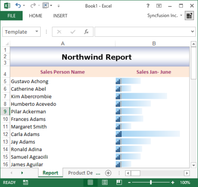
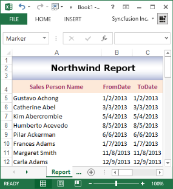
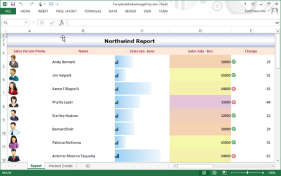
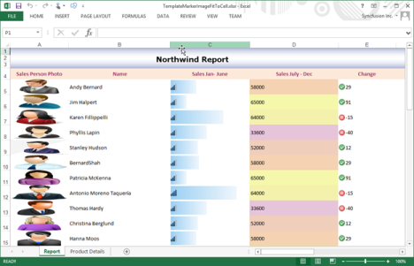
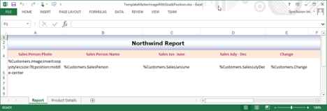

# Working with Template Markers 

This is another variant of the Template based approach, but the difference is that the end-user places special markers in the template spreadsheet that gets replaced along with the data during runtime. The main advantage of this approach is that the end-user gets the flexibility of designing the Excel report.  Cells in the worksheet can be filled with a single data or with multiple records. Format of these data can be changed by using the arguments of the markers. 

## Create from Array

###Marker Syntax

Each marker starts with some prefix. By default, it is "%" character, and followed by the variable name and properties. There can be several arguments after the variable that are delimited by some character. By default, it is semicolon (;).

##Source

XlsIO can be used to bind various data sources to these markers. This includes data sources such as Data Table, Data Set, Data Reader, Data View, Array, Variable and Formulas.

###Arguments

You can specify the following arguments in the marker to customize the worksheet.

* Horizontal-This argument specifies the horizontal direction of the data import for complex variables.
* Vertical-This argument specifies the vertical direction of the data import for complex variables.
* Insert-This argument inserts new rows or columns depending on the direction argument for each new cell. Note that by default, the rows cannot be added.
* insert:copystyles-This argument copies styles from the above row or left column.
* jump:[cell reference in R1C1 notation]-This argument binds the data to the cell at the specified reference. Cell reference addresses can be relative or absolute.
* copyrange:[top-left cell reference in R1C1]:[bottom-right cell reference in R1C1]-Copies the specified cells after each cell import.

Here is the sample after dynamically filling the data during runtime.

The unique advantage of this approach is that the end-user can have customized reports without modifying the source code of the report generating application. The following code example illustrates how to bind the data from a data table, array, and formula to a marker.



//Instantiates the spreadsheet creation engine.

ExcelEngine excelEngine = new ExcelEngine();

excelEngine.Excel.DefaultVersion = ExcelVersion.Excel2013;

//Gets the path of the input file.

string inputPath = GetFullTemplatePath("TemplateMarker.xlsx");

//Opens an existing spreadsheet that will be used as a template for generating the new spreadsheet.

//After opening, the workbook object represents the complete in-memory object model of the template spreadsheet.

IWorkbook workbook = excelEngine.Excel.Workbooks.Open(inputPath);

//The first worksheet object in the worksheets collection is accessed.

IWorksheet worksheet = workbook.Worksheets[0];

// Creates Template Marker Processor.

// Northwind Customers Table.

ITemplateMarkersProcessor marker = workbook.CreateTemplateMarkersProcessor();

marker.AddVariable("Customers", northwindDt);

//Inserts Array Horizontally.

string[] names = new string[] { "Mickey", "Donald", "Tom", "Jerry" };

string[] descriptions = new string[] { "Mouse", "Duck", "Cat", "Mouse" };

marker.AddVariable("Names", names);

marker.AddVariable("Descriptions", descriptions);

//Stretch Formula.

marker.AddVariable("NumbersTable", numbersDt);

//Processes the markers in the template.

marker.ApplyMarkers();

workbook.Version = ExcelVersion.Excel2013;

//Saves the workbook to disk. This spreadsheet is the result of opening and modifying an existing spreadsheet and then saving the result to a new workbook.

fileName = "TemplateMarker.xlsx";

workbook.SaveAs(fileName);

workbook.close();

ecelEngine.Dispose();





'Instantiates the spreadsheet creation engine.

Dim excelEngine As ExcelEngine = New ExcelEngine()

excelEngine.Excel.DefaultVersion = ExcelVersion.Excel2013

'Gets the path of the input file

Dim inputPath As String = GetFullTemplatePath("TemplateMarker.xlsx")

'Opens an existing spreadsheet that will be used as a template for generating the new spreadsheet.

'After opening, the workbook object represents the complete in-memory object model of the template spreadsheet.

Dim workbook As IWorkbook = excelEngine.Excel.Workbooks.Open(inputPath)

Dim sheet As IWorksheet = workbook.Worksheets(0)

' Creates Template Marker Processor.

' Northwind Customers Table.

Dim marker As ITemplateMarkersProcessor = workbook.CreateTemplateMarkersProcessor()

marker.AddVariable("Customers",northwindDt)

' Inserts Array Horizontally.

Dim names As String() = New String() {"Mickey", "Donald", "Tom", "Jerry"}

Dim descriptions As String() = New String() {"Mouse", "Duck", "Cat", "Mouse"}

marker.AddVariable("Names",names)

marker.AddVariable("Descriptions",descriptions)

' Stretch Formula.

marker.AddVariable("NumbersTable",numbersDt)

' Processes the markers in the template.

marker.ApplyMarkers()

workbook.Version = ExcelVersion.Excel2013

'Saves the workbook to disk. This spreadsheet is the result of opening and modifying an existing spreadsheet and then saving the result to a new workbook.

fileName = "TemplateMarker.xlsx"

workbook.SaveAs(fileName)

workbook.close()

excelEngine.Dispose()

Here, CreateTemplateMarkerProcessor returns the ITemplateMarkersProcessor interface that creates and manipulates the marker data. ApplyMarkers method of ITemplateMarkersProcessor is the special method that processes the markers in the template. You can also specify the marker by using the following code example.



//Instantiates the spreadsheet creation engine.

ExcelEngine excelEngine = new ExcelEngine();

excelEngine.Excel.DefaultVersion = ExcelVersion.Excel2013;

//Gets the path of the input file.

string inputPath = GetFullTemplatePath("TemplateMarker.xlsx");

//Opens an existing spreadsheet that will be used as a template for generating the new spreadsheet.

//After opening, the workbook object represents the complete in-memory object model of the template spreadsheet.

IWorkbook workbook = excelEngine.Excel.Workbooks.Open(inputPath);

//The first worksheet object in the worksheets collection is accessed.

IWorksheet sheet = workbook.Worksheets[0];

// Inserts Simple marker.

sheet.Range["B2"].Text = "%Marker";

// Inserts marker that gets value of Author name.

sheet.Range["C2"].Text = "%Marker2.Worksheet.Workbook.Author";

// Inserts marker that gets cell address.

sheet.Range["H2"].Text = "%ArrayProperty.Cells.Address";

ITemplateMarkersProcessor marker = workbook.CreateTemplateMarkersProcessor();

marker.AddVariable("Marker", "First test of markers");

marker.AddVariable("Marker2", sheet.Range["B2"]);

marker.AddVariable("ArrayProperty", sheet.Range["B2:G2"]);

// Processes the markers in the template.

marker.ApplyMarkers();   

workbook.Version = ExcelVersion.Excel2013;

//Saves the workbook to disk. This spreadsheet is the result of opening and modifying an existing spreadsheet and then saving the result to a new workbook.

fileName = "TemplateMarker.xlsx";

workbook.SaveAs(fileName);

workbook.Close();

excelEngine.Dispose();            




'Instantiates the spreadsheet creation engine.

Dim excelEngine As ExcelEngine = New ExcelEngine()

excelEngine.Excel.DefaultVersion = ExcelVersion.Excel2013

'Get the path of the input file

Dim inputPath As String = GetFullTemplatePath("TemplateMarker.xlsx")

'Opens an existing spreadsheet that will be used as a template for generating the new spreadsheet.

'After opening, the workbook object represents the complete in-memory object model of the template spreadsheet.

Dim workbook As IWorkbook = excelEngine.Excel.Workbooks.Open(inputPath)

' Inserts Simple marker.

sheet.Range("B2").Text = "%Marker"

'Inserts marker that gets value of Author name.

sheet.Range("C2").Text = "%Marker2.Worksheet.Workbook.Author"

'Inserts marker that gets cell address.

sheet.Range("H2").Text = "%ArrayProperty.Cells.Address"

Dim marker As ITemplateMarkersProcessor = workbook.CreateTemplateMarkersProcessor()

marker.AddVariable("Marker", "First test of markers")

marker.AddVariable("Marker2", sheet.Range("B2"))

marker.AddVariable("ArrayProperty", sheet.Range("B2:G2"))

' Processes the markers in the template.

marker.ApplyMarkers()

workbook.Version = ExcelVersion.Excel2013

'Saves the workbook to disk. This spreadsheet is the result of opening and modifying an existing spreadsheet and then saving the result to a new workbook.

fileName = "TemplateMarker.xlsx"

workbook.SaveAs(fileName)

workbook.close()

excelEngine.Dispose()


You can also create charts from the data that is bound at runtime by using the marker.

Refer to How to Create Template Markers using XlsIO for more details.

## Create from DataTable 

Detect Data Type and Number Formats

XlsIO now supports detecting the data type and applying the number format to the Template marker. The following is the sample after dynamically detecting and applying data type and number format.



//Instantiates the spreadsheet creation engine.

ExcelEngine excelEngine = new ExcelEngine();

excelEngine.Excel.DefaultVersion = ExcelVersion.Excel2013;

//Gets the path of the input file.

string inputPath = GetFullTemplatePath("TemplateMarker.xlsx");

//Opens an existing spreadsheet that will be used as a template for generating the new spreadsheet.

//After opening, the workbook object represents the complete in-memory object model of the template spreadsheet.

IWorkbook workbook = excelEngine.Excel.Workbooks.Open(inputPath);

//The first worksheet object in the worksheets collection is accessed.

// Creates Template Marker Processor.
ITemplateMarkersProcessor marker = workbook.CreateTemplateMarkersProcessor();

// Northwind customers table.
marker.AddVariable("Customers", northwindDt, VariableTypeAction.DetectNumberFormat);

// Processes the markers and detects the number format along with the data type in the template.
marker.ApplyMarkers();

workbook.Version = ExcelVersion.Excel2013;

//Saves the workbook to disk. This spreadsheet is the result of opening and modifying an existing spreadsheet and then saving the result to a new workbook.

fileName = "TemplateMarker.xlsx";

workbook.SaveAs(fileName);

workbook.Close();

excelEngine.Dispose();            





'Instantiates the spreadsheet creation engine.

Dim excelEngine As ExcelEngine = New ExcelEngine()

excelEngine.Excel.DefaultVersion = ExcelVersion.Excel2013

'Gets the path of the input file

Dim inputPath As String = GetFullTemplatePath("TemplateMarker.xlsx")

'Opens an existing spreadsheet that will be used as a template for generating the new spreadsheet.

'After opening, the workbook object represents the complete in-memory object model of the template spreadsheet.

Dim workbook As IWorkbook = excelEngine.Excel.Workbooks.Open(inputPath)

'Creates Template Marker Processor.
Dim marker As ITemplateMarkersProcessor = workbook.CreateTemplateMarkersProcessor()

'Northwind customers table.
marker.AddVariable("Customers", northwindDt, VariableTypeAction.DetectNumberFormat)

'Processes the markers and detects the number format along with the data type in the template. 
marker.ApplyMarkers()

workbook.Version = ExcelVersion.Excel2013

'Saves the workbook to disk. This spreadsheet is the result of opening and modifying an existing spreadsheet and then saving the result to a new workbook.

fileName = "TemplateMarker.xlsx"

workbook.SaveAs(fileName)

workbook.Close()

excelEngine.Dispose()            


_List of enumerations_ 

<table>
<tr>
<th>
Enum</th><th>
Description</th></tr>
<tr>
<td>
DetectDataType</td><td>
Detects the DataType of the marker variable.</td></tr>
<tr>
<td>
DetectNumberFormat</td><td>
Detects both the NumberFormat and DataType of the marker variable.</td></tr>
<tr>
<td>
None</td><td>
Represents the ‘None’ action.</td></tr>
</table>

##Template Marker with Conditional Formatting

XlsIO allows the CreateConditionalFormat method in the ITemplateMarkerProcessor to dynamically apply the conditional format. It then creates or applies the conditional format to the template marker range dynamically.  Here is the sample for dynamically applied conditional format to data during runtime.

The following code example illustrates how to create or apply conditional format to the Marker.



//Instantiates the spreadsheet creation engine.

ExcelEngine excelEngine = new ExcelEngine();

excelEngine.Excel.DefaultVersion = ExcelVersion.Excel2013;

//Gets the path of the input file.

string inputPath = GetFullTemplatePath("TemplateMarker.xlsx");

//Opens an existing spreadsheet that will be used as a template for generating the new spreadsheet.

//After opening, the workbook object represents the complete in-memory object model of the template spreadsheet.

IWorkbook workbook = excelEngine.Excel.Workbooks.Open(inputPath);

IWorksheet sheet = workbook.Worksheets[0];

ITemplateMarkersProcessor marker = workbook.CreateTemplateMarkersProcessor();

IConditionalFormats conditions = marker.CreateConditionalFormats(sheet["D3"]);

IConditionalFormat condition = conditions.AddCondition();

condition.FormatType = ExcelCFType.IconSet;

condition.IconSet.IconSet = ExcelIconSetType.ThreeFlags;

workbook.Version = ExcelVersion.Excel2013;

//Saves the workbook to disk. This spreadsheet is the result of opening and modifying an existing spreadsheet and then saving the result to a new workbook.

fileName = "TemplateMarker.xlsx";

workbook.SaveAs(fileName);

workbook.Close();

excelEngine.Dispose();            





'Instantiates the spreadsheet creation engine.

Dim excelEngine As ExcelEngine = New ExcelEngine()

excelEngine.Excel.DefaultVersion = ExcelVersion.Excel2013

'Gets the path of the input file.

Dim inputPath As String = GetFullTemplatePath("TemplateMarker.xlsx")

'Opens an existing spreadsheet that will be used as a template for generating the new spreadsheet.

'After opening, the workbook object represents the complete in-memory object model of the template spreadsheet.

Dim workbook As IWorkbook = excelEngine.Excel.Workbooks.Open(inputPath)

Dim sheet As IWorksheet = workbook.Worksheets(0)

'Creates Template Marker Processor.
Dim marker As ITemplateMarkersProcessor = workbook.CreateTemplateMarkersProcessor()

Dim conditions AsIConditionalFormats = marker.CreateConditionalFormats(sheet("D3"))

Dim condition AsIConditionalFormat = conditions.AddCondition()

condition.FormatType = ExcelCFType.IconSet

condition.IconSet.IconSet = ExcelIconSetType.ThreeFlags

workbook.Version = ExcelVersion.Excel2013

'Saves the workbook to disk. This spreadsheet is the result of opening and modifying an existing spreadsheet and then saving the result to a new workbook.

fileName = "TemplateMarker.xlsx"

workbook.SaveAs(fileName)

workbook.Close()

excelEngine.Dispose()            



For More Information refer to: AutoFilters, Validating Data, Template Markers, Grouping and Ungrouping

## Create from Business objects 



#region Initialize Workbook

//New instance of XlsIO is created. [Equivalent to launching MS Excel with no workbooks open].

//The instantiation process consists of two steps.

//Instantiates the spreadsheet creation engine.

ExcelEngine excelEngine = new ExcelEngine();

excelEngine.Excel.DefaultVersion = ExcelVersion.Excel2013;

//Gets the path of the input file.

string inputPath = GetFullTemplatePath("TemplateMarker.xlsx");

//Opens an existing spreadsheet that will be used as a template for generating the new spreadsheet.

//After opening, the workbook object represents the complete in-memory object model of the template spreadsheet.

IWorkbook workbook = excelEngine.Excel.Workbooks.Open(inputPath);

//The first worksheet object in the worksheets collection is accessed.

IWorksheet worksheet1 = workbook.Worksheets[0];

IWorksheet worksheet2 = workbook.Worksheets[1];

#endregion

#region Create Template Marker

//Creates Template Marker Processor.

ITemplateMarkersProcessor marker = workbook.CreateTemplateMarkersProcessor();

IConditionalFormats conditionalFormats = marker.CreateConditionalFormats(worksheet1["C5"]);

#region Data Bar

//Applies markers using Formula.

IConditionalFormat condition = conditionalFormats.AddCondition();

//Sets Data bar and icon set for the same cell.

//Sets the format type.

condition.FormatType = ExcelCFType.DataBar;

IDataBar dataBar = condition.DataBar;

//Sets the constraint.

dataBar.MinPoint.Type = ConditionValueType.LowestValue;

dataBar.MinPoint.Value = "0";

dataBar.MaxPoint.Type = ConditionValueType.HighestValue;

dataBar.MaxPoint.Value = "0";

//Sets color for Bar.

dataBar.BarColor = Color.FromArgb(156, 208, 243);

//Hides the value in data bar.

dataBar.ShowValue = false;

#endregion

#region IconSet

condition = conditionalFormats.AddCondition();

condition.FormatType = ExcelCFType.IconSet;

IIconSet iconSet = condition.IconSet;

iconSet.IconSet = ExcelIconSetType.FourRating;

iconSet.IconCriteria[0].Type = ConditionValueType.LowestValue;

iconSet.IconCriteria[0].Value = "0";

iconSet.IconCriteria[1].Type = ConditionValueType.HighestValue;

iconSet.IconCriteria[1].Value = "0";

iconSet.ShowIconOnly = true;

#endregion

conditionalFormats = marker.CreateConditionalFormats(worksheet1["D5"]);

#region Color Scale

condition = conditionalFormats.AddCondition();

condition.FormatType = ExcelCFType.ColorScale;

IColorScale colorScale = condition.ColorScale;

//Sets 3 - color scale.

colorScale.SetConditionCount(3);

colorScale.Criteria[0].FormatColorRGB = Color.FromArgb(230, 197, 218);

colorScale.Criteria[0].Type = ConditionValueType.LowestValue;

colorScale.Criteria[0].Value = "0";

colorScale.Criteria[1].FormatColorRGB = Color.FromArgb(244, 210, 178);

colorScale.Criteria[1].Type = ConditionValueType.Percentile;

colorScale.Criteria[1].Value = "50";

colorScale.Criteria[2].FormatColorRGB = Color.FromArgb(245, 247, 171);

colorScale.Criteria[2].Type = ConditionValueType.HighestValue;

colorScale.Criteria[2].Value = "0";

#endregion

conditionalFormats = marker.CreateConditionalFormats(worksheet1["E5"]);

#region Iconset

condition = conditionalFormats.AddCondition();

condition.FormatType = ExcelCFType.IconSet;

iconSet = condition.IconSet;

iconSet.IconSet = ExcelIconSetType.ThreeSymbols;

iconSet.IconCriteria[0].Type = ConditionValueType.LowestValue;

iconSet.IconCriteria[0].Value = "0";

iconSet.IconCriteria[1].Type = ConditionValueType.HighestValue;

iconSet.IconCriteria[1].Value = "0";

iconSet.ShowIconOnly = false;

#endregion

//Northwind customers table.

if (rdbDataTable.Checked)

   marker.AddVariable("Customers", northwindDt);

else

 {

   //New instance of XlsIO is created. [Equivalent to launching MS Excel with no workbooks open].

   //The instantiation process consists of two steps.

     if (this._customers.Count == 0)

       {

         this._customers = GetCustomerAsObjects();

       }

  marker.AddVariable("Customers", _customers);

  }

//Creates markers.

worksheet1.Range["B9"].Text = "%Names;horizontal";

worksheet1.Range["B10"].Text = "%Descriptions;horizontal";

//Inserts Array Horizontally.

string[] names = new string[] { "Essential DocIO", "Essential XlsIO", "Essential Pdf" };

string[] descriptions = new string[] { "This is an efficient library for creating MSWord documents", "This is an efficient library for creating MSExcel documents", "This is an efficient library for creating Adobe PDF documents" };

marker.AddVariable("Names", names);

marker.AddVariable("Descriptions", descriptions);

//Stretch Formula. This shows the data getting replaced in the marker specified in another worksheet.

marker.AddVariable("NumbersTable", numbersDt);

//Processes the markers in the template.

marker.ApplyMarkers();

#endregion

#region Save the Workbook

workbook.Version = ExcelVersion.Excel2013;

//Saves the workbook to disk. This spreadsheet is the result of opening and modifying an existing spreadsheet and then saving the result to a new workbook.

fileName = "TemplateMarker.xlsx";

workbook.SaveAs(fileName);

#endregion

workbook.close();

excelEngine.Dispose();




'Instantiates the spreadsheet creation engine.

Dim excelEngine As ExcelEngine = New ExcelEngine()

excelEngine.Excel.DefaultVersion = ExcelVersion.Excel2013

'Gets the path of the input file.

Dim inputPath As String = GetFullTemplatePath("TemplateMarker.xlsx")

'Opens an existing spreadsheet that will be used as a template for generating the new spreadsheet.

'After opening, the workbook object represents the complete in-memory object model of the template spreadsheet.

Dim workbook As IWorkbook = excelEngine.Excel.Workbooks.Open(inputPath)

'The first worksheet object in the worksheets collection is accessed.

Dim worksheet1 As IWorksheet = workbook.Worksheets(0)

Dim worksheet2 As IWorksheet = workbook.Worksheets(1)

'Creates Template Marker Processor.

Dim marker As ITemplateMarkersProcessor = workbook.CreateTemplateMarkersProcessor()

Dim conditionalFormats As IConditionalFormats = marker.CreateConditionalFormats(worksheet1("C5"))

'Applies markers by using Formula.

Dim condition As IConditionalFormat = conditionalFormats.AddCondition()

'Sets Data bar and icon set for the same cell.

'Sets the format type.

condition.FormatType = ExcelCFType.DataBar

Dim dataBar As IDataBar = condition.DataBar

'Sets the constraint.

dataBar.MinPoInteger.Type = ConditionValueType.LowestValue

dataBar.MinPoInteger.Value = "0"

dataBar.MaxPoInteger.Type = ConditionValueType.HighestValue

dataBar.MaxPoInteger.Value = "0"

'Sets color for Bar.

dataBar.BarColor = Color.FromArgb(156, 208, 243)

'Hides the value in data bar.

dataBar.ShowValue = False

condition = conditionalFormats.AddCondition()

condition.FormatType = ExcelCFType.IconSet

Dim iconSet As IIconSet = condition.IconSet

iconSet.IconSet = ExcelIconSetType.FourRating

iconSet.IconCriteria(0).Type = ConditionValueType.LowestValue

iconSet.IconCriteria(0).Value = "0"

iconSet.IconCriteria(1).Type = ConditionValueType.HighestValue

iconSet.IconCriteria(1).Value = "0"

iconSet.ShowIconOnly = True

conditionalFormats = marker.CreateConditionalFormats(worksheet1("D5"))

condition = conditionalFormats.AddCondition()

condition.FormatType = ExcelCFType.ColorScale

Dim colorScale As IColorScale = condition.ColorScale

'Sets 3 - color scale.

colorScale.SetConditionCount(3)

colorScale.Criteria(0).FormatColorRGB = Color.FromArgb(230, 197, 218)

colorScale.Criteria(0).Type = ConditionValueType.LowestValue

colorScale.Criteria(0).Value = "0"

colorScale.Criteria(1).FormatColorRGB = Color.FromArgb(244, 210, 178)

colorScale.Criteria(1).Type = ConditionValueType.Percentile

colorScale.Criteria(1).Value = "50"

colorScale.Criteria(2).FormatColorRGB = Color.FromArgb(245, 247, 171)

colorScale.Criteria(2).Type = ConditionValueType.HighestValue

colorScale.Criteria(2).Value = "0"

conditionalFormats = marker.CreateConditionalFormats(worksheet1("E5"))

condition = conditionalFormats.AddCondition()

condition.FormatType = ExcelCFType.IconSet

iconSet = condition.IconSet

iconSet.IconSet = ExcelIconSetType.ThreeSymbols

iconSet.IconCriteria(0).Type = ConditionValueType.LowestValue

iconSet.IconCriteria(0).Value = "0"

iconSet.IconCriteria(1).Type = ConditionValueType.HighestValue

iconSet.IconCriteria(1).Value = "0"

iconSet.ShowIconOnly = False

  If rdbDataTable.Checked Then

                marker.AddVariable("Customers", northwindDt)

            Else

                'New instance of XlsIO is created. [Equivalent to launching MS Excel         with no workbooks open].

                'The instantiation process consists of two steps.

                If Me._customers.Count = 0 Then

                    Me._customers = GetCustomerAsObjects()

                End If

                marker.AddVariable("Customers", _customers)

            End If

worksheet1.Range("B9").Text = "%Names;horizontal"

worksheet1.Range("B10").Text = "%Descriptions;horizontal"

'Inserts Array Horizontally.

Dim names() As String = New String() {"Essential DocIO", "Essential XlsIO", "Essential Pdf"}

Dim descriptions() As String = New String() {"This is an efficient library for creating MSWord documents", "This is an efficient library for creating MSExcel documents", "This is an efficient library for creating Adobe PDF documents"}

marker.AddVariable("Names", names)

marker.AddVariable("Descriptions", descriptions)

'Stretch Formula. This shows the data getting replaced in the marker specified in another worksheet.

marker.AddVariable("NumbersTable", numbersDt)

'Processes the markers in the template.

marker.ApplyMarkers()

workbook.Version = ExcelVersion.Excel2013

'Saves the workbook to disk. This spreadsheet is the result of opening and modifying an existing spreadsheet and then saving the result to a new workbook.

fileName = "TemplateMarker.xlsx"

workbook.SaveAs(fileName)

workbook.close();

excelEngine.Dispose();


GetCustomerAsObjects Method:



//Loads Data.

DataSet customersDataSet = new DataSet();

//Gets the path of the input file.

string inputXmlPath = GetFullTemplatePath("Customers.xml");

customersDataSet.ReadXml(inputXmlPath, XmlReadMode.ReadSchema);

northwindDt = customersDataSet.Tables[0];

numbersDt = GetTable();

        private DataTable GetTable()

        {

            Random r = new Random();

            DataTable dt = new DataTable("NumbersTable");

            int nCols = 4;

            int nRows = 10;

            for (int i = 0; i < nCols; i++)

                dt.Columns.Add(new DataColumn("Column" + i.ToString()));

            for (int i = 0; i < nRows; ++i)

            {

                DataRow dr = dt.NewRow();

                for (int j = 0; j < nCols; j++)

                    dr[j] = r.Next(0, 10);

                dt.Rows.Add(dr);

            }

            return dt;

        } 

     private IList<Customer> GetCustomerAsObjects()

        {

            DataSet customersDataSet = new DataSet();

            //Gets the path of the input file.

            string inputXmlPath = GetFullTemplatePath("Customers.xml");

            customersDataSet.ReadXml(inputXmlPath, XmlReadMode.ReadSchema);

            northwindDt = customersDataSet.Tables[0];

            IList<Customer> tmpCustomers = new List<Customer>();

            Customer customer = new Customer();

            numbersDt = GetTable();

            //numbersDt = GetTable();

            DataColumnCollection columns = northwindDt.Columns;

            DataRowCollection rows = northwindDt.Rows;

            foreach (DataRow row in rows)

            {

                customer = new Customer();

                customer.SalesPerson = row[0].ToString();

                customer.SalesJanJune = row[1].ToString();

                customer.SalesJulyDec = row[2].ToString();

                customer.Change = Convert.ToInt32(row[3]);

                tmpCustomers.Add(customer);

            }

            return tmpCustomers;

        }




'Loads Data.

Dim customersDataSet As DataSet = New DataSet()

'Gets the path of the input file.

Dim inputXmlPath As String = GetFullTemplatePath("Customers.xml")

customersDataSet.ReadXml(inputXmlPath, XmlReadMode.ReadSchema)

northwindDt = customersDataSet.Tables(0)

numbersDt = GetTable()

       Private Function GetTable() As DataTable

            Dim r As Random = New Random()

            Dim dt As DataTable = New DataTable("NumbersTable")

            Dim nCols As Integer = 4

            Dim nRows As Integer = 10

            Dim i As Integer

            For i = 0 To nCols - 1 Step i + 1

                dt.Columns.Add(New DataColumn("Column" + i.ToString()))

            Next

            Dim i As Integer

            For i = 0 To nRows - 1 Step +1

                Dim dr As DataRow = dt.NewRow()

                Dim j As Integer

                For j = 0 To nCols - 1 Step j + 1

                    dr(j) = r.Next(0, 10)

                Next

                dt.Rows.Add(dr)

            Next

            Return dt

        End Function

           Private Function GetCustomerAsObjects() As IList<Customer>

            Dim customersDataSet As DataSet = New DataSet()

            'Gets the path of the input file.

            Dim inputXmlPath As String = GetFullTemplatePath("Customers.xml")

            customersDataSet.ReadXml(inputXmlPath, XmlReadMode.ReadSchema)

            northwindDt = customersDataSet.Tables(0)

            Dim tmpCustomers As IList<Customer> =  New List<Customer>() 

            Dim customer As Customer = New Customer()

            numbersDt = GetTable()

            'numbersDt = GetTable();

            Dim columns As DataColumnCollection = northwindDt.Columns

            Dim rows As DataRowCollection = northwindDt.Rows

            Dim row As DataRow

            For Each row In rows

                customer = New Customer()

                customer.SalesPerson = row(0).ToString()

                customer.SalesJanJune = row(1).ToString()

                customer.SalesJulyDec = row(2).ToString()

                customer.Change = Convert.ToInt32(row(3))

                tmpCustomers.Add(customer)

            Next

            Return tmpCustomers

        End Function



Customer Class



class Customer
   {

       // Defines the Members.
        #region Members
        private string m_salesPerson;
        private int m_salesJanJune;
        private int m_salesJulyDec;
        private int m_change;
        #endregion

        // Defines the properties.
        #region Properties
        public string SalesPerson
        {
            get
            {
                return m_salesPerson;
            }
            set
            {
                m_salesPerson = value;
            }
        }

        public int SalesJanJune
        {
            get
            {
                return m_salesJanJune;
            }
            set
            {
                m_salesJanJune = value;
            }

        }

        public int SalesJulyDec
        {
            get
            {
                return m_salesJulyDec;
            }
            set
            {
                m_salesJulyDec = value;
            }
        }

        public int Change
        {
            get
            {
                return m_change;
            }
            set
            {
                m_change = value;
            }
        }
        #endregion

        #region Initialization
        public Customer()
        {
        }
        public Customer(string name, int juneToJuly, int julyToDec, int change)
        {
            this.m_salesPerson = name;
            this.m_salesJanJune = juneToJuly;
            this.m_salesJulyDec = julyToDec;
            this.m_change = change;
        }
        #endregion
    }




Class Customer 

        ' Defines the Members.
        #Region “Members”
        Private m_salesPerson As String
        Private m_salesJanJune As Integer
        Private m_salesJulyDec As Integer
        Private m_change As Integer
        #End Region

        ' Defines the Properties.
        #Region “Properties”
        Public Property SalesPerson() As String        
            Get            
                Return m_salesPerson
            End Get
            Set            
                m_salesPerson = value
            End Set  
        End Property     

        Public Property SalesJanJune() As Integer        
            Get            
                Return m_salesJanJune            
            End Get
            Set            
                m_salesJanJune = value
            End Set        
        End Property     

        Public Property SalesJulyDec() As Integer                
            Get            
                Return m_salesJulyDec

            End Get
            Set          
               m_salesJulyDec = value
            End Set        
       End Property     

       Public Property Change() As Integer                        
            Get            
                Return m_change            
            End Get
            Set  

                  m_change = value
            End Set        
       End Property     
       #End Region

        #Region “Initialization”
        Public Sub New()
        End Sub
        Public Sub New(name As String, juneToJuly As Integer, julyToDec As Integer, change As Integer)      
            Me.m_salesPerson = name
            Me.m_salesJanJune = juneToJuly
            Me.m_salesJulyDec = julyToDec
            Me.m_change = change   
         End Sub      
        #End Region
End Class    


## Inserting images into Template Markers

You can generate reports more appealingly with image support in Template Markers. The possible images supported are listed as follows. 

* GIF
* JPEG
* PNG
* BMP
* TIFF

Automatically, XlsIO detects the property as image when its type is System.Drawing.Image or byte []. XlsIO provides special markers options to format the images such as size, fittocell & position. The size of the image is measured as “width,height” in pixels and the position is denoted as “vertical – horizontal”. When the size is not specified, then the default size (50,50 px) is applied.

In the following example, a marker is added for merging images.  Like a simple template marker, data source and property name is specified (%Customers.Image;) for image also. Further, the image size is specified as 70x70 px (size:70) and its position as middle-center of the cell.

The list of markers that support to insert and format the images are specified in the following table. 

_List of Markers_

<table>
<tr>
<th>
No</th><th>
Usage in Template</th><th>
Description</th></tr>
<tr>
<td>
1</td><td>
No parameter Ex: %Customers.CustomerImage;</td><td>
Image is applied with a default size (50x50 px) and position (Top-Left).</td></tr>
<tr>
<td>
2</td><td>
fittocell  Ex: %Customers.CustomerImage;fittocell</td><td>
The image is applied to cell width and height.</td></tr>
<tr>
<td>
3</td><td>
size:width,heightEx:%Customers.CustomerImage;size:60(or)%Customers.CustomerImage;size:60,60</td><td>
Image is applied to the specified size (width, height).Heightparameter is optional. Value of width is applied when height is not specified.</td></tr>
<tr>
<td>
4</td><td>
position:positionEx:%Customers.CustomerImage;position:middle-center(or)%Customers.CustomerImage;position:right </td><td>
Image is positioned (top-left, top-center, etc.,) within the cell.</td></tr>
</table>

The following table displays the list of image position enumeration.

_List of image position enumeration_

<table>
<tr>
<th>
Enum</th><th>
Description</th></tr>
<tr>
<td>
Top-Left</td><td>
Positions vertically top and horizontally left to the cell.</td></tr>
<tr>
<td>
Top-Center</td><td>
Positions vertically top and horizontally center to the cell.</td></tr>
<tr>
<td>
Top-Right</td><td>
Positions vertically top and horizontally right to the cell.</td></tr>
<tr>
<td>
Middle-Left</td><td>
Positions vertically middle and horizontally left to the cell.</td></tr>
<tr>
<td>
Middle-Center</td><td>
Positions vertically middle and horizontally center to the cell.</td></tr>
<tr>
<td>
Middle-Right</td><td>
Positions vertically middle and horizontally right to the cell.</td></tr>
<tr>
<td>
Bottom-Left</td><td>
Positions vertically bottom and horizontally left to the cell.</td></tr>
<tr>
<td>
Bottom-Middle</td><td>
Positions vertically bottom and horizontally middle to the cell.</td></tr>
<tr>
<td>
Bottom-Right</td><td>
Positions vertically bottom and horizontally right to the cell.</td></tr>
</table>

The following code examples illustrate on how to insert images in to the Template Marker.

1. Here, the Url of an image is added in the xml document. By Xml Schema Definition it can be a string or AnyURI type.

 <Customers>

<SalesPerson>Andy Bernard</SalesPerson>

<SalesJanJune>45000</SalesJanJune>

<SalesJulyDec>58000</SalesJulyDec>

<Change>29</Change>

<Image>images/image.jpg</Image>

</Customers>

1. Include image property in the class. 

class Customer

    {

        private string SalesPerson;

        private string SalesJanJune;

        private string SalesJulyDec;

        private int Change;

        private byte[] Image;

    }

2. Images mapped in the xml document are converted to byte array and filled in to DataTable.
3. Finally, the marker object is created and applied. Inserting images sets its row height.

// Creates Template Marker Processor.

ITemplateMarkersProcessor marker = workbook.CreateTemplateMarkersProcessor();

// Northwind customers table.

marker.AddVariable("Customers", northwindDt, VariableTypeAction.DetectNumberFormat);

// Processes the markers and detects the number format along with the data type in the template.

marker.ApplyMarkers();

The output screens of all the image insertion options along with its input templates are as follows.

##Default image input and output

When the size and position is not mentioned, the default size of 50x50pixels and top-left position are applied.

* Input Template

* Output Screen

###Image with FitToCell attribute

* Input Template

* Output

###Image with Size

* Input Template

* Output

###Image with Position

* Input Template

*  Output

###Image with position and size

* Input Template

*  Output

