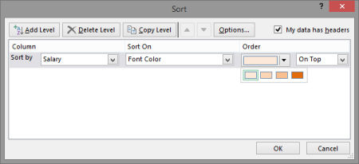
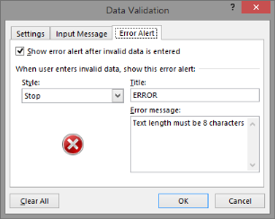
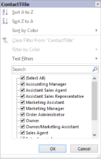
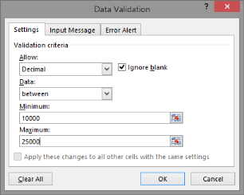

# Worksheet Cells Manipulation

The IRange interface represents a single cell or a group of cells in a worksheet. XlsIO has several useful methods for manipulating data and formatting it in the ranges.

## Accessing a Cell or a Range

Range of cells can be accessed through the IRange interface. The following code example illustrates this.

[C#]

//Gets cell range.

IRange this[string name] { get; }

// Gets/sets cell by row and index.

IRange this[int row, int column] { get; }

//Gets cell range.

IRange this[string name, bool IsR1C1Notation] { get; }

//Gets cells range.

IRange this[int row, int column, int lastRow, int lastColumn] { get; }

> _Note: Here row and column indexes in the range are "one based". Following code example explains various ways of accessing cells._

[C#]

// Step 1: Instantiates the spreadsheet creation engine.

ExcelEngine excelEngine = new ExcelEngine();

// Step 2: Instantiates the excel application object.

IApplication application = excelEngine.Excel;

// A new workbook is created. [Equivalent to creating a new workbook in MS Excel).

// The new workbook will have 2 worksheets.

IWorkbook workbook = application.Workbooks.Create(2);

IWorksheet sheet = workbook.Worksheets[0];

// Method 1 to Access a Range.

sheet.Range["A7"].Text = "Accessing a Range (Method 1)";

// Method 2 to Access a Range.

sheet.Range[9, 1].Text = "Accessing a Range (Method 2)";

// Method 3 to Access a Range(by using defined names).

sheet.Range["Name"].Text = "Accessing a Range (Method 3)";

// Accesses a Range of cells (Method 1).

sheet.Range["A13:C13"].Text = "Accessing a Range of Cells (Method 1)";

// Accesses a Range of cells (Method 2).

sheet.Range[15, 1, 15, 3].Text = "Accessing a Range of Cells (Method 2)";

// Accesses a Range of cells (Method 3 using defined names).

sheet.Range["Name1"].Text = "Accessing a Range of Cells (Method 3)";

string fileName = "Output.xlsx";

workbook.Version = ExcelVersion.Excel2010;

workbook.SaveAs(fileName);

// Closes the workbook.

workbook.Close();

excelEngine.Dispose();

[VB.NET]

' Step 1: Instantiates the spreadsheet creation engine.

Dim excelEngine As ExcelEngine = New ExcelEngine

' Step 2: Instantiates the excel application object.

Dim application As IApplication = excelEngine.Excel

' A new workbook is created. [Equivalent to creating a new workbook in MS Excel].

'The new workbook will have 2 worksheets.

Dim workbook As IWorkbook = application.Workbooks.Create(2)

' Accesses via index.

Dim sheet As IWorkbook = workbook.Worksheets(0)

' Method 1 to Access a Range.

sheet.Range("A7").Text = "Accessing a Range (Method 1)"

' Method 2 to Access a Range.

sheet.Range(9, 1).Text = "Accessing a Range (Method 2)"

' Method 3 to Access a Range(using defined names).

sheet.Range("Name").Text = "Accessing a Range (Method 3)"

' Accesses a Range of cells (Method 1).

sheet.Range("A13:C13").Text = "Accessing a Range of Cells (Method 1)"

' Accesses a Range of cells (Method 2).

sheet.Range(15, 1, 15, 3).Text = "Accessing a Range of Cells (Method 2)"

' Accesses a Range of cells (Method 3 using defined names).

sheet.Range("Name1").Text = "Accessing a Range of Cells (Method 3)"

Dim fileName As String = "Output.xlsx"

workbook.Version = ExcelVersion.Excel2010

workbook.SaveAs(fileName)

' Closes the workbook.

workbook.Close()

excelEngine.Dispose()

Accessing Discontinuous Ranges

You can also access different discontinuous ranges and add them to the RangesCollection so that the same format is applied to different ranges. The following code example explains the same.

[C#]

// Step 1: Instantiates the spreadsheet creation engine.

ExcelEngine excelEngine = new ExcelEngine();

// Step 2: Instantiates the excel application object.

IApplication application = excelEngine.Excel;

// A new workbook is created. [Equivalent to creating a new workbook in MS Excel).

// The new workbook will have 2 worksheets.

IWorkbook workbook = application.Workbooks.Create(2);

IWorksheet sheet = workbook.Worksheets[0];

IRange range1 = sheet.Range[ "A1:A2" ];

IRange range2 = sheet.Range["C1:C2" ];

IRanges ranges = sheet.CreateRangesCollection();

ranges.Add( range1 );

ranges.Add( range2 );

ranges.Text = "Test";

string fileName = "Output.xlsx";

workbook.Version = ExcelVersion.Excel2010;

workbook.SaveAs(fileName);

// Closes the workbook.

workbook.Close();

excelEngine.Dispose();

[VB.NET]

' Step 1: Instantiates the spreadsheet creation engine.

Dim excelEngine As ExcelEngine = New ExcelEngine

' Step 2: Instantiates the excel application object.

Dim application As IApplication = excelEngine.Excel

' A new workbook is created. [Equivalent to creating a new workbook in MS Excel].

'The new workbook will have 2 worksheets.

Dim workbook As IWorkbook = application.Workbooks.Create(2)

' Accesses via index.

Dim sheet As IWorkbook = workbook.Worksheets(0)

Dim range1 As IRange = sheet.Range("A1:A2")

Dim range2 As IRange = sheet.Range("C1:C2")

Dim ranges As IRanges = sheet.CreateRangesCollection()

ranges.Add(range1)

ranges.Add(range2)

ranges.Text = "Test"

tring fileName = "Output.xlsx"

workbook.Version = ExcelVersion.Excel2010

workbook.SaveAs(fileName)

' Closes the workbook.

workbook.Close()

excelEngine.Dispose()

Access by using IMigrantRange for better performance

The IMigrantRange interface can be used to access a worksheet range and manipulate it. This is an optimal method of writing data with better performance. The following code example illustrates this.

[C#]

// Step 1: Instantiates the spreadsheet creation engine.

ExcelEngine excelEngine = new ExcelEngine();

// Step 2: Instantiates the excel application object.

IApplication application = excelEngine.Excel;

// A new workbook is created. [Equivalent to creating a new workbook in MS Excel).

// The new workbook will have 2 worksheets.

IWorkbook workbook = application.Workbooks.Create(2);

IWorksheet sheet = workbook.Worksheets[0];

IMigrantRange migrantRange = sheet.MigrantRange;

// Writes Data.

for (int row = 1; row <= rowCount; row++)

{

    for (int column = 1; column <= colCount; column++)

    {

// Writes values.

        migrantRange.ResetRowColumn(row, column);

        migrantRange.Text = "Test";

    }

}

string fileName = "Output.xlsx";

workbook.Version = ExcelVersion.Excel2010;

workbook.SaveAs(fileName);

// Closes the workbook.

workbook.Close();

excelEngine.Dispose();

[VB.NET]

' Step 1: Instantiates the spreadsheet creation engine.

Dim excelEngine As ExcelEngine = New ExcelEngine

' Step 2: Instantiates the excel application object.

Dim application As IApplication = excelEngine.Excel

' A new workbook is created. [Equivalent to creating a new workbook in MS Excel].

'The new workbook will have 2 worksheets.

Dim workbook As IWorkbook = application.Workbooks.Create(2)

' Accesses via index.

Dim sheet As IWorkbook = workbook.Worksheets(0)

Dim migrantRange As IMigrantRange = sheet.MigrantRange

' Writes Data.

Dim row As Integer

For  row = 1 To  rowCount Step  row + 1

Dim column As Integer

      For  column = 1 To  colCount Step  column + 1

' Writes values.

            migrantRange.ResetRowColumn(row, column)

            migrantRange.Text = "Test"

      Next

Next

Dim fileName As String = "Output.xlsx"

workbook.Version = ExcelVersion.Excel2010

workbook.SaveAs(fileName)

' Closes the workbook.

workbook.Close()

excelEngine.Dispose()

## Accessing used range of a Worksheet 

XlsIO enables you to get the range of cells used in a given sheet. This helps you to apply the same format to all the cells used in the worksheet. You can also get the first row/column, last row/column, and number of rows/columns used in the sheet by using the various methods of IRange.

> _Note: By default, XlsIO considers a cell as used, even when there exists some formatting. You can disable this behavior, and make XlsIO consider a cell as used, only when there exists data, by using the UsedRangeIncludesFormatting property._

The following code example is used to format the Used Range.

[C#]

// Step 1: Instantiates the spreadsheet creation engine.

ExcelEngine excelEngine = new ExcelEngine();

// Step 2: Instantiates the excel application object.

IApplication application = excelEngine.Excel;

// A new workbook is created. [Equivalent to creating a new workbook in MS Excel).

// The new workbook will have 2 worksheets.

IWorkbook workbook = application.Workbooks.Create(2);

IWorksheet sheet = workbook.Worksheets[0];

// Modifies only the Used Ranges.

sheet.UsedRange.ColumnWidth = 20;

sheet.UsedRange.RowHeight = 20;

string fileName = "Output.xlsx";

workbook.Version = ExcelVersion.Excel2010;

workbook.SaveAs(fileName);

// Closes the workbook.

workbook.Close();

excelEngine.Dispose();

[VB.NET]

' Step 1: Instantiates the spreadsheet creation engine.

Dim excelEngine As ExcelEngine = New ExcelEngine

' Step 2: Instantiates the excel application object.

Dim application As IApplication = excelEngine.Excel

' A new workbook is created. [Equivalent to creating a new workbook in MS Excel].

'The new workbook will have 2 worksheets.

Dim workbook As IWorkbook = application.Workbooks.Create(2)

' Accesses via index.

Dim sheet As IWorkbook = workbook.Worksheets(0)

' Modifies only the Used Ranges.

sheet.UsedRange.ColumnWidth = 20

sheet.UsedRange.RowHeight = 20

Dim fileName As String = "Output.xlsx"

workbook.Version = ExcelVersion.Excel2010

workbook.SaveAs(fileName)

' Closes the workbook.

workbook.Close()

excelEngine.Dispose()

## Clear a Cell or a Range

While editing Excel workbooks, one of the most common action that is performed is clearing or deleting cells. Clearing cells mean erasing everything within them, whereas deleting actually deletes the entire cell. You can clear the cell content by using the Clear method. XlsIO also provides options to clear styles or data alone.

The following code example illustrates how to clear a range along with its formatting.

[C#]

// Step 1: Instantiates the spreadsheet creation engine.

ExcelEngine excelEngine = new ExcelEngine();

// Step 2: Instantiates the excel application object.

IApplication application = excelEngine.Excel;

// A new workbook is created. [Equivalent to creating a new workbook in MS Excel).

// The new workbook will have 2 worksheets.

IWorkbook workbook = application.Workbooks.Create(2);

IWorksheet sheet = workbook.Worksheets[0];

// Cleares a Range and its formatting.

sheet.Range["A4"].Clear(true);

string fileName = "Output.xlsx";

workbook.Version = ExcelVersion.Excel2010;

workbook.SaveAs(fileName);

// Closes the workbook.

workbook.Close();

excelEngine.Dispose();

[VB.NET]

' Step 1: Instantiates the spreadsheet creation engine.

Dim excelEngine As ExcelEngine = New ExcelEngine

' Step 2: Instantiates the excel application object.

Dim application As IApplication = excelEngine.Excel

' A new workbook is created. [Equivalent to creating a new workbook in MS Excel].

'The new workbook will have 2 worksheets.

Dim workbook As IWorkbook = application.Workbooks.Create(2)

' Accesses via index.

Dim sheet As IWorkbook = workbook.Worksheets(0)

' Cleares a Range and its formatting.

sheet.Range("A4").Clear(True)

Dim fileName As String = "Output.xlsx"

workbook.Version = ExcelVersion.Excel2010

workbook.SaveAs(fileName)

' Closes the workbook.

workbook.Close()

excelEngine.Dispose()

## Copy or Move a Range

Moving or copying cells is a very common procedure while creating or editing your worksheets. XlsIO provides support to copy a range of cells from one end to another. CopyTo method enables copying range of cells from the source to the destination. It has an option to copy all the formats or only specific formats to the destination range by using the ExcelCopyRangeOptions enumerator. Following.

_Values set for the ExcelCopyRangeOptions_

<table>
<tr>
<td>
Members </td><td>
Description</td></tr>
<tr>
<td>
None</td><td>
Indicates to copy only the cell value. </td></tr>
<tr>
<td>
UpdateFormulas</td><td>
Indicates formula during copy. WARNING: You should always specify this flag when your operations can change the position of Array formula. </td></tr>
<tr>
<td>
UpdateMerges</td><td>
Indicates to update merges during copy.</td></tr>
<tr>
<td>
CopyStyles</td><td>
Indicates to copy styles during range copy. </td></tr>
<tr>
<td>
CopyShapes</td><td>
Indicates to copy shapes during range copy. </td></tr>
<tr>
<td>
CopyErrorIndicators</td><td>
Indicates to copy error indicators during range copy. </td></tr>
<tr>
<td>
CopyConditionalFormats</td><td>
Indicates to copy conditional formats during range copy. </td></tr>
<tr>
<td>
All</td><td>
Indicates functionionality of all the above flags. </td></tr>
</table>

The following code example illustrates how to copy a range of cells from the source to the destination.

[C#]

// Step 1: Instantiates the spreadsheet creation engine.

ExcelEngine excelEngine = new ExcelEngine();

// Step 2: Instantiates the excel application object.

IApplication application = excelEngine.Excel;

// A new workbook is created. [Equivalent to creating a new workbook in MS Excel).

// The new workbook will have 2 worksheets.

IWorkbook workbook = application.Workbooks.Create(2);

IWorksheet sheet = workbook.Worksheets[0];

// Copies a Range.

IRange source = sheet.Range["A1"];

IRange des = sheet.Range["A5"];

source.CopyTo(des);

string fileName = "Output.xlsx";

workbook.Version = ExcelVersion.Excel2010;

workbook.SaveAs(fileName);

// Closes the workbook.

workbook.Close();

excelEngine.Dispose();

[VB.NET]

' Step 1: Instantiates the spreadsheet creation engine.

Dim excelEngine As ExcelEngine = New ExcelEngine

' Step 2: Instantiates the excel application object.

Dim application As IApplication = excelEngine.Excel

' A new workbook is created. [Equivalent to creating a new workbook in MS Excel].

'The new workbook will have 2 worksheets.

Dim workbook As IWorkbook = application.Workbooks.Create(2)

' Accesses via index.

Dim sheet As IWorkbook = workbook.Worksheets(0)

' Copies a Range.

Dim source As IRange = sheet.Range("A1")

Dim des As IRange = sheet.Range("A5")

source.CopyTo(des)

Dim fileName As String = "Output.xlsx"

workbook.Version = ExcelVersion.Excel2010

workbook.SaveAs(fileName)

' Closes the workbook.

workbook.Close()

excelEngine.Dispose()

MoveTo method is used to move a range of cells to the destination. The only difference between copy and move operation is that Move does not create a copy in the source. This is similar to the Cut and Paste options in the Excel. 

> _Note: Move does not update formulas._

[C#]

// Step 1: Instantiates the spreadsheet creation engine.

ExcelEngine excelEngine = new ExcelEngine();

// Step 2: Instantiates the excel application object.

IApplication application = excelEngine.Excel;

// A new workbook is created. [Equivalent to creating a new workbook in MS Excel).

// The new workbook will have 2 worksheets.

IWorkbook workbook = application.Workbooks.Create(2);

IWorksheet sheet = workbook.Worksheets[0];

// Moves a Range.

IRange source = sheet.Range["A1"];

IRange des = sheet.Range["A5"];

source.MoveTo(des);

string fileName = "Output.xlsx";

workbook.Version = ExcelVersion.Excel2010;

workbook.SaveAs(fileName);

// Closes the workbook.

workbook.Close();

excelEngine.Dispose();

[VB.NET]

' Step 1: Instantiates the spreadsheet creation engine.

Dim excelEngine As ExcelEngine = New ExcelEngine

' Step 2: Instantiates the excel application object.

Dim application As IApplication = excelEngine.Excel

' A new workbook is created. [Equivalent to creating a new workbook in MS Excel].

'The new workbook will have 2 worksheets.

Dim workbook As IWorkbook = application.Workbooks.Create(2)

' Accesses via index.

Dim sheet As IWorkbook = workbook.Worksheets(0)

' Moves a Range.

Dim source As IRange = sheet.Range("A1")

Dim des As IRange = sheet.Range("A5")

source.MoveTo(des)

Dim fileName As String = "Output.xlsx"

workbook.Version = ExcelVersion.Excel2010

workbook.SaveAs(fileName)

' Closes the workbook.

workbook.Close()

excelEngine.Dispose()

## Find and Replace

Find and Replace feature in Excel enables you to navigate between large spreadsheets. It carries out a simultaneous search in Microsoft Excel values, formulas, and also comments. XlsIO also supports finding and replacing contents in a worksheet. It has various options to find the first matching entry, find all the matching entries, and replace the found content with various data and data sources.

{{ '' | markdownify }}
{:.image }

_Find and Replace Dialog Box_

XlsIO has the following common find and replace methods and properties and their usage. This section describes all the methods listed.

* FindFirst
* FindAll
* FindStringStartswith
* FindStringEndswith
* Replace

The following are the possible types of params of the ExcelFindType enumerator in the FindFirst and FindAll methods.

_Types of params of the ExcelFindType enumerator_

<table>
<tr>
<td>
Members </td><td>
Description</td></tr>
<tr>
<td>
Text</td><td>
Represents that the type to be found is Text. </td></tr>
<tr>
<td>
Formula</td><td>
Represents that the type to be found is Formula. </td></tr>
<tr>
<td>
FormulaStringValue</td><td>
Represents that the type to be found is FormulaString. </td></tr>
<tr>
<td>
Error</td><td>
Represents that the type to be found is Error. </td></tr>
<tr>
<td>
Number</td><td>
Represents that the type to be found is Number. </td></tr>
<tr>
<td>
FormulaValue</td><td>
Represents that the type to be found is FormulaValue. </td></tr>
</table>
Following are the possible types of params of the ExcelFindOptions enumerator in the FindFirst and FindAll methods.

_Params of the ExcelFindOptions enumerator_

<table>
<tr>
<td>
Members </td><td>
Description </td></tr>
<tr>
<td>
Match Case</td><td>
Matches case while finding the value.</td></tr>
<tr>
<td>
MatchEntireCell</td><td>
Matches the whole word being searched while finding the value.</td></tr>
</table>
Find First

This method has overloads for searching the first cell with the specified typed value. The ExcelFindType enumerator provides options to set the data type of the string (that is, value and formula value) to be searched, and the ExcelFindOptions enumerator provides the options to match the strings associated with the find value.

 _Find First Methods_

<table>
<tr>
<th>
Methods</th><th>
Description</th></tr>
<tr>
<th>
FindFirst(Boolean)</th><th>
This method searches for the cell with specified boolean value. </th></tr>
<tr>
<th>
FindFirst (DateTime)</th><th>
This method searches for the cell with specified DateTime value. </th></tr>
<tr>
<th>
FindFirst (TimeSpan)</th><th>
This method searches for the cell with specified TimeSpan value. </th></tr>
<tr>
<th>
FindFirst (Double, ExcelFindType)</th><th>
This method searches for the cell with specified double value. </th></tr>
<tr>
<th>
FindFirst (String, ExcelFindType, ExcelFindOptions)</th><th>
This method searches for the cell with specified string value, again based on the Find options</th></tr>
</table>

[C#]

// Step 1: Instantiates the spreadsheet creation engine.

ExcelEngine excelEngine = new ExcelEngine();

// Step 2: Instantiates the excel application object.

IApplication application = excelEngine.Excel;

// A new workbook is created. [Equivalent to creating a new workbook in MS Excel).

// The new workbook will have 2 worksheets.

IWorkbook workbook = application.Workbooks.Create(2);

IWorksheet sheet = workbook.Worksheets[0];

//Finds First with Number.
IRange result = sheet.FindFirst(1000000.00075, ExcelFindType.Number);

//Finds First with Match case.
IRange result = sheet.FindFirst("Simple text", ExcelFindType.Text, ExcelFindOptions.MatchCase);

//Finds First with MatchEntireCellContent.
IRange result = sheet.FindFirst("Simple text", ExcelFindType.Text, ExcelFindOptions.MatchEntireCellContent);

string fileName = "Output.xlsx";

workbook.Version = ExcelVersion.Excel2010;

workbook.SaveAs(fileName);

// Closes the workbook.

workbook.Close();

excelEngine.Dispose();

[VB]

' Step 1: Instantiates the spreadsheet creation engine.

Dim excelEngine As ExcelEngine = New ExcelEngine

' Step 2: Instantiates the excel application object.

Dim application As IApplication = excelEngine.Excel

' A new workbook is created. [Equivalent to creating a new workbook in MS Excel].

'The new workbook will have 2 worksheets.

Dim workbook As IWorkbook = application.Workbooks.Create(2)

'Accesses via index.

Dim sheet As IWorkbook = workbook.Worksheets(0)

'Finds First with Number.

Dim result As IRange = sheet.FindFirst(1000000.00075, ExcelFindType.Number)

'Finds First with Match case.

Dim result As IRange = sheet.FindFirst("Simple text", ExcelFindType.Text, ExcelFindOptions.MatchCase)

'Finds First with MatchEntireCellContent.

Dim result As IRange = sheet.FindFirst("Simple text", ExcelFindType.Text, ExcelFindOptions.MatchEntireCellContent)

Dim fileName As String = "Output.xlsx"

workbook.Version = ExcelVersion.Excel2010

workbook.SaveAs(fileName)

'Closes the workbook.

workbook.Close()

excelEngine.Dispose()

FindAll

This method searches all the cells and returns all the entries in the sheet that matches the specified data.

_Find All Methods_

<table>
<tr>
<td>
Methods</td><td>
Description</td></tr>
<tr>
<td>
FindAll(Boolean)</td><td>
This method searches for all the cells with specified boolean value. </td></tr>
<tr>
<td>
FindAll(DateTime)</td><td>
This method searches for all the cells with specified DateTime value. </td></tr>
<tr>
<td>
FindAll(TimeSpan)</td><td>
This method searches for all the cells with specified TimeSpan value. </td></tr>
<tr>
<td>
FindAll(Double, ExcelFindType)</td><td>
This method searches for all the cells with specified double value. </td></tr>
<tr>
<td>
FindAll (String, ExcelFindType, ExcelFindOptions)</td><td>
This method searches for all the cells with specified string value, again based on the Find options</td></tr>
</table>

[C#]

// Step 1: Instantiates the spreadsheet creation engine.

ExcelEngine excelEngine = new ExcelEngine();

// Step 2: Instantiates the excel application object.

IApplication application = excelEngine.Excel;

// A new workbook is created. [Equivalent to creating a new workbook in MS Excel).

// The new workbook will have 2 worksheets.

IWorkbook workbook = application.Workbooks.Create(2);

IWorksheet sheet = workbook.Worksheets[0];

//Finds All with Text.
IRange[] result = sheet.FindAll("Simple Text", ExcelFindType.Text);

//Finds All with Simple text and Match Case.
IRange[] result = sheet.FindAll("Simple text", ExcelFindType.Text, ExcelFindOptions.MatchCase);

//Finds All with Simple Text and MatchEntireCellContent.
IRange[] result = sheet.FindAll("Simple text", ExcelFindType.Text, ExcelFindOptions.MatchEntireCellContent);

string fileName = "Output.xlsx";

workbook.Version = ExcelVersion.Excel2010;

workbook.SaveAs(fileName);

// Closes the workbook.

workbook.Close();

excelEngine.Dispose();

 [VB]

' Step 1: Instantiates the spreadsheet creation engine.

Dim excelEngine As ExcelEngine = New ExcelEngine

' Step 2: Instantiates the excel application object.

Dim application As IApplication = excelEngine.Excel

' A new workbook is created. [Equivalent to creating a new workbook in MS Excel].

'The new workbook will have 2 worksheets.

Dim workbook As IWorkbook = application.Workbooks.Create(2)

'Accesses via index.

Dim sheet As IWorkbook = workbook.Worksheets(0)

'Finds All with Text.

Dim result() As IRange = sheet.FindAll("Simple Text", ExcelFindType.Text)

'Finds All with Simple text and Match Case.

Dim result() As IRange = sheet.FindAll("Simple text", ExcelFindType.Text, ExcelFindOptions.MatchCase)

'Finds All with Simple Text and MatchEntireCellContent.

Dim result() As IRange = sheet.FindAll("Simple text", ExcelFindType.Text, ExcelFindOptions.MatchEntireCellContent)

Dim fileName As String = "Output.xlsx"

workbook.SaveAs(fileName)

'Closes the workbook.

workbook.Close()

workbook.Version = ExcelVersion.Excel2010

excelEngine.Dispose()

FindStringStartswith

This method has overloads to search for the first cell that starts with the specified value. The ExcelFindType enumerator provides options to set the data type of the string that is, value and formula value) to be searched.

_FindStringStartswith Methods_

<table>
<tr>
<td>
Methods</td><td>
Description</td></tr>
<tr>
<td>
FindStringStartsWith( String , ExcelFindType)</td><td>
These methods search for cells that start with the specified string value for the given find type.</td></tr>
<tr>
<td>
FindStringStartsWith( String, ExcelFindType,bool)</td><td>
These methods search for cells that start with the specified string value for the given find type and Boolean value.</td></tr>
</table>

[C#]

// Step 1: Instantiates the spreadsheet creation engine.

ExcelEngine excelEngine = new ExcelEngine();

// Step 2: Instantiates the excel application object.

IApplication application = excelEngine.Excel;

// A new workbook is created. [Equivalent to creating a new workbook in MS Excel).

// The new workbook will have 2 worksheets.

IWorkbook workbook = application.Workbooks.Create(2);

IWorksheet sheet = workbook.Worksheets[0];

//Starts with Simple Text.
IRange result = sheet.FindStringStartsWith("Sim", ExcelFindType.Text);

//StartsWith the Number with Text format.
IRange result = sheet.FindStringStartsWith("$8", ExcelFindType.Text);

//Startswith the Text with MatchCase.
IRange result = sheet.FindStringStartsWith("Si", ExcelFindType.Text, false);

string fileName = "Output.xlsx";

workbook.Version = ExcelVersion.Excel2010;

workbook.SaveAs(fileName);

// Closes the workbook.

workbook.Close();

excelEngine.Dispose();

[VB]

' Step 1: Instantiates the spreadsheet creation engine.

Dim excelEngine As ExcelEngine = New ExcelEngine

' Step 2: Instantiates the excel application object.

Dim application As IApplication = excelEngine.Excel

' A new workbook is created. [Equivalent to creating a new workbook in MS Excel].

'The new workbook will have 2 worksheets.

Dim workbook As IWorkbook = application.Workbooks.Create(2)

'Accesses via index.

Dim sheet As IWorkbook = workbook.Worksheets(0)

'Starts with Simple Text.

Dim result As IRange = sheet.FindStringStartsWith("Sim", ExcelFindType.Text)

'StartsWith the Number with Text format.

Dim result As IRange = sheet.FindStringStartsWith("$8", ExcelFindType.Text)

'Startswith the Text with MatchCase.

Dim result As IRange = sheet.FindStringStartsWith("Si", ExcelFindType.Text, False)

Dim fileName As String = "Output.xlsx"

workbook.Version = ExcelVersion.Excel2010

workbook.SaveAs(fileName)

'Closes the workbook.

workbook.Close()

excelEngine.Dispose()

FindStringEndswith

This method has overloads to search for cells that have the first cell ending with the specified typed value. ExcelFindType enumerator provides options to set the data type of the value and formula value/string to be searched.

_FindStringEndswith_

<table>
<tr>
<td>
Methods</td><td>
Description</td></tr>
<tr>
<td>
FindStringEndsWith ( String, ExcelFindType) </td><td>
These methods search for the cell that ends with the specified string value for the given find type.</td></tr>
<tr>
<td>
FindStringStartsWith ( String, ExcelFindType,bool)</td><td>
These methods search for the cell that ends with the specified string value for the given find type and bool value.</td></tr>
</table>

[C#]

// Step 1: Instantiates the spreadsheet creation engine.

ExcelEngine excelEngine = new ExcelEngine();

// Step 2: Instantiates the excel application object.

IApplication application = excelEngine.Excel;

// A new workbook is created. [Equivalent to creating a new workbook in MS Excel).

// The new workbook will have 2 worksheets.

IWorkbook workbook = application.Workbooks.Create(2);

IWorksheet sheet = workbook.Worksheets[0];

//Ends with Text.

IRange result = result = sheet.FindStringEndsWith("Text", ExcelFindType.Text);

//EndsWith the Number with Text format.
IRange result = sheet.FindStringEndsWith("00", ExcelFindType.Text);

//Endswith the Text with MatchCase.
IRange result = sheet.FindStringEndsWith("Case",ExcelFindType.Text, false);

string fileName = "Output.xlsx";

workbook.Version = ExcelVersion.Excel2010;

workbook.SaveAs(fileName);

// Closes the workbook.

workbook.Close();

excelEngine.Dispose();

[VB]

' Step 1: Instantiates the spreadsheet creation engine.

Dim excelEngine As ExcelEngine = New ExcelEngine

' Step 2: Instantiates the excel application object.

Dim application As IApplication = excelEngine.Excel

' A new workbook is created. [Equivalent to creating a new workbook in MS Excel].

'The new workbook will have 2 worksheets.

Dim workbook As IWorkbook = application.Workbooks.Create(2)

'Accesses via index.

Dim sheet As IWorkbook = workbook.Worksheets(0)

'Starts with Simple Text.

Dim result As IRange = result = sheet.FindStringEndsWith("Text ", ExcelFindType.Text)

'StartsWith the Number with Text format.

Dim result As IRange = sheet.FindStringEndsWith("00", ExcelFindType.Text)

'Startswith the Text with MatchCase.

Dim result As IRange = sheet.FindStringEndsWith("Case", ExcelFindType.Text, False)

Dim fileName As String = "Output.xlsx"

workbook.Version = ExcelVersion.Excel2010

workbook.SaveAs(fileName)

'Closes the workbook.

workbook.Close()

excelEngine.Dispose()

Replace

This method enables to replace a string, with the data of various data types and data sources, such as data table, data column and array. Following are the overloads for the Replace method.

_Overloads for the Replace method_

<table>
<tr>
<td>
Methods</td><td>
Description</td></tr>
<tr>
<td>
Replace(String, DateTime)</td><td>
Replaces specified string by specified value. </td></tr>
<tr>
<td>
Replace(String, Double)</td><td>
Replaces specified string by specified value. </td></tr>
<tr>
<td>
Replace(String, String)</td><td>
Replaces specified string by specified value. </td></tr>
<tr>
<td>
Replace(String, DataColumn, Boolean)</td><td>
Replaces specified string by data column values. </td></tr>
<tr>
<td>
Replace(String, DataTable, Boolean)</td><td>
Replaces specified string by data table values. </td></tr>
<tr>
<td>
Replace(String, Double[], Boolean)</td><td>
Replaces specified string by data from array. </td></tr>
<tr>
<td>
Replace(String, Int32[], Boolean)</td><td>
Replaces specified string by data from array. </td></tr>
<tr>
<td>
Replace(String, String[], Boolean)</td><td>
Replaces specified string by data from array. </td></tr>
</table>
The following code example illustrates how to replace strings with various data.

[C#]

// Step 1: Instantiates the spreadsheet creation engine.

ExcelEngine excelEngine = new ExcelEngine();

// Step 2: Instantiates the excel application object.

IApplication application = excelEngine.Excel;

// A new workbook is created. [Equivalent to creating a new workbook in MS Excel).

// The new workbook will have 2 worksheets.

IWorkbook workbook = application.Workbooks.Create(2);

IWorksheet sheet = workbook.Worksheets[0];

// Replaces the Text.

sheet.Replace("Find and Replace", "New Find and Replace");

// Replaces a date value by using datetime.

sheet.Replace("Datevalue", DateTime.Now);

// Replaces by using array value.

sheet.Replace("Arrayvalue", new string[] { "ArrayValue1", "ArrayValue2", "ArrayValue3" }, true);

// Replaces a data table by calling a function SampleDataTable().

DataTable table = SampleDataTable();

sheet.Replace("DataTable", table, true); 

string fileName = "Output.xlsx";

workbook.Version = ExcelVersion.Excel2010;

workbook.SaveAs(fileName);

// Closes the workbook.

workbook.Close();

excelEngine.Dispose();

[VB.NET]

' Step 1: Instantiates the spreadsheet creation engine.

Dim excelEngine As ExcelEngine = New ExcelEngine

' Step 2: Instantiates the excel application object.

Dim application As IApplication = excelEngine.Excel

' A new workbook is created. [Equivalent to creating a new workbook in MS Excel].

'The new workbook will have 2 worksheets.

Dim workbook As IWorkbook = application.Workbooks.Create(2)

' Accesses via index.

Dim sheet As IWorkbook = workbook.Worksheets(0)

' Replaces the Text.

sheet.Replace("Find and Replace", "New Find and Replace")

' Replaces a date value by using datetime.

sheet.Replace("Datevalue", DateTime.Now)

' Replaces by using array value.

sheet.Replace("Arrayvalue", New String() {"ArrayValue1", "ArrayValue2", "ArrayValue3"}, True)

' Replaces a data table by calling a function SampleDataTable().

Dim table As DataTable = SampleDataTable()

sheet.Replace("DataTable", table, True)

Dim fileName As String = "Output.xlsx"

workbook.Version = ExcelVersion.Excel2010

workbook.SaveAs(fileName)

' Closes the workbook.

workbook.Close()

excelEngine.Dispose()

## Data Sorting 

This feature allows sorting any range of cells dynamically at runtime without any dependency on MS Excel. You can sort a given range of cells in a worksheet by applying the sort feature to a range that changes the related data within the range. The ranges can be sorted in the following ways:

1. Sorting by Cell Values
2. Sorting by Font Color
3. Sorting by Cell Color

> _Note: Presently, sorting based on cell icon, parsing, and serialization of its sorting details are not supported._

1. Sort by Cell Values

This is used to sort a range of cells by values at runtime. This is explained in the following code samples.

{{ '' | markdownify }}
{:.image }

_Column “Salary” is sorted in Descending order_

[C#]

// Step 1: Instantiates the spreadsheet creation engine.

ExcelEngine excelEngine = new ExcelEngine();

// Step 2: Instantiates the excel application object.

IApplication application = excelEngine.Excel;

// A new workbook is created. [Equivalent to creating a new workbook in MS Excel).

// The new workbook will have 2 worksheets.

IWorkbook workbook = application.Workbooks.Create(2);

IWorksheet sheet = workbook.Worksheets[0];

// Creates the data sorter.

IDataSort sorter = workbook.CreateDataSorter();

// Range to sort.

IRange range = sheet.Range["D3:D16"];

sorter.SortRange = range;

// Adds the sort field with the column index, sort based on and order by attribute.

ISortField sortField = sorter.SortFields.Add(0, SortOn.Values, OrderBy.Ascending);

// Adds another sort field.

ISortField sortField2 = sorter.SortFields.Add(1, SortOn.Values, OrderBy.Ascending);

// Sort based on the sort Field attribute.

sorter.Sort();

string fileName = "Output.xlsx";

workbook.Version = ExcelVersion.Excel2010;

workbook.SaveAs(fileName);

// Closes the workbook.

workbook.Close();

excelEngine.Dispose();

[VB.NET]

' Step 1: Instantiates the spreadsheet creation engine.

Dim excelEngine As ExcelEngine = New ExcelEngine

' Step 2: Instantiates the excel application object.

Dim application As IApplication = excelEngine.Excel

' A new workbook is created. [Equivalent to creating a new workbook in MS Excel].

'The new workbook will have 2 worksheets.

Dim workbook As IWorkbook = application.Workbooks.Create(2)

' Accesses via index.

Dim sheet As IWorkbook = workbook.Worksheets(0)

' Creates the Data sorter.

Dim sorter As IDataSort = workbook.CreateDataSorter()

' Specifies the sort range.

IRange range = sheet.Range("D3:D16")

sorter.SortRange = range

' Adds the sort field with column index, sort based on and order by attribute.

Dim field As ISortField = sorter.SortFields.Add(2, SortOn.Values, OrderBy.OnTop)

' Adds the second sort field.

field = sorter.SortFields.Add(2,SortOn.Values,OrderBy.OnTop)

' Sorts the data with the sort field attribute.

sorter.Sort()

Dim fileName As String = "Output.xlsx"

workbook.Version = ExcelVersion.Excel2010

workbook.SaveAs(fileName)

' Closes the workbook.

workbook.Close()

excelEngine.Dispose()

2. Sort by Font Color

With this feature, MS Excel moves the text that is applied with the selected color to the specified location (bottom or top) of the sorting range.

{{ '' | markdownify }}
{:.image }

_Sorting by Font Color_

This is explained in the following code examples.

[C#]

// Step 1: Instantiates the spreadsheet creation engine.

ExcelEngine excelEngine = new ExcelEngine();

// Step 2: Instantiates the excel application object.

IApplication application = excelEngine.Excel;

// A new workbook is created. [Equivalent to creating a new workbook in MS Excel).

// The new workbook will have 2 worksheets.

IWorkbook workbook = application.Workbooks.Create(2);

IWorksheet sheet = workbook.Worksheets[0];

// Creates the data sorter.

IDataSort sorter = workbook.CreateDataSorter();

// Range to sort.

IRange range = sheet.Range["D3:D16"];

sorter.SortRange = range;

// Creates the sort field with the column index, sort based on and order by attribute.

ISortField sortField = sorter.SortFields.Add(2, SortOn.FontColor, OrderBy.OnTop);

// Specifies the color to sort the data.

sortField.Color = Color.Red;

// Sort based on the sort Field attribute.

sorter.Sort();

string fileName = "Output.xlsx";

workbook.Version = ExcelVersion.Excel2010;

workbook.SaveAs(fileName);

// Close the workbook.

workbook.Close();

excelEngine.Dispose();

[VB.NET]

' Step 1: Instantiates the spreadsheet creation engine.

Dim excelEngine As ExcelEngine = New ExcelEngine

' Step 2: Instantiates the excel application object.

Dim application As IApplication = excelEngine.Excel

' A new workbook is created. [Equivalent to creating a new workbook in MS Excel].

' The new workbook will have 2 worksheets.

Dim workbook As IWorkbook = application.Workbooks.Create(2)

' Accesses via index.

Dim sheet As IWorkbook = workbook.Worksheets(0)

' Creates the Data sorter.

Dim sorter As IDataSort = workbook.CreateDataSorter()

' Specifies the sort range.

IRange range = sheet.Range("D3:D16")

sorter.SortRange = range

Dim field As ISortField

' Adds the sort field with column index, sort based on and order by attribute.

field = sorter.SortFields.Add(2, SortOn.FontColor,OrderBy.OnTop)

' Sorts the data based on this color.

field.Color = Color.Red

' Sorts the data with the sort field attribute.

sorter.Sort()

Dim fileName As String = "Output.xlsx"

workbook.Version = ExcelVersion.Excel2010

workbook.SaveAs(fileName)

' Closes the workbook.

workbook.Close()

excelEngine.Dispose()

3. Sort by Cell Color

With this feature, MS Excel moves the cell text and color to the specified location (bottom or top) of the sorting range.

{{ '' | markdownify }}
{:.image }

_Sorting by Cell Color_

This is explained in the following code sample.

[C#]

// Step 1: Instantiates the spreadsheet creation engine.

ExcelEngine excelEngine = new ExcelEngine();

// Step 2: Instantiates the excel application object.

IApplication application = excelEngine.Excel;

// A new workbook is created. [Equivalent to creating a new workbook in MS Excel).

// The new workbook will have 2 worksheets.

IWorkbook workbook = application.Workbooks.Create(2);

IWorksheet sheet = workbook.Worksheets[0];

// Creates the data sorter.

IDataSort sorter = workbook.CreateDataSorter();

// Range to sort.

IRange range = sheet.Range["D3:D16"];

sorter.SortRange = range;

// Creates the sort field with the column index, sort based on and order by attribute.

ISortField sortField = sorter.SortFields.Add(2, SortOn.CellColor, OrderBy.OnTop);

// Specifies the color to sort the data.

sortField.Color = Color.Red;

// Sort based on the sort field attribute.

sorter.Sort();

string fileName = "Output.xlsx";

workbook.Version = ExcelVersion.Excel2010;

workbook.SaveAs(fileName);

// Closes the workbook.

workbook.Close();

excelEngine.Dispose();

[VB.NET]

' Step 1: Instantiates the spreadsheet creation engine.

Dim excelEngine As ExcelEngine = New ExcelEngine

' Step 2: Instantiates the excel application object.

Dim application As IApplication = excelEngine.Excel

' A new workbook is created. [Equivalent to creating a new workbook in MS Excel].

' The new workbook will have 2 worksheets.

Dim workbook As IWorkbook = application.Workbooks.Create(2)

' Accesses via index.

Dim sheet As IWorkbook = workbook.Worksheets(0)

' Creates the Data sorter.

Dim sorter As IDataSort = book.CreateDataSorter()

' Specifies the sort range.

IRange range = sheet.Range("D3:D16")

sorter.SortRange = range

' Adds the sort field with column index, sort based on and order by attribute.

Dim field As ISortField

field = sorter.SortFields.Add(2, SortOn.CellColor,OrderBy.OnTop)

' Sorts the data based on this color.

field.Color = Color.Red

' Sorts the data with the sort field attribute.

sorter.Sort()

Dim fileName As String = "Output.xlsx"

workbook.Version = ExcelVersion.Excel2010

workbook.SaveAs(fileName)

' Closes the workbook.

workbook.Close()

excelEngine.Dispose()

## Data Filtering  

MS Excel AutoFilter feature literally makes filtering out unwanted data in a data list as easy as clicking a button. When the cell pointer is located within any cell in your data list, open the Data tab, click Filter button. Once this is done, the program adds drop-down buttons to each of the field names in the top row of the list. This feature is specifically used in large spreadsheets when you want to look for a particular data based on specific criteria.

{{ '' | markdownify }}
{:.image }

_AutoFilter from Data Menu_

AutoFilters in Essential XlsIO

Essential XlsIO also comes with APIs for reading and writing AutoFilters in a worksheet. You can specify the range of data that needs to be viewed through the FilterRange property. The following code example illustrates writing AutoFilters.

[C#]

// Step 1: Instantiates the spreadsheet creation engine.

ExcelEngine excelEngine = new ExcelEngine();

// Step 2: Instantiates the excel application object.

IApplication application = excelEngine.Excel;

// A new workbook is created. [Equivalent to creating a new workbook in MS Excel).

// The new workbook will have 2 worksheets.

IWorkbook workbook = application.Workbooks.Create(2);

IWorksheet sheet = workbook.Worksheets[0];

// Creates an AutoFilter in the first worksheet. Specifies the AutoFilter range. 

sheet.AutoFilters.FilterRange = sheet.Range["A1:B7"]; 

string fileName = "Output.xlsx";
workbook.Version = ExcelVersion.Excel2010;

workbook.SaveAs(fileName);

// Closes the workbook.
workbook.Close();

excelEngine.Dispose();

[VB.NET]

' Step 1: Instantiates the spreadsheet creation engine.

Dim excelEngine As ExcelEngine = New ExcelEngine

' Step 2: Instantiates the excel application object.

Dim application As IApplication = excelEngine.Excel

' A new workbook is created. [Equivalent to creating a new workbook in MS Excel].

'The new workbook will have 2 worksheets.

Dim workbook As IWorkbook = application.Workbooks.Create(2)

' Accesses via index.

Dim sheet As IWorkbook = workbook.Worksheets(0)

' Creates an AutoFilter in the first worksheet. Specifies the AutoFilter range. 

sheet.AutoFilters.FilterRange = sheet.Range("A1:B7") 

Dim fileName As String = "Output.xlsx"

workbook.Version = ExcelVersion.Excel2010

workbook.SaveAs(fileName)

' Closes the workbook.

workbook.Close()

excelEngine.Dispose()

XlsIO also provides options to set the built-in conditions for filters by using various properties of IAutoFilter. The following code example illustrates various conditions based on the data that is to be filtered.

[C#]

// Step 1: Instantiates the spreadsheet creation engine.

ExcelEngine excelEngine = new ExcelEngine();

// Step 2: Instantiates the excel application object.

IApplication application = excelEngine.Excel;

// A new workbook is created. [Equivalent to creating a new workbook in MS Excel).

// The new workbook will have 2 worksheets.

IWorkbook workbook = application.Workbooks.Create(2);

IWorksheet sheet = workbook.Worksheets[0];

// Creates an AutoFilter in the first worksheet. Specifies the AutoFilter range. 

sheet.AutoFilters.FilterRange = sheet.Range["A1:B7"]; 

IAutoFilter filter = sheet.AutoFilters[0];

filter.IsTop = true;

filter.IsTop10 = true;

filter.Top10Number = 5;

string fileName = "Output.xlsx";

workbook.Version = ExcelVersion.Excel2010;

workbook.SaveAs(fileName);

// Closes the workbook.

workbook.Close();

excelEngine.Dispose();

[VB.NET]

' Step 1: Instantiates the spreadsheet creation engine.

Dim excelEngine As ExcelEngine = New ExcelEngine

' Step 2: Instantiates the excel application object.

Dim application As IApplication = excelEngine.Excel

' A new workbook is created. [Equivalent to creating a new workbook in MS Excel].

'The new workbook will have 2 worksheets.

Dim workbook As IWorkbook = application.Workbooks.Create(2)

' Accesses via index.

Dim sheet As IWorkbook = workbook.Worksheets(0)

' Creates an AutoFilter in the first worksheet. Specifies the AutoFilter range. 

sheet.AutoFilters.FilterRange = sheet.Range("A1:B7") 

Dim filter As IAutoFilter = sheet.AutoFilters(0)

filter.IsTop = True

filter.IsTop10 = True

filter.Top10Number = 5

Dim fileName As String = "Output.xlsx"

workbook.Version = ExcelVersion.Excel2010

workbook.SaveAs(fileName)

' Closes the workbook.

workbook.Close()

excelEngine.Dispose()

{{ '' | markdownify }}
{:.image }

_Writing Autofilters with XlsIO_

## Data Validation 

The Data Validation feature available in MS Excel dynamically validates the data that is entered into a cell. Data Validation in MS Excel is achieved by clicking the Data Validation button in the Data tab. Excel has various validation types for each data type and options to show error box for invalid data through the Data Validation dialog box that is shown in the following screenshot.

{{ '' | markdownify }}
{:.image }

_Data Validation Settings_

Data Validation in Essential XlsIO

Essential XlsIO, equivalent to the MS Excel, is built with APIs to read and write data validation in a worksheet by using the IDataValidation class.

The following are some validation types that XlsIO supports.

* Text Length Validation
* Time Validation
* List Validation
* Number Validation
* Date Validation
* Custom Validation

[C#]

// Step 1: Instantiates the spreadsheet creation engine.

ExcelEngine excelEngine = new ExcelEngine();

// Step 2: Instantiates the excel application object.

IApplication application = excelEngine.Excel;

// A new workbook is created. [Equivalent to creating a new workbook in MS Excel).

// The new workbook will have 2 worksheets.

IWorkbook workbook = application.Workbooks.Create(2);

IWorksheet sheet = workbook.Worksheets[0];

// Data validation to list the values in the first cell.

IDataValidation validation = sheet.Range["A1"].DataValidation;

sheet.Range["A1"].Text = "Data validation list";

validation.ListOfValues = new string[] { "ListItem1", "ListItem2", "ListItem3" };

validation.PromptBoxText = "Data Validation list";

validation.IsPromptBoxVisible = true;

validation.ShowPromptBox = true;

string fileName = "Output.xlsx";

workbook.Version = ExcelVersion.Excel2010;

workbook.SaveAs(fileName);

// Closes the workbook.

workbook.Close();

excelEngine.Dispose();

[VB.NET]

' Step 1: Instantiates the spreadsheet creation engine.

Dim excelEngine As ExcelEngine = New ExcelEngine

' Step 2: Instantiates the excel application object.

Dim application As IApplication = excelEngine.Excel

' A new workbook is created. [Equivalent to creating a new workbook in MS Excel].

'The new workbook will have 2 worksheets.

Dim workbook As IWorkbook = application.Workbooks.Create(2)

' Acceses via index.

Dim sheet As IWorkbook = workbook.Worksheets(0)

' Data validation to list the values in the first cell.

Dim validation As IDataValidation = sheet.Range("A1").DataValidation

sheet.Range("A1").Text = "Data validation list"

validation.ListOfValues = New String() {"ListItem1","ListItem2","ListItem3"}

validation.PromptBoxText = "Data Validation list"

validation.IsPromptBoxVisible = True

validation.ShowPromptBox = True

Dim fileName As String = "Output.xlsx"

workbook.Version = ExcelVersion.Excel2010

workbook.SaveAs(fileName)

' Closes the workbook.

workbook.Close()

excelEngine.Dispose()

The following screenshots illustrate the error alert settings through the Data Validation dialog box in MS Excel.

{{ '' | markdownify }}
{:.image }

_Error Alert Options in MS Excel_

{{ '' | markdownify }}
{:.image }

_Error box_

XlsIO has numerous validation rules and features that are demonstrated in the following code example. AllowType property sets the type of validation, CompareOperator sets the validation criteria and ShowErrorBox shows the error box with an error message.

[C#]

// Step 1: Instantiates the spreadsheet creation engine.

ExcelEngine excelEngine = new ExcelEngine();

// Step 2: Instantiates the excel application object.

IApplication application = excelEngine.Excel;

// A new workbook is created. [Equivalent to creating a new workbook in MS Excel).

// The new workbook will have 2 worksheets.

IWorkbook workbook = application.Workbooks.Create(2);

IWorksheet sheet = workbook.Worksheets[0];

// Data Validation for Numbers.

IDataValidation validation1 = sheet.Range["A3"].DataValidation;

sheet.Range["A3"].Text = "Enter a Number";

validation1.AllowType = ExcelDataType.Integer;

validation1.CompareOperator = ExcelDataValidationComparisonOperator.Between;

validation1.FirstFormula = "0";

validation1.SecondFormula = "10";

validation1.ShowErrorBox = true;

validation1.ErrorBoxText = "Enter Value between 0 to 10";

validation1.ErrorBoxTitle = "ERROR";

validation1.PromptBoxText = "Data Validation using Condition for Numbers";

validation1.ShowPromptBox = true;

// Data Validation for Date.

IDataValidation validation2 = sheet.Range["A5"].DataValidation;

sheet.Range["A5"].Text = "Enter the Date";

validation2.AllowType = ExcelDataType.Date;

validation2.CompareOperator = ExcelDataValidationComparisonOperator.Between;

validation2.FirstDateTime = new DateTime(2003, 5, 10);

validation2.SecondDateTime = new DateTime(2004, 5, 10);

validation2.ShowErrorBox = true;

validation2.ErrorBoxText = "Enter Value between 10/5/2003 to 10/5/2004";

validation2.ErrorBoxTitle = "ERROR";

validation2.PromptBoxText = "Data Validation using Condition for Date";

validation2.ShowPromptBox = true; 

string fileName = "Output.xlsx";

workbook.Version = ExcelVersion.Excel2010;

workbook.SaveAs(fileName);

// Closes the workbook.

workbook.Close();

excelEngine.Dispose();

[VB.NET]

' Step 1: Instantiates the spreadsheet creation engine.

Dim excelEngine As ExcelEngine = New ExcelEngine

' Step 2: Instantiates the excel application object.

Dim application As IApplication = excelEngine.Excel

' A new workbook is created. [Equivalent to creating a new workbook in MS Excel].

'The new workbook will have 2 worksheets.

Dim workbook As IWorkbook = application.Workbooks.Create(2)

' Accesing via index.

Dim sheet As IWorkbook = workbook.Worksheets(0)

' Data Validation for Numbers.

Dim validation1 As IDataValidation = sheet.Range("A3").DataValidation

sheet.Range("A3").Text = "Enter a Number"

validation1.AllowType = ExcelDataType.Integer

validation1.CompareOperator = ExcelDataValidationComparisonOperator.Between

validation1.FirstFormula = "0"

validation1.SecondFormula = "10"

validation1.ShowErrorBox = True

validation1.ErrorBoxText = "Enter Value between 0 to 10"

validation1.ErrorBoxTitle = "ERROR"

validation1.PromptBoxText = "Data Validation using Condition for Numbers"

validation1.ShowPromptBox = True

' Data Validation for Date.

Dim validation2 As IDataValidation = sheet.Range("A5").DataValidation

sheet.Range("A5").Text = "Enter the Date"

validation2.AllowType = ExcelDataType.Date

validation2.CompareOperator = ExcelDataValidationComparisonOperator.Between

validation2.FirstDateTime = New DateTime(2003,5,10)

validation2.SecondDateTime = New DateTime(2004,5,10)

validation2.ShowErrorBox = True

validation2.ErrorBoxText = "Enter Value between 10/5/2003 to 10/5/2004"

validation2.ErrorBoxTitle = "ERROR"

validation2.PromptBoxText = "Data Validation using Condition for Date"

validation2.ShowPromptBox = True

Dim fileName As String = "Output.xlsx"

workbook.Version = ExcelVersion.Excel2010

workbook.SaveAs(fileName)

' Closes the workbook.

workbook.Close()

excelEngine.Dispose()

Reading the Existing Data Validation Settings

You can also read the Data Validation settings in an existing workbook. The following code example illustrates this.

[C#]

// Step 1: Instantiates the spreadsheet creation engine.

ExcelEngine excelEngine = new ExcelEngine();

// Step 2: Instantiates the excel application object.

IApplication application = excelEngine.Excel;

// A new workbook is created. [Equivalent to creating a new workbook in MS Excel).

// The new workbook will have 2 worksheets.

IWorkbook workbook = application.Workbooks.Create(2);

IWorksheet sheet = workbook.Worksheets[0];

// Reads the Data Validation list.

this.comboBox1.Items.AddRange(sheet.Range["A1"].DataValidation.ListOfValues); 

string fileName = "Output.xlsx";

workbook.Version = ExcelVersion.Excel2010;

workbook.SaveAs(fileName);

// Closes the workbook.

workbook.Close();

excelEngine.Dispose();

[VB.NET]

' Step 1: Instantiates the spreadsheet creation engine.

Dim excelEngine As ExcelEngine = New ExcelEngine

' Step 2: Instantiates the excel application object.

Dim application As IApplication = excelEngine.Excel

' A new workbook is created. [Equivalent to creating a new workbook in MS Excel].

'The new workbook will have 2 worksheets.

Dim workbook As IWorkbook = application.Workbooks.Create(2)

' Accesses via index.

Dim sheet As IWorkbook = workbook.Worksheets(0)

' Reads the Data Validation list.

Me.comboBox1.Items.AddRange(sheet.Range("A1").DataValidation.ListOfValues)

Dim fileName As String = "Output.xlsx"

workbook.Version = ExcelVersion.Excel2010

workbook.SaveAs(fileName)

' Closes the workbook.

workbook.Close()

excelEngine.Dispose()

## Adding Hyperlinks 

A Hyperlink is a convenient way to instantly access another place in the workbook, or another workbook, or a file associated with another application. A hyperlink can be inserted in a cell or a shape in Excel. Select the cell or shape, and select Hyperlink from the Insert menu, or right-click anywhere in the cell or shape, and then select Hyperlink from the pop-up menu. You can enter a cell reference in the current workbook, browse to another workbook, a different file, or a web page, and even enter an email address and subject line. You can also edit the text for a hyperlink in a cell. Following is the Insert Hyperlink dialog box of MS Excel that allows setting various hyperlinks.

{{ '' | markdownify }}
{:.image }

_Inserting Hyperlink_

XlsIO provides support to set the following types of hyperlinks with the Type and Address properties of the IHyperlink interface.

* Hyperlink to a Worksheet Range
* Hyperlink to Website
* Hyperlink to e-mail
* Hyperlink to external files

You can also set the text to be displayed in a hyperlink and a tooltip that shows the purpose of the link by using the TextToDisplay and ScreenTip properties. The following code example illustrates how to insert various hyperlinks.

[C#]

// Step 1: Instantiates the spreadsheet creation engine.

ExcelEngine excelEngine = new ExcelEngine();

// Step 2: Instantiates the excel application object.

IApplication application = excelEngine.Excel;

// A new workbook is created. [Equivalent to creating a new workbook in MS Excel).

// The new workbook will have 2 worksheets.

IWorkbook workbook = application.Workbooks.Create(2);

IWorksheet sheet = workbook.Worksheets[0];

// Creates a Hyperlink for a Website.

IHyperLink hyperlink = sheet.HyperLinks.Add(sheet.Range["C5"]);

hyperlink.Type = ExcelHyperLinkType.Url;

hyperlink.Address = "http://www.syncfusion.com";

hyperlink.ScreenTip = "To know more About SYNCFUSION PRODUCTS go through this link";

// Creates a Hyperlink for e-mail.

IHyperLink hyperlink1 = sheet.HyperLinks.Add(sheet.Range["C7"]);

hyperlink1.Type = ExcelHyperLinkType.Url;

hyperlink1.Address = "mailto:Username@syncfusion.com";

hyperlink1.ScreenTip = "Send Mail";

// Creates a Hyperlink for Opening Files by using type as File.

IHyperLink hyperlink2 = sheet.HyperLinks.Add(sheet.Range["C9"]);

hyperlink2.Type = ExcelHyperLinkType.File;

hyperlink2.Address = @"C:\Program files";

hyperlink2.ScreenTip = "File path";

hyperlink2.TextToDisplay = "Hyperlink for files using File as type";

// Creates a Hyperlink for Opening Files by using type as Unc.

IHyperLink hyperlink3 = sheet.HyperLinks.Add(sheet.Range["C11"]);

hyperlink3.Type = ExcelHyperLinkType.Unc;

hyperlink3.Address = @"C:\Documents and Settings";

hyperlink3.ScreenTip = "Click here for files";

hyperlink3.TextToDisplay = "Hyperlink for files using Unc as type";

// Creates a Hyperlink to another cell by using type as Workbook.

IHyperLink hyperlink4 = sheet.HyperLinks.Add(sheet.Range["C13"]);

hyperlink4.Type = ExcelHyperLinkType.Workbook;

hyperlink4.Address = "Sheet1!A15";

hyperlink4.ScreenTip = "Click here";

hyperlink4.TextToDisplay = "Hyperlink to cell A15";

string fileName = "Output.xlsx";

workbook.Version = ExcelVersion.Excel2010;

workbook.SaveAs(fileName);

// Closes the workbook.

workbook.Close();

excelEngine.Dispose();

[VB.NET]

' Step 1: Instantiates the spreadsheet creation engine.

Dim excelEngine As ExcelEngine = New ExcelEngine

' Step 2: Instantiates the excel application object.

Dim application As IApplication = excelEngine.Excel

' A new workbook is created. [Equivalent to creating a new workbook in MS Excel].

'The new workbook will have 2 worksheets.

Dim workbook As IWorkbook = application.Workbooks.Create(2)

' Accesses via index.

Dim sheet As IWorkbook = workbook.Worksheets(0)

' Creates a Hyperlink for a Website.

Dim hyperlink As IHyperLink = sheet.HyperLinks.Add(sheet.Range("C5"))

hyperlink.Type = ExcelHyperLinkType.Url

hyperlink.Address = "http://www.Syncfusion.com"

hyperlink.ScreenTip = "To know more About SYNCFUSION PRODUCTS go through this link"

' Creates a Hyperlink for e-mail.

Dim hyperlink1 As IHyperLink = sheet.HyperLinks.Add(sheet.Range("C7"))

hyperlink1.Type = ExcelHyperLinkType.Url

hyperlink1.Address = "mailto:Username@syncfusion.com"

hyperlink1.ScreenTip = "Send Mail"

' Creates a Hyperlink for Opening Files by using type as File.

Dim hyperlink2 As IHyperLink = sheet.HyperLinks.Add(sheet.Range("C9"))

hyperlink2.Type = ExcelHyperLinkType.File

hyperlink2.Address = "C:\Program files"

hyperlink2.ScreenTip = "File path"

hyperlink2.TextToDisplay = "Hyperlink for files using File as type"

' Creates a Hyperlink for Opening Files by using type as Unc.

Dim hyperlink3 As IHyperLink = sheet.HyperLinks.Add(sheet.Range("C11"))

hyperlink3.Type = ExcelHyperLinkType.Unc

hyperlink3.Address = "C:\Documents and Settings"

hyperlink3.ScreenTip = "Click here for files"

hyperlink3.TextToDisplay = "Hyperlink for files using Unc as type"

' Creating a Hyperlink to another cell by using type as Workbook.

Dim hyperlink4 As IHyperLink = sheet.HyperLinks.Add(sheet.Range("C13"))

hyperlink4.Type = ExcelHyperLinkType.Workbook

hyperlink4.Address = "Sheet1!A15"

hyperlink4.ScreenTip = "Click here"

hyperlink4.TextToDisplay = "Hyperlink to cell A15"

Dim fileName As String = "Output.xlsx"

workbook.Version = ExcelVersion.Excel2010

workbook.SaveAs(fileName)

' Closes the workbook.

workbook.Close()

excelEngine.Dispose()

{{ '' | markdownify }}
{:.image }

_XlsIO with Hyperlinks_

