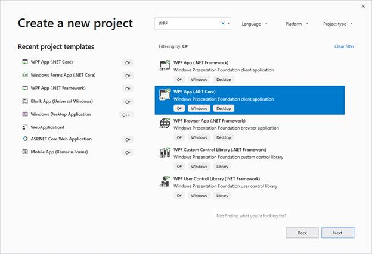
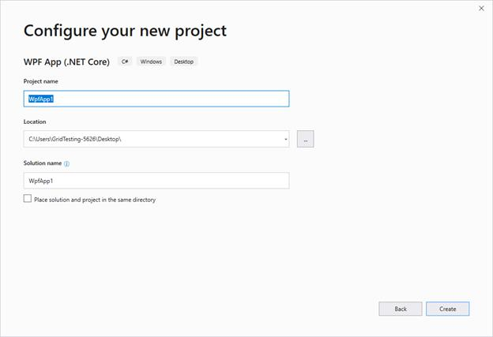
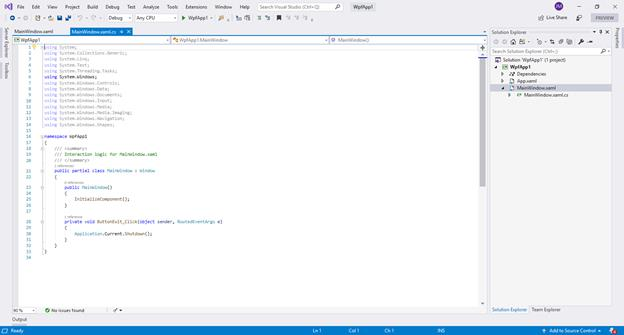
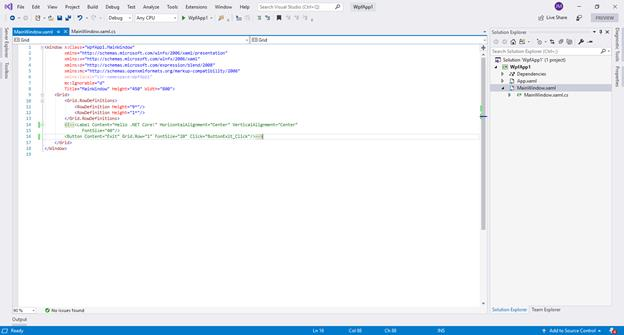

# WPF Applications using .NET Core and Syncfusion WPF Controls

Syncfusion Essential Studio for WPF ships .NET core assemblies for building WPF .NET Core applications using Syncfusion Controls. This section explains how to create the project in .NET Core application and using syncfusion WPF controls.

N> All Syncfusion WPF controls supports .NET Core Framework except the controls labeled as `classic`. 

## Create a .NET Core project

**Step 1**: Open Visual Studio, go to **File > New > Project...** and you can now see **Create a new project** dialog. Here, select **WPF App (.NET Core)** template and click **Next**.

**Step 2**: You will now see **Configure your new project** dialog. Here, fill in the necessary details and click **Create**.

**Step 3**: Finally, WPF (.NET Core) sample project is created.

**Step 4**: Before adding your controls into the application, first you need to remove the default template like in the below screenshot.

N> If you do not remove the default template, you cannot see your control in the output window.

**Step 5**: Now, you can add your controls. To do so, follow the immediate section **Adding controls in WPF (.NET Core) application** for more details. 

## Adding controls in WPF (.NET Core) application

The below section explains how to add controls in WPF (.NET Core) application.

### Through assembly deployment

In **Solution Explorer**, right-click on **Dependencies** and select **Add Reference**.

Now, **Reference Manager** dialog will be opened. Here click **Browse** and can select the needed assemblies from the location mentioned in below note section. On selecting necessary assemblies, click **Add** and then click **OK**. Now, required assemblies are added in to the project, like in the below screenshot.

N> You can get Syncfusion WPF (.NET Core) controls assemblies from `netcoreapp3.0` folder in the following location - C:\Program Files (x86)\Syncfusion\Essential Studio\WPF\x.x.x.x\precompiledassemblies

### Through NuGet Package

[Click here](https://help.syncfusion.com/wpf/nuget-packages) to find more details regarding how to install the NuGet packages in WPF application.

### Example: Adding ButtonAdv control

We are now going to see a demo on how to add **ButtonAdv** control in WPF (.NET Core) application.

**Step 1**:	Add the following dependent assembly for the inclusion of **ButtonAdv** control.

•	Syncfusion.Shared.WPF

**Step 2**:	We can add button either using code behind or through XAML code. Both methods are explained below.

a.	Following code explains how to declare the **ButtonAdv** control through XAML.




<Window x:Class="WpfApp1.MainWindow"
        xmlns="http://schemas.microsoft.com/winfx/2006/xaml/presentation"
        xmlns:x="http://schemas.microsoft.com/winfx/2006/xaml"
        xmlns:d="http://schemas.microsoft.com/expression/blend/2008"
        xmlns:mc="http://schemas.openxmlformats.org/markup-compatibility/2006"
        xmlns:local="clr-namespace:WpfApp1"
        xmlns:sync="http://schemas.syncfusion.com/wpf"
        mc:Ignorable="d"
        Title="MainWindow" Height="450" Width="800">

<sync:ButtonAdv Label="Hello World" Height = “35” Width = “150”/>




b.	Following code explains how to declare the **ButtonAdv** control through code.




using Syncfusion.Windows.Tools.Controls;

ButtonAdv button = new ButtonAdv();
button.Height = 35;
button.width = 150;
button.Label = "Hello World!";
ROOT_Grid.Children.Add(button);




**Step 3**: Run the application.

