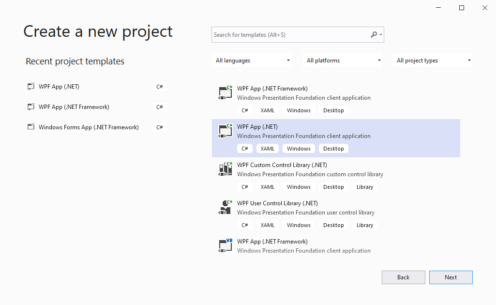
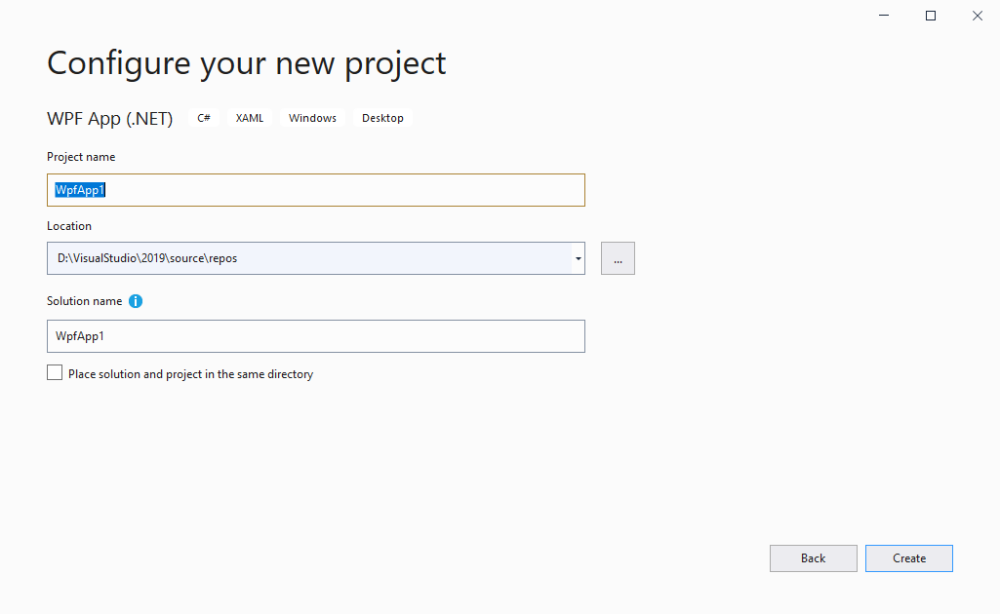
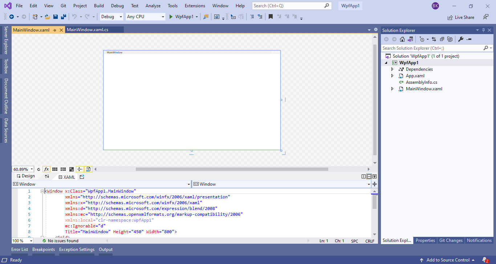
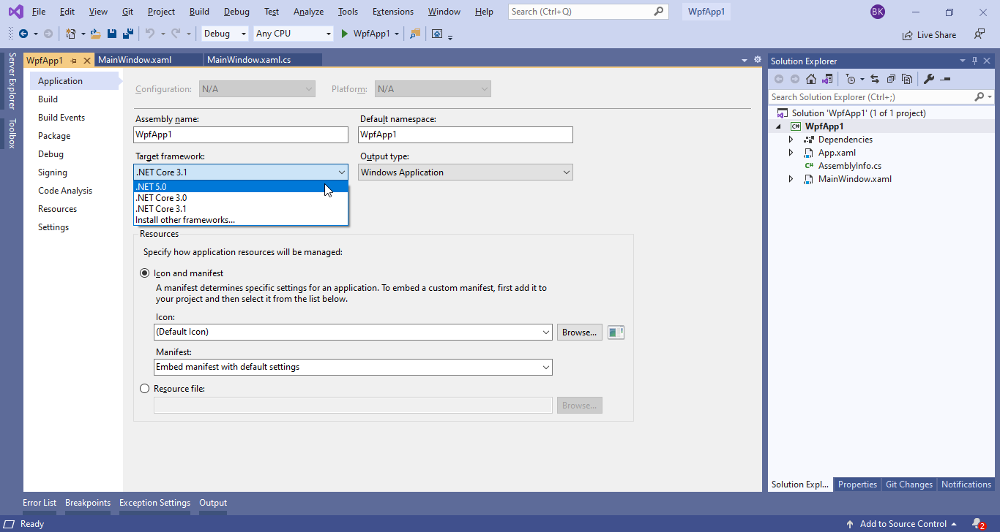
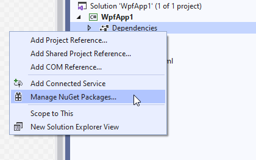
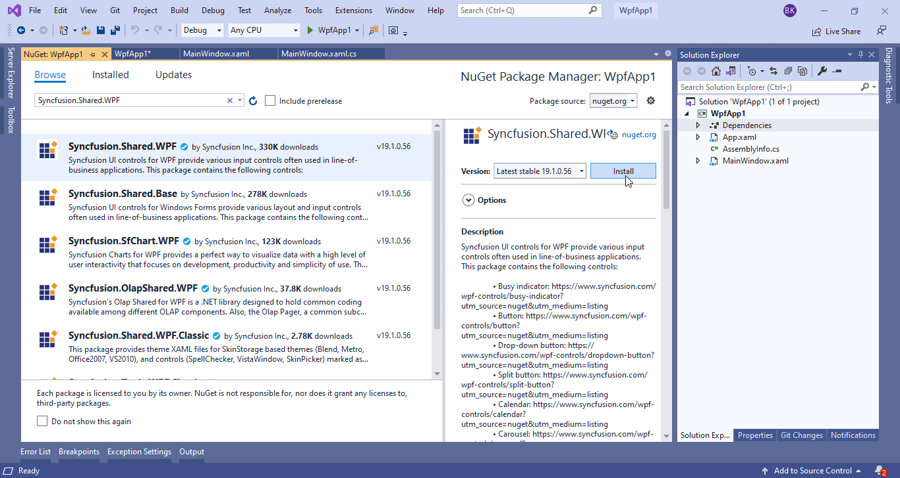
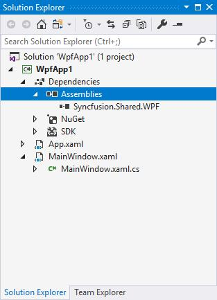
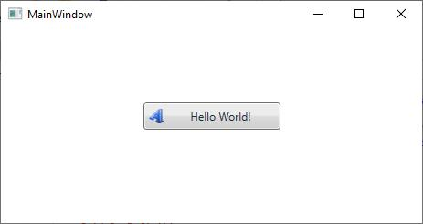

# Getting started with .NET core 3.1 and .NET 5

Syncfusion Essential Studio for WPF ships .NET core 3.1 and .NET 5 assemblies for building WPF .NET Core applications using Syncfusion Controls. This section explains how to create the project in .NET Core application and using syncfusion WPF controls.

N> All Syncfusion WPF controls supports .NET Core 3.1 and .NET 5 Framework except the controls labeled as `classic`.

## Adding Reference

You can add the Syncfusion assembly references in one of the following ways.

* NuGet
* Adding assembly references from installed location

### NuGet

Refer [control dependencies](https://help.syncfusion.com/wpf/control-dependencies) section to know control and its NuGet to use in the application. After that, add the required NuGet as reference and then you can use the control from ToolBox. The ToolBox will show a list of available controls once you have installed the NuGet package.

[Click here](https://help.syncfusion.com/wpf/visual-studio-integration/nuget-packages) to find more details about installing the NuGet package in your application.

### Adding assembly references from installed location

You can also add the Syncfusion WPF (.NET Core 3.1 and .NET 5) controls assemblies from `precompiledassemblies` folder in the following location.

<table>
<tr>
<td>.NET Core 3.1</td>
<td>C:\Program Files (x86)\Syncfusion\Essential Studio\WPF\{{ site.releaseversion }}\precompiledassemblies\netcoreapp3.1</td>
</tr>
<tr>
<td>.NET 5</td>
<td>C:\Program Files (x86)\Syncfusion\Essential Studio\WPF\{{ site.releaseversion }}\precompiledassemblies\net5.0</td>
</tr>
</table>

## Creating the project

To create the .NET Core 3.1 or .NET 5 project by using the following ways.

### Create a .NET Core project

**Step 1**: Open Visual Studio 2019 and click **Create a new project**. Here, select **WPF App (.NET Core)** template and click **Next**.

**Step 2**: Now, you can see **Configure your new project** dialog. Here, fill the necessary details and click **Create**. 

**Step 3**: Finally, WPF (.NET Core 3.1) sample project was created.

**Step 4**: Now, you can add your controls. To do so, follow the immediate section [Adding controls in WPF (.NET Core 3.1 or .NET 5) application](https://help.syncfusion.com/wpf/dotnet-core-compatibility#adding-controls-in-wpf-net-core-31-or-net-5-application) for more details. 

### Create a .NET 5 project

**Step 1**: Create a WPF .NET Core project.

**Step 2**: In Solution Explorer, right-click on project and select `Properties`. Now, the project window dialog will be opened.

**Step 3**: Select the **.NET 5** in Target Framework.

**Step 4**: Now, the .NET 5 application was created.

**Step 5**: Now, you can add your controls. To do so, follow the immediate section [Adding controls in WPF (.NET Core 3.1 or .NET 5) application](https://help.syncfusion.com/wpf/dotnet-core-compatibility#adding-controls-in-wpf-net-core-31-or-net-5-application) for more details.

## Adding controls in WPF (.NET Core 3.1 or .NET 5) application

The below section explains how to add controls in WPF (.NET Core 3.1 or .NET 5) application.

For example, let see how to create `ButtonAdv` control in WPF (.NET core 3.1 or .NET 5) application using NuGet package or assembly reference.

### Through NuGet Package

In **Solution Explorer**, right-click on **Dependencies** and select **Manage NuGet Packages...**.

Now, **NuGet Package Manager** window will be opened. Here, select **Browse** and search the required assembly in search box. Select the required assembly and click **Install**.

Now, the required assemblies are added in to the project.

### Through assembly deployment

In **Solution Explorer**, right-click on **Dependencies** and select **Add Reference**.

Now, **Reference Manager** dialog will be opened. Here click **Browse** and can select the needed assemblies from the location mentioned in below note section. On selecting necessary assemblies, click **Add** and then click **OK**. Now, required assemblies are added in to the project, like in the below screenshot.

N> You can get Syncfusion WPF (.NET Core or .NET 5) controls assemblies from `netcoreapp3.1` or `net 5.0` folder in the following location - C:\Program Files (x86)\Syncfusion\Essential Studio\WPF\{{ site.releaseversion }}\precompiledassemblies

### Adding ButtonAdv control

You can add `ButtonAdv` control either using code behind or through XAML code in your WPF (. NET core 3.1 or .NET 5) application.

a.	Following code explains how to create the **ButtonAdv** control through XAML.




<Window x:Class="WpfApp1.MainWindow"
        xmlns="http://schemas.microsoft.com/winfx/2006/xaml/presentation"
        xmlns:x="http://schemas.microsoft.com/winfx/2006/xaml"
        xmlns:d="http://schemas.microsoft.com/expression/blend/2008"
        xmlns:mc="http://schemas.openxmlformats.org/markup-compatibility/2006"
        xmlns:local="clr-namespace:WpfApp1"
        xmlns:sync="http://schemas.syncfusion.com/wpf"
        mc:Ignorable="d"
        Title="MainWindow" Height="450" Width="800">
    <Grid Name="ROOT_Grid">
        <sync:ButtonAdv Label="Hello World" Height = "35" Width = "150"/>
    </Grid>
</Window>




b.	Following code explains how to create the **ButtonAdv** control through code behind.




using Syncfusion.Windows.Tools.Controls;

ButtonAdv button = new ButtonAdv();
button.Height = 35;
button.width = 150;
button.Label = "Hello World!";
ROOT_Grid.Children.Add(button);




