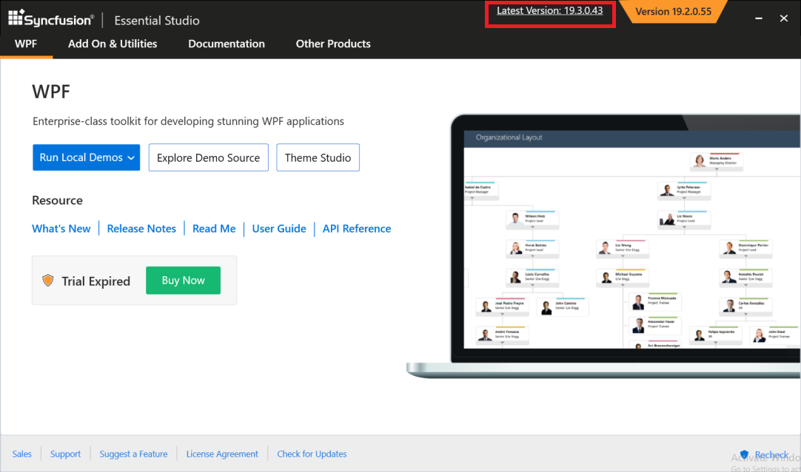

# Upgrading Syncfusion WPF

Syncfusion releases new volumes once every three months, with exciting new features. There will be one Service Pack release for this volume releases. Service Pack releases are provided to address major bug fixes in the volume releases.

You can upgrade to our latest version from any installed Syncfusion version.

See our "[**Upgrade Guide**](https://help.syncfusion.com/upgrade-guide/wpf-ui-controls)" for WPF to learn more about the “Breaking Changes, Bug Fixes, Features and Knows Issues” between your current version and the latest version you are trying to upgrade.

## Upgrading to the latest version

The most recent version of Syncfusion WPF can be downloaded and installed by clicking on the "Latest Version: {Version}" link at the top of the Syncfusion WPF Control Panel.

You can also upgrade to the latest version just by downloading and installing the products you require from [this](https://www.syncfusion.com/downloads/latest-version) link. The existing installed versions are not required to be uninstalled. 

It is not required to install the Volume release before installing the Service Pack release. As releases for Volume and Service Packs work independently, you can install the latest version with major bug fixes directly.

## Upgrade from trial version to license version

Uninstall the trial version and install the fully licensed installer from the [License and Downloads](https://www.syncfusion.com/account/downloads) section of our website to upgrade from the trial version.

N> License key registration is not required for WPF products. So there is no need to generate and register any Syncfusion license keys in your WPF projects.

