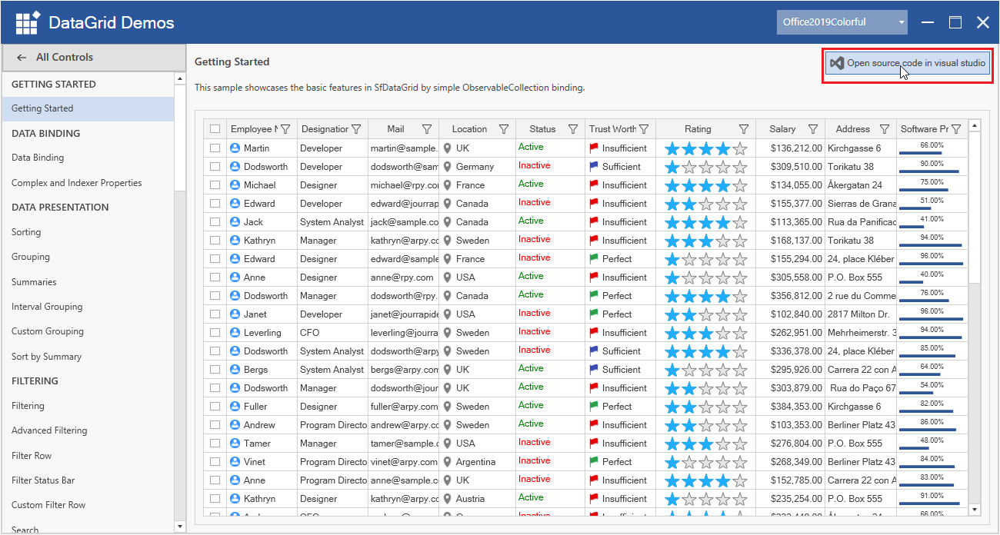
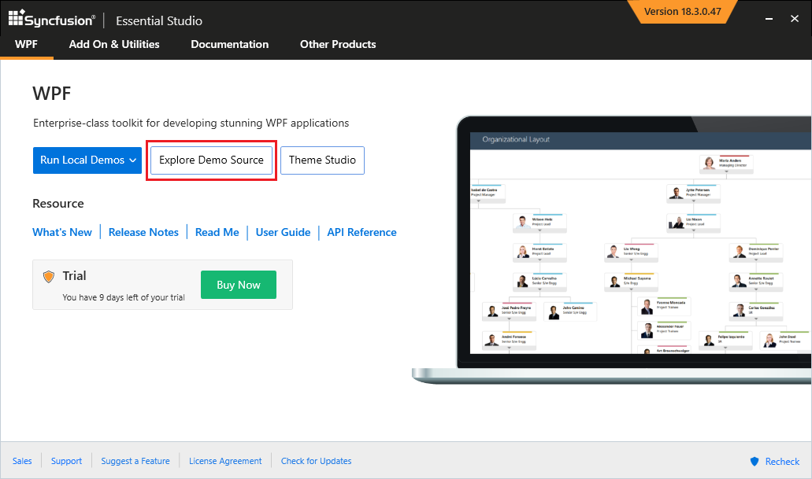
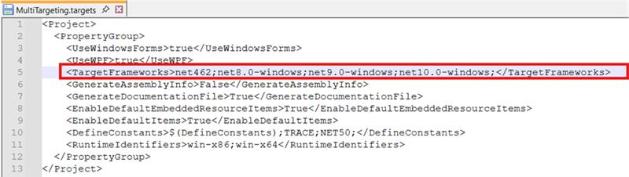

# Featured Samples for Syncfusion&reg; WPF Controls

## Syncfusion&reg; WPF Controls Panel

To explore Syncfusion&reg; WPF controls and components, Open `Syncfusion&reg; WPF Controls Panel` by searching it from start and open. 

In another way, open the Control Panel from the following installed location.

C:\Program Files (x86)\Syncfusion\Essential Studio\WPF\{{ site.releaseversion }}\Infrastructure\Launcher\Syncfusion WPF Control Panel.exe

N> In above section, latest Essential Studio&reg; version details has been provided. You can refer installed Essential Studio&reg; version instead of mentioned version.

## WPF Sample Browser

To explore the locally installed demos, click `Run Local Demos` and select either `.NET Core` or `.NET FrameWork`, which will open `WPF Sample Browser`.

## Offline Samples

The Offline samples are available in the following installed location where you can make changes and further exploration of controls.

C:\Users\Public\Documents\Syncfusion\WPF\{{ site.releaseversion }}\

The offline samples can also be explored directly from the `Syncfusion&reg; WPF Sample Browser` and opened in Visual Studio by running the required sample and selecting the `Open source code in visual studio`.

### Offline showcase samples

To explore any individual showcase sample from the `Syncfusion&reg; WPF Sample Browser`, Click `Explore Demo Source` and navigate to `showcase` folder.

All the sample browser projects are configured as single SDK-style projects that support multiple frameworks: `.NET Framework 4.6.2`, `.NET 8.0`, `.NET 9.0`, and `.NET 10`. 

When you click the `Explore Demo Source` button, the `net10.0-windows` entry will be automatically removed from the targets file if .NET 10 is not installed on your machine, preventing any compilation errors. 

To use the `.NET 10 framework`, install the required SDK and add `net10.0-windows` to the <TargetFrameworks> tag in the `MultiTargeting.targets` file located at the Samples Location: D:\WPF31.2.9\WPF\31.2.9\SampleBrowser\targets\MultiTargeting.targets as shown in the image below. 

If you don’t have other frameworks installed and encounter compilation issues as a result, you can remove the unsupported framework from the <TargetFrameworks> tag in the same file and retain only the available ones to resolve the issue. 

N> To run the individual control demos, please refer the instruction from [Running Individual Control Demos](https://github.com/syncfusion/wpf-demos#running-individual-control-demos). 

## Online Samples

* Download and install `.Net Framework` demos from [Microsoft Store](https://www.microsoft.com/en-us/p/syncfusion-wpf-controls-examples/9n99kdhrff6g?activetab=pivot:overviewtab).

## Download demos from online (Clone from github repository)

You can explore Syncfusion&reg; WPF controls using [GitHub WPF demos](https://github.com/syncfusion/wpf-demos), where all wpf demos are configured using `NuGet` to run without installing Syncfusion&reg; WPF Studio.

### Download showcase demos from online

You can explore showcase demos from [GitHub WPF demos](https://github.com/syncfusion/wpf-demos/tree/master/showcase).
