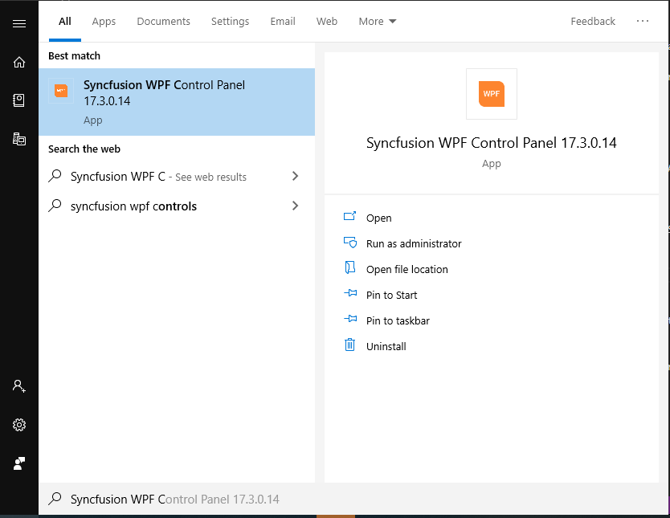
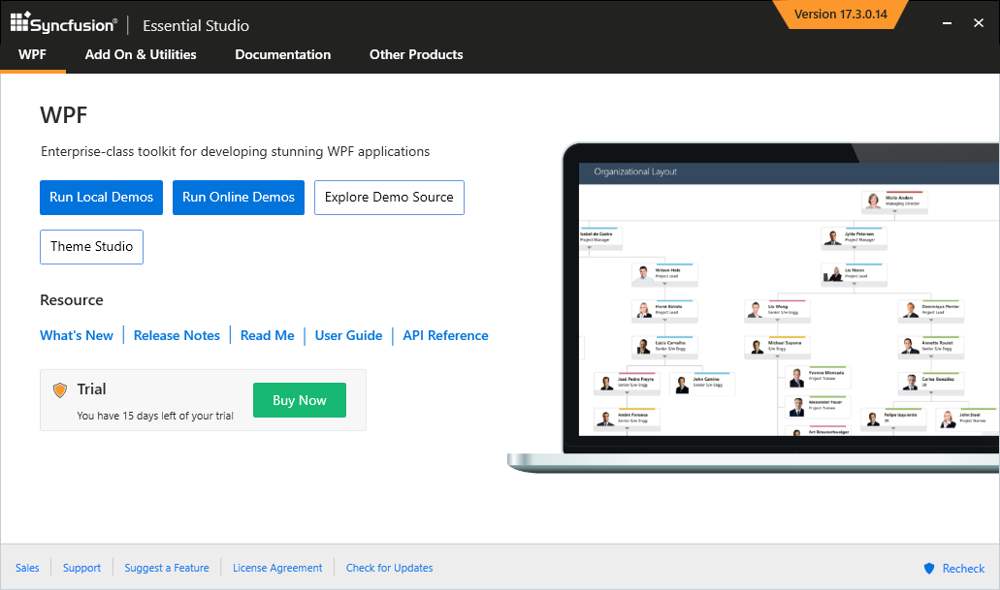
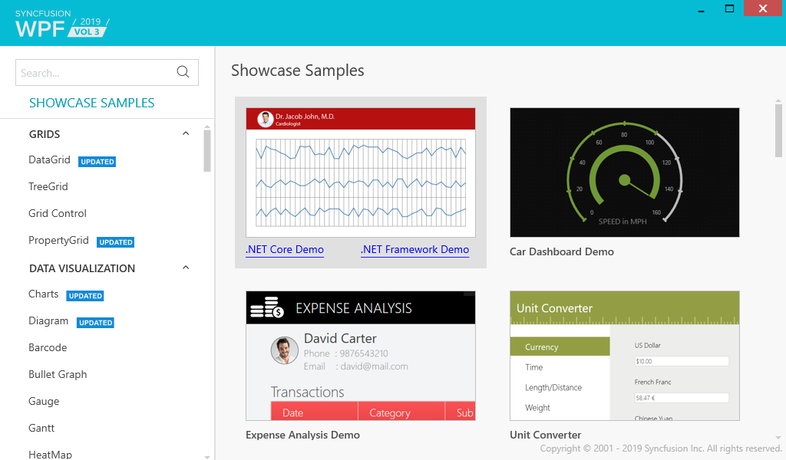

# Featured Samples 

## Syncfusion WPF Controls Panel

To explore Syncfusion WPF controls and components, Open `Syncfusion WPF Controls Panel` by searching it from start and open. 

In another way, Open the Control Panel from the following installed location,

C:\Program Files (x86)\Syncfusion\Essential Studio\WPF\{{ site.releaseversion }}\Infrastructure\Launcher\Syncfusion WPF Control Panel.exe

N> In above section, Latest Essential Studio version details has been provided. You can refer installed Essential Studio version instead of mentioned version.

## WPF Sample Browser

To explore the locally installed demos, click `Run Local Demos` which will open `WPF Sample Browser`.

## Offline Samples

`Syncfusion WPF Sample Browser` compile and launch the samples installed by Syncfusion installer. The samples are available in the following installed location where you can make changes and further exploration of controls.

C:\Users\Public\Documents\Syncfusion\WPF\{{ site.releaseversion }}\

## Online Samples

Download or install [online samples](https://www.syncfusion.com/demos) from [here](https://www.syncfusion.com/demos)

## GitHub Demos

You can explore Syncfusion WPF controls using [GitHub WPF demos](https://github.com/syncfusion/wpf-demos) where all wpf demos are configured using `NuGet` to run without installing Syncfusion WPF Studio. 

N> Explore Syncfusion Controls in [GitHub](https://github.com/syncfusion/wpf-demos).